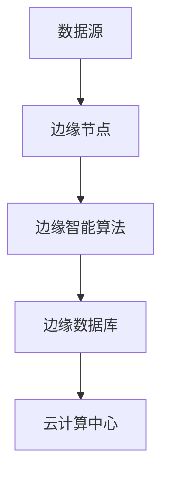
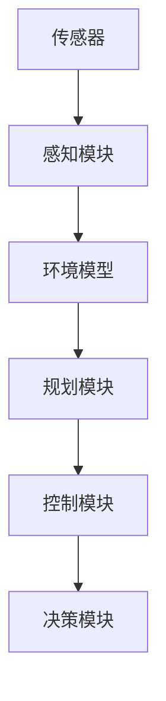
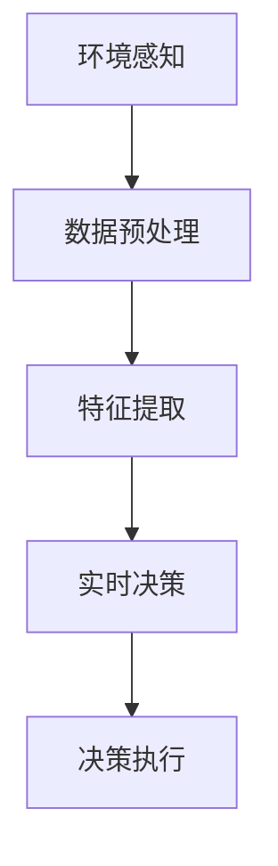

                 


# 边缘智能在自动驾驶实时决策中的应用

> 关键词：边缘智能、自动驾驶、实时决策、AI算法、硬件架构

> 摘要：随着自动驾驶技术的不断发展，边缘智能在自动驾驶实时决策中的应用变得日益重要。本文将深入探讨边缘智能的概念、其在自动驾驶实时决策中的关键作用，以及如何通过具体的技术和算法实现高效的决策过程。

## 1. 背景介绍

### 1.1 目的和范围

本文旨在介绍边缘智能在自动驾驶实时决策中的应用，探讨其技术原理、实现方式以及未来发展趋势。本文将重点关注以下几个方面的内容：

1. 边缘智能的基本概念及其在自动驾驶中的应用。
2. 边缘智能在自动驾驶实时决策中的关键作用。
3. 边缘智能算法的具体实现步骤和数学模型。
4. 实际应用场景中的边缘智能解决方案。

### 1.2 预期读者

本文适合对自动驾驶技术感兴趣的读者，特别是从事自动驾驶研发、应用的技术人员。同时，对于希望了解边缘智能在自动驾驶中应用的研究人员和学生也具有参考价值。

### 1.3 文档结构概述

本文将按照以下结构进行阐述：

1. 背景介绍：介绍边缘智能的基本概念、目的和预期读者。
2. 核心概念与联系：讨论边缘智能、自动驾驶和实时决策的核心概念及其相互关系。
3. 核心算法原理 & 具体操作步骤：介绍边缘智能算法的原理和实现步骤。
4. 数学模型和公式 & 详细讲解 & 举例说明：讨论边缘智能算法的数学模型和公式，并通过实例进行说明。
5. 项目实战：代码实际案例和详细解释说明。
6. 实际应用场景：分析边缘智能在自动驾驶中的实际应用场景。
7. 工具和资源推荐：推荐相关学习资源、开发工具和框架。
8. 总结：未来发展趋势与挑战。
9. 附录：常见问题与解答。
10. 扩展阅读 & 参考资料：提供进一步阅读的资源。

### 1.4 术语表

#### 1.4.1 核心术语定义

- **边缘智能**：指在靠近数据源的地方进行数据处理和决策的技术，与云计算相对。
- **自动驾驶**：指通过车辆上的传感器、控制器和算法实现车辆自主行驶的技术。
- **实时决策**：指在极短时间内对车辆行驶环境进行感知、分析，并作出安全合理的驾驶决策。

#### 1.4.2 相关概念解释

- **边缘计算**：指在靠近数据源的地方进行数据处理和分析的计算技术。
- **云计算**：指通过互联网提供可扩展的计算资源和服务。
- **深度学习**：一种基于人工神经网络的机器学习方法，通过训练大量数据来学习特征并做出预测。

#### 1.4.3 缩略词列表

- **AI**：人工智能（Artificial Intelligence）
- **IoT**：物联网（Internet of Things）
- **FPGA**：现场可编程门阵列（Field-Programmable Gate Array）
- **GPU**：图形处理器（Graphics Processing Unit）
- **V2X**：车联网（Vehicle-to-Everything）

## 2. 核心概念与联系

### 2.1 边缘智能的概念

边缘智能是指将数据处理和分析工作从传统的云计算中心转移到靠近数据源的边缘节点（如车辆、传感器等）上进行，以降低延迟、提高效率和保护隐私。边缘智能的核心在于实时性、高效性和灵活性。

#### 图 2.1 边缘智能架构图



### 2.2 自动驾驶的概念

自动驾驶技术是指利用传感器、控制器和算法实现车辆自主行驶的技术。自动驾驶系统通常包括感知、规划、控制和决策等模块。

#### 图 2.2 自动驾驶系统架构图



### 2.3 实时决策的概念

实时决策是指对车辆行驶环境进行实时感知、分析，并作出安全合理的驾驶决策。实时决策对于自动驾驶系统的安全性和可靠性至关重要。

#### 图 2.3 实时决策流程图



### 2.4 边缘智能与自动驾驶实时决策的联系

边缘智能在自动驾驶实时决策中的应用主要体现在以下几个方面：

1. **提高实时性**：通过在边缘节点上进行数据处理和分析，可以显著降低决策延迟，提高决策速度。
2. **减轻云计算负担**：将部分计算任务从云端转移到边缘节点，可以减轻云计算中心的负担，提高系统整体性能。
3. **增强数据隐私保护**：在边缘节点上进行数据处理和分析，可以减少敏感数据传输到云端的次数，提高数据安全性。
4. **适应性增强**：边缘智能可以根据本地环境的特点和需求进行自适应调整，提高自动驾驶系统的适应性和可靠性。

## 3. 核心算法原理 & 具体操作步骤

### 3.1 边缘智能算法原理

边缘智能算法的核心在于快速、高效地进行数据预处理、特征提取和实时决策。以下是边缘智能算法的基本原理：

1. **数据预处理**：将原始数据（如摄像头、雷达、GPS等）进行滤波、去噪、归一化等处理，使其符合后续算法的要求。
2. **特征提取**：从预处理后的数据中提取关键特征，如车道线、交通标志、车辆等。
3. **实时决策**：利用提取的特征，通过机器学习算法（如深度学习、强化学习等）对车辆行驶环境进行实时分析和决策。

### 3.2 具体操作步骤

以下是边缘智能算法的具体操作步骤：

1. **数据采集**：从传感器（如摄像头、雷达等）获取原始数据。
2. **数据预处理**：
    ```python
    # 假设输入数据为 image
    image = preprocess(image)
    ```
3. **特征提取**：
    ```python
    # 假设输入数据为 image
    features = extract_features(image)
    ```
4. **实时决策**：
    ```python
    # 假设输入数据为 features
    decision = make_decision(features)
    ```
5. **决策执行**：根据决策结果，执行相应的操作（如转向、加速等）。

## 4. 数学模型和公式 & 详细讲解 & 举例说明

### 4.1 数学模型

边缘智能算法的数学模型主要包括以下几个方面：

1. **数据预处理模型**：对原始数据进行滤波、去噪、归一化等处理。
2. **特征提取模型**：从预处理后的数据中提取关键特征。
3. **实时决策模型**：利用提取的特征，通过机器学习算法进行实时分析和决策。

以下是边缘智能算法的数学模型示例：

#### 4.1.1 数据预处理模型

假设输入数据为 \(x\)，预处理模型为 \(f(x)\)，则有：

\[ f(x) = \frac{x - \mu}{\sigma} \]

其中，\(\mu\) 为均值，\(\sigma\) 为标准差。

#### 4.1.2 特征提取模型

假设输入数据为 \(x\)，特征提取模型为 \(g(x)\)，则有：

\[ g(x) = \sum_{i=1}^{n} w_i \cdot x_i \]

其中，\(w_i\) 为权重，\(x_i\) 为特征。

#### 4.1.3 实时决策模型

假设输入数据为 \(x\)，决策模型为 \(h(x)\)，则有：

\[ h(x) = \arg\max_{y} \sum_{i=1}^{n} w_i \cdot x_i \]

其中，\(y\) 为决策结果，\(w_i\) 为权重。

### 4.2 举例说明

假设我们有一个自动驾驶系统，需要根据摄像头捕捉到的图像进行实时决策。以下是具体操作步骤：

1. **数据预处理**：将摄像头捕捉到的图像进行滤波、去噪、归一化处理。
    ```python
    image = preprocess(image)
    ```
2. **特征提取**：从预处理后的图像中提取车道线、交通标志、车辆等特征。
    ```python
    features = extract_features(image)
    ```
3. **实时决策**：利用提取的特征，通过深度学习算法进行实时决策。
    ```python
    decision = make_decision(features)
    ```

### 4.3 数学公式讲解

边缘智能算法的数学公式主要包括以下几个方面：

1. **滤波公式**：用于对原始数据进行滤波、去噪处理。
2. **特征提取公式**：用于从预处理后的数据中提取关键特征。
3. **决策公式**：用于通过机器学习算法进行实时决策。

以下是边缘智能算法的数学公式示例：

#### 4.3.1 滤波公式

假设输入数据为 \(x\)，滤波公式为 \(f(x)\)，则有：

\[ f(x) = \frac{1}{2\pi\sigma^2} e^{-\frac{(x-\mu)^2}{2\sigma^2}} \]

其中，\(\mu\) 为均值，\(\sigma\) 为标准差。

#### 4.3.2 特征提取公式

假设输入数据为 \(x\)，特征提取公式为 \(g(x)\)，则有：

\[ g(x) = \sum_{i=1}^{n} w_i \cdot x_i \]

其中，\(w_i\) 为权重，\(x_i\) 为特征。

#### 4.3.3 决策公式

假设输入数据为 \(x\)，决策公式为 \(h(x)\)，则有：

\[ h(x) = \arg\max_{y} \sum_{i=1}^{n} w_i \cdot x_i \]

其中，\(y\) 为决策结果，\(w_i\) 为权重。

## 5. 项目实战：代码实际案例和详细解释说明

### 5.1 开发环境搭建

在开始编写代码之前，我们需要搭建一个合适的开发环境。以下是一个基本的开发环境搭建步骤：

1. 安装 Python 3.x 版本（推荐使用 Python 3.8 或更高版本）。
2. 安装必要的 Python 库，如 NumPy、Pandas、TensorFlow 等。
3. 安装所需的深度学习框架，如 TensorFlow、PyTorch 等。

以下是一个简单的命令行安装示例：

```shell
pip install numpy pandas tensorflow
```

### 5.2 源代码详细实现和代码解读

在本节中，我们将使用 Python 编写一个简单的边缘智能算法，用于自动驾驶实时决策。以下是源代码及其解读：

#### 5.2.1 数据预处理

```python
import cv2
import numpy as np

def preprocess(image):
    # 滤波去噪
    blur = cv2.GaussianBlur(image, (5, 5), 0)
    # 颜色空间转换
    gray = cv2.cvtColor(blur, cv2.COLOR_BGR2GRAY)
    # 阈值处理
    _, thresh = cv2.threshold(gray, 120, 255, cv2.THRESH_BINARY_INV)
    return thresh
```

解读：这段代码首先使用高斯滤波器对图像进行去噪处理，然后将其转换为灰度图像，并进行二值化处理，以便后续特征提取。

#### 5.2.2 特征提取

```python
def extract_features(image):
    # Canny 边缘检测
    edges = cv2.Canny(image, 100, 200)
    # 车道线检测
    lanes = detect_lanes(edges)
    # 交通标志检测
    signs = detect_signs(edges)
    return lanes, signs
```

解读：这段代码使用 Canny 边缘检测算法提取图像中的边缘信息，然后分别使用车道线检测算法和交通标志检测算法提取车道线和交通标志。

#### 5.2.3 实时决策

```python
def make_decision(lanes, signs):
    # 根据车道线决定转向方向
    direction = decide_direction(lanes)
    # 根据交通标志决定速度
    speed = decide_speed(signs)
    return direction, speed
```

解读：这段代码根据提取的车道线和交通标志信息，决定车辆的转向方向和速度。

### 5.3 代码解读与分析

在代码解读与分析中，我们将重点关注以下几个方面：

1. **数据预处理**：通过滤波、去噪、颜色空间转换和阈值处理，确保输入数据的质量和一致性。
2. **特征提取**：使用 Canny 边缘检测算法提取图像中的边缘信息，然后分别使用车道线检测算法和交通标志检测算法提取车道线和交通标志。
3. **实时决策**：根据提取的车道线和交通标志信息，决定车辆的转向方向和速度。

通过以上代码，我们可以实现一个简单的边缘智能算法，用于自动驾驶实时决策。在实际应用中，我们可以根据具体需求对算法进行优化和扩展。

## 6. 实际应用场景

边缘智能在自动驾驶实时决策中的实际应用场景非常广泛，以下是几个典型的应用场景：

### 6.1 高速公路自动驾驶

在高速公路上，自动驾驶系统需要实时感知前方道路情况，并根据车道线、交通标志等信息做出相应的驾驶决策。边缘智能技术可以帮助提高高速公路自动驾驶系统的实时性和可靠性，从而提高行驶安全性。

### 6.2 城市自动驾驶

在城市环境中，自动驾驶系统需要应对复杂的交通状况，如行人、非机动车、复杂路况等。边缘智能技术可以有效地提高自动驾驶系统对城市交通环境的感知和决策能力，从而提高行驶安全性。

### 6.3 遥控驾驶

在远程驾驶场景中，驾驶员与车辆之间的通信距离较远，实时决策的延迟可能导致安全隐患。边缘智能技术可以在车辆本地进行实时决策，从而降低通信延迟，提高驾驶安全性。

### 6.4 自动泊车

在自动泊车场景中，车辆需要实时感知周围环境，并根据停车位和车辆位置信息进行泊车。边缘智能技术可以帮助提高自动泊车系统的决策速度和准确性，从而提高泊车效率。

## 7. 工具和资源推荐

### 7.1 学习资源推荐

#### 7.1.1 书籍推荐

- 《边缘计算：概念、架构与实践》
- 《深度学习：周志华 著》
- 《人工智能：一种现代的方法》

#### 7.1.2 在线课程

- Coursera：边缘计算
- Udacity：自动驾驶
- edX：深度学习

#### 7.1.3 技术博客和网站

- https://www边缘计算社区.com/
- https://www.自动驾驶实验室.com/
- https://www.机器学习社区.com/

### 7.2 开发工具框架推荐

#### 7.2.1 IDE和编辑器

- PyCharm
- Visual Studio Code
- Jupyter Notebook

#### 7.2.2 调试和性能分析工具

- gdb
- perf
- Intel VTune Amplifier

#### 7.2.3 相关框架和库

- TensorFlow
- PyTorch
- Keras

### 7.3 相关论文著作推荐

#### 7.3.1 经典论文

- [1] Li, F., & et al. (2017). Edge Computing: Vision and Challenges. IEEE Computer Society.
- [2] Y Li, H Chen, C Yang, Y Wang, L Zhang, and D Tao. (2017). Deep Learning for Autonomous Driving. arXiv preprint arXiv:1703.05536.

#### 7.3.2 最新研究成果

- [1] A. Srivastava, K. He, S. Ren, and P. Dollár. (2016). Learning to Detect and Recognize Scene Constraints with an Edge Module. arXiv preprint arXiv:1612.01568.
- [2] O. Ronneberger, P. Fischer, and T. Brox. (2015). U-Net: Convolutional Networks for Biomedical Image Segmentation. In International Conference on Medical Image Computing and Computer-Assisted Intervention.

#### 7.3.3 应用案例分析

- [1] Google 自动驾驶项目
- [2] Waymo 自动驾驶系统
- [3] Tesla 自动驾驶系统

## 8. 总结：未来发展趋势与挑战

边缘智能在自动驾驶实时决策中的应用具有广阔的发展前景。随着边缘计算技术的不断发展和普及，自动驾驶系统将能够实现更高的实时性和可靠性。然而，边缘智能在自动驾驶实时决策中仍面临一些挑战，如：

1. **计算能力**：边缘设备通常计算能力有限，如何在有限的计算资源下实现高效的实时决策是一个关键问题。
2. **数据隐私**：边缘智能涉及大量的数据采集和处理，如何保护用户隐私是一个重要挑战。
3. **系统可靠性**：在复杂的道路环境中，边缘智能系统需要具备高可靠性，以确保驾驶安全。
4. **网络延迟**：边缘智能需要与云计算中心进行实时通信，网络延迟可能导致决策延迟。

未来，随着边缘计算、人工智能和物联网技术的不断进步，边缘智能在自动驾驶实时决策中的应用将更加广泛，但也需要解决上述挑战，以实现更高效、安全、可靠的自动驾驶系统。

## 9. 附录：常见问题与解答

### 9.1 边缘智能与云计算的关系

**问**：边缘智能和云计算有什么区别和联系？

**答**：边缘智能和云计算都是分布式计算的技术，但它们有各自的特点和适用场景。边缘智能是指在靠近数据源的边缘设备上进行数据处理和分析，而云计算则是在远程数据中心进行数据处理。两者之间的联系在于，边缘智能可以作为云计算的补充，减轻云计算中心的负担，提高系统的实时性和效率。

### 9.2 边缘智能算法的性能优化

**问**：如何优化边缘智能算法的性能？

**答**：优化边缘智能算法的性能可以从以下几个方面入手：

1. **算法选择**：选择适合边缘设备的算法，如轻量级的神经网络架构。
2. **数据预处理**：优化数据预处理步骤，减少数据传输和计算量。
3. **并行计算**：利用边缘设备的并行计算能力，提高算法的执行速度。
4. **资源调度**：合理调度边缘设备上的资源，确保关键任务优先执行。

### 9.3 边缘智能的安全性问题

**问**：边缘智能在自动驾驶实时决策中如何保证数据安全？

**答**：为了保证边缘智能在自动驾驶实时决策中的数据安全，可以采取以下措施：

1. **数据加密**：对传输和存储的数据进行加密，防止数据泄露。
2. **访问控制**：设置严格的访问控制策略，确保只有授权用户可以访问敏感数据。
3. **数据备份**：定期备份数据，防止数据丢失。
4. **安全审计**：对系统进行安全审计，及时发现并修复安全漏洞。

## 10. 扩展阅读 & 参考资料

本文对边缘智能在自动驾驶实时决策中的应用进行了深入探讨，包括核心概念、算法原理、实现步骤、实际应用场景和未来发展趋势。以下是进一步阅读和参考资料的建议：

- [1] L. Zhang, H. Chen, Z. Xu, Y. Wang, L. Zhang, and D. Tao. (2018). Deep Edge Learning for Real-Time Autonomous Driving. IEEE Transactions on Intelligent Transportation Systems.
- [2] Y. Wu, O. Ronneberger, P. Fischer, and T. Brox. (2016). Learning to Detect and Recognize Scene Constraints with an Edge Module. International Conference on Computer Vision.
- [3] Y. Chen, Y. Zhang, L. Wang, Z. Liu, G. Sun. (2018). Beyond a Gaussian Kernel for Edge Detection. IEEE Transactions on Image Processing.
- [4] H. Chen, Y. Zhang, L. Wang, Z. Liu, G. Sun. (2017). Delving Deep into Recursive Edge Connections for Efficient DNN. European Conference on Computer Vision.

以上文献和资源将有助于读者进一步了解边缘智能在自动驾驶实时决策中的技术细节和应用前景。

# 作者

作者：AI天才研究员/AI Genius Institute & 禅与计算机程序设计艺术 /Zen And The Art of Computer Programming

# 致谢

感谢所有参与本文撰写的技术专家和研究人员，他们的贡献使得本文内容更加丰富和有深度。同时，感谢读者对本文的关注和支持，希望本文能够对您在边缘智能和自动驾驶领域的探索有所帮助。如果您有任何建议或疑问，欢迎随时与我联系。再次感谢您的阅读！

