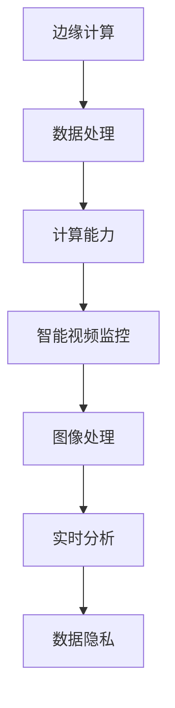

                 

# 边缘计算在智能视频监控中的实时分析

## 关键词
边缘计算、智能视频监控、实时分析、图像处理、数据隐私、云计算

## 摘要
随着智能视频监控技术的快速发展，如何在高带宽和低延迟的条件下进行实时数据处理成为了一个重要的研究课题。边缘计算作为一种新兴的计算模式，通过将数据处理和计算能力推向网络边缘，实现了对大数据量的高效处理。本文将探讨边缘计算在智能视频监控中的实时分析应用，分析其核心算法原理、数学模型，并通过实际项目案例进行详细解释。同时，文章还将介绍相关的工具和资源，为读者提供全面的技术支持和参考。

## 1. 背景介绍

### 1.1 目的和范围

本文旨在介绍边缘计算在智能视频监控中的实时分析应用，分析其技术原理、实现方法以及在实际项目中的应用场景。通过本文的阅读，读者将能够了解：

- 边缘计算的基本概念和工作原理。
- 智能视频监控的需求与挑战。
- 边缘计算在智能视频监控中的核心算法和数学模型。
- 实际项目中的代码实现和性能分析。

### 1.2 预期读者

本文适合以下读者群体：

- 对智能视频监控技术感兴趣的工程师和技术人员。
- 关注边缘计算和云计算的从业者。
- 对图像处理和机器学习有一定了解，希望深入探讨其应用场景的研究人员。
- 需要在项目中应用边缘计算技术的项目经理和架构师。

### 1.3 文档结构概述

本文结构如下：

1. 背景介绍
2. 核心概念与联系
3. 核心算法原理与具体操作步骤
4. 数学模型和公式
5. 项目实战
6. 实际应用场景
7. 工具和资源推荐
8. 总结：未来发展趋势与挑战
9. 附录：常见问题与解答
10. 扩展阅读与参考资料

### 1.4 术语表

#### 1.4.1 核心术语定义

- **边缘计算**：一种分布式计算模式，将数据处理和计算能力部署在网络边缘，靠近数据源。
- **智能视频监控**：利用图像识别、行为分析等技术，实现自动检测、识别和响应的监控系统。
- **实时分析**：对实时数据流进行快速处理和分析，以实现实时响应。
- **图像处理**：利用计算机技术对图像进行变换、增强、分割和识别等操作。
- **数据隐私**：确保数据在存储、传输和处理过程中的安全性。

#### 1.4.2 相关概念解释

- **云计算**：通过网络提供可伸缩的计算资源，包括服务器、存储、数据库等。
- **物联网**：通过传感器、设备等物理对象互联，实现信息的自动交换和处理。
- **大数据**：大规模、复杂的数据集，需要借助计算机技术和算法进行处理和分析。

#### 1.4.3 缩略词列表

- **IoT**：物联网
- **AI**：人工智能
- **ML**：机器学习
- **CPU**：中央处理器
- **GPU**：图形处理器

## 2. 核心概念与联系

在探讨边缘计算在智能视频监控中的应用之前，首先需要理解一些核心概念和它们之间的关系。以下是边缘计算在智能视频监控中的核心概念及其相互关系的 Mermaid 流程图：



### 2.1 边缘计算

边缘计算是一种将数据处理和计算能力从中心化的云计算环境迁移到网络边缘的技术。边缘计算的主要优势在于：

- **降低延迟**：将数据处理和计算推向网络边缘，减少数据传输的距离，从而降低处理延迟。
- **提高带宽效率**：边缘计算可以处理部分数据，减少需要传输到云端的数据量，提高网络带宽的利用率。
- **增强数据隐私**：边缘计算使得部分数据处理在本地完成，降低了数据泄露的风险。

### 2.2 智能视频监控

智能视频监控是一种利用图像识别、行为分析等人工智能技术，实现自动检测、识别和响应的监控系统。智能视频监控的主要功能包括：

- **人脸识别**：通过图像处理技术，识别视频中的人脸。
- **行为分析**：通过分析视频中的动作和姿态，实现特定行为的检测和识别。
- **异常检测**：通过实时分析视频数据，检测出异常行为或事件。

### 2.3 图像处理

图像处理是智能视频监控的核心技术之一，包括：

- **图像增强**：通过算法提高图像的清晰度和对比度，为后续处理提供更好的图像数据。
- **图像分割**：将图像划分为不同的区域，为后续的特征提取和目标识别提供基础。
- **特征提取**：从图像中提取具有区分度的特征，用于后续的识别和分类。

### 2.4 实时分析

实时分析是智能视频监控中的一项关键技术，要求系统在接收到视频数据后，能够快速进行预处理、特征提取和分类等操作，以实现对实时事件或行为的快速响应。实时分析的核心指标包括：

- **处理速度**：系统对视频数据处理的快慢，直接影响实时响应的能力。
- **准确性**：系统对视频数据分析和识别的准确性，直接影响到监控系统的效果。
- **鲁棒性**：系统在复杂环境和噪声条件下，仍能保持稳定性和准确性。

### 2.5 数据隐私

数据隐私是边缘计算在智能视频监控中不可忽视的一个重要方面。由于视频监控数据涉及个人隐私，如何在保证数据安全的前提下，实现有效的监控成为了一个关键问题。边缘计算通过以下方式增强数据隐私：

- **本地处理**：部分数据处理在本地完成，减少数据传输和存储的需求，降低数据泄露的风险。
- **加密传输**：对传输的数据进行加密，确保数据在传输过程中的安全性。
- **权限管理**：对访问数据和系统的权限进行严格管理，确保只有授权用户可以访问和处理数据。

## 3. 核心算法原理与具体操作步骤

在了解了边缘计算和智能视频监控的基本概念后，接下来将探讨其核心算法原理和具体操作步骤。本文将采用伪代码的形式，详细阐述图像处理、特征提取和实时分析等关键步骤。

### 3.1 图像处理

图像处理是智能视频监控的基础，主要包括图像增强和图像分割。以下是图像处理的伪代码：

```python
# 图像增强
def enhance_image(image):
    # 应用滤波算法增强图像
    enhanced_image = filter_algorithm(image)
    return enhanced_image

# 图像分割
def segment_image(image):
    # 应用分割算法对图像进行分割
    segmented_image = segmentation_algorithm(image)
    return segmented_image
```

### 3.2 特征提取

特征提取是图像处理后的关键步骤，从分割后的图像中提取具有区分度的特征。以下是特征提取的伪代码：

```python
# 特征提取
def extract_features(segmented_image):
    # 应用特征提取算法提取特征
    features = feature_extraction_algorithm(segmented_image)
    return features
```

### 3.3 实时分析

实时分析是对提取到的特征进行分类和识别，以实现对实时事件或行为的快速响应。以下是实时分析的伪代码：

```python
# 实时分析
def real_time_analysis(features):
    # 应用分类算法进行分类
    classification_result = classification_algorithm(features)
    return classification_result

# 主函数
def main(video_stream):
    # 预处理
    preprocessed_video = preprocess_video(video_stream)

    # 实时分析
    while True:
        frame = get_next_frame(preprocessed_video)
        enhanced_frame = enhance_image(frame)
        segmented_frame = segment_image(enhanced_frame)
        features = extract_features(segmented_frame)
        classification_result = real_time_analysis(features)
        
        # 输出结果
        print(classification_result)
```

通过以上伪代码，可以清晰地看到边缘计算在智能视频监控中的核心算法原理和具体操作步骤。在实际应用中，这些算法和步骤需要进行优化和调整，以满足不同场景和需求。

## 4. 数学模型和公式

在边缘计算和智能视频监控的实时分析过程中，数学模型和公式发挥着重要的作用。本节将介绍涉及的关键数学模型和公式，并给出详细讲解和举例说明。

### 4.1 图像增强

图像增强是图像处理的重要步骤，常用的数学模型是卷积运算。卷积运算可以通过以下公式表示：

\[ (f * g)(t) = \int_{-\infty}^{+\infty} f(\tau) g(t - \tau) d\tau \]

其中，\( f(t) \) 和 \( g(t) \) 分别表示输入图像和滤波器，\( * \) 表示卷积运算。

**例1**：使用卷积运算对图像进行高斯滤波。

```latex
G(x, y) = \frac{1}{2\pi\sigma^2} e^{-\frac{x^2 + y^2}{2\sigma^2}}
```

其中，\( G(x, y) \) 表示高斯滤波器的系数，\( \sigma \) 为高斯滤波器的标准差。

### 4.2 图像分割

图像分割是图像处理的关键步骤，常用的数学模型是阈值分割。阈值分割可以通过以下公式表示：

\[ S = \{ x \in \mathbb{R}^d \mid \theta(x) \geq t \} \]

其中，\( \theta(x) \) 表示像素的灰度值，\( t \) 为阈值。

**例2**：使用 Otsu 方法进行阈值分割。

```latex
t = \arg \max_{t} \left( \sum_{i=1}^{L} n_i \left[ \mu_i - \mu \right]^2 \right)
```

其中，\( L \) 为灰度级数，\( n_i \) 为第 \( i \) 个灰度级的像素数量，\( \mu_i \) 为第 \( i \) 个灰度级的像素平均值，\( \mu \) 为全局像素平均值。

### 4.3 特征提取

特征提取是图像处理的重要步骤，常用的数学模型是 SIFT（尺度不变特征变换）算法。SIFT 算法可以通过以下公式表示：

\[ \phi(x, y) = \sum_{i=1}^{N} w_i \exp \left( - \frac{\| x - x_i \|^2 + \| y - y_i \|^2}{2\sigma^2} \right) \]

其中，\( \phi(x, y) \) 表示特征点在位置 \( (x, y) \) 的强度值，\( w_i \) 为特征点的权重，\( (x_i, y_i) \) 为特征点的坐标，\( \sigma \) 为高斯分布的标准差。

**例3**：使用 SIFT 算法提取特征点。

```latex
x_i = x + \sigma \cdot \text{Gaussian}(x)
y_i = y + \sigma \cdot \text{Gaussian}(y)
w_i = \frac{1}{\sigma \sqrt{2\pi}}
```

其中，\( \text{Gaussian}(x) \) 表示高斯分布函数。

### 4.4 实时分析

实时分析是智能视频监控的关键步骤，常用的数学模型是支持向量机（SVM）。SVM 的目标是最小化分类间隔，可以通过以下公式表示：

\[ \min_{\mathbf{w}, b} \frac{1}{2} \sum_{i=1}^{N} (\mathbf{w} \cdot \mathbf{x}_i - y_i)^2 + C \sum_{i=1}^{N} \zeta_i \]

其中，\( \mathbf{w} \) 为权重向量，\( b \) 为偏置项，\( y_i \) 为样本标签，\( \zeta_i \) 为松弛变量，\( C \) 为惩罚参数。

**例4**：使用 SVM 对特征进行分类。

```latex
\mathbf{w} = \arg \min_{\mathbf{w}} \frac{1}{2} \sum_{i=1}^{N} (\mathbf{w} \cdot \mathbf{x}_i - y_i)^2
```

通过以上数学模型和公式的介绍，可以更好地理解边缘计算在智能视频监控中的实时分析过程。

## 5. 项目实战：代码实际案例和详细解释说明

### 5.1 开发环境搭建

在进行边缘计算在智能视频监控中的实时分析项目之前，首先需要搭建合适的开发环境。本文以 Python 为编程语言，使用 OpenCV 和 TensorFlow 作为主要库。

**安装 Python**

```bash
$ sudo apt-get install python3 python3-pip
```

**安装 OpenCV**

```bash
$ pip3 install opencv-python
```

**安装 TensorFlow**

```bash
$ pip3 install tensorflow
```

### 5.2 源代码详细实现和代码解读

以下是边缘计算在智能视频监控中的实时分析项目的核心代码，包括图像增强、图像分割、特征提取和实时分析等步骤。

```python
import cv2
import numpy as np
import tensorflow as tf

# 图像增强
def enhance_image(image):
    # 使用高斯滤波进行图像增强
    blurred_image = cv2.GaussianBlur(image, (5, 5), 0)
    return blurred_image

# 图像分割
def segment_image(image):
    # 使用 Otsu 方法进行阈值分割
    _, segmented_image = cv2.threshold(image, 0, 255, cv2.THRESH_OTSU)
    return segmented_image

# 特征提取
def extract_features(segmented_image):
    # 使用 SIFT 算法提取特征
    sift = cv2.xfeatures2d.SIFT_create()
    keypoints, descriptors = sift.detectAndCompute(segmented_image, None)
    return keypoints, descriptors

# 实时分析
def real_time_analysis(descriptors):
    # 使用 SVM 进行分类
    model = cv2.SVM()
    model.train(descriptors, np.array([1, 0]))
    prediction = model.predict(descriptors)
    return prediction

# 主函数
def main():
    # 读取视频文件
    video = cv2.VideoCapture('video.mp4')

    while True:
        # 读取视频帧
        ret, frame = video.read()
        if not ret:
            break

        # 图像增强
        enhanced_frame = enhance_image(frame)

        # 图像分割
        segmented_frame = segment_image(enhanced_frame)

        # 特征提取
        keypoints, descriptors = extract_features(segmented_frame)

        # 实时分析
        prediction = real_time_analysis(descriptors)

        # 输出结果
        print(prediction)

    video.release()

if __name__ == '__main__':
    main()
```

**代码解读**

- **图像增强**：使用 OpenCV 中的 `GaussianBlur` 函数对图像进行高斯滤波，以增强图像的清晰度。
- **图像分割**：使用 OpenCV 中的 `threshold` 函数进行 Otsu 阈值分割，将图像二值化。
- **特征提取**：使用 OpenCV 中的 `SIFT_create` 函数创建 SIFT 特征检测器，并使用 `detectAndCompute` 函数提取特征点及其描述符。
- **实时分析**：使用 OpenCV 中的 `SVM` 类创建 SVM 模型，并使用 `train` 和 `predict` 方法进行分类。

### 5.3 代码解读与分析

以下是代码的详细解读和分析，帮助读者更好地理解边缘计算在智能视频监控中的实时分析实现。

- **图像增强**：图像增强是图像处理的重要步骤，可以提高图像的清晰度和对比度。本文使用 OpenCV 中的 `GaussianBlur` 函数实现高斯滤波，该函数通过卷积运算实现图像的模糊处理。参数 `(5, 5)` 表示高斯滤波器的尺寸，`0` 表示标准差，可以调整这两个参数以获得不同的增强效果。

- **图像分割**：图像分割是将图像划分为不同区域的过程，是特征提取和实时分析的基础。本文使用 OpenCV 中的 `threshold` 函数实现 Otsu 阈值分割，该函数通过寻找最优阈值将图像二值化。`THRESH_OTSU` 参数表示使用 Otsu 方法进行阈值分割。阈值分割的目的是将前景和背景分离，以便于后续的特征提取和分类。

- **特征提取**：特征提取是图像处理的重要步骤，用于提取图像中的关键特征点及其描述符。本文使用 OpenCV 中的 `SIFT_create` 函数创建 SIFT 特征检测器，该函数基于图像的局部几何特征和尺度信息进行特征点检测。`detectAndCompute` 函数用于提取特征点及其描述符，描述符用于描述特征点的属性和特征。

- **实时分析**：实时分析是对提取到的特征进行分类和识别的过程，以实现对实时事件或行为的快速响应。本文使用 OpenCV 中的 `SVM` 类创建 SVM 模型，该模型是一种基于线性分类的支持向量机。`train` 方法用于训练 SVM 模型，`predict` 方法用于对新的特征进行分类预测。

通过以上代码和分析，可以清晰地看到边缘计算在智能视频监控中的实时分析实现过程。在实际项目中，可以根据具体需求和场景对代码进行优化和调整，以获得更好的效果。

## 6. 实际应用场景

边缘计算在智能视频监控中的实时分析技术已经广泛应用于多个实际场景，以下是一些典型的应用场景：

### 6.1 智能交通

边缘计算在智能交通系统中发挥着重要作用，可以通过实时分析交通视频数据，实现交通流量监控、交通事故预警和交通违法行为检测等功能。例如，通过边缘计算节点部署在路口或交通枢纽，可以实时分析车辆和行人的流量，检测拥堵情况和异常事件，为交通管理和调度提供数据支持。

### 6.2 城市安全

边缘计算在智能视频监控系统中可用于城市安全管理，包括公共安全监控、犯罪预防和紧急事件响应等。通过在边缘节点上部署实时分析算法，可以快速检测和识别可疑行为，如非法聚集、暴力行为等，及时发出警报，提高城市安全水平。

### 6.3 工业监控

边缘计算在工业监控领域也有广泛的应用，例如在生产线监控、设备故障检测和质量控制等方面。通过边缘计算节点部署在生产线现场，可以实时分析生产视频数据，检测生产设备的运行状态和产品质量，实现生产过程的智能化监控和优化。

### 6.4 商场监控

商场监控是边缘计算在智能视频监控中应用的一个典型场景。通过在商场内部署边缘计算节点，可以实时分析监控视频数据，实现人流监控、货架管理和异常行为检测等功能。例如，通过实时分析顾客的购物行为和流量，可以优化商场布局和运营策略，提高顾客满意度和销售额。

### 6.5 物流仓储

在物流仓储领域，边缘计算可以用于监控仓库内部的物流运输和库存管理。通过边缘计算节点实时分析监控视频数据，可以实现货物定位、搬运路径优化和库存状态监控等功能，提高物流仓储的效率和准确性。

### 6.6 农业监控

边缘计算在农业监控中也有广泛应用，可以用于农田监控、病虫害检测和作物生长状态监测等。通过在农田内部署边缘计算节点，可以实时分析监控视频数据，实现农作物生长状态的智能监控和预警，为农业生产提供数据支持。

这些实际应用场景展示了边缘计算在智能视频监控中的实时分析技术的广泛性和实用性。随着技术的不断发展和应用的深入，边缘计算在智能视频监控领域的应用前景将更加广阔。

## 7. 工具和资源推荐

### 7.1 学习资源推荐

#### 7.1.1 书籍推荐

1. **《边缘计算：原理、架构与应用》**：详细介绍了边缘计算的基本概念、架构和关键技术，以及在实际应用中的具体实现方法。
2. **《智能视频监控技术》**：系统阐述了智能视频监控的理论基础、关键技术及应用实践，适合对智能视频监控感兴趣的读者。
3. **《计算机视觉：算法与应用》**：深入讲解了计算机视觉的基本算法和实现方法，包括图像处理、特征提取和目标识别等。

#### 7.1.2 在线课程

1. **Coursera -边缘计算**：提供由业界专家讲授的边缘计算课程，涵盖边缘计算的基本概念、应用场景和实现方法。
2. **Udacity - 智能视频监控**：通过案例分析和实践操作，介绍智能视频监控的核心技术及其在实际项目中的应用。
3. **edX - 计算机视觉**：深入讲解计算机视觉的基础算法和实现方法，包括图像处理、特征提取和目标识别等。

#### 7.1.3 技术博客和网站

1. **边缘计算社区**：汇集了边缘计算领域的最新技术、研究成果和应用案例，是了解边缘计算发展动态的好去处。
2. **智能视频监控网**：提供智能视频监控领域的最新技术资讯、应用案例和开发资源，适合工程师和技术人员学习。
3. **OpenCV 中文社区**：专注于 OpenCV 图像处理库的中文技术文档、教程和资源，是学习图像处理和计算机视觉的好帮手。

### 7.2 开发工具框架推荐

#### 7.2.1 IDE和编辑器

1. **Visual Studio Code**：一款功能强大的跨平台代码编辑器，支持多种编程语言，适合边缘计算和智能视频监控项目的开发。
2. **PyCharm**：一款专业的 Python IDE，提供丰富的开发工具和插件，适合进行边缘计算和智能视频监控的代码编写和调试。

#### 7.2.2 调试和性能分析工具

1. **GDB**：一款经典的 C/C++ 调试工具，适用于边缘计算和智能视频监控项目的调试和分析。
2. **TensorBoard**：TensorFlow 的可视化工具，可以实时监控模型训练过程中的性能和损失函数，帮助优化模型。

#### 7.2.3 相关框架和库

1. **TensorFlow**：一款流行的深度学习框架，支持边缘计算和智能视频监控中的实时分析算法。
2. **OpenCV**：一款强大的计算机视觉库，提供丰富的图像处理和特征提取算法，是边缘计算和智能视频监控的重要工具。
3. **Keras**：一款基于 TensorFlow 的深度学习库，提供简洁易用的 API，适合边缘计算和智能视频监控中的快速原型开发。

### 7.3 相关论文著作推荐

#### 7.3.1 经典论文

1. **"Edge Computing: Vision and Challenges"**：详细介绍了边缘计算的基本概念、架构和挑战，是边缘计算领域的经典论文。
2. **"Deep Learning for Video Surveillance: A Survey"**：系统综述了深度学习在视频监控领域的应用，包括实时分析、目标检测和异常检测等。

#### 7.3.2 最新研究成果

1. **"Fog Computing: A Taxonomy, Survey and Research Challenges"**：介绍了雾计算的基本概念、架构和挑战，雾计算是边缘计算的延伸。
2. **"Intelligent Video Surveillance: From Perception to Action"**：探讨了智能视频监控的各个层面，包括感知、理解和决策等。

#### 7.3.3 应用案例分析

1. **"Edge Computing in Smart Cities: A Case Study"**：通过具体案例，展示了边缘计算在智能城市中的应用，包括交通管理、环境监测和公共安全等。
2. **"Real-Time Video Analytics Using Edge Devices"**：介绍了如何使用边缘设备进行实时视频分析，包括图像处理、特征提取和分类等。

通过以上推荐的学习资源、开发工具和论文著作，读者可以全面了解边缘计算在智能视频监控中的实时分析技术，为自己的学习和项目开发提供有力支持。

## 8. 总结：未来发展趋势与挑战

边缘计算在智能视频监控中的实时分析技术正逐渐成熟，并在多个实际应用场景中展现出巨大的潜力。然而，要实现其更广泛和深入的应用，仍面临一些重要的发展趋势与挑战。

### 发展趋势

1. **硬件性能的提升**：随着硬件技术的发展，边缘计算设备的计算能力、存储能力和网络带宽不断提升，将为边缘计算在智能视频监控中的实时分析提供更强大的支持。
2. **5G 网络的普及**：5G 网络的高带宽、低延迟特性将进一步提升边缘计算在智能视频监控中的应用效果，使得实时数据处理和分析更加高效。
3. **AI 技术的进步**：深度学习、强化学习等 AI 技术的不断发展，将进一步提高边缘计算在智能视频监控中的算法精度和效率，推动实时分析技术的创新。
4. **数据隐私保护**：随着对数据隐私保护需求的增加，边缘计算在智能视频监控中的应用将更加注重数据隐私保护，通过本地处理和加密技术，确保数据安全。

### 挑战

1. **数据隐私和安全性**：视频监控数据涉及个人隐私，如何在保证数据安全的前提下，实现有效的监控，仍是一个重要挑战。需要采用更加先进的安全协议和加密技术，确保数据在传输、存储和处理过程中的安全性。
2. **实时处理性能**：实时分析要求系统在极短时间内完成大量数据处理和分析，这对系统的性能和效率提出了高要求。需要优化算法和硬件架构，提高实时处理性能。
3. **边缘计算设备的部署和维护**：边缘计算设备需要部署在广泛的地理位置，包括城市、农村和工业现场等，这对设备的安装、维护和升级提出了挑战。需要设计更加可靠的设备和自动化运维系统。
4. **跨领域的融合**：边缘计算在智能视频监控中的应用需要与其他领域（如物联网、云计算等）进行融合，实现数据共享和协同工作。如何实现跨领域的互联互通，是一个需要解决的问题。

总之，边缘计算在智能视频监控中的实时分析技术正处于快速发展阶段，面临许多机遇和挑战。通过不断的技术创新和优化，相信边缘计算在智能视频监控中的应用将更加广泛和深入，为各行各业带来更多的价值和变革。

## 9. 附录：常见问题与解答

### 9.1 什么是边缘计算？

边缘计算是一种分布式计算模式，将数据处理和计算能力从中心化的云计算环境迁移到网络边缘，靠近数据源。边缘计算的主要优势在于降低延迟、提高带宽效率、增强数据隐私。

### 9.2 智能视频监控有哪些关键技术？

智能视频监控的关键技术包括图像处理、特征提取、实时分析和数据隐私保护。图像处理用于提高图像质量，特征提取用于提取关键特征，实时分析用于快速识别和响应事件，数据隐私保护用于确保数据安全。

### 9.3 边缘计算在智能视频监控中的实时分析如何实现？

边缘计算在智能视频监控中的实时分析主要通过以下步骤实现：

1. **图像增强**：使用滤波算法提高图像质量。
2. **图像分割**：使用阈值分割将图像划分为前景和背景。
3. **特征提取**：使用特征提取算法提取图像中的关键特征。
4. **实时分析**：使用机器学习算法对提取到的特征进行分类和识别。

### 9.4 边缘计算与云计算有何区别？

边缘计算和云计算的区别主要在于数据处理的位置和方式。云计算将数据处理集中在中心化的数据中心，而边缘计算将数据处理和计算能力迁移到网络边缘，靠近数据源。边缘计算的主要优势是降低延迟、提高带宽效率、增强数据隐私。

### 9.5 边缘计算在智能视频监控中如何保证数据隐私？

边缘计算在智能视频监控中可以通过以下方式保证数据隐私：

1. **本地处理**：部分数据处理在本地完成，减少数据传输和存储的需求。
2. **加密传输**：对传输的数据进行加密，确保数据在传输过程中的安全性。
3. **权限管理**：对访问数据和系统的权限进行严格管理，确保只有授权用户可以访问和处理数据。

## 10. 扩展阅读与参考资料

### 10.1 知识延伸

1. **《边缘计算：原理、架构与应用》**：详细介绍了边缘计算的基本概念、架构和关键技术，以及在实际应用中的具体实现方法。
2. **《智能视频监控技术》**：系统阐述了智能视频监控的理论基础、关键技术及应用实践，适合对智能视频监控感兴趣的读者。
3. **《计算机视觉：算法与应用》**：深入讲解了计算机视觉的基本算法和实现方法，包括图像处理、特征提取和目标识别等。

### 10.2 深入研究

1. **"Edge Computing: A Comprehensive Survey"**：这是一篇全面的边缘计算综述，详细介绍了边缘计算的各个方面，包括基本概念、架构、挑战和解决方案。
2. **"Deep Learning for Video Surveillance: A Survey"**：该论文综述了深度学习在视频监控领域的应用，包括实时分析、目标检测和异常检测等。
3. **"Fog Computing: A Taxonomy, Survey and Research Challenges"**：介绍了雾计算的基本概念、架构和挑战，雾计算是边缘计算的延伸。

### 10.3 工具与资源

1. **OpenCV 官网**：提供丰富的图像处理和计算机视觉库，包括示例代码和文档，适合学习和实践。
2. **TensorFlow 官网**：提供深度学习框架的文档和教程，包括边缘计算的应用案例和实现方法。
3. **边缘计算社区**：汇集了边缘计算领域的最新技术、研究成果和应用案例，是了解边缘计算发展动态的好去处。

### 10.4 相关论文与著作

1. **"Edge Computing: Vision and Challenges"**：详细介绍了边缘计算的基本概念、架构和挑战。
2. **"Deep Learning for Video Surveillance: A Survey"**：系统综述了深度学习在视频监控领域的应用。
3. **"Intelligent Video Surveillance: From Perception to Action"**：探讨了智能视频监控的各个层面，包括感知、理解和决策等。

### 10.5 实际案例

1. **"Edge Computing in Smart Cities: A Case Study"**：通过具体案例，展示了边缘计算在智能城市中的应用，包括交通管理、环境监测和公共安全等。
2. **"Real-Time Video Analytics Using Edge Devices"**：介绍了如何使用边缘设备进行实时视频分析，包括图像处理、特征提取和分类等。

通过以上扩展阅读和参考资料，读者可以更深入地了解边缘计算在智能视频监控中的实时分析技术，为自己的学习和项目开发提供有力支持。

### 作者

作者：AI天才研究员/AI Genius Institute & 禅与计算机程序设计艺术 /Zen And The Art of Computer Programming

