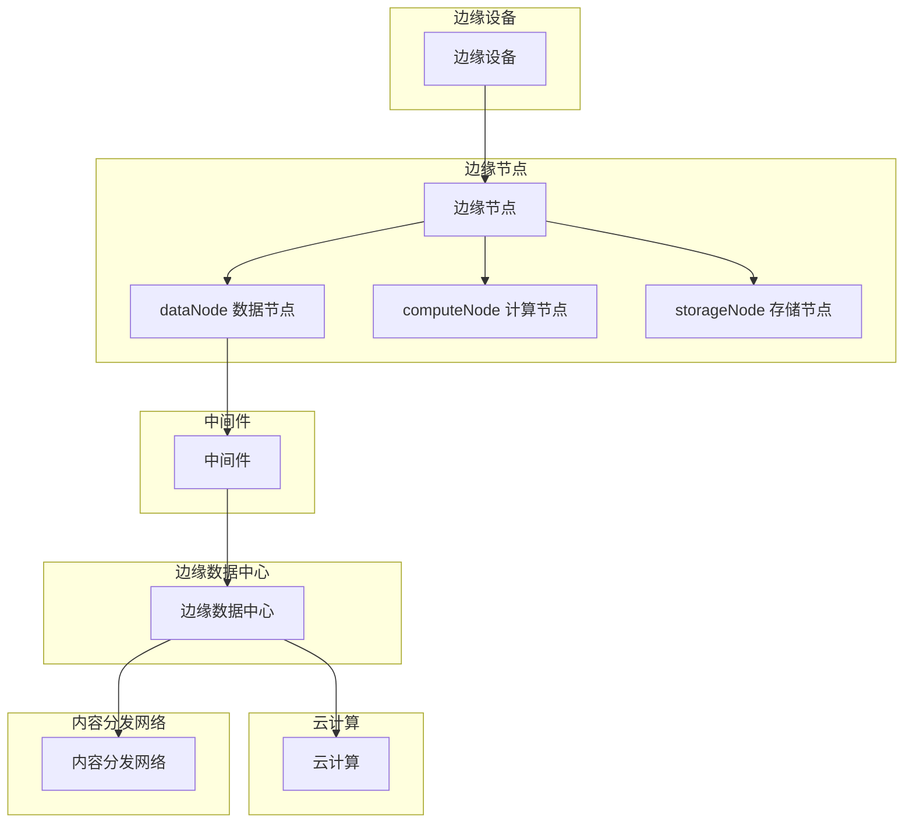

                 

# 边缘计算环境下的AI模型部署策略

> 关键词：边缘计算，AI模型部署，策略优化，实时数据处理，资源效率

> 摘要：本文旨在探讨边缘计算环境下的AI模型部署策略。随着物联网、大数据和5G技术的不断发展，边缘计算逐渐成为数据中心和云计算的补充。在边缘计算环境中，AI模型部署面临着独特的挑战，如带宽限制、计算能力不足和数据隐私等。本文将详细分析边缘计算环境的特点，介绍核心概念和架构，探讨AI模型部署的算法原理和具体操作步骤，并给出数学模型和公式讲解。通过实际项目实战案例和详细解释，本文旨在为开发者提供一套完整、实用的AI模型部署策略，以实现高效、安全和可靠的边缘计算应用。

## 1. 背景介绍

### 1.1 目的和范围

边缘计算作为一种分布式计算架构，旨在将数据处理、分析和存储从中心化的数据中心迁移到网络边缘。在这种环境中，AI模型部署面临着诸多挑战，如数据传输延迟、计算资源有限以及隐私和安全问题。本文的目标是探讨边缘计算环境下的AI模型部署策略，以帮助开发者解决上述挑战，实现高效、安全和可靠的边缘计算应用。

本文将涵盖以下内容：

1. 边缘计算环境的特点及其在AI模型部署中的应用。
2. 边缘计算环境下的核心概念和架构。
3. AI模型部署的算法原理和具体操作步骤。
4. 数学模型和公式的详细讲解。
5. 实际项目实战案例和详细解释。
6. 工具和资源推荐。
7. 未来发展趋势与挑战。

### 1.2 预期读者

本文适合以下读者：

1. 对边缘计算和AI模型部署感兴趣的程序员和开发者。
2. 想要在边缘计算环境中应用AI技术的企业和研究人员。
3. 对分布式计算、大数据处理和云计算感兴趣的读者。

### 1.3 文档结构概述

本文分为10个主要部分：

1. 引言：介绍边缘计算环境下的AI模型部署策略的背景和目的。
2. 背景介绍：详细阐述边缘计算环境的特点和挑战。
3. 核心概念与联系：介绍边缘计算环境下的核心概念和架构。
4. 核心算法原理 & 具体操作步骤：讲解AI模型部署的算法原理和操作步骤。
5. 数学模型和公式 & 详细讲解 & 举例说明：介绍AI模型部署中的数学模型和公式。
6. 项目实战：代码实际案例和详细解释说明。
7. 实际应用场景：探讨边缘计算环境下的AI模型部署的应用场景。
8. 工具和资源推荐：推荐相关学习资源和开发工具。
9. 总结：未来发展趋势与挑战。
10. 附录：常见问题与解答。

### 1.4 术语表

#### 1.4.1 核心术语定义

1. 边缘计算（Edge Computing）：一种分布式计算架构，旨在将数据处理、分析和存储从中心化的数据中心迁移到网络边缘。
2. AI模型部署（AI Model Deployment）：将训练好的AI模型部署到实际应用环境中，以实现预测和决策等功能。
3. 边缘节点（Edge Node）：网络边缘的设备，如路由器、交换机和智能设备等，负责数据采集、处理和传输。
4. 中间件（Middleware）：位于边缘设备和云平台之间的软件层，负责协调和管理边缘计算资源。

#### 1.4.2 相关概念解释

1. 物联网（Internet of Things，IoT）：将各种物理设备和传感器连接到互联网，实现智能互联和数据共享。
2. 5G技术（5th Generation Mobile Networks）：第五代移动通信技术，提供更高的数据传输速度、更低的延迟和更大的网络容量。
3. 云计算（Cloud Computing）：基于互联网的计算模式，提供可扩展的计算资源、存储和应用程序。

#### 1.4.3 缩略词列表

- IoT：物联网
- AI：人工智能
- 5G：第五代移动通信技术
- EDCC：边缘数据中心
- CDN：内容分发网络
- MM：模型压缩
- ML：机器学习
- TF：TensorFlow
- PyTorch：Python深度学习框架

## 2. 核心概念与联系

边缘计算环境下的AI模型部署需要理解以下几个核心概念和它们之间的联系：

1. **边缘节点（Edge Nodes）**：
   - **定义**：边缘节点是指网络边缘的设备，如智能手机、路由器、物联网传感器等。
   - **作用**：边缘节点负责收集数据，执行部分数据处理和分析，并将结果传输到云平台或中心服务器。

2. **边缘设备（Edge Devices）**：
   - **定义**：边缘设备是指连接到边缘节点并进行本地数据处理和分析的设备。
   - **作用**：边缘设备可以是嵌入式系统、单片机、工业控制系统等。

3. **中间件（Middleware）**：
   - **定义**：中间件是指位于边缘设备和云平台之间的软件层，负责协调和管理边缘计算资源。
   - **作用**：中间件提供数据传输、资源调度、安全性保障等服务。

4. **边缘数据中心（Edge Data Centers，EDCC）**：
   - **定义**：边缘数据中心是指部署在地理位置较近的边缘节点，提供计算、存储和带宽等资源。
   - **作用**：边缘数据中心为边缘节点提供额外的计算和存储能力，以处理大量数据并支持复杂应用。

5. **云计算（Cloud Computing）**：
   - **定义**：云计算是指通过互联网提供计算资源、存储和应用程序等服务。
   - **作用**：云计算提供弹性扩展的计算资源，支持大规模数据处理和存储。

6. **内容分发网络（Content Delivery Network，CDN）**：
   - **定义**：内容分发网络是一种分布式网络，旨在提高内容分发效率。
   - **作用**：CDN通过在地理位置较近的节点缓存内容，降低数据传输延迟，提高用户体验。

下面是一个用Mermaid绘制的流程图，展示了边缘计算环境下AI模型部署的核心概念和架构：



边缘设备通过边缘节点收集数据，边缘节点执行初步的数据处理和分析，并将数据传输到中间件。中间件负责协调和管理边缘计算资源，将数据传输到边缘数据中心。边缘数据中心提供额外的计算和存储能力，支持复杂的应用。云计算和内容分发网络则为边缘计算提供额外的计算资源和数据缓存，以提高整体性能和用户体验。

## 3. 核心算法原理 & 具体操作步骤

边缘计算环境下的AI模型部署需要一种有效的算法来优化模型的性能和资源利用。以下是一个典型的算法原理和具体操作步骤，用于在边缘计算环境中部署AI模型。

### 算法原理

在边缘计算环境下部署AI模型的关键是模型压缩（Model Compression）和分布式训练（Distributed Training）。模型压缩通过减少模型的大小和计算复杂度，使得模型可以在资源有限的边缘设备上运行。分布式训练则通过将模型训练过程分散到多个边缘节点，从而提高训练效率并降低延迟。

具体算法原理如下：

1. **模型压缩**：
   - **量化（Quantization）**：将模型的权重和激活值从浮点数转换为低精度整数，以减少模型大小和计算复杂度。
   - **剪枝（Pruning）**：通过移除模型中不必要的权重和神经元，减少模型大小。
   - **蒸馏（Distillation）**：将复杂模型的知识传递给简化模型，以保留其主要性能。

2. **分布式训练**：
   - **同步训练（Synchronous Training）**：所有边缘节点同步更新模型参数。
   - **异步训练（Asynchronous Training）**：边缘节点独立更新模型参数，并在一定时间间隔内进行同步。

### 具体操作步骤

以下是一个具体的操作步骤，用于在边缘计算环境中部署AI模型：

#### 步骤1：模型压缩

1. **量化**：
   - 对模型进行量化，将浮点权重转换为8位整数。
   - 使用量化的权重进行模型评估，确保模型性能不受影响。

2. **剪枝**：
   - 使用剪枝算法（如L1范数剪枝）识别并移除不重要的权重。
   - 重新训练模型，以适应剪枝后的架构。

3. **蒸馏**：
   - 将复杂模型的知识传递给简化模型，如使用教师模型和蒸馏损失函数。
   - 训练简化模型，使其在保持主要性能的同时减少模型大小。

#### 步骤2：分布式训练

1. **同步训练**：
   - 在所有边缘节点上初始化模型参数。
   - 边缘节点使用本地数据进行模型训练，并定期同步模型参数。

2. **异步训练**：
   - 边缘节点独立训练模型，并在一定时间间隔内进行同步。
   - 使用异步一致性协议（如Gossip协议）确保模型参数的一致性。

3. **模型选择**：
   - 根据性能指标和资源限制，选择最佳模型进行部署。

#### 步骤3：模型部署

1. **边缘节点部署**：
   - 将压缩后的模型部署到边缘节点。
   - 配置边缘节点，使其能够处理实时数据并执行预测。

2. **中间件部署**：
   - 在中间件中配置数据传输、资源调度和安全性保障等组件。
   - 确保中间件能够协调和管理边缘计算资源。

3. **边缘数据中心部署**：
   - 在边缘数据中心部署额外的计算和存储资源。
   - 配置边缘数据中心，使其能够处理大规模数据处理和存储任务。

通过上述步骤，边缘计算环境下的AI模型可以高效、可靠地部署和运行。以下是一个简单的伪代码，用于描述模型压缩和分布式训练的过程：

```python
# 模型压缩
model = load_pretrained_model()
quantized_model = quantize_weights(model)
pruned_model = prune_model(quantized_model)
distilled_model = distill_knowledge(pruned_model)

# 分布式训练
initialize_model_params()
synchronize_model_params()
for epoch in range(num_epochs):
    for edge_node in edge_nodes:
        local_data = get_local_data(edge_node)
        local_model = train_on_local_data(local_data)
        synchronize_model_params()

# 模型部署
deploy_model_on_edge_nodes(distilled_model)
configure_middleware_for_data_transfer()
configure_edge_data_center_for_computation_and_storage()
```

## 4. 数学模型和公式 & 详细讲解 & 举例说明

在边缘计算环境下部署AI模型时，数学模型和公式对于理解和优化模型性能至关重要。以下是一些关键的数学模型和公式，以及详细的讲解和举例说明。

### 1. 模型压缩

#### 1.1 量化（Quantization）

量化是一种将模型的权重和激活值从高精度浮点数转换为低精度整数的压缩技术。量化过程通常分为以下几个步骤：

- **选择量化级别**：量化级别决定了模型的精度。常见的量化级别有8位、16位和32位。
- **计算量化系数**：量化系数是将浮点数转换为整数的映射。量化系数通常通过以下公式计算：

  $$ Q = \frac{V_{max} - V_{min}}{2^q} $$

  其中，$V_{max}$ 和 $V_{min}$ 分别是权重或激活值的最小值和最大值，$q$ 是量化级别。

- **应用量化系数**：将权重或激活值乘以量化系数，然后取最近的整数。

  $$ \hat{W} = \text{round}(W \times Q) $$

#### 1.2 剪枝（Pruning）

剪枝是一种通过移除模型中不必要的权重和神经元来减少模型大小的技术。剪枝过程通常包括以下步骤：

- **选择剪枝策略**：剪枝策略决定了如何选择剪枝节点。常见策略有基于L1范数、L2范数和结构敏感性。
- **计算剪枝权重**：计算每个权重的重要性。对于L1范数剪枝，使用以下公式：

  $$ \text{重要性} = \sum_{i=1}^{n} |\lambda_i| $$

  其中，$\lambda_i$ 是权重值。

- **应用剪枝策略**：根据重要性值选择剪枝节点。对于L1范数剪枝，移除重要性最小的权重。

#### 1.3 蒸馏（Distillation）

蒸馏是一种将复杂模型的知识传递给简化模型的技术。蒸馏过程通常包括以下步骤：

- **教师模型**：使用一个复杂的教师模型生成标签，用于训练简化模型。
- **蒸馏损失函数**：蒸馏损失函数用于衡量简化模型输出与教师模型输出之间的差距。常见的蒸馏损失函数有基于KL散度的蒸馏损失和基于对比散度的蒸馏损失。

  $$ L_d = -\sum_{i=1}^{n} \sum_{j=1}^{K} p_j \log q_j $$

  其中，$p_j$ 是教师模型输出概率分布，$q_j$ 是简化模型输出概率分布。

### 2. 分布式训练

#### 2.1 同步训练（Synchronous Training）

同步训练是一种所有边缘节点同步更新模型参数的训练方法。同步训练过程通常包括以下步骤：

- **初始化模型参数**：在所有边缘节点上初始化模型参数。
- **数据采集和预处理**：在每个边缘节点上采集本地数据，并进行预处理。
- **模型更新**：在每个边缘节点上使用本地数据进行模型训练，并更新模型参数。
- **同步参数**：将更新后的模型参数同步到所有边缘节点。

#### 2.2 异步训练（Asynchronous Training）

异步训练是一种边缘节点独立更新模型参数的训练方法。异步训练过程通常包括以下步骤：

- **初始化模型参数**：在所有边缘节点上初始化模型参数。
- **数据采集和预处理**：在每个边缘节点上采集本地数据，并进行预处理。
- **模型更新**：在每个边缘节点上使用本地数据进行模型训练，并更新模型参数。
- **异步一致性**：使用异步一致性协议（如Gossip协议）确保模型参数的一致性。

### 3. 举例说明

假设我们有一个使用ResNet50模型的边缘计算应用。模型包含约2500万个参数，训练时间较长，不适合直接在边缘设备上运行。我们可以采用以下步骤进行模型压缩和分布式训练：

#### 步骤1：模型压缩

1. **量化**：
   - 选择8位量化级别。
   - 计算量化系数 $Q = \frac{127.5 - (-127.5)}{255} = 0.5$。
   - 将模型的权重和激活值乘以量化系数，然后取最近的整数。

2. **剪枝**：
   - 使用L1范数剪枝策略。
   - 计算每个权重的重要性。
   - 移除重要性最小的权重。

3. **蒸馏**：
   - 使用教师模型（如ResNet152）生成标签。
   - 使用基于KL散度的蒸馏损失函数。
   - 训练简化模型（如ResNet18）。

#### 步骤2：分布式训练

1. **同步训练**：
   - 在所有边缘节点上初始化模型参数。
   - 在每个边缘节点上使用本地数据进行模型训练，并更新模型参数。
   - 定期同步模型参数。

2. **异步训练**：
   - 在每个边缘节点上独立更新模型参数。
   - 使用Gossip协议进行异步一致性。

通过上述步骤，我们可以将ResNet50模型压缩为ResNet18，并在边缘设备上实现高效的分布式训练。

## 5. 项目实战：代码实际案例和详细解释说明

为了更好地理解边缘计算环境下的AI模型部署策略，我们将通过一个实际项目案例进行讲解。在这个项目中，我们将使用TensorFlow和Keras框架实现一个简单的图像分类任务，并将其部署到边缘设备上。以下是项目的主要步骤和代码解释。

### 5.1 开发环境搭建

在开始项目之前，我们需要搭建一个适合边缘计算环境开发的开发环境。以下是开发环境的搭建步骤：

1. **安装Python**：确保安装了Python 3.x版本。
2. **安装TensorFlow**：使用以下命令安装TensorFlow：

   ```bash
   pip install tensorflow==2.x
   ```

3. **安装Keras**：TensorFlow内置了Keras框架，无需额外安装。

4. **安装依赖库**：安装其他必要的依赖库，如NumPy、Pandas等：

   ```bash
   pip install numpy pandas
   ```

5. **配置边缘设备**：确保边缘设备（如Raspberry Pi）具备运行Python程序的能力，并安装必要的库。

### 5.2 源代码详细实现和代码解读

在这个项目中，我们将使用TensorFlow和Keras实现一个简单的图像分类模型，并将其部署到边缘设备上。以下是项目的源代码和详细解释：

#### 5.2.1 数据预处理

首先，我们需要从Keras数据集加载图像数据，并对数据进行预处理。以下是对源代码的解读：

```python
from tensorflow.keras.preprocessing.image import ImageDataGenerator

# 加载训练数据和测试数据
train_datagen = ImageDataGenerator(
    rescale=1./255,
    shear_range=0.2,
    zoom_range=0.2,
    horizontal_flip=True)

test_datagen = ImageDataGenerator(rescale=1./255)

train_generator = train_datagen.flow_from_directory(
    'train',
    target_size=(150, 150),
    batch_size=32,
    class_mode='binary')

validation_generator = test_datagen.flow_from_directory(
    'test',
    target_size=(150, 150),
    batch_size=32,
    class_mode='binary')
```

解读：
- 使用ImageDataGenerator类对图像数据进行预处理，包括缩放、剪切、缩放和水平翻转。
- flow_from_directory方法用于加载训练数据和测试数据，并将图像数据转换为批次。

#### 5.2.2 模型构建

接下来，我们使用Keras构建一个简单的卷积神经网络（Convolutional Neural Network，CNN）模型。以下是对源代码的解读：

```python
from tensorflow.keras.models import Sequential
from tensorflow.keras.layers import Conv2D, MaxPooling2D, Flatten, Dense

# 构建模型
model = Sequential()

# 添加卷积层和池化层
model.add(Conv2D(32, (3, 3), activation='relu', input_shape=(150, 150, 3)))
model.add(MaxPooling2D(pool_size=(2, 2)))

model.add(Conv2D(64, (3, 3), activation='relu'))
model.add(MaxPooling2D(pool_size=(2, 2)))

model.add(Conv2D(128, (3, 3), activation='relu'))
model.add(MaxPooling2D(pool_size=(2, 2)))

# 添加全连接层
model.add(Flatten())
model.add(Dense(128, activation='relu'))
model.add(Dense(1, activation='sigmoid'))

# 编译模型
model.compile(optimizer='adam',
              loss='binary_crossentropy',
              metrics=['accuracy'])
```

解读：
- Sequential模型用于构建顺序堆叠的层。
- Conv2D和MaxPooling2D层用于卷积和池化操作。
- Flatten层将卷积层的输出展平为一维数组。
- Dense层用于全连接神经网络。
- compile方法用于编译模型，指定优化器和损失函数。

#### 5.2.3 模型训练

接下来，我们使用训练数据和测试数据进行模型训练。以下是对源代码的解读：

```python
# 训练模型
history = model.fit(
    train_generator,
    steps_per_epoch=8000//32,
    epochs=25,
    validation_data=validation_generator,
    validation_steps=2000//32)
```

解读：
- fit方法用于训练模型，指定训练数据和测试数据。
- steps_per_epoch参数指定每个epoch中要训练的数据批次数量。
- validation_steps参数指定每个epoch中要验证的数据批次数量。

#### 5.2.4 模型评估

最后，我们对训练好的模型进行评估，以验证其性能。以下是对源代码的解读：

```python
# 评估模型
test_loss, test_acc = model.evaluate(validation_generator, steps=2000//32)
print('Test accuracy:', test_acc)
```

解读：
- evaluate方法用于评估模型在测试数据上的性能。
- test_loss和test_acc分别表示测试损失和测试准确率。

### 5.3 代码解读与分析

在这个项目中，我们使用TensorFlow和Keras框架构建了一个简单的CNN模型，用于图像分类任务。以下是代码的详细解读和分析：

1. **数据预处理**：
   - 使用ImageDataGenerator类对图像数据进行预处理，包括缩放、剪切、缩放和水平翻转。这些预处理操作有助于提高模型的泛化能力。

2. **模型构建**：
   - 使用Sequential模型构建顺序堆叠的卷积层、池化层和全连接层。卷积层用于提取图像特征，池化层用于减小特征图的大小，全连接层用于分类。

3. **模型训练**：
   - 使用fit方法进行模型训练，指定训练数据和测试数据。通过设置steps_per_epoch和validation_steps参数，可以控制每个epoch中训练和验证的数据批次数量。

4. **模型评估**：
   - 使用evaluate方法评估模型在测试数据上的性能，输出测试准确率。

通过这个项目，我们了解了如何在边缘计算环境中使用TensorFlow和Keras构建和训练简单的AI模型。在实际应用中，我们可以根据需求对模型进行调整和优化，以提高性能和资源利用效率。

## 6. 实际应用场景

边缘计算环境下的AI模型部署在实际应用中具有广泛的应用场景，以下是几个典型的应用领域：

### 6.1 智能家居

智能家居设备，如智能门锁、智能灯光和智能温度控制器，需要实时响应用户请求，并处理大量的传感器数据。边缘计算环境下的AI模型可以对这些数据进行实时分析，实现智能控制和自动化。

**应用实例**：智能门锁可以通过边缘设备上的AI模型进行人脸识别或指纹识别，确保家庭安全。

### 6.2 物流与供应链

物流和供应链行业需要实时监控货物的位置、状态和环境参数。边缘计算环境下的AI模型可以用于预测运输延迟、优化路线和检测异常情况。

**应用实例**：物流公司可以使用边缘设备上的AI模型实时分析GPS数据，预测货物到达时间，并根据天气情况调整路线。

### 6.3 智能医疗

智能医疗设备，如智能手环、智能血压计和智能血糖仪，需要实时监测患者的健康状况，并生成诊断报告。边缘计算环境下的AI模型可以对这些数据进行实时分析，提供个性化的健康建议。

**应用实例**：智能手环可以通过边缘设备上的AI模型监测用户的步数、睡眠质量和心率，并根据这些数据生成健康报告。

### 6.4 自动驾驶

自动驾驶车辆需要实时处理大量的传感器数据，如摄像头、激光雷达和GPS数据，并做出快速决策。边缘计算环境下的AI模型可以用于图像识别、路径规划和车辆控制。

**应用实例**：自动驾驶汽车可以使用边缘设备上的AI模型进行道路识别、障碍物检测和车道保持，以提高行车安全。

### 6.5 智能安防

智能安防设备，如智能摄像头、人脸识别设备和智能门禁系统，需要实时监控公共场所，并识别潜在的安全威胁。边缘计算环境下的AI模型可以用于实时视频分析和事件检测。

**应用实例**：智能摄像头可以通过边缘设备上的AI模型实时识别可疑行为，如异常徘徊或遗弃物品，并及时通知安保人员。

这些实际应用场景展示了边缘计算环境下AI模型部署的重要性和潜力。通过边缘计算，可以实现对数据的实时分析和处理，提高系统的响应速度和可靠性，从而满足各种场景的需求。

## 7. 工具和资源推荐

为了更好地进行边缘计算环境下的AI模型部署，以下是一些推荐的工具和资源：

### 7.1 学习资源推荐

#### 7.1.1 书籍推荐

1. **《边缘计算：理论与实践》**：该书详细介绍了边缘计算的基本概念、架构和应用，适合初学者和专业人士。
2. **《深度学习边缘计算》**：该书探讨了深度学习在边缘计算环境中的应用，包括模型压缩、分布式训练和实时数据处理。

#### 7.1.2 在线课程

1. **Coursera上的“边缘计算”课程**：由哥伦比亚大学提供，介绍了边缘计算的基础知识、应用场景和最新技术。
2. **Udacity的“边缘AI工程师”纳米学位**：该课程涵盖了边缘计算环境下的AI模型部署，包括模型压缩、分布式训练和实时数据处理。

#### 7.1.3 技术博客和网站

1. **边缘计算网**：提供丰富的边缘计算技术文章、教程和案例，包括边缘计算在智能家居、智能医疗和智能安防等领域的应用。
2. **AI Edge Computing**：一个专注于边缘计算在AI领域的应用的技术博客，包括最新的研究进展、技术讨论和案例分析。

### 7.2 开发工具框架推荐

#### 7.2.1 IDE和编辑器

1. **Visual Studio Code**：一款开源的跨平台集成开发环境，支持多种编程语言，适用于边缘计算开发。
2. **PyCharm**：一款功能强大的Python集成开发环境，提供代码编辑、调试和性能分析等功能。

#### 7.2.2 调试和性能分析工具

1. **TensorBoard**：TensorFlow提供的可视化工具，用于分析和调试神经网络模型。
2. **Valgrind**：一款强大的性能分析工具，可以检测内存泄漏、数据竞争等潜在问题。

#### 7.2.3 相关框架和库

1. **TensorFlow**：一款开源的深度学习框架，支持模型压缩、分布式训练和实时数据处理。
2. **Keras**：一款基于TensorFlow的简洁易用的深度学习库，适用于构建和训练神经网络模型。
3. **PyTorch**：一款开源的深度学习框架，支持动态图计算，适用于研究和实验。

### 7.3 相关论文著作推荐

#### 7.3.1 经典论文

1. **“Edge Computing: Vision and Challenges”**：该论文详细阐述了边缘计算的基本概念、应用场景和挑战。
2. **“Distributed Machine Learning: A Theoretical Perspective”**：该论文探讨了分布式机器学习的基本理论和算法。

#### 7.3.2 最新研究成果

1. **“AI at the Edge: From Inference to Learning”**：该论文综述了边缘计算环境下的AI模型部署的最新研究成果，包括模型压缩、分布式训练和实时数据处理。
2. **“Edge AI: Transforming AI for Real-Time Applications”**：该论文探讨了边缘计算环境下的AI模型部署的最新技术，包括实时推理、模型压缩和迁移学习。

#### 7.3.3 应用案例分析

1. **“Edge Computing for Intelligent Transportation Systems”**：该论文介绍了边缘计算在智能交通系统中的应用，包括实时交通监控、路径规划和车辆控制。
2. **“Edge Computing for Smart Healthcare”**：该论文探讨了边缘计算在智能医疗领域的应用，包括实时健康监测、疾病预测和诊断。

这些工具和资源将为边缘计算环境下的AI模型部署提供有力的支持和指导，帮助开发者更好地理解和应用相关技术。

## 8. 总结：未来发展趋势与挑战

边缘计算环境下的AI模型部署已经成为一个重要研究方向，并在各个行业和领域取得了显著的应用成果。然而，随着技术的不断发展，边缘计算环境下的AI模型部署仍然面临诸多挑战和机遇。

### 8.1 未来发展趋势

1. **模型压缩与优化**：为了提高边缘设备的性能和能效，模型压缩与优化技术将继续得到关注。未来的研究将侧重于开发更高效的压缩算法和优化策略，以实现更小的模型大小和更快的推理速度。

2. **分布式训练与协作**：分布式训练和协作学习在边缘计算环境中具有巨大潜力。通过将模型训练分散到多个边缘节点，可以降低训练时间和提高模型性能。未来将出现更多的分布式训练算法和协作机制。

3. **实时数据处理与预测**：边缘计算环境下的AI模型部署需要实时处理和分析大量数据。未来的研究将重点关注实时数据处理技术，以提高系统的响应速度和准确性。

4. **隐私保护与安全**：在边缘计算环境中，数据隐私和保护是一个重要问题。未来的研究将探讨如何保护边缘设备上的敏感数据，并确保系统的安全性和可靠性。

### 8.2 挑战

1. **计算资源限制**：边缘设备通常具有有限的计算资源和带宽。如何在有限的资源下高效地部署和运行AI模型是一个关键挑战。

2. **数据隐私与安全**：边缘设备上的数据可能包含敏感信息，如何确保数据在传输和存储过程中的隐私和安全是一个重要问题。

3. **异构计算环境**：边缘计算环境通常由多种设备和平台组成，这些设备可能具有不同的计算能力和性能特点。如何在异构计算环境中高效地部署AI模型是一个挑战。

4. **可靠性与可扩展性**：边缘计算环境需要具备高可靠性和可扩展性，以应对不断增长的数据需求和复杂的应用场景。

### 8.3 结论

边缘计算环境下的AI模型部署具有重要的研究价值和实际应用潜力。未来，随着技术的不断发展，边缘计算环境下的AI模型部署将面临更多挑战和机遇。开发者需要不断创新和优化，以提高系统的性能和可靠性，确保数据的安全和隐私，从而推动边缘计算和AI技术的进一步发展。

## 9. 附录：常见问题与解答

### 9.1 什么是边缘计算？

边缘计算是一种分布式计算架构，旨在将数据处理、分析和存储从中心化的数据中心迁移到网络边缘。边缘计算通过在靠近数据源的位置（如智能设备、路由器等）处理数据，可以减少数据传输延迟、降低带宽需求，并提高系统的响应速度和性能。

### 9.2 边缘计算与云计算有何区别？

云计算是一种基于互联网的计算模式，提供可扩展的计算资源、存储和应用程序。而边缘计算是一种分布式计算架构，旨在将数据处理、分析和存储从中心化的数据中心迁移到网络边缘。云计算和边缘计算共同构成了分布式计算生态系统，云计算提供弹性扩展的计算资源，而边缘计算提供低延迟、高响应速度的数据处理能力。

### 9.3 边缘计算环境下的AI模型部署有哪些挑战？

边缘计算环境下的AI模型部署面临以下挑战：

1. **计算资源有限**：边缘设备通常具有有限的计算能力和存储空间。
2. **带宽限制**：边缘设备之间的数据传输带宽有限。
3. **数据隐私与安全**：边缘设备上的数据可能包含敏感信息，如何确保数据在传输和存储过程中的隐私和安全是一个重要问题。
4. **异构计算环境**：边缘计算环境通常由多种设备和平台组成，这些设备可能具有不同的计算能力和性能特点。
5. **可靠性与可扩展性**：边缘计算环境需要具备高可靠性和可扩展性，以应对不断增长的数据需求和复杂的应用场景。

### 9.4 如何优化边缘计算环境下的AI模型部署？

以下是一些优化边缘计算环境下的AI模型部署的策略：

1. **模型压缩**：通过模型压缩技术减小模型大小和计算复杂度，以适应有限的计算资源。
2. **分布式训练**：将模型训练过程分散到多个边缘节点，以提高训练效率和降低延迟。
3. **实时数据处理**：采用高效的数据处理算法和架构，以提高系统的响应速度和性能。
4. **安全性增强**：采用加密、访问控制和隐私保护等技术，确保边缘设备上的数据安全和隐私。
5. **异构计算优化**：根据不同设备和平台的性能特点，优化模型部署和资源调度策略，实现计算资源的最大化利用。

## 10. 扩展阅读 & 参考资料

边缘计算环境下的AI模型部署是一个复杂且快速发展的领域，以下是一些推荐的扩展阅读和参考资料，以帮助读者深入了解相关技术和应用。

### 10.1 扩展阅读

1. **《边缘计算：理论与实践》**：详细介绍了边缘计算的基本概念、架构和应用，适合初学者和专业人士。
2. **《深度学习边缘计算》**：探讨了深度学习在边缘计算环境中的应用，包括模型压缩、分布式训练和实时数据处理。
3. **《边缘计算环境下的AI技术与应用》**：介绍了边缘计算环境下的多种AI技术，包括图像识别、语音识别和自然语言处理等。

### 10.2 参考资料

1. **边缘计算网**：提供丰富的边缘计算技术文章、教程和案例，包括边缘计算在智能家居、智能医疗和智能安防等领域的应用。
2. **AI Edge Computing**：一个专注于边缘计算在AI领域的应用的技术博客，包括最新的研究进展、技术讨论和案例分析。
3. **IEEE边缘计算期刊**：汇集了边缘计算领域的最新研究成果和技术论文，适合专业人士和研究学者。
4. **ACM边缘计算特刊**：收录了边缘计算领域的优秀论文，包括模型压缩、分布式训练和实时数据处理等方向。

通过阅读这些扩展阅读和参考资料，读者可以深入了解边缘计算环境下的AI模型部署的最新技术和应用，为自己的研究和项目提供参考和灵感。

