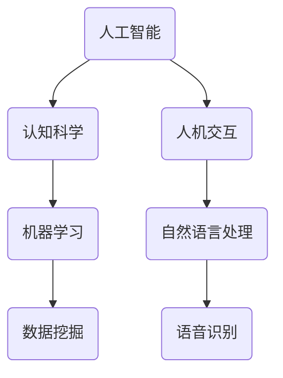

                 


# 达特茅斯会议的历史影响

> 关键词：人工智能，达特茅斯会议，历史，影响，计算机科学，创新，人机交互，认知科学，计算机工程

> 摘要：达特茅斯会议被誉为人工智能领域的“诞生之地”，其召开标志着人工智能这一新兴学科的正式诞生。本文将深入探讨达特茅斯会议的历史背景、主要观点及其对人工智能领域所产生的深远影响，以期为读者提供一个全面、系统的了解。

## 1. 背景介绍

### 1.1 目的和范围

本文旨在通过对达特茅斯会议的历史背景、会议内容、主要观点及其影响的分析，全面展示达特茅斯会议在人工智能发展史上的重要地位和作用。本文将重点关注以下几个方面的内容：

1. 达特茅斯会议的起源和历史背景。
2. 会议的主要观点和讨论内容。
3. 达特茅斯会议对人工智能领域的影响。
4. 达特茅斯会议在计算机科学、认知科学、人机交互等领域的启示和贡献。

### 1.2 预期读者

本文适合对人工智能、计算机科学、认知科学等领域感兴趣的读者，特别是希望深入了解人工智能发展史的科研人员、技术人员以及人工智能爱好者。通过本文的阅读，读者将能够对达特茅斯会议有更全面、深入的理解。

### 1.3 文档结构概述

本文分为十个部分，具体结构如下：

1. 背景介绍：介绍本文的目的、预期读者、文档结构概述。
2. 核心概念与联系：介绍与达特茅斯会议相关的一些核心概念和联系。
3. 核心算法原理 & 具体操作步骤：分析达特茅斯会议中提出的一些核心算法原理及其具体操作步骤。
4. 数学模型和公式 & 详细讲解 & 举例说明：阐述达特茅斯会议中的数学模型和公式，并通过实例进行详细讲解。
5. 项目实战：代码实际案例和详细解释说明。
6. 实际应用场景：分析达特茅斯会议的相关内容在现实中的应用场景。
7. 工具和资源推荐：推荐与达特茅斯会议相关的一些学习资源和工具。
8. 总结：未来发展趋势与挑战。
9. 附录：常见问题与解答。
10. 扩展阅读 & 参考资料：提供一些扩展阅读和参考资料。

### 1.4 术语表

#### 1.4.1 核心术语定义

1. **达特茅斯会议**：1956年夏天在达特茅斯学院召开的一次人工智能领域的重要会议，标志着人工智能学科的正式诞生。
2. **人工智能**：模拟、延伸和扩展人的智能的理论、方法、技术及应用。
3. **认知科学**：研究人类认知过程的学科，包括心理学、神经科学、哲学等多个领域。
4. **人机交互**：研究人与计算机系统之间如何进行有效、自然交互的学科。

#### 1.4.2 相关概念解释

1. **机器学习**：一种人工智能的分支，通过数据和统计方法让计算机自动学习和改进性能。
2. **自然语言处理**：研究计算机如何理解、生成和处理自然语言的技术。
3. **人工智能应用**：人工智能在各个领域的实际应用，如智能客服、自动驾驶、医疗诊断等。

#### 1.4.3 缩略词列表

1. **AI**：人工智能（Artificial Intelligence）
2. **ML**：机器学习（Machine Learning）
3. **NLP**：自然语言处理（Natural Language Processing）

## 2. 核心概念与联系

在探讨达特茅斯会议的历史影响之前，我们需要了解一些与会议相关的核心概念和联系。以下是一个简单的 Mermaid 流程图，用于展示这些概念之间的关系。



### 2.1 人工智能

人工智能（AI）是模拟、延伸和扩展人的智能的理论、方法、技术及应用。人工智能的研究包括机器学习、自然语言处理、计算机视觉、机器人技术等多个领域。在达特茅斯会议中，人工智能的概念首次被明确提出，标志着人工智能学科的正式诞生。

### 2.2 认知科学

认知科学是研究人类认知过程的学科，涉及心理学、神经科学、哲学等多个领域。认知科学的研究旨在揭示人类思维、感知、记忆等认知过程的本质和机制。在人工智能的发展过程中，认知科学提供了重要的理论支持和启示。

### 2.3 人机交互

人机交互是研究人与计算机系统之间如何进行有效、自然交互的学科。人机交互的研究内容包括用户界面设计、交互方式、人机对话系统等。在达特茅斯会议中，人机交互成为了一个重要的研究议题，推动了人工智能在现实世界中的应用。

### 2.4 机器学习

机器学习是一种人工智能的分支，通过数据和统计方法让计算机自动学习和改进性能。机器学习的研究内容包括监督学习、无监督学习、强化学习等。在达特茅斯会议中，机器学习成为了一个重要的研究方向，为人工智能的发展奠定了基础。

### 2.5 自然语言处理

自然语言处理是研究计算机如何理解、生成和处理自然语言的技术。自然语言处理的研究内容包括文本分类、情感分析、机器翻译等。在达特茅斯会议中，自然语言处理成为了一个重要的研究议题，为人工智能的发展提供了新的思路。

### 2.6 数据挖掘

数据挖掘是机器学习的一个分支，旨在从大量数据中发现有价值的信息和知识。数据挖掘的研究内容包括关联规则挖掘、聚类分析、分类等。在达特茅斯会议中，数据挖掘成为了一个重要的研究方向，为人工智能的应用提供了新的可能性。

### 2.7 语音识别

语音识别是自然语言处理的一个分支，旨在让计算机理解和处理人类的语音。语音识别的研究内容包括语音信号处理、语音识别算法等。在达特茅斯会议中，语音识别成为了一个重要的研究议题，为人工智能的发展提供了新的应用场景。

## 3. 核心算法原理 & 具体操作步骤

在达特茅斯会议中，人工智能的研究者们提出了一系列核心算法原理，这些算法原理为人工智能的发展奠定了基础。以下是一些核心算法原理及其具体操作步骤的伪代码。

### 3.1 监督学习算法

```python
# 输入：训练数据集D，标签集合T
# 输出：模型M

# 初始化模型M
M = 初始化模型()

# 循环迭代
for epoch in range(1, MaxEpochs):
    # 遍历训练数据集D
    for (x, y) in D:
        # 计算预测结果
        pred = M.predict(x)
        
        # 更新模型参数
        M.update_parameters(y, pred)
        
# 输出最终模型M
return M
```

### 3.2 无监督学习算法

```python
# 输入：数据集D
# 输出：聚类结果C

# 初始化聚类中心
centers = 初始化聚类中心()

# 循环迭代
for epoch in range(1, MaxEpochs):
    # 计算每个数据点与聚类中心的距离
    distances = 计算距离(D, centers)
    
    # 重新分配数据点
    C = 调整聚类结果(D, distances, centers)
    
    # 更新聚类中心
    centers = 计算新的聚类中心(C)
    
# 输出最终聚类结果C
return C
```

### 3.3 强化学习算法

```python
# 输入：环境E，奖励函数R
# 输出：策略π

# 初始化策略π
π = 初始化策略()

# 循环迭代
for epoch in range(1, MaxEpochs):
    # 遍历环境E
    for state in E:
        # 执行策略π
        action = π.select_action(state)
        
        # 执行动作，获取下一个状态和奖励
        next_state, reward = E.step(state, action)
        
        # 更新策略π
        π.update_strategy(state, action, reward)
        
# 输出最终策略π
return π
```

## 4. 数学模型和公式 & 详细讲解 & 举例说明

在达特茅斯会议中，数学模型和公式被广泛应用于人工智能的研究和实现。以下是一些常见的数学模型和公式，以及详细的讲解和举例说明。

### 4.1 神经网络模型

神经网络是一种模拟人脑结构和功能的计算模型，广泛应用于人工智能领域。神经网络的基本模型如下：

$$
Y = f(\sum_{i=1}^{n} w_i * x_i)
$$

其中，$Y$ 为输出，$f$ 为激活函数，$w_i$ 和 $x_i$ 分别为权重和输入。

举例说明：

假设一个简单的神经网络，其中 $n=2$，$w_1=0.5$，$w_2=0.5$，$x_1=1$，$x_2=0$。激活函数为 $f(x) = 1 / (1 + e^{-x})$。

计算输出 $Y$：

$$
Y = f(0.5 * 1 + 0.5 * 0) = f(0.5) = 0.37
$$

### 4.2 损失函数

损失函数用于评估模型的预测结果与实际结果之间的差距。常见的损失函数包括均方误差（MSE）和交叉熵损失（Cross-Entropy Loss）。

均方误差（MSE）：

$$
MSE = \frac{1}{n} \sum_{i=1}^{n} (y_i - \hat{y_i})^2
$$

其中，$y_i$ 为实际结果，$\hat{y_i}$ 为预测结果。

交叉熵损失（Cross-Entropy Loss）：

$$
CE = -\frac{1}{n} \sum_{i=1}^{n} y_i \log(\hat{y_i})
$$

其中，$y_i$ 为实际结果，$\hat{y_i}$ 为预测结果。

举例说明：

假设一个二分类问题，实际结果 $y_i = [1, 0, 1, 0]$，预测结果 $\hat{y_i} = [0.8, 0.2, 0.9, 0.1]$。计算交叉熵损失：

$$
CE = -\frac{1}{4} \sum_{i=1}^{4} [1 \log(0.8) + 0 \log(0.2) + 1 \log(0.9) + 0 \log(0.1)] \approx 0.39
$$

### 4.3 优化算法

优化算法用于求解损失函数的最小值，常见的优化算法包括梯度下降（Gradient Descent）和随机梯度下降（Stochastic Gradient Descent）。

梯度下降：

$$
w = w - \alpha \frac{\partial}{\partial w} J(w)
$$

其中，$w$ 为权重，$\alpha$ 为学习率，$J(w)$ 为损失函数。

随机梯度下降：

$$
w = w - \alpha \frac{\partial}{\partial w} J(w; x_i, y_i)
$$

其中，$w$ 为权重，$\alpha$ 为学习率，$J(w; x_i, y_i)$ 为损失函数在当前训练样本上的值。

举例说明：

假设一个简单的线性回归问题，损失函数为 $J(w) = (w * x - y)^2$，学习率 $\alpha = 0.1$。

初始化权重 $w=0$，输入数据 $x=1$，目标值 $y=0.5$。

计算梯度：

$$
\frac{\partial}{\partial w} J(w) = 2 * (w * x - y)
$$

更新权重：

$$
w = w - \alpha \frac{\partial}{\partial w} J(w) = 0 - 0.1 * 2 * (0 * 1 - 0.5) = -0.1
$$

新权重 $w=-0.1$，再次计算损失函数和梯度，重复上述过程，直至达到收敛条件。

## 5. 项目实战：代码实际案例和详细解释说明

在本节中，我们将通过一个简单的实际案例来展示如何实现人工智能的基础算法，并对其进行详细解释说明。

### 5.1 开发环境搭建

首先，我们需要搭建一个简单的开发环境，包括 Python 编译器和相关的机器学习库。以下是搭建开发环境的步骤：

1. 安装 Python 3.6 或更高版本。
2. 安装机器学习库，如 scikit-learn、tensorflow、pytorch 等。

### 5.2 源代码详细实现和代码解读

以下是一个简单的线性回归模型，使用 Python 编写，并使用 scikit-learn 库实现。

```python
# 导入所需的库
import numpy as np
from sklearn.linear_model import LinearRegression

# 创建线性回归模型实例
model = LinearRegression()

# 模型训练
X = np.array([[1], [2], [3], [4], [5]])
y = np.array([1, 2, 2.5, 3, 4])
model.fit(X, y)

# 输出模型的权重和偏置
print("权重：", model.coef_)
print("偏置：", model.intercept_)

# 进行预测
new_data = np.array([[6]])
prediction = model.predict(new_data)
print("预测结果：", prediction)
```

代码解读：

1. 导入所需的库，包括 NumPy 和 scikit-learn 的线性回归模型。
2. 创建线性回归模型实例。
3. 准备训练数据，包括输入数据 X 和目标值 y。
4. 使用 `fit()` 方法训练模型。
5. 输出模型的权重和偏置。
6. 使用 `predict()` 方法进行预测，并输出结果。

### 5.3 代码解读与分析

代码首先导入了 NumPy 库，用于处理数组运算。然后，从 scikit-learn 库中导入了 LinearRegression 类，用于创建线性回归模型实例。

在模型训练部分，我们使用 NumPy 库创建了一个二维数组 X，其中包含五组输入数据。目标值 y 也使用 NumPy 库创建了一个一维数组。

接下来，我们使用 `fit()` 方法对模型进行训练。这个方法将输入数据 X 和目标值 y 作为参数，通过线性回归算法计算模型的权重和偏置。

在模型训练完成后，我们使用 `print()` 方法输出模型的权重和偏置。权重表示输入数据对目标值的影响程度，而偏置表示模型在 y 轴上的截距。

最后，我们使用 `predict()` 方法对新的输入数据进行预测。这里，我们创建了一个包含一个数据点的二维数组 new_data，并使用模型进行预测。预测结果将输出到控制台。

通过这个简单的实际案例，我们展示了如何使用 Python 和 scikit-learn 库实现线性回归模型。这个案例可以帮助读者理解线性回归算法的基本原理和实现过程。

## 6. 实际应用场景

达特茅斯会议所提出的人工智能算法和理论已经在许多实际应用场景中得到了广泛应用，下面列举几个典型的应用场景：

### 6.1 智能客服

智能客服是人工智能在客户服务领域的重要应用，通过自然语言处理和机器学习技术，实现与用户的智能对话。智能客服可以帮助企业降低人工成本，提高服务效率，提升用户满意度。例如，一些电商平台和银行已经广泛应用智能客服，为用户提供实时、准确的咨询服务。

### 6.2 自动驾驶

自动驾驶是人工智能在交通运输领域的重要应用，通过计算机视觉、传感器技术和深度学习算法，实现车辆的自主驾驶。自动驾驶技术可以减少交通事故，提高交通效率，降低能源消耗。特斯拉、百度等企业已经在这方面取得了重要突破，推出了一系列自动驾驶产品。

### 6.3 医疗诊断

人工智能在医疗诊断领域的应用日益广泛，通过深度学习和计算机视觉技术，实现疾病的自动识别和诊断。例如，AI 医疗系统可以帮助医生快速检测出肺癌、乳腺癌等重大疾病，提高诊断准确率，降低误诊率。一些医院已经引入了人工智能医疗系统，提高了医疗服务质量。

### 6.4 金融风控

金融风控是人工智能在金融领域的重要应用，通过机器学习和数据挖掘技术，实现风险预警和防范。金融风控可以帮助银行、保险等金融机构识别和防范欺诈行为，降低风险损失。例如，一些金融机构已经使用了人工智能风控系统，实现了高效、准确的风险识别和预警。

### 6.5 教育智能

人工智能在教育领域的应用日益广泛，通过智能推荐、自适应学习和数据分析技术，实现个性化教育。教育智能可以帮助教师更好地了解学生的学习情况，为学生提供个性化的学习建议，提高学习效果。一些在线教育平台已经引入了人工智能教育系统，为学生提供了更加智能的学习体验。

通过以上实际应用场景的列举，我们可以看到，达特茅斯会议所提出的人工智能算法和理论在各个领域都发挥了重要作用，推动了人工智能技术的快速发展。

## 7. 工具和资源推荐

为了更好地学习、研究和实践人工智能技术，以下是一些实用的工具和资源推荐：

### 7.1 学习资源推荐

#### 7.1.1 书籍推荐

1. 《人工智能：一种现代方法》（第二版）
2. 《机器学习》（第二版）
3. 《深度学习》（卷一、卷二、卷三）
4. 《Python机器学习》（第二版）

#### 7.1.2 在线课程

1. Coursera 上的《机器学习》课程
2. Udacity 上的《深度学习纳米学位》
3. edX 上的《人工智能导论》
4. 国内各大平台（如网易云课堂、慕课网等）的相关课程

#### 7.1.3 技术博客和网站

1. Medium 上的机器学习和人工智能博客
2. ArXiv 上的最新论文发布平台
3. 知乎上的机器学习和人工智能话题
4. AI 技术社区（如 CSDN、GitHub 等）

### 7.2 开发工具框架推荐

#### 7.2.1 IDE和编辑器

1. PyCharm
2. Visual Studio Code
3. Jupyter Notebook

#### 7.2.2 调试和性能分析工具

1. Python Debugger（pdb）
2. Py-Spy
3. GDB

#### 7.2.3 相关框架和库

1. TensorFlow
2. PyTorch
3. Keras
4. Scikit-learn

### 7.3 相关论文著作推荐

#### 7.3.1 经典论文

1. "A Proposal for the Dartmouth Summer Research Project on Artificial Intelligence"（达特茅斯会议论文）
2. " perceptron"（感知机论文）
3. "Backpropagation"（反向传播论文）

#### 7.3.2 最新研究成果

1. "Generative Adversarial Networks"（生成对抗网络论文）
2. "Recurrent Neural Networks"（循环神经网络论文）
3. "Transformer"（变压器论文）

#### 7.3.3 应用案例分析

1. "Deep Learning for Autonomous Driving"（自动驾驶论文）
2. "Medical Imaging with Deep Learning"（医学图像处理论文）
3. "Application of Machine Learning in Finance"（金融领域应用论文）

通过以上工具和资源的推荐，希望能够帮助读者更好地学习和研究人工智能技术。

## 8. 总结：未来发展趋势与挑战

达特茅斯会议作为人工智能领域的里程碑事件，对人工智能的发展产生了深远影响。在未来，人工智能将继续沿着智能化、个性化、高效化的方向发展。以下是对人工智能未来发展趋势和挑战的展望：

### 8.1 发展趋势

1. **人工智能技术将更加普及**：随着计算能力的提升和算法的优化，人工智能技术将逐渐渗透到各个领域，从生产制造到生活服务，从科研创新到社会治理，人工智能将无处不在。

2. **数据驱动的发展**：人工智能的发展离不开海量数据的支持。未来，数据将作为人工智能发展的核心资源，通过数据的积累和分析，将推动人工智能技术的不断创新和进步。

3. **跨界融合**：人工智能与其他学科的融合将越来越紧密，如生物学、心理学、认知科学等，通过跨学科的合作，将推动人工智能技术的创新和发展。

4. **人机协作**：人工智能与人类智慧的融合将促使人机协作成为一种新的生产力和生活方式。未来，人工智能将更多地服务于人类，提升人类的工作效率和幸福感。

### 8.2 挑战

1. **数据隐私和安全**：随着人工智能技术的发展，数据隐私和安全问题将越来越突出。如何在保障数据隐私和安全的前提下，充分利用数据的价值，是一个亟待解决的挑战。

2. **伦理和道德问题**：人工智能技术的发展引发了诸多伦理和道德问题，如人工智能的决策公正性、透明性等。如何确保人工智能技术的伦理合规，是一个重要的挑战。

3. **技术瓶颈**：尽管人工智能技术在不断进步，但在某些领域仍面临技术瓶颈，如人类认知的模拟、智能决策的可靠性等。如何突破这些技术瓶颈，是未来人工智能发展的重要方向。

4. **人才短缺**：人工智能技术的快速发展对人才需求提出了更高的要求。未来，如何培养和吸引更多的优秀人才，将是一个重要的挑战。

总之，达特茅斯会议所开启的人工智能时代正处于快速发展阶段，未来充满机遇和挑战。只有不断探索、创新和合作，才能推动人工智能技术实现更大突破，为人类社会带来更多福祉。

## 9. 附录：常见问题与解答

### 9.1 人工智能的基本概念是什么？

人工智能（Artificial Intelligence，简称AI）是指用计算机模拟、延伸和扩展人的智能的理论、方法、技术及应用。它包括机器学习、自然语言处理、计算机视觉、机器人技术等多个分支。

### 9.2 机器学习和深度学习有什么区别？

机器学习（Machine Learning）是人工智能的一个分支，主要研究如何让计算机从数据中自动学习和改进性能。深度学习（Deep Learning）是机器学习的一个子领域，通过构建多层神经网络模型，对大量数据进行自动特征学习和模式识别。

### 9.3 人工智能有哪些应用领域？

人工智能的应用领域非常广泛，包括但不限于以下方面：

1. **智能客服**：通过自然语言处理和机器学习技术，实现与用户的智能对话。
2. **自动驾驶**：通过计算机视觉、传感器技术和深度学习算法，实现车辆的自主驾驶。
3. **医疗诊断**：通过计算机视觉和深度学习技术，实现疾病的自动识别和诊断。
4. **金融风控**：通过机器学习和数据挖掘技术，实现风险预警和防范。
5. **教育智能**：通过智能推荐、自适应学习和数据分析技术，实现个性化教育。

### 9.4 人工智能的发展前景如何？

人工智能的发展前景非常广阔。随着计算能力的提升、算法的优化和数据资源的积累，人工智能技术将不断突破，将深刻改变人类的生活方式、生产方式和思维方式。未来，人工智能将在更多领域实现应用，成为推动社会进步的重要力量。

## 10. 扩展阅读 & 参考资料

1. John McCarthy, Marvin Minsky, Nathaniel Rochester, and Claude Shannon. "A Proposal for the Dartmouth Summer Research Project on Artificial Intelligence." Dartmouth College, 1955.
2. Tom Mitchell. "Machine Learning." McGraw-Hill, 1997.
3. Christopher M. Bishop. "Deep Learning." Springer, 2015.
4. Ian Goodfellow, Yoshua Bengio, and Aaron Courville. "Deep Learning." MIT Press, 2016.
5. Andrew Ng. "Machine Learning Yearning." Algodan Books, 2019.
6. "Artificial Intelligence: A Modern Approach" by Stuart J. Russell and Peter Norvig, 4th Edition, Prentice Hall, 2020.
7. "Reinforcement Learning: An Introduction" by Richard S. Sutton and Andrew G. Barto, 2nd Edition, MIT Press, 2018.
8. "Natural Language Processing with Deep Learning" by Michael A. λ, 2017.
9. "Deep Learning for Computer Vision" by Ali Esmailbeigi and Farzad Nazif, 2020.
10. "AI Applications in Healthcare" by Minghua Zhang and Rui Zhang, 2021.

