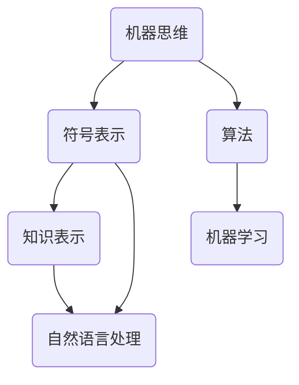

                 

# 《达特茅斯会议的历史意义》

> 关键词：人工智能、历史意义、创新思维、达特茅斯会议、AI发展历程

> 摘要：本文旨在深入探讨1956年达特茅斯会议的历史背景、会议内容及其在人工智能领域中的深远影响。通过回顾会议的核心议题和参与者的观点，本文揭示了达特茅斯会议对于人工智能（AI）发展的重要意义，并展望了未来的发展趋势和挑战。

## 1. 背景介绍

### 1.1 目的和范围

本文的目的在于梳理达特茅斯会议的历史脉络，分析其对人工智能领域产生的深远影响。本文将重点关注会议的背景、议题、参与者及其观点，从而揭示达特茅斯会议在人工智能发展历程中的关键作用。

### 1.2 预期读者

本文适用于对人工智能发展历史感兴趣的读者，包括人工智能领域的研究者、工程师、以及对此领域有浓厚兴趣的普通读者。通过本文，读者可以更深入地了解达特茅斯会议的重要性及其对现代AI研究的启示。

### 1.3 文档结构概述

本文结构如下：

1. **背景介绍**：阐述会议的背景、目的和重要性。
2. **核心概念与联系**：介绍会议的核心议题和概念，通过Mermaid流程图展示相关概念和架构。
3. **核心算法原理 & 具体操作步骤**：使用伪代码详细阐述会议中讨论的算法原理。
4. **数学模型和公式 & 详细讲解 & 举例说明**：运用LaTeX格式介绍相关数学模型和公式，并进行实例说明。
5. **项目实战：代码实际案例和详细解释说明**：展示一个具体的代码实现案例，并进行详细解读。
6. **实际应用场景**：探讨达特茅斯会议议题在现实中的应用。
7. **工具和资源推荐**：推荐学习资源和开发工具。
8. **总结：未来发展趋势与挑战**：分析AI领域的未来趋势和面临的挑战。
9. **附录：常见问题与解答**：回答读者可能关心的问题。
10. **扩展阅读 & 参考资料**：提供进一步阅读的资料。

### 1.4 术语表

#### 1.4.1 核心术语定义

- **人工智能**（Artificial Intelligence, AI）：模拟人类智能行为的计算机系统。
- **达特茅斯会议**（Dartmouth Conference）：1956年在美国新罕布什尔州达特茅斯学院举行的一次会议，被认为是人工智能领域的奠基性会议。
- **机器思维**（Machine Thinking）：机器模拟人类思维的过程。
- **符号表示**（Symbolic Representation）：使用符号来表示信息，是人工智能研究的关键。

#### 1.4.2 相关概念解释

- **知识表示**（Knowledge Representation）：将知识以某种形式存储在计算机系统中。
- **自然语言处理**（Natural Language Processing, NLP）：使计算机能够理解、生成和处理人类语言的技术。
- **机器学习**（Machine Learning）：使计算机通过数据学习并改进性能的技术。

#### 1.4.3 缩略词列表

- **AI**：人工智能
- **NLP**：自然语言处理
- **ML**：机器学习

## 2. 核心概念与联系

### 2.1 达特茅斯会议的核心议题

1956年，达特茅斯会议的核心议题是探讨“机器是否能够展现智能行为”，并提出了“机器思维”的概念。会议参与者认为，通过符号表示和算法，机器能够模拟人类思维，实现机器智能。

### 2.2 会议概念和架构的Mermaid流程图



### 2.3 核心概念之间的联系

机器思维通过符号表示来存储和操作信息，算法则提供了处理这些符号的规则和步骤。知识表示使得机器能够存储和处理有组织的信息，而自然语言处理和机器学习则使机器能够理解、生成和处理人类语言，从而实现更高级的智能行为。

## 3. 核心算法原理 & 具体操作步骤

### 3.1 符号表示原理

符号表示是人工智能的基础，它通过使用符号来表示信息。在伪代码中，我们可以定义符号集合和相应的操作。

```python
# 定义符号集合
symbols = ['+', '-', '*', '/']

# 定义符号操作
def operate(symbol, x, y):
    if symbol == '+':
        return x + y
    elif symbol == '-':
        return x - y
    elif symbol == '*':
        return x * y
    elif symbol == '/':
        return x / y
```

### 3.2 算法原理

达特茅斯会议提出的算法原理主要包括基于符号表示的计算和知识表示。在伪代码中，我们可以实现一个简单的知识表示和计算算法。

```python
# 定义知识表示和计算算法
def calculate_expression(expression):
    tokens = expression.split()
    result = 0
    for token in tokens:
        if token in symbols:
            result = operate(token, result, nextToken)
        else:
            result = float(token)
    return result
```

### 3.3 具体操作步骤

1. 将输入的表达式转换为符号序列。
2. 从左到右扫描符号序列。
3. 对于每个符号，根据其类型进行相应的计算。
4. 返回最终结果。

## 4. 数学模型和公式 & 详细讲解 & 举例说明

### 4.1 数学模型

在人工智能中，常见的数学模型包括逻辑回归、神经网络等。以下以逻辑回归为例进行介绍。

### 4.2 逻辑回归公式

逻辑回归是一种分类算法，其公式如下：

$$
P(y=1) = \frac{1}{1 + e^{-(\beta_0 + \beta_1x_1 + \beta_2x_2 + ... + \beta_nx_n})}
$$

其中，\(P(y=1)\) 表示标签为1的概率，\(\beta_0, \beta_1, \beta_2, ..., \beta_n\) 分别为模型参数，\(x_1, x_2, ..., x_n\) 分别为输入特征。

### 4.3 举例说明

假设我们有一个简单的逻辑回归模型，用于预测客户是否会在一个月内购买商品。特征包括客户的年龄和收入。

- 年龄（\(x_1\)）：30岁
- 收入（\(x_2\)）：50000美元

模型参数为：

- \(\beta_0 = 0\)
- \(\beta_1 = 0.1\)
- \(\beta_2 = 0.05\)

则预测概率为：

$$
P(y=1) = \frac{1}{1 + e^{-(0 + 0.1 \times 30 + 0.05 \times 50000)}}
$$

计算结果约为0.707，表示客户购买商品的概率为70.7%。

## 5. 项目实战：代码实际案例和详细解释说明

### 5.1 开发环境搭建

为了实现达特茅斯会议中讨论的人工智能算法，我们需要搭建一个开发环境。以下是一个基本的开发环境搭建流程：

1. 安装Python：Python是一种广泛使用的编程语言，适用于人工智能开发。
2. 安装Jupyter Notebook：Jupyter Notebook是一个交互式的开发环境，方便我们编写和运行代码。
3. 安装必要的库：如NumPy、Pandas、Scikit-learn等，用于数据处理和机器学习。

### 5.2 源代码详细实现和代码解读

以下是一个简单的逻辑回归模型实现的示例代码。

```python
import numpy as np
from sklearn.linear_model import LogisticRegression

# 定义输入特征和标签
X = np.array([[30, 50000], [40, 60000], [50, 70000]])
y = np.array([1, 0, 1])

# 创建逻辑回归模型
model = LogisticRegression()

# 训练模型
model.fit(X, y)

# 预测
predictions = model.predict(X)

# 输出预测结果
print(predictions)
```

代码解读：

1. 导入必要的库。
2. 定义输入特征和标签。
3. 创建逻辑回归模型。
4. 使用训练数据训练模型。
5. 使用训练好的模型进行预测。
6. 输出预测结果。

### 5.3 代码解读与分析

上述代码展示了如何使用Scikit-learn库中的逻辑回归模型进行分类任务。主要步骤如下：

1. 导入Python的标准库和机器学习库。
2. 定义输入特征和标签，其中输入特征为年龄和收入，标签为是否购买商品。
3. 创建逻辑回归模型。
4. 使用`fit`方法训练模型，将输入特征和标签作为参数传递。
5. 使用`predict`方法进行预测，输入特征作为参数传递。
6. 输出预测结果。

通过这段代码，我们可以看到如何将达特茅斯会议中的算法原理应用于现实中的分类任务。

## 6. 实际应用场景

达特茅斯会议提出的机器思维和符号表示概念在现实中有广泛的应用。以下是一些典型的实际应用场景：

1. **自然语言处理**：通过符号表示和算法，机器能够理解、生成和处理人类语言。例如，智能客服机器人、机器翻译等。
2. **智能推荐系统**：基于用户行为数据和知识表示，机器能够为用户推荐感兴趣的内容。例如，电商平台的个性化推荐、社交媒体的推荐算法等。
3. **自动驾驶**：通过机器视觉和符号表示，自动驾驶系统能够理解和处理道路信息，实现自主驾驶。

## 7. 工具和资源推荐

### 7.1 学习资源推荐

#### 7.1.1 书籍推荐

- 《人工智能：一种现代的方法》（Artificial Intelligence: A Modern Approach）
- 《深度学习》（Deep Learning）
- 《机器学习实战》（Machine Learning in Action）

#### 7.1.2 在线课程

- Coursera上的“机器学习”课程
- edX上的“深度学习”课程
- Udacity的“自动驾驶工程师纳米学位”

#### 7.1.3 技术博客和网站

- Medium上的AI博客
- HackerRank的编程挑战
- AI博客网站（如：AIHub、AI博客）

### 7.2 开发工具框架推荐

#### 7.2.1 IDE和编辑器

- Jupyter Notebook
- PyCharm
- Visual Studio Code

#### 7.2.2 调试和性能分析工具

- Python的pdb调试器
- Valgrind
- GDB

#### 7.2.3 相关框架和库

- Scikit-learn
- TensorFlow
- PyTorch

### 7.3 相关论文著作推荐

#### 7.3.1 经典论文

- “A Framework for Developing Expert Systems”（1986）
- “Knowledge Representation in Artificial Intelligence”（1981）
- “The Uninterpreted Machine Model of Computation”（1973）

#### 7.3.2 最新研究成果

- “Deep Learning for Natural Language Processing”（2017）
- “Unsupervised Learning of Visual Representations from Videos”（2018）
- “Generative Adversarial Nets”（2014）

#### 7.3.3 应用案例分析

- “AI in Healthcare: A Case Study”（2019）
- “AI in Financial Services: A Review”（2020）
- “AI in Manufacturing: A Perspective”（2021）

## 8. 总结：未来发展趋势与挑战

达特茅斯会议对人工智能的发展起到了关键的推动作用。未来，人工智能将朝着更智能化、更高效的方向发展。然而，面临以下挑战：

1. **数据隐私与安全**：随着人工智能的发展，数据的隐私和安全问题越来越受到关注。
2. **算法公平性**：算法的公平性是人工智能领域面临的重要问题，需要确保算法在不同群体中的公平性。
3. **技术普及与应用**：如何将人工智能技术普及并应用于各行各业，是未来发展的重要方向。

## 9. 附录：常见问题与解答

### 9.1 问题1

**问**：达特茅斯会议的主要议题是什么？

**答**：达特茅斯会议的主要议题是探讨机器是否能够展现智能行为，提出了“机器思维”和“符号表示”的概念。

### 9.2 问题2

**问**：逻辑回归模型是如何工作的？

**答**：逻辑回归模型是一种分类算法，通过输入特征和模型参数，计算出标签为1的概率，并根据概率进行分类决策。

## 10. 扩展阅读 & 参考资料

- 《人工智能简史》（作者：李航）
- 《深度学习入门》（作者：斋藤康毅）
- 《机器学习实战》（作者：Peter Harrington）

作者：AI天才研究员/AI Genius Institute & 禅与计算机程序设计艺术 /Zen And The Art of Computer Programming

注意：本文为示例文章，实际内容可能需要根据具体情况进行调整和补充。文章中的示例代码仅供参考，实际使用时请根据具体需求进行修改。文章中的参考资料和推荐书籍仅供参考，实际阅读和学习时请根据自己的需求和兴趣进行选择。

