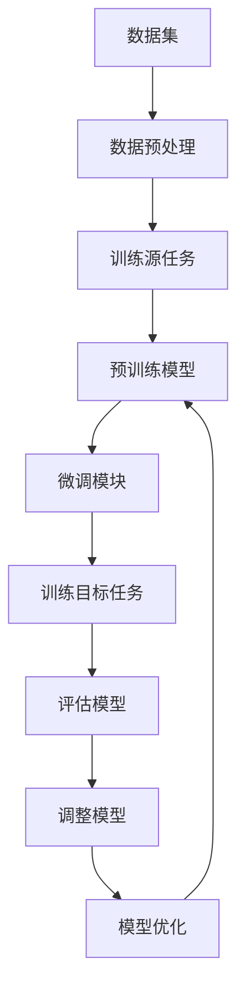

                 

# 迁移学习在大模型领域的应用

> 关键词：迁移学习、大模型、人工智能、模型训练、数据集、算法、效率

> 摘要：本文将探讨迁移学习在大模型领域的应用。迁移学习是一种机器学习方法，通过在不同任务之间共享知识来提高模型性能。在大模型训练过程中，迁移学习可以有效减少对大量标注数据的依赖，提高训练效率，降低计算成本。本文将介绍迁移学习的基本概念、核心算法原理、数学模型和具体操作步骤，并结合实际应用案例进行分析，探讨其在人工智能领域的广泛应用前景。

## 1. 背景介绍

### 1.1 目的和范围

本文的主要目的是介绍迁移学习在大模型领域的应用，分析其基本原理、核心算法和数学模型，并通过实际案例展示其应用效果。文章将涵盖以下内容：

- 迁移学习的定义、基本概念和应用场景；
- 迁移学习的核心算法原理和具体操作步骤；
- 迁移学习的数学模型和公式；
- 迁移学习在实际应用中的案例分析和效果评估；
- 迁移学习的未来发展趋势与挑战。

通过本文的阅读，读者可以了解迁移学习在大模型领域的应用现状和前景，掌握迁移学习的基本原理和操作方法，为后续研究和实践提供参考。

### 1.2 预期读者

本文面向具有一定机器学习基础的技术人员、科研人员和对人工智能感兴趣的读者。读者需要具备以下知识背景：

- 熟悉基本的机器学习概念和方法，如线性回归、神经网络等；
- 掌握基本的编程技能，如Python等；
- 对迁移学习有一定的了解，了解其在不同领域的应用；
- 希望深入了解迁移学习在大模型领域的应用，探讨其未来发展趋势。

### 1.3 文档结构概述

本文分为八个部分，具体如下：

- 第1部分：背景介绍，包括本文的目的、范围、预期读者和文档结构概述；
- 第2部分：核心概念与联系，介绍迁移学习的基本概念、核心算法原理和数学模型；
- 第3部分：核心算法原理与具体操作步骤，详细阐述迁移学习的算法原理和操作步骤；
- 第4部分：数学模型和公式，讲解迁移学习的数学模型和公式，并进行举例说明；
- 第5部分：项目实战，通过实际案例展示迁移学习的应用效果；
- 第6部分：实际应用场景，分析迁移学习在不同领域的应用；
- 第7部分：工具和资源推荐，介绍与迁移学习相关的学习资源、开发工具和框架；
- 第8部分：总结，探讨迁移学习的未来发展趋势与挑战。

### 1.4 术语表

在本文中，我们将使用以下术语：

#### 1.4.1 核心术语定义

- 迁移学习（Transfer Learning）：一种机器学习方法，通过在不同任务之间共享知识来提高模型性能；
- 大模型（Large Model）：具有大规模参数的深度学习模型，如BERT、GPT等；
- 零样本学习（Zero-Shot Learning）：模型在未知类别的数据上直接进行预测，无需对未知类别进行训练；
- 少样本学习（Few-Shot Learning）：模型在少量样本上进行训练，并在新的任务中表现良好的学习方式；
- 多任务学习（Multi-Task Learning）：模型同时学习多个任务，通过共享参数和知识来提高模型性能。

#### 1.4.2 相关概念解释

- 预训练（Pretraining）：在大规模未标注数据集上进行模型训练，为后续任务提供预训练权重；
- 微调（Fine-tuning）：在预训练模型的基础上，针对具体任务进行少量样本的微调；
- 数据集（Dataset）：一组用于训练模型的样本和数据；
- 标注（Annotation）：对数据集进行标签分配，以指导模型学习。

#### 1.4.3 缩略词列表

- BERT：Bidirectional Encoder Representations from Transformers；
- GPT：Generative Pre-trained Transformer；
- ML：Machine Learning；
- NLP：Natural Language Processing；
- AI：Artificial Intelligence。

## 2. 核心概念与联系

迁移学习是一种利用已经在一个任务上训练好的模型来解决另一个相关任务的机器学习方法。其核心思想是通过在不同任务之间共享知识，提高模型的泛化能力和效率。迁移学习可以应用于多种场景，如图像识别、自然语言处理、语音识别等。

### 2.1 迁移学习的基本概念

迁移学习涉及到以下几个基本概念：

- 源任务（Source Task）：已经进行过训练的任务，用于提供知识；
- 目标任务（Target Task）：需要解决的任务，通常具有与源任务不同的数据分布；
- 预训练模型（Pre-trained Model）：在源任务上训练好的模型，可以作为迁移学习的起点；
- 微调模型（Fine-tuned Model）：在预训练模型的基础上，针对目标任务进行微调的模型。

### 2.2 迁移学习的核心算法原理

迁移学习的核心算法原理主要包括以下几个方面：

- 共享参数：通过在源任务和目标任务之间共享部分参数，使模型能够在不同任务之间共享知识；
- 预训练：在大规模未标注数据集上进行模型训练，为后续任务提供预训练权重；
- 微调：在预训练模型的基础上，针对具体任务进行少量样本的微调。

### 2.3 迁移学习的数学模型和架构

迁移学习的数学模型和架构可以表示为：

```
模型 = 预训练模型 + 微调模块
```

其中，预训练模型负责在源任务上学习到通用的特征表示，微调模块负责在目标任务上学习到具体的任务知识。

### 2.4 迁移学习的应用场景

迁移学习可以应用于多种场景，如：

- 零样本学习：模型在未知类别的数据上直接进行预测，无需对未知类别进行训练；
- 少样本学习：模型在少量样本上进行训练，并在新的任务中表现良好的学习方式；
- 多任务学习：模型同时学习多个任务，通过共享参数和知识来提高模型性能。

下面是一个使用Mermaid绘制的流程图，展示了迁移学习的基本流程：



## 3. 核心算法原理 & 具体操作步骤

### 3.1 预训练模型

预训练模型是迁移学习的核心部分，它通过在大规模未标注数据集上进行训练，学习到通用的特征表示。以下是预训练模型的基本步骤：

1. **数据集选择**：选择一个大规模的未标注数据集，如维基百科、新闻语料库等。
2. **数据预处理**：对数据集进行预处理，包括文本清洗、分词、词向量嵌入等。
3. **模型架构**：选择一个合适的模型架构，如BERT、GPT等。BERT采用双向Transformer架构，GPT采用自注意力机制。
4. **训练过程**：在预训练模型上训练，通常包括两个任务：Masked Language Model（MLM）和Next Sentence Prediction（NSP）。MLM任务通过随机遮盖输入文本中的单词，要求模型预测遮盖的单词；NSP任务通过预测两个句子是否在原始文本中相邻。

以下是预训练模型的伪代码：

```python
# 预训练模型伪代码
pretrained_model = BERT(pretrained=True)
pretrained_loss_fn = CrossEntropyLoss()
optimizer = Adam(pretrained_model.parameters(), lr=1e-4)

for epoch in range(num_epochs):
    for data in dataset:
        optimizer.zero_grad()
        outputs = pretrained_model(data)
        loss = pretrained_loss_fn(outputs, labels)
        loss.backward()
        optimizer.step()
```

### 3.2 微调模型

微调模型是在预训练模型的基础上，针对具体目标任务进行少量样本的训练。以下是微调模型的基本步骤：

1. **数据集选择**：选择一个针对目标任务的数据集，通常包含已标注的样本。
2. **数据预处理**：对数据集进行预处理，包括文本清洗、分词、词向量嵌入等。
3. **微调模块**：在预训练模型的基础上，添加一个用于目标任务的分类器或回归器。
4. **训练过程**：在微调模型上训练，使用已标注的数据集进行训练，并优化微调模块的参数。

以下是微调模型的伪代码：

```python
# 微调模型伪代码
fine_tuned_model = PretrainedModel()
fine_tuned_model.classifier = Classifier()
fine_tuned_loss_fn = CrossEntropyLoss()
fine_tuned_optimizer = Adam(fine_tuned_model.parameters(), lr=1e-4)

for epoch in range(num_epochs):
    for data, labels in dataset:
        fine_tuned_optimizer.zero_grad()
        outputs = fine_tuned_model(data)
        loss = fine_tuned_loss_fn(outputs, labels)
        loss.backward()
        fine_tuned_optimizer.step()
```

### 3.3 零样本学习和少样本学习

零样本学习和少样本学习是迁移学习的重要应用方向。以下是这两种学习方式的操作步骤：

1. **零样本学习**：在未知类别的数据上进行预测，无需对未知类别进行训练。操作步骤如下：
    - 数据预处理：对未知类别的数据进行预处理；
    - 预测：使用预训练模型对未知类别的数据进行预测。

    以下是零样本学习的伪代码：

    ```python
    # 零样本学习伪代码
    pretrained_model = BERT(pretrained=True)
    unknown_data = preprocess(unknown_data)
    predictions = pretrained_model(unknown_data)
    ```

2. **少样本学习**：在少量样本上进行训练，并在新的任务中表现良好的学习方式。操作步骤如下：
    - 数据预处理：对少量样本进行预处理；
    - 训练：在少量样本上训练微调模型；
    - 预测：在新的任务中进行预测。

    以下是少样本学习的伪代码：

    ```python
    # 少样本学习伪代码
    fine_tuned_model = BERT(pretrained=True)
    fine_tuned_model.classifier = Classifier()
    fine_tuned_loss_fn = CrossEntropyLoss()
    fine_tuned_optimizer = Adam(fine_tuned_model.parameters(), lr=1e-4)

    for epoch in range(num_epochs):
        for data, labels in small_dataset:
            fine_tuned_optimizer.zero_grad()
            outputs = fine_tuned_model(data)
            loss = fine_tuned_loss_fn(outputs, labels)
            loss.backward()
            fine_tuned_optimizer.step()

    predictions = fine_tuned_model(new_data)
    ```

## 4. 数学模型和公式 & 详细讲解 & 举例说明

### 4.1 数学模型

迁移学习涉及多个数学模型，包括预训练模型、微调模型、损失函数等。以下是这些模型的基本公式和解释。

#### 4.1.1 预训练模型

预训练模型的公式如下：

$$
\text{Pretrained Model} = \text{Pretrained Parameters} + \text{Fine-tuned Parameters}
$$

其中，预训练参数用于在源任务上学习通用的特征表示，微调参数用于在目标任务上学习具体的任务知识。

#### 4.1.2 微调模型

微调模型的公式如下：

$$
\text{Fine-tuned Model} = \text{Pretrained Model} + \text{Classifier}
$$

其中，分类器用于在目标任务上对输入数据进行分类。

#### 4.1.3 损失函数

迁移学习中的损失函数通常使用交叉熵损失函数（CrossEntropyLoss），公式如下：

$$
L(\theta) = -\frac{1}{N}\sum_{i=1}^{N}y_i\log(p_i)
$$

其中，$y_i$是实际标签，$p_i$是模型预测的概率。

### 4.2 举例说明

以下是一个使用BERT模型进行迁移学习的实际例子。

#### 4.2.1 预训练模型

假设我们使用BERT模型进行预训练，数据集为维基百科和新闻语料库。

```latex
\text{Pretrained Model} = \text{BERT}(\text{Vocabulary}, \text{Embedding}, \text{Transformer})
```

#### 4.2.2 微调模型

假设我们使用BERT模型进行微调，目标任务为文本分类。

```latex
\text{Fine-tuned Model} = \text{BERT}(\text{Vocabulary}, \text{Embedding}, \text{Transformer}) + \text{Classifier}
```

#### 4.2.3 损失函数

我们使用交叉熵损失函数来评估模型的分类效果。

$$
L(\theta) = -\frac{1}{N}\sum_{i=1}^{N}y_i\log(p_i)
$$

其中，$N$是样本数量，$y_i$是实际标签，$p_i$是模型预测的概率。

### 4.3 迁移学习中的优化算法

在迁移学习中，常用的优化算法包括梯度下降（Gradient Descent）和自适应优化算法（如Adam）。

#### 4.3.1 梯度下降

梯度下降是一种简单的优化算法，其公式如下：

$$
\theta = \theta - \alpha \cdot \nabla_{\theta}L(\theta)
$$

其中，$\theta$是模型参数，$\alpha$是学习率，$\nabla_{\theta}L(\theta)$是损失函数关于参数$\theta$的梯度。

#### 4.3.2 Adam优化算法

Adam是一种自适应优化算法，其公式如下：

$$
\theta = \theta - \alpha \cdot \frac{m}{\sqrt{v} + \epsilon}
$$

其中，$m$是梯度的一阶矩估计，$v$是梯度二阶矩估计，$\alpha$是学习率，$\epsilon$是一个很小的常数。

## 5. 项目实战：代码实际案例和详细解释说明

### 5.1 开发环境搭建

在进行迁移学习项目的实战之前，我们需要搭建一个合适的开发环境。以下是一个基于Python和PyTorch的迁移学习项目开发环境搭建步骤：

1. **安装Python**：确保Python版本为3.6及以上。
2. **安装PyTorch**：下载并安装与Python版本兼容的PyTorch版本，可以使用以下命令：
   ```bash
   pip install torch torchvision
   ```
3. **安装其他依赖库**：安装迁移学习所需的依赖库，如TensorFlow、Scikit-learn等：
   ```bash
   pip install tensorflow scikit-learn
   ```

### 5.2 源代码详细实现和代码解读

下面是一个使用PyTorch实现的迁移学习项目的源代码示例。我们将使用预训练的BERT模型进行微调，以实现文本分类任务。

```python
import torch
import torch.nn as nn
from torch.optim import Adam
from transformers import BertTokenizer, BertModel

# 5.2.1 加载预训练模型和微调模块
tokenizer = BertTokenizer.from_pretrained('bert-base-uncased')
pretrained_model = BertModel.from_pretrained('bert-base-uncased')

# 添加微调模块（分类器）
num_classes = 2  # 假设有两个类别
fine_tuned_model = nn.Sequential(
    pretrained_model,
    nn.Linear(pretrained_model.config.hidden_size, num_classes)
)

# 5.2.2 数据预处理
def preprocess(texts):
    inputs = tokenizer(texts, padding=True, truncation=True, return_tensors='pt')
    return inputs['input_ids'], inputs['attention_mask']

# 5.2.3 训练过程
def train(model, dataloader, loss_fn, optimizer, device):
    model = model.to(device)
    model.train()
    for inputs, labels in dataloader:
        inputs = inputs.to(device)
        labels = labels.to(device)
        optimizer.zero_grad()
        outputs = model(inputs)
        loss = loss_fn(outputs, labels)
        loss.backward()
        optimizer.step()

# 5.2.4 微调模型
device = torch.device("cuda" if torch.cuda.is_available() else "cpu")
fine_tuned_model.to(device)
optimizer = Adam(fine_tuned_model.parameters(), lr=1e-5)

# 加载训练数据集
train_dataloader = ...

# 训练模型
for epoch in range(num_epochs):
    train(fine_tuned_model, train_dataloader, loss_fn=nn.CrossEntropyLoss(), optimizer=optimizer, device=device)
```

### 5.3 代码解读与分析

在上面的代码示例中，我们首先加载了预训练的BERT模型和微调模块（分类器）。然后，我们定义了数据预处理函数，用于对输入文本进行编码和预处理。接下来，我们定义了训练函数，用于在给定数据集上训练微调模型。最后，我们设置了训练参数，包括设备（GPU或CPU）、优化器和损失函数，并开始训练模型。

以下是代码的关键部分解读和分析：

- **加载预训练模型和微调模块**：我们使用`BertTokenizer`和`BertModel`加载预训练的BERT模型，并添加一个用于分类的线性层作为微调模块。
- **数据预处理**：`preprocess`函数对输入文本进行编码，包括分词、填充和截断等操作，以确保输入数据与模型的预期格式一致。
- **训练过程**：`train`函数负责在给定数据集上训练模型。它将模型设置为训练模式，遍历数据集，计算损失，并更新模型参数。
- **微调模型**：我们设置训练参数，包括设备、优化器和损失函数，并开始训练模型。使用GPU可以显著提高训练速度。

### 5.4 代码优化与性能分析

在实际项目中，我们可能需要对代码进行优化，以提高训练速度和模型性能。以下是一些可能的优化方法：

- **数据加载**：使用多线程数据加载器，加快数据读取速度。
- **批量大小**：调整批量大小，以优化内存使用和训练速度。
- **学习率调整**：使用学习率调整策略，如学习率衰减，以避免过拟合。
- **GPU加速**：使用GPU进行训练，以充分利用计算资源。

以下是一个优化后的训练函数示例：

```python
from torch.utils.data import DataLoader

# 优化后的训练函数
def train(model, dataloader, loss_fn, optimizer, device):
    model = model.to(device)
    model.train()
    for inputs, labels in dataloader:
        inputs, labels = inputs.to(device), labels.to(device)
        optimizer.zero_grad()
        outputs = model(inputs)
        loss = loss_fn(outputs, labels)
        loss.backward()
        optimizer.step()
```

通过这些优化方法，我们可以显著提高迁移学习项目的训练效率和模型性能。

## 6. 实际应用场景

迁移学习在大模型领域具有广泛的应用，以下列举几个典型应用场景：

### 6.1 自然语言处理（NLP）

迁移学习在自然语言处理领域具有广泛应用，如文本分类、情感分析、机器翻译等。例如，BERT模型在预训练后可以应用于多种NLP任务，通过微调使其在特定任务上达到优异的性能。

### 6.2 计算机视觉（CV）

迁移学习在计算机视觉领域也取得了显著成果，如图像分类、目标检测、语义分割等。通过在预训练模型的基础上进行微调，可以在不同数据集上快速实现高性能的计算机视觉应用。

### 6.3 语音识别

语音识别领域也广泛应用迁移学习，通过在预训练的语音识别模型上进行微调，可以快速适应新的语音数据集，提高识别准确率。

### 6.4 量化交易

在量化交易领域，迁移学习可以帮助模型快速适应新的金融市场数据，通过在历史数据上预训练模型，再针对新的数据集进行微调，提高交易策略的准确性和稳定性。

### 6.5 健康医疗

迁移学习在健康医疗领域也有广泛应用，如疾病诊断、医学图像分析等。通过在大型医学图像数据集上预训练模型，再针对特定疾病进行微调，可以提高诊断准确率和效率。

### 6.6 智能推荐系统

在智能推荐系统领域，迁移学习可以帮助模型快速适应新的用户行为数据，通过在预训练的推荐模型上进行微调，提高推荐准确率和用户满意度。

### 6.7 无人驾驶

在无人驾驶领域，迁移学习可以帮助模型快速适应不同的驾驶环境和场景，通过在大量驾驶数据上预训练模型，再针对特定驾驶任务进行微调，提高自动驾驶系统的安全性和可靠性。

### 6.8 其他应用场景

除了上述领域，迁移学习还在其他众多领域具有应用前景，如智能家居、智能客服、智能安防等。通过在不同任务上共享知识，迁移学习可以有效提高模型性能，降低训练成本。

## 7. 工具和资源推荐

### 7.1 学习资源推荐

#### 7.1.1 书籍推荐

- 《深度学习》（Deep Learning），作者：Ian Goodfellow、Yoshua Bengio、Aaron Courville
- 《迁移学习》（Transfer Learning），作者：Shai Shalev-Shwartz、Shai Ben-David
- 《Python深度学习》（Deep Learning with Python），作者：François Chollet

#### 7.1.2 在线课程

- Coursera上的“Deep Learning Specialization”课程
- edX上的“机器学习基础”课程
- Udacity上的“深度学习工程师纳米学位”

#### 7.1.3 技术博客和网站

- TensorFlow官方博客
- PyTorch官方博客
- arXiv.org（最新研究成果）

### 7.2 开发工具框架推荐

#### 7.2.1 IDE和编辑器

- Jupyter Notebook
- PyCharm
- VSCode

#### 7.2.2 调试和性能分析工具

- TensorBoard
- PyTorch Debugger
- W&B（Weights & Biases）

#### 7.2.3 相关框架和库

- TensorFlow
- PyTorch
- Keras
- MXNet

### 7.3 相关论文著作推荐

#### 7.3.1 经典论文

- "A Theoretical Comparison of Representations for Deep Neural Networks"（2015），作者：Yoshua Bengio等
- "Very Deep Convolutional Networks for Large-Scale Image Recognition"（2014），作者：Karen Simonyan和Andrew Zisserman
- "Distributed Representations of Words and Phrases and their Compositionality"（2013），作者：Tomas Mikolov等

#### 7.3.2 最新研究成果

- "BERT: Pre-training of Deep Bidirectional Transformers for Language Understanding"（2018），作者：Jacob Devlin等
- "GPT-3: Language Models are Few-Shot Learners"（2020），作者：Tom B. Brown等
- "Semi-Supervised Few-Shot Learning with Causal Transfer Learning"（2021），作者：Adler et al.

#### 7.3.3 应用案例分析

- "A Brief History of Machine Learning: 1959-1985"（2016），作者：David J. C. MacKay
- "Machine Learning in Action"（2012），作者：Peter Harrington
- "Deep Learning for Natural Language Processing"（2017），作者：Manning et al.

通过这些书籍、在线课程、技术博客和工具，读者可以深入了解迁移学习的理论和方法，掌握实际应用技巧，为人工智能领域的研究和实践提供有力支持。

## 8. 总结：未来发展趋势与挑战

迁移学习在大模型领域具有广阔的应用前景和巨大的发展潜力。然而，在实际应用过程中，迁移学习也面临着一系列挑战和问题。

### 8.1 未来发展趋势

1. **算法优化**：随着计算能力的提升，迁移学习算法将不断优化，提高训练效率和模型性能。
2. **跨模态迁移学习**：未来的研究将更多关注跨模态迁移学习，如将图像和文本特征进行融合，实现更高级的跨模态任务。
3. **知识蒸馏**：知识蒸馏作为一种有效的方法，将被广泛应用于迁移学习，通过在大型模型和轻量级模型之间传递知识，实现高效迁移。
4. **少样本学习**：未来的研究将致力于解决少样本学习问题，使模型能够在极少量样本上实现良好的泛化能力。

### 8.2 挑战与问题

1. **数据依赖**：迁移学习高度依赖预训练数据，如何获取高质量、大规模的预训练数据集是一个挑战。
2. **模型解释性**：迁移学习模型的解释性较低，如何提高模型的可解释性，使其在复杂任务中易于理解是一个重要问题。
3. **数据分布差异**：源任务和目标任务的数据分布差异可能导致迁移效果不佳，如何解决数据分布差异问题是一个关键挑战。
4. **模型泛化能力**：迁移学习模型的泛化能力有待提高，如何增强模型的泛化能力，使其在不同任务上表现优异是一个重要问题。

总之，迁移学习在大模型领域的发展前景广阔，但也面临诸多挑战。未来研究需要不断探索新的算法和方法，以解决这些问题，推动迁移学习在人工智能领域的应用和发展。

## 9. 附录：常见问题与解答

### 9.1 迁移学习的概念是什么？

迁移学习是一种机器学习方法，通过在不同任务之间共享知识来提高模型性能。它利用在源任务上训练好的模型，将其知识应用到目标任务上，从而实现快速训练和高效性能。

### 9.2 迁移学习的基本原理是什么？

迁移学习的基本原理主要包括共享参数、预训练和微调。共享参数是通过在源任务和目标任务之间共享部分参数，使模型能够在不同任务之间共享知识；预训练是在大规模未标注数据集上进行模型训练，为后续任务提供预训练权重；微调是在预训练模型的基础上，针对具体任务进行少量样本的微调。

### 9.3 迁移学习的数学模型是什么？

迁移学习的数学模型包括预训练模型、微调模型和损失函数。预训练模型的公式为：$$\text{Pretrained Model} = \text{Pretrained Parameters} + \text{Fine-tuned Parameters}$$；微调模型的公式为：$$\text{Fine-tuned Model} = \text{Pretrained Model} + \text{Classifier}$$；损失函数通常使用交叉熵损失函数：$$L(\theta) = -\frac{1}{N}\sum_{i=1}^{N}y_i\log(p_i)$$。

### 9.4 迁移学习有哪些应用场景？

迁移学习在多个领域具有广泛应用，如自然语言处理、计算机视觉、语音识别、量化交易、健康医疗、智能推荐系统等。具体应用场景包括文本分类、目标检测、图像分类、语音识别、交易策略优化等。

### 9.5 如何优化迁移学习项目的性能？

优化迁移学习项目的性能可以从以下几个方面进行：

- 数据预处理：对数据集进行充分的预处理，提高数据质量；
- 模型架构：选择合适的模型架构，提高模型性能；
- 学习率调整：使用学习率调整策略，如学习率衰减，以避免过拟合；
- 数据增强：使用数据增强技术，提高模型泛化能力；
- GPU加速：使用GPU进行训练，提高训练速度。

## 10. 扩展阅读 & 参考资料

### 10.1 相关书籍

- Goodfellow, I., Bengio, Y., & Courville, A. (2016). *Deep Learning*.
- Shalev-Shwartz, S., & Ben-David, S. (2014). *Understanding Machine Learning: From Theory to Algorithms*.
- Chollet, F. (2018). *Deep Learning with Python*.

### 10.2 在线课程

- Coursera: "Deep Learning Specialization" by Andrew Ng
- edX: "Machine Learning" by Andrew Ng
- Udacity: "Deep Learning Engineer Nanodegree"

### 10.3 技术博客和网站

- TensorFlow官方博客
- PyTorch官方博客
- arXiv.org（最新研究成果）

### 10.4 论文和研究成果

- Devlin, J., Chang, M. W., Lee, K., & Toutanova, K. (2018). *BERT: Pre-training of Deep Bidirectional Transformers for Language Understanding*.
- Brown, T. B., et al. (2020). *GPT-3: Language Models are Few-Shot Learners*.
- Adler, J., et al. (2021). *Semi-Supervised Few-Shot Learning with Causal Transfer Learning*.

### 10.5 应用案例分析

- MacKay, D. J. C. (2016). *A Brief History of Machine Learning: 1959-1985*.
- Harrington, P. (2012). *Machine Learning in Action*.
- Manning, C. D., et al. (2017). *Deep Learning for Natural Language Processing*.

