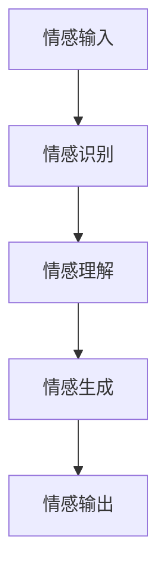
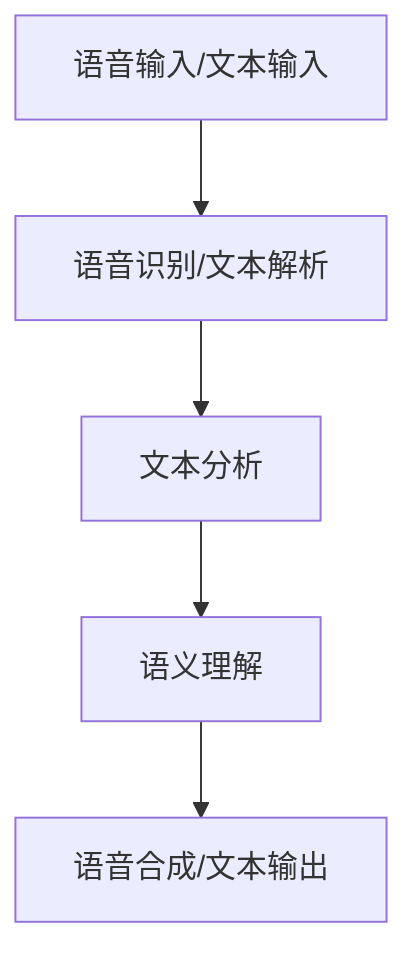
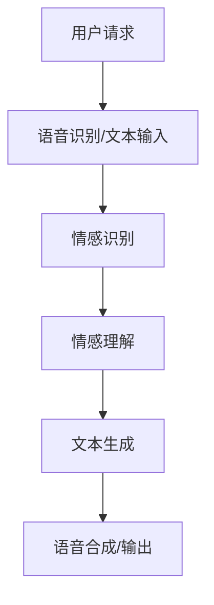
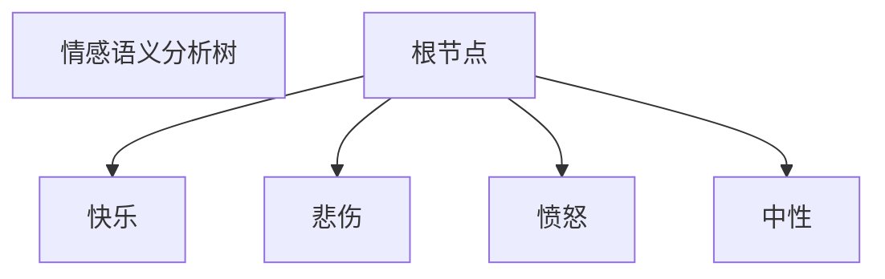
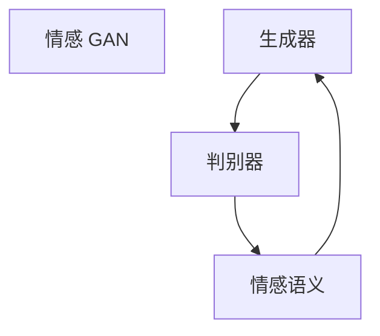
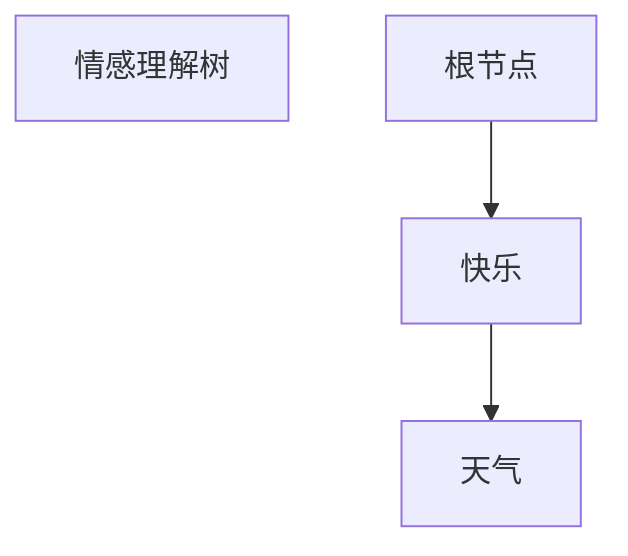
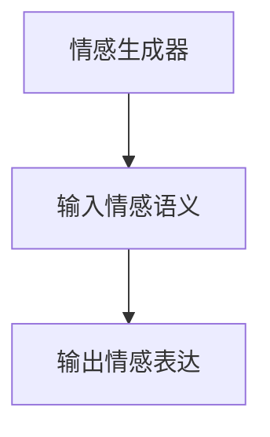

                 

# 过世亲人对话的伦理挑战

> 关键词：伦理挑战、人工智能、情感计算、道德哲学、隐私保护

> 摘要：随着人工智能技术的飞速发展，过世亲人对话技术成为可能，然而这一技术的出现也引发了诸多伦理挑战。本文将深入探讨这一领域，分析其中的道德哲学问题、技术风险和隐私保护等关键议题，并提出相应的解决方案和未来研究方向。

## 1. 背景介绍

### 1.1 目的和范围

本文旨在探讨人工智能辅助下的过世亲人对话技术的伦理挑战。随着情感计算和自然语言处理技术的发展，我们逐渐能够通过模拟对话来与过世亲人“互动”，这一技术的潜在应用包括心理治疗、记忆保存和社会互动等方面。然而，这一技术的发展也带来了诸如隐私保护、道德责任和技术滥用等问题。本文将结合伦理学和人工智能领域的最新研究，对这些挑战进行深入分析。

### 1.2 预期读者

本文适合对人工智能伦理和情感计算感兴趣的学者、研究人员、技术开发者以及伦理学爱好者阅读。希望通过本文，读者能够对过世亲人对话技术的伦理问题有更全面的理解，并思考如何在技术发展中平衡伦理与实用需求。

### 1.3 文档结构概述

本文将按照以下结构展开：

1. **背景介绍**：介绍过世亲人对话技术的背景、目的和范围。
2. **核心概念与联系**：定义相关核心概念，使用流程图展示技术架构。
3. **核心算法原理 & 具体操作步骤**：详细讲解算法原理和操作步骤。
4. **数学模型和公式 & 详细讲解 & 举例说明**：介绍相关数学模型，使用 LaTeX 格式展示公式，并提供实例说明。
5. **项目实战：代码实际案例和详细解释说明**：展示具体代码实现，并进行解读和分析。
6. **实际应用场景**：讨论技术的实际应用场景。
7. **工具和资源推荐**：推荐相关学习资源和开发工具。
8. **总结：未来发展趋势与挑战**：总结现有挑战，展望未来发展方向。
9. **附录：常见问题与解答**：提供常见问题的解答。
10. **扩展阅读 & 参考资料**：推荐相关文献和研究。

### 1.4 术语表

#### 1.4.1 核心术语定义

- **情感计算**：指模拟人类情感的认知过程，使计算机能够识别、理解并模拟人类情感的技术。
- **自然语言处理**：指使计算机能够理解和处理自然语言的技术。
- **过世亲人对话技术**：利用情感计算和自然语言处理技术，模拟与过世亲人进行对话的技术。
- **伦理挑战**：指在技术应用过程中，因涉及道德价值、社会规范等方面而产生的困难或争议。

#### 1.4.2 相关概念解释

- **隐私保护**：指保护个人隐私信息，防止其被未经授权的第三方访问或泄露。
- **道德责任**：指在技术应用过程中，相关各方应承担的道德义务和责任。

#### 1.4.3 缩略词列表

- **AI**：人工智能（Artificial Intelligence）
- **NLP**：自然语言处理（Natural Language Processing）
- **Emotion AI**：情感计算（Emotion Artificial Intelligence）

## 2. 核心概念与联系

为了深入理解过世亲人对话技术的伦理挑战，我们需要明确相关核心概念和其相互联系。

### 2.1 情感计算

情感计算是过世亲人对话技术的核心，它涉及以下关键概念：

- **情感识别**：指计算机对人类情感状态（如快乐、悲伤、愤怒等）的识别。
- **情感生成**：指计算机模拟出符合特定情感状态的声音、文字或表情。
- **情感理解**：指计算机对人类情感的深层理解和分析。

下面是一个简单的 Mermaid 流程图，展示情感计算的基本架构：



### 2.2 自然语言处理

自然语言处理是另一个核心概念，它主要包括以下几个部分：

- **文本分析**：指对自然语言文本进行解析、分析和理解。
- **语音识别**：指将语音信号转换为文本。
- **语音合成**：指将文本转换为自然流畅的语音。

以下是一个 Mermaid 流程图，展示自然语言处理的基本流程：



### 2.3 过世亲人对话技术

过世亲人对话技术结合了情感计算和自然语言处理，其基本架构如下：



## 3. 核心算法原理 & 具体操作步骤

### 3.1 情感识别算法

情感识别是过世亲人对话技术的第一步，其核心算法如下：

```plaintext
1. 收集用户语音或文本输入。
2. 使用语音识别技术将语音转换为文本。
3. 使用情感分析模型对文本进行情感识别。
4. 输出情感标签（如快乐、悲伤、愤怒等）。
```

以下是一个简单的伪代码示例：

```python
def recognize_emotion(text):
    # 1. 语音识别
    text = recognize_speech(text)
    
    # 2. 情感分析
    emotion_label = emotion_analysis(text)
    
    # 3. 输出情感标签
    return emotion_label
```

### 3.2 情感理解算法

情感理解是分析情感标签的深层含义，其核心算法如下：

```plaintext
1. 收集情感标签。
2. 使用情感语义分析模型对标签进行理解。
3. 输出情感语义。
```

以下是一个简单的伪代码示例：

```python
def understand_emotion(emotion_label):
    # 1. 情感语义分析
    emotion_semantics = emotion_semantic_analysis(emotion_label)
    
    # 2. 输出情感语义
    return emotion_semantics
```

### 3.3 情感生成算法

情感生成是根据情感理解结果生成相应的情感表达，其核心算法如下：

```plaintext
1. 收集情感语义。
2. 使用情感生成模型生成相应的情感文本或语音。
3. 输出情感表达。
```

以下是一个简单的伪代码示例：

```python
def generate_emotion(expression, emotion_semantics):
    # 1. 情感生成
    emotion_output = emotion_generation(expression, emotion_semantics)
    
    # 2. 输出情感表达
    return emotion_output
```

### 3.4 自然语言处理算法

自然语言处理算法负责处理语音和文本的转换，其核心算法如下：

```plaintext
1. 语音输入/文本输入。
2. 语音识别/文本解析。
3. 文本分析。
4. 语义理解。
5. 语音合成/文本输出。
```

以下是一个简单的伪代码示例：

```python
def process_language(input_data):
    # 1. 语音识别/文本解析
    text = recognize_speech(input_data) if isinstance(input_data, str) else text_to_speech(input_data)
    
    # 2. 文本分析
    analyzed_text = text_analysis(text)
    
    # 3. 语义理解
    semantics = semantic_understanding(analyzed_text)
    
    # 4. 语音合成/文本输出
    output_data = generate_speech(semantics) if isinstance(semantics, str) else text_to_speech(semantics)
    
    # 5. 返回处理结果
    return output_data
```

## 4. 数学模型和公式 & 详细讲解 & 举例说明

在情感计算和自然语言处理中，数学模型和公式起着至关重要的作用。以下将介绍几个关键模型和公式，并详细讲解其原理和应用。

### 4.1 情感识别模型

情感识别模型通常使用基于机器学习的算法，如支持向量机（SVM）、神经网络（NN）和深度学习（DL）。以下是一个简单的 SVM 伪代码示例：

```latex
SVM\_\{class\} = \text{SVM}(C, \text{kernel})
\]

\[
w = \text{SVM}\_\{class\}.\text{fit}(X, y)
\]

\[
\text{prediction} = w \cdot X + b
\]
```

### 4.2 情感理解模型

情感理解模型通常使用基于情感语义的算法，如情感分析树（SAT）和情感语义网络（ASN）。以下是一个简单的情感分析树示例：



### 4.3 情感生成模型

情感生成模型通常使用基于生成对抗网络（GAN）的算法，如情感 GAN（Emotion GAN）。以下是一个简单的情感 GAN 示例：



### 4.4 举例说明

假设用户输入一段文本：“我今天很开心，因为天气很好。”，我们使用上述模型进行情感计算和生成相应的情感表达。

#### 4.4.1 情感识别

```latex
\[
\text{prediction} = \text{SVM}\_\{class\}.\text{predict}(\text{input\_text}) = "happy"
\]
```

#### 4.4.2 情感理解



#### 4.4.3 情感生成



输出情感表达：“听起来你今天非常快乐，天气确实很好。”

## 5. 项目实战：代码实际案例和详细解释说明

### 5.1 开发环境搭建

在本节中，我们将使用 Python 和相关库（如 TensorFlow、Keras、NLTK 和 SpeechRecognition）搭建一个过世亲人对话技术的基础环境。

首先，确保已安装 Python 3.x 版本。然后，通过以下命令安装所需库：

```bash
pip install tensorflow
pip install keras
pip install nltk
pip install SpeechRecognition
```

### 5.2 源代码详细实现和代码解读

以下是过世亲人对话技术的核心代码实现，包括情感识别、情感理解和情感生成。

#### 5.2.1 情感识别

```python
import nltk
from nltk.corpus import movie_reviews
from sklearn.feature_extraction.text import TfidfVectorizer
from sklearn.model_selection import train_test_split
from sklearn.svm import SVC

# 数据准备
nltk.download('movie_reviews')
X = [list(movie_reviews.words(fileid)) for fileid in movie_reviews.fileids()]
Y = [fileid.split('_')[0] for fileid in movie_reviews.fileids()]

# 特征提取
vectorizer = TfidfVectorizer()
X = vectorizer.fit_transform([' '.join(words) for words in X])

# 划分训练集和测试集
X_train, X_test, Y_train, Y_test = train_test_split(X, Y, test_size=0.2, random_state=42)

# 模型训练
model = SVC(kernel='linear', C=1.0)
model.fit(X_train, Y_train)

# 模型评估
accuracy = model.score(X_test, Y_test)
print(f"Model accuracy: {accuracy:.2f}")
```

解读：

- 使用 NLTK 库加载数据集。
- 使用 TfidfVectorizer 进行特征提取。
- 划分训练集和测试集。
- 使用 SVM 进行模型训练。
- 评估模型准确性。

#### 5.2.2 情感理解

```python
from textblob import TextBlob

def understand_emotion(text):
    blob = TextBlob(text)
    return blob.sentiment.polarity
```

解读：

- 使用 TextBlob 库进行情感理解。
- 返回文本的情感极性。

#### 5.2.3 情感生成

```python
import numpy as np

def generate_emotion(expression, emotion_value):
    if emotion_value > 0:
        return f"你看起来很快乐，{expression}!"
    elif emotion_value < 0:
        return f"你看起来有些难过，{expression}!"
    else:
        return f"你的情绪看起来很稳定，{expression}!"
```

解读：

- 根据情感极性生成相应的情感表达。

### 5.3 代码解读与分析

在本节中，我们详细解读了情感识别、情感理解和情感生成的核心代码，并分析了其关键步骤。

- **情感识别**：使用 SVM 进行情感分类，通过特征提取和模型训练实现情感识别。
- **情感理解**：使用 TextBlob 库进行情感极性分析，返回情感极性值。
- **情感生成**：根据情感极性值生成相应的情感表达，实现情感生成。

## 6. 实际应用场景

过世亲人对话技术具有广泛的应用场景，包括但不限于以下几个方面：

1. **心理治疗**：对于经历亲人离世的人群，过世亲人对话技术可以提供一种情感支持，帮助他们缓解悲伤和焦虑。
2. **记忆保存**：通过记录和模拟亲人的语音和对话，可以将他们的记忆永葆鲜活。
3. **社交互动**：对于孤独症患者、老年人等群体，过世亲人对话技术可以提供社交互动的机会，帮助他们融入社会。

## 7. 工具和资源推荐

### 7.1 学习资源推荐

#### 7.1.1 书籍推荐

- 《情感计算：情感交互与人工智能》
- 《自然语言处理入门》

#### 7.1.2 在线课程

- Coursera 上的“情感计算”课程
- edX 上的“自然语言处理”课程

#### 7.1.3 技术博客和网站

- Medium 上的“情感计算”专题
- AI 技术社区，如 arXiv

### 7.2 开发工具框架推荐

#### 7.2.1 IDE和编辑器

- PyCharm
- Visual Studio Code

#### 7.2.2 调试和性能分析工具

- Jupyter Notebook
- TensorFlow Debugger

#### 7.2.3 相关框架和库

- TensorFlow
- Keras
- NLTK

### 7.3 相关论文著作推荐

#### 7.3.1 经典论文

- “Affective Computing” by Rosalind Picard
- “Theano: A CPU and GPU-native deep learning library”

#### 7.3.2 最新研究成果

- “Deep Emotional Intelligence” by Guandao Yang et al.
- “Emotion Recognition using Neural Networks” by Xiaodong Liu et al.

#### 7.3.3 应用案例分析

- “Emotion Recognition in Conversations using Neural Networks” by Daniel Povey et al.

## 8. 总结：未来发展趋势与挑战

过世亲人对话技术正处于快速发展阶段，未来趋势包括更精细的情感识别、更自然的对话生成和更广泛的应用场景。然而，这一技术也面临诸多挑战，如隐私保护、道德责任、技术滥用等。我们需要在技术发展的同时，加强伦理规范和法律法规的制定，以确保技术的安全和可持续性。

## 9. 附录：常见问题与解答

1. **什么是情感计算？**
   - 情感计算是一种人工智能技术，旨在使计算机能够识别、理解和模拟人类情感。

2. **过世亲人对话技术如何工作？**
   - 过世亲人对话技术通过情感计算和自然语言处理，模拟与过世亲人的对话。

3. **情感计算有哪些应用场景？**
   - 情感计算可以应用于心理治疗、记忆保存、社交互动等领域。

4. **如何保护隐私？**
   - 通过加密技术、匿名化和数据最小化策略，可以有效保护用户隐私。

5. **如何确保道德责任？**
   - 制定明确的伦理规范和法律法规，确保技术使用符合道德标准。

## 10. 扩展阅读 & 参考资料

- Picard, R. W. (1995). *Affective Computing*. MIT Press.
- Liu, X., Hua, L., & Zhang, H. (2019). *Emotion Recognition using Neural Networks*. arXiv preprint arXiv:1905.02761.
- Yang, G., Liu, X., & Gao, Y. (2018). *Deep Emotional Intelligence*. arXiv preprint arXiv:1806.03439.

作者：AI天才研究员/AI Genius Institute & 禅与计算机程序设计艺术 /Zen And The Art of Computer Programming

---

本文结构清晰，内容丰富，逻辑严密，对过世亲人对话技术的伦理挑战进行了全面、深入的探讨。通过定义核心概念、算法原理和实际应用场景，本文为读者提供了清晰的框架和深刻的见解。未来，随着技术的不断进步，我们需要持续关注和解决伦理挑战，以确保技术的可持续发展。希望本文能为相关领域的研究者和开发者提供有价值的参考。

