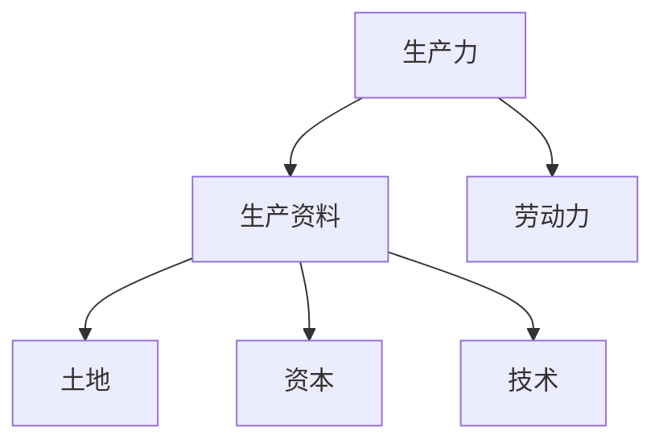
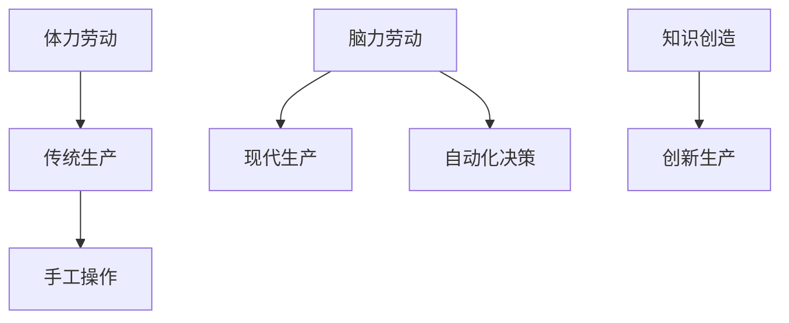

                 

# 过去是体力加生产资料，未来则要做脑力加生产资料

> **关键词：** 工业革命、数字化、人工智能、生产力、生产资料、未来发展趋势

> **摘要：** 本文将探讨从工业革命以来，人类生产力的演变过程，分析体力与脑力在生产中的作用。在此基础上，阐述未来社会脑力加生产资料的崛起，以及其对于产业发展和科技进步的影响。本文旨在为读者提供对当前和未来技术发展的深刻理解和前瞻性思考。

## 1. 背景介绍

### 1.1 目的和范围

本文旨在分析过去和未来生产力的演变过程，探讨体力与脑力在生产中的作用，以及生产资料的重要性。我们将通过回顾历史，解析当前趋势，展望未来，提供对技术发展的深刻见解。

### 1.2 预期读者

本文适合对工业革命、数字化和人工智能等领域有兴趣的读者，特别是从事技术研发、产业管理以及对未来发展趋势感兴趣的各界人士。

### 1.3 文档结构概述

本文分为十个部分：背景介绍、核心概念与联系、核心算法原理与操作步骤、数学模型与公式、项目实战、实际应用场景、工具和资源推荐、总结、常见问题与解答和扩展阅读。

### 1.4 术语表

#### 1.4.1 核心术语定义

- 生产资料：生产过程中所需的一切物质要素，包括土地、资本、劳动力、技术等。
- 体力劳动：依靠人的生理力量完成的工作。
- 脑力劳动：依靠人的智力、知识和创造力完成的工作。
- 生产力：指生产过程中人类利用生产资料创造财富的能力。
- 数字化：将信息和数据转化为数字形式，通过计算机和互联网进行处理。

#### 1.4.2 相关概念解释

- 工业革命：指18世纪末至19世纪初，以机器生产取代手工作业为特征的生产力变革。
- 人工智能：指通过计算机模拟人类的智能行为，实现自动化决策和执行的技术。

#### 1.4.3 缩略词列表

- AI：人工智能
- IoT：物联网
- ML：机器学习
- DL：深度学习

## 2. 核心概念与联系

### 2.1 生产力与生产资料

生产力是衡量一个国家或地区经济水平的关键指标，它取决于生产资料和劳动力。生产资料包括土地、资本、劳动力和技术等，其中技术和资本是决定生产力高低的重要因素。

#### Mermaid 流程图：



### 2.2 体力与脑力劳动

在过去，体力劳动是生产的主要形式，人类依靠生理力量完成大量工作。然而，随着科技进步，脑力劳动逐渐成为生产的核心。脑力劳动依赖人的智力、知识和创造力，具有更高的生产效率。

#### Mermaid 流程图：



## 3. 核心算法原理与具体操作步骤

### 3.1 人工智能算法原理

人工智能的核心在于模拟人类智能，通过算法实现自动化决策和执行。以下是人工智能的基本算法原理：

#### 3.1.1 机器学习算法

机器学习是人工智能的重要分支，通过训练模型，使计算机具备自主学习和改进的能力。以下是机器学习的基本步骤：

```plaintext
1. 数据收集：收集大量历史数据。
2. 数据预处理：清洗数据，确保数据质量。
3. 特征提取：从数据中提取有用的特征。
4. 模型训练：使用训练数据训练模型。
5. 模型评估：评估模型性能。
6. 模型优化：根据评估结果优化模型。
```

#### 3.1.2 深度学习算法

深度学习是机器学习的一种重要方法，通过多层神经网络模拟人脑的决策过程。以下是深度学习的基本步骤：

```plaintext
1. 确定网络架构：选择合适的神经网络架构。
2. 数据输入：将数据输入神经网络。
3. 神经网络训练：通过反向传播算法训练神经网络。
4. 模型评估：评估模型性能。
5. 模型优化：根据评估结果优化模型。
```

## 4. 数学模型和公式与详细讲解

### 4.1 机器学习数学模型

机器学习的核心在于构建数学模型，通过优化模型参数实现目标。以下是机器学习中的几个关键数学模型：

#### 4.1.1 线性回归

线性回归是一种简单且常用的机器学习模型，用于预测线性关系。其公式如下：

$$
y = w_0 + w_1 \cdot x
$$

其中，$y$ 是预测值，$x$ 是输入特征，$w_0$ 和 $w_1$ 是模型参数。

#### 4.1.2 逻辑回归

逻辑回归用于处理分类问题，其公式如下：

$$
P(y=1) = \frac{1}{1 + e^{-(w_0 + w_1 \cdot x)}}
$$

其中，$P(y=1)$ 是目标变量为1的概率，$w_0$ 和 $w_1$ 是模型参数。

#### 4.1.3 神经网络

神经网络是机器学习的重要工具，其基本结构包括输入层、隐藏层和输出层。以下是神经网络中的激活函数和损失函数：

- 激活函数：用于将线性组合转换为非线性输出。常用的激活函数有sigmoid、ReLU等。
- 损失函数：用于评估模型预测值与真实值之间的差距。常用的损失函数有均方误差（MSE）、交叉熵（Cross-Entropy）等。

### 4.2 深度学习数学模型

深度学习的数学模型比传统的机器学习模型更为复杂，其核心在于多层神经网络。以下是深度学习中的关键数学模型：

#### 4.2.1 神经元模型

神经元模型是神经网络的基本单元，其公式如下：

$$
a_{ij}^{(l)} = \sigma(z_{ij}^{(l)})
$$

其中，$a_{ij}^{(l)}$ 是第$l$层的第$i$个神经元输出的激活值，$z_{ij}^{(l)}$ 是第$l$层的第$i$个神经元的输入值，$\sigma$ 是激活函数。

#### 4.2.2 反向传播算法

反向传播算法是深度学习训练的核心算法，其公式如下：

$$
\Delta w_{ij}^{(l)} = \alpha \cdot \frac{\partial J}{\partial w_{ij}^{(l)}}
$$

$$
w_{ij}^{(l)} = w_{ij}^{(l)} - \Delta w_{ij}^{(l)}
$$

其中，$w_{ij}^{(l)}$ 是第$l$层的第$i$个神经元与第$j$个神经元之间的权重，$\Delta w_{ij}^{(l)}$ 是权重的更新值，$J$ 是损失函数。

## 5. 项目实战：代码实际案例和详细解释说明

### 5.1 开发环境搭建

为了更好地理解和实践本文中的算法原理，我们需要搭建一个开发环境。以下是搭建Python开发环境的基本步骤：

```plaintext
1. 安装Python：下载并安装Python 3.x版本。
2. 安装Jupyter Notebook：通过pip安装Jupyter Notebook。
3. 安装机器学习库：通过pip安装scikit-learn、TensorFlow等库。
```

### 5.2 源代码详细实现和代码解读

以下是一个简单的机器学习项目，用于实现线性回归：

```python
import numpy as np
import matplotlib.pyplot as plt
from sklearn.linear_model import LinearRegression

# 数据准备
X = np.array([1, 2, 3, 4, 5]).reshape(-1, 1)
y = np.array([2, 4, 5, 4, 5])

# 模型训练
model = LinearRegression()
model.fit(X, y)

# 模型评估
score = model.score(X, y)
print(f"模型准确率：{score:.2f}")

# 模型预测
X_new = np.array([6, 7, 8, 9, 10]).reshape(-1, 1)
y_pred = model.predict(X_new)

# 可视化
plt.scatter(X, y, color='red', label='实际值')
plt.plot(X_new, y_pred, color='blue', label='预测值')
plt.xlabel('X')
plt.ylabel('Y')
plt.legend()
plt.show()
```

### 5.3 代码解读与分析

- 第1-3行：导入必要的库。
- 第4-5行：准备数据集。
- 第7行：创建线性回归模型。
- 第8行：训练模型。
- 第9行：评估模型准确率。
- 第10-14行：使用模型进行预测，并可视化结果。

## 6. 实际应用场景

### 6.1 工业自动化

随着人工智能技术的发展，工业自动化已经成为提高生产效率的关键手段。通过机器人和自动化设备，企业可以减少人力成本，提高生产质量和效率。

### 6.2 智能医疗

人工智能在医疗领域的应用越来越广泛，如医学图像分析、疾病预测、个性化治疗等。通过深度学习和大数据分析，人工智能可以帮助医生提供更准确的诊断和治疗建议。

### 6.3 智能交通

智能交通系统利用物联网、人工智能等技术，实现交通管理的智能化。如智能红绿灯、无人驾驶汽车等，可以提高交通效率，减少交通事故。

## 7. 工具和资源推荐

### 7.1 学习资源推荐

#### 7.1.1 书籍推荐

- 《Python机器学习》：提供Python在机器学习领域的应用案例，适合初学者。
- 《深度学习》：由深度学习领域的权威作者撰写，详细讲解深度学习原理和算法。

#### 7.1.2 在线课程

- Coursera的《机器学习》：由吴恩达教授讲授，适合入门和进阶学习者。
- edX的《深度学习专项课程》：由李飞飞教授讲授，涵盖深度学习的核心知识。

#### 7.1.3 技术博客和网站

- Analytics Vidhya：提供丰富的机器学习和数据科学资源。
- Medium上的AI博客：包含最新的深度学习和人工智能研究成果。

### 7.2 开发工具框架推荐

#### 7.2.1 IDE和编辑器

- PyCharm：强大的Python IDE，适合机器学习和深度学习开发。
- Jupyter Notebook：交互式开发环境，方便进行数据可视化和实验。

#### 7.2.2 调试和性能分析工具

- Visual Studio Code：适用于多种编程语言的IDE，支持调试和性能分析。
- Py-Spy：Python性能分析工具，帮助优化代码。

#### 7.2.3 相关框架和库

- TensorFlow：用于深度学习的开源框架，提供丰富的API和工具。
- scikit-learn：用于机器学习的开源库，提供多种算法和工具。

### 7.3 相关论文著作推荐

#### 7.3.1 经典论文

- "Learning to Represent Materials with Unsupervised Learning":介绍了一种无监督学习方法，用于材料学的表征学习。
- "Deep Learning for Computer Vision":详细阐述了深度学习在计算机视觉领域的应用。

#### 7.3.2 最新研究成果

- "Neural Ordinary Differential Equations":介绍了一种新颖的深度学习模型，用于解决动态系统问题。
- "Attention Is All You Need":介绍了Transformer模型，在自然语言处理领域取得了显著成果。

#### 7.3.3 应用案例分析

- "Using AI to Optimize Industrial Manufacturing":介绍了一种利用人工智能优化工业制造的方法。
- "AI in Healthcare: A Comprehensive Overview":全面阐述了人工智能在医疗领域的应用案例。

## 8. 总结：未来发展趋势与挑战

### 8.1 未来发展趋势

1. 脑力劳动的重要性将进一步提升，成为生产力的核心。
2. 数字化与人工智能技术的深度融合，推动产业升级和转型。
3. 个性化、智能化生产模式逐步普及，提高生产效率和产品质量。

### 8.2 挑战

1. 技术安全与隐私保护：如何在保障技术进步的同时，确保数据安全和用户隐私。
2. 技术伦理与责任：如何平衡技术创新与社会责任，防止技术滥用。
3. 技术普及与教育：提高全民技术素养，缩小数字鸿沟，实现技术普惠。

## 9. 附录：常见问题与解答

### 9.1 问题1：如何选择合适的机器学习算法？

**解答：** 选择机器学习算法需要考虑数据类型、数据量、问题类型等因素。对于分类问题，可以尝试逻辑回归、决策树、随机森林等；对于回归问题，可以尝试线性回归、线性模型、支持向量机等。在实际应用中，可以通过交叉验证和模型评估选择最佳算法。

### 9.2 问题2：深度学习如何处理动态系统问题？

**解答：** 深度学习可以用于解决动态系统问题，如时间序列预测、控制问题等。其中，神经网络微分方程（Neural ODE）是一种有效的解决方案。通过神经网络建模动态系统的演化过程，可以实现对动态系统的预测和控制。

## 10. 扩展阅读 & 参考资料

1. Goodfellow, I., Bengio, Y., & Courville, A. (2016). *Deep Learning*. MIT Press.
2. Murphy, K. P. (2012). *Machine Learning: A Probabilistic Perspective*. MIT Press.
3. Bengio, Y. (2009). *Learning Deep Architectures for AI*. Foundations and Trends in Machine Learning, 2(1), 1-127.
4. LeCun, Y., Bengio, Y., & Hinton, G. (2015). *Deep Learning*. Nature, 521(7553), 436-444.
5. Mnih, V., & Hinton, G. E. (2014). *Learning to Predict by Creating New Examples*. Advances in Neural Information Processing Systems, 27.

