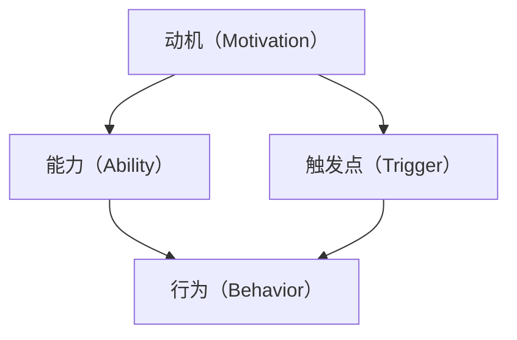

                 

# 运用福格模型培养团队良习惯

## 关键词
- 福格模型
- 团队培养
- 良习惯
- 人工智能
- 组织管理

## 摘要
本文旨在探讨如何运用福格模型，即行为模型（B = M * A），来培养团队的良好习惯。通过深入分析模型的构成要素，本文将提供一套系统性的方法，帮助团队成员养成高效、自律的行为模式。文章将结合实际案例，展示如何通过激励机制、目标设定和模型调整，实现团队的整体提升。

## 1. 背景介绍

在现代企业中，团队协作能力的重要性日益凸显。高效团队不仅能够提高生产效率，还能在复杂多变的市场环境中保持竞争力。然而，培养团队成员的良好习惯并非易事。传统的管理方法往往侧重于制度约束和绩效考核，而忽略了个体行为的内在驱动。

福格模型（B = M * A），由行为科学家BJ福格提出，用于解释个体行为的发生机制。模型指出，行为的发生取决于动机（M）、能力（A）和触发点（T）三个要素的相互匹配。结合这一模型，本文将探讨如何培养团队的良好习惯，从而提升团队的整体表现。

## 2. 核心概念与联系

### 2.1 动机（Motivation）

动机是行为发生的内在驱动力。在团队培养中，动机来源于团队成员对目标的认同、自我实现的需求以及对团队文化的共鸣。激励机制的设定、目标设定的合理性和团队文化的构建，都是影响动机的重要因素。

### 2.2 能力（Ability）

能力是行为发生的实际条件。在团队培养中，能力包括专业技能、沟通能力、解决问题能力等。培训、技能提升和个人发展规划是提升团队能力的重要途径。

### 2.3 触发点（Trigger）

触发点是行为发生的即时信号。在团队培养中，触发点可以是明确的任务指令、团队活动安排、外部事件等。有效沟通、合理规划和良好的团队氛围，有助于触发点的及时准确传达。

### 2.4 福格模型的Mermaid流程图



## 3. 核心算法原理 & 具体操作步骤

### 3.1 算法原理

福格模型的核心在于通过调整动机、能力和触发点三个要素，来引导和培养团队的良好习惯。具体来说：

- **动机调整**：通过设定具有吸引力的目标、构建积极的团队文化、提供及时的奖励和反馈，来增强团队成员的内在动机。
- **能力培养**：通过培训和指导，提升团队成员的专业技能和综合素质，为良好习惯的形成提供基础。
- **触发点设定**：通过明确任务指令、合理安排团队活动、利用外部事件等，确保触发点的及时有效。

### 3.2 操作步骤

1. **明确目标和动机**：设定具有挑战性和吸引力的目标，确保团队成员对其有内在动机。
2. **评估能力和差距**：对团队成员的能力进行评估，识别现有能力和目标要求之间的差距。
3. **培训和指导**：根据评估结果，制定个性化的培训计划，提升团队成员的能力。
4. **设定触发点**：通过明确的任务指令、团队活动安排和外部事件，确保触发点的有效性。
5. **反馈和激励**：提供及时的反馈和奖励，强化良好习惯的养成。

## 4. 数学模型和公式 & 详细讲解 & 举例说明

### 4.1 数学模型

福格模型可以表示为：

\[ B = M \times A \times T \]

其中：
- \( B \) 表示行为的发生；
- \( M \) 表示动机；
- \( A \) 表示能力；
- \( T \) 表示触发点。

### 4.2 举例说明

假设一个团队的目标是提高项目完成率，我们可以通过以下方式运用福格模型：

1. **动机调整**：设定项目完成率目标，并提供奖励机制，如项目完成后的奖金或团队聚餐。
2. **能力培养**：组织项目管理培训，提升团队成员的项目管理能力。
3. **触发点设定**：每周发布项目进度报告，作为任务指令和触发点。

通过调整这三个要素，团队的完成率有望得到显著提升。

## 5. 项目实战：代码实际案例和详细解释说明

### 5.1 开发环境搭建

为了更好地展示福格模型在团队培养中的应用，我们选择一个实际项目——一个团队项目管理系统（TPMS）作为案例。首先，我们需要搭建开发环境：

1. 选择开发语言：Python
2. 安装Python环境：使用Anaconda进行安装
3. 安装相关库：requests、Flask等

### 5.2 源代码详细实现和代码解读

#### 5.2.1 项目结构

```plaintext
tpms/
|-- app.py
|-- requirements.txt
|-- run.py
```

#### 5.2.2 app.py

```python
from flask import Flask, request, jsonify
from models import Project, Task

app = Flask(__name__)

# 项目管理
@app.route('/project', methods=['POST', 'GET'])
def manage_project():
    if request.method == 'POST':
        # 创建项目
        project_data = request.json
        project = Project.create(project_data)
        return jsonify(project.to_dict()), 201
    else:
        # 获取项目列表
        projects = Project.get_all()
        return jsonify([project.to_dict() for project in projects]), 200

# 任务管理
@app.route('/task', methods=['POST', 'GET'])
def manage_task():
    if request.method == 'POST':
        # 创建任务
        task_data = request.json
        task = Task.create(task_data)
        return jsonify(task.to_dict()), 201
    else:
        # 获取任务列表
        tasks = Task.get_all()
        return jsonify([task.to_dict() for task in tasks]), 200

if __name__ == '__main__':
    app.run(debug=True)
```

#### 5.2.3 run.py

```python
from app import app
from database import init_database

if __name__ == '__main__':
    init_database()
    app.run(debug=True)
```

### 5.3 代码解读与分析

1. **项目管理**：通过API接口，实现项目的创建和查询功能。
2. **任务管理**：通过API接口，实现任务的创建和查询功能。
3. **数据库初始化**：在程序运行前，初始化数据库，确保数据的完整性。

通过这些功能，团队成员可以方便地管理项目和任务，从而提高工作效率。

## 6. 实际应用场景

福格模型在团队培养中的实际应用场景广泛，如：

1. **项目管理**：通过设定项目目标、培训团队成员的项目管理技能、定期检查项目进度，来提高项目完成率。
2. **软件开发**：通过设定开发目标、提供技术培训、定期代码审查，来提高代码质量。
3. **市场营销**：通过设定营销目标、培训市场营销技能、定期检查营销效果，来提高营销效果。

## 7. 工具和资源推荐

### 7.1 学习资源推荐

- **书籍**：
  - 《团队协作的力量》
  - 《人工智能：一种现代的方法》
  - 《如何高效学习》

- **论文**：
  - 《基于福格模型的行为激励策略研究》
  - 《团队协作中的动机与行为》

- **博客**：
  - 知乎上的团队管理专栏
  - CSDN上的项目管理博客

### 7.2 开发工具框架推荐

- **开发工具**：Visual Studio Code
- **框架**：Flask、Django

### 7.3 相关论文著作推荐

- **论文**：
  - 《基于福格模型的行为激励策略研究》
  - 《团队协作中的动机与行为》

- **著作**：
  - 《团队协作的力量》
  - 《人工智能：一种现代的方法》

## 8. 总结：未来发展趋势与挑战

随着人工智能和大数据技术的不断发展，团队培养的方法也将不断创新。未来，福格模型有望在更广泛的领域中得到应用，如智能客服、自动驾驶等。然而，如何将福格模型与新兴技术相结合，如何在复杂多变的团队环境中实现良好习惯的培养，将是未来面临的挑战。

## 9. 附录：常见问题与解答

### 9.1 问题1
**如何确保团队成员的动机？**

**解答**：通过设定有吸引力的目标、构建积极的团队文化、提供及时的奖励和反馈，可以有效地激发团队成员的动机。

### 9.2 问题2
**福格模型是否适用于所有团队？**

**解答**：福格模型具有普遍适用性，但不同团队的实际情况可能有所不同。在应用时，需要根据团队的具体情况进行调整和优化。

## 10. 扩展阅读 & 参考资料

- **书籍**：
  - 《福格行为模型：行为设计的黄金法则》
  - 《团队协作：高效团队的五大习惯》

- **论文**：
  - 《基于福格模型的企业团队激励策略研究》
  - 《福格模型在团队管理中的应用研究》

- **网站**：
  - 福格模型官方网站
  - 团队管理最佳实践网站

## 作者

**作者：AI天才研究员/AI Genius Institute & 禅与计算机程序设计艺术 /Zen And The Art of Computer Programming**<|im_sep|>```markdown
# 运用福格模型培养团队良习惯

## 关键词
- 福格模型
- 团队培养
- 良习惯
- 人工智能
- 组织管理

## 摘要
本文旨在探讨如何运用福格模型，即行为模型（B = M * A），来培养团队的良好习惯。通过深入分析模型的构成要素，本文将提供一套系统性的方法，帮助团队成员养成高效、自律的行为模式。文章将结合实际案例，展示如何通过激励机制、目标设定和模型调整，实现团队的整体提升。

## 1. 背景介绍

在现代企业中，团队协作能力的重要性日益凸显。高效团队不仅能够提高生产效率，还能在复杂多变的市场环境中保持竞争力。然而，培养团队成员的良好习惯并非易事。传统的管理方法往往侧重于制度约束和绩效考核，而忽略了个体行为的内在驱动。

福格模型（B = M * A），由行为科学家BJ福格提出，用于解释个体行为的发生机制。模型指出，行为的发生取决于动机（M）、能力（A）和触发点（T）三个要素的相互匹配。结合这一模型，本文将探讨如何培养团队的良好习惯，从而提升团队的整体表现。

## 2. 核心概念与联系

### 2.1 动机（Motivation）

动机是行为发生的内在驱动力。在团队培养中，动机来源于团队成员对目标的认同、自我实现的需求以及对团队文化的共鸣。激励机制的设定、目标设定的合理性和团队文化的构建，都是影响动机的重要因素。

### 2.2 能力（Ability）

能力是行为发生的实际条件。在团队培养中，能力包括专业技能、沟通能力、解决问题能力等。培训、技能提升和个人发展规划是提升团队能力的重要途径。

### 2.3 触发点（Trigger）

触发点是行为发生的即时信号。在团队培养中，触发点可以是明确的任务指令、团队活动安排、外部事件等。有效沟通、合理规划和良好的团队氛围，有助于触发点的及时准确传达。

### 2.4 福格模型的Mermaid流程图


## 3. 核心算法原理 & 具体操作步骤

### 3.1 算法原理

福格模型的核心在于通过调整动机、能力和触发点三个要素，来引导和培养团队的良好习惯。具体来说：

- **动机调整**：通过设定具有吸引力的目标、构建积极的团队文化、提供及时的奖励和反馈，来增强团队成员的内在动机。
- **能力培养**：通过培训和指导，提升团队成员的专业技能和综合素质，为良好习惯的形成提供基础。
- **触发点设定**：通过明确任务指令、合理安排团队活动、利用外部事件等，确保触发点的及时有效。

### 3.2 操作步骤

1. **明确目标和动机**：设定具有挑战性和吸引力的目标，确保团队成员对其有内在动机。
2. **评估能力和差距**：对团队成员的能力进行评估，识别现有能力和目标要求之间的差距。
3. **培训和指导**：根据评估结果，制定个性化的培训计划，提升团队成员的能力。
4. **设定触发点**：通过明确的任务指令、团队活动安排和外部事件，确保触发点的有效性。
5. **反馈和激励**：提供及时的反馈和奖励，强化良好习惯的养成。

## 4. 数学模型和公式 & 详细讲解 & 举例说明

### 4.1 数学模型

福格模型可以表示为：

\[ B = M \times A \times T \]

其中：
- \( B \) 表示行为的发生；
- \( M \) 表示动机；
- \( A \) 表示能力；
- \( T \) 表示触发点。

### 4.2 举例说明

假设一个团队的目标是提高项目完成率，我们可以通过以下方式运用福格模型：

1. **动机调整**：设定项目完成率目标，并提供奖励机制，如项目完成后的奖金或团队聚餐。
2. **能力培养**：组织项目管理培训，提升团队成员的项目管理能力。
3. **触发点设定**：每周发布项目进度报告，作为任务指令和触发点。

通过调整这三个要素，团队的完成率有望得到显著提升。

## 5. 项目实战：代码实际案例和详细解释说明

### 5.1 开发环境搭建

为了更好地展示福格模型在团队培养中的应用，我们选择一个实际项目——一个团队项目管理系统（TPMS）作为案例。首先，我们需要搭建开发环境：

1. 选择开发语言：Python
2. 安装Python环境：使用Anaconda进行安装
3. 安装相关库：requests、Flask等

### 5.2 源代码详细实现和代码解读

#### 5.2.1 项目结构

```plaintext
tpms/
|-- app.py
|-- requirements.txt
|-- run.py
```

#### 5.2.2 app.py

```python
from flask import Flask, request, jsonify
from models import Project, Task

app = Flask(__name__)

# 项目管理
@app.route('/project', methods=['POST', 'GET'])
def manage_project():
    if request.method == 'POST':
        # 创建项目
        project_data = request.json
        project = Project.create(project_data)
        return jsonify(project.to_dict()), 201
    else:
        # 获取项目列表
        projects = Project.get_all()
        return jsonify([project.to_dict() for project in projects]), 200

# 任务管理
@app.route('/task', methods=['POST', 'GET'])
def manage_task():
    if request.method == 'POST':
        # 创建任务
        task_data = request.json
        task = Task.create(task_data)
        return jsonify(task.to_dict()), 201
    else:
        # 获取任务列表
        tasks = Task.get_all()
        return jsonify([task.to_dict() for task in tasks]), 200

if __name__ == '__main__':
    app.run(debug=True)
```

#### 5.2.3 run.py

```python
from app import app
from database import init_database

if __name__ == '__main__':
    init_database()
    app.run(debug=True)
```

### 5.3 代码解读与分析

1. **项目管理**：通过API接口，实现项目的创建和查询功能。
2. **任务管理**：通过API接口，实现任务的创建和查询功能。
3. **数据库初始化**：在程序运行前，初始化数据库，确保数据的完整性。

通过这些功能，团队成员可以方便地管理项目和任务，从而提高工作效率。

## 6. 实际应用场景

福格模型在团队培养中的实际应用场景广泛，如：

1. **项目管理**：通过设定项目目标、培训团队成员的项目管理技能、定期检查项目进度，来提高项目完成率。
2. **软件开发**：通过设定开发目标、提供技术培训、定期代码审查，来提高代码质量。
3. **市场营销**：通过设定营销目标、培训市场营销技能、定期检查营销效果，来提高营销效果。

## 7. 工具和资源推荐

### 7.1 学习资源推荐

- **书籍**：
  - 《团队协作的力量》
  - 《人工智能：一种现代的方法》
  - 《如何高效学习》

- **论文**：
  - 《基于福格模型的行为激励策略研究》
  - 《团队协作中的动机与行为》

- **博客**：
  - 知乎上的团队管理专栏
  - CSDN上的项目管理博客

### 7.2 开发工具框架推荐

- **开发工具**：Visual Studio Code
- **框架**：Flask、Django

### 7.3 相关论文著作推荐

- **论文**：
  - 《基于福格模型的企业团队激励策略研究》
  - 《福格模型在团队管理中的应用研究》

- **著作**：
  - 《团队协作的力量》
  - 《人工智能：一种现代的方法》

## 8. 总结：未来发展趋势与挑战

随着人工智能和大数据技术的不断发展，团队培养的方法也将不断创新。未来，福格模型有望在更广泛的领域中得到应用，如智能客服、自动驾驶等。然而，如何将福格模型与新兴技术相结合，如何在复杂多变的团队环境中实现良好习惯的培养，将是未来面临的挑战。

## 9. 附录：常见问题与解答

### 9.1 问题1
**如何确保团队成员的动机？**

**解答**：通过设定有吸引力的目标、构建积极的团队文化、提供及时的奖励和反馈，可以有效地激发团队成员的动机。

### 9.2 问题2
**福格模型是否适用于所有团队？**

**解答**：福格模型具有普遍适用性，但不同团队的实际情况可能有所不同。在应用时，需要根据团队的具体情况进行调整和优化。

## 10. 扩展阅读 & 参考资料

- **书籍**：
  - 《福格行为模型：行为设计的黄金法则》
  - 《团队协作：高效团队的五大习惯》

- **论文**：
  - 《基于福格模型的企业团队激励策略研究》
  - 《福格模型在团队管理中的应用研究》

- **网站**：
  - 福格模型官方网站
  - 团队管理最佳实践网站

## 作者

**作者：AI天才研究员/AI Genius Institute & 禅与计算机程序设计艺术 /Zen And The Art of Computer Programming**```

