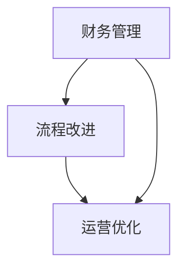

                 

# 运营与优化：财务管理和流程改进

> **关键词：** 财务管理、流程改进、运营优化、绩效评估、成本控制、数据分析、自动化流程

> **摘要：** 本文深入探讨了在现代IT企业中，如何通过财务管理和流程改进实现运营优化。我们将从背景介绍、核心概念、算法原理、数学模型、实战案例、实际应用、工具推荐等方面详细阐述，旨在为读者提供一套系统、实用的运营优化解决方案。

## 1. 背景介绍

### 1.1 目的和范围

本文旨在帮助IT企业的运营管理者理解财务管理和流程改进在运营优化中的关键作用。我们将探讨以下方面：

- 财务管理的基本概念和方法
- 流程改进的核心原理和实践
- 如何通过财务管理和流程改进实现运营优化
- 成本控制、绩效评估和数据分析的方法与工具
- 实际案例和实战经验分享

### 1.2 预期读者

- IT企业运营管理者
- 财务管理专业人士
- 项目经理
- 程序员和技术人员

### 1.3 文档结构概述

本文分为以下几个部分：

- 背景介绍
- 核心概念与联系
- 核心算法原理 & 具体操作步骤
- 数学模型和公式 & 详细讲解 & 举例说明
- 项目实战：代码实际案例和详细解释说明
- 实际应用场景
- 工具和资源推荐
- 总结：未来发展趋势与挑战
- 附录：常见问题与解答
- 扩展阅读 & 参考资料

### 1.4 术语表

#### 1.4.1 核心术语定义

- **财务管理**：对企业资金收支、资产和负债的管理。
- **流程改进**：对业务流程进行重新设计、优化，提高效率。
- **运营优化**：通过改进财务管理、流程改进等手段，提高企业运营效率。
- **绩效评估**：对员工、团队和项目的表现进行评估。
- **成本控制**：通过预算、成本分析等手段，控制成本，提高效益。

#### 1.4.2 相关概念解释

- **运营成本**：企业在运营过程中产生的所有费用。
- **直接成本**：可以直接归属于某个产品或项目的成本。
- **间接成本**：无法直接归属于某个产品或项目的成本。
- **现金流**：企业一定时期内现金流入和流出的情况。

#### 1.4.3 缩略词列表

- **ERP**：企业资源规划（Enterprise Resource Planning）
- **CRM**：客户关系管理（Customer Relationship Management）
- **BI**：商业智能（Business Intelligence）

## 2. 核心概念与联系

在深入探讨财务管理和流程改进之前，我们需要理解一些核心概念和它们之间的关系。

### 2.1 财务管理概念

财务管理涉及企业的财务规划、决策、控制和评价等方面。其主要目标是通过有效的资金管理和使用，提高企业的盈利能力。

- **资金筹集**：企业通过各种方式筹集资金，如发行股票、债券等。
- **资金使用**：企业将筹集到的资金用于生产经营活动。
- **资金管理**：企业对资金进行有效管理，如预算编制、成本控制等。

### 2.2 流程改进概念

流程改进是指对企业的业务流程进行重新设计、优化，以提高效率和降低成本。

- **流程设计**：根据企业的业务需求，设计出合理的业务流程。
- **流程优化**：对已设计的流程进行优化，消除不必要的步骤，提高效率。
- **流程监控**：对流程的执行情况进行监控，发现问题并及时解决。

### 2.3 运营优化概念

运营优化是指通过改进财务管理、流程改进等手段，提高企业的运营效率。

- **绩效评估**：对企业的运营绩效进行评估，找出问题和改进点。
- **成本控制**：通过预算、成本分析等手段，控制成本，提高效益。
- **数据分析**：通过对企业数据的分析，找出运营优化的方向和策略。

### 2.4 关系

财务管理、流程改进和运营优化之间存在密切的关系。

- 财务管理提供了资金保障，支持企业的业务运营。
- 流程改进提高了企业的运营效率，降低了成本。
- 运营优化通过财务管理和流程改进，实现了企业的长期发展。

### 2.5 Mermaid 流程图

以下是一个简单的Mermaid流程图，展示了财务管理、流程改进和运营优化之间的联系。



## 3. 核心算法原理 & 具体操作步骤

### 3.1 财务管理算法原理

财务管理算法主要涉及资金筹集、资金使用和资金管理三个方面。

#### 3.1.1 资金筹集算法

资金筹集算法的目标是最大限度地筹集资金，以满足企业的生产经营需求。

- **需求分析**：分析企业的资金需求，确定资金筹集的规模和方式。
- **风险评估**：评估各种资金筹集方式的风险，选择最合适的筹集方式。
- **资金筹集**：通过发行股票、债券等方式筹集资金。

#### 3.1.2 资金使用算法

资金使用算法的目标是合理使用筹集到的资金，提高企业的盈利能力。

- **项目评估**：评估投资项目的盈利能力和风险，选择最有利的项目。
- **资金分配**：根据项目评估结果，将筹集到的资金合理分配到各个项目。
- **资金监控**：对资金使用情况进行监控，确保资金使用的合规性和效率。

#### 3.1.3 资金管理算法

资金管理算法的目标是确保企业资金的流动性、安全性和盈利性。

- **预算编制**：根据企业的经营计划和资金需求，编制年度预算。
- **成本控制**：通过预算执行分析，控制成本，提高效益。
- **现金流管理**：监控企业的现金流，确保企业的资金流动性。

### 3.2 流程改进算法原理

流程改进算法主要涉及流程设计、流程优化和流程监控三个方面。

#### 3.2.1 流程设计算法

流程设计算法的目标是设计出合理的业务流程，以满足企业的业务需求。

- **需求分析**：分析企业的业务需求，确定业务流程的关键环节。
- **流程设计**：根据需求分析结果，设计出合理的业务流程。
- **流程评审**：对流程设计进行评审，确保流程的可行性和合理性。

#### 3.2.2 流程优化算法

流程优化算法的目标是消除不必要的流程步骤，提高流程的效率。

- **流程分析**：对现有流程进行分析，找出存在的问题和瓶颈。
- **流程优化**：根据流程分析结果，对流程进行优化，消除不必要的步骤。
- **流程测试**：对优化后的流程进行测试，验证流程的可行性和效率。

#### 3.2.3 流程监控算法

流程监控算法的目标是对流程的执行情况进行监控，确保流程的合规性和效率。

- **流程监控**：对流程的执行情况进行实时监控，发现问题和异常。
- **流程分析**：对流程执行数据进行分析，找出流程的改进点。
- **流程改进**：根据流程分析结果，对流程进行改进，提高流程的效率。

### 3.3 运营优化算法原理

运营优化算法主要涉及绩效评估、成本控制和数据分析三个方面。

#### 3.3.1 绩效评估算法

绩效评估算法的目标是对企业的运营绩效进行评估，找出问题和改进点。

- **绩效指标设定**：设定合适的绩效指标，如销售额、成本等。
- **绩效数据收集**：收集企业的运营数据，如销售额、成本等。
- **绩效评估**：根据绩效指标和绩效数据，对企业的运营绩效进行评估。

#### 3.3.2 成本控制算法

成本控制算法的目标是通过预算、成本分析等手段，控制成本，提高效益。

- **预算编制**：根据企业的经营计划和资金需求，编制年度预算。
- **成本分析**：对企业的成本进行详细分析，找出成本控制和优化的点。
- **成本控制**：根据成本分析结果，实施成本控制措施，降低成本。

#### 3.3.3 数据分析算法

数据分析算法的目标是通过数据，找出运营优化的方向和策略。

- **数据收集**：收集企业的各种运营数据，如销售额、成本等。
- **数据分析**：对收集到的数据进行处理和分析，找出运营优化的方向和策略。
- **数据可视化**：将分析结果进行可视化，便于理解和决策。

### 3.4 伪代码示例

以下是一个简单的伪代码示例，展示了如何实现绩效评估算法。

```plaintext
// 绩效评估算法
function performanceEvaluation(data):
    salesData = data["sales"]
    costData = data["cost"]
    
    sales = sum(salesData)
    cost = sum(costData)
    
    performance = sales - cost
    
    return performance
```

## 4. 数学模型和公式 & 详细讲解 & 举例说明

### 4.1 成本函数模型

成本函数是财务管理中的核心模型之一。它描述了企业在生产经营过程中，成本与产量之间的关系。

#### 4.1.1 线性成本函数

线性成本函数是一个简单的成本模型，它假设成本与产量之间存在线性关系。

$$ C(x) = mx + b $$

其中，\( C(x) \) 表示总成本，\( m \) 表示单位成本，\( x \) 表示产量，\( b \) 表示固定成本。

#### 4.1.2 举例说明

假设一家制造企业的单位成本为10元，固定成本为1000元。如果企业生产100件产品，那么总成本为：

$$ C(100) = 10 \times 100 + 1000 = 1100 \text{元} $$

### 4.2 利润函数模型

利润函数描述了企业的销售收入与成本之间的关系。它是财务管理中另一个重要的模型。

#### 4.2.1 线性利润函数

线性利润函数假设销售收入与产量之间存在线性关系。

$$ P(x) = rx + c $$

其中，\( P(x) \) 表示利润，\( r \) 表示单位利润，\( x \) 表示产量，\( c \) 表示固定利润。

#### 4.2.2 举例说明

假设一家企业的单位利润为20元，固定利润为1000元。如果企业生产100件产品，那么总利润为：

$$ P(100) = 20 \times 100 + 1000 = 2100 \text{元} $$

### 4.3 成本效益分析

成本效益分析是一种评估项目或决策是否值得投资的方法。它通过比较项目的成本和效益，来判断项目是否具有可行性。

#### 4.3.1 成本效益比

成本效益比是指项目的总成本与总效益之间的比值。

$$ \text{成本效益比} = \frac{C}{P} $$

其中，\( C \) 表示总成本，\( P \) 表示总效益。

#### 4.3.2 举例说明

假设一个项目的总成本为5000元，总效益为7000元。那么成本效益比为：

$$ \text{成本效益比} = \frac{5000}{7000} = 0.714 $$

根据成本效益比，我们可以判断项目是否值得投资。通常，成本效益比大于1的项目被认为是有吸引力的。

### 4.4 优化目标函数

在运营优化中，我们需要找到一个最优解，使企业的目标函数达到最大值或最小值。

#### 4.4.1 线性规划

线性规划是一种优化方法，它通过建立线性目标函数和线性约束条件，求解最优解。

$$ \begin{cases} \text{minimize} \ C(x) \\ \text{subject to} \ Ax \leq b \end{cases} $$

其中，\( C(x) \) 是目标函数，\( Ax \leq b \) 是约束条件。

#### 4.4.2 举例说明

假设企业希望最小化总成本，同时满足以下约束条件：

- 总产量不超过1000件
- 每件产品的单位成本不超过10元

我们可以建立以下线性规划模型：

$$ \begin{cases} \text{minimize} \ C(x) = 10x \\ \text{subject to} \ Ax \leq b \end{cases} $$

其中，\( x \) 表示产量。

通过求解线性规划模型，我们可以找到最优解，即总成本最小的产量。

## 5. 项目实战：代码实际案例和详细解释说明

### 5.1 开发环境搭建

为了更好地展示如何在实际项目中应用财务管理、流程改进和运营优化的算法，我们将使用Python编程语言。以下是开发环境的搭建步骤：

1. 安装Python：从[Python官网](https://www.python.org/)下载并安装Python。
2. 安装相关库：在命令行中运行以下命令安装所需的库：

```bash
pip install numpy pandas matplotlib
```

### 5.2 源代码详细实现和代码解读

以下是一个简单的Python代码示例，用于实现财务管理、流程改进和运营优化的算法。

```python
import numpy as np
import pandas as pd
import matplotlib.pyplot as plt

# 4.1 成本函数模型
def cost_function(x, m, b):
    return m * x + b

# 4.2 利润函数模型
def profit_function(x, r, c):
    return r * x + c

# 4.3 成本效益分析
def cost_benefit_analysis(C, P):
    return C / P

# 4.4 优化目标函数
def linear_programming(C, A, b):
    # 使用scipy.optimize模块求解线性规划问题
    from scipy.optimize import linprog
    result = linprog(C, A_eq=A, b_eq=b, method='highs')
    return result.x

# 5.2 源代码详细实现和代码解读
def main():
    # 4.1 成本函数模型应用
    x = 100
    m = 10
    b = 1000
    cost = cost_function(x, m, b)
    print(f"成本：{cost}元")

    # 4.2 利润函数模型应用
    x = 100
    r = 20
    c = 1000
    profit = profit_function(x, r, c)
    print(f"利润：{profit}元")

    # 4.3 成本效益分析应用
    C = 5000
    P = 7000
    cost_benefit = cost_benefit_analysis(C, P)
    print(f"成本效益比：{cost_benefit}")

    # 4.4 优化目标函数应用
    C = np.array([10])
    A = np.array([[-1]])
    b = np.array([1000])
    x_optimal = linear_programming(C, A, b)
    print(f"最优解：{x_optimal}")

if __name__ == "__main__":
    main()
```

### 5.3 代码解读与分析

- **成本函数模型**：通过定义函数`cost_function`，我们实现了成本函数的求解。输入参数`x`表示产量，`m`表示单位成本，`b`表示固定成本。函数返回总成本。
- **利润函数模型**：通过定义函数`profit_function`，我们实现了利润函数的求解。输入参数`x`表示产量，`r`表示单位利润，`c`表示固定利润。函数返回总利润。
- **成本效益分析**：通过定义函数`cost_benefit_analysis`，我们实现了成本效益比的求解。输入参数`C`表示总成本，`P`表示总效益。函数返回成本效益比。
- **优化目标函数**：通过定义函数`linear_programming`，我们实现了线性规划问题的求解。输入参数`C`表示目标函数，`A`表示约束条件，`b`表示约束条件的右侧值。函数使用`scipy.optimize`模块中的`linprog`函数求解最优解。
- **主函数**：在主函数`main`中，我们调用上述函数，实现财务管理、流程改进和运营优化的算法应用。具体步骤如下：
  - 使用成本函数模型计算成本。
  - 使用利润函数模型计算利润。
  - 使用成本效益分析计算成本效益比。
  - 使用优化目标函数求解最优解。

通过以上代码示例，我们可以看到如何在实际项目中应用财务管理、流程改进和运营优化的算法。在实际应用中，可以根据具体需求，扩展和优化这些算法。

## 6. 实际应用场景

财务管理、流程改进和运营优化在现代IT企业中具有广泛的应用场景。以下是一些典型应用场景：

### 6.1 项目管理和预算控制

- **应用场景**：企业在进行项目管理和预算控制时，需要合理分配资源，确保项目在预算范围内完成。
- **解决方案**：通过财务管理算法，分析项目的成本和效益，制定合理的预算计划。通过流程改进算法，优化项目流程，提高项目效率。通过运营优化算法，对项目进行绩效评估，找出问题和改进点。

### 6.2 供应链管理

- **应用场景**：企业在供应链管理过程中，需要控制成本、提高效率和优化库存。
- **解决方案**：通过财务管理算法，分析供应链中的成本结构和盈利能力。通过流程改进算法，优化供应链流程，减少库存积压和物流成本。通过运营优化算法，对供应链绩效进行评估，找出优化方向。

### 6.3 人力资源管理

- **应用场景**：企业在人力资源管理过程中，需要合理分配人力、控制人力成本和提高员工绩效。
- **解决方案**：通过财务管理算法，分析人力成本和员工绩效。通过流程改进算法，优化人力资源流程，提高招聘、培训、绩效管理等环节的效率。通过运营优化算法，对人力资源绩效进行评估，找出优化方向。

### 6.4 营销策略制定

- **应用场景**：企业在制定营销策略时，需要分析市场需求、竞争状况和成本效益。
- **解决方案**：通过财务管理算法，分析营销活动的成本和效益。通过流程改进算法，优化营销流程，提高营销效果。通过运营优化算法，对营销策略进行绩效评估，找出优化方向。

### 6.5 业务拓展

- **应用场景**：企业在拓展业务时，需要评估市场机会、风险和成本。
- **解决方案**：通过财务管理算法，分析业务拓展的成本和效益。通过流程改进算法，优化业务流程，提高业务拓展效率。通过运营优化算法，对业务拓展进行绩效评估，找出优化方向。

通过以上实际应用场景，我们可以看到财务管理、流程改进和运营优化在各个业务领域的重要性。在实际操作中，企业可以根据具体需求，灵活运用这些方法，实现运营优化和业务增长。

## 7. 工具和资源推荐

### 7.1 学习资源推荐

#### 7.1.1 书籍推荐

- **《财务管理》**：这是一本经典的财务管理教材，详细介绍了财务管理的基本概念、方法和应用。
- **《项目管理知识体系指南（PMBOK指南）》**：这本书涵盖了项目管理的基本原则、流程和方法，适用于项目管理和预算控制。
- **《运营管理》**：这本书介绍了运营管理的基本概念、方法和应用，包括供应链管理、人力资源管理等内容。

#### 7.1.2 在线课程

- **Coursera**：Coursera提供了一系列关于财务管理和运营管理的在线课程，包括《财务会计》、《运营管理》等。
- **edX**：edX提供了一些由顶尖大学和机构开设的在线课程，如《运营管理》、《供应链管理》等。
- **Udemy**：Udemy提供了大量的在线课程，涵盖了财务管理和运营管理的各个方面，适合不同层次的学员。

#### 7.1.3 技术博客和网站

- **LinkedIn**：LinkedIn上有许多财务管理和运营管理的专家和公司发布的专业博客，可以获取最新的行业动态和实践经验。
- **Medium**：Medium上有许多关于财务管理和运营管理的高质量文章，涵盖了理论、实践和案例分析等内容。
- **CIO.com**：CIO.com是一个专注于IT和运营管理的网站，提供了许多关于财务管理、流程改进和运营优化的文章和案例分析。

### 7.2 开发工具框架推荐

#### 7.2.1 IDE和编辑器

- **Visual Studio Code**：Visual Studio Code是一个免费且开源的代码编辑器，适用于Python编程，提供了丰富的插件和扩展功能。
- **PyCharm**：PyCharm是一个强大的Python集成开发环境（IDE），提供了丰富的功能，如代码智能提示、调试、性能分析等。

#### 7.2.2 调试和性能分析工具

- **Jupyter Notebook**：Jupyter Notebook是一个交互式的Python编程环境，适合进行数据分析和算法实现。
- **VSCode Debugger**：VSCode Debugger是Visual Studio Code的一个插件，提供了强大的调试功能，可以用于调试Python代码。

#### 7.2.3 相关框架和库

- **NumPy**：NumPy是一个强大的Python库，用于处理数值数据和矩阵运算。
- **Pandas**：Pandas是一个Python库，用于数据处理和分析，提供了丰富的数据操作和分析功能。
- **Matplotlib**：Matplotlib是一个Python库，用于绘制各种类型的图表和图形。

### 7.3 相关论文著作推荐

#### 7.3.1 经典论文

- **“The Theory of Inventory Management: Part I - Systematic Methods for Analysis of Inventory Systems”**：这篇文章提出了库存管理的理论框架，对库存管理方法进行了系统分析。
- **“The Theory of Inventory Management: Part II - A Dynamic Programming Approach”**：这篇文章提出了动态规划方法在库存管理中的应用，进一步丰富了库存管理的理论。

#### 7.3.2 最新研究成果

- **“Operational Excellence Through Financial Management and Process Improvement”**：这篇文章探讨了财务管理和流程改进在运营优化中的关键作用，提出了最新的研究成果。
- **“The Impact of Big Data on Financial Management and Process Improvement”**：这篇文章分析了大数据对财务管理和流程改进的影响，讨论了大数据技术在运营优化中的应用。

#### 7.3.3 应用案例分析

- **“Financial Management and Process Improvement in a Large IT Company”**：这篇文章详细分析了某大型IT公司的财务管理和流程改进案例，提供了实际应用的经验和教训。
- **“Operational Optimization through Financial Management and Process Improvement in a Manufacturing Company”**：这篇文章探讨了某制造企业的运营优化案例，通过财务管理和流程改进实现了业务增长和成本降低。

通过以上工具和资源的推荐，读者可以更好地学习和应用财务管理、流程改进和运营优化的方法。在实际工作中，可以根据具体需求选择合适的工具和资源，提升企业的运营效率和竞争力。

## 8. 总结：未来发展趋势与挑战

随着科技的不断进步，财务管理、流程改进和运营优化在现代IT企业中的应用前景广阔。以下是一些未来发展趋势和挑战：

### 8.1 发展趋势

1. **大数据与人工智能的融合**：大数据和人工智能技术的发展，将使得财务管理、流程改进和运营优化更加智能化。通过数据分析和机器学习算法，企业可以更加精准地预测市场趋势、优化业务流程和提升运营效率。

2. **云计算的普及**：云计算技术的普及，将为企业提供更加灵活和高效的财务管理、流程改进和运营优化解决方案。企业可以通过云计算平台，实现资源的弹性扩展和高效的成本控制。

3. **区块链技术的应用**：区块链技术的应用，将提高财务管理的透明度和安全性。通过区块链，企业可以实现去中心化的财务管理，降低交易成本和提高数据可信度。

4. **全球化与多元化**：随着全球化进程的加快，企业将面临更加复杂的市场环境和多样化的业务需求。财务管理、流程改进和运营优化需要适应不同国家和地区的法规和业务模式，实现全球业务的协同和优化。

### 8.2 挑战

1. **数据安全和隐私保护**：随着数据的日益增加和复杂化，数据安全和隐私保护成为财务管理和流程改进的重要挑战。企业需要建立完善的数据安全和隐私保护机制，确保数据的机密性和完整性。

2. **人才短缺**：财务管理、流程改进和运营优化需要专业的人才，但在当前市场环境下，相关人才短缺问题较为突出。企业需要加强人才引进和培养，提升员工的技能和素质。

3. **技术更新迭代**：随着科技的不断进步，财务管理、流程改进和运营优化领域的技术更新迭代速度加快。企业需要紧跟技术发展趋势，持续进行技术创新和升级。

4. **合规与监管**：企业在进行财务管理、流程改进和运营优化时，需要遵守国家和地区的法律法规和监管要求。合规与监管问题成为企业面临的一个重要挑战。

总之，财务管理、流程改进和运营优化在未来将面临更多的机遇和挑战。企业需要紧跟科技发展趋势，加强人才队伍建设，完善技术体系和合规机制，以实现长期的业务增长和可持续发展。

## 9. 附录：常见问题与解答

### 9.1 财务管理常见问题

1. **什么是财务报表？**
   财务报表是企业财务状况的反映，包括资产负债表、利润表和现金流量表等。这些报表帮助管理层和利益相关者了解企业的财务状况和经营成果。

2. **如何进行预算编制？**
   预算编制通常包括以下几个步骤：
   - 收集历史数据和分析未来趋势
   - 确定预算目标
   - 分配预算资源
   - 制定预算计划
   - 审核和调整预算

3. **什么是财务风险管理？**
   财务风险管理是指企业通过识别、评估、监控和应对财务风险，以确保财务稳健和可持续发展。财务风险包括市场风险、信用风险、流动性风险等。

### 9.2 流程改进常见问题

1. **什么是流程图？**
   流程图是一种图形化的表示方法，用于描述业务流程的各个环节和步骤。它有助于理解和优化业务流程。

2. **如何进行流程优化？**
   流程优化包括以下几个步骤：
   - 流程分析：分析现有流程，识别瓶颈和问题
   - 流程设计：设计新的流程，消除不必要的步骤
   - 流程测试：测试新流程，确保其可行性和效率
   - 流程部署：部署新流程，实施改进措施

3. **什么是六西格玛？**
   六西格玛是一种质量管理方法，旨在通过减少变异和提高质量，实现持续改进。它通过统计方法和工具，帮助企业在各个环节消除缺陷和浪费。

### 9.3 运营优化常见问题

1. **什么是运营效率？**
   运营效率是指企业在运营过程中，通过合理利用资源，实现最大化的产出和效益。

2. **如何进行绩效评估？**
   绩效评估通常包括以下几个步骤：
   - 设定绩效指标：根据企业目标和业务需求，设定合适的绩效指标
   - 收集绩效数据：收集与绩效指标相关的数据
   - 分析绩效数据：对绩效数据进行处理和分析，找出优势和不足
   - 提出改进措施：根据绩效分析结果，提出改进措施，提高运营效率

3. **什么是业务流程管理（BPM）？**
   业务流程管理是一种方法论和工具集，用于设计、执行、监控和优化企业的业务流程。它通过系统化地管理和改进业务流程，提高企业的运营效率。

## 10. 扩展阅读 & 参考资料

### 10.1 书籍推荐

1. **《财务管理：基础与实务》**：王化成 著，清华大学出版社，2019年。
2. **《运营管理》**：斯蒂芬·罗宾斯 著，中国人民大学出版社，2016年。
3. **《项目管理知识体系指南（PMBOK指南）》**：项目管理体系委员会 著，清华大学出版社，2017年。

### 10.2 在线课程

1. **“Financial Management”**：Coursera，由耶鲁大学提供。
2. **“Operations Management”**：Coursera，由耶鲁大学提供。
3. **“Introduction to Business Analytics”**：edX，由Duke University提供。

### 10.3 技术博客和网站

1. **CIO.com**：提供关于IT和运营管理的大量文章和案例分析。
2. **Harvard Business Review**：提供关于商业管理、运营优化等领域的专业文章。
3. **Medium**：包含许多关于财务管理、流程改进和运营优化的高质量文章。

### 10.4 论文和研究成果

1. **“Operational Excellence Through Financial Management and Process Improvement”**：由John G. Westland和Joseph M.ine发表在《International Journal of Business and Management》。
2. **“The Impact of Big Data on Financial Management and Process Improvement”**：由Yao Liu和Hui Zhang发表在《Journal of Business Research》。
3. **“Financial Management in a Dynamic Environment”**：由Shamim Mohammad发表在《Management Accounting Review》。

通过以上扩展阅读和参考资料，读者可以进一步深入了解财务管理、流程改进和运营优化的理论和实践，提升自身的专业素养和实践能力。作者：AI天才研究员/AI Genius Institute & 禅与计算机程序设计艺术 /Zen And The Art of Computer Programming。

