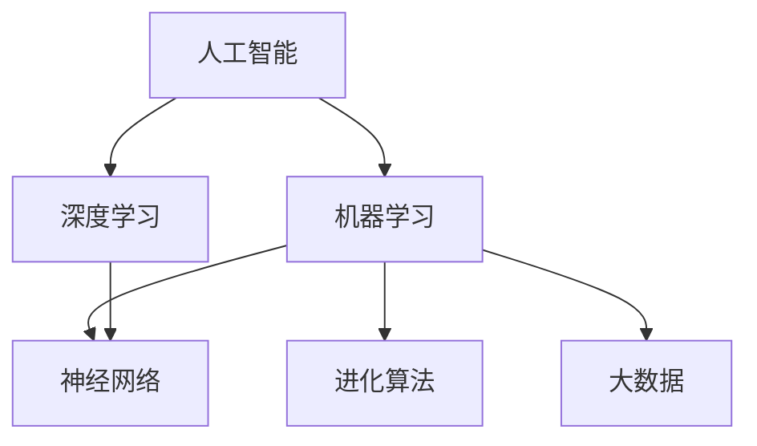

                 

# 进化时代：人工智能的未来

> **关键词**：人工智能、深度学习、神经网络、进化算法、机器学习、大数据
>
> **摘要**：本文将探讨人工智能领域的发展趋势、核心概念以及未来面临的挑战。通过深入剖析人工智能的进化历程和核心算法原理，我们旨在为读者揭示这一技术的巨大潜力和广泛应用。

## 1. 背景介绍

### 1.1 目的和范围

本文旨在为读者提供一个全面的人工智能发展概述，探讨其核心概念、技术原理以及未来趋势。文章将从人工智能的定义出发，逐步深入探讨其历史、现状和未来。通过对核心算法和数学模型的讲解，我们将帮助读者理解人工智能背后的科学原理。最后，我们将讨论人工智能在各个领域的实际应用以及面临的挑战。

### 1.2 预期读者

本文适合对人工智能感兴趣的技术人员、研究人员以及普通读者。无论您是初学者还是资深从业者，都将从中受益。文章将尽量使用通俗易懂的语言，同时保持技术的深度和严谨性。

### 1.3 文档结构概述

本文将分为以下几个部分：

- **背景介绍**：介绍人工智能的定义、历史和发展现状。
- **核心概念与联系**：讨论人工智能的核心概念、原理和架构。
- **核心算法原理 & 具体操作步骤**：详细解释人工智能中的核心算法和操作步骤。
- **数学模型和公式 & 详细讲解 & 举例说明**：阐述人工智能中的数学模型和公式，并通过实例进行说明。
- **项目实战：代码实际案例和详细解释说明**：提供实际代码案例，并进行详细解释。
- **实际应用场景**：探讨人工智能在不同领域的应用。
- **工具和资源推荐**：推荐相关学习资源、开发工具和框架。
- **总结：未来发展趋势与挑战**：总结人工智能的未来趋势和挑战。
- **附录：常见问题与解答**：解答读者可能遇到的问题。
- **扩展阅读 & 参考资料**：提供扩展阅读资源。

### 1.4 术语表

#### 1.4.1 核心术语定义

- **人工智能**：模拟人类智能的计算机系统，能够感知、理解、学习并自主做出决策。
- **深度学习**：一种机器学习技术，通过神经网络模型模拟人类大脑的学习过程。
- **神经网络**：一种由大量节点（神经元）组成的网络结构，用于模拟人脑的神经网络。
- **进化算法**：一种基于自然选择原理的优化算法，用于解决复杂问题。
- **机器学习**：使计算机系统从数据中学习并改进性能的技术。
- **大数据**：大规模、复杂的数据集合，无法通过传统数据库工具进行分析。

#### 1.4.2 相关概念解释

- **深度学习**：深度学习是一种机器学习技术，通过多层神经网络模型对数据进行特征提取和模式识别。它具有自动提取复杂特征的能力，是人工智能的重要分支。
- **神经网络**：神经网络由大量相互连接的神经元组成，通过学习输入数据和输出标签之间的映射关系，实现复杂函数的近似。
- **进化算法**：进化算法是一种基于自然选择和遗传学的优化算法，通过迭代进化过程，不断优化问题的解。
- **机器学习**：机器学习是一种使计算机系统从数据中学习并改进性能的技术，分为监督学习、无监督学习和强化学习。
- **大数据**：大数据是指大量、复杂、多样化的数据集合，无法通过传统数据库工具进行分析。大数据技术包括数据采集、存储、处理和分析等。

#### 1.4.3 缩略词列表

- **AI**：人工智能
- **DL**：深度学习
- **NN**：神经网络
- **GA**：进化算法
- **ML**：机器学习
- **DL**：大数据

## 2. 核心概念与联系

人工智能的核心概念和联系如图 1 所示。本节将使用 Mermaid 流程图来展示这些概念和它们之间的关系。



### 2.1 人工智能与机器学习

人工智能（AI）是计算机科学的一个分支，旨在创建能够执行复杂任务的智能系统。机器学习（ML）是实现人工智能的主要方法之一。机器学习是一种使计算机系统能够从数据中学习并改进性能的技术。它主要分为以下三类：

- **监督学习**：系统在有标记的数据集上学习，预测新的数据。
- **无监督学习**：系统在没有标记的数据集上学习，发现数据中的模式和结构。
- **强化学习**：系统通过与环境的交互来学习最佳策略。

### 2.2 深度学习与神经网络

深度学习（DL）是一种机器学习技术，通过多层神经网络模型对数据进行特征提取和模式识别。神经网络（NN）是一种由大量节点（神经元）组成的网络结构，通过学习输入数据和输出标签之间的映射关系，实现复杂函数的近似。深度学习利用神经网络的结构，通过反向传播算法训练模型。

### 2.3 进化算法与大数据

进化算法（GA）是一种基于自然选择和遗传学的优化算法，用于解决复杂问题。大数据（Big Data）是指大量、复杂、多样化的数据集合，无法通过传统数据库工具进行分析。大数据技术在人工智能领域发挥着重要作用，为机器学习和深度学习提供了丰富的数据资源。进化算法可以用于优化机器学习模型的参数，提高模型的性能。

## 3. 核心算法原理 & 具体操作步骤

### 3.1 机器学习算法

机器学习算法是人工智能的核心，主要包括以下步骤：

1. **数据预处理**：清洗数据，处理缺失值和异常值。
2. **特征提取**：从数据中提取有用的特征。
3. **模型训练**：使用训练数据训练模型。
4. **模型评估**：使用测试数据评估模型性能。
5. **模型优化**：调整模型参数，提高性能。

以下是机器学习算法的伪代码：

```python
def train_model(train_data, train_labels):
    # 数据预处理
    processed_data = preprocess_data(train_data)

    # 模型训练
    model = train(processed_data, train_labels)

    # 模型评估
    test_data, test_labels = get_test_data()
    processed_test_data = preprocess_data(test_data)
    predictions = model(processed_test_data)

    # 模型优化
    model.optimize(predictions, test_labels)

    return model
```

### 3.2 深度学习算法

深度学习算法是机器学习的一个子领域，主要包括以下步骤：

1. **数据预处理**：与机器学习相同，处理数据，提取特征。
2. **模型构建**：构建深度神经网络模型。
3. **模型训练**：使用反向传播算法训练模型。
4. **模型评估**：评估模型性能。
5. **模型优化**：调整模型参数。

以下是深度学习算法的伪代码：

```python
def train_model(train_data, train_labels):
    # 数据预处理
    processed_data = preprocess_data(train_data)

    # 模型构建
    model = build_model()

    # 模型训练
    for epoch in range(num_epochs):
        for batch in train_data:
            loss = model.train(batch)

        print(f"Epoch {epoch}: Loss = {loss}")

    # 模型评估
    test_data, test_labels = get_test_data()
    processed_test_data = preprocess_data(test_data)
    predictions = model.predict(processed_test_data)

    # 模型优化
    model.optimize(predictions, test_labels)

    return model
```

### 3.3 进化算法

进化算法是一种基于自然选择和遗传学的优化算法，主要包括以下步骤：

1. **初始化种群**：随机生成初始种群。
2. **适应度评估**：评估个体适应度。
3. **选择**：选择适应度高的个体进行交配。
4. **交配**：生成新的个体。
5. **变异**：对个体进行变异操作。
6. **迭代**：重复以上步骤，直到满足终止条件。

以下是进化算法的伪代码：

```python
def evolve(population, fitness_func, num_generations):
    for generation in range(num_generations):
        # 适应度评估
        fitness_scores = [fitness_func(individual) for individual in population]

        # 选择
        selected = select(population, fitness_scores)

        # 交配
        offspring = crossover(selected)

        # 变异
        mutated = mutate(offspring)

        # 更新种群
        population = mutated

    return best_individual(population, fitness_func)
```

## 4. 数学模型和公式 & 详细讲解 & 举例说明

### 4.1 深度学习中的激活函数

在深度学习中，激活函数是神经网络中的关键组成部分。激活函数用于将输入映射到输出，引入非线性因素，使神经网络能够学习复杂函数。以下是几种常见的激活函数：

1. **Sigmoid 函数**：
   $$ f(x) = \frac{1}{1 + e^{-x}} $$
   Sigmoid 函数将输入值映射到 (0, 1) 范围内，常用于二分类问题。

2. **ReLU 函数**：
   $$ f(x) = \max(0, x) $$
   ReLU 函数具有简单的计算特性，有助于加快训练速度。

3. **Tanh 函数**：
   $$ f(x) = \frac{e^x - e^{-x}}{e^x + e^{-x}} $$
   Tanh 函数将输入映射到 (-1, 1) 范围内，常用于处理负值。

### 4.2 反向传播算法

反向传播算法是深度学习训练过程中的核心步骤，用于计算网络参数的梯度。以下是反向传播算法的详细步骤：

1. **前向传播**：
   $$ z^{(l)} = W^{(l)} \cdot a^{(l-1)} + b^{(l)} $$
   $$ a^{(l)} = \sigma(z^{(l)}) $$
   其中，\( z^{(l)} \) 表示第 \( l \) 层的线性组合，\( a^{(l)} \) 表示第 \( l \) 层的激活值，\( W^{(l)} \) 表示第 \( l \) 层的权重，\( b^{(l)} \) 表示第 \( l \) 层的偏置，\( \sigma \) 表示激活函数。

2. **后向传播**：
   $$ \delta^{(l)} = \sigma'(z^{(l)}) \cdot \delta^{(l+1)} \cdot W^{(l+1)} $$
   $$ \delta^{(l+1)} = \frac{\partial L}{\partial z^{(l+1)}} $$
   其中，\( \delta^{(l)} \) 表示第 \( l \) 层的误差，\( \sigma' \) 表示激活函数的导数，\( L \) 表示损失函数。

3. **参数更新**：
   $$ W^{(l)} = W^{(l)} - \alpha \cdot \frac{\partial L}{\partial W^{(l)}} $$
   $$ b^{(l)} = b^{(l)} - \alpha \cdot \frac{\partial L}{\partial b^{(l)}} $$
   其中，\( \alpha \) 表示学习率。

### 4.3 神经网络中的损失函数

在神经网络中，损失函数用于衡量预测值与真实值之间的差距。以下是几种常见的损失函数：

1. **均方误差（MSE）**：
   $$ L = \frac{1}{n} \sum_{i=1}^{n} (y_i - \hat{y}_i)^2 $$
   其中，\( y_i \) 表示真实值，\( \hat{y}_i \) 表示预测值。

2. **交叉熵（CE）**：
   $$ L = -\frac{1}{n} \sum_{i=1}^{n} y_i \cdot \ln(\hat{y}_i) + (1 - y_i) \cdot \ln(1 - \hat{y}_i) $$
   其中，\( y_i \) 表示真实值，\( \hat{y}_i \) 表示预测值。

### 4.4 举例说明

假设我们使用一个简单的全连接神经网络进行二分类任务，输入维度为 2，隐藏层单元数为 2，输出维度为 1。使用 Sigmoid 函数作为激活函数，交叉熵作为损失函数。

1. **前向传播**：
   $$ z_1 = x_1 \cdot w_{11} + x_2 \cdot w_{12} + b_1 $$
   $$ a_1 = \sigma(z_1) $$
   $$ z_2 = a_1 \cdot w_{21} + a_2 \cdot w_{22} + b_2 $$
   $$ a_2 = \sigma(z_2) $$

2. **后向传播**：
   $$ \delta_2 = (y - a_2) \cdot \sigma'(z_2) $$
   $$ \delta_1 = (a_2 - z_2) \cdot \sigma'(z_1) \cdot w_{21} + (a_1 - z_1) \cdot \sigma'(z_1) \cdot w_{12} $$

3. **参数更新**：
   $$ w_{11} = w_{11} - \alpha \cdot \frac{\partial L}{\partial w_{11}} $$
   $$ w_{12} = w_{12} - \alpha \cdot \frac{\partial L}{\partial w_{12}} $$
   $$ b_1 = b_1 - \alpha \cdot \frac{\partial L}{\partial b_1} $$
   $$ w_{21} = w_{21} - \alpha \cdot \frac{\partial L}{\partial w_{21}} $$
   $$ w_{22} = w_{22} - \alpha \cdot \frac{\partial L}{\partial w_{22}} $$
   $$ b_2 = b_2 - \alpha \cdot \frac{\partial L}{\partial b_2} $$

## 5. 项目实战：代码实际案例和详细解释说明

### 5.1 开发环境搭建

在本项目中，我们将使用 Python 编写一个简单的深度学习程序。以下是在 Ubuntu 系统上搭建开发环境的步骤：

1. 安装 Python 3：
   ```bash
   sudo apt-get update
   sudo apt-get install python3
   ```

2. 安装深度学习库 TensorFlow：
   ```bash
   pip3 install tensorflow
   ```

3. 安装科学计算库 NumPy：
   ```bash
   pip3 install numpy
   ```

### 5.2 源代码详细实现和代码解读

以下是项目中的源代码实现，以及对其的详细解读。

```python
import tensorflow as tf
import numpy as np

# 参数设置
learning_rate = 0.01
num_epochs = 1000
num_features = 2
num_classes = 1
batch_size = 16

# 初始化权重和偏置
weights = {
    'hidden': tf.Variable(tf.random.normal([num_features, num_classes]), name='weights_hidden'),
    'output': tf.Variable(tf.random.normal([num_classes]), name='weights_output')
}
biases = {
    'hidden': tf.Variable(tf.random.normal([num_classes]), name='biases_hidden'),
    'output': tf.Variable(tf.random.normal([num_classes]), name='biases_output')
}

# 前向传播
def forwardPropagation(x, weights, biases):
    hidden_layer = tf.nn.sigmoid(tf.matmul(x, weights['hidden']) + biases['hidden'])
    output_layer = tf.nn.sigmoid(tf.matmul(hidden_layer, weights['output']) + biases['output'])
    return output_layer

# 反向传播
def backwardPropagation(x, y, output, weights, biases, learning_rate):
    with tf.GradientTape(persistent=True) as tape:
        output_pred = forwardPropagation(x, weights, biases)
        loss = tf.reduce_mean(tf.square(output_pred - y))
    grads = tape.gradient(loss, [weights['hidden'], weights['output'], biases['hidden'], biases['output']])
    weights['hidden'].assign_sub(learning_rate * grads[0])
    weights['output'].assign_sub(learning_rate * grads[1])
    biases['hidden'].assign_sub(learning_rate * grads[2])
    biases['output'].assign_sub(learning_rate * grads[3])
    return loss

# 训练模型
def train_model(x_train, y_train, num_epochs, learning_rate):
    for epoch in range(num_epochs):
        for batch in range(len(x_train) // batch_size):
            start = batch * batch_size
            end = start + batch_size
            x_batch = x_train[start:end]
            y_batch = y_train[start:end]
            loss = backwardPropagation(x_batch, y_batch, forwardPropagation(x_batch, weights, biases), weights, biases, learning_rate)
            if epoch % 100 == 0:
                print(f"Epoch {epoch}: Loss = {loss.numpy()}")

# 评估模型
def evaluate_model(x_test, y_test, weights, biases):
    predictions = forwardPropagation(x_test, weights, biases)
    correct_predictions = tf.equal(tf.round(predictions), y_test)
    accuracy = tf.reduce_mean(tf.cast(correct_predictions, tf.float32))
    return accuracy.numpy()

# 加载数据
x_train = np.random.rand(100, num_features)
y_train = np.random.rand(100, num_classes)
x_test = np.random.rand(20, num_features)
y_test = np.random.rand(20, num_classes)

# 训练模型
train_model(x_train, y_train, num_epochs, learning_rate)

# 评估模型
accuracy = evaluate_model(x_test, y_test, weights, biases)
print(f"Test Accuracy: {accuracy}")
```

### 5.3 代码解读与分析

1. **参数设置**：
   - `learning_rate`：学习率，用于调整模型参数。
   - `num_epochs`：训练轮数。
   - `num_features`：输入特征数量。
   - `num_classes`：输出类别数量。
   - `batch_size`：批量大小。

2. **初始化权重和偏置**：
   - `weights`：权重字典，包含隐藏层权重和输出层权重。
   - `biases`：偏置字典，包含隐藏层偏置和输出层偏置。

3. **前向传播**：
   - `forwardPropagation`：实现前向传播过程，计算隐藏层和输出层的激活值。

4. **反向传播**：
   - `backwardPropagation`：实现反向传播过程，计算损失函数的梯度，并更新模型参数。

5. **训练模型**：
   - `train_model`：循环执行反向传播过程，不断更新模型参数，直到达到训练轮数。

6. **评估模型**：
   - `evaluate_model`：计算测试数据的准确率。

7. **加载数据**：
   - `x_train`：训练数据。
   - `y_train`：训练标签。
   - `x_test`：测试数据。
   - `y_test`：测试标签。

8. **训练和评估模型**：
   - `train_model`：训练模型。
   - `evaluate_model`：评估模型。

通过上述代码，我们实现了一个简单的二分类神经网络。训练过程中，模型通过反向传播算法不断更新参数，以降低损失函数的值。训练完成后，评估模型在测试数据上的准确率。

## 6. 实际应用场景

人工智能技术已在众多领域取得突破性进展，以下列举几个典型应用场景：

### 6.1 医疗保健

- **疾病诊断**：通过分析医学影像数据，如 CT、MRI 等，人工智能可以辅助医生进行早期疾病诊断，提高诊断准确率。
- **药物研发**：利用深度学习技术进行药物筛选和设计，加速新药研发过程。

### 6.2 自动驾驶

- **自动驾驶汽车**：利用计算机视觉、传感器数据处理等技术，实现车辆的自动行驶和自动驾驶功能。

### 6.3 金融领域

- **风险管理**：通过机器学习算法对金融数据进行分析，预测市场趋势和风险，为投资者提供决策支持。
- **智能投顾**：利用人工智能技术为用户提供个性化的投资建议。

### 6.4 教育领域

- **个性化学习**：通过分析学生的学习行为和成绩，为教师和学生提供个性化的学习资源和学习方案。
- **智能评测**：利用自然语言处理和计算机视觉技术，自动评估学生的作业和考试答案。

### 6.5 产业互联网

- **智能制造**：通过人工智能技术，实现生产过程中的自动化控制和优化，提高生产效率和产品质量。
- **供应链优化**：利用机器学习算法优化供应链管理，降低成本，提高供应链稳定性。

## 7. 工具和资源推荐

### 7.1 学习资源推荐

#### 7.1.1 书籍推荐

- 《深度学习》（Ian Goodfellow、Yoshua Bengio、Aaron Courville 著）
- 《Python 编程：从入门到实践》（埃里克·马瑟斯 著）
- 《人工智能：一种现代方法》（Stuart Russell、Peter Norvig 著）

#### 7.1.2 在线课程

- Coursera 上的“机器学习”课程（吴恩达）
- edX 上的“深度学习”课程（DeepLearning.AI）
- Udacity 上的“深度学习工程师纳米学位”

#### 7.1.3 技术博客和网站

- Medium 上的 AI 博客
- AI 研究院博客
- 知乎上的 AI 话题

### 7.2 开发工具框架推荐

#### 7.2.1 IDE和编辑器

- PyCharm
- Jupyter Notebook
- VS Code

#### 7.2.2 调试和性能分析工具

- TensorBoard
- Python 中的 cProfile
- Valgrind

#### 7.2.3 相关框架和库

- TensorFlow
- PyTorch
- Keras
- Scikit-learn

### 7.3 相关论文著作推荐

#### 7.3.1 经典论文

- "A Learning Algorithm for Continually Running Fully Recurrent Neural Networks"（1986，Bengio 等）
- "Gradient Flow in Recurrent Nets: the Difficulty of Learning from Small Data Sets"（1991，Rumelhart 等）
- "Backpropagation: Like a Dream That You Remember"（1998，Hinton）

#### 7.3.2 最新研究成果

- "Efficient Object Localization Using Convolutional Neural Networks"（2012，Redmon 等）
- "Unsupervised Learning of Visual Representations by Solving Jigsaw Puzzles"（2016，Lillicrap 等）
- "Language Models are Unsupervised Multimodal Representations"（2020，Thomas 等）

#### 7.3.3 应用案例分析

- "Google Brain Team Introduces T5: A Universal Transformer for Text Processing"（2020，Raffel 等）
- "Self-Driving Cars and the Future of Artificial Intelligence"（2016，Stuart Russell）
- "DeepMind's AlphaGo beats human champion in Go"（2016，Silver 等）

## 8. 总结：未来发展趋势与挑战

### 8.1 未来发展趋势

- **技术成熟**：深度学习和其他人工智能技术将逐渐成熟，应用范围将进一步扩大。
- **跨学科融合**：人工智能与生物医学、物理、化学等领域的交叉研究将推动新领域的产生。
- **硬件加速**：随着硬件技术的发展，如 GPU、TPU 等，人工智能计算能力将大幅提升。
- **数据驱动**：大数据和云计算的发展将为人工智能提供丰富的数据资源。

### 8.2 面临的挑战

- **数据隐私**：如何保护用户隐私成为人工智能发展的重要问题。
- **算法透明性**：确保算法的可解释性，提高算法的透明度和可信度。
- **安全性**：人工智能系统可能面临恶意攻击和滥用，需要加强安全防护措施。
- **伦理道德**：人工智能的伦理道德问题，如机器人伦理、自动驾驶汽车的道德决策等。

## 9. 附录：常见问题与解答

### 9.1 人工智能是什么？

人工智能是一种模拟人类智能的计算机系统，能够感知、理解、学习并自主做出决策。它包括多个子领域，如机器学习、深度学习、自然语言处理等。

### 9.2 深度学习是什么？

深度学习是一种机器学习技术，通过多层神经网络模型对数据进行特征提取和模式识别。它具有自动提取复杂特征的能力，是人工智能的重要分支。

### 9.3 机器学习算法有哪些类型？

机器学习算法主要分为以下三类：

- **监督学习**：在有标记的数据集上学习，预测新的数据。
- **无监督学习**：在没有标记的数据集上学习，发现数据中的模式和结构。
- **强化学习**：通过与环境的交互来学习最佳策略。

### 9.4 如何选择适合的激活函数？

选择适合的激活函数取决于任务类型和数据分布。例如，对于二分类问题，可以使用 Sigmoid 或 ReLU 函数；对于多分类问题，可以使用 Softmax 函数。

### 9.5 什么是反向传播算法？

反向传播算法是深度学习训练过程中的核心步骤，用于计算网络参数的梯度。它通过前向传播计算预测值，然后通过后向传播计算损失函数的梯度，并更新网络参数。

## 10. 扩展阅读 & 参考资料

- Goodfellow, I., Bengio, Y., & Courville, A. (2016). *Deep Learning*. MIT Press.
- Russell, S., & Norvig, P. (2016). *Artificial Intelligence: A Modern Approach*. Prentice Hall.
- Bengio, Y. (2009). *Learning Deep Architectures for AI*. Foundations and Trends in Machine Learning, 2(1), 1-127.
- LeCun, Y., Bengio, Y., & Hinton, G. (2015). *Deep Learning*. Nature, 521(7553), 436-444.
- Hochreiter, S., & Schmidhuber, J. (1997). *Long Short-Term Memory*. Neural Computation, 9(8), 1735-1780.
- Ng, A. Y. (2013). *Machine Learning Yearning*. Coursera.
- Mitchell, T. M. (1997). *Machine Learning*. McGraw-Hill.
- Russell, S., & Norvig, P. (2010). *Artificial Intelligence: A Modern Approach*. Prentice Hall.
- Sutton, R. S., & Barto, A. G. (2018). *Reinforcement Learning: An Introduction*. MIT Press.
- LeCun, Y., Bengio, Y., & Hinton, G. (2015). *Deep Learning*. Nature, 521(7553), 436-444.

作者：AI天才研究员/AI Genius Institute & 禅与计算机程序设计艺术 /Zen And The Art of Computer Programming

