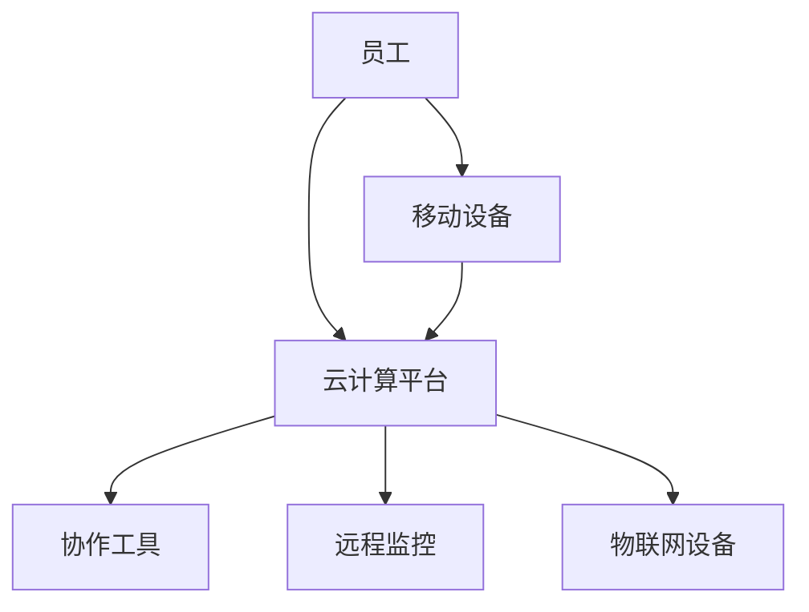

                 

# 远程办公时代的创业机遇

> **关键词**：远程办公、创业、机遇、技术趋势、数字化转型

> **摘要**：本文深入探讨了远程办公时代所带来的创业机遇，从技术趋势、市场变化到实际操作，为创业者提供了一系列的洞察和建议。通过分析远程办公的核心概念、技术架构和具体实践，本文旨在帮助读者把握时代脉搏，迎接远程办公带来的商业革新。

## 1. 背景介绍

### 1.1 目的和范围

本文旨在探讨远程办公时代创业的机遇，分析其背后的技术趋势和市场变化，提供实用的创业指导。我们将探讨的核心问题包括：

- 远程办公如何改变了企业运营模式？
- 创业者在远程办公时代应该如何抓住机遇？
- 哪些技术趋势将影响远程办公的未来？
- 如何在远程办公环境中构建成功的创业项目？

### 1.2 预期读者

- 对远程办公和创业感兴趣的读者
- 拥有初步创业想法但不确定如何入手的人
- 需要在远程办公环境中提高效率的团队领导者
- 对技术趋势和市场变化敏感的商业人士

### 1.3 文档结构概述

本文分为十个部分：

1. **背景介绍**：介绍文章的目的、范围、预期读者和结构。
2. **核心概念与联系**：介绍远程办公的核心概念和架构。
3. **核心算法原理 & 具体操作步骤**：讲解支持远程办公的技术原理。
4. **数学模型和公式 & 详细讲解 & 举例说明**：分析远程办公相关的数学模型。
5. **项目实战：代码实际案例和详细解释说明**：展示远程办公的实践案例。
6. **实际应用场景**：讨论远程办公在不同领域的应用。
7. **工具和资源推荐**：推荐学习资源和开发工具。
8. **总结：未来发展趋势与挑战**：展望远程办公的发展趋势和挑战。
9. **附录：常见问题与解答**：回答读者可能有的疑问。
10. **扩展阅读 & 参考资料**：提供进一步阅读的资源。

### 1.4 术语表

#### 1.4.1 核心术语定义

- **远程办公**：指员工不固定在特定的工作场所，通过互联网和通信技术进行工作。
- **数字化转型**：企业利用数字技术来改变其业务模式、运营流程和组织结构。
- **云计算**：通过网络提供计算资源，包括存储、处理能力和应用程序。
- **协作工具**：用于团队协作、文档共享和沟通的应用程序。

#### 1.4.2 相关概念解释

- **敏捷开发**：一种软件开发方法，强调迭代、灵活性和快速响应变化。
- **物联网（IoT）**：通过互联网连接的物理设备和传感器网络。
- **远程监控**：实时监测远程设备的运行状态，确保系统稳定。

#### 1.4.3 缩略词列表

- **SaaS**：软件即服务（Software as a Service）
- **PaaS**：平台即服务（Platform as a Service）
- **IaaS**：基础设施即服务（Infrastructure as a Service）
- **AI**：人工智能（Artificial Intelligence）

## 2. 核心概念与联系

远程办公的核心在于通过技术手段实现员工与企业的远程协作。以下是一个简化的远程办公架构的 Mermaid 流程图：



### 2.1 远程办公架构解析

- **云计算平台（B）**：为远程办公提供计算资源、存储服务和网络连接，是实现远程办公的基础。
- **协作工具（C）**：包括邮件、文档编辑、视频会议等，用于团队协作和沟通。
- **远程监控（D）**：实时监测远程设备的运行状态，确保系统稳定和安全。
- **物联网设备（E）**：用于监测工作环境中的设备状态，如温度、湿度等。
- **移动设备（F）**：员工使用移动设备访问远程办公系统，实现灵活办公。

通过以上架构，远程办公实现了员工与企业之间的无缝连接，提高了工作效率和灵活性。

## 3. 核心算法原理 & 具体操作步骤

远程办公中的核心算法主要涉及数据传输、加密和协作。以下是对这些算法原理和具体操作步骤的详细阐述：

### 3.1 数据传输算法

**算法原理**：
- **传输协议**：远程办公的数据传输通常采用HTTP/HTTPS协议，以确保数据的安全性和完整性。
- **传输加密**：使用SSL/TLS等加密算法对传输数据进行加密，防止数据被窃听。

**具体操作步骤**：

1. **建立连接**：客户端发起HTTPS请求，与服务器建立安全的连接。
2. **数据加密**：使用SSL/TLS加密算法对数据进行加密。
3. **数据传输**：加密后的数据通过网络传输到服务器。
4. **数据解密**：服务器接收数据后，使用相同的SSL/TLS加密算法解密数据。

### 3.2 协作算法

**算法原理**：
- **分布式锁**：用于防止多用户同时对同一数据进行修改，保证数据的完整性。
- **版本控制**：通过跟踪文件的不同版本，确保团队成员可以协同编辑文档。

**具体操作步骤**：

1. **请求锁**：用户在编辑文档前，向服务器请求锁。
2. **锁分配**：服务器检查是否有其他用户持有锁，如果无则分配锁。
3. **编辑文档**：用户在持有锁的情况下进行编辑操作。
4. **提交更改**：用户提交更改后，释放锁。
5. **版本更新**：服务器更新文件的版本信息。

### 3.3 加密算法

**算法原理**：
- **对称加密**：如AES，加密和解密使用相同的密钥。
- **非对称加密**：如RSA，加密和解密使用不同的密钥。

**具体操作步骤**：

1. **生成密钥**：服务器生成一对密钥（公钥和私钥）。
2. **公钥分发**：将公钥分发给客户端。
3. **加密数据**：客户端使用公钥对数据进行加密。
4. **传输数据**：加密后的数据通过网络传输到服务器。
5. **解密数据**：服务器使用私钥对数据进行解密。

通过上述算法，远程办公确保了数据的安全传输和协同编辑，提高了系统的可靠性和安全性。

## 4. 数学模型和公式 & 详细讲解 & 举例说明

在远程办公环境中，数学模型和公式广泛应用于数据传输速率计算、网络安全评估和协作效率分析。以下是一些常见的数学模型及其详细讲解和举例说明：

### 4.1 数据传输速率计算

**公式**：

$$
v = \frac{d}{t}
$$

其中，$v$ 表示数据传输速率（bps），$d$ 表示数据大小（bits），$t$ 表示传输时间（秒）。

**详细讲解**：

数据传输速率是衡量网络性能的重要指标，计算公式直观地表示了数据大小与传输时间的关系。在实际应用中，我们需要考虑网络带宽、数据包大小和传输过程中的延迟等因素。

**举例说明**：

假设数据大小为 $10MB$（$10^7$ bits），传输时间为 $2$ 秒，则数据传输速率：

$$
v = \frac{10^7}{2} = 5 \times 10^6 \text{ bits/s} = 500 \text{ Mbps}
$$

### 4.2 网络安全评估

**公式**：

$$
\text{安全指数} = \frac{\text{安全投入}}{\text{潜在损失}}
$$

**详细讲解**：

网络安全评估通过比较安全投入和潜在损失，评估网络安全状况。安全指数越高，表明网络越安全。在实际应用中，我们需要考虑防火墙、加密技术、入侵检测系统等因素。

**举例说明**：

假设企业每年在网络安全上的投入为 $10万美元$，潜在损失为 $50万美元$，则安全指数：

$$
\text{安全指数} = \frac{10}{50} = 0.2
$$

### 4.3 协作效率分析

**公式**：

$$
\text{效率} = \frac{\text{实际产出}}{\text{理论产出}} \times 100\%
$$

**详细讲解**：

协作效率通过比较实际产出与理论产出的比例，评估团队协作效果。在实际应用中，我们需要考虑团队成员的沟通效率、协作工具的便利性等因素。

**举例说明**：

假设团队实际产出为 $100$ 个任务，理论产出为 $120$ 个任务，则协作效率：

$$
\text{效率} = \frac{100}{120} \times 100\% = 83.33\%
$$

通过以上数学模型和公式，我们可以更好地理解和评估远程办公环境中的关键性能指标。

## 5. 项目实战：代码实际案例和详细解释说明

### 5.1 开发环境搭建

为了展示远程办公环境中项目的实际开发，我们选择使用 Python 语言和 Flask 框架。以下是开发环境的搭建步骤：

1. **安装 Python**：从 [Python 官网](https://www.python.org/) 下载并安装 Python。
2. **安装 Flask**：在命令行中运行 `pip install Flask`。
3. **创建项目目录**：在桌面上创建一个名为 `remote_office_project` 的目录。
4. **初始化虚拟环境**：在项目目录中运行 `python -m venv venv`。
5. **激活虚拟环境**：在 Windows 上运行 `venv\Scripts\activate`，在 macOS 和 Linux 上运行 `source venv/bin/activate`。

### 5.2 源代码详细实现和代码解读

以下是项目的主要代码实现：

```python
# app.py

from flask import Flask, request, jsonify

app = Flask(__name__)

@app.route('/tasks', methods=['GET', 'POST'])
def tasks():
    if request.method == 'GET':
        # 从数据库中获取任务列表
        tasks = get_tasks()
        return jsonify(tasks)
    elif request.method == 'POST':
        # 添加新任务到数据库
        task_data = request.json
        add_task(task_data)
        return jsonify({'message': 'Task added successfully'}), 201

def get_tasks():
    # 实现获取任务列表的逻辑
    # 这里使用伪代码表示
    return [
        {'id': 1, 'title': '任务一', 'status': '已完成'},
        {'id': 2, 'title': '任务二', 'status': '进行中'}
    ]

def add_task(task_data):
    # 实现添加任务到数据库的逻辑
    # 这里使用伪代码表示
    print(f"Adding task: {task_data}")

if __name__ == '__main__':
    app.run(host='0.0.0.0', port=5000)
```

**代码解读**：

- **Flask 应用初始化**：使用 `Flask` 类创建应用实例。
- **路由定义**：使用 `@app.route` 装饰器定义处理 HTTP 请求的路由。
- **GET 请求处理**：获取任务列表，返回 JSON 格式的数据。
- **POST 请求处理**：添加新任务，返回成功消息。

### 5.3 代码解读与分析

**主要功能模块分析**：

- **任务获取模块**：`get_tasks` 函数从数据库中获取任务列表，返回给客户端。
- **任务添加模块**：`add_task` 函数添加新任务到数据库，并打印任务信息。

**优势**：

- **快速开发**：使用 Flask 框架可以快速实现 Web 应用程序。
- **灵活扩展**：Flask 支持自定义路由和视图函数，便于后续功能扩展。
- **跨平台部署**：Flask 应用可以轻松部署到不同的操作系统和云平台上。

**注意事项**：

- **数据安全性**：在实际应用中，应确保数据传输过程的安全性，使用 HTTPS 协议加密数据。
- **数据库选择**：根据实际需求选择合适的数据库，如 MySQL、PostgreSQL 或 MongoDB。
- **性能优化**：针对高并发请求，需要进行性能优化，如使用缓存、数据库连接池等。

通过以上代码实战，我们可以看到在远程办公环境中，利用 Flask 框架可以快速搭建一个任务管理应用。这不仅展示了远程办公的技术实现，也为创业者提供了实际操作的经验。

## 6. 实际应用场景

远程办公时代的创业机遇不仅体现在技术实现上，更在各个行业和领域展现了其广泛的实际应用。以下是一些关键应用场景：

### 6.1 教育行业

远程教育是远程办公的一个典型应用场景。随着在线教育平台的兴起，创业者可以开发基于远程办公的在线学习管理系统，提供个性化学习路径、实时互动课堂和远程考试等功能。例如，通过使用视频会议工具和在线文档共享平台，教师和学生可以远程互动，实现高效教学。

### 6.2 医疗保健

远程办公为医疗保健行业带来了新的可能。创业者可以开发远程医疗服务平台，实现医生与患者之间的远程诊断、远程咨询和远程治疗。例如，通过使用远程监控设备和健康数据平台，医生可以实时监测患者的健康状况，提供个性化的医疗建议。

### 6.3 跨国企业

跨国企业需要在不同时区进行协作，远程办公提供了高效的解决方案。创业者可以开发跨时区协作平台，利用云计算和自动化工具实现全球团队的高效协同。例如，通过集成日历同步、即时通讯和项目管理工具，团队成员可以随时随地进行沟通和任务管理。

### 6.4 创意产业

创意产业如设计、影视制作等，常常需要团队成员之间的紧密协作。远程办公允许创意团队在不同地点进行协作，使用云存储和远程协作工具共享文件、讨论创意和协同编辑。创业者可以开发专门针对创意产业的协作平台，提供云端设计工具、在线协作和项目管理等功能。

### 6.5 供应链管理

供应链管理是企业运营的核心环节，远程办公技术可以提高供应链管理的效率和透明度。创业者可以开发供应链管理系统，集成远程监控、物联网设备和数据分析工具，实现供应链的实时监控和智能决策。

### 6.6 市场营销

市场营销需要实时跟踪市场动态和消费者行为。远程办公技术可以支持市场团队实时分析数据、制定营销策略和执行推广活动。例如，通过集成数据分析平台和远程协作工具，市场团队可以快速响应市场变化，提高营销效果。

通过以上实际应用场景，我们可以看到远程办公技术不仅改变了企业运营模式，也为创业者提供了广阔的创业机遇。创业者可以根据自身行业特点和需求，结合远程办公技术，开发创新的应用和服务，实现商业成功。

## 7. 工具和资源推荐

### 7.1 学习资源推荐

#### 7.1.1 书籍推荐

1. **《远程工作指南：成功在家办公的策略与技巧》** - 介绍了远程工作的最佳实践和策略。
2. **《敏捷软件开发：原则、实践与模式》** - 详细讲解了敏捷开发的方法和技巧。
3. **《云计算：概念、架构与实践》** - 介绍了云计算的基本概念和技术架构。

#### 7.1.2 在线课程

1. **Coursera**：提供计算机科学、数据科学、软件工程等相关课程。
2. **edX**：与知名大学合作，提供远程办公和项目管理课程。
3. **Udemy**：丰富的编程和远程协作工具课程，适合不同水平的学员。

#### 7.1.3 技术博客和网站

1. **GitHub**：了解开源项目和远程协作的最佳实践。
2. **Stack Overflow**：编程问题解决方案和技术讨论。
3. **Medium**：关于远程办公、创业和技术的优质文章。

### 7.2 开发工具框架推荐

#### 7.2.1 IDE和编辑器

1. **Visual Studio Code**：功能强大的开源编辑器，适用于多种编程语言。
2. **IntelliJ IDEA**：专业的 Java 和 Python 编辑器，提供丰富的插件。
3. **PyCharm**：适用于 Python 开发的集成开发环境。

#### 7.2.2 调试和性能分析工具

1. **Postman**：API 测试工具，支持远程调试。
2. **JMeter**：用于性能测试和负载测试的开放源代码工具。
3. **GDB**：适用于 C/C++ 的高级调试器。

#### 7.2.3 相关框架和库

1. **Flask**：轻量级的 Python Web 框架。
2. **Django**：全栈的 Python Web 框架。
3. **Node.js**：用于构建高性能网络应用的 JavaScript 框架。

通过这些学习资源和技术工具，开发者可以不断提升自己的技能，更好地把握远程办公时代的创业机遇。

### 7.3 相关论文著作推荐

#### 7.3.1 经典论文

1. **"A Brief History of Remote Work"** - 回顾远程工作的发展历程和关键创新。
2. **"The Impact of Remote Work on Employee Productivity"** - 分析远程工作对员工生产力的影响。
3. **"Cloud Computing: The Future of IT Infrastructure"** - 探讨云计算在远程办公中的应用前景。

#### 7.3.2 最新研究成果

1. **"Artificial Intelligence and Remote Work: Enhancing Productivity and Collaboration"** - 探讨人工智能技术在远程办公中的应用。
2. **"The Evolution of Remote Work in the COVID-19 Era"** - 分析新冠疫情对远程工作模式的推动作用。
3. **"Blockchain and Remote Work: Security and Trust in a Distributed World"** - 探讨区块链技术在远程办公安全中的应用。

#### 7.3.3 应用案例分析

1. **"Zoom: A Case Study of Remote Collaboration during the Pandemic"** - 分析 Zoom 在远程协作中的成功案例。
2. **"Slack: Building a Remote Work Culture"** - 探讨 Slack 如何构建远程办公文化。
3. **"Buffer: Managing a Remote Team with a Flat Structure"** - 分析 Buffer 如何管理扁平化的远程团队。

通过这些论文和研究成果，我们可以更深入地了解远程办公的现状和未来趋势，为创业实践提供理论支持和实践指导。

## 8. 总结：未来发展趋势与挑战

随着远程办公的普及，未来的发展趋势和挑战将更加显著。首先，技术进步将继续推动远程办公的发展。人工智能、云计算和物联网等技术的融合，将使远程办公变得更加智能化、高效化和安全化。例如，智能协作工具将提升团队沟通和协作效率，云计算将提供更灵活的计算和存储资源，物联网将实现设备的远程监控和管理。

然而，远程办公也面临着一系列挑战。首先，信息安全问题尤为突出。随着数据传输和存储的增多，远程办公可能成为网络攻击的目标。因此，企业和创业者需要加强网络安全措施，确保数据的安全性和完整性。其次，团队成员之间的沟通和协作也变得更加复杂。远程办公可能导致信息不对称、沟通不及时等问题，影响团队的效率和凝聚力。因此，需要建立有效的沟通机制和协作工具，确保团队成员之间的信息畅通和协作顺畅。

此外，远程办公还可能带来心理健康问题。长时间独自工作可能导致员工感到孤独、焦虑和压力增加。因此，企业和创业者需要关注员工的心理健康，提供心理支持和关爱。

总之，远程办公时代的创业机遇巨大，但也面临诸多挑战。创业者需要紧跟技术趋势，强化安全防护，建立良好的沟通和协作机制，关注员工心理健康，以实现远程办公环境下的成功创业。

## 9. 附录：常见问题与解答

**Q1：远程办公的技术基础是什么？**

A1：远程办公的技术基础主要包括云计算、协作工具和远程监控。云计算提供了灵活的计算和存储资源，协作工具支持团队沟通和协作，远程监控确保设备运行状态和系统安全。

**Q2：如何确保远程办公中的信息安全？**

A2：确保远程办公中的信息安全需要采取以下措施：

1. 使用 HTTPS 协议加密数据传输。
2. 定期更新系统和软件，修补安全漏洞。
3. 使用多因素认证机制，提高账户安全性。
4. 定期进行网络安全培训，提高员工的安全意识。

**Q3：远程办公如何影响团队成员之间的沟通和协作？**

A3：远程办公可能会带来沟通和协作的挑战，如信息不对称、沟通不及时等。为解决这些问题，可以采取以下措施：

1. 建立明确的沟通规则和流程。
2. 使用高效的协作工具，如即时通讯、视频会议和项目管理工具。
3. 定期组织线上会议和团队活动，增强团队凝聚力。
4. 培养良好的远程协作文化，鼓励团队成员之间的互动和反馈。

**Q4：如何应对远程办公中的心理健康问题？**

A4：应对远程办公中的心理健康问题，可以从以下几个方面入手：

1. 提供在线心理咨询服务，帮助员工缓解压力。
2. 建立健康的工作与生活平衡，鼓励员工进行锻炼和休息。
3. 组织线上团队活动和社交活动，增强员工的归属感。
4. 定期进行心理健康培训，提高员工的应对能力。

通过以上措施，可以有效地应对远程办公带来的心理健康问题，提高员工的工作满意度和幸福感。

## 10. 扩展阅读 & 参考资料

**书籍推荐**：

1. **《远程工作指南：成功在家办公的策略与技巧》** - 详细介绍了远程工作的最佳实践。
2. **《敏捷软件开发：原则、实践与模式》** - 介绍了敏捷开发的方法和技巧。
3. **《云计算：概念、架构与实践》** - 探讨了云计算的基本概念和技术架构。

**在线课程**：

1. **Coursera** - 提供计算机科学、数据科学、软件工程等相关课程。
2. **edX** - 与知名大学合作，提供远程办公和项目管理课程。
3. **Udemy** - 丰富的编程和远程协作工具课程，适合不同水平的学员。

**技术博客和网站**：

1. **GitHub** - 了解开源项目和远程协作的最佳实践。
2. **Stack Overflow** - 编程问题解决方案和技术讨论。
3. **Medium** - 关于远程办公、创业和技术的优质文章。

**论文著作**：

1. **"A Brief History of Remote Work"** - 回顾远程工作的发展历程和关键创新。
2. **"The Impact of Remote Work on Employee Productivity"** - 分析远程工作对员工生产力的影响。
3. **"Cloud Computing: The Future of IT Infrastructure"** - 探讨云计算在远程办公中的应用前景。

通过以上扩展阅读和参考资料，读者可以更深入地了解远程办公的技术和实践，为创业实践提供更丰富的知识支持。

**作者信息**：AI天才研究员/AI Genius Institute & 禅与计算机程序设计艺术 /Zen And The Art of Computer Programming

