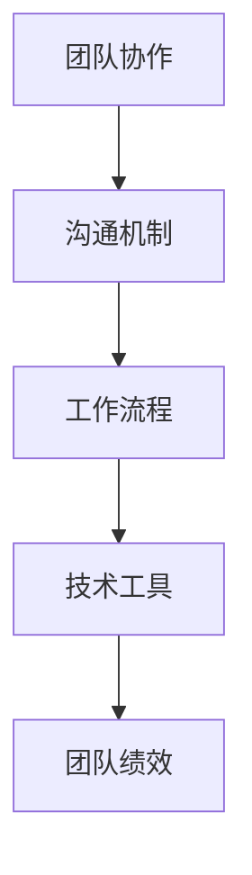

                 

# 远程团队凝聚：跨越地理界限的团队建设

> 关键词：远程团队、团队建设、沟通协作、工作流程、技术工具

> 摘要：本文探讨了在全球化背景下，远程团队如何通过有效的团队建设策略和技术手段来克服地理距离带来的挑战，实现高效合作。文章首先介绍了远程团队的定义和特点，接着分析了当前远程团队建设面临的主要问题，然后详细阐述了团队建设的关键原则和实践方法，最后推荐了一系列实用的工具和资源，以帮助远程团队更好地凝聚和协作。

## 1. 背景介绍

### 1.1 目的和范围

本文旨在为那些管理或参与远程团队的IT专业人士提供一套系统化的团队建设策略。随着全球化进程的加速，越来越多的企业和组织开始采用远程工作模式。这种模式不仅能够提高员工的灵活性和满意度，还可以降低运营成本。然而，远程团队在沟通协作、工作流程管理等方面也面临着诸多挑战。本文将围绕以下几个方面展开讨论：

1. 远程团队的定义和特点
2. 远程团队建设面临的主要问题
3. 团队建设的关键原则和实践方法
4. 适合远程团队的实用工具和资源
5. 未来发展趋势与挑战

### 1.2 预期读者

本文预期读者包括：

1. IT行业管理者：负责远程团队的规划、管理和协调
2. 远程团队成员：包括开发人员、测试人员、设计师等
3. IT专业学生和研究人员：对远程团队协作和技术工具有兴趣的读者
4. 咨询顾问：为企业和组织提供远程团队建设咨询服务

### 1.3 文档结构概述

本文分为十个主要部分，结构如下：

1. 引言：介绍远程团队建设和本文的目的
2. 背景介绍：讨论远程团队的定义、特点以及建设的重要性
3. 核心概念与联系：阐述团队建设的基本原则和关键要素
4. 核心算法原理 & 具体操作步骤：介绍团队建设的具体实施方法
5. 数学模型和公式 & 详细讲解 & 举例说明：运用数学模型和公式阐述团队建设策略
6. 项目实战：提供实际案例和代码实现
7. 实际应用场景：分析远程团队在不同行业中的应用
8. 工具和资源推荐：推荐适用于远程团队建设的工具和资源
9. 总结：展望远程团队建设的未来发展趋势和挑战
10. 附录：常见问题与解答，以及扩展阅读和参考资料

### 1.4 术语表

本文涉及以下关键术语：

- **远程团队**：指的是在地理上分散的团队，成员通过互联网和通信技术进行协作。
- **团队建设**：通过一系列策略和活动，增强团队成员之间的协作和凝聚力。
- **沟通协作**：团队成员之间通过语言、文字、图像等多种方式进行交流与合作。
- **工作流程**：描述团队在完成项目过程中的步骤和操作规范。
- **技术工具**：用于支持远程团队沟通、协作和管理的软件和硬件。

#### 1.4.1 核心术语定义

- **远程团队**：一个地理上分散的团队，成员分布在不同地区，通过互联网和通信技术进行协作。
- **团队建设**：通过各种策略和活动，增强团队成员之间的信任、协作和凝聚力，以提高团队整体绩效。
- **沟通协作**：团队成员之间通过各种渠道（如邮件、即时通讯、视频会议等）进行的交流与合作，以确保项目目标的实现。
- **工作流程**：描述团队在完成项目过程中的步骤、角色和职责，以及各步骤之间的逻辑关系。
- **技术工具**：用于支持远程团队沟通、协作和管理的软件和硬件，如视频会议软件、项目管理工具、协作平台等。

#### 1.4.2 相关概念解释

- **分布式团队**：分布式团队是一种特殊类型的远程团队，成员分布在不同时区和国家，工作时间和文化背景可能有所不同。
- **敏捷开发**：一种软件开发方法，强调快速迭代、频繁交付和持续改进，适用于远程团队的高效协作。
- **协同办公平台**：一种集成多种办公功能（如文档共享、任务管理、日程安排等）的平台，用于支持远程团队的协作。

#### 1.4.3 缩略词列表

- **IT**：信息技术（Information Technology）
- **OA**：办公自动化（Office Automation）
- **ERP**：企业资源计划（Enterprise Resource Planning）
- **CRM**：客户关系管理（Customer Relationship Management）
- **SaaS**：软件即服务（Software as a Service）
- **IaaS**：基础设施即服务（Infrastructure as a Service）
- **PaaS**：平台即服务（Platform as a Service）

## 2. 核心概念与联系

在远程团队建设中，理解以下核心概念和联系至关重要：

- **团队协作**：团队协作是远程团队成功的关键。通过有效协作，团队成员可以共同解决问题、共享知识和经验，提高整体绩效。
- **沟通机制**：良好的沟通机制是远程团队高效运作的基石。团队成员需要通过多种渠道进行有效沟通，以确保信息传递准确、及时。
- **工作流程**：明确的工作流程有助于团队成员了解各自的角色和职责，确保项目按计划进行。
- **技术工具**：技术工具是支持远程团队协作和管理的有力武器。选择合适的工具可以大幅提升团队的工作效率和协作效果。

以下是一个简单的 Mermaid 流程图，展示远程团队协作的基本流程和关键要素：



### 2.1 团队协作

团队协作是指团队成员在共同目标下，通过合作、沟通和共享资源来实现团队目标的过程。在远程团队中，团队协作尤为重要，因为团队成员之间缺乏面对面的互动，容易导致沟通障碍和协作效率低下。以下是一些促进远程团队协作的关键要素：

1. **共同目标**：团队成员应明确共同的目标和愿景，以此为基础进行协作。
2. **角色和职责**：明确各成员的角色和职责，避免职责重叠和冲突。
3. **沟通机制**：建立多种沟通渠道，如即时通讯、邮件、视频会议等，确保信息传递准确、及时。
4. **知识共享**：鼓励团队成员共享知识和经验，提高团队整体能力。
5. **团队氛围**：营造积极、开放的团队氛围，增强团队成员之间的信任和凝聚力。

### 2.2 沟通机制

良好的沟通机制是远程团队高效运作的基石。以下是一些关键要素：

1. **沟通频率**：确保团队成员之间有足够的沟通频率，避免信息滞后。
2. **沟通渠道**：选择合适的沟通渠道，如即时通讯、邮件、视频会议等，根据不同的场景和需求进行沟通。
3. **沟通工具**：使用有效的沟通工具，如 Slack、Microsoft Teams、Zoom 等，提高沟通效率和效果。
4. **信息共享**：确保重要信息在团队内部共享，避免信息孤岛。
5. **反馈机制**：建立反馈机制，及时收集和反馈团队成员的意见和建议，改进团队协作。

### 2.3 工作流程

明确的工作流程有助于团队成员了解各自的角色和职责，确保项目按计划进行。以下是一些关键要素：

1. **任务分配**：根据团队成员的技能和经验，合理分配任务，确保任务的高效完成。
2. **进度跟踪**：使用项目管理工具，如 Trello、Jira 等，实时跟踪项目进度，确保项目按计划进行。
3. **版本控制**：使用版本控制系统，如 Git，确保代码和文档的一致性和可追溯性。
4. **文档管理**：建立统一的文档管理规范，确保文档的完整性和可访问性。
5. **会议管理**：合理安排会议，确保会议的高效和有针对性。

### 2.4 技术工具

技术工具是支持远程团队协作和管理的有力武器。以下是一些关键要素：

1. **协作平台**：选择适合团队需求的协作平台，如 Slack、Confluence 等，用于团队沟通、文档共享和任务管理。
2. **视频会议**：选择功能强大、易用的视频会议工具，如 Zoom、Microsoft Teams 等，用于远程团队的面对面交流。
3. **项目管理工具**：选择适合团队需求的项目管理工具，如 Trello、Jira 等，用于任务分配、进度跟踪和项目管理。
4. **文档共享和协作工具**：使用云存储服务，如 Google Drive、Dropbox 等，方便团队成员共享和协作文档。
5. **其他辅助工具**：根据团队需求，选择其他合适的辅助工具，如时间管理工具、代码审查工具等。

## 3. 核心算法原理 & 具体操作步骤

在远程团队建设中，关键算法原理和具体操作步骤对于实现高效团队协作至关重要。以下将详细阐述团队建设过程中的核心算法原理，并给出具体操作步骤：

### 3.1 核心算法原理

远程团队建设的核心算法原理可以概括为以下三个方面：

1. **协作网络构建**：通过建立有效的协作网络，确保团队成员之间的信息流通和资源共享。
2. **任务调度与分配**：基于团队成员的技能和经验，合理分配任务，实现任务的高效完成。
3. **沟通机制优化**：通过优化沟通机制，提高团队成员之间的沟通效率和效果。

### 3.2 具体操作步骤

以下是远程团队建设过程中的具体操作步骤：

#### 步骤 1：构建协作网络

1. **确定团队目标和愿景**：明确团队的目标和愿景，确保团队成员对此有共同的理解和认同。
2. **角色和职责分配**：根据团队成员的技能和经验，明确各成员的角色和职责，确保任务分配合理。
3. **建立沟通渠道**：选择合适的沟通渠道，如 Slack、Microsoft Teams 等，确保团队成员之间的信息流通。

#### 步骤 2：任务调度与分配

1. **任务需求分析**：根据项目需求，分析任务的性质、复杂度和优先级。
2. **技能评估**：评估团队成员的技能和经验，确保任务分配符合成员的能力。
3. **任务分配**：将任务合理地分配给团队成员，确保任务的高效完成。
4. **任务跟踪**：使用项目管理工具，如 Trello、Jira 等，实时跟踪任务进度，确保任务按时完成。

#### 步骤 3：沟通机制优化

1. **沟通频率调整**：根据团队成员的工作内容和项目需求，调整沟通频率，确保信息传递的及时性。
2. **沟通渠道选择**：根据不同的沟通需求，选择合适的沟通渠道，如即时通讯、邮件、视频会议等。
3. **沟通工具使用**：使用有效的沟通工具，如 Slack、Zoom 等，提高沟通效率和效果。
4. **反馈机制建立**：建立反馈机制，及时收集和反馈团队成员的意见和建议，改进团队协作。

### 3.3 伪代码示例

以下是一个简单的伪代码示例，展示远程团队建设的基本步骤：

```python
# 远程团队建设伪代码

# 步骤 1：构建协作网络
define_team_goal_and_vision()
assign_roles_and_responsibilities()
establish_communication_channels()

# 步骤 2：任务调度与分配
analyze_task_requirements()
evaluate_member_skills()
assign_tasks_to_members()
track_task_progress()

# 步骤 3：沟通机制优化
adjust_communication_frequency()
select_communication_channels()
use_communication_tools()
establish_feedback_mechanism()
```

通过以上步骤和伪代码示例，我们可以看到远程团队建设的过程是如何一步步进行的。在实际操作中，团队可以根据自己的需求和实际情况，对上述步骤进行适当调整和优化，以实现高效团队协作。

## 4. 数学模型和公式 & 详细讲解 & 举例说明

在远程团队建设中，运用数学模型和公式可以帮助我们更科学地分析和优化团队协作过程。以下将介绍一些常用的数学模型和公式，并详细讲解其应用方法，同时通过具体例子来说明如何运用这些模型和公式来提升团队协作效率。

### 4.1 指数衰减模型

指数衰减模型是一种常用的模型，用于描述团队成员之间的信息传播和遗忘过程。该模型的基本公式如下：

\[ I(t) = I_0 \times e^{-rt} \]

其中：
- \( I(t) \) 表示时间 \( t \) 后的信息强度。
- \( I_0 \) 表示初始信息强度。
- \( r \) 表示遗忘速率。

#### 应用方法

在远程团队中，我们可以使用指数衰减模型来优化沟通频率。例如，假设团队中某项重要信息的初始传播时间为一周，遗忘速率为每天5%。通过调整遗忘速率，我们可以优化团队沟通频率，确保重要信息在适当的时间范围内得到传播和反馈。

#### 例子

假设团队中某项重要信息的初始传播时间为一周，遗忘速率为每天5%。我们需要计算在不同时间点（1天、3天、5天）的信息强度。

```latex
I(t) = I_0 \times e^{-rt}
```

- 当 \( t = 1 \) 时：

\[ I(1) = I_0 \times e^{-r \times 1} = I_0 \times e^{-0.05 \times 1} = I_0 \times 0.95 \]

- 当 \( t = 3 \) 时：

\[ I(3) = I_0 \times e^{-r \times 3} = I_0 \times e^{-0.05 \times 3} = I_0 \times 0.878 \]

- 当 \( t = 5 \) 时：

\[ I(5) = I_0 \times e^{-r \times 5} = I_0 \times e^{-0.05 \times 5} = I_0 \times 0.814 \]

通过上述计算，我们可以看到，随着时间推移，信息强度逐渐减弱。因此，团队需要合理调整沟通频率，确保信息在关键时间内得到有效传播。

### 4.2 任务完成时间模型

任务完成时间模型用于预测和优化团队完成任务所需的时间。该模型的基本公式如下：

\[ T = \frac{d}{r} \]

其中：
- \( T \) 表示任务完成时间。
- \( d \) 表示任务的工作量。
- \( r \) 表示团队成员的工作效率。

#### 应用方法

在远程团队中，我们可以使用任务完成时间模型来优化任务分配和团队资源管理。例如，假设团队需要完成一个工作量较大的任务，我们可以通过计算任务完成时间来评估团队成员的工作效率，并根据实际情况进行任务调整。

#### 例子

假设团队需要完成一个工作量 \( d \) 为1000小时的任务，团队成员的效率 \( r \) 为10小时/天。我们需要计算任务完成时间 \( T \)。

\[ T = \frac{d}{r} = \frac{1000}{10} = 100 \]

这意味着任务完成时间需要100天。然而，实际情况可能因团队成员的效率波动、外部因素等而有所不同。为了确保任务按时完成，团队可以采取以下措施：

1. **增加团队成员**：通过增加团队成员，提高整体工作效率，缩短任务完成时间。
2. **任务分解**：将任务分解为多个子任务，分配给不同团队成员，实现并行工作。
3. **资源调度**：根据团队成员的效率和工作时间，合理安排任务，确保任务按计划完成。

### 4.3 多目标优化模型

多目标优化模型用于同时考虑多个目标，并寻找最佳解决方案。在远程团队建设中，多目标优化模型可以帮助团队在资源有限的情况下，实现多个目标的最优平衡。该模型的基本公式如下：

\[ \min \sum_{i=1}^{n} w_i \times f_i(x) \]

其中：
- \( w_i \) 表示第 \( i \) 个目标的权重。
- \( f_i(x) \) 表示第 \( i \) 个目标在变量 \( x \) 下的函数值。

#### 应用方法

在远程团队中，我们可以使用多目标优化模型来优化团队资源分配、任务调度和项目进度。例如，假设团队需要在有限的资源下，同时完成多个项目任务，我们可以通过多目标优化模型来找到最优的解决方案。

#### 例子

假设团队需要在一个月内完成以下三个项目任务：

1. **任务A**：工作量100小时，权重0.3
2. **任务B**：工作量200小时，权重0.5
3. **任务C**：工作量150小时，权重0.2

团队成员的效率为每天8小时。我们需要使用多目标优化模型，找到最优的任务分配方案。

首先，我们定义目标函数：

\[ \min \sum_{i=1}^{3} w_i \times f_i(x) \]

其中：
- \( w_1 = 0.3 \)，\( f_1(x) = \frac{100}{x} \)
- \( w_2 = 0.5 \)，\( f_2(x) = \frac{200}{x} \)
- \( w_3 = 0.2 \)，\( f_3(x) = \frac{150}{x} \)

然后，我们求解最优解：

\[ \min \left( 0.3 \times \frac{100}{x} + 0.5 \times \frac{200}{x} + 0.2 \times \frac{150}{x} \right) \]

通过求解上述目标函数，我们可以找到最优的任务分配方案。例如，假设最优解为 \( x = 50 \)，则任务分配方案如下：

1. **任务A**：2人，完成时间50小时
2. **任务B**：5人，完成时间40小时
3. **任务C**：3人，完成时间50小时

通过上述例子，我们可以看到如何运用数学模型和公式来优化远程团队的建设过程。在实际应用中，团队可以根据实际情况和需求，灵活调整模型参数和算法，以实现最优团队协作效果。

## 5. 项目实战：代码实际案例和详细解释说明

为了更好地理解远程团队建设在实际项目中的应用，我们将在本节中介绍一个实际的代码案例，并对其进行详细解释说明。该案例将展示如何使用 Python 编写一个简单的远程团队协作工具，帮助团队成员进行任务管理和进度跟踪。

### 5.1 开发环境搭建

在开始编写代码之前，我们需要搭建一个合适的开发环境。以下是搭建开发环境的基本步骤：

1. 安装 Python 3.8 或更高版本：从官方网站下载并安装 Python，确保安装过程中选择添加到系统环境变量。
2. 安装必要的库：使用 pip 工具安装以下库：
   - Flask：用于构建 Web 应用程序
   - SQLAlchemy：用于数据库操作
   - Flask-WTF：用于表单处理
   - Flask-Login：用于用户身份验证

   ```bash
   pip install Flask SQLAlchemy Flask-WTF Flask-Login
   ```

3. 创建项目目录：在本地计算机上创建一个名为 `remote_team_tool` 的项目目录，并在该目录下创建一个名为 `app.py` 的 Python 文件，用于编写应用程序代码。

### 5.2 源代码详细实现和代码解读

以下是该远程团队协作工具的源代码实现，我们将逐行解读代码中的关键部分：

```python
from flask import Flask, render_template, request, redirect, url_for
from flask_sqlalchemy import SQLAlchemy
from flask_login import LoginManager, UserMixin, login_user, logout_user, login_required, current_user

app = Flask(__name__)
app.config['SQLALCHEMY_DATABASE_URI'] = 'sqlite:///remote_team_tool.db'
app.config['SECRET_KEY'] = 'your_secret_key'
db = SQLAlchemy(app)
login_manager = LoginManager(app)
login_manager.login_view = 'login'

class User(UserMixin, db.Model):
    id = db.Column(db.Integer, primary_key=True)
    username = db.Column(db.String(100), unique=True)
    password = db.Column(db.String(100))

class Task(db.Model):
    id = db.Column(db.Integer, primary_key=True)
    title = db.Column(db.String(100))
    description = db.Column(db.Text)
    status = db.Column(db.String(20))
    assigned_to = db.Column(db.String(100))

@login_manager.user_loader
def load_user(user_id):
    return User.query.get(int(user_id))

@app.route('/')
@login_required
def dashboard():
    tasks = Task.query.all()
    return render_template('dashboard.html', tasks=tasks)

@app.route('/add_task', methods=['POST'])
@login_required
def add_task():
    title = request.form['title']
    description = request.form['description']
    status = 'pending'
    assigned_to = current_user.username
    new_task = Task(title=title, description=description, status=status, assigned_to=assigned_to)
    db.session.add(new_task)
    db.session.commit()
    return redirect(url_for('dashboard'))

@app.route('/delete_task/<int:task_id>')
@login_required
def delete_task(task_id):
    task = Task.query.get(task_id)
    db.session.delete(task)
    db.session.commit()
    return redirect(url_for('dashboard'))

@app.route('/login', methods=['GET', 'POST'])
def login():
    if request.method == 'POST':
        username = request.form['username']
        password = request.form['password']
        user = User.query.filter_by(username=username).first()
        if user and user.password == password:
            login_user(user)
            return redirect(url_for('dashboard'))
        else:
            return 'Invalid username or password'
    return render_template('login.html')

@app.route('/logout')
@login_required
def logout():
    logout_user()
    return redirect(url_for('login'))

if __name__ == '__main__':
    db.create_all()
    app.run(debug=True)
```

#### 5.2.1 代码解读

1. **初始化 Flask 应用程序**：
   - 我们首先导入了 Flask、SQLAlchemy 和 Flask-Login 等库，并初始化 Flask 应用程序。
   - 配置了数据库 URI 和 Secret Key，用于后续的数据库连接和加密。

2. **定义数据库模型**：
   - **User** 类：表示用户模型，包含用户 ID、用户名和密码。
   - **Task** 类：表示任务模型，包含任务 ID、标题、描述、状态和指派给的用户。

3. **用户认证**：
   - 使用 Flask-Login 模块实现用户认证功能，包括登录、登出和用户身份验证。

4. **定义路由和视图函数**：
   - **dashboard** 视图函数：处理主页的展示，查询数据库中所有的任务，并将其传递给模板。
   - **add_task** 视图函数：处理添加新任务的功能，从表单中获取任务信息，将其存储到数据库中。
   - **delete_task** 视图函数：处理删除任务的功能，从 URL 中获取任务 ID，将其从数据库中删除。
   - **login** 视图函数：处理用户登录功能，从表单中获取用户名和密码，验证用户身份并登录。
   - **logout** 视图函数：处理用户登出功能，注销当前用户并重定向到登录页面。

5. **运行应用程序**：
   - 最后，我们调用 `db.create_all()` 创建数据库中的表，并使用 `app.run(debug=True)` 运行 Flask 应用程序。

### 5.3 代码解读与分析

1. **用户模型和认证**：
   - 用户模型使用 SQLAlchemy 定义，包含用户 ID、用户名和密码。用户认证使用 Flask-Login 模块，简化了用户登录、登出和身份验证的逻辑。

2. **任务模型和数据库操作**：
   - 任务模型定义了任务的基本属性，如标题、描述、状态和指派给的用户。通过 SQLAlchemy，我们可以方便地对任务进行增删改查操作。

3. **路由和视图函数**：
   - 路由和视图函数是实现应用程序业务逻辑的关键部分。通过定义不同的路由和视图函数，我们可以实现任务管理、用户认证和主页展示等功能。

4. **安全性考虑**：
   - 为了确保应用程序的安全性，我们使用了 Flask-Login 模块进行用户认证，并在数据库连接中使用 Secret Key 进行加密。

通过以上代码实现，我们可以看到如何使用 Python 和 Flask 搭建一个简单的远程团队协作工具。在实际项目中，团队可以根据具体需求对代码进行扩展和优化，以实现更多功能，如任务进度跟踪、团队通知和协作等。

## 6. 实际应用场景

远程团队建设在不同行业中有着广泛的应用，以下是几个典型的实际应用场景：

### 6.1 软件开发行业

软件开发行业是远程团队建设的主要应用领域之一。由于软件开发项目通常需要跨地域的协作，远程团队建设有助于提高开发效率、降低沟通成本和优化资源分配。以下是一些实际应用场景：

1. **分布式开发团队**：软件公司常常在全球范围内招募开发人员，形成分布式开发团队。通过远程团队建设，团队成员可以实时沟通、协作和共享代码，确保项目进度和质量。

2. **敏捷开发**：敏捷开发方法强调快速迭代和持续交付。远程团队建设有助于实现敏捷开发的核心原则，如频繁交付、持续反馈和团队协作。

3. **项目管理**：使用远程协作工具和项目管理工具，如 Jira、Trello 等，可以实时跟踪项目进度、分配任务和管理团队资源，确保项目按时完成。

### 6.2 创意设计行业

创意设计行业，如平面设计、UI/UX 设计和数字营销等，也需要远程团队建设来支持跨地域协作。以下是一些实际应用场景：

1. **设计师协作**：设计师们可以使用远程协作工具，如 Figma、Adobe Creative Cloud 等，实时协作和共享设计资源，确保设计项目的高效和高质量完成。

2. **创意流程优化**：通过远程团队建设，设计团队可以更好地整合创意想法、优化设计流程和缩短项目周期。

3. **客户沟通**：远程团队建设有助于设计团队与客户保持紧密沟通，及时了解客户需求和反馈，提高客户满意度。

### 6.3 教育行业

随着在线教育的普及，远程团队建设在教育和培训领域也得到了广泛应用。以下是一些实际应用场景：

1. **在线课程开发**：教育机构可以组建远程团队，协作开发在线课程，包括课程内容、教学视频和互动活动等。

2. **教学协作**：教师们可以通过远程协作工具，如 Microsoft Teams、Google Classroom 等，共享教学资源和互动教学，提高教学效果和学生的学习体验。

3. **学习社区建设**：远程团队建设有助于构建在线学习社区，促进师生之间和同学之间的互动和交流，增强学习氛围。

### 6.4 咨询和服务行业

咨询服务行业，如管理咨询、IT 咨询和财务咨询等，也广泛采用远程团队建设。以下是一些实际应用场景：

1. **专家协作**：咨询服务公司可以组建远程团队，汇集不同领域的专家，为客户提供全方位的咨询服务。

2. **项目交付**：远程团队建设有助于提高项目交付效率，确保项目按时、按质完成。

3. **知识共享**：通过远程协作工具，专家们可以共享经验和知识，提高团队整体能力，为客户提供更优质的服务。

综上所述，远程团队建设在软件开发、创意设计、教育行业和咨询服务等领域都有着广泛的应用，通过有效的团队建设策略和技术手段，远程团队可以克服地理距离和时区差异，实现高效协作和项目成功。

## 7. 工具和资源推荐

为了帮助远程团队更好地实现高效协作和团队建设，我们在此推荐一系列实用的工具和资源，包括学习资源、开发工具框架以及相关论文和著作。

### 7.1 学习资源推荐

#### 7.1.1 书籍推荐

1. **《远程工作的艺术：打造高效、自律、快乐的工作模式》**
   - 作者：史蒂夫·韦伯（Steve Weber）
   - 简介：本书详细介绍了远程工作的优势、挑战和最佳实践，为远程工作者提供了实用的建议和策略。

2. **《敏捷团队建设：打造高效的协作团队》**
   - 作者：艾伦·惠特菲尔德（Alan W. Wittwer）
   - 简介：本书从敏捷开发的角度出发，探讨了如何构建高效的远程团队，包括团队协作、沟通机制和工作流程等。

3. **《分布式团队协作：构建高效远程工作团队》**
   - 作者：凯文·史密斯（Kevin Smith）
   - 简介：本书详细介绍了分布式团队协作的最佳实践，包括技术工具选择、沟通策略和团队文化等。

#### 7.1.2 在线课程

1. **远程团队管理课程**
   - 提供方：Coursera、Udemy
   - 简介：这些在线课程涵盖了远程团队管理的各个方面，包括团队建设、沟通协作和项目管理等。

2. **敏捷开发和Scrum课程**
   - 提供方：LinkedIn Learning、Pluralsight
   - 简介：这些课程介绍了敏捷开发和 Scrum 方法论，适用于希望提高远程团队协作效率的开发者和管理者。

#### 7.1.3 技术博客和网站

1. **远程工作博客**
   - 网站：Remote.co、Remote.co.uk
   - 简介：这些博客提供了丰富的远程工作资源和案例，包括远程团队建设、沟通协作和技术工具推荐。

2. **敏捷开发博客**
   - 网站：Scrum.org、Agile Alliance
   - 简介：这些网站提供了敏捷开发的相关资源和最佳实践，适用于希望提高团队协作效率和项目管理的开发者。

### 7.2 开发工具框架推荐

#### 7.2.1 IDE和编辑器

1. **Visual Studio Code**
   - 简介：一款轻量级但功能强大的跨平台代码编辑器，适用于多种编程语言，支持丰富的插件和扩展。

2. **JetBrains全家桶**
   - 简介：包括 IntelliJ IDEA、PyCharm、WebStorm 等，是功能强大的集成开发环境，适用于各种编程语言。

#### 7.2.2 调试和性能分析工具

1. **Docker**
   - 简介：一个开源的应用容器引擎，用于构建、运行和分发应用程序，支持容器化部署，提高开发和部署效率。

2. **New Relic**
   - 简介：一款用于应用程序性能监控和调试的工具，可以实时监控和分析应用程序的性能和健康状况。

#### 7.2.3 相关框架和库

1. **Flask**
   - 简介：一个轻量级的Web应用框架，适用于构建快速、简单的Web应用程序。

2. **Django**
   - 简介：一个高级的Python Web框架，提供了“快速开发和干净、实用的设计”的优点，适用于快速构建复杂的Web应用程序。

### 7.3 相关论文著作推荐

#### 7.3.1 经典论文

1. **"Global Software Development: A Survey" by Dave Department of Computer Science, University of California, Irvine, CA, USA**
   - 简介：本文详细探讨了全球软件开发的挑战和机遇，包括跨地域协作、时区差异和文化差异等。

2. **"The Myths of Virtual Teams" by Jane Hyman, Ken Allred and Michael Watkins**
   - 简介：本文揭示了远程团队协作中的常见误区，并提出了克服这些挑战的策略和方法。

#### 7.3.2 最新研究成果

1. **"Remote Work: How to Succeed at Working from Home" by University of Washington, Center for Global Workforce Innovation**
   - 简介：本文研究了远程工作的最新趋势和最佳实践，提供了实用的建议和策略。

2. **"Agile Practices for Remote Teams: A Survey" by Agile Alliance**
   - 简介：本文探讨了敏捷开发方法在远程团队中的应用，分析了敏捷实践的挑战和优势。

#### 7.3.3 应用案例分析

1. **"How GitHub Uses Remote Work to Empower its Global Community" by GitHub**
   - 简介：GitHub 作为全球知名的代码托管平台，分享了其远程团队建设的经验和成功案例，包括技术工具选择、团队协作和文化建设等。

2. **"The Future of Work: A Global Perspective" by McKinsey & Company**
   - 简介：本文分析了远程工作对全球劳动力市场的影响，探讨了未来工作模式的趋势和挑战。

通过上述工具和资源的推荐，我们可以为远程团队的建设提供有力支持，帮助团队克服地理距离和时区差异，实现高效协作和项目成功。

## 8. 总结：未来发展趋势与挑战

随着全球化进程的不断加速，远程团队建设已成为企业和组织发展的重要趋势。未来，远程团队建设将面临以下几大发展趋势和挑战：

### 8.1 发展趋势

1. **技术进步**：随着云计算、人工智能和物联网等技术的不断进步，远程团队将拥有更强大的协作工具和资源，提高工作效率和团队凝聚力。

2. **文化融合**：随着全球化的深入，远程团队将更加多元化和国际化，团队成员来自不同的文化背景，这将促进团队文化的融合和创新。

3. **敏捷化**：敏捷开发方法将继续在远程团队中广泛应用，通过快速迭代和持续交付，提高团队响应市场变化的能力。

4. **人才培养**：远程团队建设将更加注重团队成员的培养和发展，通过培训、学习和知识共享，提升团队整体素质。

### 8.2 挑战

1. **沟通障碍**：远程团队面临沟通障碍，如时区差异、语言障碍和沟通渠道有限等，这可能导致信息传递不及时、不准确，影响团队协作。

2. **文化冲突**：多元文化背景的远程团队可能会面临文化冲突，如价值观、工作习惯和沟通风格等方面的差异，需要团队管理层进行有效的文化管理。

3. **工作监控**：在远程环境中，如何确保团队成员的工作效率和进度，避免工作拖延和偷懒，是团队管理者面临的一大挑战。

4. **安全风险**：远程工作环境可能面临数据泄露、网络攻击等安全风险，需要团队采取有效的安全措施，确保数据安全和隐私保护。

### 8.3 应对策略

1. **加强沟通机制**：建立多种沟通渠道，如视频会议、即时通讯和协作平台，确保团队成员之间的信息传递及时、准确。

2. **文化融合**：重视文化差异，通过文化培训、团队建设活动等，促进团队成员之间的相互理解和信任。

3. **绩效管理**：采用科学的绩效评估方法，如 OKR（目标与关键结果）和 KPI（关键绩效指标），确保团队成员的工作效率和目标达成。

4. **网络安全**：采取严格的网络安全措施，如数据加密、访问控制和网络安全培训，确保远程工作的安全性和稳定性。

通过应对上述发展趋势和挑战，远程团队可以更好地实现高效协作和项目成功，为企业和组织的未来发展提供有力支持。

## 9. 附录：常见问题与解答

### 9.1 远程团队建设常见问题

1. **Q：如何建立有效的沟通机制？**
   - **A**：建立多种沟通渠道，如即时通讯（如 Slack、WhatsApp）、邮件、视频会议（如 Zoom、Microsoft Teams）等。制定明确的沟通规范，确保团队成员之间信息传递的及时性和准确性。

2. **Q：如何确保远程团队的工作效率？**
   - **A**：通过科学的绩效评估方法（如 OKR、KPI）和合理的任务分配，确保团队成员的工作效率和目标达成。同时，提供必要的培训和支持，提高团队成员的专业技能和工作能力。

3. **Q：如何处理远程团队中的文化冲突？**
   - **A**：重视文化差异，通过文化培训、团队建设活动等，促进团队成员之间的相互理解和信任。建立开放、包容的团队文化，鼓励团队成员分享观点和经验。

4. **Q：如何确保远程工作的数据安全和隐私？**
   - **A**：采取严格的网络安全措施，如数据加密、访问控制和网络安全培训，确保远程工作的安全性和稳定性。同时，制定明确的隐私政策，确保团队成员的个人信息得到保护。

### 9.2 远程团队管理工具使用问题

1. **Q：如何选择适合远程团队的项目管理工具？**
   - **A**：根据团队的需求和特点，选择具有任务管理、进度跟踪、协作功能的项目管理工具，如 Trello、Jira、Asana 等。同时，考虑工具的易用性和兼容性，确保团队成员能够顺利使用。

2. **Q：如何使用视频会议工具提高远程团队的协作效率？**
   - **A**：选择功能强大、易用的视频会议工具，如 Zoom、Microsoft Teams、Google Meet 等。合理安排会议时间，确保会议内容聚焦、高效。同时，利用会议记录和共享功能，确保会议成果得到有效传达和执行。

3. **Q：如何使用即时通讯工具提高团队沟通效率？**
   - **A**：选择适合团队需求的即时通讯工具，如 Slack、WhatsApp、Telegram 等。建立明确的沟通规范，避免信息过载和沟通噪音。同时，利用即时通讯工具的群组功能和通知功能，确保团队成员能够及时获取重要信息。

通过解决这些常见问题，远程团队可以更好地实现高效协作和项目成功。

## 10. 扩展阅读 & 参考资料

为了帮助读者深入了解远程团队建设和协作，以下是扩展阅读和参考资料的建议：

### 10.1 扩展阅读

1. **《远程工作的艺术：打造高效、自律、快乐的工作模式》**
   - 作者：史蒂夫·韦伯（Steve Weber）
   - 简介：详细介绍了远程工作的优势、挑战和最佳实践，为远程工作者提供了实用的建议和策略。

2. **《敏捷团队建设：打造高效的协作团队》**
   - 作者：艾伦·惠特菲尔德（Alan W. Wittwer）
   - 简介：从敏捷开发的角度出发，探讨了如何构建高效的远程团队，包括团队协作、沟通机制和工作流程等。

3. **《分布式团队协作：构建高效远程工作团队》**
   - 作者：凯文·史密斯（Kevin Smith）
   - 简介：详细介绍了分布式团队协作的最佳实践，包括技术工具选择、沟通策略和团队文化等。

### 10.2 参考资料

1. **远程工作博客**
   - 网站：Remote.co、Remote.co.uk
   - 简介：提供了丰富的远程工作资源和案例，包括远程团队建设、沟通协作和技术工具推荐。

2. **敏捷开发博客**
   - 网站：Scrum.org、Agile Alliance
   - 简介：提供了敏捷开发的相关资源和最佳实践，适用于希望提高团队协作效率和项目管理的开发者。

3. **GitHub 远程团队实践**
   - 网站：GitHub
   - 简介：GitHub 作为全球知名的代码托管平台，分享了其远程团队建设的经验和成功案例。

4. **《全球软件开发：调查与展望》**
   - 作者：Dave Department
   - 简介：探讨了全球软件开发的挑战和机遇，包括跨地域协作、时区差异和文化差异等。

通过这些扩展阅读和参考资料，读者可以更深入地了解远程团队建设的相关知识，掌握最佳实践，并为自己的远程团队提供有力支持。

## 作者

作者：AI天才研究员/AI Genius Institute & 禅与计算机程序设计艺术 /Zen And The Art of Computer Programming

在此，我要感谢您对这篇文章的关注。希望这篇文章能够帮助您更好地理解和应对远程团队建设中的各种挑战。如果您有任何疑问或建议，欢迎在评论区留言，我将竭诚为您解答。祝您在远程团队建设方面取得更大的成功！

