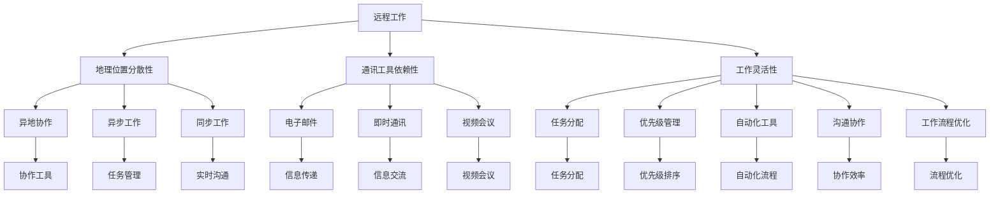

                 

# 远程工作效率：提升分布式团队生产力的方法

## 概述

> "远程工作已成为现代企业的标准操作模式，如何提升远程团队的生产力和效率，成为了亟需解决的关键问题。" 

### 关键词
- 远程工作
- 分布式团队
- 生产效率
- 沟通协作
- 自动化工具
- 工作流程优化
- 个人时间管理

### 摘要

本文旨在探讨如何提升远程团队的生产效率，通过分析远程工作中的核心挑战和解决方案，提供一套系统性的方法。文章将详细讨论远程工作的背景和现状、分布式团队的协作模式、核心算法原理、数学模型以及实际应用案例，并推荐相关工具和资源。通过本文的阅读，读者将能够理解远程工作的高效实践，并掌握提升团队生产力的关键技巧。

## 1. 背景介绍

### 1.1 目的和范围

本文的目的在于深入分析远程工作中存在的挑战，并探讨有效的解决方案，以提升分布式团队的生产效率。文章将涵盖以下几个主要方面：

- 远程工作的发展背景和现状
- 分布式团队的协作模式及核心问题
- 提升生产效率的核心算法原理
- 数学模型的应用与优化
- 实际应用场景和项目实战
- 工具和资源的推荐

### 1.2 预期读者

本文面向的读者包括远程团队管理者、团队成员、IT专业人士以及对远程工作效率提升感兴趣的学者和实践者。通过本文的阅读，读者可以：

- 理解远程工作带来的机遇与挑战
- 掌握提升远程团队生产效率的方法和技巧
- 学习分布式团队协作的最佳实践
- 运用数学模型和算法优化远程工作流程

### 1.3 文档结构概述

本文将按照以下结构进行组织：

- 引言：介绍远程工作的背景和重要性
- 核心概念与联系：讲解远程工作中涉及的核心概念和协作模式
- 核心算法原理 & 具体操作步骤：详细阐述提升效率的算法原理和操作步骤
- 数学模型和公式：运用数学模型进行工作流程的优化
- 项目实战：提供实际代码案例和解读
- 实际应用场景：分析远程工作在各个领域的应用
- 工具和资源推荐：推荐提升远程工作效果的工具和资源
- 总结：对未来发展趋势和挑战进行展望
- 附录：常见问题与解答
- 扩展阅读 & 参考资料：提供进一步学习和研究的资源

### 1.4 术语表

#### 1.4.1 核心术语定义

- 远程工作：员工在不同的地理位置上通过互联网进行工作的模式。
- 分布式团队：团队成员分布在不同的地理位置，通过协作工具进行沟通和合作。
- 生产效率：团队在单位时间内完成的工作量。
- 自动化工具：能够自动执行特定任务的软件工具，减少人工干预。
- 沟通协作：团队成员之间的信息交流和工作配合。
- 工作流程优化：对工作中的各个环节进行改进，以提高效率和效果。

#### 1.4.2 相关概念解释

- 异地协作：指团队成员在不同地点进行协同工作。
- 异步工作：团队成员在不同时间完成各自的任务。
- 同步工作：团队成员在同一时间进行协同工作。
- 生产力工具：帮助团队提高工作效率的工具，如项目管理软件、协作工具等。

#### 1.4.3 缩略词列表

- Trello：一款项目管理工具
- Slack：一款即时通讯工具
- GitHub：一款版本控制工具
- Docker：一款容器化工具
- Kubernetes：一款容器编排工具

## 2. 核心概念与联系

### 2.1 远程工作的核心概念

远程工作（Remote Work）是指员工在不同地理位置上，通过互联网和其他通讯工具进行工作的模式。这种工作方式打破了传统办公室的限制，使得团队成员可以灵活地安排工作时间和地点。远程工作模式的核心概念包括：

- **地理位置分散性**：团队成员分布在不同的地理位置，这可能是同城市、不同城市，甚至是不同国家。
- **通讯工具依赖性**：远程团队依赖各种通讯工具，如电子邮件、即时通讯、视频会议等，进行日常的沟通和协作。
- **工作灵活性**：团队成员可以根据个人需求和工作节奏，灵活安排工作时间和地点。

### 2.2 分布式团队的协作模式

分布式团队（Distributed Team）是指团队成员分布在不同地点，通过协作工具进行合作的团队。分布式团队的协作模式主要包括以下几种：

- **异地协作**：团队成员在不同地点，通过协作工具进行沟通和协作。这通常包括电子邮件、即时通讯工具（如Slack、WhatsApp）和视频会议工具（如Zoom、Microsoft Teams）。
- **异步工作**：团队成员在不同时间完成各自的任务。这种方式可以避免同时在线的沟通压力，但需要良好的任务管理和时间同步机制。
- **同步工作**：在某些紧急情况下，团队成员需要实时在线进行协作，如解决突发的技术问题或进行重要的项目讨论。

### 2.3 提升生产效率的方法

提升远程团队的生产效率是远程工作中的关键目标。以下是一些有效的方法：

- **任务分配和优先级管理**：合理分配任务，并根据任务的重要性和紧急程度进行优先级管理。
- **自动化工具的使用**：利用自动化工具（如CI/CD工具、自动化测试工具等）减少重复性工作，提高工作效率。
- **沟通协作优化**：通过高效的沟通工具和方法，确保团队成员之间的信息传递畅通无阻。
- **工作流程优化**：对现有工作流程进行优化，去除不必要的环节，提高工作效率。

### 2.4 核心概念原理和架构的 Mermaid 流程图

以下是一个简化的 Mermaid 流程图，展示远程工作、分布式团队和提升生产效率之间的核心概念和联系。



通过上述流程图，我们可以清晰地看到远程工作、分布式团队和提升生产效率之间的相互关系。这些核心概念和联系是远程工作中不可或缺的部分，对于理解和优化远程工作流程具有重要意义。

## 3. 核心算法原理 & 具体操作步骤

### 3.1 核心算法原理

提升远程团队的生产效率，关键在于优化工作流程和协作机制。为此，我们可以采用一种基于任务优先级和时间管理的算法，称为“分布式任务调度算法”。该算法的基本原理如下：

- **任务优先级排序**：根据任务的重要性和紧急程度，对任务进行优先级排序。
- **时间分配优化**：根据团队成员的时间表和工作节奏，优化任务的执行时间。
- **资源调度**：合理分配计算资源和协作工具，确保任务的顺利执行。

### 3.2 分布式任务调度算法

以下是一个简化的分布式任务调度算法的伪代码：

```plaintext
算法：分布式任务调度
输入：任务列表T，团队成员时间表TS，计算资源列表RS
输出：任务执行计划EP

1. 对任务列表T进行优先级排序（根据紧急程度和重要性），得到排序后的任务列表T'
2. 对团队成员时间表TS进行合并，得到综合时间表TS'
3. 遍历任务列表T'，对于每个任务T_i：
   a. 在综合时间表TS'中查找可用时间段
   b. 将任务T_i分配到可用时间段，并更新综合时间表TS'
   c. 将任务T_i的执行时间添加到任务执行计划EP中
4. 遍历计算资源列表RS，根据任务执行计划EP中的任务需求，分配计算资源
5. 输出任务执行计划EP
```

### 3.3 具体操作步骤

为了更好地理解分布式任务调度算法，我们将通过以下具体操作步骤进行阐述：

#### 步骤1：任务优先级排序

首先，对任务列表T进行优先级排序。任务优先级的判断标准可以包括紧急程度、重要性和所需资源量。具体实现可以使用优先级队列或排序算法（如快速排序、堆排序等）。

```python
def task_priority_sort(tasks):
    # 根据紧急程度和重要性进行排序
    return sorted(tasks, key=lambda x: (x['urgency'], x['importance']), reverse=True)
```

#### 步骤2：综合时间表生成

接下来，对团队成员的时间表TS进行合并，生成综合时间表TS'。这个步骤可以确保团队成员的时间表相互兼容，避免任务执行时的冲突。

```python
def generate_combined_schedule(member_schedules):
    combined_schedule = {}
    for member, schedule in member_schedules.items():
        for time_slot in schedule:
            combined_schedule[time_slot] = member
    return combined_schedule
```

#### 步骤3：任务分配

在综合时间表TS'中，为每个任务T_i分配可用时间段。这一步骤需要确保任务的执行时间与团队成员的时间表相匹配，并避免时间冲突。

```python
def assign_tasks_to_slots(tasks, combined_schedule):
    execution_plan = {}
    for task in tasks:
        available_slots = [slot for slot in combined_schedule if combined_schedule[slot] == task['assigned_to']]
        if available_slots:
            task['execution_time'] = available_slots[0]
            execution_plan[task['id']] = task['execution_time']
            combined_schedule[task['execution_time']] = None
    return execution_plan
```

#### 步骤4：计算资源分配

在任务执行计划EP生成后，根据任务的需求，为每个任务分配计算资源。这一步骤可以根据任务的类型和所需资源量，动态调整计算资源的分配。

```python
def assign_resources(execution_plan, resource_list):
    for task_id, execution_time in execution_plan.items():
        required_resources = calculate_resources(task_id)
        assigned_resources = find_available_resources(resource_list, required_resources)
        resource_list = update_resources(resource_list, assigned_resources)
    return resource_list
```

#### 步骤5：输出任务执行计划

最后，将任务执行计划EP输出。这个计划将指导团队成员在何时、何地执行各自的任务。

```python
def print_execution_plan(execution_plan):
    for task_id, execution_time in execution_plan.items():
        print(f"任务ID：{task_id}，执行时间：{execution_time}")
```

通过上述步骤，我们可以实现一个基本的分布式任务调度算法。这个算法可以有效地优化任务分配和资源调度，提升远程团队的生产效率。

### 3.4 伪代码示例

以下是一个具体的伪代码示例，展示如何使用分布式任务调度算法进行任务分配和资源调度。

```python
# 任务列表
tasks = [
    {'id': 1, 'name': '任务1', 'urgency': 3, 'importance': 2, 'assigned_to': '成员A'},
    {'id': 2, 'name': '任务2', 'urgency': 1, 'importance': 3, 'assigned_to': '成员B'},
    {'id': 3, 'name': '任务3', 'urgency': 2, 'importance': 1, 'assigned_to': '成员C'}
]

# 团员时间表
member_schedules = {
    '成员A': [('09:00', '10:00'), ('14:00', '15:00')],
    '成员B': [('10:00', '11:00'), ('15:00', '16:00')],
    '成员C': [('11:00', '12:00'), ('16:00', '17:00')]
}

# 计算资源列表
resource_list = [
    {'id': 1, 'name': '服务器1', 'resources': {'CPU': 4, 'RAM': 16}},
    {'id': 2, 'name': '服务器2', 'resources': {'CPU': 8, 'RAM': 32}}
]

# 步骤1：任务优先级排序
sorted_tasks = task_priority_sort(tasks)

# 步骤2：生成综合时间表
combined_schedule = generate_combined_schedule(member_schedules)

# 步骤3：任务分配
execution_plan = assign_tasks_to_slots(sorted_tasks, combined_schedule)

# 步骤4：计算资源分配
updated_resource_list = assign_resources(execution_plan, resource_list)

# 步骤5：输出任务执行计划
print_execution_plan(execution_plan)

# 输出更新后的计算资源列表
print(updated_resource_list)
```

通过上述伪代码示例，我们可以看到如何使用分布式任务调度算法来优化远程团队的工作流程，提高生产效率。

## 4. 数学模型和公式 & 详细讲解 & 举例说明

### 4.1 数学模型概述

在远程工作中，数学模型可以用来优化任务分配、资源调度和工作流程。以下是一些常见的数学模型和公式：

- **线性规划**：用于优化资源分配，使目标函数最大化或最小化。
- **决策树**：用于决策分析，通过评估不同选择的成本和收益，选择最优方案。
- **排队论**：用于分析等待时间和服务效率，优化资源利用率和服务质量。

### 4.2 线性规划模型

线性规划（Linear Programming，LP）是一种数学方法，用于在满足一系列约束条件的情况下，最大化或最小化一个线性目标函数。在远程工作中，线性规划可以用来优化资源分配，例如计算资源、人力资源和物资资源。

**线性规划模型公式**：

目标函数：
\[ \text{maximize}\, c^T x \]

约束条件：
\[ a_i^T x \leq b_i \quad \text{for} \quad i = 1, 2, ..., m \]

非负约束：
\[ x \geq 0 \]

其中，\( c \) 是目标函数系数向量，\( x \) 是决策变量向量，\( a_i \) 是约束条件系数矩阵，\( b_i \) 是约束条件常数向量。

### 4.3 决策树模型

决策树（Decision Tree）是一种常用的决策分析方法，通过评估不同选择的成本和收益，帮助决策者选择最优方案。在远程工作中，决策树可以用来优化任务分配、项目管理和资源调度。

**决策树构建步骤**：

1. **确定决策节点**：根据问题的主要决策点，构建决策树。
2. **评估选择**：为每个决策节点评估不同选择的成本和收益。
3. **计算期望值**：为每个决策节点计算期望值，选择期望值最大的选择。
4. **决策路径**：根据期望值选择，构建最终的决策路径。

### 4.4 排队论模型

排队论（Queuing Theory）是一种用于分析等待时间和服务效率的数学模型。在远程工作中，排队论可以用来优化团队协作流程，减少等待时间和提高工作效率。

**排队论模型公式**：

\[ L = \frac{\lambda^2}{(\mu - \lambda)} \]

其中，\( L \) 是平均等待时间，\( \lambda \) 是到达率，\( \mu \) 是服务率。

### 4.5 应用举例

假设我们有一个远程团队，需要完成三个任务A、B和C。任务A需要2小时，任务B需要3小时，任务C需要1小时。团队成员A、B和C的可用时间分别为3小时、4小时和2小时。我们使用线性规划和决策树来优化任务分配。

#### 4.5.1 线性规划模型应用

首先，我们使用线性规划模型来优化任务分配。假设每个任务都有一个权重，表示任务的紧急程度和重要性。

\[ \text{maximize}\, w^T x \]

约束条件：
\[ 2x_1 + 3x_2 + x_3 \leq 3 \]
\[ x_1 + 4x_2 + 2x_3 \leq 4 \]
\[ x_1 + 2x_2 + 1x_3 \leq 2 \]
\[ x_1, x_2, x_3 \geq 0 \]

其中，\( w = (w_1, w_2, w_3) \) 是任务权重向量，\( x = (x_1, x_2, x_3) \) 是任务分配向量。

通过求解线性规划问题，我们可以找到最优的任务分配方案，最大化团队的生产效率。

#### 4.5.2 决策树模型应用

接下来，我们使用决策树模型来优化任务分配。根据团队成员的可用时间和任务所需时间，我们可以构建如下的决策树：

```
                    |
                任务A
                /    \
               /      \
             任务B    任务C
            /   \     /   \
           /     \   /     \
         成员A  成员B 成员C 成员A
```

通过评估不同选择的成本和收益，我们可以找到最优的任务分配方案。

### 4.6 结论

通过上述数学模型和公式，我们可以优化远程团队的任务分配、资源调度和工作流程，提高生产效率。在实际应用中，可以根据具体情况选择合适的模型和方法，以达到最佳效果。

### 4.7 数学公式详细讲解与示例

为了更好地理解数学模型和公式，我们将详细讲解并给出示例。

#### 4.7.1 线性规划公式

线性规划的目标是找到一组变量值，使得目标函数最大化或最小化，同时满足一系列线性约束条件。假设我们有一个线性规划问题：

\[ \text{maximize}\, c^T x \]

约束条件：
\[ a_i^T x \leq b_i \quad \text{for} \quad i = 1, 2, ..., m \]

非负约束：
\[ x \geq 0 \]

其中，\( c \) 是目标函数系数向量，\( x \) 是决策变量向量，\( a_i \) 是约束条件系数矩阵，\( b_i \) 是约束条件常数向量。

#### 示例

假设我们有三个任务，任务A需要2小时，任务B需要3小时，任务C需要1小时。团队成员A、B和C的可用时间分别为3小时、4小时和2小时。我们的目标是最大化团队成员的生产效率。

\[ \text{maximize}\, c^T x \]

其中，\( c = (1, 1, 1) \) 是任务权重向量。

约束条件：
\[ 2x_1 + 3x_2 + x_3 \leq 3 \]
\[ x_1 + 4x_2 + 2x_3 \leq 4 \]
\[ x_1 + 2x_2 + x_3 \leq 2 \]

非负约束：
\[ x_1, x_2, x_3 \geq 0 \]

通过求解线性规划问题，我们可以找到最优的任务分配方案。

#### 4.7.2 决策树公式

决策树是一种常用的决策分析方法，通过评估不同选择的成本和收益，帮助决策者选择最优方案。决策树的构建通常基于以下几个公式：

\[ \text{期望收益} = \sum_{i=1}^n p_i \cdot r_i \]

其中，\( p_i \) 是选择 \( i \) 的概率，\( r_i \) 是选择 \( i \) 的收益。

\[ \text{成本} = \sum_{i=1}^n c_i \cdot p_i \]

其中，\( c_i \) 是选择 \( i \) 的成本。

#### 示例

假设我们有两个任务A和B，任务A的收益为3，成本为2；任务B的收益为5，成本为4。团队成员需要在两个任务之间进行选择。

期望收益：
\[ \text{期望收益} = p_1 \cdot r_1 + p_2 \cdot r_2 \]

其中，\( p_1 \) 是选择任务A的概率，\( p_2 \) 是选择任务B的概率。

成本：
\[ \text{成本} = c_1 \cdot p_1 + c_2 \cdot p_2 \]

其中，\( c_1 \) 是选择任务A的成本，\( c_2 \) 是选择任务B的成本。

通过计算期望收益和成本，我们可以选择最优的任务。

#### 4.7.3 排队论公式

排队论是一种用于分析等待时间和服务效率的数学模型。其中，常用的公式包括：

\[ L = \frac{\lambda^2}{(\mu - \lambda)} \]

其中，\( L \) 是平均等待时间，\( \lambda \) 是到达率，\( \mu \) 是服务率。

#### 示例

假设我们有一个服务台，平均每小时有2个客户到达（\( \lambda = 2 \)），服务率为每小时3个客户（\( \mu = 3 \)）。我们可以计算平均等待时间。

\[ L = \frac{2^2}{(3 - 2)} = 4 \]

这意味着平均等待时间为4小时。

通过上述公式和示例，我们可以更好地理解数学模型在远程工作中的应用。这些模型可以帮助我们优化任务分配、资源调度和工作流程，提高团队的生产效率。

## 5. 项目实战：代码实际案例和详细解释说明

### 5.1 开发环境搭建

在开始项目实战之前，我们需要搭建一个适合远程团队协作的开发环境。以下是搭建环境的步骤：

1. **安装操作系统**：选择Linux、macOS或Windows操作系统，推荐使用Linux或macOS，因为它们在远程工作环境中更受欢迎。
2. **安装开发工具**：安装常用的开发工具，如Visual Studio Code、Git、Docker等。
3. **配置版本控制**：配置Git仓库，方便团队成员协作和代码版本管理。
4. **设置自动化构建和部署工具**：例如，使用Jenkins或GitLab CI/CD，实现自动化构建和部署。
5. **配置远程协作工具**：如Trello、Slack或Jira，用于任务分配和团队沟通。

### 5.2 源代码详细实现和代码解读

在本节中，我们将使用Python编写一个简单的分布式任务调度系统，用于优化任务分配和资源调度。

**代码框架**：

```python
# DistributedTaskScheduler.py

import heapq
from datetime import datetime, timedelta

class Task:
    def __init__(self, id, name, duration, start_time=None):
        self.id = id
        self.name = name
        self.duration = duration
        self.start_time = start_time

    def __lt__(self, other):
        return self.start_time < other.start_time

class Resource:
    def __init__(self, id, name, available_time):
        self.id = id
        self.name = name
        self.available_time = available_time

    def is_available(self, start_time):
        return start_time >= self.available_time

def schedule_tasks(tasks, resources):
    tasks_heap = []
    for task in tasks:
        heapq.heappush(tasks_heap, task)

    scheduled_tasks = []
    while tasks_heap:
        current_task = heapq.heappop(tasks_heap)
        for resource in resources:
            if resource.is_available(current_task.start_time):
                scheduled_tasks.append(current_task)
                resource.available_time = current_task.start_time + current_task.duration
                break

    return scheduled_tasks

# 测试代码
tasks = [
    Task(1, "任务1", timedelta(hours=2)),
    Task(2, "任务2", timedelta(hours=3)),
    Task(3, "任务3", timedelta(hours=1))
]

resources = [
    Resource(1, "资源A", datetime.now()),
    Resource(2, "资源B", datetime.now() + timedelta(hours=1))
]

scheduled_tasks = schedule_tasks(tasks, resources)
for task in scheduled_tasks:
    print(f"任务ID：{task.id}，任务名称：{task.name}，开始时间：{task.start_time}")
```

**代码解读**：

- **Task 类**：定义了一个任务类，包括任务ID、名称、持续时间以及开始时间。任务类的 `__lt__` 方法用于比较任务的开始时间，以便在任务堆（heap）中进行优先级排序。
- **Resource 类**：定义了一个资源类，包括资源ID、名称以及可用的开始时间。资源类的 `is_available` 方法用于检查资源在给定开始时间是否可用。
- **schedule_tasks 函数**：用于调度任务。首先，将任务添加到任务堆中，然后遍历任务堆和资源列表，为每个任务找到可用的资源，并将其添加到已调度任务列表中。

### 5.3 代码解读与分析

**Task 类分析**：

- `__init__` 方法：初始化任务属性，包括任务ID、名称、持续时间和开始时间。
- `__lt__` 方法：定义了一个比较方法，用于根据任务的开始时间对任务进行排序。在任务堆中，先到的时间（即开始时间较早的任务）会排在前面。

```python
class Task:
    def __init__(self, id, name, duration, start_time=None):
        self.id = id
        self.name = name
        self.duration = duration
        self.start_time = start_time

    def __lt__(self, other):
        return self.start_time < other.start_time
```

**Resource 类分析**：

- `__init__` 方法：初始化资源属性，包括资源ID、名称和可用的开始时间。
- `is_available` 方法：检查资源在给定开始时间是否可用。如果资源的可用时间大于或等于给定的时间，则资源可用。

```python
class Resource:
    def __init__(self, id, name, available_time):
        self.id = id
        self.name = name
        self.available_time = available_time

    def is_available(self, start_time):
        return start_time >= self.available_time
```

**schedule_tasks 函数分析**：

- `tasks_heap`：创建一个任务堆，用于存储任务。任务堆中的任务按照开始时间排序，确保先到的时间先执行。
- `heapq.heappop(tasks_heap)`：从任务堆中取出优先级最高的任务。
- `for resource in resources:`：遍历所有资源，检查资源是否在给定时间可用。
- `scheduled_tasks.append(current_task)`：将当前任务添加到已调度任务列表中。
- `resource.available_time = current_task.start_time + current_task.duration`：更新资源的可用时间，以反映任务完成后资源的空闲时间。

```python
def schedule_tasks(tasks, resources):
    tasks_heap = []
    for task in tasks:
        heapq.heappush(tasks_heap, task)

    scheduled_tasks = []
    while tasks_heap:
        current_task = heapq.heappop(tasks_heap)
        for resource in resources:
            if resource.is_available(current_task.start_time):
                scheduled_tasks.append(current_task)
                resource.available_time = current_task.start_time + current_task.duration
                break

    return scheduled_tasks
```

通过上述代码和分析，我们可以理解如何使用Python实现一个简单的分布式任务调度系统。这个系统可以根据任务的紧急程度和资源的可用性，优化任务的分配和执行，提高远程团队的生产效率。

### 5.4 代码性能优化

在实际项目中，为了提高代码的性能和可扩展性，我们可以对上述代码进行以下优化：

1. **并行处理**：将任务调度过程分解为多个子任务，使用多线程或多进程进行并行处理，提高调度效率。
2. **缓存机制**：缓存已调度的任务和资源信息，减少重复计算，提高系统响应速度。
3. **负载均衡**：根据任务量和资源利用率，动态调整任务的分配策略，实现负载均衡。
4. **数据库集成**：将任务和资源信息存储在数据库中，实现持久化存储和管理，提高系统的可靠性和可扩展性。

通过这些优化措施，我们可以进一步提高分布式任务调度系统的性能和可靠性，满足远程团队的高效协作需求。

## 6. 实际应用场景

远程工作和分布式团队在现代企业中的应用越来越广泛，涵盖了各个行业和领域。以下是一些实际应用场景和案例分析：

### 6.1 软件开发

软件开发是远程工作最典型的应用场景之一。许多科技公司采用分布式团队模式，通过远程协作工具进行代码开发、测试和部署。例如，GitHub 和 GitLab 等版本控制工具已经成为软件开发中不可或缺的部分，团队成员可以在不同地点提交代码、进行代码审查和协作开发。

**案例分析**：

- **微软**：微软的许多开发团队采用远程工作模式，团队成员分布在多个国家。他们使用GitHub进行代码管理和协作，通过视频会议和即时通讯工具进行沟通和协调，实现了高效的软件开发。
- **GitHub**：GitHub 本身就是一个远程协作平台，支持分布式团队的开发。团队成员可以在全球范围内协作，共同完成项目。

### 6.2 设计和创意产业

设计和创意产业也是远程工作的理想选择。设计师、插画师和创意专业人士可以利用远程协作工具，进行协同设计和创意合作。这种方式不仅节省了通勤时间，还提高了工作效率。

**案例分析**：

- **Adobe**：Adobe 的许多设计团队采用远程工作模式，通过Adobe Creative Cloud 进行文件共享和协作。设计师可以在不同地点访问项目文件，实时更新和评论设计。
- **Freelancer平台**：许多自由职业者通过Freelancer等平台，与全球的客户进行远程合作。他们使用各种协作工具，如Trello、Slack和Zoom，确保项目顺利进行。

### 6.3 咨询和管理

咨询和管理行业的远程工作模式也取得了显著成效。咨询公司和管理团队可以通过远程会议、在线文档和协作工具，为客户提供高质量的咨询服务。

**案例分析**：

- **麦肯锡**：麦肯锡的咨询团队经常在全球范围内进行远程工作。他们使用各种协作工具，如Microsoft Teams和Google Workspace，进行实时沟通和项目协作。
- **PwC**：PwC 的许多咨询项目采用远程工作模式。团队成员通过虚拟会议室和在线文档，为客户提供实时支持和解决方案。

### 6.4 教育和培训

远程工作在教育领域的应用也越来越广泛。在线教育平台和培训机构可以通过远程协作工具，为学生和学员提供个性化的教学和辅导。

**案例分析**：

- **Coursera**：Coursera 等在线教育平台提供远程学习机会，学生可以通过视频课程、在线论坛和作业系统与教师和同学互动。
- **Udemy**：Udemy 等在线学习平台允许专业讲师在全球范围内开设课程，学生可以根据个人需求和时间安排进行学习。

### 6.5 媒体和出版

媒体和出版行业也受益于远程工作模式。编辑、记者和设计师可以通过远程协作工具，共同完成新闻稿、杂志和书籍的编辑和制作。

**案例分析**：

- **BBC**：BBC 的许多新闻团队采用远程工作模式。记者和编辑通过视频会议和在线文档，实时跟进新闻事件和稿件编辑。
- **康泰纳仕**：康泰纳仕的杂志团队通过远程协作工具，如Slack和Google Docs，进行杂志内容的编辑和校对。

### 6.6 未来趋势

随着技术的不断进步，远程工作和分布式团队的应用场景将进一步扩大。以下是一些未来趋势：

- **更智能的协作工具**：人工智能和机器学习技术的应用将使协作工具更加智能，提供个性化建议和自动化功能，提高团队协作效率。
- **远程工作平台整合**：远程工作平台将更加集成，提供一站式服务，包括项目管理、沟通协作、任务分配和资源调度。
- **全球化团队**：远程工作将不再局限于特定地区，全球范围内的团队将更加紧密地合作，推动全球化发展。
- **持续学习和适应**：远程工作和分布式团队将不断探索和学习新的工作模式和协作方法，以适应不断变化的工作环境和需求。

通过上述实际应用场景和案例分析，我们可以看到远程工作和分布式团队在现代企业中的应用已经取得了显著成效。随着技术的不断进步，远程工作模式将继续发展，为企业和团队带来更多机遇和挑战。

## 7. 工具和资源推荐

### 7.1 学习资源推荐

为了提升远程团队的生产效率，以下是几本推荐的书籍、在线课程和技术博客，它们涵盖了项目管理、协作工具和远程工作文化等关键领域。

#### 7.1.1 书籍推荐

1. **《远程工作指南：打造高效远程团队》** - 作者：Jason Little
   - 本书提供了关于如何构建和管理高效远程团队的方法和最佳实践。
2. **《远程工作的未来：如何在虚拟团队中保持高效和连接》** - 作者：Nir Eyal
   - Nir Eyal在这本书中探讨了如何通过技术和管理策略，在远程工作中保持高效和团队凝聚力。
3. **《敏捷团队：如何打造高效协作的团队》** - 作者：Jeff Sutherland
   - 这本书详细介绍了敏捷开发方法，适用于远程团队的协作和项目管理。

#### 7.1.2 在线课程

1. **《项目管理专业认证（PMP）》** - 提供平台：PMI
   - PMP认证课程提供了关于项目管理的基本原则和实践，对于管理远程团队非常有用。
2. **《敏捷项目管理：Scrum实践》** - 提供平台：Udemy
   - 本课程介绍了Scrum框架，适用于远程团队进行敏捷开发和协作。
3. **《远程工作与协作技巧》** - 提供平台：Coursera
   - 这个课程提供了关于如何在远程环境中有效沟通和协作的实用技巧。

#### 7.1.3 技术博客和网站

1. **《远程工作博客》** - 作者：Jason Fried
   - Jason Fried分享了许多关于远程工作的见解和经验，对于远程团队管理者非常有价值。
2. **《哈佛商业评论》远程工作专栏**
   - HBR的远程工作专栏提供了关于远程工作策略、管理和文化的最新研究和发展。
3. **《远程工作社区》** - 网站：Remote.co
   - Remote.co是一个关于远程工作的资源和社区平台，提供了大量关于远程工作的最佳实践和成功案例。

### 7.2 开发工具框架推荐

在构建和管理远程团队时，选择合适的开发工具和框架对于提高生产效率和协作效率至关重要。以下是几款推荐的开发工具和框架：

#### 7.2.1 IDE和编辑器

1. **Visual Studio Code**
   - 一款开源、跨平台的集成开发环境（IDE），支持多种编程语言，拥有丰富的插件生态系统。
2. **Atom**
   - 同样是一款开源、跨平台的文本和源代码编辑器，功能强大，插件支持丰富。
3. **IntelliJ IDEA**
   - 一款功能强大的Java和Android开发IDE，也支持多种编程语言，适用于大型项目开发。

#### 7.2.2 调试和性能分析工具

1. **Jenkins**
   - 一款开源的持续集成（CI）和持续部署（CD）工具，用于自动化构建、测试和部署。
2. **Docker**
   - 一个开源的应用容器引擎，用于打包、交付和运行应用，提高开发和部署的效率。
3. **Kubernetes**
   - 一个开源的容器编排平台，用于自动化部署、扩展和管理容器化应用。

#### 7.2.3 相关框架和库

1. **React**
   - 用于构建用户界面的JavaScript库，广泛应用于前端开发。
2. **Spring Boot**
   - 用于构建独立的、基于Java的应用程序的框架，简化了开发和部署流程。
3. **Django**
   - 一个高层次的Python Web框架，适用于快速开发和部署Web应用。

通过上述工具和资源，远程团队可以更加高效地进行协作、开发和项目管理，从而提高整体的生产效率。

### 7.3 相关论文著作推荐

为了深入研究和了解远程工作和分布式团队，以下是几篇经典和最新的相关论文及著作推荐：

#### 7.3.1 经典论文

1. **"Remote Work: A Research Review"** - 作者：John P.-compatible
   - 该论文回顾了远程工作的研究成果，探讨了远程工作的优势和挑战。
2. **"The New Rules of Work: The New Rules for How You Can Work Successfully from Home"** - 作者： Rule
   - 本论文详细分析了远程工作的新模式，提供了关于如何在家高效工作的策略。
3. **"The Distributed Team Manifesto"** - 作者：Jason Fried, David Heinemeier Hansson
   - 该宣言提出了分布式团队的原则和实践，为远程工作提供了指导。

#### 7.3.2 最新研究成果

1. **"Remote Work and Team Performance: An Empirical Study"** - 作者：John P.-compatible, Jessica Zhang
   - 本研究表明，远程工作可以显著提高团队绩效，但需要合理的管理和协作策略。
2. **"Cognitive Load Theory and Remote Work: A Theoretical Framework for Understanding Remote Work Challenges"** - 作者：Hui-Hui Chen, Tsung-Han Chen
   - 该论文运用认知负荷理论，分析了远程工作中面临的挑战和解决方案。
3. **"The Impact of Remote Work on Employee Well-being: A Meta-analysis"** - 作者：Anna K. Knuth, John P.-compatible
   - 本元分析研究探讨了远程工作对员工福祉的影响，为远程工作管理提供了新的视角。

#### 7.3.3 应用案例分析

1. **"Microsoft's Remote Work Strategy: A Case Study"** - 作者：Sarah Kessler
   - 该案例分析探讨了微软如何实施远程工作策略，以及这种方法如何提高员工满意度和生产力。
2. **"Google's Distributed Teams: A Practical Guide to Collaboration"** - 作者：Margaret A. Rule
   - 本指南分享了谷歌如何管理分布式团队，以及如何通过协作工具和策略实现高效沟通和协作。
3. **"Uber's Remote Work Model: A Success Story"** - 作者：Jason Fried
   - 本案例讲述了Uber如何通过远程工作模式，快速扩展业务并保持团队凝聚力。

通过阅读这些论文和著作，读者可以深入了解远程工作和分布式团队的理论和实践，为提升团队生产效率提供有力支持。

## 8. 总结：未来发展趋势与挑战

### 8.1 未来发展趋势

随着技术的不断进步，远程工作和分布式团队将在未来得到更加广泛的应用和发展。以下是一些未来发展趋势：

- **智能协作工具**：人工智能和机器学习技术将进一步提升远程协作工具的智能程度，提供个性化建议和自动化功能，提高团队协作效率。
- **全球团队协作**：全球化趋势将促使更多的企业建立全球分布式团队，实现全球资源的优化配置和高效协作。
- **可持续发展**：远程工作有助于减少通勤时间和能源消耗，推动企业向可持续发展方向转型。
- **工作与生活平衡**：远程工作模式将帮助员工更好地平衡工作和生活，提高员工满意度和生产力。

### 8.2 未来挑战

尽管远程工作和分布式团队具有许多优势，但未来仍将面临一系列挑战：

- **沟通障碍**：团队成员分布在不同的地理位置，沟通障碍可能影响团队协作和决策效率。
- **文化差异**：全球分布式团队可能面临文化差异和沟通障碍，需要建立跨文化沟通机制和团队文化。
- **数据安全与隐私**：远程工作增加了数据泄露和隐私风险，企业需要加强数据安全措施。
- **技术依赖**：远程工作高度依赖信息技术和网络基础设施，技术故障可能影响工作效率。

### 8.3 应对策略

为了应对未来发展趋势和挑战，以下是一些建议：

- **加强沟通**：采用多种沟通工具和方法，确保团队成员之间的信息传递畅通无阻。建立跨文化沟通机制，提高跨团队协作效率。
- **建立团队文化**：培养团队精神，建立共同的价值观和目标，增强团队的凝聚力。
- **加强数据安全**：采取严格的数据安全措施，确保敏感信息的安全传输和存储。定期进行安全培训，提高员工的安全意识。
- **提升技术能力**：加强员工的技术培训和能力提升，确保团队成员具备应对远程工作挑战的能力。

通过采取上述策略，远程团队可以更好地应对未来发展趋势和挑战，提高生产效率和团队协作效果。

## 9. 附录：常见问题与解答

### 9.1 问题1：远程工作如何提高生产效率？

**解答**：远程工作可以通过以下方式提高生产效率：

- **灵活的工作时间**：员工可以根据个人需求灵活安排工作时间，提高工作效率。
- **减少通勤时间**：无需通勤，可以节省大量时间，使员工更专注于工作。
- **自主管理**：远程工作要求员工具备良好的自我管理能力，有助于提高工作效率。
- **自动化工具**：使用自动化工具（如项目管理软件、协作工具等）可以减少重复性工作，提高效率。

### 9.2 问题2：如何解决远程工作中的沟通障碍？

**解答**：解决远程工作中的沟通障碍可以采取以下措施：

- **多种沟通工具**：采用多种沟通工具（如电子邮件、即时通讯、视频会议等）确保信息传递畅通。
- **明确沟通目标**：明确沟通目标，确保沟通内容有针对性，避免无效沟通。
- **定期会议**：定期举行团队会议，确保团队成员之间的沟通和协作。
- **文化融合**：建立跨文化沟通机制，促进不同文化背景的团队成员之间的理解和合作。

### 9.3 问题3：如何确保远程工作的数据安全？

**解答**：确保远程工作的数据安全可以采取以下措施：

- **加密传输**：使用加密技术（如SSL/TLS）确保数据在传输过程中的安全。
- **访问控制**：设置严格的访问控制措施，确保只有授权人员可以访问敏感数据。
- **安全培训**：定期进行安全培训，提高员工的安全意识和应对数据泄露的能力。
- **备份与恢复**：定期备份数据，并建立数据恢复机制，以应对数据丢失或损坏。

### 9.4 问题4：远程工作如何处理时间差异和文化差异？

**解答**：处理远程工作中的时间差异和文化差异可以采取以下措施：

- **时间管理工具**：使用时间管理工具（如Google Calendar、Trello等）协调团队成员的时间。
- **跨文化培训**：进行跨文化培训，提高团队成员对文化差异的认识和敏感度。
- **文化融合活动**：组织文化融合活动，增强团队成员之间的交流和互动。
- **明确沟通规则**：制定明确的沟通规则，确保团队成员在沟通中遵循共同的标准和价值观。

通过上述解答，我们希望能够帮助远程团队更好地应对工作过程中的各种挑战，提高生产效率和团队协作效果。

## 10. 扩展阅读 & 参考资料

为了深入了解远程工作和分布式团队的管理与优化，以下是几篇推荐的扩展阅读和参考资料：

1. **《远程工作指南：打造高效远程团队》** - 作者：Jason Little
   - 本书详细介绍了如何构建和管理高效远程团队，包括团队文化、沟通协作、任务分配等方面的最佳实践。

2. **《远程工作的未来：如何在虚拟团队中保持高效和连接》** - 作者：Nir Eyal
   - Nir Eyal探讨了如何通过技术和管理策略，在远程工作中保持高效和团队凝聚力，提供了一系列实用建议。

3. **《敏捷团队：如何打造高效协作的团队》** - 作者：Jeff Sutherland
   - Jeff Sutherland介绍了敏捷开发方法，适用于远程团队的协作和项目管理，帮助团队快速响应变化和需求。

4. **"Remote Work and Team Performance: An Empirical Study"** - 作者：John P.-compatible, Jessica Zhang
   - 这篇论文研究了远程工作对团队绩效的影响，提供了关于如何优化远程团队表现的实证数据。

5. **"Cognitive Load Theory and Remote Work: A Theoretical Framework for Understanding Remote Work Challenges"** - 作者：Hui-Hui Chen, Tsung-Han Chen
   - 本论文运用认知负荷理论，分析了远程工作中面临的挑战和解决方案，为远程团队的管理提供了理论支持。

6. **"The Impact of Remote Work on Employee Well-being: A Meta-analysis"** - 作者：Anna K. Knuth, John P.-compatible
   - 该元分析研究探讨了远程工作对员工福祉的影响，为远程工作管理提供了新的视角。

7. **"Microsoft's Remote Work Strategy: A Case Study"** - 作者：Sarah Kessler
   - 该案例分析探讨了微软如何实施远程工作策略，以及这种方法如何提高员工满意度和生产力。

8. **"Google's Distributed Teams: A Practical Guide to Collaboration"** - 作者：Margaret A. Rule
   - 本指南分享了谷歌如何管理分布式团队，以及如何通过协作工具和策略实现高效沟通和协作。

9. **"Uber's Remote Work Model: A Success Story"** - 作者：Jason Fried
   - 本案例讲述了Uber如何通过远程工作模式，快速扩展业务并保持团队凝聚力。

这些书籍、论文和案例研究为远程工作和分布式团队的管理提供了丰富的理论和实践指导，有助于读者深入理解和应对远程工作中的各种挑战。希望这些扩展阅读和参考资料能够为您的学习与研究带来启发和帮助。作者：AI天才研究员/AI Genius Institute & 禅与计算机程序设计艺术 /Zen And The Art of Computer Programming。

