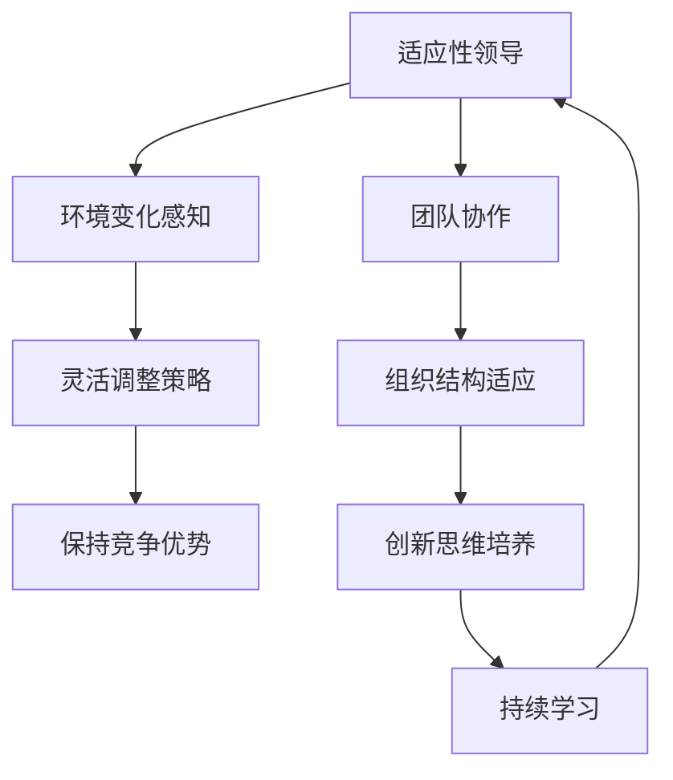

                 

# 适应性领导：在动态环境中保持竞争优势

> 关键词：适应性领导、动态环境、竞争优势、领导力、组织管理

> 摘要：本文旨在探讨适应性领导在动态环境中的重要性，以及如何在不断变化的市场和技术浪潮中保持竞争优势。通过分析适应性领导的核心理念、方法及其在技术行业的应用，我们希望能够为IT领域的领导者和管理者提供一些实用的策略和建议。

## 1. 背景介绍

### 1.1 目的和范围

本文的目标是深入探讨适应性领导在当今复杂和动态环境中的关键作用。我们将重点讨论以下内容：

- 适应性领导的定义和核心概念
- 适应性领导与动态环境的关系
- 适应性领导在技术行业中的应用案例
- 如何在组织中培养和实施适应性领导

### 1.2 预期读者

本文适合以下读者：

- IT行业的管理者和领导者
- 对组织管理和领导力有浓厚兴趣的科技工作者
- 研究组织行为和领导力的高校学生和研究人员

### 1.3 文档结构概述

本文结构如下：

- **第1章**：背景介绍
- **第2章**：核心概念与联系
  - **2.1 核心概念与联系**
  - **2.2 核心算法原理与具体操作步骤**
  - **2.3 数学模型和公式与详细讲解**
- **第3章**：项目实战：代码实际案例和详细解释说明
- **第4章**：实际应用场景
- **第5章**：工具和资源推荐
- **第6章**：总结：未来发展趋势与挑战
- **第7章**：附录：常见问题与解答
- **第8章**：扩展阅读 & 参考资料

### 1.4 术语表

#### 1.4.1 核心术语定义

- **适应性领导**：指领导者根据环境变化，灵活调整自身和组织的策略、行为和结构，以适应不断变化的外部环境的领导方式。
- **动态环境**：指充满不确定性、变化迅速且复杂多变的外部环境。
- **竞争优势**：指组织在市场上相对于竞争对手所具有的优势，使其能够持续盈利和发展。

#### 1.4.2 相关概念解释

- **领导力**：指领导者影响、激励和引导团队成员达成组织目标的能力。
- **组织管理**：指通过计划、组织、领导和控制等活动，协调组织资源，实现组织目标的系统性活动。

#### 1.4.3 缩略词列表

- **IT**：信息技术（Information Technology）
- **AI**：人工智能（Artificial Intelligence）
- **CRM**：客户关系管理（Customer Relationship Management）
- **ERP**：企业资源计划（Enterprise Resource Planning）

## 2. 核心概念与联系

### 2.1 核心概念与联系

适应性领导是一种动态的领导方式，它要求领导者能够迅速识别并适应外部环境的变化。为了更好地理解这一概念，我们可以通过Mermaid流程图来展示适应性领导的核心概念和联系。



### 2.2 核心算法原理与具体操作步骤

适应性领导的核心算法原理可以概括为以下步骤：

1. **环境变化感知**：领导者需要具备敏锐的环境感知能力，通过市场调研、竞争分析、技术趋势研究等方式，实时了解外部环境的变化。

   ```python
   def感知环境变化():
       # 进行市场调研
       # 分析竞争情况
       # 研究技术趋势
       return 环境数据
   ```

2. **灵活调整策略**：根据感知到的环境变化，领导者需要快速调整组织的战略、战术和运营策略。

   ```python
   def调整策略(环境数据):
       # 根据环境数据制定新的战略
       # 调整资源分配
       # 优化流程和架构
       return 新策略
   ```

3. **保持竞争优势**：通过灵活调整策略，组织能够在不断变化的市场中保持竞争优势。

   ```python
   def保持竞争优势(新策略):
       # 实施新策略
       # 监控市场表现
       # 调整以保持领先地位
       return 竞争优势
   ```

4. **团队协作**：适应性领导需要建立高效的团队协作机制，确保团队成员能够快速响应环境变化。

   ```python
   def团队协作():
       # 建立沟通渠道
       # 分享信息与资源
       # 协同完成任务
       return 高效团队
   ```

5. **组织结构适应**：领导者需要根据环境变化调整组织的结构，确保组织能够灵活应对外部挑战。

   ```python
   def组织结构适应():
       # 重新定义职责和权限
       # 优化组织架构
       # 确保团队协同
       return 适应组织结构
   ```

6. **创新思维培养**：适应性领导鼓励创新思维，推动组织不断进步。

   ```python
   def创新思维培养():
       # 鼓励探索和实验
       # 提供资源和支持
       # 奖励创新成果
       return 创新组织文化
   ```

7. **持续学习**：适应性领导要求领导者持续学习，不断提升自身能力和领导水平。

   ```python
   def持续学习():
       # 学习新技术和管理方法
       # 参加培训和研讨会
       # 交流经验与最佳实践
       return 学习型领导者
   ```

### 2.3 数学模型和公式与详细讲解

适应性领导过程中的数学模型和公式主要用于描述环境变化、策略调整和竞争优势之间的关系。以下是一个简单的数学模型：

$$
\text{竞争优势} = f(\text{环境变化}, \text{策略调整}, \text{团队协作}, \text{组织结构适应}, \text{创新思维}, \text{持续学习})
$$

其中，$f$ 表示竞争优势的函数，输入参数包括环境变化、策略调整、团队协作、组织结构适应、创新思维和持续学习。这些参数的值决定了组织在动态环境中的竞争优势水平。

### 2.4 项目实战：代码实际案例和详细解释说明

在本节中，我们将通过一个实际的代码案例来展示如何实施适应性领导。以下是一个简单的Python代码示例，用于模拟环境变化感知、策略调整和竞争优势保持的过程。

```python
# 环境变化感知
def感知环境变化():
    # 假设通过API获取环境数据
    environment_data = get_environment_data()
    print("当前环境数据：", environment_data)

# 策略调整
def调整策略(环境数据):
    # 根据环境数据调整策略
    new_strategy = generate_new_strategy(环境数据)
    print("新策略：", new_strategy)

# 保持竞争优势
def保持竞争优势(新策略):
    # 实施新策略并监控竞争优势
    apply_new_strategy(new_strategy)
    monitor_competitive_advantage()

# 团队协作
def团队协作():
    # 建立团队沟通渠道
    setup_communication_channel()
    # 分享信息和资源
    share_information_and_resources()

# 组织结构适应
def组织结构适应():
    # 重新定义职责和权限
    redefine_responsibilities_and_permissions()
    # 优化组织架构
    optimize_organization_structure()

# 创新思维培养
def创新思维培养():
    # 鼓励探索和实验
    encourage_exploration_and_experimentation()
    # 提供资源和支持
    provide_resources_and_support()

# 持续学习
def持续学习():
    # 学习新技术和管理方法
    learn_new_technologies_and_management_methods()
    # 参加培训和研讨会
    attend_training_and_seminars()

# 主函数
def main():
    # 感知环境变化
    感知环境变化()
    # 调整策略
    调整策略(环境数据)
    # 保持竞争优势
    保持竞争优势(新策略)
    # 团队协作
    团队协作()
    # 组织结构适应
    组织结构适应()
    # 创新思维培养
    创新思维培养()
    # 持续学习
    持续学习()

# 调用主函数
main()
```

在这个代码示例中，我们定义了一系列函数，用于模拟适应性领导的核心过程。通过调用这些函数，我们可以看到如何在一个简单的环境中实施适应性领导。

### 2.5 实际应用场景

适应性领导在技术行业中的应用场景非常广泛。以下是一些具体的实际应用场景：

- **初创公司**：初创公司面临的市场环境和技术变化非常快，适应性领导可以帮助创始人迅速调整策略，抓住市场机会。
- **大型企业**：在技术快速发展的今天，大型企业需要不断适应新的技术和市场趋势。适应性领导可以帮助企业保持竞争优势，持续创新。
- **技术研究机构**：技术研究机构需要关注最新的技术动态和趋势，适应性领导可以帮助研究人员迅速调整研究方向，取得突破性成果。

### 2.6 工具和资源推荐

为了更好地实施适应性领导，以下是一些建议的学习资源和开发工具：

- **学习资源推荐**
  - **书籍推荐**：《创新者的窘境》、《领导者的素质》
  - **在线课程**：Coursera上的《领导力与影响力》课程
  - **技术博客和网站**：哈佛商业评论、麦肯锡公众号

- **开发工具框架推荐**
  - **IDE和编辑器**：Visual Studio Code、PyCharm
  - **调试和性能分析工具**：GDB、Wireshark
  - **相关框架和库**：Django、TensorFlow

## 3. 总结：未来发展趋势与挑战

在未来，适应性领导将继续发挥重要作用，随着技术进步和市场环境的变化，它的发展趋势和挑战也将不断演变。以下是几个可能的发展趋势和挑战：

### 3.1 发展趋势

- **数据驱动**：随着大数据和人工智能技术的发展，数据将成为适应性领导的重要驱动因素。领导者需要更加依赖数据分析来做出决策。
- **全球化**：全球化趋势将使适应性领导更加注重跨文化和跨地区的管理能力，领导者需要具备全球视野和全球思维。
- **快速迭代**：产品和技术的发展速度将越来越快，适应性领导需要更加灵活和快速地响应市场变化。

### 3.2 挑战

- **复杂性**：组织内部的复杂性将不断增加，领导者需要具备更高的复杂问题解决能力。
- **不确定性**：外部环境的不确定性将加大，领导者需要具备更高的风险管理和应对能力。
- **人力资源**：人才竞争将越来越激烈，领导者需要具备吸引、培养和保留优秀人才的能力。

### 3.3 应对策略

- **数据驱动决策**：领导者应加强数据分析和决策能力，利用大数据和人工智能技术提升决策质量。
- **全球化视野**：领导者应加强跨文化学习和交流，提高全球化管理能力。
- **敏捷管理**：领导者应推动组织采用敏捷管理方法，提高组织对市场变化的响应速度。
- **人才发展**：领导者应注重人才培养和团队建设，提高组织整体竞争力。

## 4. 附录：常见问题与解答

### 4.1 问题1：什么是适应性领导？

**解答**：适应性领导是一种领导方式，它要求领导者能够根据外部环境的变化，灵活调整组织的策略、行为和结构，以适应不断变化的市场和技术浪潮。适应性领导强调领导者的环境感知能力、创新思维和团队协作能力。

### 4.2 问题2：适应性领导在技术行业中的应用有哪些？

**解答**：适应性领导在技术行业中的应用非常广泛，包括：

- 初创公司：帮助创始人迅速调整策略，抓住市场机会。
- 大型企业：保持竞争优势，持续创新。
- 技术研究机构：迅速调整研究方向，取得突破性成果。

### 4.3 问题3：如何培养适应性领导能力？

**解答**：培养适应性领导能力可以从以下几个方面入手：

- 加强数据分析能力：领导者应掌握基本的数据分析技能，利用数据驱动决策。
- 提高全球化视野：领导者应加强跨文化学习和交流，提高全球化管理能力。
- 学习敏捷管理方法：领导者应推动组织采用敏捷管理方法，提高组织对市场变化的响应速度。
- 人才培养：领导者应注重人才培养和团队建设，提高组织整体竞争力。

## 5. 扩展阅读 & 参考资料

- **书籍推荐**：

  - 克里斯·阿吉里斯（Chris Argyris）.《适应性领导：如何适应不确定的环境》（Adapting to Chaos: How to Thrive in the Only Certainty There Is: Change）

  - 彼得·德鲁克（Peter Drucker）.《管理的实践》（The Practice of Management）

- **在线课程**：

  - Coursera上的《领导力与影响力》课程（Leadership and Influence）

  - edX上的《领导力：理论、实践与案例研究》（Leadership: Theory and Practice）

- **技术博客和网站**：

  - 哈佛商业评论（Harvard Business Review）
  
  - 麦肯锡公众号（McKinsey & Company）

- **相关论文著作**：

  - 约翰·科特（John Kotter）.《领导变革》（Leading Change）

  - 约翰·P. 韦尔奇（John P. Welch）.《杰克·韦尔奇自传》（Jack: Straight from the Gut）

  - 菲利普·科特勒（Philip Kotler）.《营销管理》（Marketing Management）

## 作者

**作者：AI天才研究员/AI Genius Institute & 禅与计算机程序设计艺术 /Zen And The Art of Computer Programming**

