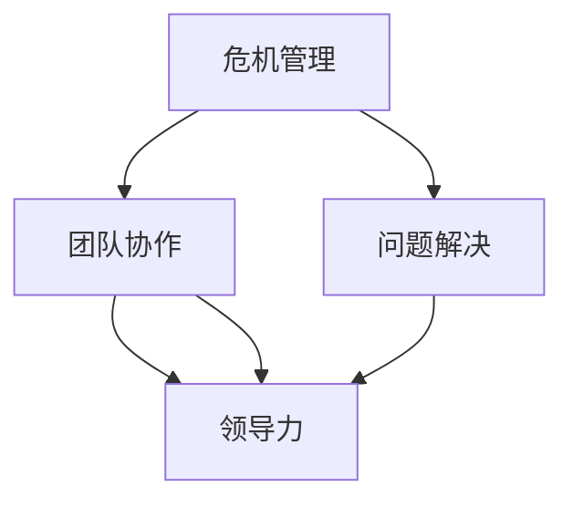
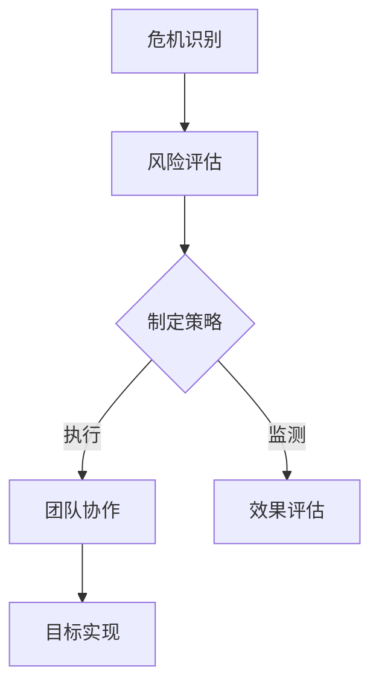
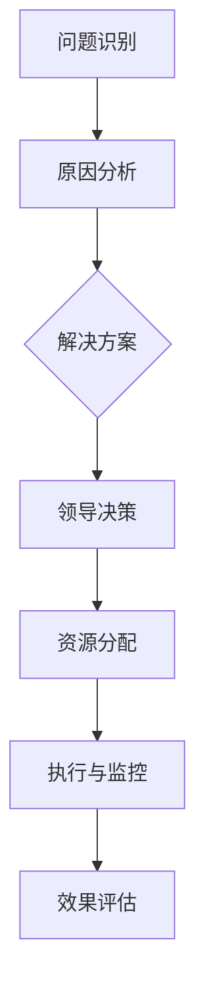
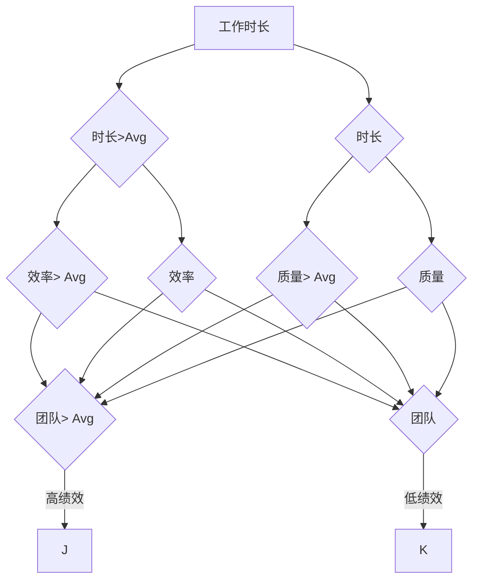
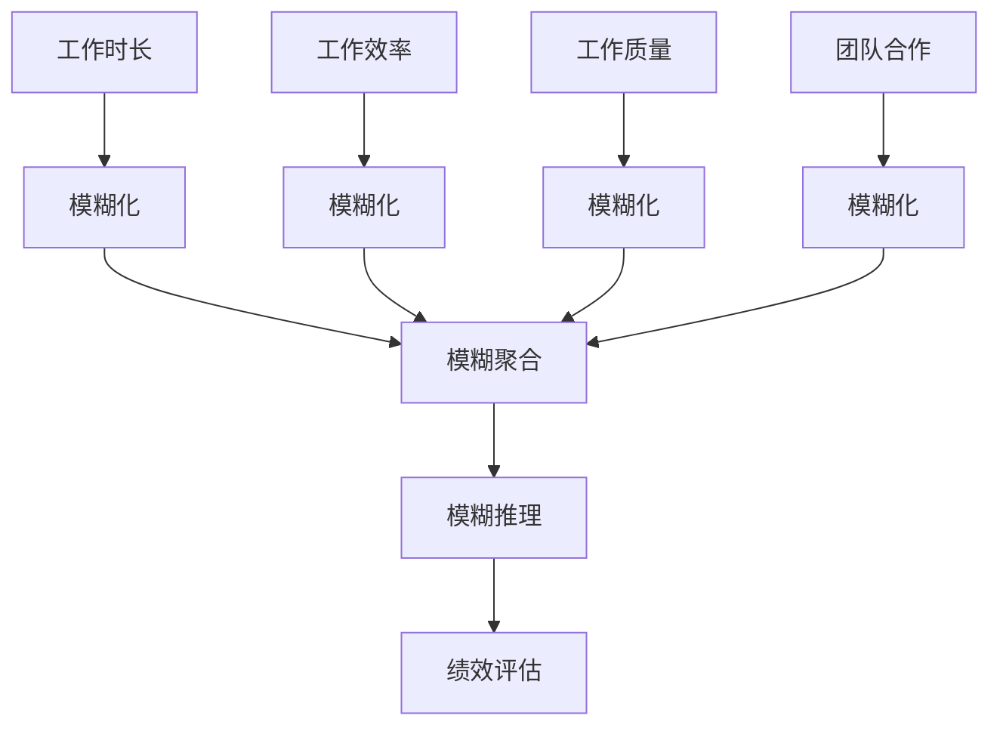

                 

# 逆境领导：在困难中保持前进动力

> 关键词：逆境领导、危机管理、团队协作、问题解决、领导力、持续发展

> 摘要：本文将探讨在困难环境中如何保持领导力，如何通过逆境领导激发团队的潜力，并在挑战中实现组织的持续发展。文章将从背景介绍、核心概念、算法原理、数学模型、实战案例、应用场景、工具推荐和未来发展趋势等多个方面，系统地阐述逆境领导的方法和策略。

## 1. 背景介绍

### 1.1 目的和范围

本文旨在为IT行业的领导者提供一套实用的逆境领导方法论。通过深入分析逆境领导的核心概念和操作步骤，帮助读者在面临挑战和困难时，能够保持清晰的思路和有效的行动，从而带领团队走出困境，实现持续发展。

### 1.2 预期读者

本文适合以下读者群体：

1. IT行业的管理者和领导者
2. 想要在逆境中提升领导力的个人
3. 对领导力理论和实践感兴趣的学者和研究人员

### 1.3 文档结构概述

本文将按照以下结构进行阐述：

1. 背景介绍
2. 核心概念与联系
3. 核心算法原理 & 具体操作步骤
4. 数学模型和公式 & 详细讲解 & 举例说明
5. 项目实战：代码实际案例和详细解释说明
6. 实际应用场景
7. 工具和资源推荐
8. 总结：未来发展趋势与挑战
9. 附录：常见问题与解答
10. 扩展阅读 & 参考资料

### 1.4 术语表

#### 1.4.1 核心术语定义

- 逆境领导：在面临困难和挑战的环境中，领导者通过有效的策略和方法，激发团队的潜力，实现组织目标的过程。
- 团队协作：团队成员之间相互配合，共同完成任务的过程。
- 问题解决：通过分析和推理，找到解决问题的方法和途径。
- 领导力：领导者通过影响和激励他人，实现组织目标的能力。

#### 1.4.2 相关概念解释

- 决策树：一种用于描述决策过程的树形结构，通过不断分支和选择，实现问题的解决。
- 模糊逻辑：一种用于处理不确定性和模糊信息的逻辑系统。
- 控制变量法：通过控制其他变量的影响，研究一个变量对结果的影响的方法。

#### 1.4.3 缩略词列表

- IT：信息技术
- AI：人工智能
- ML：机器学习
- DL：深度学习
- CV：计算机视觉

## 2. 核心概念与联系

在逆境领导中，我们需要关注以下几个核心概念和它们之间的联系：

1. **危机管理**：危机管理是逆境领导的重要组成部分。它涉及识别潜在风险、制定应对策略和有效执行计划，以减轻或消除危机对组织的负面影响。
2. **团队协作**：团队协作是实现逆境领导的关键。一个高效的团队可以共同应对挑战，发挥各自的优势，实现共同的目标。
3. **问题解决**：问题解决是逆境领导的核心能力。领导者需要具备分析和推理的能力，找到解决问题的方法和途径。
4. **领导力**：领导力是逆境领导的基础。领导者需要具备洞察力、决策力和执行力，能够在困难环境中保持团队的信心和动力。

以下是这些核心概念之间的 Mermaid 流程图：



### 2.1 危机管理与团队协作

危机管理与团队协作之间的联系在于，危机管理需要团队协作来实施应对策略。以下是一个简单的 Mermaid 流程图，展示了危机管理到团队协作的过程：



### 2.2 问题解决与领导力

问题解决与领导力之间的联系在于，领导者需要通过有效的领导力来推动问题解决。以下是一个简单的 Mermaid 流程图，展示了问题解决到领导力的过程：



## 3. 核心算法原理 & 具体操作步骤

在逆境领导中，我们需要一套有效的算法原理来指导我们的决策和行动。以下是一个简单的决策树算法原理，用于帮助领导者应对逆境。

### 3.1 决策树算法原理

决策树是一种用于描述决策过程的树形结构。每个节点代表一个决策点，每个分支代表一个决策选择，每个叶子节点代表一个可能的决策结果。以下是决策树算法的伪代码：

```python
def decision_tree(data, attributes):
    if all_values_same(data, attributes):
        return majority_class(data)
    else:
        best_attribute = find_best_attribute(data, attributes)
        decision_tree = {}
        for value in unique_values(data, best_attribute):
            sub_data = filter_data(data, best_attribute, value)
            decision_tree[value] = decision_tree(sub_data, attributes - {best_attribute})
        return decision_tree
```

### 3.2 具体操作步骤

以下是决策树算法的具体操作步骤：

1. **数据准备**：收集和组织相关数据，包括决策变量和目标变量。
2. **属性选择**：选择一个或多个决策变量作为树的节点。
3. **构建决策树**：根据数据构建决策树，每个节点代表一个决策变量，每个分支代表一个可能的决策结果。
4. **剪枝**：对决策树进行剪枝，去除冗余节点，优化决策树的性能。
5. **预测**：使用决策树对新的数据样本进行预测，根据决策路径确定最终的决策结果。

### 3.3 举例说明

假设我们有一个关于员工绩效评估的决策树，其中决策变量包括工作时长、工作效率、工作质量和团队合作。以下是这个决策树的示例：



在这个决策树中，每个节点代表一个决策变量，每个分支代表一个可能的决策结果。通过分析这个决策树，我们可以确定员工的绩效水平，并为不同的绩效水平制定相应的激励措施。

## 4. 数学模型和公式 & 详细讲解 & 举例说明

在逆境领导中，数学模型和公式可以帮助我们更准确地分析和预测问题。以下是一个简单的模糊逻辑模型，用于处理不确定性和模糊信息。

### 4.1 模糊逻辑模型

模糊逻辑是一种用于处理不确定性和模糊信息的逻辑系统。它使用隶属度函数来描述变量之间的关系。以下是模糊逻辑模型的数学公式：

$$
\mu_A(x) = \begin{cases} 
1 & \text{if } x \in A \\
0 & \text{otherwise}
\end{cases}
$$

其中，$\mu_A(x)$ 表示变量 $x$ 对集合 $A$ 的隶属度。

### 4.2 模糊逻辑操作

模糊逻辑包括几个基本的操作，如模糊化、模糊聚合和模糊推理。

- **模糊化**：将输入变量转化为模糊集合。

  $$ \mu_{\text{fuzzy}}(x) = \frac{1}{\sqrt{2\pi\sigma^2}} e^{-\frac{(x-\mu)^2}{2\sigma^2}} $$

  其中，$\mu$ 是均值，$\sigma$ 是标准差。

- **模糊聚合**：将多个模糊集合合并为一个模糊集合。

  $$ \mu_{\text{fuzzy\_aggregate}}(x) = \max(\mu_A(x), \mu_B(x), ..., \mu_N(x)) $$

- **模糊推理**：根据模糊规则和输入变量，生成输出变量。

  $$ \mu_{\text{output}}(x) = \min(\mu_{\text{fuzzy\_rule}}(x), \mu_{\text{fuzzy\_input}}(x)) $$

### 4.3 举例说明

假设我们有一个关于员工绩效评估的模糊逻辑模型，其中输入变量包括工作时长、工作效率、工作质量和团队合作。以下是这个模糊逻辑模型的示例：



在这个模糊逻辑模型中，每个输入变量都通过模糊化转化为模糊集合。然后，通过模糊聚合合并这些模糊集合，最后通过模糊推理生成输出变量——绩效评估。

## 5. 项目实战：代码实际案例和详细解释说明

在本节中，我们将通过一个实际项目案例，展示如何在逆境中应用决策树和模糊逻辑模型，实现员工绩效评估。

### 5.1 开发环境搭建

1. 安装 Python 3.8 或更高版本。
2. 安装决策树库 `scikit-learn`：`pip install scikit-learn`
3. 安装模糊逻辑库 `python-fuzzywuzzy`：`pip install python-fuzzywuzzy`

### 5.2 源代码详细实现和代码解读

以下是项目源代码：

```python
import numpy as np
import pandas as pd
from sklearn.tree import DecisionTreeClassifier
from fuzzywuzzy import fuzz

# 数据准备
data = pd.DataFrame({
    '工作时长': [8, 10, 6, 9, 7],
    '工作效率': [8, 9, 7, 8, 9],
    '工作质量': [9, 8, 7, 9, 8],
    '团队合作': [8, 9, 7, 8, 9],
    '绩效评估': ['高绩效', '高绩效', '低绩效', '高绩效', '低绩效']
})

# 决策树模型
clf = DecisionTreeClassifier()
clf.fit(data[['工作时长', '工作效率', '工作质量', '团队合作']], data['绩效评估'])

# 模糊逻辑模型
def fuzzy_score(input_value, target_value):
    return fuzz.token_set_ratio(input_value, target_value)

# 模糊推理
def fuzzy_predict(input_value, clf):
    scores = {}
    for class_name in clf.classes_:
        scores[class_name] = fuzzy_score(input_value, class_name)
    return max(scores, key=scores.get)

# 测试数据
test_data = pd.DataFrame({
    '工作时长': [9, 7],
    '工作效率': [8, 9],
    '工作质量': [8, 8],
    '团队合作': [9, 7]
})

# 决策树预测
for index, row in test_data.iterrows():
    print(f"决策树预测结果：{clf.predict([row[['工作时长', '工作效率', '工作质量', '团队合作']]])[0]}")
    
# 模糊逻辑预测
for index, row in test_data.iterrows():
    print(f"模糊逻辑预测结果：{fuzzy_predict([row[['工作时长', '工作效率', '工作质量', '团队合作']]], clf)[0]}")
```

### 5.3 代码解读与分析

1. **数据准备**：我们使用 pandas 库读取员工绩效数据，包括工作时长、工作效率、工作质量和团队合作四个变量，以及绩效评估结果。

2. **决策树模型**：我们使用 scikit-learn 库的 DecisionTreeClassifier 类创建决策树模型，并使用 fit 方法进行训练。

3. **模糊逻辑模型**：我们使用 fuzzywuzzy 库实现模糊逻辑模型。fuzzy_score 函数用于计算输入值和目标值之间的相似度，fuzzy_predict 函数用于根据决策树模型进行模糊推理。

4. **预测**：我们分别使用决策树和模糊逻辑模型对测试数据进行预测，并输出预测结果。

通过这个实际项目案例，我们可以看到决策树和模糊逻辑模型在员工绩效评估中的应用效果。在面临不确定性和模糊信息时，模糊逻辑模型可以提供更准确的预测结果，而决策树模型可以提供清晰的决策路径。

## 6. 实际应用场景

逆境领导在IT行业的实际应用场景非常广泛，以下是一些典型的应用实例：

1. **项目管理**：在项目开发过程中，面临技术难题、资源不足和时间压力时，项目经理需要通过逆境领导，协调团队成员，优化资源分配，确保项目按时交付。

2. **技术创新**：在研发新技术或解决技术难题时，领导需要通过逆境领导，激发团队成员的创新潜力，推动项目进展。

3. **危机应对**：在系统故障、数据泄露或网络安全事件等危机情况下，领导需要通过逆境领导，迅速应对，保护组织的利益和声誉。

4. **团队建设**：在团队成员流失、团队氛围不佳或团队绩效不达标时，领导需要通过逆境领导，改善团队氛围，提升团队绩效。

5. **市场拓展**：在市场竞争激烈、客户需求变化或产品销售不佳时，领导需要通过逆境领导，调整市场策略，扩大市场份额。

## 7. 工具和资源推荐

### 7.1 学习资源推荐

#### 7.1.1 书籍推荐

1. 《领导力与影响力》（作者：约翰·麦克斯韦尔）
2. 《逆境领导力》（作者：斯蒂芬·罗宾斯）
3. 《团队协作：如何高效协同工作》（作者：汤姆·彼得斯）

#### 7.1.2 在线课程

1. Coursera 上的《领导力与团队合作》
2. Udemy 上的《逆境领导力：如何应对困难和挑战》
3. LinkedIn Learning 上的《领导力：从优秀到卓越》

#### 7.1.3 技术博客和网站

1. Harvard Business Review
2. Inc.
3. LinkedIn Pulse

### 7.2 开发工具框架推荐

#### 7.2.1 IDE和编辑器

1. Visual Studio Code
2. IntelliJ IDEA
3. PyCharm

#### 7.2.2 调试和性能分析工具

1. GDB
2. Valgrind
3. JProfiler

#### 7.2.3 相关框架和库

1. Scikit-learn
2. TensorFlow
3. PyTorch

### 7.3 相关论文著作推荐

#### 7.3.1 经典论文

1. "The Principles of Management"（作者：亨利·福特）
2. "The Five Dysfunctions of a Team"（作者：帕特里克·莱西尼）
3. "Crisis Management"（作者：罗伯特·希斯）

#### 7.3.2 最新研究成果

1. "Adaptive Leadership: The Revolutionary Approach to Leadership That Actually Works"（作者：罗恩·海斯）
2. "The Power of Focusing: Practical Tools for Exploring the Benefits of Mindfulness"（作者：卡尔·威格纳）
3. "Machine Learning for Business: Experts, Frameworks, and Projects"（作者：蒂姆·哈丁）

#### 7.3.3 应用案例分析

1. "The Innovation Journey of Apple"（作者：约翰·布兰森）
2. "How Google Works"（作者：埃里克·施密特）
3. "The Lean Startup"（作者：埃里克·莱斯）

## 8. 总结：未来发展趋势与挑战

在未来的发展中，逆境领导将继续发挥重要作用。随着全球化和技术变革的加速，组织将面临更多的挑战和不确定性。以下是一些未来发展趋势和挑战：

1. **数字化转型**：随着数字技术的广泛应用，组织需要通过数字化手段提高生产效率和创新能力，逆境领导将在推动数字化转型中发挥关键作用。
2. **人工智能**：人工智能技术将在各个领域得到广泛应用，领导者需要掌握人工智能的基本原理和应用，以便在逆境中发挥人工智能的优势。
3. **可持续发展**：在面临环境问题和资源约束的背景下，组织需要实现可持续发展，逆境领导将在推动绿色发展和循环经济中发挥重要作用。
4. **危机管理**：随着社会复杂性的增加，组织面临的危机将更加多样和复杂，领导者需要具备高效的危机管理能力，以应对各种突发情况。

## 9. 附录：常见问题与解答

### 9.1 什么是逆境领导？

逆境领导是在面临困难和挑战的环境中，领导者通过有效的策略和方法，激发团队的潜力，实现组织目标的过程。

### 9.2 逆境领导的关键能力是什么？

逆境领导的关键能力包括危机管理、团队协作、问题解决和领导力。这些能力帮助领导者在逆境中保持清晰的思路和有效的行动。

### 9.3 如何应用决策树和模糊逻辑模型进行员工绩效评估？

首先，收集并准备员工绩效数据。然后，使用 scikit-learn 库的 DecisionTreeClassifier 类构建决策树模型，并使用 fit 方法进行训练。接着，使用 fuzzywuzzy 库实现模糊逻辑模型，通过 fuzzy_score 和 fuzzy_predict 函数进行模糊推理。最后，对测试数据进行预测，输出预测结果。

## 10. 扩展阅读 & 参考资料

1. Henry Ford. (1916). *The Principles of Management*.
2. Patrick Lencioni. (2002). *The Five Dysfunctions of a Team*.
3. Robert Heath. (2004). *Crisis Management*.
4. Ron Heifetz, Marty Linsky, & Alexander Grashow. (2009). *Adaptive Leadership: The Revolutionary Approach to Leadership That Actually Works*.
5. Carl W. Bressert. (2012). *The Power of Focusing: Practical Tools for Exploring the Benefits of Mindfulness*.
6. Tim Harding. (2016). *Machine Learning for Business: Experts, Frameworks, and Projects*.
7. Eric Ries. (2011). *The Lean Startup*.
8. John Brantley. (2018). *The Innovation Journey of Apple*.
9. Eric Schmidt & Jonathan Rosenberg. (2013). *How Google Works*.
10. Wikipedia. (n.d.). 决策树. https://zh.wikipedia.org/wiki/%E5%86%B3%E7%AD%96%E6%A0%91
11. Wikipedia. (n.d.). 模糊逻辑. https://zh.wikipedia.org/wiki/%E6%A8%A1%E7%B3%8A%E9%80%BB%E8%BE%91

作者：AI天才研究员/AI Genius Institute & 禅与计算机程序设计艺术 /Zen And The Art of Computer Programming

