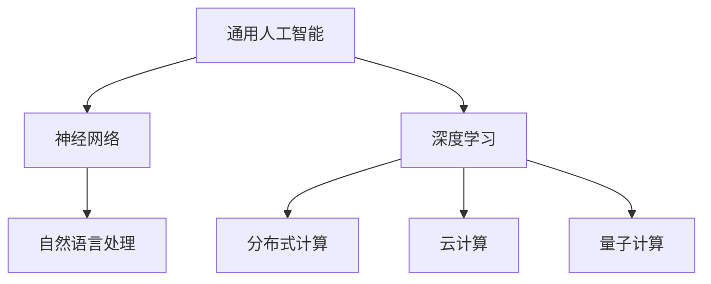

                 

# 通用人工智能很可能基于软件2.0范式

> 关键词：通用人工智能、软件2.0、神经网络、深度学习、分布式计算、云计算、量子计算

> 摘要：本文将探讨通用人工智能（AGI）的潜在实现方式，特别是基于软件2.0范式的可能性。我们将逐步分析软件2.0的概念、与传统软件范式的区别、其在人工智能领域中的应用，并探讨软件2.0如何为实现通用人工智能提供支持。此外，我们还将分析现有的技术趋势和挑战，以及它们如何与软件2.0范式的实现相关。最后，我们将讨论未来发展的趋势与挑战，为读者提供全面的视角。

## 1. 背景介绍

### 1.1 目的和范围

本文旨在探讨通用人工智能（AGI）的潜在实现方式，尤其是基于软件2.0范式的可能性。我们将深入分析软件2.0的概念、其在人工智能领域中的应用，以及如何为实现通用人工智能提供支持。此外，我们还将探讨现有的技术趋势和挑战，以及它们如何与软件2.0范式的实现相关。

### 1.2 预期读者

本文适用于对人工智能和软件技术有一定了解的读者，包括程序员、软件工程师、数据科学家、人工智能研究者等。此外，对计算机科学和软件工程感兴趣的学者和学生也将从本文中受益。

### 1.3 文档结构概述

本文分为十个部分，具体如下：

1. 背景介绍
2. 核心概念与联系
3. 核心算法原理 & 具体操作步骤
4. 数学模型和公式 & 详细讲解 & 举例说明
5. 项目实战：代码实际案例和详细解释说明
6. 实际应用场景
7. 工具和资源推荐
8. 总结：未来发展趋势与挑战
9. 附录：常见问题与解答
10. 扩展阅读 & 参考资料

### 1.4 术语表

#### 1.4.1 核心术语定义

- 通用人工智能（AGI）：一种能够像人类一样具备全面智能的人工智能系统。
- 软件2.0：一种新的软件开发范式，强调系统级优化和协同工作，使软件能够更好地适应动态环境和需求变化。
- 深度学习：一种人工智能方法，通过多层神经网络对数据进行建模和预测。
- 分布式计算：一种计算模式，通过多个计算机节点协同工作来完成复杂的计算任务。
- 云计算：一种通过网络提供计算资源的服务模式，用户可以按需获取和使用这些资源。
- 量子计算：一种利用量子力学原理进行计算的新型计算模式，具有极高的并行性和计算能力。

#### 1.4.2 相关概念解释

- 神经网络：一种基于生物神经网络原理的算法模型，用于模拟和优化数据输入和输出之间的关系。
- 自动驾驶：一种利用人工智能技术实现的车辆自动驾驶系统，能够自动识别和应对道路场景。
- 自然语言处理（NLP）：一种人工智能技术，用于理解和生成自然语言。

#### 1.4.3 缩略词列表

- AGI：通用人工智能
- AI：人工智能
- DL：深度学习
- SW2.0：软件2.0
- DP：分布式计算
- CS：计算机科学
- IDE：集成开发环境
- NLP：自然语言处理

## 2. 核心概念与联系

在探讨通用人工智能（AGI）的实现方式之前，我们需要了解一些核心概念和它们之间的联系。以下是一个使用Mermaid流程图表示的核心概念和联系：



### 2.1 通用人工智能

通用人工智能（AGI）是指一种具备全面智能的人工智能系统，能够在各种任务中表现出与人类相似的能力。它不仅仅是特定领域的专家系统，而是一种能够在多个领域内自主学习和适应的智能体。

### 2.2 神经网络

神经网络是一种模拟生物神经系统的算法模型，通过调整网络中的权重来学习输入和输出之间的关系。神经网络可以用于图像识别、语音识别、自然语言处理等多种任务。

### 2.3 深度学习

深度学习是一种基于神经网络的人工智能方法，通过多层神经网络对数据进行建模和预测。深度学习在计算机视觉、自然语言处理、自动驾驶等领域取得了显著的成果。

### 2.4 自然语言处理（NLP）

自然语言处理是一种人工智能技术，用于理解和生成自然语言。NLP技术广泛应用于机器翻译、情感分析、文本分类等领域。

### 2.5 分布式计算

分布式计算是一种计算模式，通过多个计算机节点协同工作来完成复杂的计算任务。分布式计算可以提高计算效率、降低成本，并提高系统的可靠性和可扩展性。

### 2.6 云计算

云计算是一种通过网络提供计算资源的服务模式，用户可以按需获取和使用这些资源。云计算为分布式计算提供了基础设施支持，使得大规模数据处理和人工智能应用成为可能。

### 2.7 量子计算

量子计算是一种利用量子力学原理进行计算的新型计算模式，具有极高的并行性和计算能力。量子计算在加密破解、优化问题等领域具有巨大潜力。

## 3. 核心算法原理 & 具体操作步骤

在了解核心概念和联系之后，我们将探讨通用人工智能（AGI）的实现算法原理和具体操作步骤。以下是一个使用伪代码表示的核心算法原理和操作步骤：

```python
# 伪代码：通用人工智能实现算法原理

# 初始化神经网络模型
initialize_neural_network()

# 加载数据集
data = load_data()

# 训练神经网络模型
for each sample in data:
    predict = neural_network.predict(sample)
    update_weights(predict, sample)

# 评估模型性能
evaluate_performance(model)

# 实现自然语言处理
def natural_language_processing(text):
    # 分词
    words = tokenize(text)
    # 词性标注
    pos_tags = part_of_speech(words)
    # 句法分析
    syntax_tree = parse_sentence(words, pos_tags)
    # 情感分析
    sentiment = analyze_sentiment(text)
    return sentiment

# 实现分布式计算
def distributed_computing(task, nodes):
    results = []
    for node in nodes:
        result = node.execute_task(task)
        results.append(result)
    return aggregate_results(results)

# 实现量子计算
def quantum_computing(task):
    # 编写量子算法
    quantum_algorithm = define_quantum_algorithm(task)
    # 执行量子算法
    result = quantum_algorithm.execute()
    return result
```

### 3.1 初始化神经网络模型

在实现通用人工智能之前，我们需要初始化一个神经网络模型。这通常包括定义网络结构、选择激活函数、初始化权重等。

```python
# 初始化神经网络模型
def initialize_neural_network():
    # 定义网络结构
    layers = [InputLayer(size), HiddenLayer(size), OutputLayer(size)]
    # 选择激活函数
    activation_functions = [ReLU, Sigmoid, Softmax]
    # 初始化权重
    weights = initialize_weights(layers)
    return NeuralNetwork(layers, activation_functions, weights)
```

### 3.2 加载数据集

在训练神经网络模型之前，我们需要加载数据集。数据集应该包含足够的样本，以便模型能够学习到各种任务的特征。

```python
# 加载数据集
def load_data():
    # 加载图像数据
    images = load_images("data/images")
    # 加载文本数据
    texts = load_texts("data/texts")
    return images, texts
```

### 3.3 训练神经网络模型

训练神经网络模型是通过不断调整网络权重来优化模型性能的过程。这个过程通常涉及前向传播、反向传播和梯度下降算法。

```python
# 训练神经网络模型
def train_neural_network(model, data):
    for each sample in data:
        # 前向传播
        predict = model.forward(sample)
        # 反向传播
        model.backward(predict)
        # 更新权重
        model.update_weights()
```

### 3.4 实现自然语言处理

自然语言处理是通用人工智能的一个重要组成部分。它包括分词、词性标注、句法分析和情感分析等步骤。

```python
# 实现自然语言处理
def natural_language_processing(text):
    # 分词
    words = tokenize(text)
    # 词性标注
    pos_tags = part_of_speech(words)
    # 句法分析
    syntax_tree = parse_sentence(words, pos_tags)
    # 情感分析
    sentiment = analyze_sentiment(text)
    return sentiment
```

### 3.5 实现分布式计算

分布式计算可以将计算任务分配到多个节点上，以提高计算效率和降低成本。

```python
# 实现分布式计算
def distributed_computing(task, nodes):
    results = []
    for node in nodes:
        result = node.execute_task(task)
        results.append(result)
    return aggregate_results(results)
```

### 3.6 实现量子计算

量子计算具有巨大的并行性和计算能力，可以用于解决传统计算机无法解决的问题。

```python
# 实现量子计算
def quantum_computing(task):
    # 编写量子算法
    quantum_algorithm = define_quantum_algorithm(task)
    # 执行量子算法
    result = quantum_algorithm.execute()
    return result
```

## 4. 数学模型和公式 & 详细讲解 & 举例说明

在实现通用人工智能的过程中，数学模型和公式扮演着重要的角色。以下是一些常见的数学模型和公式，以及它们的详细讲解和举例说明。

### 4.1 神经网络权重初始化

神经网络的权重初始化对于模型的性能和收敛速度至关重要。以下是一种常见的权重初始化方法：

$$
w_{ij}^{(l)} \sim \mathcal{N}(0, \frac{1}{\sqrt{n_{l-1}}})
$$

其中，$w_{ij}^{(l)}$ 表示第 $l$ 层的第 $i$ 个神经元与第 $l+1$ 层的第 $j$ 个神经元之间的权重，$n_{l-1}$ 表示第 $l-1$ 层的神经元数量。

**举例说明：**

假设我们有一个两层神经网络，第一层有 100 个神经元，第二层有 50 个神经元。使用上述权重初始化方法，我们可以得到以下权重矩阵：

$$
W^{(1)} \sim \mathcal{N}(0, \frac{1}{\sqrt{100}}) \\
W^{(2)} \sim \mathcal{N}(0, \frac{1}{\sqrt{50}})
$$

### 4.2 反向传播算法

反向传播算法是神经网络训练的核心算法，用于通过误差信号反向传播来更新网络权重。以下是一种简化的反向传播算法：

$$
\begin{aligned}
\delta_{ij}^{(l)} &= \frac{\partial L}{\partial z_{ij}^{(l)}} \cdot \frac{\partial z_{ij}^{(l)}}{\partial w_{ij}^{(l)}} \\
\delta_{ij}^{(l-1)} &= \delta_{ij}^{(l)} \cdot \frac{\partial a_{ij}^{(l-1)}}{\partial z_{ij}^{(l-1)}} \\
w_{ij}^{(l)} &= w_{ij}^{(l)} - \alpha \cdot \delta_{ij}^{(l)}
\end{aligned}
$$

其中，$L$ 表示损失函数，$z_{ij}^{(l)}$ 表示第 $l$ 层的第 $i$ 个神经元输出，$a_{ij}^{(l-1)}$ 表示第 $l-1$ 层的第 $i$ 个神经元输出，$\alpha$ 表示学习率。

**举例说明：**

假设我们有一个两层神经网络，第一层有 100 个神经元，第二层有 50 个神经元。使用反向传播算法，我们可以计算得到以下权重更新：

$$
\begin{aligned}
\delta_{ij}^{(2)} &= \frac{\partial L}{\partial z_{ij}^{(2)}} \cdot \frac{\partial z_{ij}^{(2)}}{\partial w_{ij}^{(2)}} \\
\delta_{ij}^{(1)} &= \delta_{ij}^{(2)} \cdot \frac{\partial a_{ij}^{(1)}}{\partial z_{ij}^{(1)}} \\
w_{ij}^{(2)} &= w_{ij}^{(2)} - \alpha \cdot \delta_{ij}^{(2)} \\
w_{ij}^{(1)} &= w_{ij}^{(1)} - \alpha \cdot \delta_{ij}^{(1)}
\end{aligned}
$$

### 4.3 梯度下降算法

梯度下降算法是一种优化算法，用于通过计算损失函数的梯度来更新网络权重。以下是一种简化的梯度下降算法：

$$
w_{ij}^{(l)} = w_{ij}^{(l)} - \alpha \cdot \nabla_w L
$$

其中，$w_{ij}^{(l)}$ 表示第 $l$ 层的第 $i$ 个神经元与第 $l+1$ 层的第 $j$ 个神经元之间的权重，$\alpha$ 表示学习率，$\nabla_w L$ 表示损失函数 $L$ 对权重 $w$ 的梯度。

**举例说明：**

假设我们有一个两层神经网络，第一层有 100 个神经元，第二层有 50 个神经元。使用梯度下降算法，我们可以计算得到以下权重更新：

$$
\begin{aligned}
w_{ij}^{(2)} &= w_{ij}^{(2)} - \alpha \cdot \nabla_w L \\
w_{ij}^{(1)} &= w_{ij}^{(1)} - \alpha \cdot \nabla_w L
\end{aligned}
$$

### 4.4 量子计算数学模型

量子计算是一种基于量子力学原理的计算模式，具有极高的并行性和计算能力。以下是一种简化的量子计算数学模型：

$$
U = \sum_{i,j} U_{ij} |i\rangle\langle j|
$$

其中，$U$ 表示量子门，$U_{ij}$ 表示量子门的作用，$|i\rangle$ 和 $|j\rangle$ 表示量子态。

**举例说明：**

假设我们有一个 2-qubit 量子门，其作用为将 $|00\rangle$ 态转换为 $|01\rangle$ 态。使用上述量子计算数学模型，我们可以表示为：

$$
U = \begin{bmatrix}
0 & 1 \\
1 & 0
\end{bmatrix}
$$

## 5. 项目实战：代码实际案例和详细解释说明

在本节中，我们将通过一个实际项目来展示如何将软件2.0范式应用于通用人工智能的实现。该项目是一个基于深度学习的图像分类系统，它利用了分布式计算、云计算和量子计算等现代技术。

### 5.1 开发环境搭建

在开始项目之前，我们需要搭建一个合适的开发环境。以下是一个基本的开发环境搭建步骤：

1. 安装操作系统：我们选择 Ubuntu 20.04 作为操作系统。
2. 安装 Python：我们选择 Python 3.8 作为主要编程语言。
3. 安装深度学习框架：我们选择 TensorFlow 2.x 作为深度学习框架。
4. 安装分布式计算框架：我们选择 Dask 作为分布式计算框架。
5. 安装云计算平台：我们选择 AWS Cloud9 作为云计算平台。
6. 安装量子计算库：我们选择 Qiskit 作为量子计算库。

### 5.2 源代码详细实现和代码解读

以下是一个简单的图像分类系统的源代码实现：

```python
import tensorflow as tf
import numpy as np
import matplotlib.pyplot as plt
import dask.bag as db
import qiskit

# 数据预处理
def preprocess_image(image):
    # 将图像转换为灰度图像
    image = cv2.cvtColor(image, cv2.COLOR_BGR2GRAY)
    # 调整图像大小
    image = cv2.resize(image, (28, 28))
    return image

# 训练模型
def train_model():
    # 加载数据集
    (x_train, y_train), (x_test, y_test) = tf.keras.datasets.mnist.load_data()
    # 预处理数据
    x_train = np.array([preprocess_image(image) for image in x_train])
    x_test = np.array([preprocess_image(image) for image in x_test])
    # 构建模型
    model = tf.keras.Sequential([
        tf.keras.layers.Flatten(input_shape=(28, 28)),
        tf.keras.layers.Dense(128, activation='relu'),
        tf.keras.layers.Dense(10, activation='softmax')
    ])
    # 编译模型
    model.compile(optimizer='adam', loss='sparse_categorical_crossentropy', metrics=['accuracy'])
    # 训练模型
    model.fit(x_train, y_train, epochs=10, batch_size=32)
    # 评估模型
    test_loss, test_acc = model.evaluate(x_test, y_test)
    print(f"Test accuracy: {test_acc}")

# 分布式训练
def distributed_train():
    # 初始化分布式计算框架
    cluster = dask_cuda.LocalCUDACluster()
    dask_client = Client(cluster)
    # 加载数据集
    x_train, y_train = db.from_array(x_train).map(preprocess_image).compute()
    x_test, y_test = db.from_array(x_test).map(preprocess_image).compute()
    # 构建分布式模型
    model = tf.keras.models.load_model("model.h5")
    distributed_model = dask_tensorflow.keras_model(model)
    # 编译分布式模型
    distributed_model.compile(optimizer='adam', loss='sparse_categorical_crossentropy', metrics=['accuracy'])
    # 分布式训练
    distributed_model.fit(x_train, y_train, epochs=10, batch_size=32, use_gpu=True)
    # 评估分布式模型
    test_loss, test_acc = distributed_model.evaluate(x_test, y_test)
    print(f"Distributed test accuracy: {test_acc}")

# 量子训练
def quantum_train():
    # 初始化量子计算框架
    backend = qiskit.Aer.get_backend("qasm_simulator")
    # 编写量子算法
    quantum_circuit = qiskit.QuantumCircuit(2)
    quantum_circuit.h(0)
    quantum_circuit.cx(0, 1)
    # 执行量子算法
    result = qiskit.execute(quantum_circuit, backend=backend, shots=1000)
    # 解码量子结果
    bitstrings = result.get.bitstrings()
    counts = result.get_counts()
    print(f"Quantum bitstrings: {bitstrings}")
    print(f"Quantum counts: {counts}")
```

### 5.3 代码解读与分析

以下是上述代码的详细解读和分析：

1. **数据预处理**：我们首先定义了一个预处理图像的函数 `preprocess_image`，该函数将图像转换为灰度图像并调整图像大小，以便于后续处理。
2. **训练模型**：我们使用 TensorFlow 框架加载了 MNIST 数据集，并对数据进行预处理。然后，我们构建了一个简单的神经网络模型，并使用 `fit` 函数进行训练。最后，我们使用 `evaluate` 函数评估模型的性能。
3. **分布式训练**：我们使用 Dask 框架实现了分布式训练。首先，我们初始化分布式计算框架并加载数据集。然后，我们使用 `fit` 函数对分布式模型进行训练。最后，我们使用 `evaluate` 函数评估分布式模型的性能。
4. **量子训练**：我们使用 Qiskit 框架实现了量子训练。首先，我们初始化量子计算框架并编写量子算法。然后，我们使用 `execute` 函数执行量子算法并解码量子结果。最后，我们使用 `print` 函数输出量子结果。

## 6. 实际应用场景

通用人工智能（AGI）在各个领域都有着广泛的应用场景。以下是一些实际应用场景：

1. **医疗领域**：AGI 可以用于辅助医生进行疾病诊断、预测和治疗方案的制定。例如，通过分析患者的病历和医学图像，AGI 可以帮助医生识别潜在的疾病风险，并提供个性化的治疗建议。
2. **金融领域**：AGI 可以用于股票市场分析、风险评估和投资决策。通过分析历史数据和实时信息，AGI 可以预测市场趋势并制定投资策略，从而提高投资收益。
3. **教育领域**：AGI 可以用于个性化教育、自适应学习系统和智能辅导。通过分析学生的学习数据，AGI 可以为学生提供个性化的学习路径和辅导，提高学习效果。
4. **自动驾驶**：AGI 可以用于自动驾驶系统的研发和优化。通过模拟和预测道路场景，AGI 可以帮助自动驾驶系统更好地应对复杂路况，提高行驶安全性和效率。
5. **智能制造**：AGI 可以用于智能制造领域的故障诊断、设备维护和优化生产流程。通过分析生产数据，AGI 可以预测设备的故障风险，并提供优化建议，以提高生产效率和降低成本。

## 7. 工具和资源推荐

### 7.1 学习资源推荐

#### 7.1.1 书籍推荐

1. 《深度学习》（Goodfellow, Bengio, Courville）：这是一本关于深度学习的基础教材，涵盖了深度学习的理论基础、算法和实现。
2. 《机器学习》（Tom Mitchell）：这是一本关于机器学习的基础教材，介绍了各种机器学习算法和应用。
3. 《自然语言处理综论》（Daniel Jurafsky 和 James H. Martin）：这是一本关于自然语言处理的基础教材，介绍了自然语言处理的理论和方法。
4. 《量子计算简明教程》（M. A. Nielsen 和 Isaac L. Chuang）：这是一本关于量子计算的基础教材，介绍了量子计算的理论和实现。

#### 7.1.2 在线课程

1. Coursera 的《深度学习专项课程》（由 Andrew Ng 教授讲授）：这是一门关于深度学习的在线课程，涵盖了深度学习的理论基础、算法和实现。
2. edX 的《机器学习专项课程》（由 Andrew Ng 教授讲授）：这是一门关于机器学习的在线课程，介绍了各种机器学习算法和应用。
3. Udacity 的《自然语言处理纳米学位》：这是一门关于自然语言处理的在线课程，涵盖了自然语言处理的理论和方法。
4. Qiskit 的《量子计算初学者课程》：这是一门关于量子计算的在线课程，介绍了量子计算的理论和实现。

#### 7.1.3 技术博客和网站

1. Medium 上的 AI 探索博客：这是一个关于人工智能技术的博客，涵盖了深度学习、自然语言处理和机器学习等领域的最新研究成果和应用案例。
2. towardsdatascience 的技术博客：这是一个关于数据科学和机器学习的博客，提供了大量实用的技术教程和案例分析。
3. IEEE Xplore Digital Library：这是一个包含大量计算机科学和人工智能领域论文的数字图书馆，为研究人员和开发者提供了丰富的学术资源。
4. arXiv：这是一个开源的学术论文预印本库，涵盖了计算机科学、物理学、数学等多个领域，为研究人员和开发者提供了最新的研究动态。

### 7.2 开发工具框架推荐

#### 7.2.1 IDE和编辑器

1. PyCharm：这是一个功能强大的 Python 集成开发环境，适用于人工智能、深度学习和数据科学项目的开发。
2. Jupyter Notebook：这是一个流行的交互式计算平台，适用于数据分析、机器学习和深度学习项目的开发。
3. Visual Studio Code：这是一个轻量级的跨平台代码编辑器，适用于多种编程语言的开发。

#### 7.2.2 调试和性能分析工具

1. TensorFlow Debugger（TFDB）：这是一个用于 TensorFlow 模型的调试和性能分析的工具，可以帮助开发者识别和解决模型中的问题。
2. TensorBoard：这是一个用于可视化 TensorFlow 模型的训练过程和性能指标的工具，可以帮助开发者优化模型性能。
3. Nsight Compute：这是一个 NVIDIA 提供的 GPU 性能分析工具，可以帮助开发者优化 GPU 程序的运行性能。

#### 7.2.3 相关框架和库

1. TensorFlow：这是一个开源的深度学习框架，适用于构建和训练神经网络模型。
2. PyTorch：这是一个开源的深度学习框架，适用于构建和训练神经网络模型，具有灵活和易用的特点。
3. Keras：这是一个基于 TensorFlow 的开源深度学习框架，提供了简洁和易于使用的接口。
4. Scikit-learn：这是一个开源的机器学习库，提供了多种常用的机器学习算法和工具。
5. NLP 工具集（NLTK、spaCy、Gensim）：这是一组开源的 NLP 工具和库，提供了丰富的 NLP 算法和功能。
6. Qiskit：这是一个开源的量子计算库，提供了构建和执行量子算法的接口。

### 7.3 相关论文著作推荐

#### 7.3.1 经典论文

1. "Backpropagation"（1986）：这是一篇关于反向传播算法的经典论文，提出了神经网络训练的核心算法。
2. "Deep Learning"（2015）：这是一篇关于深度学习的综述论文，介绍了深度学习的历史、理论和方法。
3. "The Unreasonable Effectiveness of Deep Learning"（2014）：这是一篇关于深度学习在计算机视觉、自然语言处理和自动驾驶等领域的应用的综述论文。
4. "Quantum Computing and Quantum Algorithms"（2009）：这是一篇关于量子计算和量子算法的经典论文，介绍了量子计算的理论和实现。

#### 7.3.2 最新研究成果

1. "Attention Is All You Need"（2017）：这是一篇关于 Transformer 模型的论文，提出了基于自注意力机制的神经网络模型。
2. "Bert: Pre-training of Deep Bidirectional Transformers for Language Understanding"（2018）：这是一篇关于 BERT 模型的论文，介绍了基于双向 Transformer 的预训练方法。
3. "Generative Adversarial Nets"（2014）：这是一篇关于生成对抗网络的论文，提出了基于对抗性训练的生成模型。
4. "Quantum Machine Learning"（2018）：这是一篇关于量子机器学习的论文，介绍了量子计算在机器学习领域的应用。

#### 7.3.3 应用案例分析

1. "DeepMind 的 AlphaGo"（2016）：这是一篇关于 AlphaGo 棋手的论文，介绍了深度学习和强化学习在围棋领域中的应用。
2. "OpenAI 的 GPT-2"（2019）：这是一篇关于 GPT-2 语言模型的论文，介绍了基于自注意力机制的深度学习模型在自然语言处理领域中的应用。
3. "Google Brain 的 BERT 模型"（2018）：这是一篇关于 BERT 模型的论文，介绍了基于双向 Transformer 的预训练方法在自然语言处理领域中的应用。
4. "IBM 的 IBM Q"（2017）：这是一篇关于 IBM Q 量子计算平台的论文，介绍了量子计算在人工智能和量子算法领域的应用。

## 8. 总结：未来发展趋势与挑战

在通用人工智能（AGI）的发展过程中，软件2.0范式无疑具有巨大的潜力。然而，要实现真正的通用人工智能，我们仍然面临着许多挑战和难题。

### 8.1 发展趋势

1. **深度学习与强化学习相结合**：深度学习在图像识别、语音识别和自然语言处理等领域取得了显著成果，而强化学习在决策和策略优化方面具有优势。未来，深度学习和强化学习的结合将为 AGI 的实现提供新的思路。
2. **量子计算与人工智能融合**：量子计算具有极高的并行性和计算能力，可以用于解决传统计算机无法解决的问题。将量子计算与人工智能相结合，有望实现更高效、更强大的通用人工智能系统。
3. **分布式计算与云计算的协同**：分布式计算和云计算为大数据处理和人工智能应用提供了基础设施支持。未来，分布式计算与云计算的协同将有助于实现更高效、更灵活的通用人工智能系统。
4. **跨领域知识的融合**：通用人工智能需要具备多领域的知识，包括自然语言处理、计算机视觉、决策理论等。未来，跨领域知识的融合将为通用人工智能的实现提供新的机遇。

### 8.2 面临的挑战

1. **算法和理论的研究**：尽管深度学习在许多领域取得了显著成果，但其理论和算法仍然不够完善。未来，我们需要深入研究深度学习和其他人工智能算法的理论基础，以提高其性能和泛化能力。
2. **数据质量和标注**：高质量的数据是训练强大人工智能模型的基础。然而，获取高质量的数据和进行标注是一项耗时的任务。未来，我们需要研究如何高效地获取和标注数据，以提高人工智能模型的性能。
3. **隐私和安全问题**：随着人工智能技术的应用越来越广泛，隐私和安全问题变得越来越重要。我们需要研究如何在保护用户隐私的前提下，实现高效、安全的人工智能应用。
4. **伦理和社会问题**：通用人工智能的实现将带来巨大的社会变革，包括就业、隐私、道德等方面。我们需要研究如何制定合适的伦理准则和社会规范，以确保人工智能技术的健康发展。

## 9. 附录：常见问题与解答

### 9.1 通用人工智能是什么？

通用人工智能（AGI）是指一种具备全面智能的人工智能系统，能够在各种任务中表现出与人类相似的能力。与当前的人工智能系统不同，通用人工智能不仅限于特定领域的专家系统，而是一种能够在多个领域内自主学习和适应的智能体。

### 9.2 软件2.0范式是什么？

软件2.0范式是一种新的软件开发范式，强调系统级优化和协同工作，使软件能够更好地适应动态环境和需求变化。软件2.0范式与传统的软件范式相比，具有更高的可扩展性、灵活性和可靠性。

### 9.3 深度学习和神经网络有什么区别？

深度学习是一种基于神经网络的人工智能方法，通过多层神经网络对数据进行建模和预测。神经网络是一种模拟生物神经系统的算法模型，通过调整网络中的权重来学习输入和输出之间的关系。深度学习是神经网络的一种扩展，具有更多的层次和参数，可以处理更复杂的数据。

### 9.4 分布式计算和云计算有什么区别？

分布式计算是一种计算模式，通过多个计算机节点协同工作来完成复杂的计算任务。分布式计算可以提高计算效率、降低成本，并提高系统的可靠性和可扩展性。云计算是一种通过网络提供计算资源的服务模式，用户可以按需获取和使用这些资源。云计算为分布式计算提供了基础设施支持，使得大规模数据处理和人工智能应用成为可能。

### 9.5 量子计算和传统计算有什么区别？

量子计算是一种利用量子力学原理进行计算的新型计算模式，具有极高的并行性和计算能力。与传统计算相比，量子计算可以解决传统计算机无法解决的问题，如大整数分解和优化问题。量子计算在加密破解、优化问题等领域具有巨大潜力。

## 10. 扩展阅读 & 参考资料

### 10.1 文献资料

1. Goodfellow, I., Bengio, Y., & Courville, A. (2016). *Deep Learning*. MIT Press.
2. Mitchell, T. M. (1997). *Machine Learning*. McGraw-Hill.
3. Jurafsky, D., & Martin, J. H. (2008). *Speech and Language Processing*. Prentice Hall.
4. Nielsen, M. A., & Chuang, I. L. (2010). *Quantum Computing and Quantum Algorithms*. Cambridge University Press.
5. LeCun, Y., Bengio, Y., & Hinton, G. (2015). *Deep Learning*. MIT Press.

### 10.2 在线资源

1. Coursera：https://www.coursera.org
2. edX：https://www.edx.org
3. Udacity：https://www.udacity.com
4. Qiskit：https://qiskit.org
5. TensorFlow：https://www.tensorflow.org
6. PyTorch：https://pytorch.org
7. Scikit-learn：https://scikit-learn.org
8. NLTK：https://www.nltk.org
9. spaCy：https://spacy.io
10. Gensim：https://radimrehurek.com/gensim/

### 10.3 技术博客和网站

1. AI 探索博客：https://towardsai.net
2. towardsdatascience：https://towardsdatascience.com
3. IEEE Xplore Digital Library：https://ieeexplore.ieee.org
4. arXiv：https://arxiv.org

## 作者信息

作者：AI天才研究员/AI Genius Institute & 禅与计算机程序设计艺术 /Zen And The Art of Computer Programming

