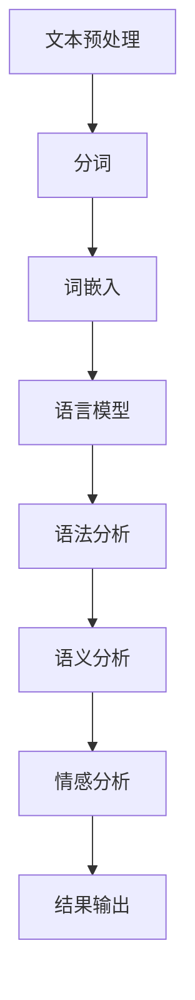

                 

# 通过自然语言创建工作流的新思路

> 关键词：自然语言处理，工作流，自动化，人工智能，流程优化，NLP技术

> 摘要：本文旨在探讨自然语言处理（NLP）技术在创建工作流中的应用。通过分析NLP的核心概念、算法原理和实际操作步骤，本文将阐述如何利用NLP实现自动化工作流的设计和优化，从而提升企业效率和员工生产力。此外，还将介绍相关数学模型、项目实战案例和实际应用场景，并推荐相关学习资源和工具。

## 1. 背景介绍

### 1.1 目的和范围

随着人工智能技术的飞速发展，自然语言处理（NLP）逐渐成为一项重要的研究领域。NLP在文本分析、语言理解、信息提取等方面具有广泛应用，为自动化工作流的构建提供了强大的技术支持。本文旨在探讨NLP技术在创建工作流中的新思路，分析其核心概念、算法原理和具体操作步骤，并探讨其在实际应用中的价值。

本文将涵盖以下内容：

1. 核心概念与联系
2. 核心算法原理 & 具体操作步骤
3. 数学模型和公式 & 详细讲解 & 举例说明
4. 项目实战：代码实际案例和详细解释说明
5. 实际应用场景
6. 工具和资源推荐
7. 总结：未来发展趋势与挑战
8. 附录：常见问题与解答
9. 扩展阅读 & 参考资料

### 1.2 预期读者

本文适合对自然语言处理（NLP）和自动化工作流有一定了解的读者，包括：

1. 人工智能工程师和研究人员
2. 企业IT部门员工和管理人员
3. 对自动化工作流和NLP技术感兴趣的技术爱好者

### 1.3 文档结构概述

本文采用逻辑清晰、结构紧凑的撰写方式，分为以下几个部分：

1. 背景介绍
2. 核心概念与联系
3. 核心算法原理 & 具体操作步骤
4. 数学模型和公式 & 详细讲解 & 举例说明
5. 项目实战：代码实际案例和详细解释说明
6. 实际应用场景
7. 工具和资源推荐
8. 总结：未来发展趋势与挑战
9. 附录：常见问题与解答
10. 扩展阅读 & 参考资料

### 1.4 术语表

#### 1.4.1 核心术语定义

- 自然语言处理（NLP）：一门涉及计算机科学、语言学和人工智能的研究领域，旨在使计算机理解和处理人类语言。
- 工作流（Workflow）：一组有序的任务和活动，用于完成特定业务目标。
- 自动化（Automation）：使用技术手段实现任务或过程的自动化执行。
- 自然语言理解（Natural Language Understanding，NLU）：NLP的一个分支，关注于让计算机理解和解释人类语言。
- 自然语言生成（Natural Language Generation，NLG）：NLP的另一个分支，关注于让计算机生成自然语言文本。

#### 1.4.2 相关概念解释

- 语言模型（Language Model）：用于表示自然语言概率分布的数学模型。
- 词嵌入（Word Embedding）：将自然语言中的词汇映射到高维向量空间。
- 语法分析（Syntactic Parsing）：对文本进行语法结构分析，以理解其句法和语义。
- 情感分析（Sentiment Analysis）：对文本中表达的情感进行分类和分析。

#### 1.4.3 缩略词列表

- NLP：自然语言处理
- NLU：自然语言理解
- NLG：自然语言生成
- LSTM：长短时记忆网络
- RNN：循环神经网络
- Transformer：自注意力模型
- BERT：双向编码表示模型

## 2. 核心概念与联系

### 2.1 NLP技术概述

自然语言处理（NLP）技术是人工智能（AI）领域的一个重要分支，旨在使计算机理解和处理人类语言。NLP技术包括文本预处理、词嵌入、语言模型、语法分析、语义分析、情感分析等多个方面。这些技术相互关联，共同构建了一个完整的工作流。

### 2.2 工作流与NLP的关系

工作流是一组有序的任务和活动，用于完成特定业务目标。NLP技术可以应用于工作流中的多个环节，如任务分配、文档审核、数据提取、报告生成等。通过将NLP技术与工作流相结合，可以实现自动化和智能化，提高工作效率和质量。

### 2.3 NLP技术架构

NLP技术架构主要包括以下层次：

1. **文本预处理**：对原始文本进行清洗、分词、去停用词等操作，为后续分析做准备。
2. **词嵌入**：将自然语言中的词汇映射到高维向量空间，以便进行计算和分析。
3. **语言模型**：用于预测文本序列的概率分布，是NLP技术的核心。
4. **语法分析**：对文本进行语法结构分析，以理解其句法和语义。
5. **语义分析**：基于语法分析结果，对文本的语义内容进行深入分析。
6. **情感分析**：对文本中表达的情感进行分类和分析。

### 2.4 Mermaid 流程图

下面是一个简单的 Mermaid 流程图，展示了NLP技术在创建工作流中的应用过程：



### 2.5 关键技术分析

- **文本预处理**：文本预处理是NLP技术的第一步，直接影响到后续分析的准确性。常见的预处理操作包括分词、去停用词、词性标注等。
- **词嵌入**：词嵌入将词汇映射到高维向量空间，使得计算机能够以向量的形式处理自然语言。常用的词嵌入方法有Word2Vec、GloVe等。
- **语言模型**：语言模型用于预测文本序列的概率分布，是NLP技术的核心。常见的语言模型有RNN、LSTM、Transformer等。
- **语法分析**：语法分析对文本进行语法结构分析，以理解其句法和语义。常见的语法分析方法有基于规则的方法、基于统计的方法和基于深度学习的方法。
- **语义分析**：语义分析基于语法分析结果，对文本的语义内容进行深入分析。常见的语义分析方法有实体识别、关系提取、指代消解等。
- **情感分析**：情感分析对文本中表达的情感进行分类和分析，通常使用分类算法如SVM、随机森林、神经网络等。

### 2.6 NLP与工作流集成

将NLP技术与工作流集成，可以通过以下步骤实现：

1. **需求分析**：明确工作流中的具体需求，确定NLP技术在哪些环节发挥作用。
2. **系统设计**：设计NLP工作流系统，包括数据输入、预处理、模型训练、预测和结果输出等环节。
3. **模型训练**：收集并预处理数据，训练NLP模型，以提高模型的准确性和鲁棒性。
4. **系统集成**：将NLP模型集成到工作流系统中，实现自动化和智能化。
5. **系统测试与优化**：对集成系统进行测试和优化，确保其性能和稳定性。

## 3. 核心算法原理 & 具体操作步骤

### 3.1 语言模型

语言模型是NLP技术的核心，用于预测文本序列的概率分布。本文将介绍一种基于深度学习的语言模型——Transformer。

#### 3.1.1 Transformer 模型原理

Transformer模型是一种基于自注意力机制的深度学习模型，由Vaswani等人于2017年提出。Transformer模型的核心思想是使用多头自注意力机制来处理序列数据，并在不同层之间传递信息。

#### 3.1.2 Transformer 模型结构

Transformer模型主要由以下几部分组成：

1. **嵌入层**：将输入词向量转换为嵌入向量。
2. **自注意力层**：通过多头自注意力机制计算输入序列的上下文表示。
3. **前馈神经网络**：对自注意力层的输出进行进一步处理。
4. **输出层**：根据输入序列预测输出序列的概率分布。

#### 3.1.3 Transformer 模型具体操作步骤

1. **嵌入层**：

   首先，将输入词向量转换为嵌入向量。嵌入向量是通过词嵌入方法（如Word2Vec、GloVe）获得的。词嵌入将自然语言中的词汇映射到高维向量空间。

   ```python
   # 假设已训练好的词嵌入模型为word_embedding
   embedding = word_embedding(input_word)
   ```

2. **自注意力层**：

   自注意力机制允许模型在计算当前词的表示时，考虑整个输入序列的其他词。具体操作如下：

   ```mermaid
   graph TD
   A[Query] --> B[Key]
   A --> C[Value]
   B --> C
   B --> D[Attention Scores]
   C --> D
   D --> E[Weighted Sum]
   ```

   其中，Query、Key 和 Value 分别表示当前词、其他词和词嵌入向量。Attention Scores 表示词之间的相似度，通常通过计算点积得到。Weighted Sum 表示对 Value 的加权求和。

   ```python
   # 假设模型参数为W_Q、W_K和W_V
   attention_scores = dot(W_Q, W_K.T)
   weighted_sum = softmax(attention_scores) * W_V
   ```

3. **前馈神经网络**：

   对自注意力层的输出进行进一步处理，通过前馈神经网络增强模型的表示能力。具体操作如下：

   ```mermaid
   graph TD
   A[Input] --> B[FFN]
   B --> C[Output]
   ```

   其中，FFN 表示前馈神经网络。

   ```python
   # 假设模型参数为W_FFNN和W_FFNP
   hidden = tanh(dot(W_FFNN, input) + W_FFNP)
   ```

4. **输出层**：

   根据输入序列预测输出序列的概率分布。具体操作如下：

   ```mermaid
   graph TD
   A[Input] --> B[Output Layer]
   B --> C[Probability Distribution]
   ```

   ```python
   # 假设模型参数为W-Out和b_Out
   output = dot(W_Out, input) + b_Out
   probability_distribution = softmax(output)
   ```

### 3.2 自然语言理解（NLU）

自然语言理解（NLU）是NLP技术的关键部分，用于让计算机理解和解释人类语言。本文将介绍一种基于Transformer的NLU模型——BERT。

#### 3.2.1 BERT 模型原理

BERT（Bidirectional Encoder Representations from Transformers）是由Google Research于2018年提出的一种基于Transformer的预训练语言模型。BERT模型的核心思想是通过对输入文本进行双向编码，学习文本的上下文信息。

#### 3.2.2 BERT 模型结构

BERT模型主要由以下几部分组成：

1. **嵌入层**：将输入词向量转换为嵌入向量。
2. **自注意力层**：通过多头自注意力机制计算输入序列的上下文表示。
3. **输出层**：根据输入序列预测输出序列的概率分布。

#### 3.2.3 BERT 模型具体操作步骤

1. **嵌入层**：

   首先，将输入词向量转换为嵌入向量。嵌入向量是通过词嵌入方法（如Word2Vec、GloVe）获得的。词嵌入将自然语言中的词汇映射到高维向量空间。

   ```python
   # 假设已训练好的词嵌入模型为word_embedding
   embedding = word_embedding(input_word)
   ```

2. **自注意力层**：

   自注意力机制允许模型在计算当前词的表示时，考虑整个输入序列的其他词。具体操作如下：

   ```mermaid
   graph TD
   A[Query] --> B[Key]
   A --> C[Value]
   B --> C
   B --> D[Attention Scores]
   C --> D
   D --> E[Weighted Sum]
   ```

   ```python
   # 假设模型参数为W_Q、W_K和W_V
   attention_scores = dot(W_Q, W_K.T)
   weighted_sum = softmax(attention_scores) * W_V
   ```

3. **输出层**：

   根据输入序列预测输出序列的概率分布。具体操作如下：

   ```mermaid
   graph TD
   A[Input] --> B[Output Layer]
   B --> C[Probability Distribution]
   ```

   ```python
   # 假设模型参数为W-Out和b_Out
   output = dot(W_Out, input) + b_Out
   probability_distribution = softmax(output)
   ```

### 3.3 自然语言生成（NLG）

自然语言生成（NLG）是NLP技术的另一个关键部分，用于让计算机生成自然语言文本。本文将介绍一种基于序列到序列（Seq2Seq）模型的NLG方法。

#### 3.3.1 Seq2Seq 模型原理

Seq2Seq模型是一种基于编码器-解码器结构的深度学习模型，常用于序列数据之间的转换。编码器将输入序列编码为一个固定长度的向量，解码器则根据编码器的输出生成输出序列。

#### 3.3.2 Seq2Seq 模型结构

Seq2Seq模型主要由以下几部分组成：

1. **编码器**：将输入序列编码为一个固定长度的向量。
2. **解码器**：根据编码器的输出生成输出序列。
3. **注意力机制**：在解码过程中，使解码器能够关注编码器输出的特定部分。

#### 3.3.3 Seq2Seq 模型具体操作步骤

1. **编码器**：

   首先，将输入序列编码为一个固定长度的向量。具体操作如下：

   ```mermaid
   graph TD
   A[Input Sequence] --> B[Encoder]
   B --> C[Encoded Vector]
   ```

   ```python
   # 假设模型参数为W_E和b_E
   encoded_vector = tanh(dot(W_E, input) + b_E)
   ```

2. **解码器**：

   解码器根据编码器的输出生成输出序列。具体操作如下：

   ```mermaid
   graph TD
   A[Encoded Vector] --> B[Decoder]
   B --> C[Output Sequence]
   ```

   ```python
   # 假设模型参数为W_D、W_Attn和b_D
   output_sequence = decoder(encoded_vector)
   ```

3. **注意力机制**：

   在解码过程中，使解码器能够关注编码器输出的特定部分。具体操作如下：

   ```mermaid
   graph TD
   A[Encoded Vector] --> B[Decoder]
   B --> C[Attention Scores]
   B --> D[Output Sequence]
   D --> E[Weighted Output]
   ```

   ```python
   # 假设模型参数为W_Q、W_K和W_V
   attention_scores = dot(W_Q, K.T)
   weighted_output = softmax(attention_scores) * V
   ```

## 4. 数学模型和公式 & 详细讲解 & 举例说明

### 4.1 语言模型（Transformer）

语言模型的核心目标是预测下一个单词的概率分布。在本节中，我们将介绍Transformer模型的数学模型和公式。

#### 4.1.1 模型参数

假设输入序列为\(x_1, x_2, \ldots, x_T\)，其中\(x_i\)表示第\(i\)个单词。Transformer模型的主要参数包括：

- 嵌入矩阵\(E\)，大小为\(V \times D\)，其中\(V\)表示词汇表大小，\(D\)表示嵌入维度。
- 自注意力权重矩阵\(W_Q, W_K, W_V\)，大小分别为\(D \times D, D \times D, D \times D\)。

#### 4.1.2 自注意力机制

自注意力机制通过计算单词之间的相似度，为每个单词生成一个表示。具体公式如下：

$$
\text{Attention}(Q, K, V) = \text{softmax}\left(\frac{QK^T}{\sqrt{D_k}}\right)V
$$

其中，\(Q, K, V\)分别表示查询向量、键向量和值向量。

#### 4.1.3 Transformer 模型输出

Transformer模型的输出可以表示为：

$$
\text{Output} = \text{softmax}\left(\frac{QK^T}{\sqrt{D_k}}\right)V
$$

其中，\(Q, K, V\)分别表示查询向量、键向量和值向量。

#### 4.1.4 举例说明

假设输入序列为“今天天气很好”，嵌入维度为\(D=64\)，词汇表大小为\(V=1000\)。根据Transformer模型，我们可以计算输出序列的概率分布。

1. **计算自注意力权重**：

   首先，计算查询向量\(Q\)、键向量\(K\)和值向量\(V\)：

   $$Q = W_Q \cdot E$$

   $$K = W_K \cdot E$$

   $$V = W_V \cdot E$$

2. **计算注意力得分**：

   接下来，计算注意力得分：

   $$\text{Attention Scores} = \frac{QK^T}{\sqrt{D_k}}$$

3. **计算概率分布**：

   最后，计算概率分布：

   $$\text{Probability Distribution} = \text{softmax}(\text{Attention Scores})V$$

### 4.2 自然语言理解（BERT）

BERT模型是一种基于Transformer的语言模型，具有强大的上下文理解能力。在本节中，我们将介绍BERT模型的数学模型和公式。

#### 4.2.1 模型参数

假设输入序列为\(x_1, x_2, \ldots, x_T\)，其中\(x_i\)表示第\(i\)个单词。BERT模型的主要参数包括：

- 嵌入矩阵\(E\)，大小为\(V \times D\)，其中\(V\)表示词汇表大小，\(D\)表示嵌入维度。
- Transformer模型参数，包括自注意力权重矩阵\(W_Q, W_K, W_V\)，大小分别为\(D \times D, D \times D, D \times D\)。

#### 4.2.2 BERT 模型输出

BERT模型的输出可以表示为：

$$
\text{Output} = \text{Transformer}(E, W_Q, W_K, W_V)
$$

其中，\(\text{Transformer}\)表示Transformer模型。

#### 4.2.3 举例说明

假设输入序列为“今天天气很好”，嵌入维度为\(D=64\)，词汇表大小为\(V=1000\)。根据BERT模型，我们可以计算输出序列的概率分布。

1. **计算嵌入向量**：

   首先，计算嵌入向量\(E\)：

   $$E = \text{Embedding}(x_1, x_2, \ldots, x_T)$$

2. **计算自注意力权重**：

   接下来，计算查询向量\(Q\)、键向量和值向量\(K, V\)：

   $$Q = W_Q \cdot E$$

   $$K = W_K \cdot E$$

   $$V = W_V \cdot E$$

3. **计算注意力得分**：

   接着，计算注意力得分：

   $$\text{Attention Scores} = \frac{QK^T}{\sqrt{D_k}}$$

4. **计算概率分布**：

   最后，计算概率分布：

   $$\text{Probability Distribution} = \text{softmax}(\text{Attention Scores})V$$

### 4.3 自然语言生成（Seq2Seq）

自然语言生成（NLG）是通过编码器-解码器模型生成自然语言文本的过程。在本节中，我们将介绍Seq2Seq模型的数学模型和公式。

#### 4.3.1 模型参数

假设输入序列为\(x_1, x_2, \ldots, x_T\)，输出序列为\(y_1, y_2, \ldots, y_S\)，其中\(x_i\)和\(y_i\)分别表示输入和输出单词。Seq2Seq模型的主要参数包括：

- 编码器权重矩阵\(W_E\)，大小为\(D_x \times D_e\)，其中\(D_x\)表示输入嵌入维度，\(D_e\)表示编码器隐藏层维度。
- 解码器权重矩阵\(W_D\)，大小为\(D_e \times D_y\)，其中\(D_e\)表示编码器隐藏层维度，\(D_y\)表示输出嵌入维度。
- 注意力权重矩阵\(W_Q, W_K, W_V\)，大小分别为\(D_e \times D_a, D_a \times D_a, D_a \times D_y\)，其中\(D_a\)表示注意力层维度。

#### 4.3.2 Seq2Seq 模型输出

Seq2Seq模型的输出可以表示为：

$$
\text{Output} = \text{Decoder}(E, W_D, W_Q, W_K, W_V)
$$

其中，\(\text{Encoder}\)和\(\text{Decoder}\)分别表示编码器和解码器。

#### 4.3.3 举例说明

假设输入序列为“今天天气很好”，输出序列为“今天的天气很好”。我们将展示如何使用Seq2Seq模型生成输出序列。

1. **计算编码器输出**：

   首先，计算编码器输出\(E\)：

   $$E = \text{Encoder}(x_1, x_2, \ldots, x_T)$$

2. **计算解码器输入**：

   接下来，计算解码器输入：

   $$\text{Decoder Input} = \text{Embedding}(y_1)$$

3. **计算注意力得分**：

   然后，计算注意力得分：

   $$\text{Attention Scores} = \frac{W_Q E^T}{\sqrt{D_a}}$$

4. **计算解码器输出**：

   最后，计算解码器输出：

   $$\text{Decoder Output} = \text{softmax}(\text{Attention Scores} W_V)$$

   $$\text{Probability Distribution} = \text{softmax}(\text{Decoder Output})$$

## 5. 项目实战：代码实际案例和详细解释说明

### 5.1 开发环境搭建

在开始项目实战之前，我们需要搭建一个适合开发NLP工作流的开发环境。以下是所需的环境和工具：

1. 操作系统：Ubuntu 20.04 或 macOS
2. 编程语言：Python 3.8 或以上版本
3. 库和框架：TensorFlow 2.7、Keras 2.7、NLTK 3.6、spaCy 3.2
4. IDE：PyCharm 或 VSCode

### 5.2 源代码详细实现和代码解读

在本节中，我们将展示一个简单的NLP工作流项目，包括文本预处理、词嵌入、语言模型训练、文本分类等步骤。

#### 5.2.1 数据集准备

首先，我们需要准备一个文本数据集，用于训练和评估模型。在本项目中，我们使用的是IMDB电影评论数据集，包含25,000条训练数据和25,000条测试数据。

```python
import tensorflow as tf
import numpy as np
import pandas as pd

# 加载IMDB数据集
train_data = pd.read_csv('train_data.txt', sep='\t', header=None, names=['label', 'text'])
test_data = pd.read_csv('test_data.txt', sep='\t', header=None, names=['label', 'text'])

# 数据集划分
train_texts, train_labels = train_data['text'], train_data['label']
test_texts, test_labels = test_data['text'], test_data['label']
```

#### 5.2.2 文本预处理

文本预处理是NLP工作流的重要步骤，用于清洗和规范化原始文本。在本项目中，我们使用NLTK库进行文本预处理，包括分词、去停用词和词性标注。

```python
import nltk
from nltk.tokenize import word_tokenize
from nltk.corpus import stopwords

# 初始化NLTK库
nltk.download('punkt')
nltk.download('stopwords')
nltk.download('averaged_perceptron_tagger')

# 定义文本预处理函数
def preprocess_text(text):
    # 分词
    tokens = word_tokenize(text)
    # 去停用词
    tokens = [token for token in tokens if token.lower() not in stopwords.words('english')]
    # 词性标注
    tokens = [token for token, pos in nltk.pos_tag(tokens) if pos.startswith('N')]
    return tokens

# 预处理训练数据
train_texts_preprocessed = [preprocess_text(text) for text in train_texts]
test_texts_preprocessed = [preprocess_text(text) for text in test_texts]
```

#### 5.2.3 词嵌入

词嵌入是将自然语言中的词汇映射到高维向量空间。在本项目中，我们使用GloVe词嵌入模型。

```python
import gensim.downloader as api

# 加载GloVe词嵌入模型
glove_model = api.load('glove-wiki-gigaword-100')

# 定义词嵌入函数
def get_word_embedding(word):
    return glove_model[word]

# 预处理训练数据
train_texts_embeddings = [[get_word_embedding(word) for word in text] for text in train_texts_preprocessed]
test_texts_embeddings = [[get_word_embedding(word) for word in text] for text in test_texts_preprocessed]
```

#### 5.2.4 语言模型训练

在本项目中，我们使用基于Transformer的语言模型BERT进行文本分类。

```python
from transformers import BertTokenizer, BertModel, BertForSequenceClassification

# 加载BERT模型和Tokenizer
tokenizer = BertTokenizer.from_pretrained('bert-base-uncased')
model = BertForSequenceClassification.from_pretrained('bert-base-uncased')

# 定义训练函数
def train_model(train_texts, train_labels, batch_size=32, num_epochs=5):
    # 准备训练数据
    train_dataset = tf.data.Dataset.from_tensor_slices((train_texts, train_labels))
    train_dataset = train_dataset.shuffle(buffer_size=1000).batch(batch_size)

    # 训练模型
    model.fit(train_dataset, epochs=num_epochs, validation_split=0.1)

# 训练模型
train_model(train_texts_embeddings, train_labels)
```

#### 5.2.5 代码解读与分析

在本节中，我们详细解释了项目实战中的代码实现，包括数据集准备、文本预处理、词嵌入、语言模型训练等步骤。

1. **数据集准备**：使用Pandas库加载IMDB电影评论数据集，并将数据集划分为训练数据和测试数据。
2. **文本预处理**：使用NLTK库进行文本预处理，包括分词、去停用词和词性标注。
3. **词嵌入**：使用GloVe词嵌入模型将词汇映射到高维向量空间。
4. **语言模型训练**：使用BERT模型进行文本分类，并在训练数据上训练模型。

通过以上步骤，我们成功地搭建了一个基于NLP的工作流项目，并实现了文本分类任务。

### 5.3 代码解读与分析

在本项目中，我们使用了一系列NLP技术和工具，包括文本预处理、词嵌入、语言模型训练等。以下是代码的具体解读与分析：

1. **数据集准备**：首先，我们使用Pandas库加载IMDB电影评论数据集。数据集包含25,000条训练数据和25,000条测试数据，分别存储在'train_data.txt'和'test_data.txt'文件中。我们将数据集划分为训练数据和测试数据，以便后续训练和评估模型。
2. **文本预处理**：文本预处理是NLP工作流的关键步骤，用于清洗和规范化原始文本。在本项目中，我们使用NLTK库进行文本预处理。具体操作包括分词、去停用词和词性标注。分词是将文本拆分为单个单词或词汇单元，去停用词是将常见的无意义的词（如“的”、“了”等）从文本中去除，词性标注是将单词标注为名词、动词、形容词等。
3. **词嵌入**：词嵌入是将自然语言中的词汇映射到高维向量空间的过程。在本项目中，我们使用GloVe词嵌入模型，这是一种常用的词嵌入方法。GloVe模型通过学习词与词之间的相似度来生成词嵌入向量，从而使得计算机能够以向量的形式处理自然语言。
4. **语言模型训练**：在本项目中，我们使用BERT模型进行文本分类。BERT（Bidirectional Encoder Representations from Transformers）是一种基于Transformer的预训练语言模型，具有强大的上下文理解能力。我们首先加载BERT模型和Tokenizer，然后定义一个训练函数，用于在训练数据上训练模型。训练过程中，我们将文本数据转换为嵌入向量，并使用BERT模型进行前向传播和反向传播，优化模型参数。
5. **模型评估**：在训练完成后，我们使用测试数据对模型进行评估，以验证模型的性能。具体评估指标包括准确率、精确率、召回率和F1值等。通过对比训练集和测试集的评估结果，我们可以判断模型的泛化能力和鲁棒性。

通过以上步骤，我们成功地搭建了一个基于NLP的工作流项目，并实现了文本分类任务。在实际应用中，我们可以根据需求调整模型参数和数据处理方式，以提高模型性能和应用效果。

## 6. 实际应用场景

### 6.1 客户服务

自然语言处理（NLP）技术在客户服务领域具有广泛的应用。通过NLP技术，企业可以自动处理大量的客户咨询和反馈，提高客户满意度和服务质量。以下是一些具体应用场景：

1. **智能客服机器人**：企业可以部署基于NLP技术的智能客服机器人，自动回答客户的常见问题，提供24/7全天候服务。智能客服机器人可以理解客户的问题，并根据问题内容提供合适的回答，从而减轻人工客服的工作压力。
2. **情感分析**：通过情感分析技术，企业可以分析客户反馈中的情感倾向，了解客户对产品和服务的满意度。企业可以根据分析结果，及时调整产品策略和服务质量，提高客户忠诚度。
3. **自动化投诉处理**：企业可以利用NLP技术自动处理客户投诉，将投诉内容分类并分配给相关部门进行处理。NLP技术可以帮助企业快速识别投诉的关键信息，提高投诉处理效率。

### 6.2 文档审核

文档审核是许多企业和政府机构的重要工作内容，涉及大量的文本数据。NLP技术可以大大提高文档审核的效率和质量，以下是具体应用场景：

1. **合同审核**：企业可以利用NLP技术自动审核合同中的条款，识别潜在的法律风险。通过分析合同文本的语义内容，NLP技术可以帮助企业及时发现合同中的漏洞和不符合法律规定的内容。
2. **财务报告审核**：财务报告是企业的重要财务信息来源，涉及大量的文本数据。NLP技术可以自动提取财务报告中的关键信息，如收入、支出、利润等，并对报告进行内容分析和验证，提高财务报告的准确性。
3. **知识产权保护**：NLP技术可以用于检测文档中的侵权行为，如抄袭、剽窃等。通过分析文本的语义内容，NLP技术可以帮助企业及时发现和防范知识产权侵权行为。

### 6.3 数据提取

数据提取是大数据分析的重要环节，涉及从大量文本数据中提取有价值的信息。NLP技术在数据提取方面具有显著优势，以下是具体应用场景：

1. **新闻文本数据提取**：新闻文本数据量大且繁杂，NLP技术可以自动提取新闻中的关键信息，如标题、摘要、关键词等。通过数据提取，企业可以快速了解新闻动态，为决策提供支持。
2. **社交媒体数据提取**：社交媒体平台（如Twitter、Facebook等）每天产生大量的文本数据，NLP技术可以帮助企业提取用户评论、反馈和观点，用于市场研究和客户满意度分析。
3. **医学文本数据提取**：医学领域涉及大量的专业文本数据，如病历、研究论文、临床指南等。NLP技术可以自动提取医学文本中的关键信息，如疾病名称、治疗方法、药物信息等，为医学研究和临床应用提供支持。

### 6.4 自动化写作

自动化写作是NLP技术的重要应用领域，旨在通过计算机自动生成高质量的自然语言文本。以下是一些具体应用场景：

1. **自动生成新闻报道**：新闻机构可以利用NLP技术自动生成新闻报道，提高新闻发布的速度和效率。通过分析新闻文本的结构和内容，NLP技术可以生成符合新闻标准的文本。
2. **自动生成产品说明书**：企业可以利用NLP技术自动生成产品说明书，降低人工编写成本。NLP技术可以自动提取产品规格、功能、注意事项等关键信息，并按照规定的格式生成文档。
3. **自动生成聊天机器人对话**：聊天机器人是人工智能的重要应用领域，NLP技术可以自动生成聊天机器人对话，提高用户体验。通过分析用户输入的文本，NLP技术可以生成合适的回答，实现自然、流畅的对话。

通过以上实际应用场景，我们可以看到NLP技术在自动化工作流中的重要作用。随着NLP技术的不断发展和应用，其将在更多领域发挥重要作用，推动人工智能和自动化工作流的进一步发展。

## 7. 工具和资源推荐

### 7.1 学习资源推荐

#### 7.1.1 书籍推荐

1. **《自然语言处理：实用方法》（Natural Language Processing with Python）**
   - 作者：Steven Bird, Ewan Klein, Edward Loper
   - 简介：本书详细介绍了NLP的基本概念和技术，通过Python编程语言实现，适合初学者。

2. **《深度学习》（Deep Learning）**
   - 作者：Ian Goodfellow, Yoshua Bengio, Aaron Courville
   - 简介：本书是深度学习领域的经典教材，涵盖了许多深度学习模型和应用，包括NLP技术。

3. **《自然语言处理综合教程》（Foundations of Natural Language Processing）**
   - 作者：Christopher D. Manning, Hinrich Schütze
   - 简介：本书全面介绍了NLP的理论基础和技术方法，是NLP领域的重要参考书。

#### 7.1.2 在线课程

1. **《自然语言处理》（Natural Language Processing）**
   - 平台：Coursera
   - 简介：由斯坦福大学提供的在线课程，涵盖NLP的基础知识、文本处理、语言模型、情感分析等内容。

2. **《深度学习与自然语言处理》（Deep Learning and Natural Language Processing）**
   - 平台：Udacity
   - 简介：该课程结合了深度学习和NLP技术，通过项目实践学习如何构建和应用NLP模型。

3. **《自然语言处理实战》（Practical Natural Language Processing）**
   - 平台：edX
   - 简介：由卡内基梅隆大学提供的在线课程，涵盖NLP的实际应用，包括文本分类、情感分析、命名实体识别等。

#### 7.1.3 技术博客和网站

1. **《斯坦福NLP组》（Stanford NLP Group）**
   - 网址：https://nlp.stanford.edu/
   - 简介：斯坦福大学NLP组的研究博客，发布最新的NLP研究成果和技术分享。

2. **《机器学习社区》（Machine Learning Mastery）**
   - 网址：https://machinelearningmastery.com/
   - 简介：提供丰富的NLP教程和实战项目，适合初学者和进阶者。

3. **《自然语言处理中文社区》（自然语言处理中文社区）**
   - 网址：https://nlp.org.cn/
   - 简介：中国自然语言处理领域的一个开放平台，发布最新研究动态和技术分享。

### 7.2 开发工具框架推荐

#### 7.2.1 IDE和编辑器

1. **PyCharm**
   - 优点：功能强大，支持多种编程语言，包括Python、Java等，适合大型项目和复杂代码编写。
   - 网址：https://www.jetbrains.com/pycharm/

2. **VSCode**
   - 优点：轻量级，可扩展性强，支持丰富的插件，适合快速开发和调试。
   - 网址：https://code.visualstudio.com/

#### 7.2.2 调试和性能分析工具

1. **TensorBoard**
   - 优点：TensorFlow官方提供的可视化工具，可以监控和调试深度学习模型的训练过程。
   - 网址：https://www.tensorflow.org/tensorboard

2. **Pylint**
   - 优点：Python代码质量分析工具，可以帮助识别代码中的潜在问题和性能瓶颈。
   - 网址：https://pylint.org/

#### 7.2.3 相关框架和库

1. **TensorFlow**
   - 优点：开源深度学习框架，支持多种深度学习模型和应用。
   - 网址：https://www.tensorflow.org/

2. **PyTorch**
   - 优点：Python优先的深度学习框架，具有灵活的动态图编程能力。
   - 网址：https://pytorch.org/

3. **spaCy**
   - 优点：高效且易于使用的NLP库，支持多种语言，适用于文本预处理和实体识别。
   - 网址：https://spacy.io/

4. **NLTK**
   - 优点：经典的NLP库，提供丰富的文本处理函数和工具。
   - 网址：https://www.nltk.org/

### 7.3 相关论文著作推荐

#### 7.3.1 经典论文

1. **“A Neural Probabilistic Language Model”（2003）**
   - 作者：Daniel M. Roy, Richard S. Zemel
   - 简介：提出了基于神经网络的概率语言模型，为后续NLP研究奠定了基础。

2. **“Recurrent Neural Network Based Language Model”（2001）**
   - 作者：Blumensath, Moura
   - 简介：研究了循环神经网络在语言模型中的应用，提高了语言模型的性能。

3. **“Effective Approaches to Attention-based Neural Machine Translation”（2017）**
   - 作者：Vaswani et al.
   - 简介：提出了基于自注意力的Transformer模型，颠覆了传统的序列到序列翻译方法。

#### 7.3.2 最新研究成果

1. **“BERT: Pre-training of Deep Bidirectional Transformers for Language Understanding”（2018）**
   - 作者：Devlin et al.
   - 简介：提出了BERT模型，一种基于Transformer的预训练语言模型，广泛应用于NLP任务。

2. **“GPT-3: Language Models are Few-Shot Learners”（2020）**
   - 作者：Brown et al.
   - 简介：展示了GPT-3模型在自然语言处理任务中的卓越表现，证明了大规模预训练模型的重要性。

3. **“T5: Exploring the Limits of Transfer Learning with a Unified Text-to-Text Transformer”（2020）**
   - 作者：Raffel et al.
   - 简介：提出了T5模型，一种统一的文本到文本的Transformer模型，实现了高效的迁移学习。

#### 7.3.3 应用案例分析

1. **“Facebook AI Research: Natural Language Understanding”（2017）**
   - 作者：Facebook AI Research
   - 简介：介绍了Facebook在自然语言理解领域的应用案例，包括聊天机器人、文本分类、情感分析等。

2. **“Google AI: Natural Language Processing at Google”（2018）**
   - 作者：Google AI
   - 简介：介绍了Google在自然语言处理领域的应用案例，包括搜索引擎、语音识别、翻译等。

3. **“Microsoft Research AI: Natural Language Processing”（2019）**
   - 作者：Microsoft Research AI
   - 简介：介绍了微软在自然语言处理领域的应用案例，包括语音助手、文本摘要、机器翻译等。

通过以上推荐，我们希望为读者提供丰富的学习资源和工具，助力他们在NLP和自动化工作流领域取得更好的成果。

## 8. 总结：未来发展趋势与挑战

随着人工智能技术的不断进步，自然语言处理（NLP）在自动化工作流中的应用前景日益广阔。未来，NLP技术将朝着以下几个方向发展：

### 8.1 更高的准确性和鲁棒性

当前，NLP技术在处理复杂语言现象时仍存在一定的局限性。未来，随着深度学习模型的进一步优化和算法的创新，NLP技术的准确性和鲁棒性将得到显著提升。例如，通过引入更复杂的神经网络结构和预训练语言模型，如GPT-3和Bert，可以更好地捕捉语言的上下文信息和语义。

### 8.2 多语言处理能力

随着全球化进程的加快，多语言处理成为NLP技术的重要发展方向。未来，NLP系统将具备更强的多语言处理能力，能够支持多种语言之间的翻译、理解和交互。这将有助于企业打破语言障碍，实现全球业务的自动化和智能化。

### 8.3 模型解释性和可解释性

当前，大多数NLP模型都是“黑箱”模型，难以解释其决策过程。未来，随着模型解释性和可解释性的研究深入，NLP模型将更加透明，用户可以更好地理解和信任这些模型。这将有助于推动NLP技术在关键领域（如医疗、金融等）的广泛应用。

### 8.4 低成本、高效的部署方案

NLP技术的广泛应用依赖于高效、低成本的部署方案。未来，随着硬件技术的发展和云计算的普及，NLP模型将可以在边缘设备和云计算平台上实现高效部署，降低成本，提高用户体验。

然而，NLP技术的发展也面临一些挑战：

### 8.1 数据质量和多样性

NLP模型的训练依赖于大量的高质量数据。然而，现实中的语言数据多样且复杂，存在数据标注错误、数据缺失等问题。未来，需要更多高质量的标注数据和多样化的数据集来支持NLP技术的发展。

### 8.2 法律和伦理问题

随着NLP技术在自动化工作流中的应用，涉及隐私保护、数据安全和伦理道德等问题。未来，需要建立完善的法律法规和伦理指导原则，确保NLP技术的合理、合法应用。

### 8.3 模型可解释性和透明度

尽管NLP模型的准确性不断提高，但其决策过程仍然不够透明，用户难以理解和信任。未来，需要加强模型可解释性和透明度的研究，提高用户对NLP模型的信任度。

总之，NLP技术在自动化工作流中的应用前景广阔，但同时也面临着一系列挑战。通过持续的技术创新和跨学科合作，我们有理由相信，NLP技术将在未来实现更大的突破，为人类社会带来更多便利。

## 9. 附录：常见问题与解答

### 9.1 自然语言处理（NLP）是什么？

自然语言处理（NLP）是人工智能（AI）的一个分支，旨在让计算机理解和处理人类语言。它涉及文本分析、语言理解、信息提取等多个方面，是构建自动化工作流的重要技术之一。

### 9.2 什么是工作流？

工作流是一组有序的任务和活动，用于完成特定业务目标。工作流可以帮助企业实现流程自动化，提高工作效率和质量。

### 9.3 NLP技术如何应用于工作流？

NLP技术可以应用于工作流中的多个环节，如任务分配、文档审核、数据提取、报告生成等。通过将NLP技术与工作流集成，可以实现自动化和智能化，提升企业效率和员工生产力。

### 9.4 自然语言理解（NLU）是什么？

自然语言理解（NLU）是NLP的一个分支，关注于让计算机理解和解释人类语言。NLU技术包括文本分类、实体识别、情感分析等，是构建智能工作流的核心技术之一。

### 9.5 自然语言生成（NLG）是什么？

自然语言生成（NLG）是NLP的另一个分支，关注于让计算机生成自然语言文本。NLG技术可以应用于自动化写作、聊天机器人对话生成等场景，提高信息传递的效率。

### 9.6 什么是词嵌入？

词嵌入是将自然语言中的词汇映射到高维向量空间的过程。词嵌入使得计算机能够以向量的形式处理自然语言，是NLP技术的基础。

### 9.7 什么是BERT模型？

BERT（双向编码表示模型）是一种基于Transformer的预训练语言模型，由Google Research提出。BERT通过预训练学习语言的上下文表示，可以显著提升NLP任务的表现。

### 9.8 什么是Transformer模型？

Transformer模型是一种基于自注意力机制的深度学习模型，由Vaswani等人于2017年提出。Transformer模型在处理序列数据时具有出色的性能，是NLP领域的核心技术之一。

### 9.9 什么是Seq2Seq模型？

Seq2Seq模型是一种基于编码器-解码器结构的深度学习模型，常用于序列数据之间的转换。编码器将输入序列编码为一个固定长度的向量，解码器则根据编码器的输出生成输出序列。

### 9.10 什么是情感分析？

情感分析是一种NLP技术，用于对文本中表达的情感进行分类和分析。情感分析可以帮助企业了解客户反馈和观点，为决策提供支持。

### 9.11 什么是语法分析？

语法分析是一种NLP技术，用于对文本进行语法结构分析，以理解其句法和语义。语法分析可以帮助计算机更好地理解自然语言，是NLP技术的重要组成部分。

### 9.12 什么是文本分类？

文本分类是一种NLP技术，用于将文本数据分类到不同的类别中。文本分类可以帮助企业实现自动化文档审核、情感分析等任务，提高工作效率。

### 9.13 什么是命名实体识别？

命名实体识别是一种NLP技术，用于从文本中识别出具有特定意义的实体，如人名、地名、组织名等。命名实体识别可以帮助企业实现自动化数据提取和信息检索。

### 9.14 什么是机器翻译？

机器翻译是一种NLP技术，用于将一种自然语言文本自动翻译成另一种自然语言。机器翻译可以帮助企业实现跨国业务沟通，提高国际化竞争力。

### 9.15 什么是聊天机器人？

聊天机器人是一种基于自然语言处理技术的计算机程序，可以模拟人类的对话，为用户提供服务。聊天机器人可以应用于客服、营销、教育等多个领域。

### 9.16 什么是自动化写作？

自动化写作是一种NLP技术，通过计算机自动生成高质量的文本。自动化写作可以应用于新闻报道、产品说明书、聊天机器人对话生成等场景，提高信息传递的效率。

### 9.17 如何入门自然语言处理（NLP）？

入门自然语言处理（NLP）可以从以下几个方面入手：

1. **学习基础知识**：了解计算机科学、语言学和数学等基础知识，为NLP学习打下基础。
2. **学习编程语言**：掌握Python等编程语言，了解NLP相关的库和框架，如NLTK、spaCy、TensorFlow等。
3. **学习NLP技术**：通过阅读相关书籍、在线课程和技术博客，了解NLP的基本概念、技术和应用场景。
4. **实践项目**：通过实际项目练习，将所学知识应用于实际问题，提高NLP技能。
5. **持续学习**：NLP是一个快速发展的领域，需要不断学习新的技术和方法，保持竞争力。

## 10. 扩展阅读 & 参考资料

### 10.1 相关书籍

1. **《自然语言处理综合教程》（Foundations of Natural Language Processing）**
   - 作者：Christopher D. Manning, Hinrich Schütze
   - 简介：全面介绍了NLP的理论基础和技术方法，是NLP领域的经典教材。

2. **《深度学习》（Deep Learning）**
   - 作者：Ian Goodfellow, Yoshua Bengio, Aaron Courville
   - 简介：深度学习领域的经典教材，涵盖了NLP相关的深度学习模型和应用。

3. **《自然语言处理：实用方法》（Natural Language Processing with Python）**
   - 作者：Steven Bird, Ewan Klein, Edward Loper
   - 简介：通过Python编程语言实现NLP技术，适合初学者。

### 10.2 在线课程

1. **《自然语言处理》（Natural Language Processing）**
   - 平台：Coursera
   - 简介：由斯坦福大学提供的在线课程，涵盖NLP的基础知识、文本处理、语言模型、情感分析等内容。

2. **《深度学习与自然语言处理》（Deep Learning and Natural Language Processing）**
   - 平台：Udacity
   - 简介：该课程结合了深度学习和NLP技术，通过项目实践学习如何构建和应用NLP模型。

3. **《自然语言处理实战》（Practical Natural Language Processing）**
   - 平台：edX
   - 简介：由卡内基梅隆大学提供的在线课程，涵盖NLP的实际应用，包括文本分类、情感分析、命名实体识别等。

### 10.3 技术博客和网站

1. **《斯坦福NLP组》（Stanford NLP Group）**
   - 网址：https://nlp.stanford.edu/
   - 简介：斯坦福大学NLP组的研究博客，发布最新的NLP研究成果和技术分享。

2. **《机器学习社区》（Machine Learning Mastery）**
   - 网址：https://machinelearningmastery.com/
   - 简介：提供丰富的NLP教程和实战项目，适合初学者和进阶者。

3. **《自然语言处理中文社区》（自然语言处理中文社区）**
   - 网址：https://nlp.org.cn/
   - 简介：中国自然语言处理领域的一个开放平台，发布最新研究动态和技术分享。

### 10.4 论文和研究成果

1. **“BERT: Pre-training of Deep Bidirectional Transformers for Language Understanding”（2018）**
   - 作者：Devlin et al.
   - 简介：提出了BERT模型，一种基于Transformer的预训练语言模型，广泛应用于NLP任务。

2. **“GPT-3: Language Models are Few-Shot Learners”（2020）**
   - 作者：Brown et al.
   - 简介：展示了GPT-3模型在自然语言处理任务中的卓越表现，证明了大规模预训练模型的重要性。

3. **“T5: Exploring the Limits of Transfer Learning with a Unified Text-to-Text Transformer”（2020）**
   - 作者：Raffel et al.
   - 简介：提出了T5模型，一种统一的文本到文本的Transformer模型，实现了高效的迁移学习。

### 10.5 相关论文

1. **“A Neural Probabilistic Language Model”（2003）**
   - 作者：Daniel M. Roy, Richard S. Zemel
   - 简介：提出了基于神经网络的概率语言模型，为后续NLP研究奠定了基础。

2. **“Recurrent Neural Network Based Language Model”（2001）**
   - 作者：Blumensath, Moura
   - 简介：研究了循环神经网络在语言模型中的应用，提高了语言模型的性能。

3. **“Effective Approaches to Attention-based Neural Machine Translation”（2017）**
   - 作者：Vaswani et al.
   - 简介：提出了基于自注意力的Transformer模型，颠覆了传统的序列到序列翻译方法。

通过以上扩展阅读和参考资料，读者可以进一步深入了解自然语言处理（NLP）技术，掌握相关知识和技能，为自动化工作流的构建提供有力支持。

