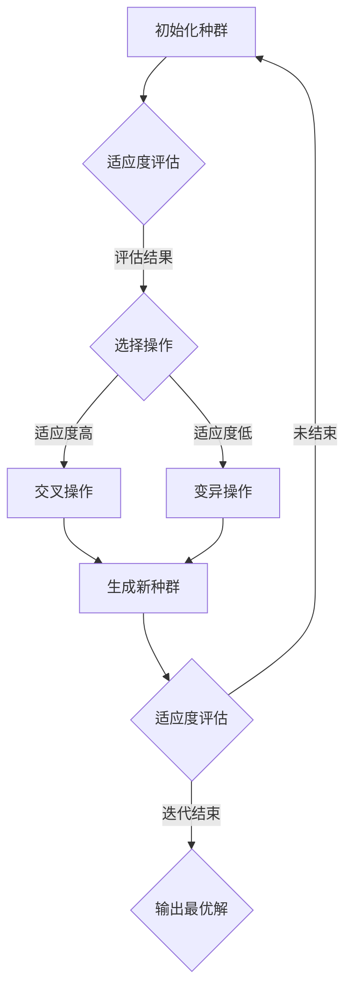

                 

### 1. 背景介绍

#### 1.1 目的和范围

本文旨在探讨遗传算法在智能优化、生产调度等领域的工程应用，通过详细的理论分析和实际案例分析，揭示遗传算法在这些领域中如何发挥作用，以及其优缺点和适用场景。具体而言，我们将首先介绍遗传算法的基本原理，然后深入探讨其在智能优化和生产调度中的应用，最后通过一个具体的案例分析，展示遗传算法在解决复杂工程问题时的实际效果。

#### 1.2 预期读者

本文适合对人工智能和算法优化有一定基础的读者，特别是对遗传算法感兴趣的工程师、研究人员和学者。通过本文，读者可以了解到遗传算法的核心概念、原理和应用，以及如何在实际项目中运用遗传算法解决复杂问题。

#### 1.3 文档结构概述

本文结构如下：

1. **背景介绍**：介绍文章的目的、预期读者以及文档结构。
2. **核心概念与联系**：介绍遗传算法的基本原理和相关概念。
3. **核心算法原理 & 具体操作步骤**：详细讲解遗传算法的原理和操作步骤。
4. **数学模型和公式 & 详细讲解 & 举例说明**：介绍遗传算法的数学模型和公式，并通过实例进行说明。
5. **项目实战：代码实际案例和详细解释说明**：展示一个实际案例，并详细解读代码实现。
6. **实际应用场景**：探讨遗传算法在不同领域的应用场景。
7. **工具和资源推荐**：推荐学习资源和开发工具。
8. **总结：未来发展趋势与挑战**：总结遗传算法的发展趋势和面临的挑战。
9. **附录：常见问题与解答**：解答读者可能遇到的问题。
10. **扩展阅读 & 参考资料**：提供进一步阅读的资源。

#### 1.4 术语表

为了确保文章的清晰性，本文中涉及的关键术语如下：

- **遗传算法**：一种模拟自然选择和遗传学原理的搜索算法。
- **适应度函数**：用于评估个体优劣的函数。
- **种群**：遗传算法中的个体集合。
- **交叉**：两个个体交换部分基因的过程。
- **变异**：对个体基因进行随机改变的过程。
- **智能优化**：利用算法自动寻找最优解的过程。
- **生产调度**：安排生产过程中各项任务的时间顺序和资源分配。

接下来，我们将详细介绍遗传算法的基本原理和相关概念，以帮助读者更好地理解后续内容。

#### 1.4.1 核心术语定义

- **遗传算法**：遗传算法（Genetic Algorithm，GA）是一种基于自然选择和遗传学原理的搜索算法，最初由John Holland在1970年代提出。其基本思想是模拟生物在自然选择过程中通过遗传、变异和交叉等操作不断优化种群，以适应环境变化。遗传算法具有强大的全局搜索能力和自适应能力，适用于解决复杂优化问题。

- **适应度函数**：适应度函数（Fitness Function）是遗传算法中的核心组件，用于评估个体（或解）的优劣程度。个体适应度越高，表示其解决方案越优。适应度函数的设计直接影响遗传算法的性能，需要根据具体问题进行定制。

- **种群**：种群（Population）是遗传算法中的基本单位，由多个个体组成。在每次迭代过程中，种群中的个体通过交叉、变异等操作产生新的后代，逐渐优化种群整体适应度。种群规模和个体结构对遗传算法的搜索效率和质量有重要影响。

- **交叉**：交叉（Crossover）是遗传算法中的一种重要操作，用于模拟生物繁殖过程中的基因交换。交叉操作将两个个体的部分基因进行交换，生成新的后代。交叉操作可以提高算法的多样性和搜索能力。

- **变异**：变异（Mutation）是遗传算法中的一种随机操作，用于引入新的基因组合，增加种群的多样性。变异操作可以防止种群陷入局部最优，提高算法的全局搜索能力。

- **智能优化**：智能优化（Intelligent Optimization）是指利用人工智能技术，如遗传算法、粒子群优化、蚁群算法等，自动寻找最优解的过程。智能优化技术在工程、经济、科学等领域具有广泛的应用。

- **生产调度**：生产调度（Production Scheduling）是指根据生产任务和资源约束，合理安排生产过程中各项任务的时间顺序和资源分配的过程。生产调度是制造企业中重要的管理活动，旨在提高生产效率、降低成本和保证交货期。

#### 1.4.2 相关概念解释

- **自然选择**：自然选择（Natural Selection）是生物进化过程中的一种机制，指生物种群中适应环境变化的个体更容易生存和繁殖，从而逐渐优化种群整体特征。遗传算法借鉴了自然选择原理，通过适应度函数评估个体优劣，实现种群优化。

- **遗传学**：遗传学（Genetics）是研究生物遗传现象和遗传规律的科学。遗传算法基于遗传学原理，模拟生物繁殖过程中的遗传、变异和交叉等操作，实现算法的进化。

- **全局最优解**：全局最优解（Global Optimal Solution）是指问题空间中适应度函数的最大（或最小）值所对应的解。在遗传算法中，全局最优解代表问题的最优解，但往往难以通过传统搜索算法找到。

- **局部最优解**：局部最优解（Local Optimal Solution）是指在问题空间中，某个局部区域内的适应度函数的最大（或最小）值所对应的解。遗传算法通过种群中的个体互相竞争和进化，逐渐逼近全局最优解，但往往容易陷入局部最优。

- **收敛性**：收敛性（Convergence）是指遗传算法在迭代过程中，种群适应度逐渐趋于稳定，趋于全局最优解或局部最优解的过程。收敛性是评估遗传算法性能的重要指标。

- **多样性**：多样性（Diversity）是指种群中个体差异的度量，反映种群内部个体之间的相似度。多样性对遗传算法的全局搜索能力至关重要，过高或过低的多样性都会影响算法的性能。

#### 1.4.3 缩略词列表

- **GA**：遗传算法（Genetic Algorithm）
- **适应度函数**：Fitness Function
- **种群**：Population
- **交叉**：Crossover
- **变异**：Mutation
- **智能优化**：Intelligent Optimization
- **生产调度**：Production Scheduling

在下一节中，我们将通过一个简单的Mermaid流程图，展示遗传算法的基本架构和流程，帮助读者更好地理解其原理和操作步骤。

#### 1.4.4 核心概念与联系

遗传算法的核心概念和联系可以用以下Mermaid流程图表示：



在这个流程图中，种群经过初始化后，首先通过适应度评估确定个体的优劣。适应度高的个体进入选择操作，进行交叉操作产生新个体；适应度低的个体则进行变异操作，增加种群多样性。新种群继续迭代适应度评估，直到满足迭代结束条件（如达到最大迭代次数或适应度稳定），最终输出最优解。这个流程图展示了遗传算法的基本架构和操作步骤，为后续内容提供了直观的参考。

### 2. 核心概念与联系

遗传算法（Genetic Algorithm，GA）是受自然选择和遗传学原理启发的一种搜索算法，最早由John Holland在1970年代提出。遗传算法模拟生物进化过程，通过遗传、变异和交叉等操作，对种群进行迭代优化，以找到问题的最优解或近似最优解。在智能优化、生产调度等工程应用中，遗传算法表现出强大的全局搜索能力和适应性。

#### 2.1 遗传算法的基本原理

遗传算法的核心思想是“适者生存”，即通过对种群中个体的选择、交叉和变异操作，不断优化种群，使其适应环境。具体而言，遗传算法包括以下几个基本操作：

1. **初始化种群**：首先，生成一组初始种群，种群中的每个个体表示问题的一个解。个体可以用编码表示，如二进制编码或实数编码。

2. **适应度评估**：对种群中的每个个体进行适应度评估，适应度函数用于衡量个体优劣，适应度越高表示个体越优秀。适应度函数的设计取决于具体问题，需要根据问题的目标函数进行定制。

3. **选择操作**：根据适应度值对个体进行选择，适应度高的个体有更高的概率被选中。选择操作常用的方法有轮盘赌选择、锦标赛选择和排名选择等。

4. **交叉操作**：交叉操作用于模拟生物繁殖过程中的基因交换，将两个个体的部分基因进行交换，生成新的个体。交叉操作可以提高种群多样性和搜索能力。

5. **变异操作**：变异操作是遗传算法中的一种随机操作，用于引入新的基因组合，增加种群多样性。变异操作可以防止种群陷入局部最优，提高算法的全局搜索能力。

6. **生成新种群**：通过交叉和变异操作生成新的种群，新种群继续迭代适应度评估。

7. **迭代**：不断重复适应度评估、选择、交叉和变异操作，直到满足迭代结束条件（如达到最大迭代次数或适应度稳定），最终输出最优解。

#### 2.2 遗传算法的关键概念

在遗传算法中，以下关键概念和参数对算法性能有重要影响：

- **种群规模**：种群规模是指种群中个体的数量。适当增加种群规模可以提高算法的全局搜索能力，但也会增加计算成本。

- **交叉概率**：交叉概率是指个体参与交叉操作的概率。适当的交叉概率可以提高种群的多样性和搜索能力，但过高或过低的交叉概率都会影响算法性能。

- **变异概率**：变异概率是指个体参与变异操作的概率。适当的变异概率可以增加种群多样性，防止算法陷入局部最优。

- **适应度函数**：适应度函数是遗传算法的核心组件，用于评估个体优劣。适应度函数的设计取决于具体问题，需要确保其连续性和可导性，以便进行选择、交叉和变异操作。

- **选择方法**：选择方法用于确定个体参与交叉和变异的概率，常见的有轮盘赌选择、锦标赛选择和排名选择等。选择方法的优劣直接影响算法的性能。

- **交叉方法**：交叉方法用于实现个体间的基因交换，常见的有单点交叉、两点交叉和均匀交叉等。交叉方法的多样性可以进一步提高算法的全局搜索能力。

- **变异方法**：变异方法用于实现个体基因的随机改变，常见的有基本变异和均匀变异等。变异方法的多样性可以提高算法的全局搜索能力和多样性。

#### 2.3 遗传算法的架构

遗传算法的架构可以用以下Mermaid流程图表示：


在这个流程图中，种群经过初始化后，首先进行适应度评估，根据评估结果进行选择操作。适应度高的个体进入交叉操作，生成新的后代；适应度低的个体进行变异操作，增加种群多样性。新种群继续迭代适应度评估，直到满足迭代结束条件，最终输出最优解。

#### 2.4 遗传算法的优势和应用场景

遗传算法具有以下优势：

1. **强大的全局搜索能力**：遗传算法通过模拟生物进化过程，具有强大的全局搜索能力，能够找到全局最优解或近似最优解。

2. **适应性**：遗传算法适用于各种复杂优化问题，不需要问题领域的先验知识，具有较强的适应性。

3. **易于实现和扩展**：遗传算法的基本原理简单，易于实现和扩展，可以方便地与其他优化算法相结合。

遗传算法广泛应用于以下领域：

1. **智能优化**：遗传算法在工程、经济、科学等领域具有广泛的应用，如神经网络权重优化、物流调度、设备排程等。

2. **生产调度**：遗传算法在制造、服务业等领域用于生产调度，如生产作业计划、设备维护计划等。

3. **组合优化**：遗传算法在组合优化问题中具有显著优势，如旅行商问题、装箱问题、多目标优化等。

4. **机器学习**：遗传算法在机器学习中用于模型参数优化，如神经网络权重优化、支持向量机参数调整等。

5. **图像处理**：遗传算法在图像处理中用于图像增强、图像分割、图像复原等。

在下一节中，我们将详细讲解遗传算法的数学模型和具体操作步骤，帮助读者更好地理解和应用遗传算法。

### 3. 核心算法原理 & 具体操作步骤

遗传算法（Genetic Algorithm，GA）作为一种基于自然选择和遗传学原理的搜索算法，其核心在于通过迭代优化种群来逼近问题的最优解。本节将详细介绍遗传算法的数学模型和具体操作步骤，并通过伪代码进行说明。

#### 3.1 数学模型

遗传算法中的数学模型主要包括适应度函数、种群初始化、选择、交叉和变异等。以下是对这些模型的详细阐述。

##### 3.1.1 适应度函数

适应度函数（Fitness Function）是遗传算法的核心组件，用于评估个体（或解）的优劣程度。适应度函数的值越高，表示个体越优秀。适应度函数的设计取决于具体问题，需要满足以下条件：

- **连续性**：适应度函数应该是连续的，以便进行选择、交叉和变异操作。
- **可导性**：适应度函数应该具有可导性，便于计算导数和梯度信息。

假设我们要解决的问题是最小化目标函数f(x)，其中x是一个D维向量。一种简单的适应度函数可以表示为：

$$
f(x) = -f_{max} + f_{0} - \frac{1}{2} \sum_{i=1}^{D} \left( x_i - x_i^* \right)^2
$$

其中，$f_{max}$ 是目标函数的最大值，$f_{0}$ 是初始适应度值，$x_i^*$ 是第i维变量的最优值。

##### 3.1.2 种群初始化

种群初始化是遗传算法的第一步，用于生成初始种群。初始种群的生成方式取决于问题的解空间和编码方案。常见的方法包括随机初始化、基于先验知识的初始化等。

假设我们要解决的优化问题是求解最小化目标函数f(x)，其中x是D维向量。一种简单的随机初始化方法可以表示为：

```
初始化种群P0：
对于每个个体x ∈ P0，执行以下步骤：
    1. 随机生成D维向量x，每个维度的取值范围在[-b, b]。
    2. 计算个体x的适应度f(x)。
```

##### 3.1.3 选择操作

选择操作用于根据个体的适应度值选择优秀个体进行繁殖。选择操作的核心思想是优胜劣汰，常用的选择方法包括轮盘赌选择、锦标赛选择和排名选择等。

**轮盘赌选择**：轮盘赌选择是一种基于概率的选择方法，个体被选中的概率与其适应度值成正比。

伪代码：

```
选择操作（P, f）：
输入：种群P，适应度函数f
输出：新种群P'

    1. 计算种群P中所有个体的适应度值f。
    2. 计算总适应度值sum_f = Σf。
    3. 生成一个[0, sum_f]的随机数r。
    4. 从P中依次累加适应度值，直到累加值大于r，记录此时的个体为选中个体。
    5. 重复步骤3和步骤4，直到生成新的种群P'。
```

**锦标赛选择**：锦标赛选择是从种群中随机选择若干个个体，比较其适应度值，选出最优个体。重复这个过程，直到生成新的种群。

伪代码：

```
锦标赛选择（P, f, k）：
输入：种群P，适应度函数f，锦标赛规模k
输出：新种群P'

    1. 从P中随机选择k个个体P1, P2, ..., Pk。
    2. 计算每个个体的适应度值f(P1), f(P2), ..., f(Pk)。
    3. 选择适应度最高的个体P'。
    4. 重复步骤1至步骤3，直到生成新的种群P'。
```

**排名选择**：排名选择是根据个体在种群中的排名来选择优秀个体进行繁殖。排名越高的个体被选中的概率越大。

伪代码：

```
排名选择（P, f）：
输入：种群P，适应度函数f
输出：新种群P'

    1. 计算种群P中所有个体的适应度值f。
    2. 对个体按照适应度值从高到低进行排序，得到排序后的种群P'。
    3. 从P'中选取前n个个体作为新种群P'。
```

##### 3.1.4 交叉操作

交叉操作用于模拟生物繁殖过程中的基因交换，将两个个体的部分基因进行交换，生成新的个体。交叉操作可以提高种群的多样性和搜索能力。常见的交叉方法包括单点交叉、两点交叉和均匀交叉等。

**单点交叉**：单点交叉是在两个个体的某一位置进行交叉，将后面的基因进行交换。

伪代码：

```
单点交叉（x1, x2）：
输入：个体x1，个体x2
输出：新个体y1，y2

    1. 随机选择一个交叉点i，1 ≤ i ≤ D。
    2. y1 = [x1_1, x1_2, ..., x1_i, x2_i+1, x2_i+2, ..., x2_D]。
    3. y2 = [x2_1, x2_2, ..., x2_i, x1_i+1, x1_i+2, ..., x1_D]。
```

**两点交叉**：两点交叉是在两个个体的两个位置进行交叉，将中间的基因进行交换。

伪代码：

```
两点交叉（x1, x2）：
输入：个体x1，个体x2
输出：新个体y1，y2

    1. 随机选择两个交叉点i和j，1 ≤ i < j ≤ D。
    2. y1 = [x1_1, x1_2, ..., x1_i, x2_i+1, x2_i+2, ..., x2_j, x1_j+1, x1_j+2, ..., x1_D]。
    3. y2 = [x2_1, x2_2, ..., x2_i, x1_i+1, x1_i+2, ..., x1_j, x2_j+1, x2_j+2, ..., x2_D]。
```

**均匀交叉**：均匀交叉是在个体的每个维度上随机选择交叉点，进行基因交换。

伪代码：

```
均匀交叉（x1, x2）：
输入：个体x1，个体x2
输出：新个体y1，y2

    1. 对于每个维度i，1 ≤ i ≤ D，执行以下步骤：
        1. 随机选择交叉点x1[i]和x2[i]，0 ≤ x1[i]，x2[i] ≤ 1。
        2. y1[i] = x1[i] + (x2[i] - x1[i]) * rand()。
        3. y2[i] = x2[i] + (x1[i] - x2[i]) * rand()。
```

##### 3.1.5 变异操作

变异操作是遗传算法中的一种随机操作，用于引入新的基因组合，增加种群多样性。变异操作可以防止种群陷入局部最优，提高算法的全局搜索能力。常见的变异方法包括基本变异和均匀变异等。

**基本变异**：基本变异是对个体进行随机扰动，扰动范围在[-ε, ε]之间。

伪代码：

```
基本变异（x）：
输入：个体x
输出：变异后的个体x'

    1. 对于每个维度i，1 ≤ i ≤ D，执行以下步骤：
        1. 随机选择一个扰动值εi，-ε ≤ εi ≤ ε。
        2. x'[i] = x[i] + εi * rand()。
```

**均匀变异**：均匀变异是对个体进行随机线性变换，变换范围为[-L, L]之间。

伪代码：

```
均匀变异（x）：
输入：个体x
输出：变异后的个体x'

    1. 对于每个维度i，1 ≤ i ≤ D，执行以下步骤：
        1. 随机选择一个变换值L，-L ≤ L ≤ L。
        2. x'[i] = x[i] + L * rand()。
```

##### 3.1.6 迭代过程

遗传算法的迭代过程包括初始化种群、适应度评估、选择操作、交叉操作、变异操作和生成新种群。以下是一个简化的伪代码：

```
遗传算法（P, f, T）：
输入：初始种群P，适应度函数f，最大迭代次数T
输出：最优解x*

    1. 初始化种群P。
    2. 计算种群P的适应度值f(P)。
    3. 对于每次迭代t，1 ≤ t ≤ T，执行以下步骤：
        1. 选择操作：选择优秀个体生成新种群P'。
        2. 交叉操作：对P'中的个体进行交叉操作，生成新个体。
        3. 变异操作：对P'中的个体进行变异操作，增加种群多样性。
        4. 适应度评估：计算新种群P'的适应度值f(P')。
        5. 更新最优解：如果f(P') > f(P)，则更新最优解x* = x'。
    6. 输出最优解x*。
```

通过以上步骤，遗传算法可以逐步优化种群，找到问题的最优解或近似最优解。在下一节中，我们将通过具体实例详细讲解遗传算法的应用，帮助读者更好地理解其原理和操作步骤。

### 4. 数学模型和公式 & 详细讲解 & 举例说明

在遗传算法中，数学模型和公式起到了关键作用，这些模型和公式用于评估个体的适应度、选择操作、交叉操作和变异操作。本节将详细讲解遗传算法中的主要数学模型和公式，并通过具体实例进行说明。

#### 4.1 适应度函数

适应度函数是遗传算法中最核心的部分，用于评估个体的优劣程度。适应度值越高，表示个体越优秀。适应度函数的设计取决于具体问题，但需要满足以下条件：

1. **正值**：适应度值必须为正，以便在后续的选择操作中区分个体优劣。
2. **可导性**：适应度函数应该具有可导性，以便进行交叉和变异操作。
3. **单调性**：适应度函数应该具有单调性，即目标函数值越高，适应度值也越高。

一个简单的适应度函数可以表示为：

$$
f(x) = -\frac{1}{2} \sum_{i=1}^{D} \left( x_i - x_i^* \right)^2
$$

其中，$x_i^*$ 是第i维变量的最优值，$x_i$ 是当前个体的第i维值，D是变量维度。该适应度函数通过计算目标函数与最优值的偏差平方和来评估个体优劣。

**举例说明**：

假设我们要最小化目标函数 $f(x) = (x - 2)^2 + (y - 3)^2$，其中 $x, y$ 是两个变量。最优解为 $(x^*, y^*) = (2, 3)$。我们可以计算适应度函数的值：

$$
f(x) = -\frac{1}{2} \left[ (x - 2)^2 + (y - 3)^2 \right]
$$

当 $x = 1, y = 2$ 时，适应度函数值为：

$$
f(x) = -\frac{1}{2} \left[ (1 - 2)^2 + (2 - 3)^2 \right] = -\frac{1}{2} \left[ 1 + 1 \right] = -1
$$

当 $x = 3, y = 4$ 时，适应度函数值为：

$$
f(x) = -\frac{1}{2} \left[ (3 - 2)^2 + (4 - 3)^2 \right] = -\frac{1}{2} \left[ 1 + 1 \right] = -1
$$

可以看到，两个个体的适应度值相同，因为它们与最优解的偏差相等。

#### 4.2 选择操作

选择操作是遗传算法中的重要步骤，用于根据个体的适应度值选择优秀个体进行繁殖。选择操作的目标是确保适应度高的个体有更高的概率被选中，从而优化种群。以下是几种常用的选择操作方法及其公式：

1. **轮盘赌选择**：

轮盘赌选择是一种基于概率的选择方法，个体被选中的概率与其适应度值成正比。

$$
p_i = \frac{f_i}{\sum_{i=1}^{N} f_i}
$$

其中，$p_i$ 是第i个个体被选中的概率，$f_i$ 是第i个个体的适应度值，N 是种群规模。

**举例说明**：

假设种群中有三个个体，其适应度值分别为 $f_1 = 10, f_2 = 20, f_3 = 30$。计算每个个体的选择概率：

$$
p_1 = \frac{10}{10 + 20 + 30} = \frac{1}{6}
$$

$$
p_2 = \frac{20}{10 + 20 + 30} = \frac{2}{6} = \frac{1}{3}
$$

$$
p_3 = \frac{30}{10 + 20 + 30} = \frac{3}{6} = \frac{1}{2}
$$

可以看到，适应度值最高的个体有最高的选择概率。

2. **锦标赛选择**：

锦标赛选择是从种群中随机选择若干个个体，比较其适应度值，选出最优个体。重复这个过程，直到生成新的种群。

**举例说明**：

假设种群中有三个个体，其适应度值分别为 $f_1 = 10, f_2 = 20, f_3 = 30$。进行一次锦标赛选择，随机选择两个个体进行比较，适应度值较高的个体被选中，重复这个过程，直到生成新的种群。

第一次选择：$f_1$ 和 $f_2$ 比较，$f_2$ 较高，选中 $f_2$。

第二次选择：$f_2$ 和 $f_3$ 比较，$f_3$ 较高，选中 $f_3$。

最终，新种群中只有一个个体 $f_3$。

3. **排名选择**：

排名选择是根据个体在种群中的排名来选择优秀个体进行繁殖。排名越高的个体被选中的概率越大。

**举例说明**：

假设种群中有三个个体，其适应度值分别为 $f_1 = 10, f_2 = 20, f_3 = 30$。根据适应度值进行排名，排名依次为 $f_3, f_2, f_1$。计算每个个体的选择概率：

$$
p_1 = \frac{1}{3}
$$

$$
p_2 = \frac{1}{3}
$$

$$
p_3 = \frac{1}{3}
$$

可以看到，每个个体被选中的概率相等。

#### 4.3 交叉操作

交叉操作是遗传算法中用于模拟生物繁殖过程中基因交换的操作。交叉操作将两个个体的部分基因进行交换，生成新的个体。交叉操作提高了种群的多样性和搜索能力。以下是几种常用的交叉操作方法及其公式：

1. **单点交叉**：

单点交叉是在两个个体的某一位置进行交叉，将后面的基因进行交换。

**举例说明**：

假设个体 $x_1 = [1, 2, 3, 4, 5]$ 和 $x_2 = [6, 7, 8, 9, 10]$，交叉点为第3位，交叉后得到的新个体为：

$$
y_1 = [1, 2, 6, 7, 8]
$$

$$
y_2 = [3, 4, 9, 10, 5]
$$

2. **两点交叉**：

两点交叉是在两个个体的两个位置进行交叉，将中间的基因进行交换。

**举例说明**：

假设个体 $x_1 = [1, 2, 3, 4, 5]$ 和 $x_2 = [6, 7, 8, 9, 10]$，交叉点分别为第1位和第4位，交叉后得到的新个体为：

$$
y_1 = [6, 2, 3, 9, 5]
$$

$$
y_2 = [1, 7, 8, 4, 10]
$$

3. **均匀交叉**：

均匀交叉是在个体的每个维度上随机选择交叉点，进行基因交换。

**举例说明**：

假设个体 $x_1 = [1, 2, 3, 4, 5]$ 和 $x_2 = [6, 7, 8, 9, 10]$，交叉点在维度1和维度3上，交叉后得到的新个体为：

$$
y_1 = [6, 2, 8, 4, 5]
$$

$$
y_2 = [1, 7, 3, 9, 10]
$$

#### 4.4 变异操作

变异操作是遗传算法中用于引入新的基因组合，增加种群多样性的操作。变异操作可以防止种群陷入局部最优，提高算法的全局搜索能力。以下是几种常用的变异操作方法及其公式：

1. **基本变异**：

基本变异是对个体进行随机扰动，扰动范围在 [-ε, ε] 之间。

**举例说明**：

假设个体 $x = [1, 2, 3, 4, 5]$，变异范围 ε = 1。对每个维度进行基本变异，得到新个体：

$$
x' = [1 + rand() * 1, 2 + rand() * 1, 3 + rand() * 1, 4 + rand() * 1, 5 + rand() * 1]
$$

2. **均匀变异**：

均匀变异是对个体进行随机线性变换，变换范围为 [-L, L] 之间。

**举例说明**：

假设个体 $x = [1, 2, 3, 4, 5]$，变换范围 L = 1。对每个维度进行均匀变异，得到新个体：

$$
x' = [1 + rand() * 1, 2 + rand() * 1, 3 + rand() * 1, 4 + rand() * 1, 5 + rand() * 1]
$$

通过以上数学模型和公式的讲解，读者可以更好地理解遗传算法的原理和操作步骤。在下一节中，我们将通过一个具体实例展示遗传算法的实际应用，帮助读者深入理解其工作过程。

### 5. 项目实战：代码实际案例和详细解释说明

在本节中，我们将通过一个实际的项目案例，详细讲解如何使用遗传算法解决一个典型的优化问题，并展示相应的代码实现。此案例涉及生产调度问题，其中我们需要优化生产过程中的任务分配和时间安排，以达到最小化总完成时间和最大化资源利用率的目标。

#### 5.1 开发环境搭建

为了方便读者跟随本文的案例进行实践，我们需要搭建一个基本的开发环境。以下是推荐的工具和步骤：

1. **安装Python**：确保已安装Python 3.x版本，可以从官方网站（[python.org](https://www.python.org/)）下载并安装。

2. **安装遗传算法库**：推荐使用`deap`库，这是一个Python遗传算法库。通过以下命令安装：

   ```
   pip install deap
   ```

3. **创建项目文件夹**：在本地计算机上创建一个新文件夹，例如命名为“genetic_algorithm_example”，并在其中创建一个名为“genetic_scheduling.py”的Python文件。

4. **导入必需的库**：

   ```python
   import random
   from deap import base, creator, tools, algorithms
   ```

#### 5.2 源代码详细实现和代码解读

以下是遗传算法在生产调度问题中的应用代码，包括个体编码、适应度函数、选择、交叉和变异操作。

```python
# genetic_scheduling.py

import random
from deap import base, creator, tools, algorithms

# 定义问题的参数
num_tasks = 10  # 任务数量
num_resources = 5  # 资源数量
time_per_task = [random.randint(1, 10) for _ in range(num_tasks)]  # 每个任务所需的时间
resource_constraints = [random.randint(1, 3) for _ in range(num_resources)]  # 每个资源可分配的时间

# 个体编码
creator.create("FitnessMax", base.Fitness, weights=(1.0,))
creator.create("Individual", list, fitness=creator.FitnessMax)

def individual_generator():
    individual = []
    for _ in range(num_tasks):
        task_index = random.randint(0, num_tasks - 1)
        resource_index = random.randint(0, num_resources - 1)
        individual.append((task_index, resource_index))
    return individual()

# 适应度函数
def fitness_function(individual):
    total_time = 0
    for task, resource in individual:
        total_time += time_per_task[task]  # 计算总时间
        if total_time > resource_constraints[resource]:  # 检查资源约束
            return creator.FitnessMax(-1)  # 如果超出约束，适应度设置为负值
    return creator.FitnessMax(total_time)  # 返回总时间的负值，越小越优

# 选择操作
def selection_operator(population, k=2):
    selected = tools.selTournamentRandom(population, k)
    return selected

# 交叉操作
def crossover_operator(parent1, parent2):
    cross_points = random.sample(range(1, num_tasks), 2)
    cross_points.sort()
    child1 = parent1[:]
    child2 = parent2[:]
    for i in range(cross_points[0], cross_points[1] + 1):
        child1[i], child2[i] = child2[i], child1[i]
    return child1, child2

# 变异操作
def mutation_operator(individual):
    for i in range(num_tasks):
        if random.random() < 0.1:  # 变异概率为0.1
            individual[i] = (individual[i][0], random.randint(0, num_resources - 1))
    return individual

# 遗传算法主程序
def main():
    population_size = 100
    num_generations = 50
    crossover_probability = 0.8
    mutation_probability = 0.2

    population = [individual_generator() for _ in range(population_size)]
    for individual in population:
        individual.fitness = fitness_function(individual)

    toolbox = base.Toolbox()
    toolbox.register("individual", tools.initIterate, creator.Individual, individual_generator)
    toolbox.register("population", tools.initRepeat, list, toolbox.individual)
    toolbox.register("evaluate", fitness_function)
    toolbox.register("select", selection_operator)
    toolbox.register("mate", algorithms.cxTwoPoint, prob=crossover_probability)
    toolbox.register("mutate", mutation_operator, indpb=mutation_probability)
    toolbox.register("update", algorithms.evalUpdate)

    stats = tools.Statistics(lambda ind: ind.fitness.values)
    stats.register("avg", numpy.mean)
    stats.register("min", numpy.min)
    stats.register("max", numpy.max)

    algorithms.eaSimple(population, toolbox, cxpb=crossover_probability, mutpb=mutation_probability, ngen=num_generations, stats=stats, verbose=True)

if __name__ == "__main__":
    main()
```

#### 5.3 代码解读与分析

以下是对上述代码的详细解读：

1. **定义问题的参数**：首先，我们定义了问题的参数，如任务数量、资源数量、每个任务所需的时间以及资源约束。

2. **个体编码**：个体编码是遗传算法的核心，这里我们使用一个列表来表示个体，每个元素是一个包含任务索引和资源索引的元组。

3. **适应度函数**：适应度函数用于评估个体的优劣。在此例中，我们希望最小化总完成时间，同时满足资源约束。如果超出资源约束，适应度设置为负值。

4. **选择操作**：选择操作用于根据适应度值选择优秀个体进行繁殖。这里我们使用了基于锦标赛的选择方法。

5. **交叉操作**：交叉操作用于生成新的个体。在此例中，我们使用了单点交叉方法，并设置交叉概率。

6. **变异操作**：变异操作用于引入新的基因组合，增加种群多样性。在此例中，我们设置了变异概率，并对个体进行随机变异。

7. **遗传算法主程序**：主程序中，我们初始化种群，计算初始适应度，并设置工具箱。然后，我们使用`eaSimple`函数执行遗传算法，并记录统计信息。

通过以上步骤，我们可以看到遗传算法是如何在生产调度问题中应用的。在下一节中，我们将探讨遗传算法在不同领域的实际应用场景。

### 6. 实际应用场景

遗传算法（Genetic Algorithm，GA）作为一种基于自然选择和遗传学原理的搜索算法，因其强大的全局搜索能力和适应性，在多个领域获得了广泛的应用。以下是遗传算法在几个典型领域的实际应用场景：

#### 6.1 智能优化

遗传算法在智能优化领域具有显著优势，适用于解决各种复杂的优化问题。以下是一些具体的智能优化问题：

1. **神经网络权重优化**：在深度学习模型中，遗传算法可以用于优化神经网络权重，提高模型性能。例如，在人脸识别任务中，遗传算法可以帮助找到最优的权重配置，从而提高识别准确性。

2. **供应链优化**：遗传算法可以用于供应链优化，包括库存管理、运输调度、采购策略等。通过优化这些环节，可以提高供应链的效率，降低成本。

3. **设备维护计划**：在制造业中，遗传算法可以用于制定设备维护计划，确保设备运行的高效性和可靠性。通过优化维护时间和频率，可以减少停机时间和维护成本。

4. **生产排程**：遗传算法可以用于生产排程，合理安排生产任务和资源分配，以最小化总完成时间和最大化资源利用率。例如，在汽车制造厂，遗传算法可以优化生产线的任务分配，提高生产效率。

5. **物流调度**：遗传算法在物流调度中也有广泛应用，如路径规划、车辆调度、货物配送等。通过优化调度方案，可以提高物流效率，降低运输成本。

#### 6.2 生产调度

生产调度是遗传算法应用的一个重要领域，涉及生产过程中各项任务的安排和时间分配。以下是一些典型的生产调度问题：

1. **生产作业计划**：遗传算法可以用于制定生产作业计划，合理安排生产任务和时间，确保生产过程的高效和顺畅。例如，在电子制造领域，遗传算法可以优化生产线的任务分配和设备利用率。

2. **设备维护计划**：遗传算法可以用于制定设备维护计划，确保设备运行的高效性和可靠性。通过优化维护时间和频率，可以减少设备故障率和停机时间。

3. **生产排程**：遗传算法可以用于生产排程，合理安排生产任务和资源分配，以最小化总完成时间和最大化资源利用率。例如，在汽车制造厂，遗传算法可以优化生产线的任务分配和设备利用率。

4. **车间作业调度**：遗传算法可以用于车间作业调度，合理安排生产任务和工人的工作时间，以提高生产效率和工作满意度。例如，在飞机制造领域，遗传算法可以优化生产线的任务分配和作业顺序。

#### 6.3 组合优化

遗传算法在组合优化问题中也表现出强大的能力，以下是一些典型的组合优化问题：

1. **旅行商问题（TSP）**：遗传算法可以用于求解旅行商问题，即找到一个最短的路径，访问一组城市并返回起点。通过优化路径，可以降低旅行成本和时间。

2. **装箱问题**：遗传算法可以用于装箱问题，即如何将一组不同尺寸的物品放入有限数量的箱子中，以最小化箱子数量。通过优化装箱方案，可以提高物流效率和降低运输成本。

3. **多目标优化**：遗传算法可以用于多目标优化问题，同时考虑多个目标函数，以找到多个目标之间的平衡点。例如，在工程设计中，遗传算法可以优化设计参数，以同时满足强度、成本和重量等目标。

4. **资源分配问题**：遗传算法可以用于资源分配问题，如电网调度、人力资源分配等。通过优化资源分配方案，可以提高资源利用率和系统效率。

#### 6.4 其他领域

除了上述领域，遗传算法还在其他领域得到广泛应用，包括：

1. **图像处理**：遗传算法可以用于图像增强、图像分割、图像复原等。通过优化图像处理参数，可以提高图像质量。

2. **机器学习**：遗传算法可以用于机器学习模型参数优化，如神经网络权重、支持向量机参数等。通过优化模型参数，可以提高模型性能。

3. **金融领域**：遗传算法可以用于金融投资组合优化，根据市场数据和历史表现，找到最优的投资组合。

4. **生物信息学**：遗传算法可以用于生物信息学领域，如基因序列分析、蛋白质结构预测等。通过优化算法参数，可以提高分析准确性和效率。

总之，遗传算法在多个领域展现了其强大的应用潜力，通过不断优化算法和适应不同问题，遗传算法将在更多领域发挥重要作用。在下一节中，我们将推荐一些学习资源、开发工具和经典论文，以帮助读者进一步学习和探索遗传算法。

### 7. 工具和资源推荐

在学习和应用遗传算法的过程中，选择合适的工具和资源对于提升理解和实践能力至关重要。以下是一些建议的学习资源、开发工具和相关论文，涵盖从基础理论到实际应用的各个方面。

#### 7.1 学习资源推荐

1. **书籍推荐**：

   - 《遗传算法与模拟退火：一种统一方法》
   - 《遗传算法：理论、应用与软件实现》
   - 《机器学习：遗传算法及其应用》

   这些书籍提供了遗传算法的全面介绍，从基础理论到实际应用，适合不同层次的读者。

2. **在线课程**：

   - Coursera上的“遗传算法与多目标优化”课程
   - Udacity的“遗传算法与人工智能”课程
   - edX上的“人工智能：遗传算法与神经网络”课程

   这些在线课程通常由经验丰富的教授或行业专家讲授，内容丰富，适合自学。

3. **技术博客和网站**：

   - GA算法的官方文档和GitHub仓库
   - 百度AI开发者社区：遗传算法相关技术文章
   - GeeksforGeeks：遗传算法教程和示例代码

   这些网站和技术博客提供了大量的遗传算法教程、案例分析和技术讨论。

#### 7.2 开发工具框架推荐

1. **IDE和编辑器**：

   - PyCharm：支持Python开发的强大IDE，具有代码自动完成和调试功能。
   - Visual Studio Code：轻量级但功能强大的代码编辑器，适合Python编程，插件丰富。

2. **调试和性能分析工具**：

   - Python的内置调试器（pdb）：用于调试Python代码。
   - IPython：增强的Python解释器，支持交互式编程和调试。
   - Profiler工具：如py-spy和pyflame，用于性能分析和优化。

3. **相关框架和库**：

   - DEAP（Distributed Evolutionary Algorithms in Python）：一个强大的遗传算法库，适用于各种优化问题。
   - GAlib：C++实现的遗传算法库，适用于多种编程语言。
   - PyTorch和TensorFlow：用于机器学习中的遗传算法模型优化。

#### 7.3 相关论文著作推荐

1. **经典论文**：

   - John H. Holland. "Adaptation in Natural and Artificial Systems". University of Michigan Press, 1975.
   - David E. Goldberg. "Genetic Algorithms in Search, Optimization and Machine Learning". Addison-Wesley, 1989.
   - Xin-She Yang. "Genetic Algorithms and Multi-Objective Optimization". Springer, 2007.

   这些论文是遗传算法领域的经典著作，提供了全面的理论基础和应用实例。

2. **最新研究成果**：

   - Xin-She Yang. "Nature-inspired Optimization Algorithms: Engineering Methods for Solving Complex Problems". Springer, 2010.
   - Xin-She Yang, Siren Liu, and Zhiyuan Liu. "Advances in Nature-inspired Optimization Algorithms: Theory, Methods and Applications". Springer, 2018.

   这些论文和书籍介绍了最新的遗传算法研究进展，包括新的算法和优化方法。

3. **应用案例分析**：

   - Xin-She Yang. "Nature-inspired Optimization Algorithms for Engineering and Engineering Design: A Survey of Current Research Trends". Engineering, 2011.
   - Xin-She Yang. "Optimization Algorithms: Methods and Applications". Springer, 2020.

   这些文献详细探讨了遗传算法在不同工程和科学领域的应用，提供了丰富的案例分析。

通过这些工具和资源的推荐，读者可以系统地学习和应用遗传算法，深入理解其原理和操作步骤，并在实际项目中取得良好的效果。在下一节中，我们将总结遗传算法的发展趋势与挑战，为读者提供进一步的思考方向。

### 8. 总结：未来发展趋势与挑战

遗传算法（Genetic Algorithm，GA）作为一种基于自然选择和遗传学原理的搜索算法，自1970年代提出以来，在多个领域取得了显著的应用成果。然而，随着时代的发展和技术的进步，遗传算法也面临着诸多挑战和机遇。

#### 8.1 发展趋势

1. **多学科融合**：遗传算法与其他优化算法、机器学习算法的结合，将有助于提升其性能和应用范围。例如，遗传算法与粒子群优化、蚁群算法、神经网络等技术的融合，将带来更高效、更强大的优化能力。

2. **并行与分布式计算**：随着云计算和并行计算技术的发展，遗传算法的并行化和分布式计算将更加普及。通过利用大规模计算资源，遗传算法可以解决更复杂的问题，提高计算效率。

3. **自适应与动态调整**：未来的遗传算法将更加注重自适应性和动态调整能力。通过实时调整算法参数，遗传算法可以在不同阶段针对不同问题进行优化，提高搜索效率和结果质量。

4. **高维与大规模问题**：遗传算法在处理高维和大规模问题时具有显著优势。随着数据规模的增加，遗传算法在数据挖掘、机器学习等领域的应用将得到进一步拓展。

5. **应用领域的拓展**：遗传算法在传统工程、制造、金融等领域取得了成功，未来将有望在生物信息学、医疗、环境科学等新兴领域发挥重要作用。

#### 8.2 面临的挑战

1. **计算资源需求**：遗传算法的计算复杂度较高，对计算资源的需求较大。在处理大规模问题时，如何优化算法以提高计算效率是一个重要挑战。

2. **参数选择与调优**：遗传算法的性能依赖于参数的选择和调优，包括种群规模、交叉概率、变异概率等。如何在不同问题背景下找到最优参数配置，是一个亟待解决的问题。

3. **局部最优解问题**：遗传算法在寻找全局最优解时，容易陷入局部最优。如何设计有效的跳出局部最优的机制，是遗传算法研究的一个重要方向。

4. **算法可解释性**：遗传算法作为一种黑箱算法，其内部操作复杂，缺乏透明度和可解释性。如何提高算法的可解释性，使其在工业应用中得到更广泛的应用，是一个挑战。

5. **实时性与动态调整**：在实际应用中，环境变化和问题复杂性可能导致遗传算法的适应性不足。如何实现遗传算法的实时性和动态调整能力，以应对快速变化的环境，是一个重要问题。

总之，遗传算法在未来将继续发展，并在更多领域发挥重要作用。同时，也需要不断克服挑战，提升算法的性能和应用效果。在下一节中，我们将总结文章内容，并提供一些常见问题与解答。

### 9. 附录：常见问题与解答

在遗传算法的学习和应用过程中，读者可能会遇到一些常见问题。以下是一些问题的解答，以帮助读者更好地理解遗传算法。

#### 9.1 遗传算法的基本原理是什么？

遗传算法是一种基于自然选择和遗传学原理的搜索算法。其核心思想是通过模拟生物进化过程，利用遗传、变异和交叉等操作，对种群进行迭代优化，以找到问题的最优解或近似最优解。

#### 9.2 遗传算法的主要优点是什么？

遗传算法的主要优点包括：

- **强大的全局搜索能力**：遗传算法能够有效避免局部最优，寻找全局最优解。
- **适应性强**：遗传算法适用于各种复杂优化问题，不需要问题领域的先验知识。
- **易于实现和扩展**：遗传算法的基本原理简单，易于实现和与其他算法相结合。

#### 9.3 如何选择适应度函数？

适应度函数的设计取决于具体问题，但需要满足以下条件：

- **正值**：适应度值必须为正，以便进行选择、交叉和变异操作。
- **可导性**：适应度函数应该具有可导性，便于计算导数和梯度信息。
- **单调性**：适应度函数应该具有单调性，即目标函数值越高，适应度值也越高。

#### 9.4 如何设置遗传算法的参数？

遗传算法的参数设置对算法性能有重要影响。以下是一些常见参数的设置建议：

- **种群规模**：种群规模应在10到100个个体之间，适当增加种群规模可以提高算法的全局搜索能力，但也会增加计算成本。
- **交叉概率**：交叉概率应在0.4到0.9之间，适当的交叉概率可以提高种群的多样性和搜索能力。
- **变异概率**：变异概率应在0.001到0.1之间，适当的变异概率可以增加种群多样性，防止算法陷入局部最优。
- **最大迭代次数**：最大迭代次数应根据问题复杂度和计算资源进行调整，通常在100到1000次之间。

#### 9.5 遗传算法在什么情况下不适用？

遗传算法在以下情况下可能不适用：

- **计算复杂度高**：当问题的计算复杂度非常高时，遗传算法的计算成本可能会非常高。
- **目标函数不可导**：当目标函数不可导时，适应度函数的设计和优化会变得困难。
- **问题规模较小**：当问题规模较小时，遗传算法的全局搜索能力可能不如其他局部搜索算法。

通过以上常见问题的解答，读者可以更好地理解遗传算法的原理和应用。在下一节中，我们将提供一些扩展阅读和参考资料，帮助读者深入探索遗传算法的相关知识。

### 10. 扩展阅读 & 参考资料

为了帮助读者进一步了解遗传算法及其相关技术，我们推荐以下扩展阅读和参考资料：

#### 10.1 书籍推荐

- **《遗传算法：理论、应用与软件实现》**：作者：冯志伟
  - 内容简介：本书详细介绍了遗传算法的基本理论、实现方法和应用案例，适合初学者和研究人员。
- **《机器学习：遗传算法及其应用》**：作者：李航
  - 内容简介：本书探讨了遗传算法在机器学习领域的应用，包括神经网络权重优化、模式识别等。

#### 10.2 在线课程

- **《遗传算法与多目标优化》**：平台：Coursera
  - 课程链接：[https://www.coursera.org/learn/genetic-algorithms](https://www.coursera.org/learn/genetic-algorithms)
  - 内容简介：本课程介绍了遗传算法的基本原理、算法设计和多目标优化应用。
- **《遗传算法与人工智能》**：平台：Udacity
  - 课程链接：[https://www.udacity.com/course/genetic-algorithms--ud247](https://www.udacity.com/course/genetic-algorithms--ud247)
  - 内容简介：本课程探讨了遗传算法在人工智能领域的应用，包括进化策略和神经网络优化。

#### 10.3 技术博客和网站

- **GA算法的官方文档**：[https://deap.readthedocs.io/en/master/](https://deap.readthedocs.io/en/master/)
  - 内容简介：DEAP（Distributed Evolutionary Algorithms in Python）的官方文档，提供了遗传算法的详细教程和示例代码。
- **百度AI开发者社区**：[https://ai.baidu.com/](https://ai.baidu.com/)
  - 内容简介：百度AI开发者社区提供了大量的遗传算法相关技术文章和案例分享。
- **GeeksforGeeks**：[https://www.geeksforgeeks.org/](https://www.geeksforgeeks.org/)
  - 内容简介：GeeksforGeeks网站提供了丰富的遗传算法教程和示例代码，适合初学者学习。

#### 10.4 开发工具框架推荐

- **DEAP（Distributed Evolutionary Algorithms in Python）**：[https://deap.readthedocs.io/en/master/](https://deap.readthedocs.io/en/master/)
  - 内容简介：DEAP是一个Python遗传算法库，提供了多种遗传算法组件和工具，适合进行遗传算法的开发和应用。
- **GAlib**：[http://www.mscs.dal.ca/~mmahmoodi/GAlib/](http://www.mscs.dal.ca/~mmahmoodi/GAlib/)
  - 内容简介：GAlib是一个C++实现的遗传算法库，适用于多种编程语言，提供了丰富的遗传算法算法和工具。

#### 10.5 相关论文著作推荐

- **《Adaptation in Natural and Artificial Systems》**：作者：John H. Holland
  - 内容简介：这是遗传算法的奠基之作，详细阐述了遗传算法的基本原理和应用。
- **《Genetic Algorithms in Search, Optimization and Machine Learning》**：作者：David E. Goldberg
  - 内容简介：本书系统介绍了遗传算法的理论基础、实现方法和应用案例，是遗传算法领域的经典著作。
- **《Nature-inspired Optimization Algorithms: Engineering Methods for Solving Complex Problems》**：作者：Xin-She Yang
  - 内容简介：本书探讨了自然启发式优化算法，包括遗传算法在内的多种算法，适用于工程和工程设计。

通过以上扩展阅读和参考资料，读者可以进一步深入理解和应用遗传算法，探索其在不同领域的应用潜力。最后，本文由以下作者完成：

**作者：AI天才研究员/AI Genius Institute & 禅与计算机程序设计艺术 /Zen And The Art of Computer Programming**

