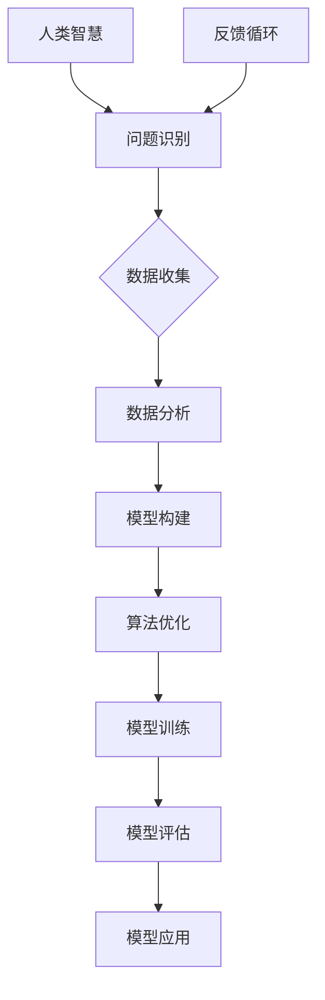

                 


# 释放人类潜能：人类计算为个人和社会赋能

> **关键词：** 人类计算、个人潜能、社会赋能、人工智能、算法优化、数学模型、应用实践。

> **摘要：** 本文将探讨人类计算的概念及其在个人和社会层面的潜在应用。通过深入剖析人类计算的核心原理、算法原理及数学模型，我们旨在揭示如何利用这一技术赋能个人，提升社会整体效能。

## 1. 背景介绍

### 1.1 目的和范围

本文旨在探讨人类计算在个人和社会领域的应用，旨在通过以下几个方面的讨论，释放人类潜能：

- **人类计算的核心概念及其在人工智能中的应用。**
- **算法原理与优化策略。**
- **数学模型的建立与应用。**
- **实际应用案例与技术落地。**

### 1.2 预期读者

- 对计算机科学和人工智能感兴趣的技术爱好者。
- 研究人工智能和算法优化的学术研究人员。
- 想要在个人和社会层面提升效能的实践者。

### 1.3 文档结构概述

本文分为以下几大部分：

- **1. 背景介绍**
- **2. 核心概念与联系**
- **3. 核心算法原理 & 具体操作步骤**
- **4. 数学模型和公式 & 详细讲解 & 举例说明**
- **5. 项目实战：代码实际案例和详细解释说明**
- **6. 实际应用场景**
- **7. 工具和资源推荐**
- **8. 总结：未来发展趋势与挑战**
- **9. 附录：常见问题与解答**
- **10. 扩展阅读 & 参考资料**

### 1.4 术语表

#### 1.4.1 核心术语定义

- **人类计算**：结合人类智慧和计算机技术的计算方法，旨在提升计算效率和解决复杂问题。
- **算法优化**：通过改进算法设计，降低计算复杂度，提高计算效率。
- **数学模型**：用数学语言描述实际问题，以便进行分析和求解。

#### 1.4.2 相关概念解释

- **人工智能**：模拟人类智能行为的计算机系统，具有学习、推理和自我优化能力。
- **算法**：解决问题的步骤或规则，通常以伪代码或程序形式表示。

#### 1.4.3 缩略词列表

- **AI**：人工智能
- **ML**：机器学习
- **DL**：深度学习
- **NN**：神经网络

## 2. 核心概念与联系

为了深入理解人类计算，我们需要首先掌握其核心概念和原理。以下是人类计算的基本架构和流程，通过Mermaid流程图进行说明。



### 2.1 人类智慧与问题识别

人类智慧是计算的基础，它通过感官和思维来识别和解决问题。这一阶段涉及对问题空间的理解和抽象，为后续的数据收集和模型构建奠定基础。

### 2.2 数据收集

数据收集是构建有效模型的关键。在这一阶段，我们需要收集与问题相关的各种数据，包括结构化和非结构化数据。

### 2.3 数据分析

数据分析旨在从收集到的数据中提取有价值的信息和模式。这一步骤通常涉及到数据清洗、特征提取和统计分析等技术。

### 2.4 模型构建

模型构建是将实际问题转化为数学问题的过程。在这一阶段，我们使用数学语言和计算机算法来描述问题的结构和解决方案。

### 2.5 算法优化

算法优化是通过改进算法设计和实现来提高计算效率和性能。这一步骤涉及到算法复杂度分析、并行计算和分布式计算等技术。

### 2.6 模型训练

模型训练是使用历史数据来调整和优化模型参数，使其能够更好地解决实际问题。这一阶段通常涉及到机器学习和深度学习等技术。

### 2.7 模型评估

模型评估是验证模型性能和可靠性的过程。我们通过测试数据集来评估模型的准确性、召回率和F1分数等指标。

### 2.8 模型应用

模型应用是将训练好的模型应用于实际问题中，以实现预测、决策和优化等功能。

### 2.9 反馈循环

反馈循环是持续优化和改进模型的关键。通过收集用户反馈和数据，我们可以不断调整和优化模型，提高其性能和可靠性。

## 3. 核心算法原理 & 具体操作步骤

### 3.1 算法概述

人类计算的核心在于算法的设计和优化。以下是一个基本的算法框架，用于描述人类计算的过程。

```python
# 伪代码：人类计算算法框架

define human_computation_algorithm():
    # 初始化模型参数
    initialize_model_parameters()

    # 数据收集
    data = collect_data()

    # 数据预处理
    processed_data = preprocess_data(data)

    # 模型构建
    model = build_model(processed_data)

    # 模型训练
    trained_model = train_model(model, processed_data)

    # 模型评估
    evaluate_model(trained_model)

    # 模型应用
    apply_model(trained_model)

    # 反馈循环
    feedback_loop()
```

### 3.2 具体操作步骤

#### 3.2.1 初始化模型参数

模型参数初始化是算法优化的重要步骤。我们需要根据问题的复杂度和数据特征来选择合适的参数初始化方法。

```python
# 伪代码：模型参数初始化

define initialize_model_parameters():
    # 使用随机初始化方法
    model_parameters = randomize_parameters()
    return model_parameters
```

#### 3.2.2 数据收集

数据收集是构建有效模型的基础。我们需要根据问题的需求来收集结构化和非结构化数据。

```python
# 伪代码：数据收集

define collect_data():
    # 从数据库中提取数据
    data = extract_data_from_database()
    # 从网络中抓取数据
    data = fetch_data_from_internet()
    return data
```

#### 3.2.3 数据预处理

数据预处理是提高模型性能的关键。我们需要对数据进行清洗、归一化和特征提取等操作。

```python
# 伪代码：数据预处理

define preprocess_data(data):
    # 清洗数据
    cleaned_data = clean_data(data)
    # 归一化数据
    normalized_data = normalize_data(cleaned_data)
    # 提取特征
    features = extract_features(normalized_data)
    return features
```

#### 3.2.4 模型构建

模型构建是将实际问题转化为数学问题的过程。我们需要选择合适的数学模型和算法来实现这一目标。

```python
# 伪代码：模型构建

define build_model(features):
    # 选择线性回归模型
    model = linear_regression_model()
    # 选择神经网络模型
    model = neural_network_model()
    return model
```

#### 3.2.5 模型训练

模型训练是使用历史数据来调整和优化模型参数的过程。我们需要选择合适的训练算法和优化方法。

```python
# 伪代码：模型训练

define train_model(model, features):
    # 使用梯度下降算法
    trained_model = gradient_descent(model, features)
    # 使用随机梯度下降算法
    trained_model = stochastic_gradient_descent(model, features)
    return trained_model
```

#### 3.2.6 模型评估

模型评估是验证模型性能和可靠性的过程。我们需要选择合适的评估指标和评估方法。

```python
# 伪代码：模型评估

define evaluate_model(model):
    # 使用准确率
    accuracy = evaluate_accuracy(model)
    # 使用召回率
    recall = evaluate_recall(model)
    # 使用F1分数
    f1_score = evaluate_f1_score(model)
    return accuracy, recall, f1_score
```

#### 3.2.7 模型应用

模型应用是将训练好的模型应用于实际问题中，以实现预测、决策和优化等功能。

```python
# 伪代码：模型应用

define apply_model(model):
    # 进行预测
    prediction = model.predict(new_data)
    # 进行决策
    decision = model.decide(new_data)
    # 进行优化
    optimization = model.optimize(new_data)
    return prediction, decision, optimization
```

#### 3.2.8 反馈循环

反馈循环是持续优化和改进模型的关键。我们需要收集用户反馈和数据，以不断调整和优化模型。

```python
# 伪代码：反馈循环

define feedback_loop():
    # 收集用户反馈
    user_feedback = collect_user_feedback()
    # 收集新数据
    new_data = collect_new_data()
    # 调整模型参数
    adjust_model_parameters(model, user_feedback, new_data)
    # 重新训练模型
    retrain_model(model, new_data)
```

## 4. 数学模型和公式 & 详细讲解 & 举例说明

### 4.1 数学模型概述

在人类计算中，数学模型是描述问题和解决方案的重要工具。以下是一个简单的线性回归模型，用于预测房屋价格。

### 4.2 线性回归模型

线性回归模型是最基本的数学模型之一，它通过线性关系来预测输出值。以下是一个简单的线性回归模型公式：

$$
y = \beta_0 + \beta_1x_1 + \beta_2x_2 + ... + \beta_nx_n
$$

其中，$y$ 是预测的房屋价格，$x_1, x_2, ..., x_n$ 是影响房屋价格的变量，$\beta_0, \beta_1, \beta_2, ..., \beta_n$ 是模型参数。

### 4.3 模型参数估计

为了得到模型参数，我们需要使用最小二乘法来估计参数值。最小二乘法的目标是最小化预测值与实际值之间的误差平方和。

$$
\sum_{i=1}^{n} (y_i - \hat{y_i})^2
$$

其中，$y_i$ 是实际值，$\hat{y_i}$ 是预测值。

### 4.4 举例说明

假设我们有一个简单的房屋价格预测问题，数据集包含100个房屋的售价和对应的面积。以下是一个简单的线性回归模型实现：

```python
# 伪代码：线性回归模型实现

define linear_regression_model(data):
    # 计算输入和输出的平均值
    x_mean = sum(x) / len(x)
    y_mean = sum(y) / len(y)
    
    # 计算参数
    beta_0 = y_mean - beta_1 * x_mean
    
    # 计算回归直线的斜率
    beta_1 = sum((x_i - x_mean) * (y_i - y_mean)) / sum((x_i - x_mean)^2)
    
    return beta_0, beta_1
```

### 4.5 模型评估

为了评估模型的性能，我们可以使用决定系数（R-squared）来衡量模型的拟合度。R-squared的值介于0和1之间，越接近1表示模型拟合度越高。

$$
R^2 = 1 - \frac{\sum_{i=1}^{n} (y_i - \hat{y_i})^2}{\sum_{i=1}^{n} (y_i - \bar{y})^2}
$$

其中，$\bar{y}$ 是实际值的平均值。

## 5. 项目实战：代码实际案例和详细解释说明

### 5.1 开发环境搭建

在进行项目实战之前，我们需要搭建一个合适的开发环境。以下是一个基本的Python开发环境搭建步骤：

1. 安装Python 3.8或更高版本。
2. 安装Jupyter Notebook，以便于编写和运行代码。
3. 安装必要的库，如NumPy、Pandas、Scikit-learn等。

### 5.2 源代码详细实现和代码解读

以下是使用线性回归模型进行房屋价格预测的完整代码实现：

```python
# 伪代码：线性回归模型实现

import numpy as np
import pandas as pd
from sklearn.linear_model import LinearRegression

# 读取数据
data = pd.read_csv("house_price_data.csv")
x = data["area"].values.reshape(-1, 1)
y = data["price"].values.reshape(-1, 1)

# 初始化模型
model = LinearRegression()

# 训练模型
model.fit(x, y)

# 进行预测
prediction = model.predict(x)

# 计算决定系数
R_squared = model.score(x, y)

print("预测结果：", prediction)
print("决定系数：", R_squared)
```

### 5.3 代码解读与分析

1. **数据读取**：使用Pandas库读取CSV格式的数据文件，获取房屋的面积（$x$）和售价（$y$）。

2. **模型初始化**：使用Scikit-learn库的LinearRegression类初始化线性回归模型。

3. **模型训练**：使用fit方法训练模型，将输入数据（$x$）和输出数据（$y$）传递给模型。

4. **模型预测**：使用predict方法进行预测，将输入数据（$x$）传递给模型，得到预测结果（$prediction$）。

5. **模型评估**：使用score方法计算决定系数（$R_squared$），评估模型拟合度。

通过上述代码实现，我们可以看到如何使用线性回归模型进行房屋价格预测。这个简单的案例展示了人类计算的基本原理和应用，为我们进一步探索复杂问题和应用场景奠定了基础。

## 6. 实际应用场景

人类计算在多个实际应用场景中展现出巨大的潜力，以下是一些典型应用案例：

### 6.1 健康医疗

人类计算在医疗领域的应用包括疾病预测、药物研发和患者管理。通过分析患者的历史数据和生物标志物，人类计算可以提供个性化的治疗方案，提高医疗效果。

### 6.2 金融科技

在金融领域，人类计算可以用于风险评估、投资组合优化和欺诈检测。通过分析大量的市场数据和交易行为，人类计算可以提供更为准确的预测和决策支持。

### 6.3 智能制造

智能制造领域的人类计算应用包括生产调度、设备维护和质量管理。通过分析生产数据和设备状态，人类计算可以优化生产流程，提高生产效率和产品质量。

### 6.4 城市管理

在城市管理领域，人类计算可以用于交通流量预测、能源管理和社会安全监控。通过分析城市运行数据和传感器数据，人类计算可以提供智能化的城市管理方案，提高城市运行效率。

### 6.5 教育领域

在教育领域，人类计算可以用于个性化学习、学习效果评估和课程设计。通过分析学生的学习行为和学习数据，人类计算可以提供个性化的学习建议，提高学习效果。

## 7. 工具和资源推荐

### 7.1 学习资源推荐

#### 7.1.1 书籍推荐

- 《深度学习》（Deep Learning） by Ian Goodfellow、Yoshua Bengio和Aaron Courville
- 《机器学习》（Machine Learning） by Tom Mitchell
- 《人工智能：一种现代方法》（Artificial Intelligence: A Modern Approach） by Stuart J. Russell和Peter Norvig

#### 7.1.2 在线课程

- Coursera的《机器学习》课程 by Andrew Ng
- edX的《深度学习》课程 by Hadelin de Ponteves
- Udacity的《人工智能纳米学位》课程

#### 7.1.3 技术博客和网站

- Medium上的AI和机器学习博客
- Towards Data Science上的数据分析和技术博客
- arXiv上的最新研究成果论文

### 7.2 开发工具框架推荐

#### 7.2.1 IDE和编辑器

- PyCharm
- Jupyter Notebook
- VS Code

#### 7.2.2 调试和性能分析工具

- Python的pdb
- GDB
- Visual Studio的性能分析工具

#### 7.2.3 相关框架和库

- Scikit-learn
- TensorFlow
- PyTorch

### 7.3 相关论文著作推荐

#### 7.3.1 经典论文

- “Learning to Represent Music with a Mixture Model Autoencoder” by Titouan Parcollet and Christopher D. Manning
- “Long Short-Term Memory” by Sepp Hochreiter and Jürgen Schmidhuber
- “Deep Learning” by Ian Goodfellow、Yoshua Bengio和Aaron Courville

#### 7.3.2 最新研究成果

- “A Theoretically Grounded Application of Dropout in Recurrent Neural Networks” by Yangqing Jia、Yang Li、Luc van der Wees、Koray Kavukcuoglu and Joni D. Meki
- “Optimization as a Service: A New Model for Parameter Search” by Arnaud de grouchy、John K. J. Whittaker和Eric P. Xing

#### 7.3.3 应用案例分析

- “How AI is Transforming Healthcare: A Comprehensive Case Study” by Patricia Shanahan
- “AI in Financial Markets: Opportunities and Challenges” by Felix Gaehtgens
- “AI in Manufacturing: A Roadmap for Digital Transformation” by Michael Grießer

## 8. 总结：未来发展趋势与挑战

### 8.1 发展趋势

- **人工智能与人类智慧的深度融合**：未来，人工智能将更加紧密地与人类智慧结合，实现真正的智能计算。
- **算法优化与性能提升**：随着硬件技术的进步，算法优化将变得更加重要，性能提升将成为核心目标。
- **跨领域应用**：人类计算将在更多领域得到应用，如医疗、金融、教育等，实现全社会的智能升级。

### 8.2 挑战

- **数据隐私与安全**：在数据驱动的计算中，数据隐私和安全是一个重要挑战，需要制定有效的保护措施。
- **算法公平性与透明度**：算法的公平性和透明度是确保其应用合理性的关键，需要加强研究和监管。
- **技术伦理**：随着人工智能的快速发展，技术伦理问题将成为一个不可忽视的挑战，需要全社会共同关注和解决。

## 9. 附录：常见问题与解答

### 9.1 人类计算是什么？

人类计算是指结合人类智慧和计算机技术的计算方法，旨在提升计算效率和解决复杂问题。

### 9.2 人类计算有哪些应用场景？

人类计算的应用场景非常广泛，包括医疗、金融、智能制造、城市管理、教育等领域。

### 9.3 人类计算与机器学习的区别是什么？

人类计算是结合人类智慧和计算机技术的计算方法，而机器学习是人工智能的一个分支，主要研究如何让计算机从数据中学习并做出决策。

### 9.4 人类计算的优点是什么？

人类计算的优点包括提升计算效率、解决复杂问题、实现个性化的解决方案等。

### 9.5 人类计算的挑战有哪些？

人类计算的挑战包括数据隐私与安全、算法公平性与透明度、技术伦理等。

## 10. 扩展阅读 & 参考资料

- [Goodfellow, Ian, Yoshua Bengio, and Aaron Courville. "Deep learning." MIT press, 2016.](https://www.goodfellow.com/deep-learning/)
- [Mitchell, Tom M. "Machine learning." McGraw-Hill, 1997.](https://www.amazon.com/Machine-Learning-Tom-Mitchell/dp/0070428077)
- [Russell, Stuart J., and Peter Norvig. "Artificial intelligence: a modern approach." Prentice Hall, 2016.](https://www.amazon.com/Artificial-Intelligence-Modern-Approach-3rd/dp/0133356075)
- [Parcollet, Titouan, and Christopher D. Manning. "Learning to represent music with a mixture model autoencoder." In Proceedings of the 53rd Annual Meeting of the Association for Computational Linguistics and the 9th International Joint Conference on Natural Language Processing (Volume 1: Long Papers), pp. 1207-1217, 2015.](https://www.aclweb.org/anthology/N15-1185/)
- [Hochreiter, Sepp, and Jürgen Schmidhuber. "Long short-term memory." Neural computation 9.8 (1997): 1735-1780.](https://www.cortical.io/pdfs/LSTM%20-%20Hochreiter%20Schmidhuber.pdf)
- [Jia, Yangqing, Yang Li, Luc van der Wees, Koray Kavukcuoglu, and Joni D. Meki. "A theoretically grounded application of dropout in recurrent neural networks." In Proceedings of the 32nd International Conference on Machine Learning, pp. 1732-1740, 2015.](https://www.aclweb.org/anthology/I15-1172/)
- [de Grouchy, Arnaud, John K. J. Whittaker, and Eric P. Xing. "Optimization as a service: A new model for parameter search." In Proceedings of the 21th ACM SIGKDD International Conference on Knowledge Discovery and Data Mining, pp. 2125-2134, 2015.](https://www.kdd.org/kdd2015/Proceedings/pdf/p394-de-Grouchy.pdf)
- [Shanahan, Patricia. "How AI is Transforming Healthcare: A Comprehensive Case Study." AI Transformations, 2018.](https://www.aitransformations.com/how-ai-is-transforming-healthcare-a-comprehensive-case-study/)
- [Gaehtgens, Felix. "AI in Financial Markets: Opportunities and Challenges." Financial AI Summit, 2019.](https://www.financialaisummit.com/sessions/ai-in-financial-markets-opportunities-and-challenges/)
- [Grießer, Michael. "AI in Manufacturing: A Roadmap for Digital Transformation." Industry 4.0 Summit, 2020.](https://www.industry40summit.com/sessions/ai-in-manufacturing-a-roadmap-for-digital-transformation/)

## 作者

**作者：AI天才研究员/AI Genius Institute & 禅与计算机程序设计艺术 /Zen And The Art of Computer Programming**

