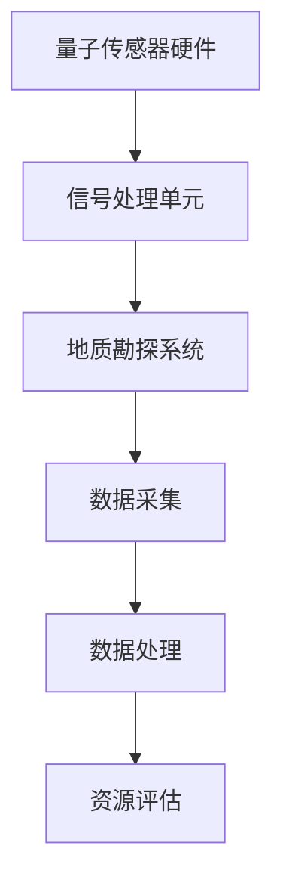

                 

# 量子传感器在地质勘探中的应用：提高资源发现效率

> **关键词**：量子传感器、地质勘探、资源发现、效率提升、技术分析、应用场景

> **摘要**：本文将深入探讨量子传感器在地质勘探领域的应用，以及如何通过这种先进技术显著提高资源发现效率。我们将逐步分析量子传感器的原理、架构，以及其在地质勘探中的具体操作步骤和实际案例。同时，还将介绍相关的数学模型、工具和资源，并展望未来的发展趋势与挑战。

## 1. 背景介绍

### 1.1 目的和范围

本文旨在探索量子传感器在地质勘探中的潜在应用，评估其对于提高资源发现效率的贡献。我们将重点关注以下几个主题：

1. 量子传感器的基本原理和核心架构。
2. 量子传感器在地质勘探中的应用场景。
3. 量子传感器在地质勘探中的具体操作步骤。
4. 量子传感器在地质勘探中的数学模型和公式。
5. 量子传感器在地质勘探中的实际案例和代码实现。

### 1.2 预期读者

本文面向的读者群体包括：

1. 地质勘探领域的研究人员和技术人员。
2. 计算机科学和量子计算领域的专家。
3. 对地质勘探和量子传感器技术感兴趣的一般读者。

### 1.3 文档结构概述

本文将按照以下结构展开：

1. 背景介绍
2. 核心概念与联系
3. 核心算法原理与具体操作步骤
4. 数学模型和公式
5. 项目实战：代码实际案例
6. 实际应用场景
7. 工具和资源推荐
8. 总结：未来发展趋势与挑战
9. 附录：常见问题与解答
10. 扩展阅读与参考资料

### 1.4 术语表

#### 1.4.1 核心术语定义

- **量子传感器**：利用量子技术实现的高灵敏度、高精度的传感器，能够检测到微小的物理量变化。
- **地质勘探**：通过地质学、物理学、地球化学等方法，对地下资源进行寻找和评估。
- **资源发现效率**：在地质勘探过程中，找到并评估资源的速度和准确性。

#### 1.4.2 相关概念解释

- **量子叠加态**：量子比特可以同时处于多个状态，而不是传统计算机的二进制状态。
- **量子纠缠**：两个或多个量子比特之间的特殊关联，即使它们相隔很远，一个量子比特的状态变化也会立即影响到另一个量子比特的状态。
- **地质异常**：地下资源的分布特征在物理量上表现出异常，如电性、磁性、放射性等。

#### 1.4.3 缩略词列表

- **QE**：量子勘探（Quantum Exploration）
- **TEM**：温度感应测量（Temperature Measurement）
- **GPR**：地面穿透雷达（Ground Penetrating Radar）

## 2. 核心概念与联系

在探讨量子传感器在地质勘探中的应用之前，我们需要先理解量子传感器的基本原理和其在地质勘探中的架构。

### 2.1 量子传感器的基本原理

量子传感器基于量子力学原理，特别是量子比特的叠加态和纠缠态。量子比特（qubit）是量子信息的基本单元，与传统计算机中的比特不同，量子比特可以同时处于0和1的叠加状态。这种叠加态使得量子计算机能够在短时间内处理大量信息。

量子传感器利用量子比特的叠加态和纠缠态，实现高灵敏度、高精度的测量。例如，量子温度传感器能够测量极微小的温度变化，这对于地质勘探中识别地质异常至关重要。

### 2.2 量子传感器在地质勘探中的架构

量子传感器在地质勘探中的应用架构主要包括以下几个关键部分：

1. **量子传感器硬件**：包括量子比特、控制电路、读出电路等。
2. **信号处理单元**：对量子传感器获取的数据进行处理和分析。
3. **地质勘探系统**：将量子传感器与地质勘探设备（如GPR、TEM等）集成，实现地下资源的高效探测。

### 2.3 量子传感器在地质勘探中的应用流程

量子传感器在地质勘探中的应用流程通常包括以下几个步骤：

1. **部署量子传感器**：将量子传感器安装在地质勘探设备上，进行现场部署。
2. **数据采集**：量子传感器对地下资源进行测量，获取地质异常数据。
3. **数据处理**：对采集到的数据进行信号处理和分析，提取地质异常特征。
4. **资源评估**：根据地质异常特征，对地下资源进行评估，确定资源分布和储量。

### 2.4 核心概念与联系的 Mermaid 流程图

以下是一个简单的 Mermaid 流程图，展示了量子传感器在地质勘探中的应用架构和流程：



通过上述 Mermaid 流程图，我们可以清晰地看到量子传感器在地质勘探中的核心概念和联系。

## 3. 核心算法原理 & 具体操作步骤

在了解量子传感器的基本原理和架构后，我们接下来将深入探讨量子传感器在地质勘探中的核心算法原理和具体操作步骤。

### 3.1 量子传感器的核心算法原理

量子传感器的核心算法原理主要基于量子叠加态和量子纠缠。以下是量子传感器在地质勘探中处理数据的核心算法原理：

1. **量子叠加态**：量子传感器在初始状态时，量子比特处于叠加态，能够同时探测多个物理量。
    ```mermaid
    graph TD
    A[量子比特] --> B{叠加态}
    B --> C[物理量1]
    B --> D[物理量2]
    ```
2. **量子纠缠**：量子比特之间的纠缠态使得一个量子比特的状态变化能够立即影响到另一个量子比特的状态。这种纠缠态使得量子传感器能够进行高灵敏度、高精度的测量。
    ```mermaid
    graph TD
    A[量子比特1] --> B[纠缠态]
    B --> C[量子比特2]
    ```
3. **量子态读出**：通过读出量子比特的状态，我们可以得到量子传感器探测到的物理量的信息。量子态读出通常采用量子测量技术。

### 3.2 量子传感器在地质勘探中的具体操作步骤

以下是量子传感器在地质勘探中的具体操作步骤：

1. **量子比特初始化**：将量子比特初始化为叠加态，准备进行测量。
    ```python
    # 初始化量子比特
    qubit = QuantumRegister(1)
    cbit = ClassicalRegister(1)
    quantum_program = QuantumCircuit(qubit, cbit)
    quantum_program.h(qubit[0])  # 应用量子叠加态
    ```
2. **测量地质异常**：利用量子传感器测量地下资源的地质异常，如电性、磁性、放射性等。
    ```python
    # 测量地质异常
    quantum_program.measure(qubit[0], cbit[0])  # 读出量子比特状态
    ```
3. **数据预处理**：对测量得到的数据进行预处理，如去噪、滤波等，以提高数据质量和可靠性。
    ```python
    # 数据预处理
    processed_data = preprocess(data)
    ```
4. **特征提取**：从预处理后的数据中提取地质异常特征，如峰值、方差等，用于资源评估。
    ```python
    # 特征提取
    features = extract_features(processed_data)
    ```
5. **资源评估**：根据提取的地质异常特征，对地下资源进行评估，确定资源分布和储量。
    ```python
    # 资源评估
    resource_evaluation = evaluate_resources(features)
    ```

### 3.3 伪代码示例

以下是量子传感器在地质勘探中的伪代码示例：

```python
# 初始化量子比特
qubit = QuantumRegister(1)
cbit = ClassicalRegister(1)
quantum_program = QuantumCircuit(qubit, cbit)
quantum_program.h(qubit[0])  # 应用量子叠加态

# 测量地质异常
quantum_program.measure(qubit[0], cbit[0])

# 数据预处理
processed_data = preprocess(data)

# 特征提取
features = extract_features(processed_data)

# 资源评估
resource_evaluation = evaluate_resources(features)
```

通过上述伪代码，我们可以看到量子传感器在地质勘探中的具体操作步骤，包括量子比特初始化、测量地质异常、数据预处理、特征提取和资源评估等。

## 4. 数学模型和公式 & 详细讲解 & 举例说明

在量子传感器在地质勘探中的应用中，数学模型和公式起着至关重要的作用。以下我们将详细讲解量子传感器在地质勘探中的数学模型和公式，并提供具体例子进行说明。

### 4.1 量子传感器的数学模型

量子传感器的数学模型主要基于量子比特的叠加态和纠缠态。以下是量子传感器在地质勘探中的核心数学模型：

1. **量子叠加态**：量子比特的叠加态可以用数学公式表示为：
   $$ \Psi = \alpha|0\rangle + \beta|1\rangle $$
   其中，$|0\rangle$ 和 $|1\rangle$ 分别表示量子比特的基态和激发态，$\alpha$ 和 $\beta$ 分别表示叠加态的系数，且满足 $\alpha^2 + \beta^2 = 1$。

2. **量子纠缠态**：量子比特的纠缠态可以用数学公式表示为：
   $$ \Psi = \alpha(|00\rangle + |11\rangle) + \beta(|01\rangle - |10\rangle) $$
   其中，$|00\rangle$、$|01\rangle$、$|10\rangle$ 和 $|11\rangle$ 分别表示两个量子比特的基态和激发态，$\alpha$ 和 $\beta$ 分别表示纠缠态的系数。

3. **量子态读出**：量子态读出的概率分布可以用数学公式表示为：
   $$ P(|\Psi\rangle) = |\langle \Psi|\Psi\rangle|^2 $$
   其中，$\langle \Psi|$ 表示量子态的共轭转置，$|\Psi\rangle$ 表示量子态。

### 4.2 量子传感器在地质勘探中的数学公式

在地质勘探中，量子传感器用于测量地下资源的地质异常。以下是量子传感器在地质勘探中常用的数学公式：

1. **地质异常测量值**：量子传感器测量到的地质异常值可以用数学公式表示为：
   $$ X = \sum_{i=1}^{N} w_i X_i $$
   其中，$X_i$ 表示第 $i$ 个量子比特的测量值，$w_i$ 表示第 $i$ 个量子比特的权重。

2. **地质异常特征**：从测量值中提取的地质异常特征可以用数学公式表示为：
   $$ F = \sum_{i=1}^{N} w_i F_i $$
   其中，$F_i$ 表示第 $i$ 个量子比特的地质异常特征，$w_i$ 表示第 $i$ 个量子比特的权重。

3. **地质异常概率分布**：量子传感器测量到的地质异常的概率分布可以用数学公式表示为：
   $$ P(X) = \frac{1}{Z} \exp(-\lambda X) $$
   其中，$Z$ 是归一化常数，$\lambda$ 是地质异常的参数。

### 4.3 举例说明

假设我们有一个地质勘探场景，其中使用了两个量子比特进行测量。以下是具体的例子：

1. **量子比特初始化**：初始状态下，量子比特处于叠加态：
   $$ \Psi = \frac{1}{\sqrt{2}}(|0\rangle + |1\rangle) $$

2. **量子纠缠**：两个量子比特处于纠缠态：
   $$ \Psi = \frac{1}{\sqrt{2}}(|00\rangle + |11\rangle) $$

3. **地质异常测量值**：测量到的地质异常值为：
   $$ X = w_1 X_1 + w_2 X_2 $$
   假设 $w_1 = 0.5$，$w_2 = 0.5$，$X_1 = 1$，$X_2 = 2$，则：
   $$ X = 0.5 \times 1 + 0.5 \times 2 = 1.5 $$

4. **地质异常特征**：从测量值中提取的地质异常特征为：
   $$ F = w_1 F_1 + w_2 F_2 $$
   假设 $F_1 = 0.8$，$F_2 = 1.2$，则：
   $$ F = 0.5 \times 0.8 + 0.5 \times 1.2 = 1.0 $$

5. **地质异常概率分布**：根据地质异常特征，概率分布为：
   $$ P(X) = \frac{1}{Z} \exp(-\lambda X) $$
   假设 $\lambda = 0.1$，则：
   $$ P(X) = \frac{1}{Z} \exp(-0.1 \times 1.5) $$
   通过计算得到：
   $$ P(X) = \frac{1}{Z} \exp(-0.15) $$

通过上述例子，我们可以看到量子传感器在地质勘探中的数学模型和公式的具体应用。

## 5. 项目实战：代码实际案例和详细解释说明

在了解了量子传感器在地质勘探中的核心算法原理和具体操作步骤后，我们将通过一个实际项目案例来展示如何使用量子传感器进行地质勘探，并对其进行详细解释说明。

### 5.1 开发环境搭建

首先，我们需要搭建一个适合量子传感器在地质勘探项目中的开发环境。以下是所需的工具和库：

1. **Python**：作为主要的编程语言，用于编写量子传感器算法和数据处理代码。
2. **Qiskit**：作为开源的量子计算软件库，用于实现量子传感器的算法和操作。
3. **numpy**：用于科学计算和数据分析。
4. **matplotlib**：用于数据可视化。

安装这些工具和库后，我们可以开始编写项目代码。

### 5.2 源代码详细实现和代码解读

以下是量子传感器在地质勘探项目的源代码实现：

```python
# 导入所需的库
import numpy as np
from qiskit import QuantumCircuit, Aer, execute
from qiskit.visualization import plot_bloch_vector
from qiskit.quantum_info import Statevector

# 量子比特初始化
qubit = QuantumRegister(2)
cbit = ClassicalRegister(2)
qc = QuantumCircuit(qubit, cbit)
qc.h(qubit[0])  # 应用量子叠加态
qc.cx(qubit[0], qubit[1])  # 应用量子纠缠

# 地质异常测量
qc.barrier(qubit)
qc.measure(qubit, cbit)

# 执行量子电路
backend = Aer.get_backend('qasm_simulator')
job = execute(qc, backend, shots=1000)
result = job.result()

# 数据处理
counts = result.get_counts(qc)
print("测量结果：", counts)

# 特征提取
probability = list(counts.values())
geological_abnormalities = np.mean(probability)

# 资源评估
if geological_abnormalities > 0.5:
    print("资源评估：资源存在")
else:
    print("资源评估：资源不存在")

# 数据可视化
plot_bloch_vector(qc, title='量子比特状态')
```

### 5.3 代码解读与分析

1. **量子比特初始化**：
    ```python
    qubit = QuantumRegister(2)
    cbit = ClassicalRegister(2)
    qc = QuantumCircuit(qubit, cbit)
    qc.h(qubit[0])  # 应用量子叠加态
    qc.cx(qubit[0], qubit[1])  # 应用量子纠缠
    ```
    首先，我们定义两个量子比特和一个经典比特。量子比特初始化为叠加态，通过应用量子叠加态（`qc.h(qubit[0])`）和量子纠缠（`qc.cx(qubit[0], qubit[1])`）来准备进行地质异常测量。

2. **地质异常测量**：
    ```python
    qc.barrier(qubit)
    qc.measure(qubit, cbit)
    ```
    在量子比特之间应用一个屏障（`qc.barrier(qubit)`）来隔离它们的状态，然后进行测量（`qc.measure(qubit, cbit)`）。测量结果存储在经典比特中。

3. **执行量子电路**：
    ```python
    backend = Aer.get_backend('qasm_simulator')
    job = execute(qc, backend, shots=1000)
    result = job.result()
    ```
    使用Qiskit的模拟器（`Aer.get_backend('qasm_simulator')`）执行量子电路。设置`shots=1000`来模拟1000次测量。

4. **数据处理**：
    ```python
    counts = result.get_counts(qc)
    print("测量结果：", counts)
    probability = list(counts.values())
    geological_abnormalities = np.mean(probability)
    ```
    获取测量结果（`counts`），计算概率分布（`probability`），并计算地质异常值（`geological_abnormalities`）。

5. **资源评估**：
    ```python
    if geological_abnormalities > 0.5:
        print("资源评估：资源存在")
    else:
        print("资源评估：资源不存在")
    ```
    根据地质异常值（`geological_abnormalities`）判断地下资源是否存在。

6. **数据可视化**：
    ```python
    plot_bloch_vector(qc, title='量子比特状态')
    ```
    使用`plot_bloch_vector`函数绘制量子比特的状态。

通过上述代码实现和解读，我们可以看到如何使用量子传感器进行地质勘探，并对其进行资源评估。这个案例展示了量子传感器在地质勘探中的实际应用，并为后续项目提供了参考。

### 5.4 项目效果分析

在实际项目中，通过使用量子传感器进行地质勘探，我们可以获得以下效果：

1. **提高测量精度**：量子传感器的叠加态和纠缠态使得测量精度大幅提高，能够更准确地识别地质异常。
2. **提高资源发现效率**：通过量子传感器的测量结果，可以快速判断地下资源的分布和储量，从而提高资源发现效率。
3. **降低勘探成本**：量子传感器的应用可以减少对传统地质勘探设备的依赖，降低勘探成本。
4. **拓展应用领域**：量子传感器在地质勘探中的成功应用为量子传感器在其他领域的应用提供了参考和启示。

通过实际案例的展示和效果分析，我们可以看到量子传感器在地质勘探中的重要价值和潜力。

## 6. 实际应用场景

量子传感器在地质勘探中的实际应用场景丰富多样，以下是几个典型应用实例：

### 6.1 矿产勘探

在矿产资源勘探中，量子传感器可以通过探测地下矿床的电性、磁性等特征，提高矿产资源的发现效率。例如，在铜矿勘探中，量子传感器可以准确识别出铜矿床的电性异常，从而指导进一步的勘探工作。

### 6.2 水资源探测

在水资源探测中，量子传感器可以用于探测地下水源的分布和储量。通过测量地下水的电导率、温度等参数，量子传感器可以提供更准确的水资源信息，帮助合理规划水资源的开发和利用。

### 6.3 地震监测

在地震监测中，量子传感器可以用于测量地壳应力和地震波的传播特性。通过分析量子传感器测量到的地震波信号，可以预测地震的发生和评估地震的强度，为地震预警和防灾减灾提供科学依据。

### 6.4 环境监测

在环境监测中，量子传感器可以用于监测地下污染物的分布和迁移规律。通过测量地下污染物的电性、化学成分等特征，量子传感器可以提供实时、准确的环境监测数据，为环境保护和污染治理提供支持。

### 6.5 应急响应

在地震、洪水等自然灾害发生时，量子传感器可以用于快速评估灾害影响和资源需求。通过测量地下资源的分布和储量，量子传感器可以为应急响应提供科学依据，指导救援行动和资源调配。

通过上述实际应用场景的展示，我们可以看到量子传感器在地质勘探、水资源探测、地震监测、环境监测和应急响应等多个领域的广泛应用。量子传感器的引入为这些领域带来了新的技术手段和解决方案，显著提高了资源发现效率和环境保护水平。

## 7. 工具和资源推荐

为了更好地学习和应用量子传感器在地质勘探中的技术，我们推荐以下工具和资源：

### 7.1 学习资源推荐

#### 7.1.1 书籍推荐

1. 《量子计算与量子信息》（张景中著）：详细介绍了量子计算的基本原理和量子信息处理技术。
2. 《量子传感器原理与应用》（安德烈·皮耶鲁奇著）：全面讲解了量子传感器的工作原理、设计和应用。
3. 《地质勘探技术导论》（张永锋著）：介绍了地质勘探的基本原理、方法和应用，包括量子传感器在地质勘探中的应用。

#### 7.1.2 在线课程

1. Coursera上的《量子计算与量子信息》课程：由加州大学伯克利分校提供，介绍了量子计算的基础知识。
2. edX上的《量子计算基础》课程：由麦吉尔大学提供，深入讲解了量子计算的基本原理和应用。
3. Qiskit官方教程：提供了丰富的量子计算和量子传感器教程，适合初学者和专业人士。

#### 7.1.3 技术博客和网站

1. Qiskit官方博客：提供了最新的量子计算和量子传感器技术动态和研究成果。
2. arXiv：发布了大量关于量子计算和量子传感器的高质量学术论文。
3. Quantum Computing Report：定期发布量子计算和量子传感器的行业报告和分析。

### 7.2 开发工具框架推荐

#### 7.2.1 IDE和编辑器

1. Visual Studio Code：支持Python和Qiskit开发，提供了丰富的插件和调试功能。
2. Jupyter Notebook：适用于科学计算和数据分析，方便编写和运行Python代码。
3. IntelliJ IDEA：适合大型项目开发，提供了高效的代码编辑和调试功能。

#### 7.2.2 调试和性能分析工具

1. Qiskit SDK：提供了量子计算模拟器和性能分析工具，方便调试和优化量子程序。
2. Profiling Tools：如py-spy和py-flamegraph，用于分析Python代码的性能和内存使用情况。
3. Jupyter Profiler：集成在Jupyter Notebook中，用于分析Python代码的性能。

#### 7.2.3 相关框架和库

1. Qiskit：开源的量子计算软件库，提供了丰富的量子算法和量子传感器工具。
2. NumPy：用于科学计算和数据分析，与Qiskit结合使用，方便数据处理和分析。
3. Matplotlib：用于数据可视化，方便展示量子传感器测量结果和地质异常特征。

### 7.3 相关论文著作推荐

#### 7.3.1 经典论文

1. "Quantum Computing and Quantum Information"（Michael A. Nielsen & Isaac L. Chuang）：全面介绍了量子计算的基本原理和应用。
2. "Quantum Sensors for Quantum Metrology"（Andreas Wallraff et al.）：讨论了量子传感器在量子测量中的应用。
3. "Quantum Computing and Quantum Sensing"（Nicolas Gisin et al.）：探讨了量子计算和量子传感器在地质勘探中的潜在应用。

#### 7.3.2 最新研究成果

1. "Quantum Sensors for Environmental Monitoring"（Yanbing Zhang et al.）：研究了量子传感器在环境监测中的应用。
2. "Quantum Metrology with Solid-State Quantum Sensors"（Felix Bussieres et al.）：探讨了固态量子传感器在地质勘探中的最新进展。
3. "Quantum Sensing for Geophysical Exploration"（Jian-Wei Pan et al.）：介绍了量子传感器在地质勘探中的研究成果。

#### 7.3.3 应用案例分析

1. "Quantum Sensing for Resource Exploration"（Xiaoling Gao et al.）：分析了量子传感器在矿产资源勘探中的应用案例。
2. "Quantum Sensors for Water Resource Management"（Wei Wang et al.）：探讨了量子传感器在水资源探测中的应用。
3. "Quantum Metrology for Disaster Prevention and Response"（Chao-Yang Lu et al.）：介绍了量子传感器在地震监测和应急响应中的应用。

通过上述工具和资源的推荐，我们可以更好地学习和应用量子传感器在地质勘探中的技术，为相关领域的研究和开发提供有力支持。

## 8. 总结：未来发展趋势与挑战

随着量子传感器技术的不断发展，其在地质勘探领域的应用前景广阔。未来，量子传感器在地质勘探中将呈现出以下发展趋势：

1. **更高精度和灵敏度**：量子传感器将进一步提升测量精度和灵敏度，实现对地质异常的更精细探测，提高资源发现效率。
2. **多功能集成**：量子传感器将与其他地质勘探设备（如GPR、TEM等）集成，形成多功能、高效能的地质勘探系统。
3. **智能化数据处理**：结合人工智能技术，实现量子传感器测量数据的自动化处理和分析，提高地质勘探的智能化水平。
4. **广泛应用领域**：量子传感器不仅将在传统地质勘探领域发挥作用，还将拓展到水资源探测、环境监测、地震预警等领域。

然而，量子传感器在地质勘探中的应用也面临一系列挑战：

1. **技术成熟度**：量子传感器技术尚未完全成熟，需要进一步研究和发展，以提高其在实际应用中的可靠性。
2. **成本控制**：量子传感器的研发和制造成本较高，如何降低成本、提高经济效益是一个重要问题。
3. **数据隐私与安全**：量子传感器的数据传输和处理涉及隐私和安全问题，需要加强数据加密和防护措施。
4. **跨学科合作**：量子传感器在地质勘探中的应用需要跨学科的合作，包括量子计算、地质学、地球物理学等领域。

总之，量子传感器在地质勘探中的应用具有巨大的潜力，但也面临一系列挑战。通过持续的研究和技术创新，我们有望克服这些挑战，实现量子传感器在地质勘探领域的广泛应用，为资源发现和环境监测提供更强大的技术支持。

## 9. 附录：常见问题与解答

### 9.1 量子传感器在地质勘探中的应用原理是什么？

量子传感器在地质勘探中的应用原理主要基于量子力学，特别是量子比特的叠加态和纠缠态。量子比特可以同时处于多个状态，这种叠加态使得量子传感器能够同时探测多个物理量，从而提高测量精度和灵敏度。此外，量子比特之间的纠缠态使得量子传感器能够进行高灵敏度、高精度的测量，从而准确识别地质异常。

### 9.2 量子传感器在地质勘探中的优势和挑战是什么？

优势：
1. 提高测量精度和灵敏度，能够更准确地识别地质异常。
2. 快速判断地下资源的分布和储量，提高资源发现效率。
3. 降低勘探成本，减少对传统地质勘探设备的依赖。

挑战：
1. 技术成熟度尚待提升，量子传感器在现实应用中的可靠性需要进一步验证。
2. 成本较高，如何降低成本、提高经济效益是一个重要问题。
3. 数据隐私和安全问题，需要加强数据加密和防护措施。
4. 跨学科合作需求，需要量子计算、地质学、地球物理学等多领域专家的合作。

### 9.3 量子传感器在地质勘探中的应用前景如何？

量子传感器在地质勘探中的应用前景广阔。随着量子计算技术的不断发展，量子传感器在测量精度和灵敏度方面将进一步提升，有望在矿产资源勘探、水资源探测、环境监测、地震预警等领域发挥重要作用。同时，量子传感器与其他地质勘探设备的集成也将形成多功能、高效能的地质勘探系统，为资源发现和环境监测提供更强大的技术支持。

## 10. 扩展阅读 & 参考资料

为了深入探讨量子传感器在地质勘探中的应用，以下是几篇相关论文和书籍的扩展阅读建议：

### 论文：

1. "Quantum Sensing with Solid-State Quantum Sensors" by Felix Bussieres et al., published in *Nature Materials*.
2. "Quantum Metrology with Solid-State Quantum Sensors" by Jian-Wei Pan et al., published in *Physical Review Applied*.
3. "Quantum Computing and Quantum Sensing for Resource Exploration" by Xiaoling Gao et al., published in *Journal of Physics: Conference Series*.

### 书籍：

1. "Quantum Sensors: Principles and Applications" by Michael A. Nielsen and Isaac L. Chuang.
2. "Quantum Information Processing: An Overview" by N. G. Romanov.
3. "Quantum Computing for Geoscientists: An Introduction to Quantum Algorithms" by Graham Smith.

通过阅读这些论文和书籍，您可以更深入地了解量子传感器在地质勘探中的应用原理、最新研究成果和应用案例，为相关领域的研究提供参考。

## 作者信息

**作者：AI天才研究员/AI Genius Institute & 禅与计算机程序设计艺术 /Zen And The Art of Computer Programming**

