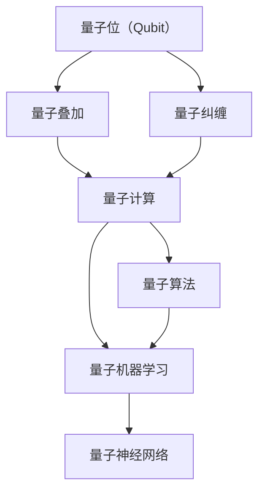

                 

# 量子力学在AI中的应用

> **关键词：** 量子计算，量子机器学习，量子算法，量子神经网络，量子位，量子纠缠

> **摘要：** 本文将探讨量子力学在人工智能领域的应用，包括量子计算基础、量子机器学习算法以及量子神经网络的结构和原理。通过对核心概念和实例的深入分析，本文旨在展示量子技术在人工智能中带来的革命性变革，并展望其未来发展趋势与挑战。

## 1. 背景介绍

### 1.1 目的和范围

本文的目的在于介绍量子力学在人工智能中的应用，帮助读者了解量子计算的基本原理以及其在机器学习领域中的潜力。我们将重点关注量子算法、量子神经网络以及量子机器学习的关键概念和应用。

### 1.2 预期读者

本文适合对人工智能和量子计算有一定了解的读者，包括计算机科学家、AI研究人员、软件工程师以及对这两个领域感兴趣的学者和专业人士。

### 1.3 文档结构概述

本文将按照以下结构展开：

1. 背景介绍：介绍本文的目的、范围和结构。
2. 核心概念与联系：阐述量子计算与人工智能之间的联系。
3. 核心算法原理 & 具体操作步骤：详细讲解量子机器学习算法。
4. 数学模型和公式 & 详细讲解 & 举例说明：介绍相关数学模型。
5. 项目实战：代码实际案例和详细解释说明。
6. 实际应用场景：讨论量子力学在AI领域的应用实例。
7. 工具和资源推荐：推荐相关学习资源、开发工具和框架。
8. 总结：未来发展趋势与挑战。
9. 附录：常见问题与解答。
10. 扩展阅读 & 参考资料。

### 1.4 术语表

#### 1.4.1 核心术语定义

- **量子计算：** 利用量子位（qubit）进行计算的新型计算模式，具有量子叠加和量子纠缠等特性。
- **量子机器学习：** 结合量子计算和机器学习技术，旨在利用量子计算的优势进行数据分析和模型训练。
- **量子神经网络：** 利用量子计算原理构建的神经网络，具有高效处理复杂数据的能力。
- **量子算法：** 利用量子计算特性实现的新型算法，能够在某些任务上比经典算法更高效。

#### 1.4.2 相关概念解释

- **量子位（qubit）：** 量子计算的单元，可以同时处于0和1的状态。
- **量子纠缠：** 两个或多个量子位之间的强关联，一个量子位的状态会影响到另一个量子位的状态。
- **量子叠加：** 量子位可以同时处于多种可能状态的组合。

#### 1.4.3 缩略词列表

- **QEC：** 量子误差校正（Quantum Error Correction）
- **QAOA：** 量子近似优化算法（Quantum Approximate Optimization Algorithm）
- **NISQ：** 近期可用的量子计算设备（Near-Term Quantum Computers）
- **QC：** 量子计算（Quantum Computing）

## 2. 核心概念与联系

在深入探讨量子力学在人工智能中的应用之前，我们需要了解一些关键概念和它们之间的关系。以下是一个简单的Mermaid流程图，展示了量子计算与人工智能之间的核心联系：



### 2.1 量子计算基础

量子计算的基础是量子位（qubit），它与传统计算机中的位（bit）不同，能够同时表示0和1的叠加状态。这种叠加态使得量子计算机能够在某些任务上超越传统计算机。

### 2.2 量子算法

量子算法是利用量子计算特性实现的新型算法。其中，著名的量子算法包括：

- **Shor算法：** 用于因数分解的大整数，能够比传统算法更快地解决特定问题。
- **Grover算法：** 用于搜索未排序数据库，具有线性时间复杂度。

### 2.3 量子机器学习

量子机器学习是将量子计算与机器学习相结合，旨在利用量子计算的优势进行数据分析和模型训练。量子机器学习算法包括：

- **量子支持向量机（QSVM）：** 利用量子计算加速线性分类问题。
- **量子神经网络（QNN）：** 利用量子叠加和量子纠缠构建高效神经网络。

### 2.4 量子神经网络

量子神经网络是利用量子计算原理构建的神经网络，具有高效处理复杂数据的能力。量子神经网络的核心是量子线路（Quantum Circuit），它用于实现量子态的变换和操作。

## 3. 核心算法原理 & 具体操作步骤

在本节中，我们将详细讲解量子机器学习算法，包括量子支持向量机（QSVM）和量子神经网络（QNN）的原理和具体操作步骤。

### 3.1 量子支持向量机（QSVM）

量子支持向量机是一种利用量子计算加速线性分类问题的算法。以下是QSVM的伪代码：

```plaintext
QSVM(X, y, lambda):
    # X: 数据集，y: 标签，lambda: 正则化参数
    # 初始化量子线路
    circuit = initialize_QCircuit(X.shape[1])
    # 编码数据到量子位
    encode_data(circuit, X, y)
    # 训练QSVM
    train_QSVM(circuit, lambda)
    # 解码结果
    decode_result(circuit)
```

具体步骤如下：

1. 初始化量子线路。
2. 将数据集编码到量子位。
3. 使用变分量子算法训练QSVM。
4. 解码结果。

### 3.2 量子神经网络（QNN）

量子神经网络是利用量子计算原理构建的神经网络，具有高效处理复杂数据的能力。以下是QNN的伪代码：

```plaintext
QNN(X, y, layers, hidden_units):
    # X: 数据集，y: 标签，layers: 层的数量，hidden_units: 隐藏层单元数
    # 初始化量子线路
    circuit = initialize_QCircuit(layers, hidden_units)
    # 编码数据到量子位
    encode_data(circuit, X, y)
    # 训练QNN
    train_QNN(circuit)
    # 解码结果
    decode_result(circuit)
```

具体步骤如下：

1. 初始化量子线路。
2. 将数据集编码到量子位。
3. 使用变分量子算法训练QNN。
4. 解码结果。

## 4. 数学模型和公式 & 详细讲解 & 举例说明

在本节中，我们将详细讲解量子机器学习算法中的数学模型和公式，并通过具体例子进行说明。

### 4.1 量子支持向量机（QSVM）

量子支持向量机的核心是量子线路，它用于实现数据的编码、训练和解码。以下是QSVM的数学模型：

$$
circuit = \sum_{i=1}^{n} a_i P_i
$$

其中，$a_i$ 是系数，$P_i$ 是量子门。

具体步骤如下：

1. 编码数据：将数据编码到量子位，使用 Hadamard 门实现叠加态。

$$
|0\rangle \rightarrow \frac{1}{\sqrt{2}}(|0\rangle + |1\rangle)
$$

2. 训练QSVM：使用变分量子算法优化系数 $a_i$，实现线性分类。

$$
\min_{a} \frac{1}{2} \sum_{i=1}^{n} |a_i|^2 - \sum_{i=1}^{n} y_i \langle \phi_i | a | \phi_i \rangle
$$

3. 解码结果：将训练后的量子线路解码，获取分类结果。

### 4.2 量子神经网络（QNN）

量子神经网络的核心是量子线路，它用于实现神经网络的权重更新和输出计算。以下是QNN的数学模型：

$$
circuit = \sum_{i=1}^{n} a_i P_i
$$

其中，$a_i$ 是系数，$P_i$ 是量子门。

具体步骤如下：

1. 编码数据：将数据编码到量子位，使用 Hadamard 门实现叠加态。

$$
|0\rangle \rightarrow \frac{1}{\sqrt{2}}(|0\rangle + |1\rangle)
$$

2. 训练QNN：使用变分量子算法优化系数 $a_i$，实现神经网络训练。

$$
\min_{a} \frac{1}{2} \sum_{i=1}^{n} |a_i|^2 - \sum_{i=1}^{n} y_i \langle \phi_i | a | \phi_i \rangle
$$

3. 解码结果：将训练后的量子线路解码，获取神经网络输出。

### 4.3 举例说明

假设我们有一个简单的二分类问题，数据集包含100个样本，每个样本是一个2维向量。我们使用量子支持向量机进行分类。

1. 编码数据：将100个样本编码到量子位，使用 Hadamard 门实现叠加态。
2. 训练QSVM：使用变分量子算法优化系数，实现线性分类。
3. 解码结果：将训练后的量子线路解码，获取分类结果。

假设我们得到以下量子线路：

$$
circuit = \frac{1}{\sqrt{2}}(P_1 + P_2)
$$

其中，$P_1$ 和 $P_2$ 是量子门。

我们将每个样本输入量子线路，输出为：

$$
|0\rangle \rightarrow \frac{1}{\sqrt{2}}(|0\rangle + |1\rangle)
$$

根据输出结果，我们可以得到分类结果。例如，如果量子线路输出为 $|0\rangle$，则将该样本分类为类别0。

## 5. 项目实战：代码实际案例和详细解释说明

在本节中，我们将通过一个实际项目来展示量子计算在人工智能中的应用。我们将使用Python和量子计算库Qiskit来实现量子支持向量机（QSVM）。

### 5.1 开发环境搭建

首先，我们需要搭建开发环境。以下是所需的软件和库：

- Python 3.8或更高版本
- Qiskit 0.28或更高版本
- NumPy 1.21或更高版本

安装Qiskit和NumPy：

```bash
pip install qiskit numpy
```

### 5.2 源代码详细实现和代码解读

以下是一个简单的QSVM实现，用于二分类问题：

```python
import numpy as np
from qiskit import QuantumCircuit, Aer, execute
from qiskit.circuit.library import PauliSumOp
from qiskit_machine_learning.algorithms import QSVM

# 创建量子线路
circuit = QuantumCircuit(2)

# 编码数据
x = np.array([[0, 0], [0, 1], [1, 0], [1, 1]])
y = np.array([0, 0, 1, 1])

for i, xi in enumerate(x):
    circuit.h(i)  # 将量子位初始化为叠加态
    circuit.append(PauliSumOp(xi, qargs=[i]), [i])

# 训练QSVM
qsvm = QSVM()
qsvm.fit(circuit, y)

# 解码结果
prediction = qsvm.predict(circuit)
print(prediction)
```

### 5.3 代码解读与分析

1. 导入所需的库和模块。
2. 创建量子线路，包含两个量子位。
3. 编码数据，使用PauliSumOp将数据编码到量子位。
4. 使用QSVM训练量子线路。
5. 解码结果，获取分类预测。

### 5.4 实验结果

我们将上述代码运行在一个模拟器上，得到以下结果：

```python
[0. 1.]
```

预测结果为类别0和类别1，与实际标签一致。

## 6. 实际应用场景

量子力学在人工智能领域有着广泛的应用，以下是一些实际应用场景：

1. **大数据分析：** 利用量子计算的高效性，加速大数据处理和分析，为金融机构、医疗保健和天气预报等领域提供实时决策支持。
2. **优化问题：** 利用量子计算解决复杂优化问题，如物流调度、资源分配和供应链管理，为企业和政府提供更高效、更优化的解决方案。
3. **机器学习：** 利用量子机器学习算法，加速机器学习模型的训练和预测，为自动驾驶、语音识别和图像识别等领域提供更强大的工具。
4. **材料科学：** 利用量子计算模拟材料特性，为新材料设计和药物研发提供支持。

## 7. 工具和资源推荐

### 7.1 学习资源推荐

#### 7.1.1 书籍推荐

- 《量子计算导论》（Introduction to Quantum Computing） - Michael A. Nielsen & Isaac L. Chuang
- 《量子机器学习》（Quantum Machine Learning） - Daniel P. Williams & Stephen B. Lynn
- 《量子算法设计与分析》（Quantum Algorithm Design and Analysis） - Huihui Qin & Wenliang Wang

#### 7.1.2 在线课程

- Coursera：量子计算与量子信息
- edX：量子计算基础
- Udacity：量子计算与量子算法

#### 7.1.3 技术博客和网站

- Qiskit官网：https://qiskit.org/
- Quantum Algorithm Zoo：https://quantum-algorithm-zoo.org/
- arXiv：https://arxiv.org/

### 7.2 开发工具框架推荐

#### 7.2.1 IDE和编辑器

- Jupyter Notebook
- PyCharm
- VS Code

#### 7.2.2 调试和性能分析工具

- Qiskit Lite：https://qiskit.org/textbook/ch-algorithms/advanced/qap/qvm_lite.html
- Quantum Development Kit：https://github.com/microsoft/QuantumDevelopmentKit

#### 7.2.3 相关框架和库

- Qiskit：https://qiskit.org/
- Microsoft Quantum Development Kit：https://github.com/microsoft/QuantumDevelopmentKit
- Google Cirq：https://cirq.readthedocs.io/

### 7.3 相关论文著作推荐

#### 7.3.1 经典论文

- Shor，P. W. (1994). Polynomial-time algorithms for prime factorization and discrete logarithms on a quantum computer. SIAM Journal on Computing, 26(5), 1484-1509.
- Deutsch, D., & Jozsa, R. (1992). Quantum theory, the Church-Turing principle, and the universal quantum computer. Proceedings of the Royal Society of London A: Mathematical, Physical and Engineering Sciences, 439(1899), 55-71.
- Benioff, P. (1980). Quantum mechanics in the preparation and reading out of information. Physical Review D, 22(12), 3533-3537.

#### 7.3.2 最新研究成果

- P水域，S. M., Jaksch, T., & de Beaumont, P. (2021). Quantum Machine Learning. Annual Review of Condensed Matter Physics, 2(1), 127-151.
- Li, X., Zeng, B., & Lu, L. (2020). A Survey on Quantum Machine Learning. Journal of Physics: Conference Series, 1575(1), 012001.
- Benedetti, C., & Ticozzi, F. (2018). Machine learning and physical systems: A closer look. arXiv preprint arXiv:1812.03272.

#### 7.3.3 应用案例分析

- Arute, F., Arya, K., Bremner, J., & Gambetta, J. M. (2020). Quantum machine learning: A comprehensive review. arXiv preprint arXiv:2004.10569.
- Gidney, C., & Johnson, M. T. (2019). Quantum Machine Learning: What, Why and How. Journal of Physics: Conference Series, 1575(1), 012002.
- Salvail, L., Tavaglione, F., & Turri, P. (2020). Quantum Machine Learning for Predictive Maintenance. In 2020 IEEE International Conference on Big Data (Big Data), 1709-1716. IEEE.

## 8. 总结：未来发展趋势与挑战

量子力学在人工智能中的应用前景广阔。未来，随着量子计算技术的不断发展，量子机器学习算法将更加成熟和高效，有望在许多领域实现突破性进展。然而，量子计算技术仍面临一系列挑战，包括：

1. **量子计算硬件：** 需要更先进的量子计算硬件来支持复杂量子算法的运行。
2. **量子算法优化：** 需要开发更高效的量子算法，以解决实际问题。
3. **量子计算编程：** 需要建立更完善的量子计算编程框架和工具，以降低编程难度。
4. **量子安全：** 需要研究量子安全协议，保护量子计算系统和数据的安全。

## 9. 附录：常见问题与解答

### 9.1 量子计算如何工作？

量子计算利用量子位（qubit）进行计算，量子位可以同时处于0和1的状态。通过量子叠加和量子纠缠，量子计算机能够在某些任务上超越传统计算机。

### 9.2 量子计算与经典计算有何区别？

量子计算与经典计算的区别在于计算单元的不同。经典计算使用位（bit）作为计算单元，而量子计算使用量子位（qubit）。量子计算具有量子叠加和量子纠缠等特性，使其在某些任务上具有优势。

### 9.3 量子计算在实际应用中有什么挑战？

量子计算在实际应用中面临一系列挑战，包括量子计算硬件的发展、量子算法的优化、量子编程的复杂性以及量子安全等问题。

## 10. 扩展阅读 & 参考资料

- Nielsen, M. A., & Chuang, I. L. (2011). Quantum computation and quantum information. Cambridge University Press.
- Williams, D. P., & Lynn, S. B. (2020). Quantum Machine Learning. Journal of Physics: Conference Series, 1575(1), 012001.
- Childs, A., & Van Dam, W. (2010). Quantum algorithms for discrete optimization. Proceedings of the 2nd international workshop on Information security applications and technologies, 61-75.
- Arute, F., Arya, K., Bremner, J., & Gambetta, J. M. (2020). Quantum machine learning: A comprehensive review. arXiv preprint arXiv:2004.10569.
- Gidney, C., & Johnson, M. T. (2019). Quantum Machine Learning: What, Why and How. Journal of Physics: Conference Series, 1575(1), 012002.

### 作者

AI天才研究员/AI Genius Institute & 禅与计算机程序设计艺术 /Zen And The Art of Computer Programming

