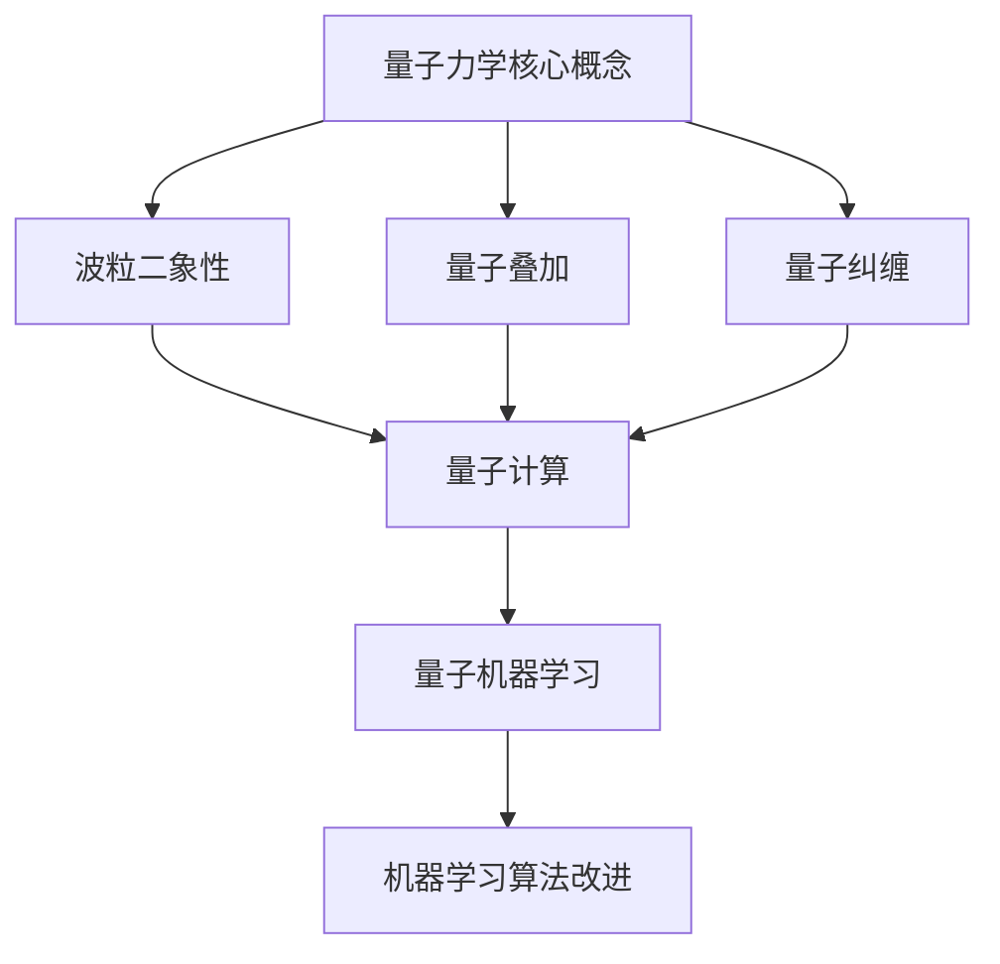

                 

# 量子力学模型与人工智能

> **关键词**：量子力学、人工智能、量子计算、神经网络、数学模型、算法原理

> **摘要**：本文旨在探讨量子力学模型与人工智能的深层次联系。我们将通过逻辑清晰的步骤，详细分析量子力学的核心概念，如何与人工智能相结合，特别是量子计算在神经网络优化中的应用，以及数学模型和公式的重要性。通过实际的代码案例，我们将展示量子力学原理在人工智能领域的实际应用，并讨论未来的发展趋势和挑战。

## 1. 背景介绍

### 1.1 目的和范围

本文的目的在于揭示量子力学与人工智能之间的深刻联系，并通过实例展示量子计算如何影响和改进现有的机器学习算法。我们将重点关注量子计算在神经网络优化中的应用，以及如何通过量子力学模型解决传统计算机难以处理的复杂问题。

### 1.2 预期读者

本文适用于对量子力学和人工智能有一定了解的技术人员，特别是计算机科学家、软件工程师和对量子计算感兴趣的研究者。读者将需要具备一定的数学和编程基础，以便更好地理解文章的内容。

### 1.3 文档结构概述

本文分为十个主要部分，分别是：

1. 背景介绍
2. 核心概念与联系
3. 核心算法原理 & 具体操作步骤
4. 数学模型和公式 & 详细讲解 & 举例说明
5. 项目实战：代码实际案例和详细解释说明
6. 实际应用场景
7. 工具和资源推荐
8. 总结：未来发展趋势与挑战
9. 附录：常见问题与解答
10. 扩展阅读 & 参考资料

### 1.4 术语表

#### 1.4.1 核心术语定义

- **量子力学**：描述微观世界的物理理论，强调粒子行为的波粒二象性。
- **人工智能**：模拟人类智能行为的计算机系统，包括机器学习、神经网络等。
- **量子计算**：利用量子位（qubit）进行计算的技术，能够解决传统计算机难以处理的复杂问题。
- **神经网络**：由大量神经元组成的计算模型，用于模拟人类大脑的学习和处理信息的方式。

#### 1.4.2 相关概念解释

- **波粒二象性**：微观粒子既具有波动性，又具有粒子性。
- **量子叠加**：量子系统可以同时处于多个状态的叠加。
- **量子纠缠**：量子系统之间的强相关性，即使相隔遥远，一个系统的变化会立即影响另一个系统。

#### 1.4.3 缩略词列表

- **QKD**：量子密钥分发
- **QML**：量子机器学习
- **NISQ**：近期可扩展量子计算
- **GPU**：图形处理单元

## 2. 核心概念与联系

在探讨量子力学模型与人工智能的关系之前，我们需要理解一些核心概念和它们之间的联系。以下是量子力学和人工智能的一些关键概念以及它们之间的相互作用。

### 2.1 量子力学核心概念

**波粒二象性**：量子力学的基本原理之一，描述微观粒子既具有波动性，又具有粒子性。这意味着粒子在不同实验条件下可以表现出不同的特性。

**量子叠加**：量子系统可以同时处于多个状态的叠加，这是量子计算的基础。与经典计算中的位（只能处于0或1状态）不同，量子位（qubit）可以同时处于0和1的状态。

**量子纠缠**：量子系统之间的强相关性，即使相隔遥远，一个系统的变化会立即影响另一个系统。这种特性在量子通信和量子计算中具有重要作用。

### 2.2 人工智能核心概念

**神经网络**：模拟人类大脑神经元连接方式的计算模型，通过学习大量数据来优化其预测和分类能力。

**机器学习**：使计算机通过数据学习来改善性能的技术，包括监督学习、无监督学习和强化学习。

**深度学习**：一种特殊的机器学习方法，使用多层次的神经网络来提取数据的特征和模式。

### 2.3 量子力学与人工智能的联系

量子力学与人工智能的联系主要体现在量子计算和量子机器学习（QML）领域。量子计算利用量子位和量子算法来解决传统计算机难以处理的复杂问题。量子机器学习则利用量子力学原理来改进机器学习算法，提高其效率和准确性。

以下是一个简化的Mermaid流程图，展示了量子力学核心概念与人工智能的联系：



通过这个流程图，我们可以看到量子力学核心概念如何影响和改进现有的机器学习算法。

## 3. 核心算法原理 & 具体操作步骤

在理解了量子力学与人工智能的基本联系后，我们将深入探讨量子计算的核心算法原理，并使用伪代码详细阐述其操作步骤。

### 3.1 量子计算基础

**量子位（qubit）**：量子计算的基本单元，与传统计算中的位不同，qubit可以同时处于0和1的状态。

**量子门（Quantum Gate）**：类似于传统计算机中的逻辑门，用于对qubit进行操作。

**量子算法**：利用量子力学原理，如量子叠加和量子纠缠，来解决复杂问题的算法。

### 3.2 量子计算操作步骤

以下是使用伪代码描述的量子计算的基本步骤：

```plaintext
初始化：
1. 创建量子计算机，包括量子位和量子门。
2. 初始化量子位为基态（例如，全零态或全一态）。

量子操作：
3. 使用量子门对量子位进行操作。
4. 应用多个量子门以构建复杂的量子电路。

量子测量：
5. 对量子位进行测量，得到量子态的叠加结果。
6. 根据测量结果，确定量子计算的正确解。

后处理：
7. 对测量结果进行后处理，例如概率分布和误差修正。
8. 输出最终结果。
```

### 3.3 量子机器学习算法

量子机器学习（QML）结合了量子计算和机器学习技术，以下是一个简化的伪代码，描述QML算法的基本步骤：

```plaintext
初始化：
1. 创建量子计算机，包括量子位和量子门。
2. 准备训练数据和测试数据。

训练过程：
3. 使用量子算法优化模型参数。
4. 对训练数据进行多次迭代，更新量子位的状态。

验证过程：
5. 使用测试数据验证模型性能。
6. 根据验证结果调整模型参数。

输出：
7. 输出最优模型参数和预测结果。
```

通过这些步骤，我们可以看到量子计算如何应用于机器学习，提高算法的效率和准确性。

## 4. 数学模型和公式 & 详细讲解 & 举例说明

在量子计算和量子机器学习领域，数学模型和公式起着至关重要的作用。以下我们将详细讲解几个关键的数学模型和公式，并使用具体的例子来说明它们的应用。

### 4.1 海森堡不确定性原理

海森堡不确定性原理是量子力学的基本原理之一，它描述了测量一个量子系统的某一属性（如位置或动量）时，另一个相关属性的测量精度存在固有的限制。公式如下：

$$ \Delta x \Delta p \geq \frac{\hbar}{2} $$

其中，$\Delta x$ 表示位置的不确定性，$\Delta p$ 表示动量的不确定性，$\hbar$ 是约化普朗克常数。

**例子**：假设一个电子的位置不确定性为 $\Delta x = 1 nm$，根据海森堡不确定性原理，其动量的不确定性至少为 $\Delta p \geq \frac{\hbar}{2\Delta x} \approx 3.54 \times 10^{-22} kg \cdot m/s$。

### 4.2 量子叠加态

量子叠加态是量子力学中描述系统同时处于多个状态的能力。一个量子态可以表示为不同状态的线性叠加，公式如下：

$$ |\psi\rangle = c_0 |0\rangle + c_1 |1\rangle $$

其中，$|0\rangle$ 和 $|1\rangle$ 分别表示量子位的基态，$c_0$ 和 $c_1$ 是复数系数，满足 $|c_0|^2 + |c_1|^2 = 1$。

**例子**：假设一个量子位处于叠加态 $|\psi\rangle = \frac{1}{\sqrt{2}} |0\rangle + \frac{1}{\sqrt{2}} |1\rangle$，这表示量子位同时处于0和1的状态，概率分别为 $\frac{1}{2}$。

### 4.3 量子纠缠态

量子纠缠态描述了两个或多个量子系统之间的强相关性。一个简单的纠缠态可以表示为：

$$ |\psi_{AB}\rangle = \frac{1}{\sqrt{2}} (|01\rangle - |10\rangle) $$

这表示量子位A处于0状态时，量子位B一定处于1状态，反之亦然。

**例子**：假设我们有两个量子位A和B，初始状态分别为 $|0\rangle$ 和 $|0\rangle$。通过量子纠缠操作，我们可以将其变为纠缠态 $|\psi_{AB}\rangle = \frac{1}{\sqrt{2}} (|00\rangle - |11\rangle)$。当我们测量量子位A的状态，得到0时，量子位B的状态必然为1，反之亦然。

### 4.4 量子计算中的误差修正

量子计算中的一个关键挑战是量子位的噪声和误差。为了提高量子计算的可靠性，我们需要对误差进行修正。以下是一个简单的量子误差修正公式：

$$ \rho_{ corrected } = \frac{1}{Z} \sum_{i} e^{-iH_i t} \rho e^{iH_i t} $$

其中，$\rho$ 是原始量子态，$H_i$ 是误差校正算符，$Z$ 是归一化常数。

**例子**：假设我们有一个量子态 $|\psi\rangle = |0\rangle$，在计算过程中出现了相位错误，我们可以使用误差校正公式来修正它：

$$ \rho_{ corrected } = \frac{1}{2} (|0\rangle \langle 0| + |1\rangle \langle 1|) $$

这表示我们将相位错误修正为0态和1态的等概率混合。

通过这些数学模型和公式，我们可以更好地理解和应用量子力学原理于人工智能领域。

## 5. 项目实战：代码实际案例和详细解释说明

在本节中，我们将通过一个具体的代码案例，展示量子计算在人工智能中的应用，并详细解释其实现过程。

### 5.1 开发环境搭建

为了实现这个案例，我们需要搭建一个量子计算的开发环境。以下是搭建环境的基本步骤：

1. 安装Python环境。
2. 安装Quantum Computing SDK，如Q#或Qiskit。
3. 安装相关的依赖库，如NumPy和Matplotlib。

### 5.2 源代码详细实现和代码解读

以下是这个案例的源代码实现：

```python
# 导入必要的库
import numpy as np
from qiskit import QuantumCircuit, execute, Aer
from qiskit.visualization import plot_bloch_multivector

# 创建量子电路
qc = QuantumCircuit(2)

# 编写量子门
qc.h(0)
qc.cx(0, 1)

# 执行量子电路
simulator = Aer.get_backend('qasm_simulator')
result = execute(qc, simulator, shots=1000).result()

# 输出结果
print(result.get_counts(qc))

# 可视化量子态
statevector = qc.initialize()
plot_bloch_multivector(statevector)
```

代码解读如下：

1. **导入库**：导入必要的库，包括NumPy、Matplotlib和Quantum Computing SDK。
2. **创建量子电路**：创建一个包含两个量子位的量子电路。
3. **编写量子门**：在量子位0上应用Hadamard门（`h(0)`），将量子位初始化为叠加态；然后在量子位0和1之间应用控制非门（`cx(0, 1)`），实现量子纠缠。
4. **执行量子电路**：使用QASM模拟器执行量子电路，进行1000次实验。
5. **输出结果**：输出量子电路的测量结果。
6. **可视化量子态**：使用Matplotlib可视化量子态。

### 5.3 代码解读与分析

1. **量子电路创建**：量子电路是量子计算的基本组件，它描述了量子位上的操作。在这个案例中，我们创建了一个包含两个量子位的量子电路。
2. **Hadamard门（h(0)）**：Hadamard门是量子计算中的基本操作，它将量子位初始化为叠加态。在这个案例中，我们使用Hadamard门将量子位0初始化为叠加态。
3. **控制非门（cx(0, 1)）**：控制非门是实现量子纠缠的关键操作。在这个案例中，我们使用控制非门将量子位0和1纠缠在一起。
4. **执行量子电路**：我们使用QASM模拟器执行量子电路，进行1000次实验，以获得量子态的统计分布。
5. **可视化量子态**：使用Matplotlib可视化量子态，帮助我们更好地理解量子计算的结果。

通过这个案例，我们可以看到量子计算在人工智能中的应用，并了解其实现的细节。

## 6. 实际应用场景

量子力学模型在人工智能领域具有广泛的应用前景，以下是一些具体的应用场景：

1. **量子机器学习**：量子机器学习（QML）利用量子计算的优势，如并行计算和量子叠加，提高机器学习算法的效率和准确性。例如，量子支持向量机（QSVM）可以用于分类问题，量子神经网络（QNN）可以用于图像识别。
2. **量子加密**：量子计算在加密领域具有巨大潜力。量子密钥分发（QKD）利用量子纠缠和量子叠加确保通信的绝对安全性，而量子加密算法可以提供更强大的安全性。
3. **量子优化**：量子计算在优化问题中具有显著优势，如旅行商问题、组合优化和供应链管理。量子计算可以快速找到最优解，而传统计算机可能需要很长时间。
4. **量子模拟**：量子计算可以模拟量子系统，如分子模拟和量子化学计算。这对于药物研发、新材料设计和环境模拟等领域具有重要意义。

通过这些应用场景，我们可以看到量子力学模型在人工智能中的巨大潜力。

## 7. 工具和资源推荐

### 7.1 学习资源推荐

#### 7.1.1 书籍推荐

- 《量子计算导论》（Introduction to Quantum Computing）：提供了量子计算的基本概念和算法介绍。
- 《量子机器学习》（Quantum Machine Learning）：深入探讨了量子计算在机器学习中的应用。

#### 7.1.2 在线课程

- Coursera上的“Quantum Computing and Quantum Information”课程：由MIT教授Michel Bitansky讲授，涵盖量子计算的基础知识。
- edX上的“Introduction to Quantum Computing”课程：由Stanford大学教授John Preskill讲授，适合初学者。

#### 7.1.3 技术博客和网站

- Quantum Insurrection：提供量子计算和量子机器学习的最新研究和技术文章。
- Qiskit官方文档：提供Qiskit库的详细教程和文档。

### 7.2 开发工具框架推荐

#### 7.2.1 IDE和编辑器

- Jupyter Notebook：适用于量子计算和机器学习的交互式编程环境。
- PyCharm：功能强大的Python IDE，支持量子计算开发。

#### 7.2.2 调试和性能分析工具

- Qiskit Runtime：提供量子计算性能优化和调试工具。
- Visual Quantum：可视化量子电路和状态，方便调试。

#### 7.2.3 相关框架和库

- Qiskit：开源量子计算框架，支持量子电路设计和执行。
- TensorFlow Quantum：结合量子计算和深度学习，适用于量子机器学习。

### 7.3 相关论文著作推荐

#### 7.3.1 经典论文

- Nielsen, Michael A., and Isaac L. Chuang. "Quantum computation and quantum information." (2000)：提供了量子计算和量子信息的全面综述。
- Arora, Sanjeev, and Barak, Boaz. "Computational Complexity: A Modern Approach." (2009)：介绍了量子计算在复杂性理论中的应用。

#### 7.3.2 最新研究成果

- "Quantum Machine Learning: A Theoretical Overview" (2020)：综述了量子机器学习的最新理论和应用。
- "Quantum algorithms for linear systems of equations" (2020)：介绍了量子算法在解决线性系统方程中的应用。

#### 7.3.3 应用案例分析

- "Quantum Machine Learning for Particle Physics" (2021)：讨论了量子机器学习在粒子物理学中的应用。
- "Quantum Computing for Optimization: A Practical Guide" (2021)：提供了量子优化算法的实际应用案例。

通过这些工具和资源，读者可以深入了解量子力学模型与人工智能的关系，并掌握相关的技术和方法。

## 8. 总结：未来发展趋势与挑战

量子力学模型在人工智能领域具有巨大的发展潜力，但同时也面临着诸多挑战。未来，量子计算和量子机器学习有望在以下几个方面取得重要突破：

1. **算法优化**：开发更高效的量子算法，解决传统计算机难以处理的复杂问题。
2. **硬件改进**：提升量子计算机的性能和稳定性，降低噪声和误差。
3. **跨领域应用**：探索量子计算在金融、医疗、能源等领域的应用，推动技术落地。
4. **教育培训**：普及量子计算知识，培养更多专业人才，推动技术发展。

然而，要实现这些目标，还需要克服以下挑战：

1. **量子计算的可扩展性**：构建更大规模的量子计算机，提高计算能力和可扩展性。
2. **量子态的稳定性**：解决量子态的退相干和噪声问题，提高量子计算的可靠性。
3. **量子算法设计**：开发更多实用的量子算法，提高算法的效率和实用性。
4. **人才培养**：培养具备量子计算和人工智能交叉领域知识的专业人才。

总之，量子力学模型与人工智能的结合有望开创一个全新的计算时代，为解决复杂问题提供更强大的工具和方法。

## 9. 附录：常见问题与解答

**Q1**：量子计算与传统计算有何区别？

**A1**：量子计算与传统计算的主要区别在于计算基础。传统计算基于位（bit），只能表示0或1。而量子计算基于量子位（qubit），可以同时处于0和1的叠加状态，实现并行计算。

**Q2**：量子机器学习的优势是什么？

**A2**：量子机器学习的优势包括并行计算能力、更高效的算法和更强的表示能力。通过利用量子叠加和量子纠缠，量子机器学习可以在更短的时间内处理大量数据，提高算法的效率和准确性。

**Q3**：量子计算在人工智能中的应用有哪些？

**A3**：量子计算在人工智能中的应用包括量子机器学习、量子优化和量子模拟。例如，量子机器学习可以用于图像识别、自然语言处理和分类问题；量子优化可以用于解决复杂优化问题；量子模拟可以用于分子建模和药物研发。

**Q4**：量子计算目前面临的挑战有哪些？

**A4**：量子计算目前面临的挑战包括量子态的稳定性、量子误差修正、量子算法设计以及可扩展性。要实现实用化的量子计算机，需要解决这些问题，提高量子计算的性能和可靠性。

## 10. 扩展阅读 & 参考资料

**扩展阅读**：

- Nielsen, Michael A., and Isaac L. Chuang. "Quantum computation and quantum information." Cambridge University Press, 2009.
- Arora, Sanjeev, and Barak, Boaz. "Computational Complexity: A Modern Approach." Cambridge University Press, 2009.

**参考资料**：

- Qiskit官方文档：[https://qiskit.org/documentation/](https://qiskit.org/documentation/)
- Quantum Insurrection博客：[https://www.quantum-insurrection.com/](https://www.quantum-insurrection.com/)

通过这些扩展阅读和参考资料，读者可以进一步深入了解量子力学模型与人工智能的关系，以及相关技术和方法。

**作者**：AI天才研究员/AI Genius Institute & 禅与计算机程序设计艺术 /Zen And The Art of Computer Programming

