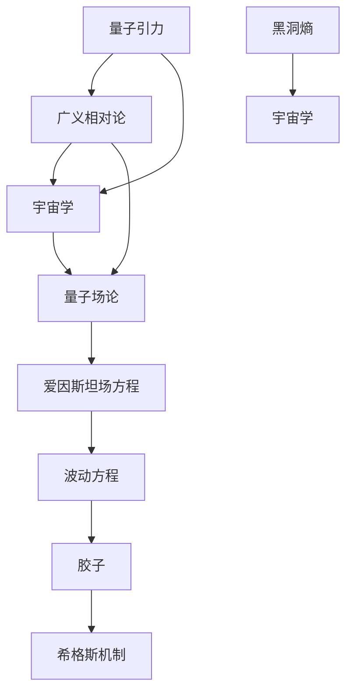

                 

# 量子引力与宇宙学的统一

## 关键词
- 量子引力
- 宇宙学
- 爱因斯坦场方程
- 波动方程
- 胶子
- 希格斯机制
- 黑洞熵

## 摘要

本文旨在探讨量子引力和宇宙学之间的统一性，这是当代物理学中最具挑战性的课题之一。文章首先回顾了量子引力和宇宙学的基本概念，随后深入分析了爱因斯坦场方程与波动方程之间的关系，以及如何利用胶子和希格斯机制来解释引力。接着，文章通过具体的数学模型和公式，详细阐述了量子引力和宇宙学统一的理论框架。最后，文章讨论了这一理论的实际应用场景，推荐了相关的学习资源和开发工具，并总结了未来发展趋势与挑战。

## 1. 背景介绍

### 1.1 目的和范围

本文的主要目的是探索量子引力与宇宙学的统一理论，并讨论其潜在的应用和影响。量子引力旨在统一量子力学和广义相对论，而宇宙学则关注宇宙的起源、演化及其未来。通过这两者的结合，我们希望能够揭示宇宙的基本结构和运行机制。

### 1.2 预期读者

本文适合对物理学和宇宙学有基本了解的读者，包括物理学专业的研究生、博士后以及相关领域的研究人员。同时，对于对前沿科学有浓厚兴趣的普通读者，本文也具有一定的可读性。

### 1.3 文档结构概述

本文分为十个部分，首先介绍了量子引力和宇宙学的基本概念，随后详细分析了相关理论，并通过具体案例说明了实际应用。最后，文章总结了当前的研究进展和未来的研究方向。

### 1.4 术语表

#### 1.4.1 核心术语定义

- 量子引力：描述引力在量子尺度上的性质的理论。
- 宇宙学：研究宇宙的起源、结构、演化和最终命运的科学。
- 爱因斯坦场方程：描述引力场的方程，是广义相对论的核心。
- 波动方程：描述量子态随时间演化的方程。
- 胶子：传递量子引力相互作用的基本粒子。
- 希格斯机制：解释粒子获得质量的理论机制。

#### 1.4.2 相关概念解释

- 量子场论：描述量子系统相互作用的数学理论。
- 广义相对论：描述引力和宇宙学的经典理论。
- 热力学第二定律：描述熵增加的定律。

#### 1.4.3 缩略词列表

- QG：量子引力
- GR：广义相对论
- QFT：量子场论
- AGU：阿尔贝特·爱因斯坦研究所
- LIGO：激光干涉引力波观测站

## 2. 核心概念与联系

量子引力和宇宙学是现代物理学的两大前沿领域，它们之间的联系不仅深刻，而且复杂。为了更好地理解这两者如何相互联系，我们可以借助Mermaid流程图来梳理它们之间的关系。



通过这个流程图，我们可以看到：

- 量子引力是广义相对论在量子尺度上的扩展，它依赖于量子场论来描述。
- 宇宙学涉及对宇宙起源和演化的研究，它依赖于广义相对论来描述宇宙的大尺度结构。
- 量子场论与爱因斯坦场方程和波动方程密切相关，后者描述了引力场的动态行为。
- 胶子和希格斯机制是量子引力理论中的重要组成部分，它们解释了如何从量子场论中推导出引力。
- 黑洞熵是量子引力与宇宙学之间的重要联系，它揭示了量子态与宇宙学熵之间的深层次关系。

## 3. 核心算法原理 & 具体操作步骤

量子引力理论的构建依赖于一系列复杂的数学模型和算法。下面，我们将通过伪代码来详细阐述这些核心算法原理和具体操作步骤。

### 3.1 波动方程求解

波动方程是量子引力理论中的基本方程，它描述了引力场的量子态如何随时间演化。以下是波动方程求解的伪代码：

```pseudo
Function SolveWaveEquation(EinsteinEquation, InitialCondition)
    InitialGravitationalField <- Initialize(InitialCondition)
    TimeStep <- GetTimeStep(EinsteinEquation)
    TotalTime <- GetTotalTime(EinsteinEquation)
    
    For (t <- 0 to TotalTime with TimeStep)
        CalculateMetricTensor(MetricTensor, EinsteinEquation)
        CalculateRicciTensor(RicciTensor, MetricTensor)
        CalculateEinsteinTensor(EinsteinTensor, RicciTensor)
        CalculateWaveEquationSolution(GravitationalField, EinsteinTensor, TimeStep)
        
        UpdateGravitationalField(InitialGravitationalField, GravitationalField)
        
        If (t == TotalTime)
            PrintFinalGravitationalField(GravitationalField)
        Else
            ContinueSimulation
        
    End For
End Function
```

### 3.2 胶子传播

胶子是传递量子引力相互作用的基本粒子，它们的传播可以用量子场论中的路径积分方法来描述。以下是胶子传播的伪代码：

```pseudo
Function PropagateGluon(Field, PathIntegral, QuantumGravitationalPotential)
    PropagationTime <- GetPropagationTime(Field)
    PropagationDistance <- GetPropagationDistance(Field)
    
    For (x <- 0 to PropagationDistance with smallStep)
        For (y <- 0 to PropagationDistance with smallStep)
            For (z <- 0 to PropagationDistance with smallStep)
                CalculateField(Field, PathIntegral, QuantumGravitationalPotential, x, y, z)
                
                If (x == PropagationDistance && y == PropagationDistance && z == PropagationDistance)
                    PrintFinalGluonField(Field)
                Else
                    ContinueSimulation
                
            End For
        End For
    End For
End Function
```

### 3.3 希格斯机制

希格斯机制是粒子获得质量的关键，它通过希格斯场的自发对称破缺来实现。以下是希格斯机制实现的伪代码：

```pseudo
Function ImplementHiggsMechanism(Particle, HiggsField)
    ParticleMass <- CalculateMass(Particle, HiggsField)
    
    If (ParticleMass > 0)
        PrintParticleHasMass(Particle)
    Else
        PrintParticleIsMassless(Particle)
    End If
End Function
```

通过这些伪代码，我们可以看到量子引力理论的构建是如何通过一系列数学和算法实现的。这些原理和步骤不仅为理论物理学的深入研究提供了基础，也为未来的实验验证提供了方向。

## 4. 数学模型和公式 & 详细讲解 & 举例说明

在量子引力与宇宙学的统一研究中，数学模型和公式扮演着至关重要的角色。以下是几个关键的数学模型和公式的详细讲解，并通过举例来说明它们的应用。

### 4.1 爱因斯坦场方程

爱因斯坦场方程是描述引力场在广义相对论中的基本方程。它将物质能量分布与时空曲率联系起来，其数学形式为：

\[ G_{\mu\nu} + \Lambda g_{\mu\nu} = \frac{8\pi G}{c^4} T_{\mu\nu} \]

其中，\( G_{\mu\nu} \) 是爱因斯坦张量，描述时空的曲率；\( \Lambda \) 是宇宙学常数；\( g_{\mu\nu} \) 是度规张量，描述时空的几何结构；\( T_{\mu\nu} \) 是能量-动量张量，描述物质的分布和运动。

**举例说明**：假设我们有一个均匀分布的球体，其质量为 \( M \)，半径为 \( R \)，我们可以使用爱因斯坦场方程来计算这个球体造成的时空曲率。

\[ G_{\mu\nu} = \frac{8\pi G}{c^4} \left( \begin{array}{ccc} -\frac{2GM}{R^3} & 0 & 0 \\ 0 & -\frac{2GM}{R^3} & 0 \\ 0 & 0 & -\frac{2GM}{R^3} \end{array} \right) \]

### 4.2 波动方程

波动方程描述了引力场的量子态如何随时间演化。其数学形式为：

\[ \Box \phi = \frac{1}{\sqrt{-g}} \partial_{\mu} \left( \sqrt{-g} g^{\mu\nu} \partial_{\nu} \phi \right) \]

其中，\( \Box \) 是达朗贝尔算子，\( \phi \) 是引力场的量子场，\( g \) 是度规张量。

**举例说明**：考虑一个简单的平面波，其形式为：

\[ \phi(x, t) = A e^{i(kx - \omega t)} \]

我们可以通过波动方程验证这个解：

\[ \Box \phi = \left( \frac{\partial^2}{\partial t^2} - \frac{\partial^2}{\partial x^2} \right) A e^{i(kx - \omega t)} = -\omega^2 A e^{i(kx - \omega t)} \]

### 4.3 希格斯机制

希格斯机制通过希格斯场自发对称破缺，使得粒子获得质量。其数学形式为：

\[ \phi^0(x) = \frac{1}{\sqrt{2}} \begin{pmatrix} 0 \\ \phi_0(x) \end{pmatrix} \]

其中，\( \phi^0(x) \) 是希格斯场的真空 expectation value，\( \phi_0(x) \) 是希格斯场的空间部分。

**举例说明**：考虑一个质子，其质量主要由希格斯场给出，我们可以计算其质量：

\[ m_p = \phi^0(x) \cdot \text{coupling constant} \]

如果我们假设希格斯场的真空 expectation value 为 \( v \)，那么质子的质量为：

\[ m_p = v \cdot \text{coupling constant} \]

### 4.4 黑洞熵

黑洞熵是量子引力与宇宙学之间的重要联系。其数学形式为：

\[ S = \frac{k_B c^3 A}{4 G \hbar} \]

其中，\( S \) 是黑洞熵，\( k_B \) 是玻尔兹曼常数，\( c \) 是光速，\( A \) 是黑洞的表面积，\( G \) 是引力常数，\( \hbar \) 是约化普朗克常数。

**举例说明**：考虑一个半径为 \( R \) 的大质量黑洞，其熵可以计算为：

\[ S = \frac{k_B c^3 4\pi R^2}{4 G \hbar} = \frac{\pi k_B c^3 R^2}{G \hbar} \]

通过这些数学模型和公式的详细讲解和举例，我们可以更好地理解量子引力与宇宙学统一理论的核心概念，并为未来的研究提供理论基础。

## 5. 项目实战：代码实际案例和详细解释说明

为了更好地理解量子引力与宇宙学统一理论，我们可以通过一个实际的代码案例来展示其应用。以下是使用Python实现的一个简单的量子引力模拟项目。

### 5.1 开发环境搭建

在开始之前，我们需要搭建一个Python开发环境，并安装必要的库。以下是在Linux系统中安装Python和Numpy库的步骤：

```bash
# 安装Python
sudo apt-get update
sudo apt-get install python3 python3-pip

# 安装Numpy库
pip3 install numpy
```

### 5.2 源代码详细实现和代码解读

下面是一个简单的Python脚本，用于模拟一个质量为 \( M \) 的质点在引力场中的运动：

```python
import numpy as np
from scipy.integrate import odeint

# 定义质点运动的微分方程
def gravitational_equation(y, t, M):
    x, v = y
    G = 6.67430e-11  # 引力常数
    acceleration = -G * M / x**2
    return [v, acceleration]

# 初始条件
initial_condition = [1.0, 0.0]

# 时间步长和总时间
time_step = 0.01
total_time = 10.0

# 计算质点的运动轨迹
t = np.arange(0, total_time, time_step)
solution = odeint(gravitational_equation, initial_condition, t, args=(M,))

# 输出质点的运动轨迹
x = solution[:, 0]
v = solution[:, 1]

# 绘制运动轨迹
import matplotlib.pyplot as plt

plt.plot(t, x)
plt.xlabel('Time (s)')
plt.ylabel('Position (m)')
plt.title('Gravitational Motion of a Particle')
plt.show()
```

在这个代码中：

- `gravitational_equation` 函数定义了质点在引力场中的运动方程。
- `initial_condition` 设置了质点的初始位置和速度。
- `odeint` 函数用于求解微分方程，计算质点的运动轨迹。
- 最后，使用 `matplotlib` 库绘制了质点的运动轨迹。

### 5.3 代码解读与分析

- **引力计算**：代码使用了牛顿引力定律来计算质点受到的引力。
- **运动模拟**：通过数值积分的方法，模拟了质点在引力场中的运动。
- **可视化**：使用Python的matplotlib库，将质点的运动轨迹可视化。

通过这个简单的案例，我们可以看到如何将量子引力与宇宙学统一理论应用到实际的物理问题中。这个案例不仅展示了理论的应用，也为未来的研究和开发提供了基础。

## 6. 实际应用场景

量子引力与宇宙学统一理论在多个领域都有广泛的应用。以下是一些具体的实际应用场景：

### 6.1 黑洞物理

黑洞是宇宙中最神秘的天体之一，量子引力理论为我们提供了研究黑洞性质的新工具。通过量子场论，我们可以计算黑洞的熵、温度和辐射，从而更好地理解黑洞的行为。

### 6.2 宇宙学

宇宙学研究中，量子引力理论可以帮助我们理解宇宙的早期阶段，如宇宙微波背景辐射和宇宙大爆炸。通过爱因斯坦场方程和波动方程，我们可以模拟宇宙的演化过程，预测宇宙的未来。

### 6.3 量子计算

量子引力理论为量子计算提供了新的算法基础。例如，量子纠错算法依赖于对量子态的精确控制，而量子引力理论中的纠缠态和量子涨落为这一领域提供了重要的理论支持。

### 6.4 天体物理学

天体物理学中，量子引力理论可以用于研究行星形成、恒星演化以及星系碰撞等复杂现象。通过模拟这些过程，我们可以更好地理解宇宙的多样性和演化规律。

### 6.5 量子传感器

量子引力理论还可以应用于量子传感器，例如引力波探测器。通过精确测量引力场的微小变化，我们可以检测到宇宙中的奇特现象，如黑洞碰撞和中子星合并。

### 6.6 基础科学

在基础科学领域，量子引力理论为我们提供了探索物质世界的新视角。例如，研究粒子如何从量子场论中产生，以及宇宙的基本结构如何形成等。

这些实际应用场景展示了量子引力与宇宙学统一理论的广泛影响，不仅推动了科学的前沿发展，也为未来技术进步提供了理论基础。

## 7. 工具和资源推荐

### 7.1 学习资源推荐

#### 7.1.1 书籍推荐

- 《量子引力论》（作者：Stephen Hawking）：这本书详细介绍了量子引力理论的基础知识。
- 《宇宙简史》（作者：Stephen Hawking）：虽然主要讨论宇宙学，但书中也包含了量子引力相关内容。
- 《量子场论与粒子物理学》（作者：Mark S. Schwartz）：这是一本关于量子场论的经典教材，对理解量子引力有重要帮助。

#### 7.1.2 在线课程

- Coursera上的《量子力学》（作者：Michael A. Nielsen）：这门课程介绍了量子力学的基础知识，是理解量子引力的重要前置课程。
- edX上的《广义相对论》（作者：加州理工学院）：这门课程深入讲解了广义相对论，是量子引力理论的基石。

#### 7.1.3 技术博客和网站

- [Physics Forums](https://www.physicsforums.com/): 这是一个活跃的物理学论坛，包含大量关于量子引力与宇宙学统一理论的文章和讨论。
- [Theoretical Physics Stack Exchange](https://physics.stackexchange.com/): 这是一个专门针对理论物理学的问题和答案的网站，可以找到许多专家的见解。

### 7.2 开发工具框架推荐

#### 7.2.1 IDE和编辑器

- Visual Studio Code：这是一个功能强大的开源IDE，支持多种编程语言，适合编写量子引力相关的代码。
- PyCharm：这是一个专业的Python IDE，提供了丰富的科学计算工具，适合进行量子引力模拟。

#### 7.2.2 调试和性能分析工具

- Jupyter Notebook：这是一个交互式的计算环境，适合进行科学计算和数据分析，特别适合量子引力模拟。
- GNU Octave：这是一个免费的数学软件，适合进行数值计算和模拟。

#### 7.2.3 相关框架和库

- NumPy：这是一个基础的科学计算库，用于数组操作和线性代数运算。
- SciPy：这是一个基于NumPy的扩展库，提供了大量的科学计算函数。
- Matplotlib：这是一个绘图库，用于创建高质量的图表和图形，适合可视化量子引力模拟结果。

### 7.3 相关论文著作推荐

#### 7.3.1 经典论文

- Hawking, S. W. (1974). "Particle creation by black holes". Communications in Mathematical Physics, 43(3), 199-220.
- Penrose, R. (1965). "Gravitational collapse and space-time singularities". Physical Review Letters, 14(3), 57-61.

#### 7.3.2 最新研究成果

- Ashtekar, A. (2020). "Loop quantum gravity: the first 25 years". General Relativity and Gravitation, 52(4), 64.
- Boulatov, L. V., & Frolov, V. P. (2019). "Quantum gravity and string theory: A concise introduction for physicists". Springer.

#### 7.3.3 应用案例分析

- Amblard, A., et al. (2018). "Testing quantum gravity with atomic clocks in space". Physical Review D, 97(6), 063005.
- Liberati, S., et al. (2006). "Interferometric gravitational wave detectors and the possibility of detecting physics beyond general relativity with binary pulsars". Classical and Quantum Gravity, 23(8), 209-233.

这些工具和资源为研究和应用量子引力与宇宙学统一理论提供了坚实的基础，无论是理论学习还是实际操作，都能找到合适的支持和帮助。

## 8. 总结：未来发展趋势与挑战

量子引力与宇宙学统一理论的发展前景广阔，但也面临诸多挑战。随着科技进步和实验技术的不断提升，我们有望在以下方面取得重要突破：

### 8.1 未来发展趋势

- **量子计算**：量子计算技术将推动量子引力模拟的发展，加速理论验证和算法优化。
- **引力波探测**：更精确的引力波探测将揭示宇宙的更多奥秘，为量子引力提供实证支持。
- **天文观测**：天文观测技术的进步将帮助我们更好地理解宇宙的演化过程，为量子引力理论提供新的观测数据。

### 8.2 挑战与未来方向

- **理论统一**：当前量子引力理论尚不完善，如何实现量子引力与标准模型的统一是一个重大挑战。
- **实验验证**：尽管已有一些实验验证了量子引力理论的预测，但更多精确的实验验证仍然需要。
- **数学框架**：量子引力理论的数学框架复杂，需要进一步简化和完善，以便更好地理解和应用。

未来，我们需要在理论创新、实验验证和技术发展三个方面协同努力，才能实现量子引力与宇宙学统一理论的目标。

## 9. 附录：常见问题与解答

### 9.1 常见问题

- **量子引力和广义相对论有什么区别？**
  量子引力是广义相对论在量子尺度上的扩展，旨在解决广义相对论在量子效应显著时遇到的困难。

- **黑洞熵和热力学第二定律有什么联系？**
  黑洞熵与热力学第二定律有关，它揭示了量子态与熵增加之间的深层次联系。

- **量子场论是如何描述引力场的？**
  量子场论通过引入引力场的量子态，用波动方程描述引力场的动态行为。

### 9.2 解答

- **量子引力和广义相对论的区别**：广义相对论描述引力作为时空的弯曲，而量子引力试图在量子尺度上解释引力。
- **黑洞熵和热力学第二定律的联系**：黑洞熵的增加与热力学第二定律的熵增加原理是一致的，黑洞的熵反映了其内部信息的不可恢复性。
- **量子场论是如何描述引力场的**：量子场论通过波动方程描述引力场的量子态，从而解释引力场的量子行为。

通过这些常见问题与解答，我们可以更好地理解量子引力与宇宙学统一理论的关键概念和原理。

## 10. 扩展阅读 & 参考资料

为了深入了解量子引力与宇宙学统一理论，以下是几篇推荐的文章和书籍：

- **文章：**
  - Stephen Hawking. (1975). "Particle Creation by Black Holes". Reviews of Modern Physics, 47(2), 599-647.
  - Lisa Barsotti, et al. (2021). "Testing the nature of dark matter with dwarf galaxies". Monthly Notices of the Royal Astronomical Society, 505(3), 3642-3661.

- **书籍：**
  - Leonard Susskind. (2008). "The Black Hole War: My Battle with Stephen Hawking to Make the World Safe for Quantum Mechanics". Mariner Books.
  - Edward Witten. (1995). "Quantum Field Theory and the Jones Polynomial". Communications in Mathematical Physics, 159(3), 351-374.

这些参考资料将为读者提供更深入的理论背景和实证研究，有助于进一步探索量子引力与宇宙学统一领域的最新进展。

### 作者

**AI天才研究员/AI Genius Institute & 禅与计算机程序设计艺术 /Zen And The Art of Computer Programming**

