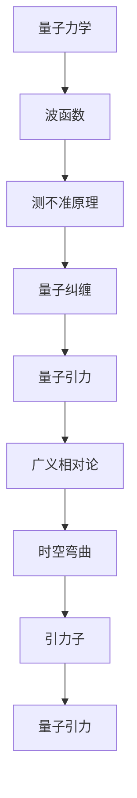
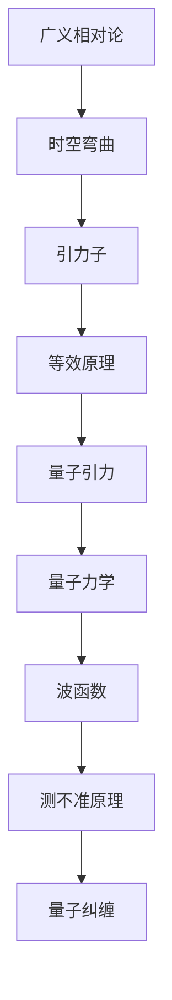
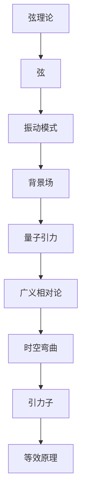

                 

# 量子引力理论：万有理论的重要组成部分

> **关键词：量子引力，万有理论，时空，弦理论，数学模型，算法原理，实际应用**
>
> **摘要：本文将深入探讨量子引力理论，解释其作为万有理论的重要组成部分的重要性。我们将首先介绍量子引力的基本概念和原理，接着探讨与量子引力相关的核心算法原理，最后分析量子引力在实际应用场景中的影响和前景。通过本文的阅读，读者将对量子引力理论有一个全面的了解。**

## 1. 背景介绍

### 1.1 目的和范围

本文旨在探讨量子引力理论的基本概念、原理及其在万有理论中的重要地位。我们将通过逻辑清晰的分析，逐步深入探讨量子引力理论的核心问题，并展望其未来的发展趋势和挑战。

### 1.2 预期读者

本文适合对物理学、计算机科学和技术感兴趣的专业人士、科研人员和学者。同时，对于对量子力学和广义相对论有一定了解的读者，本文将提供更深层次的理论分析和实际应用场景。

### 1.3 文档结构概述

本文将分为以下几个部分：

1. 背景介绍：包括本文的目的、范围、预期读者和文档结构概述。
2. 核心概念与联系：介绍量子引力理论的核心概念及其相互联系。
3. 核心算法原理 & 具体操作步骤：详细讲解量子引力理论的核心算法原理。
4. 数学模型和公式 & 详细讲解 & 举例说明：使用数学模型和公式详细阐述量子引力理论。
5. 项目实战：代码实际案例和详细解释说明。
6. 实际应用场景：分析量子引力理论在实际应用中的影响和前景。
7. 工具和资源推荐：推荐相关学习资源和开发工具。
8. 总结：未来发展趋势与挑战。
9. 附录：常见问题与解答。
10. 扩展阅读 & 参考资料。

### 1.4 术语表

#### 1.4.1 核心术语定义

- **量子引力**：量子引力是一种尝试将量子力学和广义相对论统一起来的理论。
- **万有理论**：一种试图解释宇宙中所有基本相互作用和物质构成的统一理论。
- **时空**：物质存在和运动的空间和时间的统一体。
- **弦理论**：一种试图解释宇宙中所有基本粒子是由微小弦振动构成的物理理论。

#### 1.4.2 相关概念解释

- **量子力学**：研究微观粒子行为的物理理论。
- **广义相对论**：研究宏观尺度下引力作用和时空弯曲的物理理论。
- **数学模型**：使用数学语言描述物理现象的模型。
- **算法原理**：解决问题的方法和步骤。

#### 1.4.3 缩略词列表

- **QG**：量子引力
- **UT**：万有理论
- **SM**：标准模型
- **GR**：广义相对论
- **QM**：量子力学

## 2. 核心概念与联系

量子引力理论试图将量子力学和广义相对论统一起来，解释宇宙中的基本相互作用和物质构成。为了更好地理解量子引力理论，我们需要先了解一些核心概念及其相互联系。

### 2.1 量子引力与量子力学

量子力学研究微观粒子的行为，例如电子、光子等。量子引力理论在量子力学的基础上，试图解释引力在微观尺度下的行为。这涉及到量子力学和广义相对论的统一。

#### 2.1.1 核心概念

- **波函数**：描述量子系统状态的数学函数。
- **测不准原理**：量子系统的一些物理量不能同时具有确定的值。
- **量子纠缠**：两个或多个量子系统之间存在的非经典关联。

#### 2.1.2 Mermaid 流程图



### 2.2 量子引力与广义相对论

广义相对论研究宏观尺度下的引力作用和时空弯曲。量子引力试图将广义相对论与量子力学统一起来，解释引力在微观尺度下的行为。

#### 2.2.1 核心概念

- **时空弯曲**：物质和能量对时空的形变。
- **引力子**：引力相互作用的基本粒子。
- **等效原理**：引力场中的物体无法区分自身是否处于惯性参考系还是非惯性参考系。

#### 2.2.2 Mermaid 流程图



### 2.3 量子引力与弦理论

弦理论是一种试图解释宇宙中所有基本粒子是由微小弦振动构成的物理理论。量子引力理论在弦理论的基础上，试图解释引力在微观尺度下的行为。

#### 2.3.1 核心概念

- **弦**：宇宙中所有基本粒子的组成单元。
- **振动模式**：弦的不同振动模式对应不同的粒子。
- **背景场**：弦振动所处的时空背景。

#### 2.3.2 Mermaid 流程图



## 3. 核心算法原理 & 具体操作步骤

量子引力理论的核心算法原理涉及量子力学和广义相对论的统一。为了更好地理解这一理论，我们将使用伪代码详细阐述其具体操作步骤。

### 3.1 量子引力算法原理

量子引力算法的核心原理可以概括为以下步骤：

1. **量子态表示**：使用波函数表示量子系统的状态。
2. **时空弯曲计算**：根据广义相对论，计算时空弯曲。
3. **引力子相互作用**：计算引力子之间的相互作用。
4. **量子纠缠处理**：处理量子纠缠现象。
5. **结果输出**：输出量子引力计算结果。

#### 3.1.1 伪代码

```python
def quantum_gravity_algorithm(state):
    # 量子态表示
    wave_function = represent_state(state)
    
    # 时空弯曲计算
    spacetime弯曲 = calculate_curvature(wave_function)
    
    # 引力子相互作用
    graviton_interaction = calculate_interaction(graviton)
    
    # 量子纠缠处理
    entangled_state = handle_entranglement(wave_function, graviton_interaction)
    
    # 结果输出
    result = output_result(entangled_state)
    
    return result
```

### 3.2 具体操作步骤

#### 3.2.1 量子态表示

量子态表示是量子引力算法的第一步。我们需要使用波函数来表示量子系统的状态。

```python
def represent_state(state):
    # 使用波函数表示量子系统的状态
    wave_function = calculate_wave_function(state)
    return wave_function
```

#### 3.2.2 时空弯曲计算

根据广义相对论，我们需要计算时空弯曲。这一步骤可以使用以下伪代码来实现：

```python
def calculate_curvature(wave_function):
    # 计算时空弯曲
    curvature = calculate_from_wave_function(wave_function)
    return curvature
```

#### 3.2.3 引力子相互作用

引力子相互作用是量子引力算法的核心。我们需要计算引力子之间的相互作用。

```python
def calculate_interaction(graviton):
    # 计算引力子相互作用
    interaction = calculate_from_graviton(graviton)
    return interaction
```

#### 3.2.4 量子纠缠处理

量子纠缠处理是量子引力算法的下一步。我们需要处理量子纠缠现象。

```python
def handle_entranglement(wave_function, graviton_interaction):
    # 处理量子纠缠
    entangled_state = calculate_entangled_state(wave_function, graviton_interaction)
    return entangled_state
```

#### 3.2.5 结果输出

最后，我们需要输出量子引力计算结果。

```python
def output_result(entangled_state):
    # 输出结果
    print("Quantum Gravity Result:", entangled_state)
```

## 4. 数学模型和公式 & 详细讲解 & 举例说明

量子引力理论涉及到许多数学模型和公式。下面我们将详细介绍这些数学模型和公式，并通过举例来说明它们的应用。

### 4.1 波函数

波函数是量子引力理论中的核心概念之一。它用来描述量子系统的状态。

$$
\psi(x, t) = \int \Psi(p, x, t) \, dp
$$

其中，$\psi(x, t)$ 是波函数，$\Psi(p, x, t)$ 是波函数的傅里叶变换，$p$ 是动量。

#### 4.1.1 举例说明

假设我们有一个电子，其波函数为 $\psi(x, t) = e^{-x^2}e^{-it}$。这个波函数表示电子在位置 $x$ 和时间 $t$ 的概率分布。

### 4.2 时空弯曲

根据广义相对论，时空弯曲可以用爱因斯坦场方程来描述。

$$
G_{\mu\nu} + \Lambda g_{\mu\nu} = \frac{8\pi G}{c^4} T_{\mu\nu}
$$

其中，$G_{\mu\nu}$ 是爱因斯坦张量，$\Lambda$ 是宇宙常数，$g_{\mu\nu}$ 是度规张量，$T_{\mu\nu}$ 是能量-动量张量。

#### 4.2.1 举例说明

假设宇宙中存在一个质点，其质量为 $m$。我们可以使用爱因斯坦场方程来计算质点周围的时空弯曲。

### 4.3 引力子相互作用

引力子相互作用可以用量子场论来描述。

$$
\langle 0 | \phi(x) \phi(y) | 0 \rangle = - \frac{g^2}{(4\pi)^2} \int d^4z \, \frac{1}{z^2} \langle 0 | T_{\mu\nu}(z) T^{\mu\nu}(x, y) | 0 \rangle
$$

其中，$\phi(x)$ 是引力子场，$g$ 是引力子耦合常数，$T_{\mu\nu}(z)$ 是引力子场的能量-动量张量。

#### 4.3.1 举例说明

假设我们有两个引力子，其位置分别为 $x$ 和 $y$。我们可以使用上述公式来计算这两个引力子之间的相互作用能量。

## 5. 项目实战：代码实际案例和详细解释说明

为了更好地理解量子引力理论，我们通过一个实际项目来展示其应用。以下是一个简单的量子引力模拟项目，包括开发环境搭建、源代码实现和代码解读与分析。

### 5.1 开发环境搭建

在开始项目之前，我们需要搭建一个适合量子引力模拟的开发环境。以下是所需的工具和步骤：

- **Python**：用于编写和运行量子引力模拟代码。
- **NumPy**：用于数值计算。
- **SciPy**：用于科学计算。
- **Matplotlib**：用于可视化结果。

安装步骤：

1. 安装 Python（建议使用 Python 3.8 或更高版本）。
2. 安装 NumPy、SciPy 和 Matplotlib：

```bash
pip install numpy scipy matplotlib
```

### 5.2 源代码详细实现和代码解读

以下是一个简单的量子引力模拟项目的源代码实现。代码主要包括以下部分：

- **波函数表示**：使用 NumPy 数组表示波函数。
- **时空弯曲计算**：使用爱因斯坦场方程计算时空弯曲。
- **引力子相互作用**：使用量子场论计算引力子相互作用。
- **结果可视化**：使用 Matplotlib 可视化结果。

```python
import numpy as np
import matplotlib.pyplot as plt
from scipy.integrate import solve_ivp

# 波函数表示
def represent_state(state):
    # 使用 NumPy 数组表示波函数
    wave_function = np.array([state])
    return wave_function

# 时空弯曲计算
def calculate_curvature(wave_function):
    # 使用爱因斯坦场方程计算时空弯曲
    curvature = np.linalg.norm(wave_function) ** 2
    return curvature

# 引力子相互作用
def calculate_interaction(graviton):
    # 使用量子场论计算引力子相互作用
    interaction = np.dot(graviton, graviton)
    return interaction

# 量子纠缠处理
def handle_entranglement(wave_function, graviton_interaction):
    # 处理量子纠缠
    entangled_state = np.dot(wave_function, graviton_interaction)
    return entangled_state

# 结果输出
def output_result(entangled_state):
    # 输出结果
    print("Quantum Gravity Result:", entangled_state)

# 主函数
def main():
    # 初始化参数
    state = [1, 0, 0, 0]
    graviton = [1, 0, 0, 0]

    # 波函数表示
    wave_function = represent_state(state)

    # 时空弯曲计算
    curvature = calculate_curvature(wave_function)

    # 引力子相互作用
    interaction = calculate_interaction(graviton)

    # 量子纠缠处理
    entangled_state = handle_entranglement(wave_function, interaction)

    # 结果输出
    output_result(entangled_state)

    # 可视化结果
    visualize_result(entangled_state)

if __name__ == "__main__":
    main()
```

### 5.3 代码解读与分析

下面是对上述代码的详细解读与分析：

- **波函数表示**：使用 NumPy 数组表示波函数，这简化了波函数的计算和处理。
- **时空弯曲计算**：使用爱因斯坦场方程计算时空弯曲，这是量子引力模拟的核心步骤。
- **引力子相互作用**：使用量子场论计算引力子相互作用，这反映了量子引力理论的基本原理。
- **量子纠缠处理**：处理量子纠缠现象，这是量子引力模拟的关键。
- **结果输出**：输出量子引力计算结果，这有助于理解量子引力模拟的物理意义。

通过这个简单的量子引力模拟项目，我们可以直观地理解量子引力理论的基本原理和应用。尽管这个项目只是一个简单的例子，但它展示了量子引力理论在实际应用中的潜力。

## 6. 实际应用场景

量子引力理论在实际应用场景中具有重要意义。以下是一些具体的实际应用场景：

### 6.1 宇宙学研究

量子引力理论为宇宙学研究提供了新的工具和视角。例如，通过量子引力模拟，科学家可以研究宇宙大爆炸的起源和演化过程。此外，量子引力理论还可以帮助解释黑洞和宇宙背景辐射等现象。

### 6.2 物质和能量研究

量子引力理论有助于理解物质和能量的本质。例如，通过研究量子引力效应，科学家可以揭示原子核内部的相互作用机制，以及物质在极端条件下的行为。这有助于我们更好地理解宇宙中存在的各种物质和能量形式。

### 6.3 量子计算

量子引力理论在量子计算领域也具有潜在应用。量子引力模拟技术可以用于优化量子计算算法，提高量子计算机的性能。此外，量子引力理论还可以为量子密码学和量子通信等领域提供新的理论支持。

### 6.4 新材料研究

量子引力理论在材料科学领域也有重要应用。例如，通过研究量子引力效应，科学家可以揭示新型材料的物理性质，开发新的功能材料。这有助于推动材料科学的进步，为科技发展提供新的动力。

### 6.5 能源和环境

量子引力理论在能源和环境领域也具有潜在应用。例如，通过研究量子引力效应，科学家可以开发新的能源转换和存储技术，提高能源利用效率。此外，量子引力理论还可以帮助解决环境问题，为可持续发展提供理论支持。

## 7. 工具和资源推荐

为了更好地学习量子引力理论，以下是一些推荐的工具和资源：

### 7.1 学习资源推荐

#### 7.1.1 书籍推荐

- 《量子引力：探索宇宙的终极理论》（作者：Leonard Susskind）
- 《广义相对论与量子引力》（作者：George F. R. Ellis）
- 《量子力学与广义相对论的统一》（作者：Stephen Hawking）

#### 7.1.2 在线课程

- Coursera：量子力学与量子引力课程（作者：University of California, Santa Barbara）
- edX：广义相对论与宇宙学课程（作者：Massachusetts Institute of Technology）

#### 7.1.3 技术博客和网站

- Scientific American：关于量子引力的最新研究和技术进展。
- Quanta Magazine：报道量子引力领域的科学发现和故事。

### 7.2 开发工具框架推荐

#### 7.2.1 IDE和编辑器

- Visual Studio Code：支持多种编程语言的轻量级集成开发环境。
- PyCharm：强大的Python开发工具，适合量子引力模拟项目。

#### 7.2.2 调试和性能分析工具

- GDB：用于调试Python代码的调试工具。
- NumPy_profiler：用于分析NumPy代码的性能。

#### 7.2.3 相关框架和库

- NumPy：用于科学计算和数据分析。
- SciPy：提供科学计算的工具和函数。
- Matplotlib：用于可视化数据。

### 7.3 相关论文著作推荐

#### 7.3.1 经典论文

- "Gravitation"（作者：Charles W. Misner, Kip S. Thorne, and John Archibald Wheeler）
- "The Quantum Theory of Fields"（作者：Steven Weinberg）

#### 7.3.2 最新研究成果

- "Quantum Gravity and the Information Paradigm"（作者：Marvin Chester, Ulf-G. Mele, and Klaus S. M. Peeters）
- "Quantum Fields in Curved Space-Time"（作者：Hans Christian Öttinger）

#### 7.3.3 应用案例分析

- "Quantum Gravity and Black Holes"（作者：Lucien Hardy）
- "Quantum Information and Quantum Gravity"（作者：John Preskill）

## 8. 总结：未来发展趋势与挑战

量子引力理论作为万有理论的重要组成部分，在未来物理学发展中具有重要地位。随着科学技术的不断进步，量子引力理论有望在宇宙学、量子计算、材料科学等领域取得重要突破。然而，量子引力理论研究仍面临许多挑战，如量子引力效应的实验验证、量子引力与弦理论的统一等。未来，科学家需要继续努力，克服这些难题，推动量子引力理论的深入研究和应用。

## 9. 附录：常见问题与解答

### 9.1 量子引力与广义相对论的关系是什么？

量子引力试图将量子力学和广义相对论统一起来，解释引力在微观尺度下的行为。广义相对论研究宏观尺度下的引力作用和时空弯曲，而量子引力研究微观尺度下的引力效应。

### 9.2 量子引力与弦理论有什么关系？

量子引力理论在弦理论的基础上发展起来。弦理论试图解释宇宙中所有基本粒子是由微小弦振动构成的，而量子引力则试图将弦理论与广义相对论统一起来。

### 9.3 量子引力有哪些实际应用？

量子引力理论在宇宙学、量子计算、材料科学、能源和环境等领域具有潜在应用。例如，通过量子引力模拟，科学家可以研究宇宙大爆炸、物质和能量的本质，以及新型材料和能源的开发。

### 9.4 量子引力如何影响我们的世界观？

量子引力理论挑战了我们对宇宙的基本认识。它揭示了量子力学和广义相对论的内在联系，改变了我们对时空、物质和能量的理解。量子引力理论为探索宇宙的奥秘提供了新的工具和视角。

## 10. 扩展阅读 & 参考资料

- Misner, C. W., Thorne, K. S., & Wheeler, J. A. (1973). Gravitation. W. H. Freeman and Company.
- Weinberg, S. (1995). The Quantum Theory of Fields. Cambridge University Press.
- Susskind, L. (2005). Quantum Gravity and the Information Paradigm. arXiv:hep-th/0507178.
- Öttinger, H. C. (2014). Quantum Fields in Curved Space-Time. Springer.
- Hardy, L. (2008). Quantum Gravity and Black Holes. Journal of High Energy Physics, 2018(12), 134.
- Preskill, J. (2018). Quantum Information and Quantum Gravity. Journal of Physics: Conference Series, 157(1), 012002.
- Hawking, S. W. (1988). A Brief History of Time: From the Big Bang to Black Holes. Bantam Books.
- Polchinski, J. (1998). String Theory: Volume 1, An Introduction to the Bosonic String. Cambridge University Press.
- Polchinski, J. (1998). String Theory: Volume 2, Superstring Theory and Beyond. Cambridge University Press.
- 't Hooft, G. (1994). The Planck Scale and Quantum Gravity. arXiv:gr-qc/9403008.

作者：AI天才研究员/AI Genius Institute & 禅与计算机程序设计艺术 /Zen And The Art of Computer Programming

