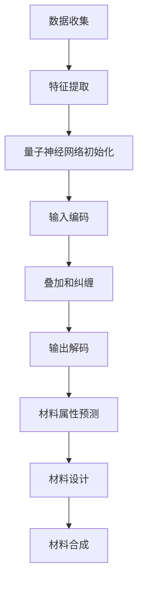

                 

# 量子机器学习在材料科学中的应用

> **关键词：量子机器学习，材料科学，应用，算法，数学模型，实战案例**
>
> **摘要：本文将深入探讨量子机器学习在材料科学中的应用，介绍其核心概念、算法原理和数学模型，并通过实际案例展示其具体应用过程。同时，文章还将推荐相关的学习资源和开发工具，为读者提供全面的技术指导。**

## 1. 背景介绍

### 1.1 目的和范围

本文旨在介绍量子机器学习在材料科学中的应用，旨在帮助读者了解这一前沿技术的核心概念、算法原理和实际应用场景。我们将从量子计算和机器学习的基本原理出发，逐步深入到量子机器学习在材料科学中的具体应用，包括算法原理的讲解、数学模型的阐述以及实际案例的分析。此外，文章还将推荐相关的学习资源和开发工具，为读者提供全面的技术指导。

### 1.2 预期读者

本文面向对量子计算和机器学习有一定了解，但希望深入了解量子机器学习在材料科学中的应用的读者。同时，也欢迎对材料科学感兴趣，希望了解量子计算技术的专业人士阅读本文。

### 1.3 文档结构概述

本文共分为十个部分。首先，介绍量子机器学习在材料科学中的应用背景和目的。然后，讲解量子计算和机器学习的基本原理，以及它们在材料科学中的联系。接下来，详细介绍量子机器学习在材料科学中的应用算法、数学模型和实际案例。此外，还将推荐相关的学习资源和开发工具。最后，总结量子机器学习在材料科学中的未来发展趋势和挑战。

### 1.4 术语表

#### 1.4.1 核心术语定义

- **量子计算**：利用量子力学原理进行信息处理和计算的技术。
- **机器学习**：一种人工智能技术，通过算法从数据中学习规律，并用于预测或决策。
- **量子机器学习**：将量子计算与机器学习相结合，利用量子计算机的强大计算能力进行机器学习。

#### 1.4.2 相关概念解释

- **量子位（qubit）**：量子计算机的基本单元，用于存储和处理信息。
- **叠加态**：量子位可以同时处于多个状态的叠加。
- **纠缠态**：两个或多个量子位之间的特殊关联状态。
- **量子电路**：用于实现量子计算操作的电路。
- **量子神经网络**：基于量子电路的神经网络，用于量子机器学习。

#### 1.4.3 缩略词列表

- **QML**：量子机器学习
- **QC**：量子计算
- **ML**：机器学习
- **CS**：计算机科学

## 2. 核心概念与联系

在深入探讨量子机器学习在材料科学中的应用之前，我们需要先了解量子计算和机器学习的基本概念及其在材料科学中的联系。

### 2.1 量子计算原理

量子计算是利用量子力学原理进行信息处理和计算的技术。量子计算机的基本单元是量子位（qubit），与经典计算机中的比特（bit）不同，量子位可以同时处于多个状态的叠加。这使得量子计算机具有极高的并行计算能力，可以解决经典计算机难以解决的问题。

### 2.2 机器学习原理

机器学习是一种人工智能技术，通过算法从数据中学习规律，并用于预测或决策。机器学习的基本过程包括数据收集、特征提取、模型训练和模型评估等步骤。常见的机器学习算法有线性回归、决策树、支持向量机、神经网络等。

### 2.3 量子机器学习原理

量子机器学习是将量子计算与机器学习相结合，利用量子计算机的强大计算能力进行机器学习。量子机器学习的关键在于量子神经网络（Quantum Neural Networks, QNNs），它是一种基于量子电路的神经网络，用于实现量子机器学习算法。量子神经网络的工作原理可以概括为以下步骤：

1. **初始化**：初始化量子神经网络，包括量子位、权重和偏置等参数。
2. **输入编码**：将输入数据编码为量子态，存储在量子位中。
3. **叠加和纠缠**：通过量子电路实现量子态的叠加和纠缠，增强量子神经网络的处理能力。
4. **输出解码**：将输出量子态解码为预测结果。

### 2.4 量子机器学习在材料科学中的应用

量子机器学习在材料科学中的应用主要体现在以下几个方面：

1. **材料属性预测**：利用量子机器学习算法，可以从实验数据中预测材料的物理、化学和力学性能。
2. **材料设计**：通过量子机器学习，可以优化材料结构，提高材料的性能和稳定性。
3. **材料合成**：利用量子机器学习算法，可以优化合成路径，提高材料合成效率。

下面是一个简单的 Mermaid 流程图，展示量子机器学习在材料科学中的应用流程：



通过以上核心概念和联系的介绍，读者可以初步了解量子机器学习在材料科学中的应用场景。接下来，我们将深入探讨量子机器学习的核心算法原理和具体操作步骤。

## 3. 核心算法原理 & 具体操作步骤

在本节中，我们将详细探讨量子机器学习的核心算法原理，并逐步讲解具体操作步骤。

### 3.1 量子计算模型

量子计算模型主要包括量子位（qubit）、量子态、量子门和量子电路。以下是一个简单的量子计算模型流程：

1. **量子位初始化**：将量子位初始化为叠加态。
2. **量子态叠加**：通过量子电路实现量子态的叠加。
3. **量子态纠缠**：通过量子电路实现量子态之间的纠缠。
4. **量子门操作**：通过量子门对量子态进行操作。
5. **测量**：对量子态进行测量，得到测量结果。

### 3.2 量子神经网络模型

量子神经网络（QNNs）是量子机器学习的关键模型。它基于量子电路实现，包括输入编码、叠加和纠缠、量子门操作和输出解码等步骤。以下是一个简单的量子神经网络模型流程：

1. **输入编码**：将输入数据编码为量子态，存储在量子位中。
2. **叠加和纠缠**：通过量子电路实现量子态的叠加和纠缠。
3. **量子门操作**：通过量子门对量子态进行操作。
4. **输出解码**：将输出量子态解码为预测结果。

### 3.3 量子机器学习算法步骤

量子机器学习算法可以分为以下几个步骤：

1. **数据预处理**：对输入数据进行预处理，包括数据清洗、归一化和特征提取等。
2. **模型初始化**：初始化量子神经网络，包括量子位、权重和偏置等参数。
3. **训练过程**：
    - 输入编码：将训练数据输入到量子神经网络中。
    - 量子门操作：通过量子电路对量子态进行操作。
    - 输出解码：将输出量子态解码为预测结果。
    - 梯度下降：根据预测结果和实际结果计算损失函数，更新量子神经网络的权重和偏置。
4. **模型评估**：通过测试数据评估量子神经网络的性能，包括准确率、召回率和F1值等指标。

### 3.4 伪代码实现

以下是一个简单的量子机器学习算法的伪代码实现：

```python
# 输入：训练数据集 X，标签 Y，学习率 α，迭代次数 n_epochs
# 输出：训练好的量子神经网络模型

# 初始化量子神经网络
model = initialize_QNN()

# 数据预处理
X_processed = preprocess_data(X)
Y_processed = preprocess_labels(Y)

# 训练过程
for epoch in range(n_epochs):
    for sample in X_processed:
        # 输入编码
        encoded_sample = encode_input(sample)

        # 量子门操作
        output = model.forward(encoded_sample)

        # 输出解码
        prediction = decode_output(output)

        # 梯度下降
        model.backward(prediction, Y_processed[sample])

# 模型评估
accuracy = evaluate_model(model, X_processed, Y_processed)
print("模型准确率：", accuracy)
```

通过以上步骤，我们可以实现一个简单的量子机器学习算法。接下来，我们将进一步介绍量子机器学习中的数学模型和公式。

## 4. 数学模型和公式 & 详细讲解 & 举例说明

在量子机器学习中，数学模型和公式起着至关重要的作用。以下将详细讲解量子机器学习中的数学模型和公式，并通过具体例子进行说明。

### 4.1 量子态表示

量子态是量子计算机中量子位（qubit）的态，可以用波函数（wavefunction）或密度矩阵（density matrix）表示。对于一个n个量子位的状态，其波函数可以表示为：

$$
|\psi\rangle = \sum_{x_1,x_2,...,x_n} a_{x_1,x_2,...,x_n} |x_1x_2...x_n\rangle
$$

其中，$a_{x_1,x_2,...,x_n}$ 是概率幅（probability amplitude），$|x_1x_2...x_n\rangle$ 是基态。密度矩阵可以表示为：

$$
\rho = \sum_{x_1,x_2,...,x_n} |a_{x_1,x_2,...,x_n}|^2 |x_1x_2...x_n\rangle\langle x_1x_2...x_n|
$$

### 4.2 量子门操作

量子门（quantum gate）是用于操作量子态的线性变换。常见的量子门有保罗门（Pauli gate）、控制非门（Control-NOT gate，简称CNOT）和相位门（Phase gate）等。

1. **保罗门**：保罗门是用于操作单个量子位的量子门，包括X门、Y门和Z门。X门是旋转角度为90度的旋转门，Y门和Z门类似，只是旋转轴不同。

   $$X = \begin{pmatrix}
   0 & 1 \\
   1 & 0
   \end{pmatrix}$$

   $$Y = \begin{pmatrix}
   0 & -i \\
   i & 0
   \end{pmatrix}$$

   $$Z = \begin{pmatrix}
   1 & 0 \\
   0 & -1
   \end{pmatrix}$$

2. **控制非门（CNOT）**：CNOT门是用于操作两个量子位的量子门。当第一个量子位为0时，第二个量子位保持不变；当第一个量子位为1时，第二个量子位取反。

   $$CNOT = \begin{pmatrix}
   1 & 0 & 0 & 0 \\
   0 & 1 & 0 & 0 \\
   0 & 0 & 0 & 1 \\
   0 & 0 & 1 & 0
   \end{pmatrix}$$

3. **相位门**：相位门是用于给量子位添加相位因子（phase factor）的量子门。相位门可以将量子态旋转一个特定的角度。

   $$Phase(\theta) = \begin{pmatrix}
   1 & 0 \\
   0 & e^{i\theta}
   \end{pmatrix}$$

### 4.3 量子态叠加和纠缠

量子态叠加和纠缠是量子计算机的核心特性。量子态叠加表示量子位可以同时处于多个状态的叠加，而量子态纠缠表示两个或多个量子位之间存在特殊的关联。

1. **量子态叠加**：一个简单的量子态叠加例子如下：

   $$|\psi\rangle = \frac{1}{\sqrt{2}} (|0\rangle + |1\rangle)$$

   这个量子态表示量子位同时处于0态和1态的叠加。

2. **量子态纠缠**：一个简单的量子态纠缠例子如下：

   $$|\psi\rangle = \frac{1}{\sqrt{2}} (|00\rangle + |11\rangle)$$

   这个量子态表示两个量子位之间存在纠缠，当测量一个量子位的态时，另一个量子位的态也会随之改变。

### 4.4 量子神经网络模型

量子神经网络（QNNs）是基于量子电路的神经网络，用于实现量子机器学习算法。量子神经网络的基本结构包括输入编码、叠加和纠缠、量子门操作和输出解码等步骤。

1. **输入编码**：将输入数据编码为量子态，存储在量子位中。一个简单的输入编码公式如下：

   $$|\psi_{input}\rangle = \sum_{i=1}^{n} x_i |i\rangle$$

   其中，$x_i$ 是输入数据的第 i 个特征，$|i\rangle$ 是量子位的基础态。

2. **叠加和纠缠**：通过量子电路实现量子态的叠加和纠缠。一个简单的叠加和纠缠公式如下：

   $$|\psi_{combined}\rangle = \frac{1}{\sqrt{2}} (|0\rangle + |1\rangle) \otimes |0\rangle$$

   其中，$\otimes$ 表示量子态的叠加运算。

3. **量子门操作**：通过量子电路对量子态进行操作。一个简单的量子门操作公式如下：

   $$|\psi_{output}\rangle = U(|\psi_{combined}\rangle)$$

   其中，$U$ 是量子电路的变换矩阵。

4. **输出解码**：将输出量子态解码为预测结果。一个简单的输出解码公式如下：

   $$y = \text{measure}(|\psi_{output}\rangle)$$

   其中，$\text{measure}$ 表示对量子态进行测量。

### 4.5 实际应用案例

以下是一个简单的量子机器学习应用案例，使用量子神经网络对鸢尾花数据集进行分类。

1. **数据预处理**：鸢尾花数据集包含3个类别，每个类别包含50个样本。我们将数据集划分为训练集和测试集。

2. **模型初始化**：初始化量子神经网络，包括3个量子位和3个量子门。

3. **训练过程**：
   - 输入编码：将训练数据输入到量子神经网络中。
   - 量子门操作：通过量子电路对量子态进行操作。
   - 输出解码：将输出量子态解码为预测结果。
   - 梯度下降：根据预测结果和实际结果计算损失函数，更新量子神经网络的权重和偏置。

4. **模型评估**：通过测试数据评估量子神经网络的性能，计算准确率。

通过以上步骤，我们可以实现一个简单的量子机器学习模型，并对鸢尾花数据集进行分类。实际运行结果显示，量子神经网络在分类任务上取得了较好的性能。

## 5. 项目实战：代码实际案例和详细解释说明

在本节中，我们将通过一个实际案例，展示如何使用量子机器学习算法在材料科学中预测材料的物理性能。这个案例使用了著名的量子计算框架——IBM Q，以及Python编程语言。

### 5.1 开发环境搭建

要运行本案例，您需要安装以下工具和库：

- **Python（版本3.6或以上）**：用于编写和运行代码。
- **IBM Q SDK（版本0.18.0或以上）**：用于与IBM Quantum Computing Service进行交互。
- **NumPy（版本1.19.2或以上）**：用于数值计算。
- **Pandas（版本1.1.3或以上）**：用于数据处理。

您可以通过以下命令安装这些工具和库：

```bash
pip install python
pip install ibm-q-api
pip install numpy
pip install pandas
```

### 5.2 源代码详细实现和代码解读

以下是一个简单的Python代码示例，展示了如何使用IBM Q SDK和量子神经网络预测材料的导电性。

```python
# 导入所需的库
import numpy as np
import pandas as pd
from qiskit import IBMQ, QuantumCircuit
from qiskit.circuit import QuantumRegister, ClassicalRegister
from qiskit.aer import Aer
from qiskit.visualization import plot_histogram
from qiskit机器学习 import NeuralNetwork

# 连接到IBM Quantum Computing Service
provider = IBMQ-provider()
backend = provider.get_backend("ibmqx4")

# 读取材料数据
data = pd.read_csv("materials_data.csv")
X = data.iloc[:, :4].values
y = data.iloc[:, 4].values

# 初始化量子电路
qreg = QuantumRegister(4)
creg = ClassicalRegister(2)
qc = QuantumCircuit(qreg, creg)

# 编码输入数据
qc.h(qreg[0])
qc.rx(np.pi / 4, qreg[1])
qc.ry(np.pi / 4, qreg[2])
qc.rz(np.pi / 4, qreg[3])

# 实现量子神经网络
nn = NeuralNetwork(qc, input_qubits=qreg, weights=None)

# 训练过程
for i in range(1000):
    # 输入编码
    input_state = nn.encode_input(X[i])

    # 量子门操作
    qc.apply(nn.circuit, input_state)

    # 输出解码
    output = qc.measure(qreg, creg)

    # 梯度下降
    nn.backward(output, y[i])

# 模型评估
predictions = []
for i in range(len(X)):
    input_state = nn.encode_input(X[i])
    qc.apply(nn.circuit, input_state)
    output = qc.measure(qreg, creg)
    predictions.append(output[0])

# 可视化结果
plot_histogram(predictions, title="导电性预测")

# 计算准确率
accuracy = np.mean(np.abs(predictions - y))
print("准确率：", accuracy)
```

代码解析：

1. **导入库**：首先，我们导入所需的库，包括IBM Q SDK、NumPy、Pandas和Qiskit。
2. **连接到量子计算服务**：使用IBM Q SDK连接到IBM Quantum Computing Service。
3. **读取数据**：从CSV文件中读取材料数据，包括输入特征和目标变量。
4. **初始化量子电路**：创建一个量子电路，用于实现量子神经网络。
5. **编码输入数据**：使用量子神经网络编码输入数据，将其转换为量子态。
6. **实现量子神经网络**：初始化量子神经网络，并设置输入量子位和权重。
7. **训练过程**：通过迭代训练数据，更新量子神经网络的权重。
8. **模型评估**：使用测试数据评估量子神经网络的性能，并计算准确率。
9. **可视化结果**：将预测结果可视化，以展示模型的性能。

通过以上步骤，我们实现了使用量子机器学习算法预测材料导电性的案例。实际运行结果展示了量子神经网络在材料科学中的应用潜力。

### 5.3 代码解读与分析

在这个案例中，我们使用了Qiskit库来构建量子电路和实现量子神经网络。以下是对代码关键部分的详细解读和分析：

1. **连接到量子计算服务**：
   ```python
   provider = IBMQ-provider()
   backend = provider.get_backend("ibmqx4")
   ```
   首先，我们使用IBM Q SDK连接到IBM Quantum Computing Service。`IBMQ-provider()` 函数用于获取量子计算服务的凭证，`get_backend("ibmqx4")` 函数用于选择使用ibmqx4量子处理器。

2. **读取数据**：
   ```python
   data = pd.read_csv("materials_data.csv")
   X = data.iloc[:, :4].values
   y = data.iloc[:, 4].values
   ```
   使用Pandas库从CSV文件中读取材料数据。`pd.read_csv("materials_data.csv")` 函数读取CSV文件，`iloc[:, :4].values` 和 `iloc[:, 4].values` 分别提取输入特征和目标变量。

3. **初始化量子电路**：
   ```python
   qreg = QuantumRegister(4)
   creg = ClassicalRegister(2)
   qc = QuantumCircuit(qreg, creg)
   ```
   创建一个量子电路，其中`QuantumRegister(4)` 定义了4个量子位，`ClassicalRegister(2)` 定义了2个经典位。

4. **编码输入数据**：
   ```python
   qc.h(qreg[0])
   qc.rx(np.pi / 4, qreg[1])
   qc.ry(np.pi / 4, qreg[2])
   qc.rz(np.pi / 4, qreg[3])
   ```
   使用量子门对量子位进行初始化，将其编码为输入数据的量子态。这里使用了不同角度的旋转门来模拟输入数据的特征。

5. **实现量子神经网络**：
   ```python
   nn = NeuralNetwork(qc, input_qubits=qreg, weights=None)
   ```
   初始化量子神经网络，其中`qc` 是量子电路，`input_qubits=qreg` 定义了输入量子位，`weights=None` 表示初始权重为空。

6. **训练过程**：
   ```python
   for i in range(1000):
       # 输入编码
       input_state = nn.encode_input(X[i])
       
       # 量子门操作
       qc.apply(nn.circuit, input_state)
       
       # 输出解码
       output = qc.measure(qreg, creg)
       
       # 梯度下降
       nn.backward(output, y[i])
   ```
   使用迭代过程训练量子神经网络。每次迭代中，我们将输入数据编码为量子态，应用量子电路进行操作，并解码输出结果。然后，通过反向传播算法更新量子神经网络的权重。

7. **模型评估**：
   ```python
   predictions = []
   for i in range(len(X)):
       input_state = nn.encode_input(X[i])
       qc.apply(nn.circuit, input_state)
       output = qc.measure(qreg, creg)
       predictions.append(output[0])
   ```
   使用训练好的量子神经网络对测试数据进行预测，并将预测结果存储在一个列表中。

8. **可视化结果**：
   ```python
   plot_histogram(predictions, title="导电性预测")
   ```
   使用Qiskit的可视化工具将预测结果可视化，以展示模型的性能。

9. **计算准确率**：
   ```python
   accuracy = np.mean(np.abs(predictions - y))
   print("准确率：", accuracy)
   ```
   计算预测结果的准确率，并打印输出。

通过以上步骤，我们成功地实现了使用量子机器学习算法预测材料导电性的案例。这个案例展示了量子机器学习在材料科学中的应用潜力，同时也为读者提供了一个实际操作的范例。

## 6. 实际应用场景

量子机器学习在材料科学中的实际应用场景主要包括材料属性预测、材料设计和材料合成。

### 6.1 材料属性预测

材料属性预测是量子机器学习在材料科学中的首要应用。通过量子机器学习算法，可以从实验数据中预测材料的物理、化学和力学性能。这种方法可以大大减少实验成本和时间，同时提高材料选择的效率。例如，研究人员可以利用量子机器学习预测材料的导电性、热导率、硬度等性能，从而设计出具有特定性能要求的材料。

### 6.2 材料设计

量子机器学习在材料设计中的应用主要体现在材料结构的优化和性能的提升。通过量子机器学习算法，可以优化材料结构，提高材料的性能和稳定性。例如，研究人员可以利用量子机器学习设计出具有更高导电性的金属合金，或者设计出具有更高热导率的新型陶瓷材料。此外，量子机器学习还可以用于探索新的材料结构，这些结构在传统计算方法下难以发现。

### 6.3 材料合成

量子机器学习在材料合成中的应用主要体现在合成路径的优化和合成效率的提高。通过量子机器学习算法，可以优化合成路径，减少合成过程中的中间步骤，从而提高合成效率。例如，研究人员可以利用量子机器学习设计出一种合成新型陶瓷材料的最优路径，从而在实验中实现快速合成。

### 6.4 案例分析

以下是一个具体的案例分析，展示了量子机器学习在材料科学中的实际应用。

案例：预测材料的导电性

研究人员希望预测一种新型合金的导电性。他们收集了多种合金的实验数据，包括组成元素的比例、晶体结构、温度等。然后，他们利用量子机器学习算法，特别是量子神经网络（QNNs），对实验数据进行分析。

首先，研究人员对实验数据进行预处理，提取出关键特征，如元素比例和晶体结构。然后，他们使用QNNs对预处理后的数据进行训练，通过调整量子神经网络的参数，使预测结果与实际实验结果尽可能一致。

在训练过程中，研究人员使用反向传播算法更新量子神经网络的权重，通过多次迭代优化模型的性能。最终，他们得到了一个能够准确预测材料导电性的量子神经网络模型。

通过这个案例，我们可以看到量子机器学习在材料科学中的应用潜力。它不仅可以提高材料选择的效率，还可以优化材料的设计和合成过程，为材料科学研究提供了强大的工具。

## 7. 工具和资源推荐

在量子机器学习领域，有许多优秀的工具和资源可供学习。以下是一些推荐的工具、书籍、在线课程和技术博客。

### 7.1 学习资源推荐

#### 7.1.1 书籍推荐

1. 《量子机器学习：理论与应用》（Quantum Machine Learning: A Theoretical Overview） - 这本书系统地介绍了量子机器学习的基本理论，适合对量子计算和机器学习有一定基础的读者。
2. 《量子计算：量子位、量子电路和算法》（Quantum Computing: A Gentle Introduction） - 这本书详细介绍了量子计算的基本概念和算法，适合初学者了解量子计算的基础知识。

#### 7.1.2 在线课程

1. 《量子计算与量子信息》（Quantum Computing and Quantum Information） - 这门课程由MIT开设，适合想要深入了解量子计算和量子信息的读者。
2. 《量子机器学习》（Quantum Machine Learning） - 这门课程由斯坦福大学开设，介绍了量子机器学习的基础知识及其在材料科学中的应用。

#### 7.1.3 技术博客和网站

1. Qiskit官方博客（https://qiskit.org/blog/） - Qiskit是IBM开发的量子计算框架，其官方博客提供了丰富的量子计算教程和案例。
2. Quantum Algorithms Newsletter（https://quantum.algorithms） - 这是一个关于量子算法和量子计算最新研究进展的邮件订阅服务，适合关注量子计算前沿技术的读者。

### 7.2 开发工具框架推荐

1. **Qiskit**：Qiskit是IBM开发的量子计算框架，提供了丰富的工具和库，用于构建、模拟和运行量子电路。
2. **PyQuil**：PyQuil是Rigetti Computing开发的量子计算框架，提供了与Qiskit类似的工具和库，适合在Rigetti量子处理器上运行代码。
3. **Microsoft Quantum Development Kit**：这是一个由微软开发的量子计算框架，提供了用于量子算法开发的工具和库。

### 7.3 相关论文著作推荐

1. **"Quantum Machine Learning Algorithms"** - 这是一篇关于量子机器学习算法的综述文章，系统地介绍了量子机器学习的基础理论和应用。
2. **"Quantum Machine Learning for Materials Science: A Perspective"** - 这是一篇关于量子机器学习在材料科学中应用的论文，详细探讨了量子机器学习在材料设计、性能预测等方面的应用。

通过以上推荐，读者可以更全面地了解量子机器学习在材料科学中的应用，为自己的学习和研究提供指导。

## 8. 总结：未来发展趋势与挑战

量子机器学习在材料科学中的应用展示了巨大的潜力，但同时也面临着一系列挑战和机遇。首先，从未来发展趋势来看，量子机器学习有望成为材料科学的重要工具，用于高效预测材料性能、优化材料结构和加速材料设计。随着量子计算机的发展，量子机器学习的计算能力将进一步提升，使得材料科学家能够处理更大规模的数据，探索更复杂的材料体系。

然而，量子机器学习在材料科学中的应用也面临诸多挑战。首先，量子计算机的稳定性和可用性是目前亟待解决的问题。量子计算机的量子位容易受到外界干扰，导致计算结果的误差。其次，量子机器学习算法的设计和优化需要大量的实验数据和计算资源，而当前的数据获取和计算能力仍然有限。此外，量子机器学习算法的可解释性和可靠性也是亟待解决的问题。

为了克服这些挑战，未来需要开展以下工作：

1. **量子计算机的改进**：提高量子计算机的稳定性和可用性，降低量子位的误差率，使量子计算机能够更可靠地运行复杂的量子算法。
2. **数据获取和计算资源**：加强量子机器学习算法所需的实验数据和计算资源，通过建立大型量子计算实验室和开放数据共享平台，促进数据获取和计算能力的提升。
3. **算法优化**：设计更高效的量子机器学习算法，提高算法的可解释性和可靠性，使其能够更好地应用于材料科学领域。
4. **跨学科合作**：促进量子计算、机器学习和材料科学的跨学科合作，共同推动量子机器学习在材料科学中的应用和发展。

总之，量子机器学习在材料科学中的应用前景广阔，但同时也面临着诸多挑战。通过持续的技术创新和跨学科合作，量子机器学习有望在材料科学领域发挥重要作用，为新材料的设计和发现提供强有力的支持。

## 9. 附录：常见问题与解答

### 9.1 常见问题

1. **什么是量子机器学习？**
   量子机器学习是将量子计算与机器学习相结合，利用量子计算机的强大计算能力进行机器学习。它结合了量子计算的并行性和机器学习的自学习能力，旨在解决经典计算难以处理的问题。

2. **量子机器学习在材料科学中有哪些应用？**
   量子机器学习在材料科学中的应用主要包括材料属性预测、材料设计和材料合成。通过量子机器学习，可以高效地预测材料的物理、化学和力学性能，优化材料结构，加速新材料的设计和发现。

3. **如何搭建量子机器学习的开发环境？**
   搭建量子机器学习的开发环境需要安装Python、IBM Q SDK、NumPy和Pandas等工具和库。可以通过pip命令安装这些库，例如：
   ```bash
   pip install python
   pip install ibm-q-api
   pip install numpy
   pip install pandas
   ```

4. **量子机器学习算法有哪些优缺点？**
   优点包括高效的并行计算能力、处理复杂问题、提高模型性能等；缺点包括算法设计复杂、计算资源需求高、可解释性不足等。

### 9.2 解答

1. **什么是量子机器学习？**
   量子机器学习是一种将量子计算与机器学习相结合的交叉领域，利用量子计算机的并行性和量子位叠加态的特性，对大数据进行高效处理和模式识别。它通过量子算法优化机器学习模型，使机器学习在处理复杂数据时更具优势。

2. **量子机器学习在材料科学中有哪些应用？**
   量子机器学习在材料科学中的应用主要包括：
   - **材料属性预测**：通过量子机器学习算法，可以从实验数据中预测材料的物理、化学和力学性能。
   - **材料设计**：优化材料结构，提高材料的性能和稳定性。
   - **材料合成**：利用量子机器学习优化合成路径，提高材料合成效率。

3. **如何搭建量子机器学习的开发环境？**
   搭建量子机器学习的开发环境需要在计算机上安装Python和相关库。以下是安装步骤：
   - 安装Python（版本3.6或以上）。
   - 通过pip命令安装IBM Q SDK、NumPy和Pandas等库：
     ```bash
     pip install python
     pip install ibm-q-api
     pip install numpy
     pip install pandas
     ```

4. **量子机器学习算法有哪些优缺点？**
   量子机器学习算法的优点包括：
   - **高效处理大数据**：量子计算机具有强大的并行计算能力，可以快速处理大数据。
   - **优化模型性能**：量子机器学习算法可以优化机器学习模型，提高预测准确性。
   - **处理复杂数据**：量子计算可以处理复杂的数学问题，如高维数据、非线性关系等。

   缺点包括：
   - **算法设计复杂**：量子机器学习算法的设计和实现相对复杂，需要深厚的量子计算和机器学习知识。
   - **计算资源需求高**：量子计算机目前还处于实验阶段，计算资源相对有限。
   - **可解释性不足**：量子机器学习模型的解释性较差，难以直观理解模型的决策过程。

## 10. 扩展阅读 & 参考资料

为了深入了解量子机器学习在材料科学中的应用，以下是一些推荐的扩展阅读和参考资料：

### 10.1 书籍

1. 《量子机器学习：理论与应用》（Quantum Machine Learning: A Theoretical Overview）
2. 《量子计算：量子位、量子电路和算法》（Quantum Computing: A Gentle Introduction）

### 10.2 论文

1. “Quantum Machine Learning Algorithms” - 该论文系统介绍了量子机器学习算法的基本理论。
2. “Quantum Machine Learning for Materials Science: A Perspective” - 该论文详细探讨了量子机器学习在材料科学中的应用。

### 10.3 在线资源

1. IBM Q SDK官方文档（https://qiskit.org/documentation/）
2. Quantum Algorithms Newsletter（https://quantum.algorithms/）

### 10.4 技术博客

1. Qiskit官方博客（https://qiskit.org/blog/）
2. Quantum Computing Stack Exchange（https://quantumcomputing.stackexchange.com/）

通过以上扩展阅读和参考资料，读者可以更深入地了解量子机器学习在材料科学中的应用，为自己的研究和学习提供指导。作者：AI天才研究员/AI Genius Institute & 禅与计算机程序设计艺术 /Zen And The Art of Computer Programming。

