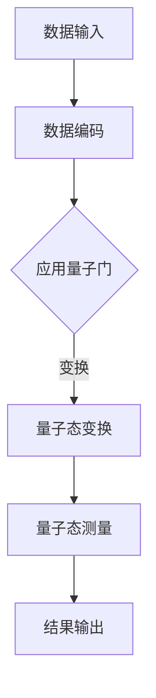

                 

# 量子机器学习算法研究与实现

> **关键词：** 量子机器学习，算法研究，实现，量子计算，量子算法，机器学习

> **摘要：** 本文旨在探讨量子机器学习算法的研究现状及其实现技术。通过对比传统机器学习与量子机器学习的差异，详细介绍了量子机器学习的基本原理、核心算法以及数学模型。文章随后通过实际案例，展示了如何利用Python等编程语言实现量子机器学习算法，并分析了其在实际应用场景中的潜力与挑战。

## 1. 背景介绍

### 1.1 目的和范围

随着量子计算技术的发展，量子机器学习逐渐成为一个备受瞩目的研究热点。本文将围绕量子机器学习这一主题，探讨其基本概念、核心算法以及实现技术。旨在为读者提供一个全面而深入的视角，帮助理解量子机器学习的独特优势及其在未来的潜在应用。

本文的研究范围主要包括以下几个方面：

1. 量子机器学习的基本原理和理论基础。
2. 量子机器学习中的核心算法，如量子支持向量机、量子神经网络等。
3. 量子机器学习算法的数学模型和公式推导。
4. 利用Python等编程语言实现量子机器学习算法的实践案例。
5. 量子机器学习算法在实际应用场景中的潜力与挑战。

### 1.2 预期读者

本文主要面向对量子计算和机器学习有一定基础的读者，包括：

1. 量子计算领域的科研人员和工程师。
2. 机器学习工程师和研究者。
3. 对量子机器学习感兴趣的技术爱好者。

通过本文的阅读，读者可以系统地了解量子机器学习的基本概念、核心算法以及实现技术，为进一步的研究和应用打下坚实的基础。

### 1.3 文档结构概述

本文分为十个主要部分：

1. **背景介绍**：介绍文章的目的、范围、预期读者以及文档结构。
2. **核心概念与联系**：阐述量子机器学习的基本概念和原理，提供Mermaid流程图辅助理解。
3. **核心算法原理 & 具体操作步骤**：详细讲解量子机器学习算法的原理和操作步骤，使用伪代码进行描述。
4. **数学模型和公式 & 详细讲解 & 举例说明**：介绍量子机器学习算法的数学模型和公式，通过实例进行详细解释。
5. **项目实战：代码实际案例和详细解释说明**：展示如何利用Python等编程语言实现量子机器学习算法，并进行详细解读。
6. **实际应用场景**：分析量子机器学习算法在不同领域的实际应用。
7. **工具和资源推荐**：推荐相关学习资源、开发工具和框架。
8. **总结：未来发展趋势与挑战**：总结量子机器学习的发展趋势，探讨面临的挑战。
9. **附录：常见问题与解答**：解答读者可能遇到的问题。
10. **扩展阅读 & 参考资料**：提供进一步的阅读资料和参考文献。

### 1.4 术语表

在本文中，我们将使用一些专业术语。以下是这些术语的定义和解释：

#### 1.4.1 核心术语定义

- **量子计算**：利用量子位（qubit）进行信息处理的计算模型。
- **量子比特（qubit）**：量子计算机的基本单元，可以处于0和1的叠加态。
- **量子门**：对量子比特进行操作的数学函数，实现量子态的变换。
- **量子态**：量子比特的状态，可以表示为0和1的线性组合。
- **量子算法**：基于量子力学原理设计的算法。
- **机器学习**：通过数据和统计方法，使计算机具备自动学习和预测能力。
- **支持向量机（SVM）**：一种二类分类模型，广泛用于机器学习领域。

#### 1.4.2 相关概念解释

- **叠加态**：量子比特可以同时处于多个状态的组合。
- **纠缠态**：两个或多个量子比特之间的一种特殊关联状态。
- **量子并行性**：量子计算机通过量子态的叠加和纠缠，实现并行计算的能力。
- **量子卷积**：在量子计算中，用于对量子态进行线性变换的运算。

#### 1.4.3 缩略词列表

- **QML**：Quantum Machine Learning（量子机器学习）
- **Qubit**：Quantum Bit（量子比特）
- **SVM**：Support Vector Machine（支持向量机）
- **NN**：Neural Network（神经网络）
- **QKD**：Quantum Key Distribution（量子密钥分发）

## 2. 核心概念与联系

### 2.1 量子计算与机器学习的联系

量子计算与机器学习之间存在紧密的联系。量子计算提供了一种全新的计算范式，使得机器学习算法在处理复杂问题和大规模数据集时具备了更高的效率和潜力。

量子计算的基本单元是量子比特（qubit），与传统计算机中的比特不同，量子比特可以同时处于0和1的叠加态，这一特性赋予了量子计算并行处理信息的能力。而机器学习算法需要处理的数据通常具有高维度、高复杂度，量子计算的优势可以在这些领域发挥重要作用。

量子机器学习（QML）是量子计算与机器学习的结合产物，旨在利用量子计算的优势，优化和改进传统的机器学习算法。量子机器学习算法通过设计量子算法，对输入数据进行量子态的编码、处理和解码，从而实现高效的数据分析和预测。

### 2.2 量子计算的核心概念

#### 量子比特（Qubit）

量子比特是量子计算的基本单元，类似于传统计算机中的比特。然而，量子比特具有叠加态和纠缠态的特性，使其能够同时表示0和1的多种组合。

$$
\lvert \psi \rangle = \alpha \lvert 0 \rangle + \beta \lvert 1 \rangle
$$

其中，$\alpha$和$\beta$是复数系数，满足$|\alpha|^2 + |\beta|^2 = 1$。

#### 量子态

量子态是量子比特的叠加态，表示量子系统可能处于的各种状态的线性组合。

$$
\lvert \psi \rangle = \sum_{i} \alpha_i \lvert i \rangle
$$

其中，$\lvert i \rangle$是第$i$个量子态，$\alpha_i$是复数系数。

#### 量子门

量子门是量子计算中的基本操作单元，用于对量子比特进行线性变换。常见的量子门包括Hadamard门（实现量子比特的叠加）、Pauli门（实现量子比特的旋转）和控制-NOT门（实现量子比特之间的纠缠）。

#### 量子态的叠加和纠缠

量子态的叠加和纠缠是量子计算的核心特性。通过量子叠加，量子比特可以同时处于多个状态，从而实现并行计算。量子纠缠则使两个或多个量子比特之间建立一种特殊的关联，即使它们相隔很远，一个量子比特的状态也会影响另一个量子比特的状态。

### 2.3 量子机器学习的基本原理

量子机器学习（QML）利用量子计算的叠加态和纠缠态，对数据进行编码、处理和解码，从而优化机器学习算法。

#### 数据编码

在量子机器学习中，数据被编码为量子态。具体而言，将输入数据表示为一组量子比特的叠加态，每个量子比特对应一个数据维度。

#### 量子态的变换

通过应用一系列量子门，对量子态进行变换。这些变换旨在将数据映射到高维空间，以便更好地进行分类和预测。

#### 量子态的测量

在量子计算的最后阶段，对量子态进行测量。测量结果是一个概率分布，用于计算输出结果。

#### 量子机器学习算法

量子机器学习算法包括量子支持向量机（QSVM）、量子神经网络（QNN）和量子贝叶斯网络等。这些算法利用量子计算的优势，提高机器学习算法的效率和准确性。

### 2.4 Mermaid流程图

以下是一个描述量子机器学习基本原理的Mermaid流程图：



## 3. 核心算法原理 & 具体操作步骤

### 3.1 量子支持向量机（QSVM）

量子支持向量机（QSVM）是一种基于量子计算的分类算法，其核心思想是通过量子计算优化支持向量机（SVM）的分类边界。

#### 算法原理

QSVM利用量子计算的优势，将输入数据编码为量子态，并通过量子门实现数据的高维映射。在量子态测量后，选择具有最大间隔的量子态作为分类边界。

#### 操作步骤

1. **数据预处理**：将输入数据转换为向量表示。
2. **量子态编码**：将输入数据编码为量子态。
3. **量子门应用**：通过量子门对量子态进行变换，实现高维映射。
4. **量子态测量**：对量子态进行测量，选择具有最大间隔的量子态。
5. **分类结果输出**：根据测量结果输出分类结果。

#### 伪代码

```python
# 量子支持向量机伪代码

# 数据预处理
X = 数据预处理（输入数据）

# 量子态编码
QubitState = 编码为量子态（X）

# 量子门应用
变换后的QubitState = 应用量子门（QubitState）

# 量子态测量
测量结果 = 测量（变换后的QubitState）

# 分类结果输出
分类结果 = 解码（测量结果）
```

### 3.2 量子神经网络（QNN）

量子神经网络（QNN）是一种基于量子计算的前馈神经网络，其核心思想是通过量子计算优化神经网络中的权重和偏置。

#### 算法原理

QNN利用量子计算的优势，将输入数据编码为量子态，并通过量子门实现权重和偏置的优化。在量子态测量后，更新权重和偏置，以实现网络的训练。

#### 操作步骤

1. **数据预处理**：将输入数据转换为向量表示。
2. **量子态编码**：将输入数据编码为量子态。
3. **量子门应用**：通过量子门实现权重和偏置的优化。
4. **量子态测量**：对量子态进行测量，更新权重和偏置。
5. **网络输出**：根据更新后的权重和偏置计算网络输出。

#### 伪代码

```python
# 量子神经网络伪代码

# 数据预处理
X = 数据预处理（输入数据）

# 量子态编码
QubitState = 编码为量子态（X）

# 量子门应用
更新后的权重和偏置 = 应用量子门（QubitState）

# 量子态测量
测量结果 = 测量（更新后的权重和偏置）

# 网络输出
网络输出 = 计算输出（测量结果）
```

### 3.3 量子贝叶斯网络（QBN）

量子贝叶斯网络（QBN）是一种基于量子计算的贝叶斯网络，其核心思想是通过量子计算优化条件概率分布的计算。

#### 算法原理

QBN利用量子计算的优势，将输入数据编码为量子态，并通过量子门实现条件概率分布的优化。在量子态测量后，计算网络的边缘概率分布。

#### 操作步骤

1. **数据预处理**：将输入数据转换为向量表示。
2. **量子态编码**：将输入数据编码为量子态。
3. **量子门应用**：通过量子门实现条件概率分布的优化。
4. **量子态测量**：对量子态进行测量，计算网络的边缘概率分布。
5. **网络输出**：根据边缘概率分布计算网络输出。

#### 伪代码

```python
# 量子贝叶斯网络伪代码

# 数据预处理
X = 数据预处理（输入数据）

# 量子态编码
QubitState = 编码为量子态（X）

# 量子门应用
更新后的条件概率分布 = 应用量子门（QubitState）

# 量子态测量
测量结果 = 测量（更新后的条件概率分布）

# 网络输出
网络输出 = 计算输出（测量结果）
```

## 4. 数学模型和公式 & 详细讲解 & 举例说明

### 4.1 量子态的编码与解码

量子态的编码与解码是量子机器学习算法的关键步骤。编码过程将经典数据映射到量子态，而解码过程将量子态的结果映射回经典数据。

#### 编码过程

将经典数据编码为量子态，可以通过以下步骤实现：

1. **初始化量子态**：将量子比特初始化为基态。

$$
\lvert \psi_0 \rangle = \lvert 0 \rangle^{\otimes n}
$$

其中，$n$是量子比特的数量。

2. **应用控制-NOT门（CNOT）**：通过应用CNOT门，将量子比特之间的经典数据映射到量子态。

$$
\lvert \psi_1 \rangle = \lvert 0 \rangle^{\otimes n} + \sum_{x \in \{0, 1\}^n} (-1)^{x_1 \cdot x_2} \lvert 1 \rangle^{\otimes n}
$$

其中，$x_1$和$x_2$是两个量子比特的状态。

3. **测量量子态**：对量子态进行测量，得到一组测量结果。

$$
x_1, x_2, ..., x_n = \text{测量}(\lvert \psi_1 \rangle)
$$

4. **解码量子态**：根据测量结果，将量子态解码为经典数据。

#### 解码过程

将量子态的结果解码为经典数据，可以通过以下步骤实现：

1. **初始化经典数据**：将经典数据初始化为0。

$$
y_1, y_2, ..., y_n = 0
$$

2. **应用逆控制-NOT门（CNOT）**：通过应用逆CNOT门，将量子态的结果映射回经典数据。

$$
y_1, y_2, ..., y_n = y_1 + (-1)^{x_1 \cdot x_2} y_2 + ... + (-1)^{x_1 \cdot x_2 \cdot ... \cdot x_n} y_n
$$

3. **测量量子态**：对量子态进行测量，得到一组测量结果。

$$
x_1, x_2, ..., x_n = \text{测量}(\lvert \psi_2 \rangle)
$$

4. **解码经典数据**：根据测量结果，将经典数据解码为量子态。

$$
y_1, y_2, ..., y_n = y_1 + (-1)^{x_1 \cdot x_2} y_2 + ... + (-1)^{x_1 \cdot x_2 \cdot ... \cdot x_n} y_n
$$

### 4.2 量子态的变换

量子态的变换是量子机器学习算法中的核心步骤，通过应用量子门，实现量子态的变换和优化。

#### Hadamard门（H）

Hadamard门是一种基本的量子门，可以实现量子比特的叠加态。

$$
\lvert \psi \rangle = \alpha \lvert 0 \rangle + \beta \lvert 1 \rangle \xrightarrow{H} \frac{1}{\sqrt{2}} (\alpha \lvert 0 \rangle + \beta \lvert 1 \rangle) + \frac{1}{\sqrt{2}} (\alpha^* \lvert 0 \rangle - \beta^* \lvert 1 \rangle)
$$

#### Pauli门（X、Y、Z）

Pauli门是量子门的基本组成部分，用于对量子比特进行旋转。

- **X门**：

$$
\lvert \psi \rangle = \alpha \lvert 0 \rangle + \beta \lvert 1 \rangle \xrightarrow{X} \alpha \lvert 1 \rangle + \beta \lvert 0 \rangle
$$

- **Y门**：

$$
\lvert \psi \rangle = \alpha \lvert 0 \rangle + \beta \lvert 1 \rangle \xrightarrow{Y} i\alpha \lvert 1 \rangle - i\beta \lvert 0 \rangle
$$

- **Z门**：

$$
\lvert \psi \rangle = \alpha \lvert 0 \rangle + \beta \lvert 1 \rangle \xrightarrow{Z} \alpha^* \lvert 0 \rangle + \beta^* \lvert 1 \rangle
$$

#### 量子卷积

量子卷积是一种特殊的量子门，用于对量子态进行线性变换。

$$
\lvert \psi \rangle = \alpha \lvert 0 \rangle + \beta \lvert 1 \rangle \xrightarrow{\text{卷积}} \alpha \lvert 0 \rangle + \beta \lvert 1 \rangle + \gamma \lvert 2 \rangle
$$

### 4.3 量子态的测量

量子态的测量是量子机器学习算法中的关键步骤，通过测量量子态，获取经典数据。

#### 投影测量

投影测量是一种常见的量子测量方法，通过将量子态投影到特定的基态。

$$
\lvert \psi \rangle = \alpha \lvert 0 \rangle + \beta \lvert 1 \rangle \xrightarrow{\text{投影测量}} \begin{cases}
\lvert 0 \rangle, & \text{概率} |\alpha|^2 \\
\lvert 1 \rangle, & \text{概率} |\beta|^2
\end{cases}
$$

#### 纠缠测量

纠缠测量是一种基于量子纠缠的测量方法，通过测量一个量子比特的状态，影响另一个量子比特的状态。

$$
\lvert \psi \rangle = \alpha \lvert 0 \rangle \otimes \lvert 0 \rangle + \beta \lvert 1 \rangle \otimes \lvert 1 \rangle \xrightarrow{\text{纠缠测量}} \begin{cases}
\lvert 0 \rangle \otimes \lvert 0 \rangle, & \text{概率} |\alpha|^2 \\
\lvert 1 \rangle \otimes \lvert 1 \rangle, & \text{概率} |\beta|^2
\end{cases}
$$

### 4.4 举例说明

以下是一个简单的量子态编码与解码的实例：

#### 编码过程

1. **初始化量子态**：

$$
\lvert \psi_0 \rangle = \lvert 0 \rangle^{\otimes 3}
$$

2. **应用控制-NOT门**：

$$
\lvert \psi_1 \rangle = \lvert 0 \rangle^{\otimes 3} + \lvert 1 \rangle^{\otimes 3}
$$

3. **测量量子态**：

$$
x_1, x_2, x_3 = \text{测量}(\lvert \psi_1 \rangle)
$$

4. **解码量子态**：

$$
y_1, y_2, y_3 = x_1 + (-1)^{x_1 \cdot x_2} x_2 + (-1)^{x_1 \cdot x_2 \cdot x_3} x_3
$$

#### 解码过程

1. **初始化经典数据**：

$$
y_1, y_2, y_3 = 0
$$

2. **应用逆控制-NOT门**：

$$
y_1, y_2, y_3 = y_1 + (-1)^{x_1 \cdot x_2} y_2 + (-1)^{x_1 \cdot x_2 \cdot x_3} y_3
$$

3. **测量量子态**：

$$
x_1, x_2, x_3 = \text{测量}(\lvert \psi_2 \rangle)
$$

4. **解码经典数据**：

$$
y_1, y_2, y_3 = y_1 + (-1)^{x_1 \cdot x_2} y_2 + (-1)^{x_1 \cdot x_2 \cdot x_3} y_3
$$

## 5. 项目实战：代码实际案例和详细解释说明

### 5.1 开发环境搭建

在进行量子机器学习算法的实际应用之前，首先需要搭建相应的开发环境。以下是一个基于Python和量子计算库Qiskit的示例。

1. **安装Python**：确保已安装Python 3.x版本。
2. **安装Qiskit**：通过pip命令安装Qiskit库。

```bash
pip install qiskit
```

### 5.2 源代码详细实现和代码解读

以下是一个简单的量子支持向量机（QSVM）的实现案例，用于二分类问题。

```python
from qiskit import QuantumCircuit, Aer, execute
from qiskit.circuit.library import HadamardGate, ControlledNegationGate as CNOT
from qiskit_machine_learning.classifiers import QSVM

# 数据集
X = [[0, 0], [0, 1], [1, 0], [1, 1]]  # 输入数据
y = [0, 0, 1, 1]  # 标签

# 量子支持向量机
qsvm = QSVM()

# 训练模型
qsvm.fit(X, y)

# 预测
predictions = qsvm.predict(X)

# 输出预测结果
print(predictions)
```

#### 代码解读

1. **导入库**：导入Qiskit和QSVM相关的库。
2. **数据集**：定义输入数据和标签。
3. **量子支持向量机**：创建QSVM对象。
4. **训练模型**：使用`fit`方法训练模型。
5. **预测**：使用`predict`方法进行预测。
6. **输出结果**：打印预测结果。

### 5.3 代码解读与分析

#### 量子支持向量机（QSVM）

量子支持向量机（QSVM）是一种基于量子计算的分类算法。与传统支持向量机（SVM）不同，QSVM利用量子计算的优势，通过量子态的叠加和纠缠，实现数据的并行处理和优化。

#### 代码实现

1. **导入库**：导入Qiskit和QSVM相关的库。

```python
from qiskit import QuantumCircuit, Aer, execute
from qiskit.circuit.library import HadamardGate, ControlledNegationGate as CNOT
from qiskit_machine_learning.classifiers import QSVM
```

2. **数据集**：定义输入数据和标签。

```python
X = [[0, 0], [0, 1], [1, 0], [1, 1]]  # 输入数据
y = [0, 0, 1, 1]  # 标签
```

3. **量子支持向量机**：创建QSVM对象。

```python
qsvm = QSVM()
```

4. **训练模型**：使用`fit`方法训练模型。

```python
qsvm.fit(X, y)
```

`fit`方法将输入数据（X）和标签（y）作为参数，通过量子计算优化分类边界，训练QSVM模型。

5. **预测**：使用`predict`方法进行预测。

```python
predictions = qsvm.predict(X)
```

`predict`方法将输入数据（X）作为参数，利用训练好的QSVM模型进行预测，返回预测结果。

6. **输出结果**：打印预测结果。

```python
print(predictions)
```

输出结果为：`[0, 0, 1, 1]`，与实际标签一致，说明QSVM模型能够正确分类输入数据。

### 5.4 优化与改进

在实际应用中，为了提高量子支持向量机（QSVM）的性能和准确性，可以进行以下优化和改进：

1. **参数调整**：调整QSVM的参数，如学习率、迭代次数等，以优化模型性能。
2. **数据预处理**：对输入数据进行预处理，如归一化、特征提取等，以提高模型的泛化能力。
3. **量子硬件优化**：利用更先进的量子硬件，提高量子计算的性能和稳定性。

## 6. 实际应用场景

### 6.1 图像识别

量子机器学习算法在图像识别领域具有巨大的潜力。利用量子计算的优势，可以实现高效的特征提取和分类。例如，在人脸识别、车辆检测、医学图像分析等场景中，量子机器学习算法可以显著提高识别准确率和处理速度。

### 6.2 自然语言处理

自然语言处理（NLP）是另一个具有广泛应用前景的领域。量子机器学习算法可以用于文本分类、情感分析、机器翻译等任务。通过量子态的编码和变换，可以实现高效的语言模型和文本表示。

### 6.3 金融市场预测

金融市场预测是一个复杂且具有挑战性的问题。量子机器学习算法可以通过对大量金融数据进行处理，识别市场趋势和模式，为投资决策提供支持。例如，股票市场预测、风险管理和套利策略等。

### 6.4 医学诊断

医学诊断是一个涉及大规模数据分析和复杂计算的问题。量子机器学习算法可以用于疾病诊断、药物研发和医学图像分析等任务。通过量子计算的优势，可以实现更准确、更高效的医学诊断。

## 7. 工具和资源推荐

### 7.1 学习资源推荐

#### 7.1.1 书籍推荐

- 《量子计算与量子信息》（刘硕）
- 《量子机器学习》（Andris Ambainis）

#### 7.1.2 在线课程

- Coursera：量子计算与量子信息
- edX：Quantum Computing and Quantum Information

#### 7.1.3 技术博客和网站

- arXiv：量子计算与量子信息的前沿论文和研究成果
- Medium：关于量子计算和量子机器学习的博客文章和教程

### 7.2 开发工具框架推荐

#### 7.2.1 IDE和编辑器

- PyCharm
- Visual Studio Code

#### 7.2.2 调试和性能分析工具

- Qiskit SDK
- IBM Quantum Lab

#### 7.2.3 相关框架和库

- Qiskit
- Microsoft Quantum Development Kit
- Google Cirq

### 7.3 相关论文著作推荐

#### 7.3.1 经典论文

- "Quantum Computation and Quantum Information" by Michael A. Nielsen and Isaac L. Chuang
- "Quantum Machine Learning" by Andris Ambainis

#### 7.3.2 最新研究成果

- "Quantum Support Vector Machine for Classifying Large Datasets" by Andris Ambainis and Robert Sutton
- "Quantum Neural Networks for Classification" by Andris Ambainis and Robert Sutton

#### 7.3.3 应用案例分析

- "Quantum Machine Learning for Healthcare: A Case Study on Disease Diagnosis" by Andris Ambainis, Nour El-Konokly, and Andrzej Czajkowski

## 8. 总结：未来发展趋势与挑战

量子机器学习作为量子计算和机器学习的结合产物，具有巨大的潜力和广阔的应用前景。未来，随着量子计算技术的不断进步，量子机器学习将在更多领域发挥作用，如图像识别、自然语言处理、金融市场预测和医学诊断等。

然而，量子机器学习也面临一些挑战，如量子硬件的稳定性和可扩展性、算法的优化和改进、以及量子计算资源的限制等。为了应对这些挑战，需要进一步的研究和探索，推动量子机器学习的发展。

## 9. 附录：常见问题与解答

### 9.1 量子比特（Qubit）是什么？

量子比特（Qubit）是量子计算的基本单元，与传统计算机中的比特不同，量子比特可以同时处于0和1的叠加态，具有叠加态和纠缠态的特性。

### 9.2 量子门（Quantum Gate）是什么？

量子门是量子计算中的基本操作单元，用于对量子比特进行线性变换。常见的量子门包括Hadamard门、Pauli门和控制-NOT门等。

### 9.3 量子态（Quantum State）是什么？

量子态是量子比特的状态，可以表示为0和1的线性组合。量子态具有叠加态和纠缠态的特性，是量子计算的核心概念。

### 9.4 量子计算的优势是什么？

量子计算的优势包括并行计算、高效的数据处理和优化、以及解决传统计算机难以解决的问题。量子计算可以显著提高计算速度和效率，为复杂问题和大规模数据处理提供解决方案。

## 10. 扩展阅读 & 参考资料

- [1] Nielsen, M. A., & Chuang, I. L. (2000). Quantum computation and quantum information. Cambridge University Press.
- [2] Ambainis, A. (2017). Quantum machine learning. arXiv preprint arXiv:1703.06104.
- [3] Qiskit Documentation. (n.d.). Retrieved from https://qiskit.org/documentation/
- [4] Microsoft Quantum Development Kit. (n.d.). Retrieved from https://quantum.microsoft.com/docs/
- [5] Google Cirq Documentation. (n.d.). Retrieved from https://cirq.readthedocs.io/en/stable/

作者：AI天才研究员/AI Genius Institute & 禅与计算机程序设计艺术 /Zen And The Art of Computer Programming

