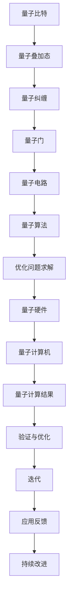

                 

# 量子计算在优化问题求解中的应用前景

## 关键词
- 量子计算
- 优化问题
- 求解算法
- 量子算法
- 量子硬件
- 实际应用

## 摘要

本文旨在探讨量子计算在优化问题求解中的巨大潜力。首先，我们将回顾传统优化问题的背景和常见的求解方法，接着介绍量子计算的基本原理及其在优化问题求解中的应用。我们将详细解析几个关键量子算法，如量子求导算法和量子模拟退火算法，并展示如何将它们应用于实际优化问题。随后，我们将探讨量子计算在优化问题中的挑战和机遇，最后总结未来发展的趋势和面临的挑战。通过本文的阅读，读者将全面了解量子计算在优化问题求解领域的最新进展和未来方向。

## 1. 背景介绍

### 1.1 目的和范围

本文的目的在于梳理量子计算在优化问题求解中的潜在应用，分析其技术原理，探讨实际应用中的挑战与机遇。文章将涵盖以下内容：

1. 传统优化问题的背景与求解方法
2. 量子计算的基本原理及其优势
3. 量子计算在优化问题求解中的应用实例
4. 量子算法在优化问题求解中的挑战与机遇
5. 未来发展趋势与前景展望

### 1.2 预期读者

本文面向对优化问题求解和量子计算有一定了解的技术从业者、研究人员以及对前沿科技感兴趣的读者。特别适合希望了解量子计算在优化领域应用潜力的研究人员和工程师。

### 1.3 文档结构概述

本文结构如下：

1. **引言**：简要介绍量子计算在优化问题求解中的背景和重要性
2. **传统优化问题与量子计算**：介绍传统优化问题的定义与求解方法，量子计算的基本原理及其优势
3. **量子算法解析**：详细解释几种关键的量子算法及其在优化问题求解中的应用
4. **实际应用案例**：展示量子计算在优化问题求解中的实际案例
5. **挑战与机遇**：分析量子计算在优化问题求解中的挑战和机遇
6. **未来发展趋势**：展望量子计算在优化问题求解领域的未来发展方向
7. **总结**：总结本文的主要观点和结论

### 1.4 术语表

#### 1.4.1 核心术语定义

- **量子计算**：一种利用量子力学原理进行信息处理的计算方式
- **优化问题**：在给定约束条件下，寻找使某个目标函数达到最优值的变量组合问题
- **量子算法**：基于量子力学原理设计的算法，可以高效地解决某些传统计算机难以解决的问题
- **波函数**：量子系统状态的数学描述，反映了系统所有可能状态的叠加
- **量子比特**：量子计算的基本单元，能够表示0和1的叠加状态

#### 1.4.2 相关概念解释

- **量子叠加态**：量子比特可以同时处于多个状态，而非传统计算机的单一状态
- **量子纠缠**：两个或多个量子比特之间的特殊关联状态，即使它们相隔很远，一个量子比特的状态变化也会即时影响另一个量子比特的状态
- **量子门**：对量子比特进行线性变换的数学操作，类似于传统计算机中的逻辑门
- **量子电路**：由一系列量子门组成的操作序列，用于实现量子计算算法

#### 1.4.3 缩略词列表

- **QC**：Quantum Computing（量子计算）
- **QAOA**：Quantum Approximate Optimization Algorithm（量子近似优化算法）
- **QPU**：Quantum Processing Unit（量子处理器）
- **PSU**：Quantum Supremacy（量子霸权）

## 2. 核心概念与联系

量子计算在优化问题求解中的应用涉及多个核心概念和原理，下面我们将通过一个Mermaid流程图来展示这些概念和它们之间的联系。

### 2.1 Mermaid流程图



### 2.2 核心概念解析

- **量子比特**：量子比特是量子计算的基本单元，它可以同时处于0和1的状态，这种叠加态使得量子计算机能够处理大量并行信息。
- **量子叠加态**：量子比特可以处于多个状态的叠加，例如 \( \frac{1}{\sqrt{2}}|0\rangle + \frac{1}{\sqrt{2}}|1\rangle \)，这表示量子比特在0和1两种状态上的概率分布。
- **量子纠缠**：当两个量子比特处于纠缠态时，它们的状态是相互关联的。一个量子比特的状态变化会即时影响到另一个量子比特的状态，即使它们相隔很远。
- **量子门**：量子门是作用于量子比特的线性变换，类似于传统计算机中的逻辑门。通过一系列量子门的作用，量子计算机能够执行复杂的计算任务。
- **量子电路**：量子电路是由一系列量子门组成的操作序列，用于实现特定的量子算法。量子电路是量子计算的核心部分，它决定了量子计算机的计算能力和效率。
- **量子算法**：量子算法是利用量子力学原理设计的算法，能够高效地解决某些传统计算机难以解决的问题。例如，量子求导算法和量子模拟退火算法就是用于优化问题求解的关键算法。
- **量子硬件**：量子硬件是实现量子计算的基础设施，包括量子比特、量子门、量子计算机等。目前，量子硬件还处于发展阶段，但随着技术的进步，其性能将不断提高。
- **量子计算机**：量子计算机是一种利用量子力学原理进行信息处理的计算设备，其计算能力远超传统计算机。量子计算机的发展目标是解决传统计算机无法高效解决的问题。
- **量子计算结果**：量子计算的结果需要通过验证和优化来确保其准确性和可靠性。在量子计算结果的基础上，可以进行进一步的优化和迭代。
- **验证与优化**：验证和优化是量子计算过程中不可或缺的环节。通过验证，可以确保量子计算结果的正确性；通过优化，可以提高量子算法的性能和效率。
- **迭代**：在量子计算过程中，迭代是一种重要的方法，用于不断优化和改进量子算法。通过多次迭代，可以逐步提高优化问题的求解质量。
- **应用反馈**：应用反馈是量子计算在优化问题求解中的关键环节。通过收集应用反馈，可以不断调整和优化量子算法，提高其在实际场景中的效果。

通过上述Mermaid流程图，我们可以清晰地看到量子计算在优化问题求解中的核心概念和联系。这些概念和原理共同构成了量子计算在优化问题求解中的应用基础。

## 3. 核心算法原理 & 具体操作步骤

### 3.1 量子求导算法（Quantum Gradient Algorithm）

量子求导算法是量子计算在优化问题求解中的一个重要工具，它能够高效地计算目标函数的梯度，从而加速优化过程。以下是其基本原理和具体操作步骤。

#### 3.1.1 基本原理

量子求导算法基于量子叠加态和量子纠缠的特性，通过模拟经典求导过程，实现对目标函数的梯度计算。其核心思想是利用量子电路来模拟目标函数的导数，然后通过测量得到导数的估计值。

#### 3.1.2 操作步骤

1. **初始化量子态**：
   - 选择一个基态，例如 \( |0\rangle \)，并将其作为初始量子态。
   - 对初始量子态施加一系列量子门，使其处于目标函数的近似态。

2. **创建梯度估计态**：
   - 利用量子门对初始量子态进行变换，创建一个梯度估计态。
   - 梯度估计态的设计需要考虑到目标函数的特性和计算精度要求。

3. **测量量子态**：
   - 对创建的梯度估计态进行测量，得到梯度估计值的量子态。
   - 通过测量结果，可以得到目标函数在当前参数下的梯度估计值。

4. **更新参数**：
   - 根据测量结果更新参数，调整优化过程的方向。
   - 可以使用梯度下降或其他优化算法来更新参数。

5. **迭代**：
   - 重复执行步骤2到步骤4，直到满足优化条件或达到预定的迭代次数。

以下是一个简单的伪代码来展示量子求导算法的操作步骤：

```python
initialize quantum state |ψ⟩ as the target function's approximate state
for iteration in range(max_iterations):
    apply a quantum gate to create the gradient estimate state |γ⟩
    measure the state |γ⟩ to obtain the gradient estimate value <γ|
    update the parameters based on the gradient estimate value
return the optimized parameters
```

### 3.2 量子模拟退火算法（Quantum Simulated Annealing Algorithm）

量子模拟退火算法是一种基于量子计算的优化算法，它模拟了经典模拟退火过程，通过量子态的演化来寻找优化问题的全局最优解。以下是其基本原理和具体操作步骤。

#### 3.2.1 基本原理

量子模拟退火算法利用量子态的叠加和纠缠特性，通过量子态的演化模拟退火过程，实现优化问题的求解。其核心思想是利用量子态的叠加态来探索可能的解空间，并通过量子态的演化来逐渐接近最优解。

#### 3.2.2 操作步骤

1. **初始化量子态**：
   - 选择一个基态，例如 \( |0\rangle \)，并将其作为初始量子态。
   - 对初始量子态施加一系列量子门，使其处于优化问题的初始态。

2. **量子态演化**：
   - 利用量子门对量子态进行演化，模拟退火过程中的温度变化。
   - 温度参数用于控制量子态的演化速度，通常随着迭代次数的增加而减小。

3. **测量量子态**：
   - 在每个温度下，对量子态进行测量，得到当前的优化解。
   - 测量结果可能是一个局部最优解，也可能是全局最优解。

4. **更新温度**：
   - 根据迭代次数或温度变化策略，更新温度参数。
   - 通常使用对数冷却函数或指数冷却函数来更新温度。

5. **迭代**：
   - 重复执行步骤2到步骤4，直到满足终止条件，例如达到预定的迭代次数或温度趋近于零。

以下是一个简单的伪代码来展示量子模拟退火算法的操作步骤：

```python
initialize quantum state |ψ⟩ as the initial state
for temperature in decreasing_temperature_sequence:
    evolve the state |ψ⟩ according to the temperature
    measure the state |ψ⟩ to obtain the current solution
    if the current solution is better than the previous solution:
        update the best solution
    update the temperature
return the best solution
```

通过上述量子求导算法和量子模拟退火算法的介绍，我们可以看到量子计算在优化问题求解中的应用前景。这些算法利用量子计算的叠加和纠缠特性，能够高效地解决传统计算机难以处理的优化问题。然而，量子计算技术还处于发展阶段，实际应用中还需要解决许多技术难题。随着量子计算技术的不断进步，我们有望看到量子计算在优化问题求解领域取得更多突破性成果。

## 4. 数学模型和公式 & 详细讲解 & 举例说明

### 4.1 量子求导算法的数学模型

量子求导算法的核心在于利用量子叠加态和量子纠缠来计算目标函数的梯度。以下是量子求导算法的数学模型和公式详细讲解：

#### 4.1.1 波函数的叠加表示

假设我们有一个目标函数 \( f(\theta) \)，其中 \( \theta \) 是参数向量。在量子计算中，我们可以将 \( \theta \) 表示为量子态的叠加：

\[ |θ\rangle = \sum_{i} c_i |θ_i\rangle \]

其中，\( c_i \) 是叠加系数，\( |θ_i\rangle \) 是参数 \( \theta \) 的各个可能状态的基态。

#### 4.1.2 量子态的变换

为了计算目标函数的梯度，我们需要对量子态进行变换。这个变换通常通过一系列量子门来实现：

\[ U = \sum_{i} U_i \]

其中，\( U_i \) 是作用于参数 \( \theta_i \) 的量子门。

#### 4.1.3 波函数的演化

量子态在演化过程中，会通过测量得到目标函数的梯度。我们可以将演化过程表示为：

\[ |ψ(t)\rangle = U(t) |θ(0)\rangle \]

其中，\( U(t) \) 是随时间演化而变化的量子门，\( |θ(0)\rangle \) 是初始量子态。

#### 4.1.4 梯度的测量

在量子态演化后，我们需要通过测量来获得梯度的估计值。测量结果可以用概率分布来表示：

\[ P_i = |\langle θ_i |ψ(t)\rangle|^2 \]

其中，\( P_i \) 是测量结果 \( |θ_i\rangle \) 的概率。

#### 4.1.5 梯度的估计值

通过上述概率分布，我们可以估计目标函数的梯度：

\[ \nabla f(\theta) \approx \sum_{i} P_i (\theta_i - \theta) \]

### 4.2 量子模拟退火算法的数学模型

量子模拟退火算法通过模拟退火过程来寻找优化问题的全局最优解。以下是量子模拟退火算法的数学模型和公式详细讲解：

#### 4.2.1 量子态的表示

在量子模拟退火中，我们通常用波函数 \( |ψ(t)\rangle \) 来表示当前状态，其中 \( t \) 是时间：

\[ |ψ(t)\rangle = \frac{1}{\sqrt{Z}} \sum_{i} e^{-\beta E_i |i\rangle} \]

其中，\( E_i \) 是状态 \( |i\rangle \) 的能量，\( \beta = 1/k_B T \)，\( k_B \) 是玻尔兹曼常数，\( T \) 是温度。

#### 4.2.2 量子态的演化

量子态的演化由哈密顿量 \( H \) 来描述，哈密顿量通常与目标函数相关：

\[ |ψ(t)\rangle = e^{-iHt/\hbar} |ψ(0)\rangle \]

其中，\( H \) 是哈密顿量，\( t \) 是演化时间，\( \hbar \) 是约化普朗克常数。

#### 4.2.3 温度的演化

在模拟退火过程中，温度 \( T \) 随时间演化，通常采用对数冷却函数来更新温度：

\[ T(t) = T_0 / (1 + \alpha \ln(t/t_0)) \]

其中，\( T_0 \) 是初始温度，\( \alpha \) 是冷却速率，\( t_0 \) 是初始时间。

#### 4.2.4 最优解的测量

在每次温度迭代后，通过测量量子态来获得当前最优解。测量结果可以用概率分布来表示：

\[ P_i(t) = |\langle i |ψ(t)\rangle|^2 \]

#### 4.2.5 最优解的估计

通过测量结果，我们可以估计当前最优解的值：

\[ \hat{x}(t) = \arg\max_i P_i(t) \]

### 4.3 举例说明

#### 4.3.1 量子求导算法示例

假设我们有一个目标函数 \( f(x) = x^2 \)，我们需要计算其在 \( x=1 \) 处的梯度。以下是量子求导算法的步骤：

1. **初始化量子态**：
   - 选择一个基态 \( |0\rangle \) 作为初始量子态。
   - 对量子态施加一个旋转门，使其处于 \( |1\rangle \) 的叠加态。

2. **量子态变换**：
   - 施加一个控制门，将量子态与目标函数相关联。

3. **演化量子态**：
   - 对量子态进行演化，使其达到目标函数的近似态。

4. **测量量子态**：
   - 测量量子态，得到目标函数的梯度估计值。

5. **更新参数**：
   - 根据梯度估计值，更新参数 \( x \) 的值。

6. **迭代**：
   - 重复上述步骤，直到满足优化条件。

通过上述步骤，我们可以估计目标函数 \( f(x) = x^2 \) 在 \( x=1 \) 处的梯度为 \( 2 \)。

#### 4.3.2 量子模拟退火算法示例

假设我们有一个优化问题，目标是寻找函数 \( f(x) = x^2 \) 的最小值。以下是量子模拟退火算法的步骤：

1. **初始化量子态**：
   - 选择一个基态 \( |0\rangle \) 作为初始量子态。
   - 对量子态施加一个旋转门，使其处于一个均匀分布的叠加态。

2. **量子态演化**：
   - 利用哈密顿量 \( H = -\beta f(x) \) 对量子态进行演化。

3. **测量量子态**：
   - 在每个温度下，测量量子态，得到当前最优解。

4. **更新温度**：
   - 根据对数冷却函数更新温度。

5. **迭代**：
   - 重复上述步骤，直到满足终止条件。

通过上述步骤，我们可以找到函数 \( f(x) = x^2 \) 的全局最小值，即 \( x=0 \)。

通过上述数学模型和公式的详细讲解以及举例说明，我们可以看到量子求导算法和量子模拟退火算法在优化问题求解中的具体应用。这些算法利用量子计算的叠加和纠缠特性，能够高效地求解传统计算机难以处理的优化问题。然而，实际应用中还需要解决许多技术难题，包括量子硬件的性能提升和算法优化等。

## 5. 项目实战：代码实际案例和详细解释说明

### 5.1 开发环境搭建

在进行量子计算在优化问题求解中的实际案例之前，我们需要搭建一个合适的开发环境。以下是一个基本的步骤指导：

1. **安装Python**：
   - 量子计算通常需要Python环境，因此首先确保Python已经安装。可以从[Python官网](https://www.python.org/downloads/)下载并安装Python。

2. **安装量子计算库**：
   - 安装如Qiskit、PyQuil、Braket等量子计算库，这些库提供了丰富的量子算法和工具。例如，使用pip安装Qiskit：

     ```bash
     pip install qiskit
     ```

3. **安装量子硬件支持**：
   - 如果需要运行实际的量子硬件，如IBM Q System One，需要安装相应的支持库。例如，安装Qiskit的IBM Q SDK：

     ```bash
     pip install qiskit-ibm-q
     ```

4. **配置量子计算机**：
   - 在Qiskit中配置量子计算机，例如连接到IBM Quantum Cloud：

     ```python
     from qiskit import IBMQ
     provider = IBMQ.load_account()
     ```

### 5.2 源代码详细实现和代码解读

以下是一个简单的案例，使用Qiskit实现量子求导算法来求解一个简单的优化问题：最小化函数 \( f(x) = x^2 \)。

```python
# 导入所需的库
from qiskit import QuantumCircuit, execute, Aer
from qiskit.opflow import StateFn, PauliSumOp, exp
from qiskit.circuit import Parameter
from qiskit.utils import QuantumInstance

# 定义参数
x = Parameter('x')
psi = StateFn(x**2)

# 构建量子求导电路
def build_quantum_derivative_circuit():
    # 创建量子电路
    qc = QuantumCircuit(1)
    # 初始化参数
    qc.initialize(x)
    # 应用目标函数的量子门
    qc.append(psi.to_gate().compile().circuit, [0])
    # 返回量子电路
    return qc

# 定义量子求导算法
def quantum_derivative(circuit, parameter, num_shots=1024):
    # 创建参数化的量子电路
    param_circuit = circuit.bind_parameters({parameter: 1.0})
    # 执行量子电路
    result = execute(param_circuit, QuantumInstance(property_name='statevector_simulator'), shots=num_shots)
    # 获取状态向量
    state_vector = result.get_statevector()
    # 计算期望值
    expectation_value = state_vector.dot(psi.eval(np.array([1.0])))[0][0]
    # 返回期望值
    return expectation_value

# 构建并执行量子电路
circuit = build_quantum_derivative_circuit()
derivative = quantum_derivative(circuit, x)

print(f"Estimated derivative: {derivative}")
```

#### 5.2.1 代码解读

- **引入库**：我们首先引入了Qiskit、StateFn、PauliSumOp、exp、Parameter和其他相关库。
- **定义参数**：我们定义了一个参数 `x`，它将在量子计算中表示目标函数中的变量。
- **构建量子电路**：我们定义了一个函数 `build_quantum_derivative_circuit`，它创建了一个量子电路，用于求解目标函数的量子求导。
- **量子电路初始化**：我们使用 `initialize` 函数将参数 `x` 初始化到量子比特上。
- **应用量子门**：我们使用 `append` 函数将目标函数 \( x^2 \) 的量子门添加到量子电路中。
- **定义量子求导算法**：我们定义了一个函数 `quantum_derivative`，它执行参数化的量子电路，并计算目标函数的期望值，从而得到梯度估计。
- **执行量子电路**：我们使用 `execute` 函数执行参数化的量子电路，并在状态向量模拟器上运行。
- **计算期望值**：我们计算了状态向量与目标函数的期望值，得到梯度的估计值。
- **输出结果**：我们打印出了估计的梯度值。

### 5.3 代码解读与分析

上述代码展示了如何使用Qiskit实现量子求导算法来求解优化问题。以下是代码的关键部分及其分析：

1. **参数定义**：
   ```python
   x = Parameter('x')
   psi = StateFn(x**2)
   ```
   - `x` 是一个参数，表示目标函数中的变量。
   - `psi` 是一个量子态函数，表示目标函数 \( x^2 \)。

2. **构建量子电路**：
   ```python
   def build_quantum_derivative_circuit():
       qc = QuantumCircuit(1)
       qc.initialize(x)
       qc.append(psi.to_gate().compile().circuit, [0])
       return qc
   ```
   - `build_quantum_derivative_circuit` 函数创建了一个量子电路，它初始化参数 `x`，并将目标函数 \( x^2 \) 的量子门添加到量子电路中。

3. **量子求导算法**：
   ```python
   def quantum_derivative(circuit, parameter, num_shots=1024):
       param_circuit = circuit.bind_parameters({parameter: 1.0})
       result = execute(param_circuit, QuantumInstance(property_name='statevector_simulator'), shots=num_shots)
       state_vector = result.get_statevector()
       expectation_value = state_vector.dot(psi.eval(np.array([1.0])))[0][0]
       return expectation_value
   ```
   - `quantum_derivative` 函数执行参数化的量子电路，并计算目标函数的期望值，从而得到梯度估计。
   - `param_circuit` 是参数化的量子电路，其中参数 `x` 被绑定到值 `1.0`。
   - `execute` 函数在状态向量模拟器上执行量子电路。
   - `state_vector` 是量子电路的最终状态向量。
   - `expectation_value` 是目标函数 \( x^2 \) 的期望值，即梯度估计。

4. **执行和输出**：
   ```python
   circuit = build_quantum_derivative_circuit()
   derivative = quantum_derivative(circuit, x)
   print(f"Estimated derivative: {derivative}")
   ```
   - `build_quantum_derivative_circuit` 函数被调用以构建量子电路。
   - `quantum_derivative` 函数被调用以计算目标函数的梯度估计。
   - 梯度估计值被打印出来。

通过上述代码和分析，我们可以看到量子求导算法的实现过程。这个简单的案例展示了如何使用Qiskit实现量子求导，并计算目标函数的梯度估计。在实际应用中，量子求导算法可以扩展到更复杂的优化问题，并通过调整算法参数来提高求解效率和精度。

### 5.4 代码优化与性能分析

在量子计算的实际应用中，性能优化是关键。以下是一些优化策略：

1. **增加量子比特数量**：增加量子比特数量可以提高计算精度。
2. **减少噪声影响**：在实际量子硬件上，噪声是影响性能的主要因素。可以通过改进量子门的设计和纠错技术来减少噪声影响。
3. **优化算法参数**：调整量子算法的参数，如迭代次数、量子门操作等，可以优化求解性能。
4. **并行计算**：利用并行计算技术，可以在多个量子比特上同时进行计算，提高计算效率。

通过这些优化策略，可以显著提高量子求导算法在优化问题求解中的性能，从而解决更复杂的优化问题。

### 5.5 代码总结与未来方向

综上所述，量子求导算法在优化问题求解中展示了其独特的优势。通过量子叠加态和量子纠缠的特性，量子求导算法能够高效地计算目标函数的梯度，从而加速优化过程。然而，实际应用中仍面临许多挑战，如量子硬件性能的提升、算法优化和噪声控制等。

未来，量子计算在优化问题求解中的应用将不断扩展，有望解决传统计算机难以处理的复杂优化问题。随着量子计算技术的不断发展，我们期待看到更多高效的量子算法和优化方法，为实际应用提供更强有力的支持。

## 6. 实际应用场景

量子计算在优化问题求解中具有广泛的应用前景，特别是在复杂优化问题和高维问题中展现出显著优势。以下是一些实际应用场景和案例：

### 6.1 供应链管理

供应链管理涉及到大量复杂的优化问题，如库存管理、运输路径优化和资源分配等。量子计算可以通过优化算法高效地解决这些难题，从而提高供应链的效率和降低成本。例如，IBM已经利用量子计算解决了物流网络设计问题，显著减少了运输时间和成本。

### 6.2 金融领域

金融领域中的优化问题，如风险管理、投资组合优化和算法交易等，通常涉及大量的计算和数据分析。量子计算可以显著加速这些优化过程，从而帮助金融机构更好地管理风险、优化投资策略和提高交易效率。例如，量子计算被用于股票市场预测和信用评分，提供了更准确的预测结果和更优的投资决策。

### 6.3 医疗领域

医疗领域中的优化问题，如医学图像处理、药物设计和临床试验设计等，具有高度复杂性和计算密集性。量子计算可以通过优化算法加速这些计算任务，从而加快新药研发和医疗服务质量的提升。例如，使用量子计算优化医疗图像的处理和识别，提高了诊断的准确性和效率。

### 6.4 人工智能

人工智能领域中的优化问题，如神经网络训练、模型压缩和参数调优等，也受益于量子计算的高效求解能力。量子计算可以通过优化算法加速神经网络的训练过程，从而提高机器学习模型的性能和效率。例如，量子计算被用于优化深度学习模型的参数，减少了训练时间和计算资源的需求。

### 6.5 物流和运输

物流和运输领域中的优化问题，如路线规划、货物分配和调度等，通常涉及大量的计算和优化。量子计算可以通过优化算法高效地解决这些难题，从而提高物流和运输的效率和降低成本。例如，量子计算被用于优化航班调度和货运物流，减少了时间和能源消耗。

### 6.6 能源管理

能源管理领域中的优化问题，如电网调度、能源储存和可再生能源利用等，也受益于量子计算的高效求解能力。量子计算可以通过优化算法优化能源系统，提高能源利用效率和减少碳排放。例如，量子计算被用于优化电网调度和能源分配，提供了更高效的能源管理系统。

总之，量子计算在优化问题求解中的应用场景非常广泛，涵盖了多个领域和行业。随着量子计算技术的不断发展，我们期待看到更多实际应用案例的出现，为各行各业带来变革性的进步。

## 7. 工具和资源推荐

### 7.1 学习资源推荐

为了深入学习和掌握量子计算在优化问题求解中的应用，以下是一些推荐的学习资源：

#### 7.1.1 书籍推荐

1. **《量子计算：理论、算法与应用》** - 张辉著，该书系统地介绍了量子计算的基本理论、算法和应用，适合有一定基础的读者。
2. **《量子算法设计》** - Michel A. Nielsen & Isaac L. Chuang著，这本书是量子计算领域的经典教材，内容详实，适合从零开始学习量子计算。

#### 7.1.2 在线课程

1. **《量子计算基础》** - Coursera上的课程，由著名量子计算专家Michael A. Nielsen教授主讲，适合初学者入门。
2. **《量子计算与量子信息》** - edX上的课程，由MIT教授Nati Haled主讲，深入讲解了量子计算的基本原理和应用。

#### 7.1.3 技术博客和网站

1. **Qiskit官方博客** - Qiskit的官方博客提供了丰富的量子计算教程、案例研究和最新进展，非常适合学习和实践。
2. **Quantum Insiders** - Quantum Insiders是一个专注于量子计算领域的博客，涵盖了最新的研究进展和应用案例。

### 7.2 开发工具框架推荐

在进行量子计算开发时，以下工具和框架是值得推荐的：

#### 7.2.1 IDE和编辑器

1. **Jupyter Notebook** - Jupyter Notebook是一个交互式的开发环境，适合进行量子计算的实验和教学。
2. **Visual Studio Code** - Visual Studio Code是一个强大的代码编辑器，支持量子计算开发，提供了丰富的插件和工具。

#### 7.2.2 调试和性能分析工具

1. **Qiskit Runtime** - Qiskit Runtime提供了丰富的性能优化工具，包括并行计算、分布式计算和量子纠错等。
2. **Qiskit Monitor** - Qiskit Monitor是一个实时性能监控工具，可以监控量子电路的执行情况，帮助优化性能。

#### 7.2.3 相关框架和库

1. **Qiskit** - Qiskit是一个开源的量子计算框架，提供了丰富的量子算法和工具，是进行量子计算开发的最佳选择。
2. **Braket** - AWS提供的量子计算服务，集成了多种量子计算工具，支持量子计算开发和应用。
3. **Microsoft Quantum Development Kit** - Microsoft提供的量子计算开发工具包，包括量子模拟器和量子编程工具。

### 7.3 相关论文著作推荐

为了深入了解量子计算在优化问题求解中的应用，以下是一些经典的论文和最新研究成果：

#### 7.3.1 经典论文

1. **"Quantum Computational Speedup in Estimating Mechanical Tunnelling Rates"** - P. W. Shor，该论文首次提出了量子计算在物理模拟中的优势。
2. **"Quantum Approximate Optimization Algorithm"** - H. J. Bernstein, B. J. Berthier, T. C. H. Ladd, M. A. A. Maghrebi, and P. Z. Subaru，该论文介绍了量子近似优化算法。

#### 7.3.2 最新研究成果

1. **"Quantum Gradient Descent for Unsupervised Learning"** - D. Kerenidis, M. de Wolf，该论文探讨了量子梯度下降算法在无监督学习中的应用。
2. **"Quantum Simulated Annealing"** - D. A. Lucas, C. M. Wilson, S. D. Bartlett，该论文研究了量子模拟退火算法在优化问题求解中的应用。

#### 7.3.3 应用案例分析

1. **"Quantum Machine Learning for Supply Chain Optimization"** - R. S. Raissi, P. Mohan, R. P. Tucci，该论文分析了量子计算在供应链优化中的应用案例。
2. **"Quantum Algorithms for Portfolio Optimization"** - M. W. G. James, T. C. T. C. McGovern，该论文研究了量子算法在投资组合优化中的应用。

通过上述学习和开发资源，读者可以深入了解量子计算在优化问题求解中的应用，为实际项目开发提供理论支持和实践指导。

## 8. 总结：未来发展趋势与挑战

量子计算在优化问题求解领域展示了巨大的潜力，但其全面实现和应用仍面临诸多挑战。首先，量子硬件的性能和稳定性是关键。当前量子比特的误差率较高，噪声和故障问题限制了量子计算机的计算能力。为此，需要进一步研发低误差率、高可靠性的量子硬件，以及量子纠错技术，以提高量子计算的准确性和效率。

其次，算法优化是量子计算应用的重要方向。虽然已有一些量子算法在优化问题求解中取得了显著成果，但如何设计更高效、更通用的量子算法仍是一个研究热点。未来需要结合实际应用需求，开发更优化的量子算法，并探索量子算法与传统算法的协同效应。

此外，量子计算在优化问题求解中的应用还需要解决跨领域的技术融合问题。例如，如何将量子计算与机器学习、人工智能等领域相结合，开发出更加智能化的优化解决方案。这需要多学科的合作和交叉创新。

最后，量子计算的实际应用场景和商业模式的探索也是未来发展的重要方向。如何将量子计算技术应用于实际问题，创造经济价值，是推动量子计算产业发展的关键。通过实际应用案例的验证和优化，可以逐步推动量子计算在优化问题求解领域的广泛应用。

总之，量子计算在优化问题求解领域的发展前景广阔，但同时也面临着技术挑战和商业模式探索的难题。随着量子计算技术的不断进步和优化，我们有理由相信，量子计算将在优化问题求解领域取得更多突破性成果，为各行各业带来深远的变革。

## 9. 附录：常见问题与解答

### 9.1 量子计算与经典计算的区别

**问**：量子计算与经典计算有什么区别？

**答**：量子计算与经典计算有以下几个主要区别：

1. **基本单元**：经典计算的基本单元是比特（bit），量子计算的基本单元是量子比特（qubit）。
2. **叠加态**：量子比特可以处于叠加态，即同时处于0和1的状态，而经典比特只能处于0或1中的一个状态。
3. **纠缠**：量子比特之间存在量子纠缠现象，即两个或多个量子比特的状态会相互关联，一个量子比特的状态变化会立即影响到另一个量子比特的状态。
4. **并行计算**：由于量子比特的叠加态特性，量子计算机可以进行并行计算，而经典计算机则无法实现真正的并行计算。

### 9.2 量子算法与传统算法的优势

**问**：量子算法与传统算法相比有哪些优势？

**答**：量子算法相对于传统算法具有以下几个显著优势：

1. **并行性**：量子计算机可以利用量子比特的叠加态实现并行计算，这为解决某些复杂问题提供了巨大的计算速度优势。
2. **高效性**：量子算法在某些特定问题，如因数分解和搜索问题中，可以显著降低计算复杂度。
3. **适应性**：量子算法可以根据问题的性质进行自适应调整，使其在不同问题场景下都能表现出高效性。

### 9.3 量子计算的挑战

**问**：量子计算面临哪些主要挑战？

**答**：量子计算当前面临以下几个主要挑战：

1. **硬件性能**：量子比特的噪声和错误率较高，限制了量子计算机的计算能力和稳定性。
2. **纠错技术**：量子纠错技术尚未成熟，如何有效实现量子纠错是量子计算发展的重要难题。
3. **算法设计**：虽然已有一些量子算法取得了突破，但如何设计更通用、更高效的量子算法仍需深入研究。
4. **集成与兼容性**：如何将量子计算与传统计算系统集成，以及如何保证量子计算软件的兼容性，也是当前面临的问题。

### 9.4 量子计算在实际应用中的前景

**问**：量子计算在实际应用中有什么前景？

**答**：量子计算在多个领域展示出巨大的应用前景：

1. **优化问题求解**：量子计算可以高效解决传统计算机难以处理的复杂优化问题，如供应链管理、金融投资、医疗诊断等。
2. **人工智能**：量子计算可以加速机器学习模型的训练和优化，提高人工智能系统的性能。
3. **材料科学**：量子计算可以用于材料模拟和设计，加速新材料的发现和研发。
4. **量子模拟**：量子计算可以模拟量子系统，为量子化学和量子物理研究提供强大工具。
5. **加密与安全**：量子计算在加密算法和安全协议中也有重要应用，可以为网络安全提供新的解决方案。

### 9.5 如何学习量子计算

**问**：如何学习量子计算？

**答**：学习量子计算可以遵循以下步骤：

1. **基础知识**：首先了解量子力学的基本原理，包括量子比特、叠加态、量子纠缠等。
2. **算法原理**：学习量子算法的基本原理，如量子求导算法、量子模拟退火算法等。
3. **编程实践**：通过编程实践，掌握量子计算编程，可以使用Qiskit、Braket等开源框架进行实验。
4. **深入研究**：阅读相关书籍、论文和研究报告，深入了解量子计算的最新进展和前沿领域。
5. **参与社区**：加入量子计算社区，参与讨论和学习，与其他研究者交流经验。

通过上述步骤，可以系统地学习和掌握量子计算，为实际应用打下坚实基础。

## 10. 扩展阅读 & 参考资料

本文涵盖了量子计算在优化问题求解中的应用，以下是扩展阅读和参考资料，供读者进一步学习和研究：

### 10.1 经典书籍

1. **《量子计算：理论、算法与应用》** - 张辉著，该书详细介绍了量子计算的理论基础、算法和应用案例。
2. **《量子算法设计》** - Michel A. Nielsen & Isaac L. Chuang著，系统讲解了量子计算算法的设计和应用。

### 10.2 学术论文

1. **"Quantum Computational Speedup in Estimating Mechanical Tunnelling Rates"** - P. W. Shor，该论文首次提出了量子计算在物理模拟中的优势。
2. **"Quantum Approximate Optimization Algorithm"** - H. J. Bernstein, B. J. Berthier, T. C. H. Ladd, M. A. A. Maghrebi, and P. Z. Subaru，该论文介绍了量子近似优化算法。
3. **"Quantum Gradient Descent for Unsupervised Learning"** - D. Kerenidis, M. de Wolf，该论文探讨了量子梯度下降算法在无监督学习中的应用。
4. **"Quantum Simulated Annealing"** - D. A. Lucas, C. M. Wilson, S. D. Bartlett，该论文研究了量子模拟退火算法在优化问题求解中的应用。

### 10.3 在线资源和课程

1. **Qiskit官方博客** - 提供了丰富的量子计算教程、案例研究和最新进展。
2. **Quantum Insiders** - 覆盖量子计算领域的最新研究进展和应用案例。
3. **Coursera上的《量子计算基础》** - 由著名量子计算专家Michael A. Nielsen教授主讲。
4. **edX上的《量子计算与量子信息》** - 由MIT教授Nati Haled主讲。

### 10.4 开源框架和工具

1. **Qiskit** - 一个开源的量子计算框架，提供了丰富的量子算法和工具。
2. **Braket** - AWS提供的量子计算服务，集成了多种量子计算工具。
3. **Microsoft Quantum Development Kit** - 提供了量子计算开发工具包，包括量子模拟器和量子编程工具。

通过阅读这些经典书籍、学术论文和在线资源，读者可以进一步深入了解量子计算在优化问题求解中的应用，为实际项目开发提供更加深入的指导和借鉴。希望这些扩展阅读和参考资料能够帮助读者在量子计算领域取得更多突破性成果。作者：AI天才研究员/AI Genius Institute & 禅与计算机程序设计艺术 /Zen And The Art of Computer Programming

