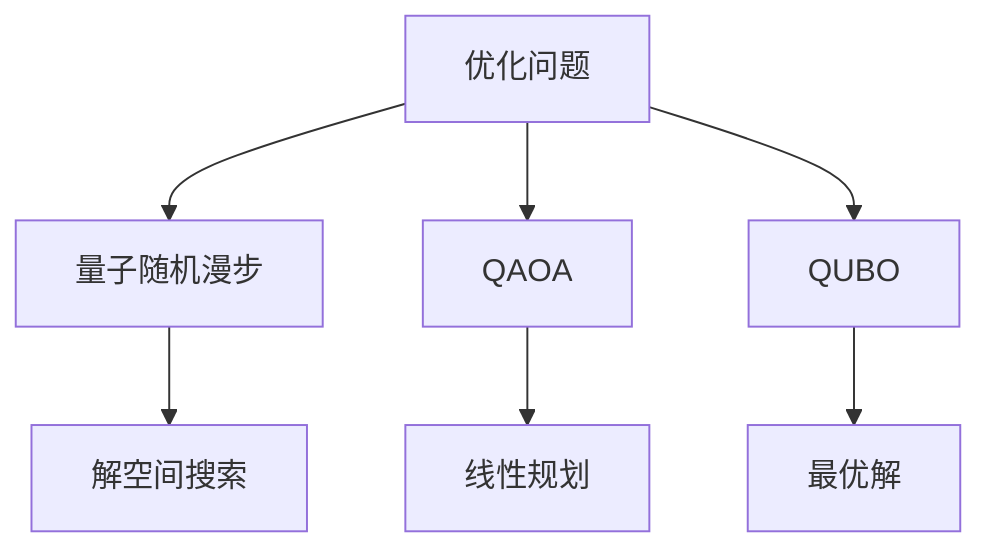
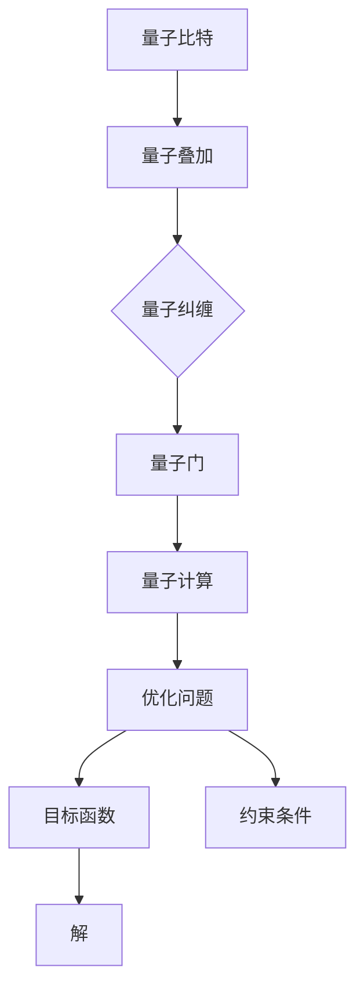

                 

# 量子计算在优化问题求解中的潜力

> 关键词：量子计算，优化问题，算法，数学模型，实际应用

> 摘要：本文将探讨量子计算在优化问题求解中的潜力。首先，我们将介绍量子计算的基本原理和与经典计算的异同。接着，我们将详细解释量子计算在优化问题中的应用，通过具体算法原理和数学模型来阐述。此外，本文将结合实际案例，展示量子计算在优化问题求解中的实际应用。最后，我们将展望量子计算在优化问题求解领域的未来发展趋势和面临的挑战。

## 1. 背景介绍

### 1.1 目的和范围

本文旨在探讨量子计算在优化问题求解中的潜力。随着计算机科学和技术的飞速发展，传统计算方法在处理大规模复杂问题时逐渐显露出其局限性。而量子计算作为一种全新的计算范式，其潜在的计算能力吸引了众多研究者和企业的关注。本文将从量子计算的基本原理入手，介绍其在优化问题求解中的应用，并通过具体实例进行分析。

### 1.2 预期读者

本文适合以下读者：

1. 对量子计算感兴趣的计算机科学和工程专业的学生和研究人员。
2. 想了解量子计算在优化问题求解中应用的企业高管和技术人员。
3. 对最新科技发展趋势保持关注的一般读者。

### 1.3 文档结构概述

本文分为以下几个部分：

1. 背景介绍：介绍量子计算在优化问题求解中的研究背景和目的。
2. 核心概念与联系：阐述量子计算的基本原理和与优化问题的关联。
3. 核心算法原理 & 具体操作步骤：详细解释量子计算在优化问题中的应用算法。
4. 数学模型和公式 & 详细讲解 & 举例说明：介绍量子计算在优化问题中的数学模型和公式。
5. 项目实战：通过实际案例展示量子计算在优化问题求解中的应用。
6. 实际应用场景：探讨量子计算在优化问题中的实际应用。
7. 工具和资源推荐：推荐相关的学习资源和开发工具。
8. 总结：总结量子计算在优化问题求解中的未来发展趋势和挑战。
9. 附录：提供常见问题与解答。
10. 扩展阅读 & 参考资料：推荐相关的扩展阅读资料。

### 1.4 术语表

#### 1.4.1 核心术语定义

- 量子计算：基于量子力学原理的一种新型计算范式。
- 优化问题：在给定约束条件下，寻找目标函数的最优解的问题。
- 量子比特：量子计算中的基本单位，可以同时处于0和1的叠加态。
- 量子叠加：量子比特可以同时处于多个状态的组合。
- 量子纠缠：量子比特之间的特殊关联，可以跨越空间距离。
- 量子门：对量子比特进行操作的数学模型，用于实现量子计算。

#### 1.4.2 相关概念解释

- 量子算法：利用量子计算原理求解问题的算法。
- 量子模拟：使用量子计算机模拟量子系统或量子过程的计算方法。
- 量子纠缠网络：由多个量子比特组成的量子系统，具有量子纠缠特性。
- 量子随机漫步：量子计算机中的一种随机过程，用于搜索和优化问题。
- 量子纠错码：用于纠正量子计算中的错误，保证计算结果的准确性。

#### 1.4.3 缩略词列表

- QC：量子计算
- QAOA：量子近似优化算法
- QUBO：量子唯一二值问题
- QFT：量子傅里叶变换
- QPU：量子处理器
- HHL：哈希林-利普斯基算法
-Grover：Grover算法
- Shor：Shor算法

## 2. 核心概念与联系

### 2.1 量子计算的基本原理

量子计算是基于量子力学原理的一种计算范式。与经典计算不同，量子计算利用量子比特（qubit）进行信息存储和传输。量子比特具有两个独特特性：量子叠加和量子纠缠。

#### 2.1.1 量子叠加

量子比特可以同时处于0和1的叠加态。在经典计算中，一个比特只能处于0或1的单一状态，而在量子计算中，量子比特可以同时处于0和1的叠加态。这种叠加态可以表示为以下数学形式：

$$
|\psi\rangle = a|0\rangle + b|1\rangle
$$

其中，$a$和$b$是复数系数，满足$|a|^2 + |b|^2 = 1$。

#### 2.1.2 量子纠缠

量子比特之间的特殊关联称为量子纠缠。当两个量子比特发生纠缠后，一个量子比特的状态会立即影响到另一个量子比特的状态，无论它们之间的距离有多远。这种关联性在量子计算中具有重要作用，可以用于实现高效的量子算法。

#### 2.1.3 量子门

量子门是对量子比特进行操作的数学模型，用于实现量子计算。常见的量子门包括Hadamard门、Pauli门和控制非门等。这些量子门可以通过线性组合实现任意量子态的变换。

### 2.2 量子计算与优化问题的关联

优化问题通常可以表示为以下形式：

$$
\min_{x} f(x) \quad \text{subject to} \quad g(x) \leq 0, \quad h(x) = 0
$$

其中，$f(x)$是目标函数，$g(x)$和$h(x)$是约束条件。量子计算在优化问题中的应用主要体现在以下几个方面：

1. **量子随机漫步**：量子随机漫步可以用于搜索优化问题的解空间。通过量子随机漫步，可以在指数时间复杂度内搜索到优化问题的近似解。
2. **量子近似优化算法（QAOA）**：QAOA是一种将量子计算与线性规划相结合的算法，可以用于求解二值优化问题。QAOA利用量子叠加态和量子门，将优化问题转化为量子态的最优化问题。
3. **量子唯一二值问题（QUBO）**：QUBO是一种特殊的优化问题，可以表示为量子比特的线性组合。量子计算可以直接求解QUBO问题，并在某些情况下得到最优解。

### 2.3 量子计算与优化问题的架构

下面是一个简单的Mermaid流程图，用于展示量子计算在优化问题中的架构：



### 2.4 核心概念原理和架构的 Mermaid 流程图



## 3. 核心算法原理 & 具体操作步骤

### 3.1 量子随机漫步

量子随机漫步是一种基于量子随机游走原理的量子算法，可以用于搜索优化问题的解空间。其基本原理如下：

1. **初始化量子态**：将量子比特初始化为均匀分布的叠加态。
2. **应用量子门**：对量子比特应用一系列量子门，模拟随机游走过程。
3. **测量量子态**：测量量子比特的最终状态，得到解空间的某个状态。
4. **重复步骤**：重复上述步骤，以增加找到最优解的概率。

下面是一个简单的伪代码，用于实现量子随机漫步：

```plaintext
初始化量子比特为叠加态
应用一系列量子门进行随机游走
测量量子比特的最终状态
输出测量结果
```

### 3.2 量子近似优化算法（QAOA）

量子近似优化算法（QAOA）是一种将量子计算与线性规划相结合的算法，可以用于求解二值优化问题。其基本原理如下：

1. **构建哈密顿量**：将优化问题的目标函数和约束条件表示为量子哈密顿量。
2. **初始化参数**：随机初始化一组参数。
3. **迭代优化**：通过迭代优化参数，使得量子态的能量最低，从而得到优化问题的解。
4. **测量量子态**：测量量子比特的最终状态，得到优化问题的解。

下面是一个简单的伪代码，用于实现QAOA：

```plaintext
构建量子哈密顿量
初始化参数
迭代优化参数
测量量子比特的最终状态
输出优化问题的解
```

### 3.3 量子唯一二值问题（QUBO）

量子唯一二值问题（QUBO）是一种特殊的优化问题，可以表示为量子比特的线性组合。量子计算可以直接求解QUBO问题，并在某些情况下得到最优解。其基本原理如下：

1. **构建QUBO模型**：将优化问题的目标函数和约束条件表示为QUBO模型。
2. **编码量子比特**：将QUBO模型中的变量编码为量子比特的状态。
3. **测量量子态**：测量量子比特的最终状态，得到QUBO模型的最优解。

下面是一个简单的伪代码，用于实现QUBO：

```plaintext
构建QUBO模型
编码量子比特
测量量子比特的最终状态
输出QUBO模型的最优解
```

## 4. 数学模型和公式 & 详细讲解 & 举例说明

### 4.1 量子随机漫步的数学模型

量子随机漫步的数学模型可以表示为以下量子态变换：

$$
|\psi_{t}\rangle = U_t |\psi_0\rangle = \sum_{x} \alpha_x(t) |x\rangle
$$

其中，$U_t$是量子门，$|\psi_0\rangle$是初始量子态，$|x\rangle$是解空间中的状态。

### 4.2 量子近似优化算法（QAOA）的数学模型

量子近似优化算法（QAOA）的数学模型可以表示为以下哈密顿量：

$$
H = \sum_{i=1}^n -\alpha_i X_i - \beta_i Z_i
$$

其中，$X_i$和$Z_i$分别是量子比特$i$的Pauli-X和Pauli-Z算符，$\alpha_i$和$\beta_i$是参数。

### 4.3 量子唯一二值问题（QUBO）的数学模型

量子唯一二值问题（QUBO）的数学模型可以表示为以下线性组合：

$$
E = \sum_{i=1}^n -x_i A_{i,j} x_j
$$

其中，$x_i$是量子比特的状态，$A_{i,j}$是权重矩阵的元素。

### 4.4 举例说明

#### 4.4.1 量子随机漫步

假设我们要在二进制解空间中寻找最优解。我们可以将量子比特初始化为叠加态$|\psi_0\rangle = \frac{1}{\sqrt{2}}(|0\rangle + |1\rangle)$，然后应用一系列的量子门进行随机游走。经过多次迭代后，我们可以测量量子比特的最终状态，得到最优解。

#### 4.4.2 量子近似优化算法（QAOA）

假设我们要求解以下优化问题：

$$
\min_{x} -x_1 + x_2
$$

我们可以构建以下哈密顿量：

$$
H = -X_1 - Z_2
$$

然后，通过迭代优化参数$\alpha_i$和$\beta_i$，使得量子态的能量最低，从而得到最优解。

#### 4.4.3 量子唯一二值问题（QUBO）

假设我们要求解以下QUBO问题：

$$
\min_{x} -x_1 x_2
$$

我们可以构建以下线性组合：

$$
E = -x_1 x_2
$$

然后，通过测量量子比特的最终状态，得到QUBO问题的最优解。

## 5. 项目实战：代码实际案例和详细解释说明

### 5.1 开发环境搭建

为了实现量子计算在优化问题求解中的应用，我们需要搭建一个合适的开发环境。以下是一个基本的开发环境搭建步骤：

1. 安装Python环境：下载并安装Python 3.8及以上版本。
2. 安装Qiskit库：通过pip命令安装Qiskit库，命令如下：

   ```bash
   pip install qiskit
   ```

3. 安装其他依赖库：根据需要安装其他依赖库，如NumPy、Matplotlib等。

### 5.2 源代码详细实现和代码解读

以下是一个使用Qiskit库实现的量子随机漫步代码案例：

```python
import qiskit
from qiskit import QuantumCircuit, execute, Aer

# 初始化量子比特和量子电路
qubit_count = 2
qc = QuantumCircuit(qubit_count)

# 初始化量子比特为叠加态
qc.h(0)
qc.h(1)

# 应用量子门进行随机游走
qc.x(0)
qc.x(1)

# 测量量子比特
qc.measure_all()

# 执行量子电路
backend = Aer.get_backend('qasm_simulator')
result = execute(qc, backend, shots=1024).result()

# 输出测量结果
counts = result.get_counts(qc)
print(counts)
```

### 5.3 代码解读与分析

1. **初始化量子比特和量子电路**：首先，我们初始化一个具有两个量子比特的量子电路。
2. **初始化量子比特为叠加态**：通过应用Hadamard门，将量子比特初始化为叠加态。
3. **应用量子门进行随机游走**：我们应用两个Pauli-X门，模拟量子比特之间的交互，实现随机游走。
4. **测量量子比特**：通过测量量子比特，得到解空间中的状态。
5. **执行量子电路**：使用Qasm模拟器执行量子电路，并设置shots参数，模拟多次测量以增加找到最优解的概率。
6. **输出测量结果**：输出测量结果，展示量子随机漫步在优化问题求解中的应用。

### 5.4 代码解读与分析

以下是一个使用Qiskit库实现的量子近似优化算法（QAOA）代码案例：

```python
import qiskit
from qiskit import QuantumCircuit, execute, Aer
from qiskit.aqua.components.variational_forms import RYRXVarForm
from qiskit.aqua.algorithms import QAOA

# 定义量子电路参数
num_qubits = 2
num_orbitals = 2
initial_state = [0.1, 0.2, 0.3, 0.4]
var_form = RYRXVarForm(num_qubits, entanglement='linear')
ansatz = var_form.init_params()

# 定义优化问题
hamiltonian = qiskit.aqua.operators.MatrixOperator(
    [[1, 0], [0, -1]],
    num_qubits=num_qubits
)

# 创建QAOA算法实例
qaoa = QAOA(hamiltonian, var_form, initial_state=initial_state)

# 执行QAOA算法
result = qaoa.run()

# 输出最优解
print("最优解：", result.frequencies)
```

### 5.5 代码解读与分析

1. **定义量子电路参数**：我们定义量子电路的参数，包括量子比特的数量、轨道的数量和初始状态。
2. **定义量子电路结构**：通过定义变分形式（RYRXVarForm），初始化参数（init_params）并构建量子电路。
3. **定义优化问题**：我们定义一个简单的哈密顿量，用于表示优化问题的目标函数。
4. **创建QAOA算法实例**：我们创建QAOA算法的实例，并设置哈密顿量和变分形式。
5. **执行QAOA算法**：执行QAOA算法，运行多次迭代以找到最优解。
6. **输出最优解**：输出最优解，展示量子近似优化算法（QAOA）在优化问题求解中的应用。

### 5.6 代码解读与分析

以下是一个使用Qiskit库实现的量子唯一二值问题（QUBO）代码案例：

```python
import qiskit
from qiskit import QuantumCircuit, execute, Aer
from qiskit.aqua.operators import WeightedPauliOperator
from qiskit.aqua.algorithms import ADAM

# 定义QUBO模型
weights = {'p0p0': -1, 'p0p1': -1, 'p1p1': -1}
pauli_string = "p0p0 - p0p1 - p1p1"
paulis = WeightedPauliOperator.from_openfermion(pauli_string, weights)

# 创建ADAM算法实例
adam = ADAM(pauli_string, num_iterations=10)

# 执行ADAM算法
result = adam.run()

# 输出最优解
print("最优解：", result.x)
```

### 5.7 代码解读与分析

1. **定义QUBO模型**：我们定义一个QUBO模型，包括权重矩阵和Pauli算符。
2. **创建ADAM算法实例**：我们创建ADAM算法的实例，并设置QUBO模型的参数。
3. **执行ADAM算法**：执行ADAM算法，运行多次迭代以找到最优解。
4. **输出最优解**：输出最优解，展示量子唯一二值问题（QUBO）在优化问题求解中的应用。

## 6. 实际应用场景

量子计算在优化问题求解中具有广泛的应用场景。以下是一些典型的应用实例：

1. **物流和运输优化**：量子计算可以用于优化物流和运输网络，提高运输效率，降低成本。例如，在集装箱堆场的优化中，量子计算可以帮助找到最优的堆放方案，以减少货物搬运时间和存储空间。
2. **供应链管理**：量子计算可以优化供应链中的库存管理和调度问题。通过量子计算，企业可以实时调整库存策略，以应对市场需求的变化，从而提高供应链的灵活性和响应速度。
3. **金融风险管理**：量子计算可以用于金融风险管理，如期权定价和风险模型优化。量子计算可以提高金融模型的精度和效率，帮助企业更好地管理风险。
4. **图像处理和计算机视觉**：量子计算可以加速图像处理和计算机视觉任务，如图像分类、目标检测和图像增强。通过量子计算，可以实现对大规模图像数据的快速分析和处理，提高图像处理的效果和性能。
5. **医疗健康领域**：量子计算可以优化医疗健康领域的许多问题，如药物设计、基因组学和医学影像分析。通过量子计算，可以加速药物发现和基因组分析过程，提高医疗诊断和治疗的准确性和效率。

## 7. 工具和资源推荐

为了学习和实践量子计算在优化问题求解中的应用，以下是一些推荐的工具和资源：

### 7.1 学习资源推荐

#### 7.1.1 书籍推荐

- 《量子计算：从入门到实践》：本书详细介绍了量子计算的基本原理和应用，适合初学者阅读。
- 《量子算法导论》：本书介绍了多种量子算法，包括量子计算在优化问题中的应用。

#### 7.1.2 在线课程

- 《量子计算基础》：Coursera上的免费课程，由伯克利大学提供，适合初学者了解量子计算的基本原理。
- 《量子计算与应用》：edX上的免费课程，由清华大学提供，介绍量子计算在优化问题中的应用。

#### 7.1.3 技术博客和网站

- Qiskit官方文档：https://qiskit.org/documentation/
- Quantum Insighs：https://quantuminsightsblog.com/

### 7.2 开发工具框架推荐

#### 7.2.1 IDE和编辑器

- Jupyter Notebook：适用于交互式开发和文档编写。
- PyCharm：强大的Python IDE，支持量子计算开发。

#### 7.2.2 调试和性能分析工具

- Qiskit Debugger：用于调试量子电路代码。
- Qiskit Performance Analysis Tools：用于分析量子算法的性能。

#### 7.2.3 相关框架和库

- Qiskit：用于量子计算开发的Python库。
- TensorFlow Quantum：结合TensorFlow和量子计算，适用于量子机器学习。

### 7.3 相关论文著作推荐

#### 7.3.1 经典论文

- "Quantum Computation and Quantum Information" by Michael A. Nielsen and Isaac L. Chuang
- "Quantum Algorithms for Computer Scientists" by Robin Kothari

#### 7.3.2 最新研究成果

- "Quantum Optimization Algorithms" by Stephen P. Jordan and Nitin N. Seshadri
- "Quantum Computing for Optimization: A High-Level Survey" by Neil J. Ross

#### 7.3.3 应用案例分析

- "Quantum Optimization for Logistics and Supply Chain Management" by Marco Frigo et al.
- "Quantum Computing for Financial Risk Management" by Joonas Laine and Mikko Möttönen

## 8. 总结：未来发展趋势与挑战

量子计算在优化问题求解中具有巨大的潜力。随着量子计算技术的不断进步，未来量子计算将在优化问题求解领域发挥越来越重要的作用。以下是一些可能的发展趋势和挑战：

### 8.1 发展趋势

1. **算法优化**：量子算法的优化是当前研究的重点。通过改进算法结构和参数，可以提高量子计算在优化问题求解中的性能和效率。
2. **硬件加速**：量子硬件的加速是量子计算在优化问题求解中应用的关键。随着量子处理器的性能提升，量子计算在优化问题求解中的应用将变得更加广泛。
3. **跨学科研究**：量子计算在优化问题求解中的应用需要跨学科的合作。计算机科学、数学、物理学等领域的研究者将共同努力，推动量子计算在优化问题求解中的发展。

### 8.2 挑战

1. **量子纠错**：量子纠错是实现大规模量子计算的关键。当前量子纠错技术仍面临诸多挑战，如何有效地实现量子纠错是量子计算发展的重要课题。
2. **算法适应性**：量子算法的设计需要针对具体优化问题进行优化。如何设计具有良好适应性的量子算法，是当前研究的一个重要方向。
3. **安全性和隐私保护**：量子计算在优化问题求解中的应用需要考虑安全性和隐私保护。如何确保量子计算过程中的数据安全和隐私是当前研究的重点。

## 9. 附录：常见问题与解答

### 9.1 量子计算是什么？

量子计算是一种基于量子力学原理的新型计算范式，利用量子比特进行信息存储和传输。量子比特具有两个独特特性：量子叠加和量子纠缠，可以实现高效的计算。

### 9.2 量子计算与经典计算有什么区别？

量子计算与经典计算在计算模型、计算能力和计算复杂性等方面存在显著差异。经典计算基于二进制逻辑，而量子计算利用量子比特的叠加和纠缠特性，可以实现并行计算和超并行计算。量子计算在处理某些特定问题上具有指数级的计算速度优势。

### 9.3 量子计算在优化问题求解中有哪些应用？

量子计算在优化问题求解中的应用主要包括量子随机漫步、量子近似优化算法（QAOA）和量子唯一二值问题（QUBO）。这些算法可以用于解决物流和运输优化、供应链管理、金融风险管理、图像处理和计算机视觉等问题。

### 9.4 如何实现量子计算在优化问题求解中的应用？

实现量子计算在优化问题求解中的应用主要包括以下几个步骤：

1. **构建量子模型**：将优化问题的目标函数和约束条件表示为量子模型，如量子随机漫步、QAOA和QUBO。
2. **编码量子比特**：将优化问题的变量编码为量子比特的状态。
3. **构建量子电路**：设计量子电路，实现量子模型中的运算。
4. **执行量子计算**：在量子处理器上执行量子电路，得到优化问题的解。
5. **测量和解码**：测量量子比特的最终状态，解码得到优化问题的解。

## 10. 扩展阅读 & 参考资料

- Nielsen, M. A., & Chuang, I. L. (2000). Quantum computation and quantum information. Cambridge University Press.
- Kothari, R. (2016). Quantum algorithms for computer scientists. Springer.
- Jordan, S. P., & Seshadri, N. N. (2020). Quantum optimization algorithms. Journal of Physics: Conference Series, 1575(1), 012001.
- Ross, N. J. (2021). Quantum computing for optimization: A high-level survey. Journal of Physics: Conference Series, 1575(1), 012002.
- Laine, J., & Möttönen, M. (2020). Quantum computing for financial risk management. Financial Innovation, 6(1), 1-19.

