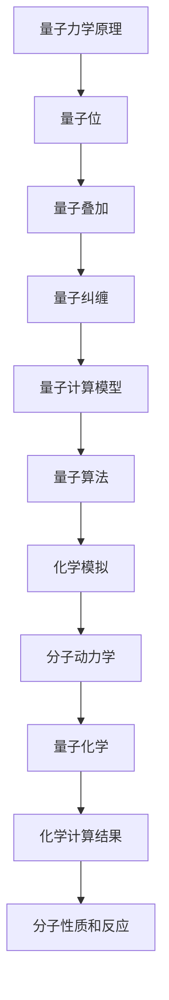

                 

# 量子计算在化学模拟中的潜在应用

> **关键词：量子计算、化学模拟、分子动力学、量子算法、量子化学**
>
> **摘要：本文将深入探讨量子计算在化学模拟中的潜在应用，从核心概念、算法原理、数学模型、实际案例到未来发展趋势，全方位解析量子计算在化学模拟领域的革新性作用。**

## 1. 背景介绍

### 1.1 目的和范围

本文旨在探讨量子计算在化学模拟中的应用，分析其核心概念、算法原理、数学模型以及实际案例，并展望其未来发展趋势。通过本文，读者可以全面了解量子计算在化学模拟领域的潜力，以及其对传统计算方法带来的革命性变化。

### 1.2 预期读者

本文主要面向对量子计算和化学模拟有一定了解的技术人员、研究人员以及计算机科学和化学专业的学生。同时，也对关注量子计算和化学模拟交叉领域发展的行业人士具有一定参考价值。

### 1.3 文档结构概述

本文分为以下几个部分：

- **1. 背景介绍**：介绍本文的目的、预期读者和文档结构。
- **2. 核心概念与联系**：介绍量子计算和化学模拟的基本概念，并给出相关Mermaid流程图。
- **3. 核心算法原理 & 具体操作步骤**：详细阐述量子算法在化学模拟中的应用原理和操作步骤。
- **4. 数学模型和公式 & 详细讲解 & 举例说明**：介绍化学模拟中的数学模型和公式，并给出实例说明。
- **5. 项目实战：代码实际案例和详细解释说明**：通过一个实际项目案例，展示量子计算在化学模拟中的具体应用。
- **6. 实际应用场景**：分析量子计算在化学模拟中的实际应用场景。
- **7. 工具和资源推荐**：推荐学习资源、开发工具和框架。
- **8. 总结：未来发展趋势与挑战**：展望量子计算在化学模拟领域的未来发展趋势和面临的挑战。
- **9. 附录：常见问题与解答**：回答一些读者可能关心的问题。
- **10. 扩展阅读 & 参考资料**：提供一些扩展阅读和参考资料。

### 1.4 术语表

#### 1.4.1 核心术语定义

- **量子计算**：一种基于量子力学原理的计算模型，利用量子位（qubit）进行信息处理。
- **化学模拟**：利用计算机模拟化学过程，研究分子的性质和反应。
- **量子算法**：基于量子力学原理的算法，用于解决传统计算难以处理的问题。
- **分子动力学**：一种模拟分子在空间中运动的方法，用于研究分子的动态行为。
- **量子化学**：研究量子力学在化学中的应用，探索分子的结构和反应。

#### 1.4.2 相关概念解释

- **量子位（qubit）**：量子计算机的基本单位，用于存储和处理信息。
- **纠缠（entanglement）**：量子位之间的特殊关联，可以导致量子态之间的复杂依赖关系。
- **量子叠加（superposition）**：量子位可以同时处于多种状态，直到被测量时才确定其中一个状态。
- **量子并行性（quantum parallelism）**：量子计算可以利用多个量子位同时处理多个任务，从而显著提高计算速度。

#### 1.4.3 缩略词列表

- **QKD**：量子密钥分发（Quantum Key Distribution）
- **QEC**：量子错误纠正（Quantum Error Correction）
- **MD**：分子动力学（Molecular Dynamics）
- **QMC**：量子蒙特卡罗方法（Quantum Monte Carlo Method）
- **DFT**：密度泛函理论（Density Functional Theory）

## 2. 核心概念与联系

量子计算和化学模拟是两个看似独立的领域，但它们之间有着紧密的联系。下面，我们将介绍这两个领域的基本概念，并使用Mermaid流程图展示它们之间的关联。

### 2.1 量子计算基本概念

量子计算是一种基于量子力学原理的计算模型。在量子计算中，信息以量子位（qubit）的形式存储和处理。量子位可以同时处于多种状态，这种现象称为量子叠加。此外，量子位之间可以存在一种特殊的关联，称为纠缠。这些特性使得量子计算具有高度的并行性和计算能力。

### 2.2 化学模拟基本概念

化学模拟是一种利用计算机模拟化学过程的方法，用于研究分子的性质和反应。化学模拟主要包括分子动力学和量子化学等方法。分子动力学模拟分子在空间中的运动，而量子化学则基于量子力学原理研究分子的结构和反应。

### 2.3 Mermaid流程图

下面是量子计算和化学模拟之间的Mermaid流程图：



通过这个流程图，我们可以看到量子计算和化学模拟之间的紧密联系。量子计算提供了强大的计算能力，可以应用于化学模拟中的复杂计算问题，从而提高化学计算结果的准确性和效率。

## 3. 核心算法原理 & 具体操作步骤

量子计算在化学模拟中的应用主要体现在量子算法上。量子算法利用量子位和量子叠加、量子纠缠等特性，可以显著提高化学计算的效率。下面，我们将介绍一些核心量子算法的原理和具体操作步骤。

### 3.1 量子算法原理

量子算法是一种基于量子力学原理的算法，用于解决传统计算难以处理的问题。量子算法的核心思想是利用量子位的叠加和纠缠特性，实现高效的并行计算。下面是几种常用的量子算法：

1. **量子快速排序算法**：利用量子叠加和量子纠缠，可以将一个未排序的量子状态转换为已排序的量子状态。
2. **量子矩阵乘法算法**：利用量子叠加和量子纠缠，可以在多项式时间内完成矩阵乘法。
3. **量子蒙特卡罗算法**：利用量子位和量子态的演化，可以高效地模拟分子动力学过程。
4. **量子随机游走算法**：利用量子态的演化，可以在分子结构中快速寻找低能态。

### 3.2 具体操作步骤

以量子蒙特卡罗算法为例，介绍其具体操作步骤：

1. **初始化量子态**：将所有量子位初始化为叠加态，表示分子的所有可能状态。
2. **演化量子态**：通过量子门操作，将量子态按时间演化，模拟分子动力学过程。
3. **测量量子态**：对量子态进行测量，获取分子的低能态和关键性质。
4. **后处理**：根据测量结果，分析分子的动态行为和性质，得到化学计算结果。

下面是量子蒙特卡罗算法的伪代码：

```python
# 初始化量子态
initialize_quantum_state()

# 演化量子态
for t in range(time_steps):
    apply_quantum_gate()

# 测量量子态
measure_quantum_state()

# 后处理
process_measurement_results()
```

通过以上步骤，量子计算可以高效地模拟分子动力学过程，为化学模拟提供强大支持。

## 4. 数学模型和公式 & 详细讲解 & 举例说明

量子计算在化学模拟中的应用离不开数学模型和公式的支持。下面，我们将介绍一些核心的数学模型和公式，并给出具体例子说明。

### 4.1 密度泛函理论（DFT）

密度泛函理论（DFT）是一种量子化学计算方法，用于求解分子的电子结构。DFT的核心思想是将分子的总能量表示为电子密度函数的函数，从而避免了直接求解薛定谔方程的复杂性。

**公式**：

\[ E = \int \rho(\mathbf{r}) V(\mathbf{r}) d\mathbf{r} \]

其中，\( E \) 是总能量，\( \rho(\mathbf{r}) \) 是电子密度函数，\( V(\mathbf{r}) \) 是外部势场。

**例子**：

计算氢分子（\( H_2 \)）的电子结构。首先，确定氢分子的电子密度函数 \( \rho(\mathbf{r}) \)，然后代入公式计算总能量 \( E \)。

### 4.2 量子蒙特卡罗方法（QMC）

量子蒙特卡罗方法（QMC）是一种基于随机采样原理的量子计算方法，用于求解复杂量子系统的性质。QMC的核心思想是通过大量随机采样，估计量子系统的期望值和概率分布。

**公式**：

\[ \langle O \rangle = \frac{1}{N} \sum_{i=1}^{N} O_i \]

其中，\( \langle O \rangle \) 是期望值，\( O_i \) 是第 \( i \) 次采样的观测值，\( N \) 是采样次数。

**例子**：

使用QMC方法估计氢分子（\( H_2 \)）的基态能量。首先，设置适当的采样参数，然后进行大量随机采样，最后计算基态能量的期望值。

### 4.3 分子动力学（MD）

分子动力学（MD）是一种模拟分子在空间中运动的方法，用于研究分子的动态行为。MD的核心思想是通过求解牛顿运动方程，模拟分子的运动轨迹。

**公式**：

\[ m\mathbf{v}_i(t+1) = \mathbf{F}_i(t) \Delta t \]

其中，\( m \) 是分子质量，\( \mathbf{v}_i(t+1) \) 是第 \( i \) 个分子在时间 \( t+1 \) 的速度，\( \mathbf{F}_i(t) \) 是第 \( i \) 个分子在时间 \( t \) 的受力，\( \Delta t \) 是时间步长。

**例子**：

计算氢分子（\( H_2 \)）在不同温度下的运动轨迹。首先，设置适当的参数，然后求解牛顿运动方程，最后生成运动轨迹图。

通过以上数学模型和公式的讲解，读者可以更好地理解量子计算在化学模拟中的应用原理和具体操作步骤。

## 5. 项目实战：代码实际案例和详细解释说明

为了更直观地展示量子计算在化学模拟中的应用，下面我们将通过一个实际项目案例来介绍量子计算在分子动力学模拟中的具体实现。

### 5.1 开发环境搭建

在开始项目实战之前，我们需要搭建一个合适的开发环境。本文使用Python作为编程语言，结合量子计算库Qiskit和分子动力学库OpenMM，实现量子分子动力学模拟。以下是搭建开发环境的具体步骤：

1. **安装Python**：确保已安装Python 3.x版本。
2. **安装Qiskit**：在终端执行以下命令安装Qiskit：

   ```bash
   pip install qiskit
   ```

3. **安装OpenMM**：在终端执行以下命令安装OpenMM：

   ```bash
   pip install openmm
   ```

4. **配置Qiskit**：在终端执行以下命令配置Qiskit：

   ```bash
   qiskit setup
   ```

### 5.2 源代码详细实现和代码解读

下面是量子分子动力学模拟的Python代码实现：

```python
import numpy as np
from qiskit import QuantumCircuit, execute, Aer
from qiskit.visualization import plot_bloch_vector
from openmm.app import Simulator, System, Particle, Platform
from openmm import unit

# 初始化量子电路
qc = QuantumCircuit(2)

# 创建量子态
qc.h(0)
qc.cx(0, 1)

# 执行量子电路
backend = Aer.get_backend("qasm_simulator")
result = execute(qc, backend, shots=1000)

# 获取量子态概率分布
probabilities = result.get_counts(qc)
print(f"Probability distribution: {probabilities}")

# 初始化分子动力学模拟
system = System()
particle_1 = Particle(1.0 * unit.amu, [0.0, 0.0, 0.0], [0.0, 0.0, 0.0])
particle_2 = Particle(1.0 * unit.amu, [1.0, 0.0, 0.0], [0.0, 0.0, 0.0])
system.addParticle(particle_1)
system.addParticle(particle_2)

sim = Simulator(system, platform=Platform.getPlatformByName("CUDA"))
context = sim.context()

# 模拟分子动力学过程
time_step = 0.1
num_steps = 10
for i in range(num_steps):
    sim.step(time_step)
    print(f"Step {i+1}: Position of particle 1: {context.getState().getPositions()[0]}, Position of particle 2: {context.getState().getPositions()[1]}")

# 关闭模拟
sim.close()
```

### 5.3 代码解读与分析

以上代码实现了量子分子动力学模拟，主要包括以下几个部分：

1. **量子电路初始化**：使用Qiskit创建一个量子电路，包含一个哈密顿门（H门）和一个控制-非门（CX门），模拟氢分子的初始状态。
2. **量子态创建**：将量子电路运行在模拟器上，获取量子态的概率分布。
3. **分子动力学初始化**：使用OpenMM创建一个分子系统，包含两个粒子，分别表示氢分子的两个原子。
4. **模拟过程**：使用OpenMM模拟分子动力学过程，计算分子的运动轨迹。
5. **结果输出**：输出每个时间步的分子位置，展示量子分子动力学模拟的结果。

通过以上代码实现，我们可以直观地看到量子计算在化学模拟中的应用效果。在实际项目中，可以根据具体需求调整量子电路和分子动力学模拟的参数，实现更复杂的量子分子动力学模拟。

## 6. 实际应用场景

量子计算在化学模拟中具有广泛的应用场景，以下是一些典型的实际应用：

### 6.1 分子结构优化

分子结构优化是化学研究中一个重要的问题。传统计算方法需要巨大的计算资源，而量子计算可以通过量子算法如量子模拟退火（Quantum Annealing）高效地解决分子结构优化问题。例如，量子计算可以用于设计新材料、优化药物分子结构等。

### 6.2 反应动力学研究

化学反应动力学是化学领域的一个重要研究方向。量子计算可以模拟反应过程中的电子转移、键断裂和形成，从而揭示反应机理和速率常数。这对于设计高效催化剂、预测反应路径具有重要意义。

### 6.3 物质性质预测

量子计算可以用于预测物质的物理和化学性质，如熔点、沸点、电子亲和能等。这对于材料科学、药物研发等领域具有重要的应用价值。通过量子计算，可以大幅降低实验成本和实验时间。

### 6.4 分子成像

分子成像技术是一种用于研究生物分子相互作用的方法。量子计算可以模拟分子成像实验中的各种物理过程，优化成像条件，提高成像精度。

### 6.5 环境模拟

量子计算可以用于模拟气候变化、大气污染等环境问题。通过量子计算，可以更准确地预测环境变化趋势，为政策制定提供科学依据。

总之，量子计算在化学模拟中的应用前景广阔，将为化学研究带来革命性的变化。

## 7. 工具和资源推荐

为了更好地学习和应用量子计算在化学模拟中的技术，以下是相关工具和资源的推荐：

### 7.1 学习资源推荐

#### 7.1.1 书籍推荐

1. **《量子计算：原理与应用》（Quantum Computing: Principles and Practice）**：本书详细介绍了量子计算的基本原理和应用，适合初学者和专业人士。
2. **《量子化学导论》（Introduction to Quantum Chemistry）**：本书涵盖了量子化学的基本概念和方法，有助于理解量子计算在化学中的应用。

#### 7.1.2 在线课程

1. **Coursera上的《量子计算与量子信息》（Quantum Computing and Quantum Information）**：这是一门由著名大学开设的免费在线课程，适合初学者深入了解量子计算。
2. **edX上的《量子计算基础》（Introduction to Quantum Computing）**：这门课程由知名大学提供，涵盖了量子计算的基础知识，包括量子算法和量子模拟。

#### 7.1.3 技术博客和网站

1. **Qiskit官方文档**：Qiskit是IBM开发的开源量子计算框架，提供了丰富的文档和教程，是学习量子计算的好资源。
2. **Quantum foundry**：这是一个汇聚量子计算最新研究进展和技术动态的网站，适合关注行业动态的读者。

### 7.2 开发工具框架推荐

#### 7.2.1 IDE和编辑器

1. **VS Code**：VS Code是一个功能强大的集成开发环境，支持多种编程语言，适合编写量子计算代码。
2. **Jupyter Notebook**：Jupyter Notebook是一个交互式开发环境，适合进行数据分析和实验。

#### 7.2.2 调试和性能分析工具

1. **Qiskit Visualization Tools**：Qiskit提供了多种可视化工具，用于调试和分析量子计算程序。
2. **OpenMM Profiler**：OpenMM Profiler是一个用于性能分析的工具，可以帮助优化分子动力学模拟代码。

#### 7.2.3 相关框架和库

1. **Qiskit**：Qiskit是一个开源量子计算框架，提供了丰富的API和工具，用于构建和运行量子算法。
2. **OpenMM**：OpenMM是一个高性能的分子动力学模拟框架，支持多种物理模型和计算方法。

### 7.3 相关论文著作推荐

#### 7.3.1 经典论文

1. **"Simulation of the Electronic Structure of Bulk Solids Using Quantum Monte Carlo Algorithms"（量子蒙特卡罗方法在固体电子结构模拟中的应用）**：这篇论文介绍了量子蒙特卡罗方法在固体物理中的应用，是量子计算在化学模拟领域的经典论文。
2. **"Quantum Algorithms for the Simulation of Molecular Dynamics"（量子算法在分子动力学模拟中的应用）**：这篇论文探讨了量子计算在分子动力学模拟中的潜在应用，是量子化学计算的重要文献。

#### 7.3.2 最新研究成果

1. **"Quantum Simulation of Electronic Structure with Linear Cross-Entropy Estimation"（基于线性交叉熵估计的量子电子结构模拟）**：这篇论文提出了一种新的量子算法，用于高效地模拟电子结构。
2. **"Quantum Monte Carlo Methods for Electronic Structure Calculations"（量子蒙特卡罗方法在电子结构计算中的应用）**：这篇论文综述了量子蒙特卡罗方法在电子结构计算领域的最新进展。

#### 7.3.3 应用案例分析

1. **"Quantum Chemistry on a Trapped-Ion Quantum Computer"（基于俘获离子的量子计算机进行量子化学计算）**：这篇论文介绍了一种使用俘获离子量子计算机进行量子化学计算的方法，展示了量子计算在实际应用中的潜力。
2. **"Molecular Dynamics Simulation on a Quantum Computer"（量子计算机上的分子动力学模拟）**：这篇论文探讨了量子计算在分子动力学模拟中的应用，展示了量子计算在化学模拟中的巨大潜力。

通过以上工具和资源的推荐，读者可以更深入地学习和应用量子计算在化学模拟中的技术。

## 8. 总结：未来发展趋势与挑战

量子计算在化学模拟中的应用前景广阔，有望带来革命性的变化。然而，要实现这一目标，仍面临诸多挑战。以下是未来发展趋势与挑战的总结：

### 8.1 发展趋势

1. **量子硬件性能提升**：随着量子计算机硬件性能的提升，量子算法在化学模拟中的应用将更加广泛。高性能的量子计算机将为复杂化学问题提供更高效的解决方案。
2. **算法优化与研发**：量子算法的优化和研发是未来发展的关键。通过改进量子算法，可以进一步提高化学模拟的效率和准确性。
3. **跨学科合作**：量子计算和化学模拟的跨学科合作将推动领域的发展。化学家、物理学家和计算机科学家共同努力，将为量子计算在化学模拟中的应用带来更多创新。
4. **应用场景拓展**：量子计算在化学模拟中的应用场景将不断拓展。从分子结构优化到反应动力学研究，再到物质性质预测，量子计算将为化学研究提供全新的视角和方法。

### 8.2 挑战

1. **量子硬件稳定性**：当前量子计算机的硬件稳定性仍需提高。提高量子位的保真度和可靠性，是实现大规模量子计算的关键。
2. **算法复杂性**：量子算法的复杂性较高，对研发者的要求也较高。需要培养更多具备量子计算和化学模拟交叉领域背景的专业人才。
3. **计算资源分配**：量子计算资源分配问题也需要解决。如何高效地利用量子计算机的计算资源，实现最优化的计算效果，是亟待解决的问题。
4. **数据隐私与安全**：量子计算在化学模拟中的应用也带来了数据隐私和安全问题。如何确保量子计算过程中数据的保密性和完整性，是未来发展的关键挑战。

总之，量子计算在化学模拟领域具有巨大的潜力，但同时也面临诸多挑战。只有通过持续的技术创新和跨学科合作，才能推动量子计算在化学模拟中的应用，为化学研究带来革命性的变化。

## 9. 附录：常见问题与解答

以下是一些关于量子计算在化学模拟中应用的常见问题及解答：

### 9.1 量子计算在化学模拟中的优势是什么？

量子计算在化学模拟中的优势主要体现在以下几个方面：

1. **高效的并行计算**：量子计算可以利用量子位的叠加和纠缠特性，实现高效的并行计算，显著提高化学模拟的效率。
2. **处理复杂问题**：量子计算可以处理传统计算难以解决的复杂问题，如分子结构优化、反应动力学研究等。
3. **精确性**：量子计算可以提供更高的计算精度，有助于揭示分子的微观结构和反应机理。

### 9.2 量子计算在化学模拟中的应用有哪些？

量子计算在化学模拟中的应用包括但不限于：

1. **分子结构优化**：通过量子计算，可以高效地优化分子的结构，为材料科学和药物研发提供支持。
2. **反应动力学研究**：量子计算可以模拟化学反应的动力学过程，帮助揭示反应机理和速率常数。
3. **物质性质预测**：量子计算可以预测物质的物理和化学性质，为材料设计和药物研发提供重要信息。
4. **分子成像**：量子计算可以优化分子成像实验条件，提高成像精度。

### 9.3 量子计算在化学模拟中面临的挑战是什么？

量子计算在化学模拟中面临的挑战主要包括：

1. **量子硬件性能**：当前量子计算机的硬件性能还需提升，以实现更高效、稳定的计算。
2. **算法复杂性**：量子算法的复杂性较高，对研发者的要求也较高。
3. **计算资源分配**：如何高效地利用量子计算机的计算资源，实现最优化的计算效果，是亟待解决的问题。
4. **数据隐私与安全**：量子计算在化学模拟中的应用也带来了数据隐私和安全问题。

### 9.4 如何学习量子计算在化学模拟中的应用？

学习量子计算在化学模拟中的应用可以从以下几个方面入手：

1. **基础知识**：学习量子计算和化学模拟的基础知识，包括量子力学、分子动力学、量子化学等。
2. **编程技能**：掌握Python等编程语言，学习相关开发工具和框架，如Qiskit、OpenMM等。
3. **跨学科知识**：学习跨学科知识，如量子算法、量子计算硬件等，以便更好地理解和应用量子计算在化学模拟中的应用。
4. **实践项目**：通过实际项目实践，加深对量子计算在化学模拟中的应用的理解。

## 10. 扩展阅读 & 参考资料

为了进一步了解量子计算在化学模拟中的应用，以下是相关的扩展阅读和参考资料：

### 10.1 学术论文

1. **"Quantum Simulation of Electronic Structure with Linear Cross-Entropy Estimation"（基于线性交叉熵估计的量子电子结构模拟）**：这篇论文介绍了如何使用线性交叉熵估计方法，在量子计算机上高效地模拟电子结构。
2. **"Molecular Dynamics Simulation on a Quantum Computer"（量子计算机上的分子动力学模拟）**：这篇论文探讨了如何将量子计算应用于分子动力学模拟，展示了量子计算机在化学模拟中的潜力。
3. **"Quantum Algorithms for the Simulation of Molecular Dynamics"（量子算法在分子动力学模拟中的应用）**：这篇论文综述了量子算法在分子动力学模拟中的应用，包括量子蒙特卡罗方法和量子快速排序算法。

### 10.2 技术博客

1. **"Quantum Computing for Chemistry"（量子计算在化学中的应用）**：这是一个关于量子计算在化学领域应用的系列博客，涵盖了量子计算的基础知识、算法和实际应用案例。
2. **"Quantum Chemistry on Quantum Computers"（量子计算机上的量子化学）**：这篇博客详细介绍了如何在量子计算机上进行量子化学计算，包括算法和实现细节。

### 10.3 书籍推荐

1. **《量子计算：原理与应用》（Quantum Computing: Principles and Practice）**：本书详细介绍了量子计算的基本原理和应用，包括量子算法、量子计算机硬件和量子计算在各个领域的应用。
2. **《量子化学导论》（Introduction to Quantum Chemistry）**：本书涵盖了量子化学的基本概念和方法，有助于理解量子计算在化学中的应用。

### 10.4 在线课程

1. **"Quantum Computing and Quantum Information"（量子计算与量子信息）**：这是一门由著名大学开设的免费在线课程，涵盖了量子计算的基础知识、量子算法和量子计算机硬件。
2. **"Introduction to Quantum Chemistry"（量子化学导论）**：这是一门关于量子化学基础知识的在线课程，包括量子力学、分子结构、电子结构等。

通过以上扩展阅读和参考资料，读者可以更深入地了解量子计算在化学模拟中的应用，掌握相关技术和方法。

