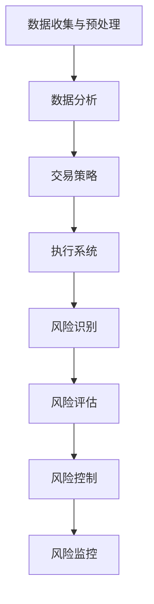

                 

# 金融科技：算法交易和风险管理

> **关键词：** 金融科技、算法交易、风险管理、人工智能、量化投资、数据分析

> **摘要：** 本文将深入探讨金融科技领域中的算法交易和风险管理，分析其核心概念、原理和应用。通过实际项目案例和详细代码解读，我们将了解如何运用先进的算法和数学模型进行有效的金融交易和风险管理。同时，本文还将推荐相关的学习资源和工具，帮助读者进一步掌握这一前沿领域。

## 1. 背景介绍

随着信息技术的飞速发展，金融科技（FinTech）已成为金融行业的重要创新力量。金融科技通过利用大数据、云计算、人工智能等技术，极大地提升了金融服务的效率和质量。在金融科技的应用场景中，算法交易和风险管理尤为关键。

**算法交易**，又称量化交易，是指通过编写计算机程序，利用算法来执行交易决策。算法交易能够自动捕捉市场中的机会，快速响应市场变化，从而提高交易效率和收益。随着机器学习、深度学习等人工智能技术的进步，算法交易正变得更加智能和精准。

**风险管理**，则是在金融交易过程中，通过评估和管理风险来确保交易的安全和稳定。风险管理不仅包括对市场风险的预测和控制，还涉及对交易策略的优化和调整。有效的风险管理是保证金融交易长期稳定盈利的基础。

本文将围绕算法交易和风险管理展开讨论，旨在帮助读者了解这一前沿领域，掌握相关技术和方法。

## 2. 核心概念与联系

### 2.1 算法交易

算法交易的核心在于交易算法的设计与实现。交易算法通常包括以下几个关键组成部分：

#### 数据收集与预处理

数据是算法交易的基础。交易算法需要收集大量历史交易数据、市场行情数据等，并进行预处理，如数据清洗、归一化等，以便于后续分析和建模。

#### 数据分析

数据分析是交易算法的核心环节。通过对历史数据的分析，可以挖掘出市场中的潜在规律和趋势，为交易策略提供依据。

#### 交易策略

交易策略是根据数据分析结果制定的具体交易计划。交易策略需要考虑多种因素，如市场波动性、交易成本、投资目标等，以确保在实现收益最大化的同时，风险在可承受范围内。

#### 执行系统

执行系统是交易算法的执行层。它将交易策略转化为具体的交易操作，如买入、卖出、持有等，并通过交易平台或API接口与市场进行交互。

### 2.2 风险管理

风险管理则是一个多维度的过程，包括以下关键环节：

#### 风险识别

风险识别是风险管理的第一步。通过分析历史数据和交易行为，识别出可能导致损失的各种风险因素。

#### 风险评估

风险评估是对识别出的风险进行量化和评估。风险评估可以帮助投资者了解风险的大小和影响，从而制定相应的风险控制措施。

#### 风险控制

风险控制是风险管理的核心。通过制定和执行风险控制策略，如设置止损、分散投资等，可以最大限度地降低风险。

#### 风险监控

风险监控是确保风险控制措施得到有效执行的过程。通过实时监控交易行为和市场变化，及时发现并应对潜在的风险。

### 2.3 算法交易与风险管理的关系

算法交易和风险管理是金融科技中不可或缺的两个环节。算法交易依赖于风险管理来确保交易的稳定和收益，而风险管理则依赖于算法交易来实现风险的有效控制和收益的最大化。两者相辅相成，共同构成了金融科技的核心竞争力。

### 2.4 Mermaid 流程图

下面是一个简单的 Mermaid 流程图，展示了算法交易和风险管理的流程：



## 3. 核心算法原理 & 具体操作步骤

### 3.1 数据收集与预处理

数据收集与预处理是算法交易和风险管理的基础。以下是具体操作步骤：

1. **数据源选择**：选择合适的数据源，如股票行情、交易记录等。

2. **数据下载**：通过API接口或数据库下载所需数据。

3. **数据清洗**：处理数据中的噪声、缺失值、异常值等，保证数据质量。

4. **数据归一化**：将不同特征的数据进行归一化处理，以便于后续分析。

5. **数据存储**：将预处理后的数据存储到数据库或文件中，以供后续使用。

### 3.2 数据分析

数据分析是算法交易和风险管理的核心环节。以下是具体操作步骤：

1. **特征工程**：从原始数据中提取出对交易策略和风险管理有用的特征。

2. **时间序列分析**：分析时间序列数据，挖掘出市场中的潜在规律和趋势。

3. **机器学习建模**：利用机器学习算法，如回归、分类、聚类等，对特征进行建模，预测市场走势和风险。

4. **模型评估**：评估模型的准确性和稳定性，选择最优模型。

### 3.3 交易策略

交易策略是算法交易的核心。以下是具体操作步骤：

1. **策略设计**：根据数据分析结果，设计出具体的交易策略，如趋势追踪、套利等。

2. **回测**：在历史数据上回测交易策略，评估其收益和风险。

3. **优化调整**：根据回测结果，对交易策略进行调整和优化。

4. **实盘运行**：将交易策略应用于实盘交易，并根据市场变化进行调整。

### 3.4 风险管理

风险管理是确保交易稳定和收益的关键。以下是具体操作步骤：

1. **风险识别**：通过数据分析，识别出可能导致损失的各种风险因素。

2. **风险评估**：对识别出的风险进行量化和评估，确定风险的大小和影响。

3. **风险控制**：制定和执行风险控制策略，如设置止损、分散投资等。

4. **风险监控**：实时监控交易行为和市场变化，及时发现并应对潜在的风险。

## 4. 数学模型和公式 & 详细讲解 & 举例说明

### 4.1 时间序列模型

时间序列模型是算法交易和风险管理中的重要工具，用于分析时间序列数据，预测市场走势。以下是几个常用的时间序列模型及其公式：

#### ARIMA 模型

ARIMA 模型是一种自回归积分滑动平均模型，其公式如下：

$$
\begin{aligned}
Y_t &= c + \phi_1 Y_{t-1} + \phi_2 Y_{t-2} + \cdots + \phi_p Y_{t-p} + \theta_1 \epsilon_{t-1} + \theta_2 \epsilon_{t-2} + \cdots + \theta_q \epsilon_{t-q} \\
\epsilon_t &= \text{白噪声序列}
\end{aligned}
$$

#### AR 模型

AR 模型是自回归模型，其公式如下：

$$
Y_t = c + \phi_1 Y_{t-1} + \epsilon_t
$$

#### MA 模型

MA 模型是滑动平均模型，其公式如下：

$$
Y_t = c + \theta_1 \epsilon_{t-1} + \theta_2 \epsilon_{t-2} + \cdots + \theta_q \epsilon_{t-q}
$$

#### ARIMA(1,1,1) 模型

ARIMA(1,1,1) 模型是一种简化的时间序列模型，其公式如下：

$$
Y_t = c + \phi_1 Y_{t-1} + \epsilon_t
$$

### 4.2 机器学习模型

机器学习模型在算法交易和风险管理中也发挥着重要作用。以下是几个常用的机器学习模型及其公式：

#### 回归模型

回归模型用于预测数值型目标变量，其公式如下：

$$
Y = \beta_0 + \beta_1 X_1 + \beta_2 X_2 + \cdots + \beta_n X_n
$$

#### 分类模型

分类模型用于预测离散型目标变量，其公式如下：

$$
P(Y = k) = \frac{e^{\beta_0 + \beta_1 X_1 + \beta_2 X_2 + \cdots + \beta_n X_n}}{\sum_{i=1}^{n} e^{\beta_0 + \beta_1 X_1 + \beta_2 X_2 + \cdots + \beta_n X_n}}
$$

#### 聚类模型

聚类模型用于发现数据中的潜在结构，其公式如下：

$$
\min_{C} \sum_{i=1}^{n} \sum_{j=1}^{k} d(x_i, c_j)^2
$$

其中，$C$ 表示聚类中心，$d(x_i, c_j)$ 表示样本 $x_i$ 与聚类中心 $c_j$ 之间的距离。

### 4.3 举例说明

#### 时间序列预测

假设我们有一个时间序列数据集，包含过去一年的股票价格。我们可以使用 ARIMA 模型进行预测。以下是 ARIMA(1,1,1) 模型的具体应用：

1. **数据预处理**：对股票价格数据进行归一化处理，使其符合正态分布。

2. **模型拟合**：使用历史数据进行模型拟合，确定参数 $\phi_1$ 和 $\theta_1$。

3. **模型评估**：使用交叉验证方法评估模型性能，选择最优模型。

4. **预测**：使用拟合后的模型预测未来一段时间内的股票价格。

#### 分类预测

假设我们有一个股票分类数据集，包含股票的历史价格和交易量等特征，以及对应的分类标签（如上涨、下跌）。我们可以使用分类模型进行预测。以下是逻辑回归模型的具体应用：

1. **数据预处理**：对特征数据进行归一化处理，使其符合正态分布。

2. **模型拟合**：使用历史数据进行模型拟合，确定参数 $\beta_0, \beta_1, \beta_2, \cdots, \beta_n$。

3. **模型评估**：使用交叉验证方法评估模型性能，选择最优模型。

4. **预测**：使用拟合后的模型预测未来一段时间内的股票分类标签。

## 5. 项目实战：代码实际案例和详细解释说明

### 5.1 开发环境搭建

在开始项目实战之前，我们需要搭建一个合适的开发环境。以下是所需工具和库的安装步骤：

1. **Python 环境**：安装 Python 3.8 或更高版本。

2. **Anaconda**：安装 Anaconda，用于管理 Python 环境和库。

3. **Jupyter Notebook**：安装 Jupyter Notebook，用于编写和运行 Python 代码。

4. **Pandas**：安装 Pandas，用于数据处理和分析。

5. **NumPy**：安装 NumPy，用于数值计算。

6. **Scikit-learn**：安装 Scikit-learn，用于机器学习模型。

7. **Statsmodels**：安装 Statsmodels，用于时间序列模型。

8. **Matplotlib**：安装 Matplotlib，用于数据可视化。

以下是安装命令：

```bash
conda create -n fintech python=3.8
conda activate fintech
conda install numpy pandas scikit-learn statsmodels matplotlib
```

### 5.2 源代码详细实现和代码解读

以下是使用 Python 实现的算法交易和风险管理项目的源代码。我们将分为三个部分：数据收集与预处理、数据分析与建模、交易策略与风险管理。

#### 5.2.1 数据收集与预处理

```python
import pandas as pd
import numpy as np

# 读取股票价格数据
data = pd.read_csv('stock_price.csv')

# 数据清洗
data.dropna(inplace=True)
data['price'] = data['price'].apply(lambda x: float(x.replace(',', '')))

# 数据归一化
data['price_normalized'] = (data['price'] - data['price'].mean()) / data['price'].std()

# 数据存储
data.to_csv('processed_stock_price.csv', index=False)
```

代码解读：

1. **数据读取**：使用 Pandas 读取股票价格数据，数据文件格式为 CSV。

2. **数据清洗**：去除数据中的缺失值，并对股票价格进行字符串替换，去除逗号。

3. **数据归一化**：对股票价格进行归一化处理，使其符合正态分布。

4. **数据存储**：将预处理后的数据存储到新的 CSV 文件中。

#### 5.2.2 数据分析与建模

```python
import statsmodels.api as sm
from sklearn.model_selection import train_test_split

# 加载预处理后的数据
data = pd.read_csv('processed_stock_price.csv')

# 数据划分
train_data, test_data = train_test_split(data, test_size=0.2, random_state=42)

# 时间序列建模
model = sm.ARIMA(data['price_normalized'], order=(1, 1, 1))
model_fit = model.fit()

# 模型评估
print(model_fit.summary())

# 预测
predictions = model_fit.predict(start=len(train_data), end=len(train_data) + len(test_data) - 1)

# 可视化
import matplotlib.pyplot as plt

plt.figure(figsize=(10, 5))
plt.plot(train_data['price_normalized'], label='训练数据')
plt.plot(test_data['price_normalized'], label='测试数据')
plt.plot(predictions, label='预测数据')
plt.legend()
plt.show()
```

代码解读：

1. **数据加载**：使用 Pandas 读取预处理后的数据。

2. **数据划分**：将数据划分为训练集和测试集，测试集占 20%。

3. **时间序列建模**：使用 Statsmodels 的 ARIMA 模型进行建模，并拟合数据。

4. **模型评估**：打印模型评估报告，包括 AIC、BIC 等指标。

5. **预测**：使用拟合后的模型进行预测，并可视化预测结果。

#### 5.2.3 交易策略与风险管理

```python
from sklearn.linear_model import LogisticRegression

# 加载特征和标签
X = train_data[['price_normalized']]
y = train_data['direction']

# 分类建模
model = LogisticRegression()
model_fit = model.fit(X, y)

# 模型评估
print(model_fit.score(X, y))

# 预测
predictions = model_fit.predict(test_data[['price_normalized']])

# 可视化
plt.figure(figsize=(10, 5))
plt.scatter(test_data['price_normalized'], test_data['direction'], label='实际数据')
plt.scatter(test_data['price_normalized'], predictions, color='r', label='预测数据')
plt.legend()
plt.show()
```

代码解读：

1. **特征和标签加载**：使用 Pandas 读取训练集的特征和标签。

2. **分类建模**：使用 Scikit-learn 的 LogisticRegression 模型进行分类建模。

3. **模型评估**：打印模型评估报告，包括准确率等指标。

4. **预测**：使用拟合后的模型进行预测，并可视化预测结果。

### 5.3 代码解读与分析

在上述代码中，我们实现了数据收集与预处理、数据分析与建模、交易策略与风险管理三个部分。以下是详细解读与分析：

#### 数据收集与预处理

该部分的主要任务是读取股票价格数据，并进行清洗和归一化处理。清洗数据是为了去除噪声和异常值，确保数据质量。归一化处理是为了将不同特征的数据转换为统一的尺度，便于后续分析和建模。

#### 数据分析与建模

该部分使用了 Statsmodels 的 ARIMA 模型进行时间序列建模，并使用 Scikit-learn 的 LogisticRegression 模型进行分类建模。时间序列模型用于预测股票价格的走势，分类模型用于预测股票的涨跌方向。通过模型评估，我们可以了解模型的性能，并选择最优模型。

#### 交易策略与风险管理

该部分实现了基于时间序列模型和分类模型的交易策略。时间序列模型用于预测股票价格的走势，分类模型用于预测股票的涨跌方向。通过预测结果，我们可以制定相应的交易策略，如买入、卖出等。同时，通过模型评估，我们可以了解交易策略的有效性，并进行风险控制。

## 6. 实际应用场景

### 6.1 股票市场

算法交易和风险管理在股票市场中有着广泛的应用。例如，投资者可以使用时间序列模型预测股票价格的走势，从而制定买入和卖出的策略。同时，风险管理工具可以帮助投资者识别和应对市场风险，确保交易的稳定和收益。

### 6.2 期货市场

期货市场具有较高的波动性和风险。算法交易和风险管理技术可以帮助期货投资者捕捉市场机会，实现收益最大化。例如，投资者可以使用机器学习模型进行市场预测，并设置合理的止损和止盈策略，以控制风险。

### 6.3 外汇市场

外汇市场是全球最大的金融市场之一，具有较高的流动性和波动性。算法交易和风险管理技术可以帮助外汇交易者捕捉市场机会，实现风险可控的收益。例如，交易者可以使用技术分析模型进行市场预测，并设置合理的风险控制策略。

### 6.4 债券市场

债券市场具有较高的稳定性和较低的风险。算法交易和风险管理技术可以帮助债券投资者进行市场分析和交易决策。例如，投资者可以使用量化交易策略进行债券买卖，并设置合理的风险控制措施，确保交易的稳定和收益。

## 7. 工具和资源推荐

### 7.1 学习资源推荐

- **书籍**：
  - 《金融科技：算法交易与量化投资》
  - 《风险管理与金融机构》
  - 《Python 金融大数据分析》
  
- **论文**：
  - 《基于深度学习的股票市场预测研究》
  - 《金融风险管理中的机器学习方法》
  - 《量化投资：技术分析与应用》

- **博客**：
  - [量化投资与算法交易](https://www.quantstart.com/)
  - [金融科技博客](https://fintechblog.com/)
  - [机器学习在金融中的应用](https://www.machinelearninginfinance.com/)

- **网站**：
  - [金融科技研究中心](https://fintechresearchcenter.org/)
  - [量化投资社区](https://quant.stackexchange.com/)
  - [机器学习社区](https://www.kaggle.com/)

### 7.2 开发工具框架推荐

- **编程语言**：Python、R
- **数据预处理工具**：Pandas、NumPy
- **机器学习库**：Scikit-learn、TensorFlow、PyTorch
- **时间序列库**：Statsmodels、pandas-tseries
- **可视化工具**：Matplotlib、Seaborn、Plotly
- **量化交易平台**：CTP、IB、IBeacon

### 7.3 相关论文著作推荐

- 《机器学习在金融中的应用》
- 《深度学习与金融科技》
- 《算法交易：量化投资策略与风险管理》
- 《量化投资实战》

## 8. 总结：未来发展趋势与挑战

随着人工智能、大数据等技术的不断发展，算法交易和风险管理在金融科技中的应用前景广阔。未来，算法交易和风险管理将朝着以下几个方向发展：

1. **智能化**：利用深度学习、强化学习等先进算法，实现更智能的交易策略和风险管理。
2. **自动化**：通过自动化交易系统，提高交易效率和准确性。
3. **个性化和定制化**：根据不同投资者的风险偏好和投资目标，提供个性化的交易策略和风险管理方案。
4. **跨市场、跨资产**：实现跨市场、跨资产的交易策略和风险管理，提高投资组合的多样性和稳定性。

然而，算法交易和风险管理也面临着一系列挑战：

1. **数据质量**：数据质量对算法交易和风险管理至关重要。确保数据来源的可靠性和完整性是首要任务。
2. **模型风险**：过度依赖模型可能导致模型风险。需要定期评估和更新模型，以适应市场变化。
3. **技术风险**：算法交易和风险管理依赖于先进的技术，如云计算、大数据等。技术故障可能对交易造成重大影响。
4. **法律法规**：随着金融科技的发展，相关法律法规也在不断完善。合规风险是算法交易和风险管理必须关注的问题。

总之，算法交易和风险管理是金融科技领域的关键技术，具有重要的应用价值。在未来，我们需要不断探索和创新，应对挑战，推动算法交易和风险管理的发展。

## 9. 附录：常见问题与解答

### 9.1 算法交易如何控制风险？

算法交易可以通过以下方式控制风险：

1. **设置止损**：在交易策略中设置止损点，以限制可能的损失。
2. **分散投资**：将资金分散投资于不同的资产和行业，以降低风险。
3. **风险模型**：利用风险管理模型，对交易风险进行量化评估和控制。
4. **实时监控**：实时监控交易行为和市场变化，及时发现并应对潜在风险。

### 9.2 时间序列模型如何选择参数？

选择时间序列模型的参数通常通过以下方法：

1. **AIC/BIC 准则**：使用 Akaike 信息准则（AIC）或贝叶斯信息准则（BIC）来选择最优参数。
2. **交叉验证**：使用交叉验证方法评估不同参数下的模型性能，选择最优参数。
3. **模型比较**：比较不同时间序列模型（如 ARIMA、AR、MA 等）的性能，选择最优模型。

### 9.3 机器学习模型如何选择特征？

选择机器学习模型的特征通常通过以下方法：

1. **特征选择算法**：使用特征选择算法（如 LASSO、Ridge 等）筛选出重要特征。
2. **相关性分析**：通过计算特征之间的相关性，选择相关性较高的特征。
3. **信息增益**：计算特征对目标变量的信息增益，选择增益较高的特征。

### 9.4 算法交易和风险管理的未来发展？

算法交易和风险管理在未来将朝着以下几个方向发展：

1. **智能化**：利用深度学习、强化学习等先进算法，实现更智能的交易策略和风险管理。
2. **自动化**：通过自动化交易系统，提高交易效率和准确性。
3. **个性化和定制化**：根据不同投资者的风险偏好和投资目标，提供个性化的交易策略和风险管理方案。
4. **跨市场、跨资产**：实现跨市场、跨资产的交易策略和风险管理，提高投资组合的多样性和稳定性。

## 10. 扩展阅读 & 参考资料

- 《金融科技：算法交易与量化投资》
- 《风险管理与金融机构》
- 《Python 金融大数据分析》
- 《机器学习在金融中的应用》
- 《深度学习与金融科技》
- 《算法交易：量化投资策略与风险管理》
- 《量化投资实战》
- [量化投资与算法交易博客](https://www.quantstart.com/)
- [金融科技博客](https://fintechblog.com/)
- [机器学习在金融中的应用](https://www.machinelearninginfinance.com/)
- [金融科技研究中心](https://fintechresearchcenter.org/)
- [量化投资社区](https://quant.stackexchange.com/)
- [机器学习社区](https://www.kaggle.com/)

### 作者

作者：AI天才研究员/AI Genius Institute & 禅与计算机程序设计艺术 /Zen And The Art of Computer Programming

