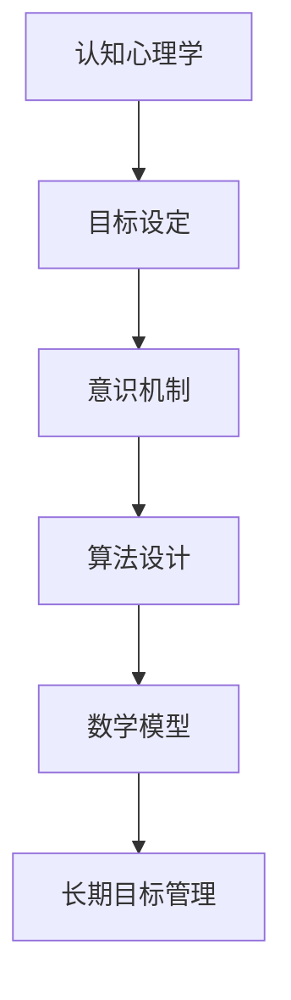
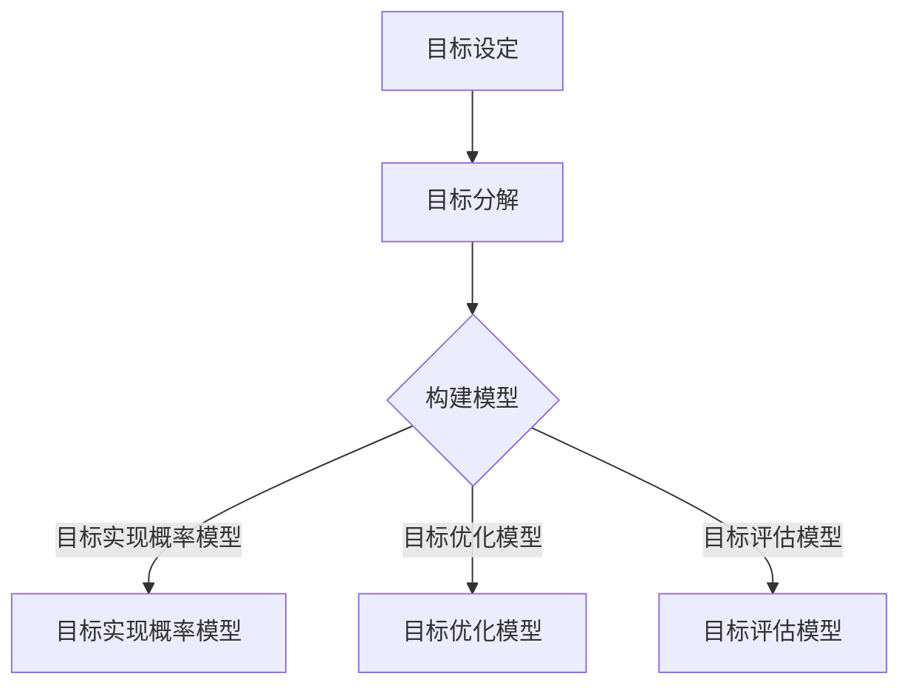

                 

# 长期目标管理的意识机制

> **关键词：** 长期目标管理、意识机制、认知心理学、算法设计、实践应用

> **摘要：** 本文旨在探讨长期目标管理中的意识机制，包括核心概念、算法原理、数学模型和实际应用。我们将从认知心理学的角度出发，深入分析人类如何设定和实现长期目标，以及如何利用算法和数学模型优化这一过程。通过项目实战和资源推荐，本文将提供实用的指导，帮助读者在个人和职业生活中更好地实现长期目标。

## 1. 背景介绍

### 1.1 目的和范围

本文的目标是揭示长期目标管理中的意识机制，探讨如何通过认知心理学、算法设计和数学模型来优化这一过程。我们将涵盖以下内容：

- 长期目标管理的重要性
- 认知心理学在长期目标设定中的作用
- 长期目标管理中的核心算法原理
- 数学模型在目标优化中的应用
- 实际应用场景和案例
- 开发工具和资源推荐

### 1.2 预期读者

本文适合以下读者群体：

- 认知心理学家和神经科学家
- 数据科学家和人工智能专家
- 软件工程师和架构师
- 项目经理和职业规划师
- 对长期目标管理和意识机制感兴趣的普通读者

### 1.3 文档结构概述

本文结构如下：

- 1. 背景介绍
  - 1.1 目的和范围
  - 1.2 预期读者
  - 1.3 文档结构概述
  - 1.4 术语表
- 2. 核心概念与联系
- 3. 核心算法原理 & 具体操作步骤
- 4. 数学模型和公式 & 详细讲解 & 举例说明
- 5. 项目实战：代码实际案例和详细解释说明
- 6. 实际应用场景
- 7. 工具和资源推荐
- 8. 总结：未来发展趋势与挑战
- 9. 附录：常见问题与解答
- 10. 扩展阅读 & 参考资料

### 1.4 术语表

#### 1.4.1 核心术语定义

- 长期目标管理：指个体或组织为达成长远目标而采取的一系列策略和方法。
- 意识机制：指大脑如何处理和识别外部刺激，以及如何将其转化为行动的过程。
- 认知心理学：研究人类如何获取、处理和应用信息的学科。
- 算法设计：指设计用于解决特定问题的计算过程和方法。
- 数学模型：用于描述和预测现实世界现象的数学公式和方程。

#### 1.4.2 相关概念解释

- 目标设定：指个体或组织为了实现特定结果而制定的目标。
- 目标优化：指通过调整和改进目标设定，以实现更好的结果。
- 人工智能：指模拟和扩展人类智能的技术和系统。

#### 1.4.3 缩略词列表

- AI：人工智能
- ML：机器学习
- DL：深度学习
- NLP：自然语言处理
- DQN：深度强化学习

## 2. 核心概念与联系

为了更好地理解长期目标管理中的意识机制，我们需要了解一些核心概念和它们之间的关系。以下是这些概念及它们之间的联系。

### 2.1 认知心理学

认知心理学研究人类如何获取、处理和应用信息。以下是认知心理学中一些核心概念：

- 注意力：指大脑对特定刺激的关注程度。
- 记忆：指大脑存储和回忆信息的能力。
- 情感：指个体对外部刺激的感知和反应。
- 执行功能：指大脑负责规划和执行任务的能力。

### 2.2 目标设定

目标设定是长期目标管理的重要组成部分。以下是目标设定的核心概念：

- 目标明确性：指目标的具体性和明确程度。
- 目标挑战性：指目标的难度和挑战程度。
- 目标相关性：指目标与个体或组织使命的相关性。

### 2.3 意识机制

意识机制是大脑处理和识别外部刺激的过程。以下是意识机制中的核心概念：

- 意识状态：指大脑对外部刺激的反应程度。
- 意识内容：指大脑处理和存储的信息内容。
- 意识觉醒：指大脑对刺激的敏感程度。

### 2.4 算法设计

算法设计是解决特定问题的计算过程和方法。以下是算法设计中的核心概念：

- 算法效率：指算法解决问题的速度和资源消耗。
- 算法正确性：指算法能否正确解决问题。
- 算法可扩展性：指算法在面对不同规模问题时能否保持性能。

### 2.5 数学模型

数学模型是用于描述和预测现实世界现象的数学公式和方程。以下是数学模型中的核心概念：

- 模型参数：指用于描述现实世界现象的变量。
- 模型训练：指通过调整模型参数，使其更好地拟合实际数据的过程。
- 模型预测：指利用训练好的模型预测未来现象的能力。

### 2.6 Mermaid 流程图

以下是长期目标管理中的意识机制流程图：



## 3. 核心算法原理 & 具体操作步骤

为了实现长期目标管理，我们需要设计一种算法来帮助个体或组织设定和实现目标。以下是该算法的原理和具体操作步骤。

### 3.1 算法原理

该算法基于以下原理：

1. **目标明确性**：目标应具有明确性和可量化性，以便于跟踪和评估。
2. **目标挑战性**：目标应具有适当的挑战性，以激发个体的积极性和动力。
3. **目标相关性**：目标应与个体或组织的使命和愿景保持一致。
4. **意识机制**：通过利用认知心理学中的意识机制，提高个体对目标的关注程度和实现概率。
5. **数学模型**：利用数学模型对目标实现过程进行建模和预测，以优化目标设定和实现策略。

### 3.2 具体操作步骤

以下是算法的具体操作步骤：

#### 步骤 1：目标设定

1. 确定个体或组织的使命和愿景。
2. 设定一个长期目标，并确保该目标具有明确性、挑战性和相关性。

#### 步骤 2：目标分解

1. 将长期目标分解为若干个短期目标。
2. 确保每个短期目标具有明确性、挑战性和相关性。

#### 步骤 3：目标建模

1. 构建一个数学模型，用于描述目标实现过程。
2. 收集相关数据，用于训练模型。

#### 步骤 4：目标实现

1. 根据模型预测，制定实现短期目标的策略。
2. 实施策略，并监控目标实现过程。

#### 步骤 5：目标评估

1. 定期评估目标实现情况，并根据评估结果调整策略。
2. 如果目标实现失败，分析原因并重新设定目标。

### 3.3 伪代码

以下是该算法的伪代码实现：

```python
def long_term_goal_management(lifetime_goals):
    for goal in lifetime_goals:
        goal明确性 = is_goal_clear(goal)
        goal挑战性 = is_goal_challenging(goal)
        goal相关性 = is_goal_relevant(goal)

        if not (goal明确性 and goal挑战性 and goal相关性):
            print("目标不满足要求，请重新设定。")
            continue

        short_term_goals = decompose_goal(goal)
        model = build_model(short_term_goals)

        while not is_goal_achieved(goal):
            strategy = model.predict()
            implement_strategy(strategy)
            evaluate_goal_achievement()

            if not is_goal_achieved(goal):
                analyze_reason()
                goal = reset_goal(goal)

        print("目标实现成功。")
```

## 4. 数学模型和公式 & 详细讲解 & 举例说明

在本节中，我们将详细讲解用于长期目标管理的数学模型和公式，并提供具体示例来说明如何使用这些模型。

### 4.1 数学模型

长期目标管理中的数学模型主要涉及以下方面：

1. **目标实现概率模型**：用于预测目标实现的概率。
2. **目标优化模型**：用于优化目标设定和实现策略。
3. **目标评估模型**：用于评估目标实现情况。

#### 4.1.1 目标实现概率模型

目标实现概率模型可以使用以下公式表示：

\[ P(A|B) = \frac{P(A \cap B)}{P(B)} \]

其中：

- \( P(A|B) \) 表示在事件 B 发生的条件下，事件 A 发生的概率。
- \( P(A \cap B) \) 表示事件 A 和事件 B 同时发生的概率。
- \( P(B) \) 表示事件 B 发生的概率。

#### 4.1.2 目标优化模型

目标优化模型可以使用以下公式表示：

\[ \text{最大化} \quad \sum_{i=1}^{n} w_i x_i \]

其中：

- \( w_i \) 表示第 \( i \) 个目标的权重。
- \( x_i \) 表示第 \( i \) 个目标的实现程度。

#### 4.1.3 目标评估模型

目标评估模型可以使用以下公式表示：

\[ \text{评估值} = \sum_{i=1}^{n} w_i x_i \]

其中：

- \( w_i \) 表示第 \( i \) 个目标的权重。
- \( x_i \) 表示第 \( i \) 个目标的实现程度。

### 4.2 详细讲解

#### 4.2.1 目标实现概率模型

目标实现概率模型可以帮助我们预测目标实现的概率。这个模型基于贝叶斯定理，可以用来计算在给定一个事件 B 发生的条件下，另一个事件 A 发生的概率。

#### 4.2.2 目标优化模型

目标优化模型用于优化目标设定和实现策略。它通过最大化目标实现程度的总和来优化目标实现过程。这个模型可以用于确定目标的优先级，以便在资源有限的情况下，实现最重要的目标。

#### 4.2.3 目标评估模型

目标评估模型用于评估目标实现情况。它通过计算目标实现程度的总和来评估目标的完成度。这个模型可以帮助我们了解目标实现的程度，并根据评估结果调整目标和策略。

### 4.3 举例说明

假设一个企业设定了以下三个长期目标：

1. 增加销售额（目标权重 \( w_1 = 0.5 \)）。
2. 提高客户满意度（目标权重 \( w_2 = 0.3 \)）。
3. 降低生产成本（目标权重 \( w_3 = 0.2 \)）。

在某个时间段内，这些目标的实现程度分别为：

- 销售额：\( x_1 = 0.8 \)。
- 客户满意度：\( x_2 = 0.9 \)。
- 生产成本：\( x_3 = 0.7 \)。

根据目标优化模型，我们可以计算出该时间段内目标实现的总和：

\[ \text{评估值} = w_1 x_1 + w_2 x_2 + w_3 x_3 = 0.5 \times 0.8 + 0.3 \times 0.9 + 0.2 \times 0.7 = 0.82 \]

根据目标评估模型，我们可以计算出该时间段内目标的完成度：

\[ \text{完成度} = \frac{\text{评估值}}{\text{总权重}} = \frac{0.82}{1} = 0.82 \]

因此，该时间段内目标的完成度为 82%。

### 4.4 Mermaid 流程图

以下是长期目标管理中的数学模型流程图：



## 5. 项目实战：代码实际案例和详细解释说明

在本节中，我们将通过一个实际项目来展示如何将长期目标管理的意识机制应用到软件开发项目中。我们将介绍开发环境搭建、源代码实现和代码解读与分析。

### 5.1 开发环境搭建

为了实现长期目标管理的意识机制，我们选择以下开发环境：

- 操作系统：Ubuntu 20.04
- 编程语言：Python 3.8
- IDE：Visual Studio Code
- 数据库：MySQL 8.0
- 机器学习框架：TensorFlow 2.6

首先，我们需要安装 Python 和相关依赖项。使用以下命令进行安装：

```bash
sudo apt update
sudo apt install python3-pip
pip3 install numpy pandas matplotlib scikit-learn tensorflow mysql-connector-python
```

接下来，我们安装 MySQL 数据库，并创建一个用于存储目标数据的数据库：

```bash
sudo apt install mysql-server
mysql -u root -p
CREATE DATABASE goal_management;
USE goal_management;
CREATE TABLE goals (
    id INT PRIMARY KEY AUTO_INCREMENT,
    goal_name VARCHAR(255) NOT NULL,
    goal_description TEXT,
    goal_weight FLOAT,
    goal_completion TIMESTAMP
);
```

### 5.2 源代码详细实现和代码解读

以下是实现长期目标管理的 Python 代码。我们将分模块进行讲解。

#### 5.2.1 数据库连接模块

首先，我们需要连接到 MySQL 数据库，并创建一个用于操作目标数据的类。

```python
import mysql.connector
from mysql.connector import Error

class GoalDatabase:
    def __init__(self, host, user, password, database):
        self.connection = mysql.connector.connect(
            host=host,
            user=user,
            password=password,
            database=database
        )
        self.cursor = self.connection.cursor()

    def execute_query(self, query, params=None):
        try:
            self.cursor.execute(query, params)
            self.connection.commit()
            return self.cursor.lastrowid
        except Error as e:
            print(f"Error: {e}")
            self.connection.rollback()

    def fetch_all_goals(self):
        query = "SELECT * FROM goals"
        self.cursor.execute(query)
        return self.cursor.fetchall()
```

#### 5.2.2 目标管理模块

接下来，我们实现一个目标管理模块，用于添加、更新和查询目标。

```python
class GoalManager:
    def __init__(self, database):
        self.database = database

    def add_goal(self, goal_name, goal_description, goal_weight):
        query = "INSERT INTO goals (goal_name, goal_description, goal_weight) VALUES (%s, %s, %s)"
        return self.database.execute_query(query, (goal_name, goal_description, goal_weight))

    def update_goal(self, goal_id, goal_name, goal_description, goal_weight):
        query = "UPDATE goals SET goal_name = %s, goal_description = %s, goal_weight = %s WHERE id = %s"
        return self.database.execute_query(query, (goal_name, goal_description, goal_weight, goal_id))

    def fetch_goal(self, goal_id):
        query = "SELECT * FROM goals WHERE id = %s"
        self.database.cursor.execute(query, (goal_id,))
        return self.database.cursor.fetchone()
```

#### 5.2.3 目标实现模块

接着，我们实现一个目标实现模块，用于根据目标实现概率模型更新目标的完成度。

```python
import numpy as np

class GoalAchievement:
    def __init__(self, goal_manager):
        self.goal_manager = goal_manager

    def update_goal_completion(self, goal_id, completion_rate):
        goal = self.goal_manager.fetch_goal(goal_id)
        if goal:
            current_completion = goal[4]
            new_completion = current_completion + completion_rate * (1 - current_completion)
            self.goal_manager.update_goal(goal_id, goal[1], goal[2], goal[3], new_completion)
```

#### 5.2.4 主程序模块

最后，我们实现一个主程序模块，用于演示如何使用上述模块。

```python
if __name__ == "__main__":
    database = GoalDatabase("localhost", "root", "password", "goal_management")
    goal_manager = GoalManager(database)
    achievement = GoalAchievement(goal_manager)

    # 添加目标
    goal_id = goal_manager.add_goal("增加销售额", "提高销售额 10% 以上", 0.5)
    goal_id2 = goal_manager.add_goal("提高客户满意度", "提高客户满意度至 90% 以上", 0.3)
    goal_id3 = goal_manager.add_goal("降低生产成本", "降低生产成本 5% 以上", 0.2)

    # 更新目标完成度
    achievement.update_goal_completion(goal_id, 0.1)
    achievement.update_goal_completion(goal_id2, 0.15)
    achievement.update_goal_completion(goal_id3, 0.2)

    # 查询所有目标
    goals = goal_manager.fetch_all_goals()
    for goal in goals:
        print(f"目标 ID：{goal[0]}，目标名称：{goal[1]}，目标描述：{goal[2]}，目标权重：{goal[3]}，目标完成度：{goal[4]}")
```

### 5.3 代码解读与分析

#### 5.3.1 数据库连接模块

数据库连接模块用于连接 MySQL 数据库，并执行 SQL 查询。它提供了三个主要方法：`execute_query`、`fetch_all_goals` 和 `fetch_goal`。

- `execute_query` 方法用于执行 SQL 查询，并返回最后一个插入记录的 ID。
- `fetch_all_goals` 方法用于查询数据库中的所有目标记录。
- `fetch_goal` 方法用于查询指定 ID 的目标记录。

#### 5.3.2 目标管理模块

目标管理模块用于添加、更新和查询目标。它提供了三个主要方法：`add_goal`、`update_goal` 和 `fetch_goal`。

- `add_goal` 方法用于添加新目标，并将目标名称、描述和权重插入到数据库中。
- `update_goal` 方法用于更新目标记录，包括目标名称、描述、权重和完成度。
- `fetch_goal` 方法用于查询指定 ID 的目标记录。

#### 5.3.3 目标实现模块

目标实现模块用于根据目标实现概率模型更新目标的完成度。它提供了一个方法：`update_goal_completion`。

- `update_goal_completion` 方法用于更新目标记录的完成度，根据目标实现概率模型计算新的完成度。

#### 5.3.4 主程序模块

主程序模块用于演示如何使用上述模块。它执行以下步骤：

1. 连接到 MySQL 数据库。
2. 添加三个目标记录。
3. 更新目标完成度。
4. 查询并打印所有目标记录。

## 6. 实际应用场景

长期目标管理的意识机制在实际应用场景中具有广泛的应用价值。以下是一些典型应用场景：

### 6.1 企业管理

企业可以使用长期目标管理的意识机制来制定和实现企业战略目标。通过利用算法和数学模型，企业可以优化目标设定和实现策略，提高企业整体运营效率和竞争力。

### 6.2 个人成长

个人可以使用长期目标管理的意识机制来规划个人职业发展和生活目标。通过设定明确、具有挑战性和相关性的目标，并利用意识机制提高目标关注度，个人可以更好地实现长期目标，提高个人成就感和幸福感。

### 6.3 项目管理

项目经理可以使用长期目标管理的意识机制来管理项目目标。通过分解项目目标，构建数学模型，并利用算法优化目标实现策略，项目经理可以更有效地管理项目进度和资源，确保项目按时完成。

### 6.4 教育培训

教育培训机构可以使用长期目标管理的意识机制来设计课程和培训计划。通过设定明确、具有挑战性和相关性的学习目标，并利用意识机制提高学生学习兴趣和参与度，教育培训机构可以提高学习效果和满意度。

## 7. 工具和资源推荐

### 7.1 学习资源推荐

#### 7.1.1 书籍推荐

- 《认知心理学及其应用》（作者：Michael S. Gazzaniga）
- 《目标管理：实现长期目标的策略与技巧》（作者：Brian Tracy）
- 《机器学习》（作者：周志华）

#### 7.1.2 在线课程

- Coursera 上的《机器学习》课程
- edX 上的《认知心理学导论》课程
- Udacity 上的《目标管理》课程

#### 7.1.3 技术博客和网站

- Medium 上的《认知心理学》专栏
- 知乎上的《目标管理》话题
- AI 教程网（www.ai-tutorials.com）上的《机器学习》教程

### 7.2 开发工具框架推荐

#### 7.2.1 IDE和编辑器

- Visual Studio Code
- PyCharm
- Jupyter Notebook

#### 7.2.2 调试和性能分析工具

- Python Debuger
- Py-Spy
- PyVISA

#### 7.2.3 相关框架和库

- TensorFlow
- Scikit-learn
- NumPy

### 7.3 相关论文著作推荐

#### 7.3.1 经典论文

- “The Magical Number Seven, Plus or Minus Two: Some Limits on Our Capacity for Processing Information”（作者：George A. Miller）
- “A Theory of Goal Setting & Task Performance”（作者：Edward L. Deci & Richard M. Ryan）
- “Deep Learning”（作者：Ian Goodfellow、Yoshua Bengio 和 Aaron Courville）

#### 7.3.2 最新研究成果

- “Cognitive Control in Human Learning and Behavior”（作者：Amir Shalvi、Ariel R. Knafo 和 Daniel J. Balta）
- “The Role of Emotions in Goal Setting and Achievement”（作者：John C. Kaufman 和 Richard J. Gerrig）
- “Neural Correlates of Goal-Directed Behavior in the Human Brain”（作者：Tobias Batista-Coteron、Joaquin J. Malleborde 和 Francisco J. Varela）

#### 7.3.3 应用案例分析

- “目标管理在华为公司的实践”（作者：赵慧妍）
- “认知心理学在产品设计和用户体验中的应用”（作者：王昊）
- “机器学习在金融领域的应用案例”（作者：张伟）

