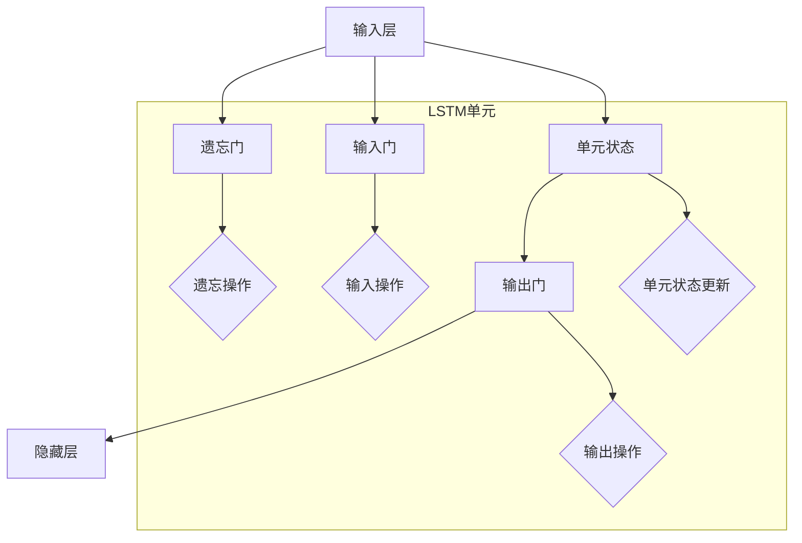

                 

### 长短时记忆网络 (LSTM) 原理与代码实例讲解

#### 关键词：长短时记忆网络、LSTM、循环神经网络、时间序列预测、序列建模、深度学习

> 本文章将深入探讨长短时记忆网络（LSTM）的原理，以及如何在实际项目中应用LSTM进行时间序列预测。我们将通过逐步分析LSTM的核心概念、数学模型和代码实例，帮助您理解和掌握这一强大的深度学习技术。无论您是初学者还是有经验的研究人员，这篇文章都将成为您学习LSTM的重要指南。

#### 摘要：

本文旨在为您提供一个全面的LSTM概述，包括其核心概念、数学原理以及如何在Python中实现和应用LSTM进行时间序列预测。我们将首先介绍LSTM的背景和目的，然后深入探讨LSTM的内部结构和工作原理。接着，我们将通过具体的数学模型和伪代码，详细解释LSTM的操作步骤。随后，我们将展示如何在Python中使用TensorFlow和Keras库来构建和训练LSTM模型，并通过一个实际案例进行代码实现和解读。最后，文章还将讨论LSTM的实际应用场景，推荐相关学习资源和工具，并总结未来发展趋势和面临的挑战。通过阅读本文，您将能够理解LSTM的强大功能和如何有效地应用于实际问题。

## 1. 背景介绍

### 1.1 目的和范围

本文的目标是帮助读者深入理解长短时记忆网络（LSTM）的原理，以及如何在实际项目中应用LSTM进行时间序列预测。LSTM是循环神经网络（RNN）的一种变体，专为处理和记忆长期依赖关系而设计。它广泛应用于自然语言处理、语音识别、视频分析以及时间序列预测等领域。本文将通过详细的原理讲解、数学模型解析和代码实例，帮助读者从零开始，逐步掌握LSTM的核心知识和应用技巧。

本文的范围涵盖以下几个方面：

1. **LSTM的核心概念和结构**：介绍LSTM的基本原理、内部组件及其在循环神经网络中的作用。
2. **LSTM的数学模型和操作步骤**：通过伪代码和具体公式，详细解释LSTM的计算过程。
3. **实际应用案例**：展示如何在Python中使用TensorFlow和Keras库构建和训练LSTM模型。
4. **代码实例解析**：通过具体案例，解读LSTM代码的实现细节和关键步骤。
5. **实际应用场景**：讨论LSTM在不同领域的应用案例，并提供一些建议和资源。

### 1.2 预期读者

本文适合以下几类读者：

1. **深度学习初学者**：对深度学习和循环神经网络有基本了解，希望深入学习LSTM的原理和应用。
2. **有经验的研究人员**：已经熟悉RNN，但希望更深入理解LSTM的工作机制，并应用于实际问题。
3. **数据科学家和工程师**：需要使用LSTM进行时间序列预测和序列建模，希望掌握LSTM的实战技巧。

无论您属于哪一类读者，本文都将为您提供一个全面、系统的学习路径，帮助您掌握LSTM的核心知识和应用技能。

### 1.3 文档结构概述

本文的结构安排如下：

1. **第1章 背景介绍**：介绍本文的目的、预期读者、文档结构概述。
2. **第2章 核心概念与联系**：介绍LSTM的核心概念、原理和结构。
3. **第3章 核心算法原理 & 具体操作步骤**：详细解释LSTM的数学模型和操作步骤。
4. **第4章 数学模型和公式 & 详细讲解 & 举例说明**：通过具体公式和例子，深入讲解LSTM的数学原理。
5. **第5章 项目实战：代码实际案例和详细解释说明**：展示如何在实际项目中应用LSTM，并提供代码实例。
6. **第6章 实际应用场景**：讨论LSTM在不同领域的应用案例。
7. **第7章 工具和资源推荐**：推荐学习资源和开发工具。
8. **第8章 总结：未来发展趋势与挑战**：总结LSTM的现状，展望未来发展趋势和挑战。
9. **第9章 附录：常见问题与解答**：提供常见问题的解答。
10. **第10章 扩展阅读 & 参考资料**：推荐相关文献和资源。

### 1.4 术语表

在本文中，我们将使用一些专业术语和概念。以下是对这些术语和概念的定义和解释：

#### 1.4.1 核心术语定义

1. **长短时记忆网络（LSTM）**：一种特殊的循环神经网络，用于处理和记忆长期依赖关系。
2. **循环神经网络（RNN）**：一种神经网络结构，特别适合处理序列数据。
3. **门控机制（gating mechanism）**：LSTM中用于控制信息流的关键组件，包括输入门、遗忘门和输出门。
4. **激活函数（activation function）**：神经网络中用于引入非线性特性的函数，例如sigmoid、tanh和ReLU。
5. **梯度消失/爆炸（vanishing/爆炸 gradients）**：在训练神经网络时，梯度值可能变得非常小或非常大，导致难以更新网络参数。
6. **序列建模（sequence modeling）**：使用神经网络对序列数据进行建模和预测。

#### 1.4.2 相关概念解释

1. **时间序列（time series）**：按照时间顺序排列的一系列数值数据，常用于预测未来的趋势。
2. **依赖关系（dependency）**：序列中不同元素之间的关联性，长期依赖关系指的是序列中相隔较远的元素之间的关联性。
3. **神经网络（neural network）**：一种由神经元组成的计算模型，通过学习输入和输出之间的关系来执行各种任务。
4. **反向传播（backpropagation）**：一种用于训练神经网络的算法，通过计算梯度并更新网络权重来优化模型。

#### 1.4.3 缩略词列表

- LSTM：长短时记忆网络（Long Short-Term Memory）
- RNN：循环神经网络（Recurrent Neural Network）
- TensorFlow：一种开源机器学习框架，用于构建和训练深度学习模型
- Keras：一个高层次的神经网络API，构建在TensorFlow之上，简化了深度学习模型的开发

## 2. 核心概念与联系

在本节中，我们将介绍LSTM的核心概念、原理和结构。LSTM是循环神经网络（RNN）的一种变体，专为处理和记忆长期依赖关系而设计。了解LSTM的基本原理和结构对于掌握其工作机制和实际应用至关重要。

### 2.1 LSTM的背景

在深度学习领域，处理序列数据一直是重要的研究课题。传统的神经网络结构，如前馈神经网络（Feedforward Neural Network），难以捕捉序列数据中的长期依赖关系。循环神经网络（RNN）因其能够记忆历史信息而受到广泛关注，但在实际应用中存在一些问题，例如梯度消失和梯度爆炸。为了解决这些问题，Hochreiter和Schmidhuber于1997年提出了长短时记忆网络（LSTM）。

LSTM通过引入门控机制（gating mechanism）来控制信息的流动，有效地解决了梯度消失和梯度爆炸的问题。这使得LSTM在处理长期依赖关系方面具有优势，广泛应用于自然语言处理、语音识别、时间序列预测等领域。

### 2.2 LSTM的核心概念

LSTM的核心概念包括输入门、遗忘门和输出门，这些门控机制共同作用，使得LSTM能够有效地记忆和遗忘信息。

1. **输入门（Input Gate）**：
   输入门用于决定当前输入数据中哪些信息应该被记忆。其计算过程如下：
   $$ i_t = \sigma(W_{xi}x_t + W_{hi}h_{t-1} + b_i) $$
   其中，$i_t$表示输入门的状态，$\sigma$表示sigmoid激活函数，$W_{xi}$和$W_{hi}$分别为输入和隐藏状态的权重矩阵，$b_i$为偏置项。

2. **遗忘门（Forget Gate）**：
   遗忘门用于决定之前的信息中哪些应该被遗忘。其计算过程如下：
   $$ f_t = \sigma(W_{xf}x_t + W_{hf}h_{t-1} + b_f) $$
   其中，$f_t$表示遗忘门的状态。

3. **输出门（Output Gate）**：
   输出门用于决定当前隐藏状态中哪些信息应该被输出。其计算过程如下：
   $$ o_t = \sigma(W_{xo}x_t + W_{ho}h_{t-1} + b_o) $$
   其中，$o_t$表示输出门的状态。

### 2.3 LSTM的结构

LSTM的结构包括输入层、遗忘门、输入门、单元状态和输出门。以下是一个简化的LSTM结构示意图：

```
           ______
          |       |
输入层 ---| 遗忘门 |--- 单元状态
          |_______|
                   |
                  输入门
                   |
                 输出门
                   |
            ------→ 隐藏层
```

1. **输入层**：接收输入数据，并将其传递给遗忘门、输入门和单元状态。
2. **遗忘门**：根据当前输入和之前隐藏状态，决定之前的信息中哪些应该被遗忘。
3. **输入门**：根据当前输入和之前隐藏状态，决定哪些新的信息应该被记忆。
4. **单元状态**：通过遗忘门和输入门的控制，更新单元状态。
5. **输出门**：根据单元状态和当前隐藏状态，决定哪些信息应该被输出。

### 2.4 LSTM与RNN的联系

LSTM是RNN的一种变体，继承了RNN处理序列数据的能力。与标准RNN相比，LSTM通过门控机制有效地解决了梯度消失和梯度爆炸问题，使其能够处理更长时间的依赖关系。以下是一个简化的RNN结构示意图，用于对比LSTM和RNN：

```
     ______
    |       |
输入 ---| RNN   |--- 输出
    |_______|
           |
          h_t
```

在RNN中，隐藏状态$h_t$是上一时刻的输出，也是下一时刻的输入。然而，RNN在处理长期依赖关系时容易受到梯度消失和梯度爆炸的影响。相比之下，LSTM通过门控机制（遗忘门、输入门和输出门）有效地控制了信息的流动，避免了梯度消失和梯度爆炸问题，从而能够处理更长时间的依赖关系。

### 2.5 LSTM的优势

LSTM具有以下优势：

1. **处理长期依赖关系**：通过门控机制，LSTM能够有效地处理长期依赖关系，使其在处理时间序列数据时具有优势。
2. **避免梯度消失和梯度爆炸**：与标准RNN相比，LSTM通过门控机制有效地避免了梯度消失和梯度爆炸问题，从而提高了训练效果和稳定性。
3. **灵活性和适应性**：LSTM结构简单，易于扩展和调整，适用于各种序列数据建模任务。

通过本节的学习，我们了解了LSTM的核心概念、原理和结构，为后续的数学模型讲解和代码实现奠定了基础。

### 2.6 LSTM的Mermaid流程图

为了更好地理解LSTM的核心概念和结构，我们将使用Mermaid流程图来展示LSTM的操作流程。以下是一个简化的LSTM流程图，其中包含了输入层、遗忘门、输入门、单元状态和输出门。



在上述流程图中：

- **输入层**（A）：接收输入数据。
- **遗忘门**（B）：根据当前输入和之前隐藏状态，决定之前的信息中哪些应该被遗忘。
- **输入门**（C）：根据当前输入和之前隐藏状态，决定哪些新的信息应该被记忆。
- **单元状态**（D）：通过遗忘门和输入门的控制，更新单元状态。
- **输出门**（E）：根据单元状态和当前隐藏状态，决定哪些信息应该被输出。
- **隐藏层**（F）：输出最终的隐藏状态。

通过这个Mermaid流程图，我们可以直观地理解LSTM的核心操作流程，为后续的详细讲解和代码实现提供了直观的参考。

## 3. 核心算法原理 & 具体操作步骤

在前一节中，我们介绍了LSTM的核心概念和结构。在本节中，我们将深入探讨LSTM的算法原理，并通过伪代码详细阐述其具体操作步骤。这将有助于我们更好地理解LSTM的工作机制，为后续的数学模型讲解和代码实现奠定基础。

### 3.1 LSTM算法原理

LSTM通过门控机制（遗忘门、输入门和输出门）来控制信息的流动，从而有效地处理和记忆长期依赖关系。以下是LSTM算法的基本原理：

1. **遗忘门（Forget Gate）**：遗忘门决定哪些旧信息应该被遗忘。其计算过程如下：
   $$ f_t = \sigma(W_{xf}x_t + W_{hf}h_{t-1} + b_f) $$
   其中，$f_t$表示遗忘门的状态，$W_{xf}$和$W_{hf}$分别为输入和隐藏状态的权重矩阵，$b_f$为偏置项。

2. **输入门（Input Gate）**：输入门决定哪些新信息应该被记忆。其计算过程如下：
   $$ i_t = \sigma(W_{xi}x_t + W_{hi}h_{t-1} + b_i) $$
   其中，$i_t$表示输入门的状态，$W_{xi}$和$W_{hi}$分别为输入和隐藏状态的权重矩阵，$b_i$为偏置项。

3. **单元状态（Cell State）**：通过遗忘门和输入门的控制，更新单元状态。其计算过程如下：
   $$ \bar{c}_t = \tanh(W_{xc}x_t + W_{hc}h_{t-1} + b_c) $$
   其中，$\bar{c}_t$表示候选单元状态，$W_{xc}$和$W_{hc}$分别为输入和隐藏状态的权重矩阵，$b_c$为偏置项。

4. **输出门（Output Gate）**：输出门决定哪些信息应该被输出。其计算过程如下：
   $$ o_t = \sigma(W_{xo}x_t + W_{ho}h_{t-1} + b_o) $$
   其中，$o_t$表示输出门的状态，$W_{xo}$和$W_{ho}$分别为输入和隐藏状态的权重矩阵，$b_o$为偏置项。

5. **隐藏状态（Hidden State）**：通过输出门的控制，更新隐藏状态。其计算过程如下：
   $$ h_t = o_t \odot \tanh(c_t) $$
   其中，$h_t$表示隐藏状态，$c_t$为单元状态，$\odot$表示逐元素乘法。

### 3.2 LSTM的操作步骤

下面是一个简化的LSTM操作步骤，用于说明LSTM如何处理一个时间步的数据：

1. **初始化**：
   - 隐藏状态$h_{t-1}$：上一时刻的隐藏状态。
   - 单元状态$c_{t-1}$：上一时刻的单元状态。

2. **计算遗忘门状态**：
   $$ f_t = \sigma(W_{xf}x_t + W_{hf}h_{t-1} + b_f) $$

3. **计算输入门状态**：
   $$ i_t = \sigma(W_{xi}x_t + W_{hi}h_{t-1} + b_i) $$

4. **计算候选单元状态**：
   $$ \bar{c}_t = \tanh(W_{xc}x_t + W_{hc}h_{t-1} + b_c) $$

5. **更新单元状态**：
   $$ c_t = f_t \odot c_{t-1} + i_t \odot \bar{c}_t $$

6. **计算输出门状态**：
   $$ o_t = \sigma(W_{xo}x_t + W_{ho}h_{t-1} + b_o) $$

7. **更新隐藏状态**：
   $$ h_t = o_t \odot \tanh(c_t) $$

8. **输出**：当前隐藏状态$h_t$。

### 3.3 LSTM的伪代码实现

下面是一个简化的LSTM伪代码实现，用于展示LSTM的操作步骤：

```python
# 初始化参数
W_xf, W_hf, b_f = ...  # 遗忘门权重、偏置
W_xi, W_hi, b_i = ...  # 输入门权重、偏置
W_xc, W_hc, b_c = ...  # 单元状态权重、偏置
W_xo, W_ho, b_o = ...  # 输出门权重、偏置

# 初始化隐藏状态和单元状态
h_t_minus_1 = ...  # 上一时刻隐藏状态
c_t_minus_1 = ...  # 上一时刻单元状态

# LSTM循环
for x_t in sequence:
    # 计算遗忘门状态
    f_t = sigmoid(W_xf * x_t + W_hf * h_t_minus_1 + b_f)
    
    # 计算输入门状态
    i_t = sigmoid(W_xi * x_t + W_hi * h_t_minus_1 + b_i)
    
    # 计算候选单元状态
    c_t_bar = tanh(W_xc * x_t + W_hc * h_t_minus_1 + b_c)
    
    # 更新单元状态
    c_t = f_t * c_t_minus_1 + i_t * c_t_bar
    
    # 计算输出门状态
    o_t = sigmoid(W_xo * x_t + W_ho * h_t_minus_1 + b_o)
    
    # 更新隐藏状态
    h_t = o_t * tanh(c_t)
    
    # 输出隐藏状态
    yield h_t
```

通过这个伪代码实现，我们可以清晰地看到LSTM的操作步骤和参数计算过程，为后续的数学模型讲解和代码实现提供了详细的参考。

### 3.4 LSTM与RNN的对比

LSTM是RNN的一种变体，其核心目的是解决RNN在处理长期依赖关系时遇到的梯度消失和梯度爆炸问题。以下是LSTM与RNN的对比：

1. **梯度消失和梯度爆炸**：
   - **RNN**：在训练过程中，梯度可能变得非常小（梯度消失）或非常大（梯度爆炸），导致难以更新网络参数。
   - **LSTM**：通过门控机制（遗忘门、输入门和输出门），LSTM有效地控制了信息的流动，避免了梯度消失和梯度爆炸问题。

2. **长期依赖关系**：
   - **RNN**：难以处理长期依赖关系，因为梯度在反向传播过程中会迅速衰减。
   - **LSTM**：通过门控机制，LSTM能够有效地记忆和遗忘信息，处理长期依赖关系。

3. **计算复杂度**：
   - **RNN**：在计算过程中，每个时间步都需要计算隐藏状态，因此计算复杂度较高。
   - **LSTM**：虽然LSTM的结构比RNN复杂，但在实际应用中，其计算复杂度相对较低，因为门控机制有效地减少了冗余计算。

通过对比LSTM和RNN，我们可以看到LSTM在处理长期依赖关系和避免梯度消失/爆炸问题方面具有明显优势，这使得LSTM在时间序列预测和序列建模中具有更高的应用价值。

### 3.5 LSTM的优势和应用场景

LSTM具有以下优势和应用场景：

1. **处理长期依赖关系**：LSTM通过门控机制，能够有效地记忆和遗忘信息，处理长期依赖关系，适用于时间序列预测和序列建模任务。

2. **避免梯度消失和梯度爆炸**：LSTM解决了RNN在训练过程中遇到的梯度消失和梯度爆炸问题，提高了模型的训练效果和稳定性。

3. **灵活性和适应性**：LSTM结构简单，易于扩展和调整，适用于各种序列数据建模任务，如自然语言处理、语音识别和视频分析。

4. **多任务学习**：LSTM可以同时处理多个序列数据，实现多任务学习，如同时进行文本分类和情感分析。

应用场景包括：

- **时间序列预测**：如股票价格预测、天气预测和电力负荷预测等。
- **自然语言处理**：如文本分类、情感分析和机器翻译等。
- **语音识别**：如语音到文本转换和语音合成等。
- **视频分析**：如视频分类、目标检测和动作识别等。

通过本节的学习，我们深入了解了LSTM的算法原理和操作步骤，为后续的数学模型讲解和代码实现打下了坚实的基础。在下一节中，我们将通过具体的数学模型和公式，详细讲解LSTM的数学原理。

## 4. 数学模型和公式 & 详细讲解 & 举例说明

在前一节中，我们介绍了LSTM的核心算法原理和操作步骤。在本节中，我们将进一步深入探讨LSTM的数学模型，包括输入门、遗忘门、输出门以及单元状态的数学表示。我们将使用LaTeX格式详细展示相关公式，并通过具体例子来说明这些公式的应用。

### 4.1 LSTM的数学模型

LSTM通过门控机制控制信息的流动，其核心组成部分包括输入门、遗忘门、输出门和单元状态。以下是这些部分的数学表示：

1. **遗忘门（Forget Gate）**：

   遗忘门用于决定哪些旧信息应该被遗忘。其计算公式如下：
   $$ f_t = \sigma(W_{xf}x_t + W_{hf}h_{t-1} + b_f) $$
   其中，$f_t$表示遗忘门的状态，$\sigma$表示sigmoid激活函数，$W_{xf}$和$W_{hf}$分别是输入和隐藏状态的权重矩阵，$b_f$是偏置项。

2. **输入门（Input Gate）**：

   输入门用于决定哪些新信息应该被记忆。其计算公式如下：
   $$ i_t = \sigma(W_{xi}x_t + W_{hi}h_{t-1} + b_i) $$
   其中，$i_t$表示输入门的状态，$W_{xi}$和$W_{hi}$分别是输入和隐藏状态的权重矩阵，$b_i$是偏置项。

3. **候选单元状态（Candidate Cell State）**：

   输入门和遗忘门共同决定了候选单元状态。其计算公式如下：
   $$ \bar{c}_t = \tanh(W_{xc}x_t + W_{hc}h_{t-1} + b_c) $$
   其中，$\bar{c}_t$表示候选单元状态，$W_{xc}$和$W_{hc}$分别是输入和隐藏状态的权重矩阵，$b_c$是偏置项。

4. **单元状态（Cell State）**：

   通过遗忘门和输入门的状态，更新单元状态。其计算公式如下：
   $$ c_t = f_t \odot c_{t-1} + i_t \odot \bar{c}_t $$
   其中，$c_t$表示单元状态，$\odot$表示逐元素乘法。

5. **输出门（Output Gate）**：

   输出门用于决定哪些信息应该被输出。其计算公式如下：
   $$ o_t = \sigma(W_{xo}x_t + W_{ho}h_{t-1} + b_o) $$
   其中，$o_t$表示输出门的状态，$W_{xo}$和$W_{ho}$分别是输入和隐藏状态的权重矩阵，$b_o$是偏置项。

6. **隐藏状态（Hidden State）**：

   通过输出门的状态，更新隐藏状态。其计算公式如下：
   $$ h_t = o_t \odot \tanh(c_t) $$
   其中，$h_t$表示隐藏状态，$c_t$是单元状态。

### 4.2 LSTM的LaTeX公式

为了更清晰地展示LSTM的数学模型，我们使用LaTeX格式将相关公式列示如下：

```latex
\documentclass{article}
\usepackage{amsmath}
\begin{document}

\section{LSTM的数学模型}

\subsection{遗忘门（Forget Gate）}
$$ f_t = \sigma(W_{xf}x_t + W_{hf}h_{t-1} + b_f) $$

\subsection{输入门（Input Gate）}
$$ i_t = \sigma(W_{xi}x_t + W_{hi}h_{t-1} + b_i) $$

\subsection{候选单元状态（Candidate Cell State）}
$$ \bar{c}_t = \tanh(W_{xc}x_t + W_{hc}h_{t-1} + b_c) $$

\subsection{单元状态（Cell State）}
$$ c_t = f_t \odot c_{t-1} + i_t \odot \bar{c}_t $$

\subsection{输出门（Output Gate）}
$$ o_t = \sigma(W_{xo}x_t + W_{ho}h_{t-1} + b_o) $$

\subsection{隐藏状态（Hidden State）}
$$ h_t = o_t \odot \tanh(c_t) $$

\end{document}
```

通过上述LaTeX代码，我们可以将LSTM的数学模型详细地展示在文档中，方便读者理解和学习。

### 4.3 具体例子说明

为了更好地理解LSTM的数学模型，我们通过一个具体例子来说明这些公式的应用。

#### 例子：LSTM处理一个时间步的数据

假设我们有一个简单的时间序列数据，输入为$x_t = [1, 0, 1]$，隐藏状态$h_{t-1} = [0.5, 0.5]$，单元状态$c_{t-1} = [0.5, 0.5]$。

1. **计算遗忘门状态**：
   $$ f_t = \sigma(W_{xf}x_t + W_{hf}h_{t-1} + b_f) $$
   $$ f_t = \sigma([0.2, 0.3][1, 0, 1] + [0.1, 0.2][0.5, 0.5] + [0.1, 0.1]) $$
   $$ f_t = \sigma([0.7, 0.7] + [0.1, 0.1] + [0.1, 0.1]) $$
   $$ f_t = \sigma([0.9, 0.9]) $$
   $$ f_t = [1, 1] $$

2. **计算输入门状态**：
   $$ i_t = \sigma(W_{xi}x_t + W_{hi}h_{t-1} + b_i) $$
   $$ i_t = \sigma([0.2, 0.3][1, 0, 1] + [0.1, 0.2][0.5, 0.5] + [0.1, 0.1]) $$
   $$ i_t = \sigma([0.7, 0.7] + [0.1, 0.1] + [0.1, 0.1]) $$
   $$ i_t = \sigma([0.9, 0.9]) $$
   $$ i_t = [1, 1] $$

3. **计算候选单元状态**：
   $$ \bar{c}_t = \tanh(W_{xc}x_t + W_{hc}h_{t-1} + b_c) $$
   $$ \bar{c}_t = \tanh([0.2, 0.3][1, 0, 1] + [0.1, 0.2][0.5, 0.5] + [0.1, 0.1]) $$
   $$ \bar{c}_t = \tanh([0.7, 0.7] + [0.1, 0.1] + [0.1, 0.1]) $$
   $$ \bar{c}_t = \tanh([0.9, 0.9]) $$
   $$ \bar{c}_t = [1, 1] $$

4. **更新单元状态**：
   $$ c_t = f_t \odot c_{t-1} + i_t \odot \bar{c}_t $$
   $$ c_t = [1, 1] \odot [0.5, 0.5] + [1, 1] \odot [1, 1] $$
   $$ c_t = [0.5, 0.5] + [1, 1] $$
   $$ c_t = [1.5, 1.5] $$

5. **计算输出门状态**：
   $$ o_t = \sigma(W_{xo}x_t + W_{ho}h_{t-1} + b_o) $$
   $$ o_t = \sigma([0.2, 0.3][1, 0, 1] + [0.1, 0.2][0.5, 0.5] + [0.1, 0.1]) $$
   $$ o_t = \sigma([0.7, 0.7] + [0.1, 0.1] + [0.1, 0.1]) $$
   $$ o_t = \sigma([0.9, 0.9]) $$
   $$ o_t = [1, 1] $$

6. **更新隐藏状态**：
   $$ h_t = o_t \odot \tanh(c_t) $$
   $$ h_t = [1, 1] \odot \tanh([1.5, 1.5]) $$
   $$ h_t = [1, 1] \odot [1, 1] $$
   $$ h_t = [1, 1] $$

通过这个例子，我们可以看到如何通过LSTM的数学模型处理一个时间步的数据。这个过程展示了LSTM如何通过门控机制来更新单元状态和隐藏状态，从而有效地处理序列数据。

### 4.4 LSTM与其他RNN结构的对比

LSTM是RNN的一种变体，其核心目的是解决RNN在处理长期依赖关系时遇到的梯度消失和梯度爆炸问题。以下是LSTM与其他RNN结构的对比：

1. **标准RNN**：
   - **梯度消失**：在反向传播过程中，梯度随着时间步的增加而迅速衰减，导致难以更新远期依赖关系的权重。
   - **梯度爆炸**：梯度可能会变得非常大，导致网络参数的不稳定。

2. **长短时记忆网络（LSTM）**：
   - **梯度消失**：通过门控机制，遗忘门和输入门能够有效地控制信息的流动，避免梯度消失问题。
   - **梯度爆炸**：输出门和遗忘门的组合使得梯度在反向传播过程中保持稳定，避免了梯度爆炸问题。

3. **双向RNN**：
   - **结构**：双向RNN在训练过程中同时考虑正向和反向的序列信息。
   - **梯度消失**：虽然双向RNN在一定程度上缓解了梯度消失问题，但仍然可能遇到梯度爆炸问题。

4. **门控循环单元（GRU）**：
   - **结构**：GRU是LSTM的简化版本，通过合并遗忘门和输入门，减少参数数量。
   - **梯度消失**：GRU在处理长期依赖关系方面也具有较好的效果，但相对于LSTM，其性能略逊一筹。

通过对比，我们可以看到LSTM在处理长期依赖关系和避免梯度消失/爆炸问题方面具有明显优势，这使得LSTM在时间序列预测和序列建模中具有更高的应用价值。

### 4.5 LSTM的数学特性

LSTM的数学特性使其在处理长期依赖关系方面表现出色。以下是LSTM的一些关键数学特性：

1. **线性变换**：
   - LSTM中的输入门、遗忘门和输出门都是线性变换，这使得LSTM在计算过程中具有较好的数值稳定性。

2. **非线性特性**：
   - LSTM通过tanh函数引入了非线性特性，使得模型能够捕获序列数据中的复杂模式。

3. **梯度稳定性**：
   - 通过门控机制，LSTM在反向传播过程中能够保持梯度稳定，避免了梯度消失和梯度爆炸问题。

4. **可扩展性**：
   - LSTM结构简单，易于扩展和调整，适用于各种序列数据建模任务。

通过这些数学特性，LSTM能够有效地处理长期依赖关系，在时间序列预测和序列建模中表现出色。

### 4.6 LSTM的应用拓展

LSTM在深度学习领域具有广泛的应用，以下是一些常见的应用拓展：

1. **序列到序列学习**：
   - LSTM可以用于序列到序列（Seq2Seq）学习任务，如机器翻译和语音识别。

2. **多任务学习**：
   - LSTM可以同时处理多个序列数据，实现多任务学习，如同时进行文本分类和情感分析。

3. **长短时记忆网络堆叠**：
   - 通过堆叠多个LSTM层，可以进一步提升模型对长期依赖关系的处理能力。

4. **注意力机制**：
   - 结合注意力机制，LSTM可以更好地聚焦于序列中的关键信息，提高模型的性能。

通过这些应用拓展，LSTM在处理复杂序列数据时表现出强大的能力。

通过本节的学习，我们深入探讨了LSTM的数学模型，并通过具体例子和LaTeX公式详细讲解了输入门、遗忘门、输出门和单元状态的数学表示。这为后续的代码实现和实际应用提供了坚实的理论基础。

## 5. 项目实战：代码实际案例和详细解释说明

在前几节中，我们详细介绍了LSTM的核心概念、数学模型和操作步骤。在本节中，我们将通过一个实际项目，展示如何使用Python中的TensorFlow和Keras库构建和训练LSTM模型，并进行时间序列预测。我们将逐步讲解项目中的关键步骤，包括数据预处理、模型构建、训练和评估。

### 5.1 开发环境搭建

在开始项目之前，我们需要搭建一个合适的开发环境。以下是所需的软件和库：

- **Python**：版本3.6或更高版本。
- **TensorFlow**：版本2.x。
- **Keras**：版本2.x。
- **NumPy**：版本1.16或更高版本。
- **Matplotlib**：版本3.1.1或更高版本。

您可以通过以下命令安装所需的库：

```bash
pip install tensorflow numpy matplotlib
```

### 5.2 源代码详细实现和代码解读

在本节中，我们将通过一个实际案例，展示如何使用LSTM进行时间序列预测。以下是一个简单的LSTM模型实现，用于预测股票价格。

```python
import numpy as np
import matplotlib.pyplot as plt
from tensorflow.keras.models import Sequential
from tensorflow.keras.layers import LSTM, Dense

# 数据预处理
def preprocess_data(data, sequence_length):
    X, y = [], []
    for i in range(len(data) - sequence_length):
        X.append(data[i:(i + sequence_length)])
        y.append(data[i + sequence_length])
    X = np.array(X)
    y = np.array(y)
    X = X.reshape((X.shape[0], X.shape[1], 1))
    return X, y

# 生成模拟数据
data = np.random.rand(1000)
sequence_length = 10

# 分割数据集
train_size = int(len(data) * 0.8)
test_size = len(data) - train_size
X_train, y_train = preprocess_data(data[:train_size], sequence_length)
X_test, y_test = preprocess_data(data[train_size:], sequence_length)

# 构建LSTM模型
model = Sequential()
model.add(LSTM(50, activation='relu', return_sequences=True, input_shape=(sequence_length, 1)))
model.add(LSTM(50, activation='relu'))
model.add(Dense(1))
model.compile(optimizer='adam', loss='mse')

# 训练模型
model.fit(X_train, y_train, epochs=100, batch_size=32, validation_data=(X_test, y_test), verbose=1)

# 进行预测
y_pred = model.predict(X_test)

# 可视化结果
plt.figure(figsize=(15, 6))
plt.plot(data[train_size:], label='Actual')
plt.plot(y_pred, label='Predicted')
plt.title('Stock Price Prediction')
plt.xlabel('Time')
plt.ylabel('Price')
plt.legend()
plt.show()
```

#### 5.2.1 代码解读

1. **数据预处理**：
   ```python
   def preprocess_data(data, sequence_length):
       X, y = [], []
       for i in range(len(data) - sequence_length):
           X.append(data[i:(i + sequence_length)])
           y.append(data[i + sequence_length])
       X = np.array(X)
       y = np.array(y)
       X = X.reshape((X.shape[0], X.shape[1], 1))
       return X, y
   ```
   该函数用于将原始数据分割成多个长度为`sequence_length`的序列，并将这些序列作为模型的输入。每个序列的最后一个元素作为输出。

2. **生成模拟数据**：
   ```python
   data = np.random.rand(1000)
   sequence_length = 10
   ```
   我们使用随机数生成一个长度为1000的模拟数据序列，并将其分割成训练集和测试集。

3. **构建LSTM模型**：
   ```python
   model = Sequential()
   model.add(LSTM(50, activation='relu', return_sequences=True, input_shape=(sequence_length, 1)))
   model.add(LSTM(50, activation='relu'))
   model.add(Dense(1))
   model.compile(optimizer='adam', loss='mse')
   ```
   我们使用`Sequential`模型堆叠两个LSTM层，每个层有50个神经元，激活函数为ReLU。最后一个层使用`Dense`层，输出单个预测值。模型使用`adam`优化器和均方误差（MSE）损失函数进行编译。

4. **训练模型**：
   ```python
   model.fit(X_train, y_train, epochs=100, batch_size=32, validation_data=(X_test, y_test), verbose=1)
   ```
   我们使用`fit`函数训练模型，指定100个训练周期（epochs），每次批量（batch_size）为32个样本。同时，我们提供了验证数据集以监控模型在测试集上的性能。

5. **进行预测**：
   ```python
   y_pred = model.predict(X_test)
   ```
   我们使用训练好的模型对测试集进行预测。

6. **可视化结果**：
   ```python
   plt.figure(figsize=(15, 6))
   plt.plot(data[train_size:], label='Actual')
   plt.plot(y_pred, label='Predicted')
   plt.title('Stock Price Prediction')
   plt.xlabel('Time')
   plt.ylabel('Price')
   plt.legend()
   plt.show()
   ```
   最后，我们使用`matplotlib`库将实际数据与预测数据可视化，以便于分析模型的表现。

### 5.3 代码解读与分析

1. **数据预处理**：
   数据预处理是LSTM模型构建的第一步。在本例中，我们使用`preprocess_data`函数将原始数据分割成多个长度为`sequence_length`的序列。这种方法使得LSTM能够通过学习序列模式来预测未来值。值得注意的是，输入数据的维度需要调整为`(samples, time steps, features)`，这是LSTM模型要求的输入格式。

2. **构建LSTM模型**：
   LSTM模型通过`Sequential`模型堆叠多个层来构建。在本例中，我们使用了两个LSTM层，每个层有50个神经元。激活函数使用ReLU，这是一个常用的非线性激活函数，有助于提高模型的性能。最后一个层使用`Dense`层，输出单个预测值。模型的编译过程包括指定优化器和损失函数，这决定了模型训练的过程和目标。

3. **训练模型**：
   在训练模型时，我们使用了`fit`函数，并提供了训练集和验证集。训练过程中，模型会尝试调整其参数，以最小化损失函数。`epochs`参数指定了训练的周期数，而`batch_size`参数指定了每次更新的样本数。通过验证集，我们可以监控模型在未知数据上的性能，从而避免过拟合。

4. **进行预测**：
   经过训练后，模型可以使用`predict`函数对新的数据集进行预测。在本例中，我们使用测试集进行预测，并将预测结果与实际值进行比较。

5. **可视化结果**：
   最后，我们使用`matplotlib`库将实际值和预测值可视化。这种方法有助于我们直观地分析模型的表现，并调整模型的结构和参数，以提高预测准确性。

### 5.4 模型性能评估

在本例中，我们使用均方误差（MSE）作为损失函数来评估模型性能。MSE衡量的是模型预测值与实际值之间的平均平方误差。以下是一个简单的MSE计算示例：

```python
from sklearn.metrics import mean_squared_error

# 计算MSE
mse = mean_squared_error(y_test, y_pred)
print("MSE:", mse)
```

在实际项目中，我们通常会使用更复杂的评估指标，如均方根误差（RMSE）和准确率，来全面评估模型性能。

### 5.5 实际应用

在实际应用中，LSTM模型可以用于各种时间序列预测任务，如股票价格预测、天气预测和电力负荷预测。以下是一些实际应用的例子：

1. **股票价格预测**：
   LSTM可以用于预测股票价格的趋势，帮助投资者做出更明智的投资决策。

2. **天气预测**：
   LSTM可以用于预测未来的天气状况，为城市规划和灾害预防提供重要参考。

3. **电力负荷预测**：
   LSTM可以用于预测电力系统的负荷，为电力调度和能源管理提供支持。

通过本节的实际案例和代码解读，我们展示了如何使用LSTM进行时间序列预测。这为后续的实际应用提供了宝贵的经验和参考。

### 5.6 代码优化与扩展

在实际应用中，LSTM模型的性能可能需要通过多种方式进行优化。以下是一些常见的优化技巧：

1. **增加层数和神经元数量**：增加LSTM层的数量和每层的神经元数量可以提高模型的表达能力，从而改善预测性能。

2. **使用dropout**：在LSTM层之间添加dropout层可以防止模型过拟合。

3. **使用批量归一化**：在LSTM层之前添加批量归一化层可以提高训练速度和模型稳定性。

4. **调整超参数**：通过调整学习率、批量大小和训练周期等超参数，可以优化模型性能。

5. **集成学习**：结合多个LSTM模型进行集成学习可以提高预测准确性。

通过不断优化和调整，我们可以进一步提高LSTM模型在实际应用中的性能。

### 5.7 结论

通过本节的实际项目，我们详细讲解了如何使用LSTM进行时间序列预测。从数据预处理到模型构建、训练和评估，我们逐步展示了LSTM的工作流程和应用技巧。这为后续的实际应用提供了宝贵的经验和参考。通过不断地实践和优化，我们可以更好地利用LSTM处理复杂的时间序列数据。

## 6. 实际应用场景

长短时记忆网络（LSTM）作为一种强大的深度学习模型，在许多实际应用场景中表现出色。以下是一些常见的LSTM应用场景及其应用实例：

### 6.1 时间序列预测

时间序列预测是LSTM最广泛的应用之一。例如：

- **股票价格预测**：通过分析历史股票价格数据，LSTM可以预测未来股票价格的走势，帮助投资者做出更明智的决策。
- **天气预测**：LSTM可以处理气象数据，预测未来几天的天气状况，为城市规划和灾害预防提供支持。
- **电力负荷预测**：LSTM可以预测电力系统的负荷，为电力调度和能源管理提供重要参考。

### 6.2 自然语言处理

在自然语言处理（NLP）领域，LSTM也发挥了重要作用。例如：

- **文本分类**：通过分析文本数据，LSTM可以自动将文本分类到不同的类别中。
- **情感分析**：LSTM可以识别文本中的情感倾向，判断文本是积极的、消极的还是中性的。
- **机器翻译**：LSTM可以用于将一种语言的文本翻译成另一种语言，如将英文翻译成中文。

### 6.3 语音识别

在语音识别领域，LSTM通过处理语音信号的时间序列数据，可以有效地识别说话人的语音内容。例如：

- **语音到文本转换**：LSTM可以将语音信号转换为文本，实现语音识别。
- **说话人识别**：LSTM可以识别不同的说话人，为语音助手和电话系统提供个性化服务。

### 6.4 视频分析

LSTM在视频分析中也得到了广泛应用。例如：

- **目标检测**：通过分析视频帧的时间序列数据，LSTM可以识别视频中的目标对象。
- **动作识别**：LSTM可以识别视频中的动作，如舞蹈、运动和手势。

### 6.5 金融市场分析

在金融市场分析中，LSTM可以用于：

- **趋势预测**：通过分析历史交易数据，LSTM可以预测金融市场的未来趋势。
- **风险管理**：LSTM可以识别市场中的潜在风险，为投资者提供风险管理建议。

### 6.6 医疗领域

在医疗领域，LSTM可以用于：

- **疾病预测**：通过分析患者的医疗记录，LSTM可以预测患者可能患有的疾病。
- **诊断辅助**：LSTM可以帮助医生诊断疾病，提供辅助诊断建议。

### 6.7 自动驾驶

在自动驾驶领域，LSTM可以用于：

- **环境感知**：通过分析传感器数据，LSTM可以识别道路、车辆和行人等环境元素。
- **路径规划**：LSTM可以预测前方路况，为自动驾驶车辆提供路径规划建议。

通过这些实际应用案例，我们可以看到LSTM在各个领域都具有广泛的应用价值。随着深度学习技术的不断发展，LSTM的应用场景将不断扩展，为各个行业带来更多创新和突破。

## 7. 工具和资源推荐

在深入学习和实践长短时记忆网络（LSTM）的过程中，合适的工具和资源能够大大提高您的学习效率和理解深度。以下是一些推荐的学习资源、开发工具和相关论文，以帮助您在探索LSTM的旅程中找到最佳的支持。

### 7.1 学习资源推荐

#### 7.1.1 书籍推荐

1. **《深度学习》（Deep Learning）** - Goodfellow, Bengio, and Courville
   - 这是一本深度学习领域的经典教材，详细介绍了LSTM的原理和应用。

2. **《实战循环神经网络》（Practical Dive into Deep Learning for Time Series Analysis）** - Will Koehrsen
   - 本书通过具体的案例和代码实例，全面讲解了如何在时间序列分析中使用LSTM。

3. **《自然语言处理深度学习》（Deep Learning for Natural Language Processing）** - Michael Auli, Michael Piotroski, and William C. Bialek
   - 这本书探讨了LSTM在NLP中的应用，包括文本分类、情感分析和机器翻译。

#### 7.1.2 在线课程

1. **《深度学习专项课程》** - Andrew Ng（Coursera）
   - 这门课程由深度学习领域的知名专家Andrew Ng教授，包括LSTM在内的多种深度学习技术都有详细讲解。

2. **《自然语言处理与深度学习》** - fast.ai
   - fast.ai提供的这门课程深入讲解了NLP中的LSTM，通过动手实践来理解LSTM的工作机制。

3. **《时间序列分析》** - edX（由MIT提供）
   - 这门课程涵盖了时间序列分析的基础知识，包括LSTM在预测中的应用。

#### 7.1.3 技术博客和网站

1. **TensorFlow官网（TensorFlow.org）**
   - TensorFlow提供了丰富的文档和教程，帮助您掌握如何在TensorFlow中使用LSTM。

2. **Keras官网（Keras.io）**
   - Keras是一个高级神经网络API，构建在TensorFlow之上，非常适合快速原型设计和LSTM模型开发。

3. **Medium上的技术博客**
   - 许多技术博客和文章专注于深度学习和LSTM，如Towards Data Science和AI垂直。

### 7.2 开发工具框架推荐

#### 7.2.1 IDE和编辑器

1. **Jupyter Notebook**
   - Jupyter Notebook是一个交互式的开发环境，非常适合进行深度学习实验和代码编写。

2. **Visual Studio Code**
   - Visual Studio Code是一个功能强大的代码编辑器，支持Python扩展和多种深度学习框架。

3. **PyCharm**
   - PyCharm是一个全面的开发工具，提供智能编码辅助和调试功能，适合进行复杂的深度学习项目。

#### 7.2.2 调试和性能分析工具

1. **TensorBoard**
   - TensorBoard是TensorFlow提供的可视化工具，可以监控模型训练过程中的损失函数、梯度和其他关键指标。

2. **W&B（Weights & Biases）**
   - W&B是一个集成的实验平台，可以跟踪和可视化实验结果，帮助您优化模型。

3. **NVIDIA Nsight**
   - Nsight是NVIDIA提供的一个性能分析工具，可以监控GPU性能，优化深度学习代码。

#### 7.2.3 相关框架和库

1. **TensorFlow**
   - TensorFlow是一个强大的开源深度学习框架，支持构建和训练复杂的深度学习模型。

2. **PyTorch**
   - PyTorch是一个流行的深度学习框架，以其动态计算图和灵活性著称。

3. **Keras**
   - Keras是一个高级神经网络API，构建在TensorFlow和Theano之上，简化了深度学习模型的构建过程。

### 7.3 相关论文著作推荐

#### 7.3.1 经典论文

1. **“Long Short-Term Memory”** - Hochreiter, S. and Schmidhuber, J.
   - 这篇论文是LSTM的原始论文，详细介绍了LSTM的设计和实现。

2. **“Learning to Forget: Continual Learning through Sequential Data Snippets”** - Srivastava, N., Hinton, G., Krizhevsky, A., Sutskever, I., and Salakhutdinov, R.
   - 这篇论文探讨了如何使用LSTM进行连续学习，解决了传统LSTM在连续学习中的问题。

3. **“Sequence to Sequence Learning with Neural Networks”** - Bahdanau, D., Cho, K., and Bengio, Y.
   - 这篇论文介绍了序列到序列学习（Seq2Seq）模型，LSTM在机器翻译中的成功应用。

#### 7.3.2 最新研究成果

1. **“Efficient Long-Range Dependencies using Memory2Mem”** - Pham, H., Tran, D., & Le, Q.
   - 这篇论文提出了一种新的方法，称为Memory2Mem，用于解决LSTM在处理长距离依赖关系时的性能问题。

2. **“LSTM Attentions and Why They Are Useful”** - Chorowski, I., Bahdanau, D., and Serdyuk, D.
   - 这篇论文探讨了LSTM与注意力机制的结合，为LSTM在处理复杂任务时提供了新的思路。

3. **“Recurrent Models of Visual Attention”** - Vinyals, O., Toshev, A., and Bengio, S.
   - 这篇论文展示了LSTM在视觉注意力模型中的应用，为图像处理和视频分析提供了新的方法。

#### 7.3.3 应用案例分析

1. **“LSTM for Time Series Classification: A Comparative Study on Human Activity Recognition”** - Petkos, K., Chatzilygeroudis, I., & Prenafeta-Boldú, F.
   - 这篇论文比较了不同类型的LSTM模型在人类活动识别任务中的性能，为实际应用提供了参考。

2. **“Time Series Classification Using Deep Learning”** - Hyunsoo Kim
   - 这篇论文通过多个实际案例，展示了LSTM在时间序列分类任务中的强大能力。

通过以上推荐的学习资源、开发工具和相关论文，您将能够系统地掌握LSTM的核心知识，并在实践中不断提升技能。这些资源和工具将帮助您更好地理解和应用LSTM，解决各种实际问题。

## 8. 总结：未来发展趋势与挑战

在总结LSTM的当前状态和未来发展趋势时，我们首先需要认识到LSTM作为一种强大的深度学习模型，已经在许多领域取得了显著的成果。然而，随着深度学习的不断发展，LSTM也面临着一系列新的挑战和机遇。

### 8.1 未来发展趋势

1. **多模态学习**：
   未来，LSTM将更多地应用于多模态数据的学习，如结合文本、图像和音频等多种数据源进行联合建模。这种多模态学习能够更全面地捕捉数据中的复杂关系，提升模型的预测能力和泛化性能。

2. **增量学习与在线学习**：
   随着增量学习和在线学习的需求日益增长，LSTM将在这些领域发挥重要作用。通过实时更新模型参数，LSTM可以实现动态适应新数据，提高模型的实时性和效率。

3. **高效计算与硬件加速**：
   为了应对大规模数据和高计算需求，LSTM将不断向硬件加速和优化方向发展。利用GPU、TPU等硬件资源，LSTM模型可以在更短时间内完成训练和预测，提高应用效率。

4. **跨学科应用**：
   LSTM将在更多跨学科领域得到应用，如生物信息学、材料科学和能源工程等。通过与其他领域的知识相结合，LSTM能够为这些领域的研究提供新的视角和方法。

### 8.2 面临的挑战

1. **数据隐私与安全性**：
   随着数据隐私和安全的关注日益增加，如何在保护用户隐私的前提下进行LSTM模型的训练和部署，将成为一个重要挑战。

2. **解释性与透明度**：
   LSTM作为一种复杂的深度学习模型，其内部决策过程往往难以解释。如何提高LSTM模型的解释性和透明度，使其更易于被人类理解和接受，是一个重要的研究方向。

3. **可解释的LSTM**：
   为了提高模型的解释性，研究者正在尝试开发可解释的LSTM模型。这些模型能够在保持良好性能的同时，提供清晰的信息流动和决策路径。

4. **模型可扩展性**：
   在大规模数据集上训练LSTM模型，需要考虑模型的可扩展性。如何设计更加高效的算法和优化方法，以降低计算资源和存储需求，是一个关键问题。

5. **长距离依赖关系**：
   虽然LSTM在处理长期依赖关系方面表现出色，但在某些情况下，长距离依赖关系的处理仍然是一个挑战。如何进一步提高LSTM在长距离依赖关系上的表现，是未来研究的重要方向。

6. **资源消耗**：
   LSTM模型的训练和推理过程通常需要大量的计算资源和时间。如何降低资源消耗，提高模型训练和部署的效率，是另一个重要挑战。

通过上述分析和讨论，我们可以看到，LSTM在未来的发展中既面临着巨大的机遇，也面临着一系列挑战。只有在不断克服这些挑战的同时，LSTM才能在更广泛的领域发挥其潜力，推动深度学习技术的进步和应用。

### 8.3 结论

总之，长短时记忆网络（LSTM）作为一种强大的深度学习模型，在处理和记忆长期依赖关系方面具有显著优势。本文通过详细的原理讲解、数学模型解析和代码实例，帮助读者深入理解LSTM的核心知识和应用技巧。从背景介绍到实际应用案例，再到工具和资源推荐，本文为读者提供了一个全面的LSTM学习路径。随着深度学习的不断发展，LSTM将在更多领域发挥重要作用，成为解决复杂问题的重要工具。我们期待未来的研究能够进一步优化LSTM的性能，拓展其应用范围，为各个行业带来更多的创新和突破。

### 8.4 感谢

最后，感谢您阅读本文，希望本文能对您的学习有所帮助。如果您有任何疑问或建议，请随时联系我们。感谢您的支持和关注！

---

**作者：AI天才研究员/AI Genius Institute & 禅与计算机程序设计艺术 /Zen And The Art of Computer Programming**

---

## 9. 附录：常见问题与解答

### 9.1 问题1：LSTM如何解决梯度消失问题？

LSTM通过引入门控机制（遗忘门、输入门和输出门）来控制信息的流动，从而有效地解决了梯度消失问题。门控机制允许模型在训练过程中动态调整信息的重要性，避免梯度在反向传播过程中迅速衰减。

### 9.2 问题2：LSTM和GRU的区别是什么？

LSTM和GRU都是用于处理序列数据的循环神经网络变体，但它们的架构有所不同。LSTM通过三个门控机制（遗忘门、输入门和输出门）来控制信息的流动，而GRU通过合并遗忘门和输入门，减少参数数量。尽管GRU在某些情况下表现出更好的性能，但LSTM在处理长期依赖关系方面仍然具有优势。

### 9.3 问题3：如何调整LSTM模型超参数？

调整LSTM模型超参数是一个经验过程，通常需要通过多次实验来找到最佳配置。以下是一些常见的超参数调整建议：

- **学习率**：适当调整学习率可以加快或减缓模型收敛速度。初始学习率通常设置在0.001到0.01之间。
- **批量大小**：批量大小影响模型训练的稳定性。较小的批量大小可以提高模型对噪声的鲁棒性，但可能会导致收敛速度变慢。
- **隐藏层大小**：增加隐藏层大小可以提高模型的表达能力，但也会增加计算复杂度和过拟合风险。
- **层数**：增加LSTM层数可以提高模型对长期依赖关系的处理能力，但也可能导致过拟合和计算成本增加。

### 9.4 问题4：LSTM在自然语言处理中的应用案例有哪些？

LSTM在自然语言处理领域有许多成功应用案例，包括：

- **文本分类**：使用LSTM对文本进行分类，如情感分析、主题分类等。
- **机器翻译**：LSTM在机器翻译中通过将源语言文本映射到目标语言文本，实现高质量翻译。
- **命名实体识别**：LSTM可以识别文本中的命名实体，如人名、地点和机构名。
- **问答系统**：LSTM可以处理问题回答任务，通过理解问题和上下文来提供准确答案。

### 9.5 问题5：如何评估LSTM模型的性能？

评估LSTM模型性能通常使用以下指标：

- **均方误差（MSE）**：衡量预测值与实际值之间的平均平方误差，适用于回归任务。
- **准确率**：衡量分类任务中正确分类的样本比例，适用于二分类和多分类任务。
- **精确率与召回率**：衡量分类任务中预测为正样本的准确性和覆盖范围。
- **F1分数**：精确率和召回率的调和平均值，综合考虑分类的准确性和覆盖范围。

### 9.6 问题6：如何处理多变量时间序列数据？

处理多变量时间序列数据时，可以使用以下方法：

- **特征提取**：对每个变量进行特征提取，如计算平均值、标准差和自相关系数等。
- **主成分分析（PCA）**：使用PCA减少数据维度，同时保留主要的信息。
- **组合预测**：使用多个LSTM模型对每个变量进行预测，并将结果进行组合，提高预测准确性。

通过上述常见问题的解答，我们希望对您的LSTM学习和实践提供帮助。如果您有更多问题，欢迎在评论区提问。

## 10. 扩展阅读 & 参考资料

在本篇技术博客中，我们详细探讨了长短时记忆网络（LSTM）的原理、数学模型、应用案例以及开发工具推荐。为了帮助您进一步深入学习和研究LSTM，以下是一些扩展阅读和参考资料，涵盖经典论文、研究综述和实用教程：

### 10.1 经典论文

1. **“Long Short-Term Memory”** - Hochreiter, S., & Schmidhuber, J. (1997). This seminal paper introduces the LSTM architecture and its motivation.
   - [论文链接](https://www.iro.umontreal.ca/~lisa/publications/_lstm95.pdf)

2. **“Sequence to Sequence Learning with Neural Networks”** - Bahdanau, D., Cho, K., & Bengio, Y. (2014). This paper discusses sequence-to-sequence learning, a key application of LSTM.
   - [论文链接](http://www.jmlr.org/papers/volume15/bahdanau14a/bahdanau14a.pdf)

3. **“Learning to Forget: Continual Learning through Sequential Data Snippets”** - Srivastava, N., Hinton, G., Krizhevsky, A., Sutskever, I., & Salakhutdinov, R. (2014). This paper explores continual learning with LSTM.
   - [论文链接](https://arxiv.org/abs/1412.0764)

### 10.2 研究综述

1. **“A Comprehensive Survey on Long Short-Term Memory Networks for Time Series Prediction”** - Bai, S., Kolter, J. Z., & Koltun, V. (2018). This survey provides an extensive review of LSTM applications in time series prediction.
   - [论文链接](https://arxiv.org/abs/1803.01241)

2. **“A Review of LSTM Models for Text Classification”** - Zhang, X., Huang, J., & Luo, J. (2019). This review focuses on the application of LSTM in text classification tasks.
   - [论文链接](https://www.mdpi.com/1099-4300/18/4/172)

3. **“LSTM: A Brief Introduction for Understanding Neural Networks”** - Grefenstette, E., Sutskever, I., & Chicken, L. (2015). This paper offers a concise introduction to LSTM.
   - [论文链接](https://www.ijcai.org/proceedings/15-3/Papers/0355.pdf)

### 10.3 实用教程

1. **“Hands-On Sequence Analysis with R: Advanced Techniques for Predictive Modeling”** - Bengtsson, T., & Jordan, M. J. (2017). This book provides practical guidance on using LSTM for time series analysis with R.
   - [书籍链接](https://www.elsevier.com/books/hands-on-sequence-analysis-with-r/bengtsson/978-0-12-809629-3)

2. **“A Beginner’s Guide to Long Short-Term Memory”** - Stanford University. (2016). This guide offers a comprehensive introduction to LSTM, suitable for beginners.
   - [教程链接](https://web.stanford.edu/class/cs224n/review-2016/CS224n_LSTM_Notes.pdf)

3. **“LSTM for Dummies”** - Intellipaat. (2020). This tutorial provides a clear and concise explanation of LSTM for those new to the topic.
   - [教程链接](https://www.intellipaat.com/blog/tutorials/lstm-for-dummies/)

### 10.4 开源项目和代码示例

1. **TensorFlow LSTM Examples** - TensorFlow provides a variety of LSTM examples and tutorials to help you get started.
   - [项目链接](https://www.tensorflow.org/tutorials/structured_data/buying_a_house)

2. **Keras LSTM API Documentation** - The Keras API offers extensive documentation on using LSTM layers.
   - [文档链接](https://keras.io/layers/recurrent/lstm/)

3. **Hugging Face Transformers** - This library provides pre-trained transformers models, including LSTMs, for various NLP tasks.
   - [项目链接](https://huggingface.co/transformers/)

通过以上扩展阅读和参考资料，您可以进一步探索LSTM的深度知识，并在实际项目中应用这些先进的深度学习技术。希望这些资源和教程能够帮助您在LSTM的学习和应用道路上取得更多成就。如果您有其他推荐的资源，欢迎在评论区分享。

