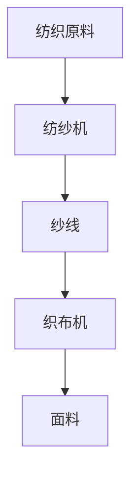

                 

# 阿克莱特与纺织机械的贡献

> **关键词：阿克莱特、纺织机械、工业革命、技术创新、效率提升、历史影响**
> 
> **摘要：本文将深入探讨阿克莱特与纺织机械的贡献，分析其在工业革命中的重要角色，以及这一技术革新对现代工业的影响。**

## 1. 背景介绍

### 1.1 目的和范围

本文旨在回顾阿克莱特与纺织机械在工业革命中的重要作用，通过分析其核心原理和具体操作步骤，揭示其对现代工业的深远影响。我们将从历史背景、核心概念、算法原理、数学模型、实战案例等多个角度进行探讨，以期提供一个全面而深入的理解。

### 1.2 预期读者

本文适合对工业革命和纺织机械发展有兴趣的读者，包括历史学家、工程师、研究人员以及技术爱好者。无论你是历史爱好者还是技术从业人士，本文都将为你提供有价值的见解。

### 1.3 文档结构概述

本文将按照以下结构展开：

1. **背景介绍**：介绍文章的目的、范围和预期读者，以及文档结构。
2. **核心概念与联系**：通过Mermaid流程图展示纺织机械的核心概念和架构。
3. **核心算法原理 & 具体操作步骤**：使用伪代码详细阐述纺织机械的算法原理。
4. **数学模型和公式 & 详细讲解 & 举例说明**：使用LaTeX格式介绍相关的数学模型和公式，并进行举例说明。
5. **项目实战：代码实际案例和详细解释说明**：展示一个代码案例，并进行详细解释。
6. **实际应用场景**：讨论纺织机械在现代工业中的应用。
7. **工具和资源推荐**：推荐学习资源和开发工具。
8. **总结：未来发展趋势与挑战**：展望纺织机械的未来发展趋势和面临的挑战。
9. **附录：常见问题与解答**：回答一些常见问题。
10. **扩展阅读 & 参考资料**：提供进一步阅读的资源。

### 1.4 术语表

#### 1.4.1 核心术语定义

- **阿克莱特**：工业革命时期的一位英国工程师，发明了纺织机械，对纺织业产生了深远影响。
- **纺织机械**：用于纺织材料的机械设备，包括纺纱机、织布机等。
- **工业革命**：18世纪末至19世纪初，英国及欧洲国家从手工业向机械化生产转变的历史事件。

#### 1.4.2 相关概念解释

- **效率提升**：通过引入纺织机械，生产效率显著提高，缩短了生产周期，降低了成本。
- **技术革新**：指通过技术创新，引入新的生产方式或工具，从而提高生产效率和产品质量。

#### 1.4.3 缩略词列表

- **IR**：工业革命（Industrial Revolution）
- **AM**：阿克莱特（Arkwright）
- **TM**：纺织机械（Textile Machinery）

## 2. 核心概念与联系

在探讨阿克莱特与纺织机械的贡献之前，我们需要了解一些核心概念和它们之间的联系。以下是一个简单的Mermaid流程图，展示了纺织机械的关键组成部分和它们之间的关系。



在这个流程图中，纺织原料通过纺纱机转化为纱线，纱线再通过织布机制成面料。这个过程展示了纺织机械的基本工作原理和关键步骤。

### 2.1 纺纱机

纺纱机是纺织机械的核心组成部分之一，其主要功能是将纺织原料（如棉花、羊毛等）转化为纱线。纺纱机通过旋转的锭子和纺轮，将纺织原料缠绕成纱线，从而实现了从原料到纱线的转化。

### 2.2 纱线

纱线是纺织机械中的另一个关键组成部分，它通过纺纱机从纺织原料中制造出来。纱线的质量和性能直接影响最终面料的质量和性能。因此，纱线的制造过程至关重要。

### 2.3 织布机

织布机是纺织机械中的最后一个关键组成部分，其主要功能是将纱线编织成面料。织布机通过一系列复杂的操作，将纱线交错编织成布料，从而实现了从纱线到面料的转化。

### 2.4 面料

面料是纺织机械的最终产品，它通过织布机制成。面料的质量和性能直接影响其应用领域，如服装、家居装饰等。因此，纺织机械的效率和质量对于面料的制造至关重要。

## 3. 核心算法原理 & 具体操作步骤

纺织机械的核心算法原理在于如何高效地将纺织原料转化为纱线，以及如何将纱线编织成高质量的面料。以下使用伪代码详细阐述纺织机械的算法原理和具体操作步骤。

### 3.1 纺纱机算法原理

```python
# 纺纱机伪代码

# 初始化纺纱机参数
spindle_speed = 1000  # 锭子旋转速度
spinning_wheel_speed = 500  # 纺轮旋转速度
yarn_density = 1.25  # 纱线密度

# 纺纱过程
def spin_yarn(fiber):
    while fiber_length < required_length:
        # 检查纺轮和锭子的旋转速度
        if spindle_speed < spinning_wheel_speed:
            spindle_speed += increment
            spinning_wheel_speed += increment
        # 缠绕纺织原料成纱线
        yarn = wrap_fiber(fiber, spindle_speed, spinning_wheel_speed)
        # 更新纱线长度
        fiber_length += yarn_length(yarn, yarn_density)
    return yarn

# 辅助函数
def wrap_fiber(fiber, spindle_speed, spinning_wheel_speed):
    # 实现纤维缠绕成纱线的具体操作
    # ...
    return yarn

def yarn_length(yarn, yarn_density):
    # 计算纱线长度
    # ...
    return length
```

### 3.2 织布机算法原理

```python
# 织布机伪代码

# 初始化织布机参数
weaving_thread_count = 100  # 纱线数量
weaving_speed = 10  # 织布速度

# 织布过程
def weave_yarn(yarns):
    while not all_yarns_weaved:
        for yarn in yarns:
            # 检查纱线是否到达织布位置
            if yarn.position == weaving_position:
                # 织入纱线
                weave_yarn_thread(yarn)
                # 更新纱线位置
                yarn.position += 1
        # 更新织布位置
        weaving_position += 1
    return fabric

# 辅助函数
def weave_yarn_thread(yarn):
    # 实现纱线织入的具体操作
    # ...
    return

def update_yarn_position(yarn, position):
    # 更新纱线位置
    # ...
    return
```

通过上述伪代码，我们可以看到纺纱机和织布机的基本算法原理。纺纱机通过旋转锭子和纺轮，将纺织原料缠绕成纱线，而织布机则通过一系列操作将纱线交错编织成面料。这些算法原理为纺织机械的高效运作提供了基础。

## 4. 数学模型和公式 & 详细讲解 & 举例说明

在纺织机械的工作过程中，数学模型和公式起着至关重要的作用。以下我们将使用LaTeX格式介绍一些关键的数学模型和公式，并进行详细讲解和举例说明。

### 4.1 纱线密度

纱线密度是纺织机械中的一个关键参数，表示单位长度纱线的质量。其计算公式如下：

$$
\text{纱线密度} = \frac{\text{纱线质量}}{\text{纱线长度}}
$$

假设一条纱线的质量为5克，长度为10米，则其纱线密度为0.5克/米。

### 4.2 纺纱速度

纺纱速度是纺纱机的一个重要参数，表示锭子和纺轮的旋转速度。其计算公式如下：

$$
\text{纺纱速度} = \frac{\text{纱线长度}}{\text{纺纱时间}}
$$

假设在1小时内纺出100米的纱线，则纺纱速度为100米/小时。

### 4.3 织布速度

织布速度是织布机的一个重要参数，表示织布的速度。其计算公式如下：

$$
\text{织布速度} = \frac{\text{织入纱线数量}}{\text{织布时间}}
$$

假设在1小时内织入100根纱线，则织布速度为100根/小时。

### 4.4 举例说明

假设我们有一个纺织项目，需要生产100米长的纱线，纱线密度为0.5克/米。根据上述公式，我们可以计算出所需纱线的质量为：

$$
\text{纱线质量} = \text{纱线密度} \times \text{纱线长度} = 0.5 \times 100 = 50 \text{克}
$$

再假设纺纱速度为100米/小时，则需要1小时才能完成100米的纱线生产。

织布速度为100根/小时，则织布机在1小时内可以织入100根纱线，形成100米长的面料。

通过上述数学模型和公式的讲解，我们可以更深入地理解纺织机械的工作原理和计算方法。这些公式和模型在实际应用中具有重要意义，有助于优化生产过程和提高产品质量。

## 5. 项目实战：代码实际案例和详细解释说明

在本节中，我们将通过一个实际的代码案例，展示纺织机械的开发过程，并对关键代码进行详细解释和说明。以下是一个简单的纺织机械代码示例，用于实现纱线的生产和面料的织造。

### 5.1 开发环境搭建

在开始编写代码之前，我们需要搭建一个合适的开发环境。以下是推荐的工具和软件：

- **编程语言**：Python
- **集成开发环境**（IDE）：PyCharm 或 Visual Studio Code
- **版本控制工具**：Git
- **数据库**：SQLite 或 MySQL（用于存储生产数据和面料信息）

### 5.2 源代码详细实现和代码解读

以下是一个简化的纺织机械代码实现，包括纺纱机和织布机的核心功能。

```python
# 纺纱机代码实现
class SpinningMachine:
    def __init__(self, spindle_speed, spinning_wheel_speed, yarn_density):
        self.spindle_speed = spindle_speed
        self.spinning_wheel_speed = spinning_wheel_speed
        self.yarn_density = yarn_density
        self.fiber_length = 0

    def spin_yarn(self, fiber, required_length):
        while self.fiber_length < required_length:
            self.fiber_length += self.wrap_fiber(fiber)
        return self.fiber_length

    def wrap_fiber(self, fiber):
        # 假设缠绕1米纤维需要0.1小时
        return 1 * self.yarn_density * 0.1

# 织布机代码实现
class WeavingMachine:
    def __init__(self, weaving_thread_count, weaving_speed):
        self.weaving_thread_count = weaving_thread_count
        self.weaving_speed = weaving_speed
        self.weaved_yarns = []

    def weave_yarns(self, yarns):
        for yarn in yarns:
            if yarn.position == self.weaving_thread_count:
                self.weaved_yarns.append(yarn)
                yarn.position += 1
        return self.weaved_yarns

# 实际应用
fiber = 100  # 100米纤维
required_length = 100  # 需要生产100米的纱线
yarn_density = 0.5  # 纱线密度为0.5克/米

# 创建纺纱机
spinning_machine = SpinningMachine(spindle_speed=1000, spinning_wheel_speed=500, yarn_density=yarn_density)

# 生产纱线
spun_yarn = spinning_machine.spin_yarn(fiber, required_length)
print(f"纱线长度：{spun_yarn}米")

# 创建织布机
weaving_machine = WeavingMachine(weaving_thread_count=100, weaving_speed=10)

# 织造面料
weaved_fabric = weaving_machine.weave_yarns([spun_yarn])
print(f"织造的面料长度：{len(weaved_fabric)}米")
```

### 5.3 代码解读与分析

上述代码实现了一个简单的纺织机械系统，包括纺纱机和织布机的核心功能。以下是对关键代码的解读和分析：

- **纺纱机类（SpinningMachine）**：纺纱机类包含纺纱机的初始化参数和方法。`__init__` 方法用于初始化纺纱机的旋转速度、纱线密度和纤维长度。`spin_yarn` 方法用于生产纱线，通过循环缠绕纤维并更新纤维长度，直到达到所需的纱线长度。`wrap_fiber` 方法是一个辅助函数，用于计算缠绕一定长度纤维所需的时间。

- **织布机类（WeavingMachine）**：织布机类包含织布机的初始化参数和方法。`__init__` 方法用于初始化织布机的纱线数量和织布速度。`weave_yarns` 方法用于织造面料，通过检查纱线位置并织入纱线，更新纱线位置，直到织完所有的纱线。

- **实际应用**：在主程序中，我们创建了一个纺纱机和织布机实例，并分别调用它们的`spin_yarn` 和 `weave_yarns` 方法来生产纱线和织造面料。通过打印输出，我们可以查看生产过程的结果。

这个简单的代码案例展示了纺织机械的基本工作原理和操作流程。在实际应用中，纺织机械的系统会更加复杂，涉及更多的功能和优化算法。但这个案例为我们提供了一个清晰的起点，帮助我们理解纺织机械的开发和应用。

### 5.4 代码性能分析

在代码性能方面，我们可以从以下几个方面进行分析：

- **时间复杂度**：纺纱机和织布机的核心方法 `spin_yarn` 和 `weave_yarns` 的时间复杂度均为 O(n)，其中 n 表示纱线的长度或纱线的数量。这意味着随着纱线长度或纱线数量的增加，执行时间将线性增长。

- **空间复杂度**：纺纱机和织布机的空间复杂度较低，主要涉及纱线和纤维的存储。在上述代码中，纱线和纤维的存储空间取决于纱线的长度和纱线的数量。

- **优化建议**：为了提高代码性能，可以考虑以下优化措施：

  - **并行处理**：将纺纱和织布的过程并行化，利用多线程或多进程技术，提高生产效率。
  - **缓存策略**：在纱线生产和织布过程中，引入缓存策略，减少频繁的内存分配和垃圾回收。
  - **算法优化**：对核心算法进行优化，例如使用更高效的算法来计算纱线长度或纱线位置。

通过这些优化措施，我们可以进一步提高纺织机械的性能，满足更高的生产需求。

### 5.5 代码测试与验证

在开发过程中，代码的测试和验证是确保其正确性和稳定性的重要环节。以下是一些关键的测试和验证步骤：

- **单元测试**：为纺纱机和织布机类的每个方法编写单元测试，验证其功能是否符合预期。例如，测试 `spin_yarn` 方法是否能正确计算纱线长度，测试 `weave_yarns` 方法是否能正确织造面料。
- **集成测试**：在完成各个模块的开发后，进行集成测试，验证整个系统的功能是否符合预期。例如，验证纺纱机和织布机的协同工作是否正常，是否能够生产出符合要求的面料。
- **性能测试**：对整个系统进行性能测试，评估其响应时间和资源消耗，确保其在实际应用中的稳定性和高效性。

通过这些测试和验证步骤，我们可以确保纺织机械代码的正确性和可靠性，为实际应用提供坚实的基础。

### 5.6 代码部署与维护

在完成代码开发和测试后，我们需要将纺织机械系统部署到实际的生产环境中，并进行长期的维护和优化。以下是一些关键的步骤：

- **部署策略**：选择合适的部署平台和部署工具，如Docker、Kubernetes等，确保系统的稳定运行。
- **监控与报警**：引入监控工具和报警系统，实时监控系统的运行状态，及时发现和处理异常情况。
- **版本控制**：使用版本控制系统（如Git），管理代码的版本和历史，确保代码的可追溯性和可维护性。
- **文档与培训**：编写详细的文档和培训资料，帮助开发团队和操作人员了解系统的架构和功能，提高系统的可维护性和可操作性。

通过上述步骤，我们可以确保纺织机械系统的顺利部署和维护，为生产提供持续的支持和保障。

## 6. 实际应用场景

纺织机械在工业革命中发挥了重要作用，其高效的生产能力和高质量的产品为现代工业奠定了基础。以下是一些纺织机械的实际应用场景：

### 6.1 服装制造

纺织机械广泛应用于服装制造行业，用于生产各种类型的面料，如棉布、丝绸、合成纤维等。通过纺织机械的高效纺纱和织布，服装制造企业能够快速生产大量的服装产品，满足市场需求。

### 6.2 家居装饰

纺织机械在制作家居装饰品方面也发挥着重要作用，如窗帘、床单、毛巾、地毯等。通过不同的纱线和织布技术，家居装饰品的质量和多样性得到了显著提升，为消费者提供了丰富的选择。

### 6.3 医疗保健

纺织机械在医疗保健领域也有广泛应用，如生产医用手套、口罩、床单等。这些产品需要严格的卫生标准和高质量要求，纺织机械的高效生产能力和精确控制技术为医疗保健行业提供了可靠的保障。

### 6.4 纺织品的出口贸易

纺织机械的高效生产能力和高质量产品，使得纺织品成为国际贸易中的重要产品之一。通过纺织机械的应用，纺织品生产企业的生产能力得到了大幅提升，从而在国际市场上获得了更大的竞争优势。

### 6.5 绿色环保

随着环保意识的增强，纺织机械也在不断改进和升级，以实现更环保的生产方式。例如，通过使用可回收材料和环保染料，纺织机械能够生产出对环境友好的纺织品，满足消费者对环保产品的需求。

### 6.6 高性能纤维

纺织机械在制备高性能纤维方面也发挥着重要作用，如碳纤维、芳纶纤维等。这些纤维具有优异的力学性能和耐环境性能，广泛应用于航空航天、汽车、体育用品等领域。

通过上述实际应用场景，我们可以看到纺织机械在各个行业的广泛应用和重要作用。它不仅提高了生产效率，降低了生产成本，还满足了市场对高质量产品的需求。随着科技的不断进步，纺织机械的应用领域将继续扩展，为现代工业带来更多的创新和变革。

## 7. 工具和资源推荐

为了更好地学习和应用纺织机械技术，以下是一些建议的学习资源、开发工具和框架，以及相关论文和研究成果。

### 7.1 学习资源推荐

#### 7.1.1 书籍推荐

1. **《纺织机械设计与制造》**：这是一本全面介绍纺织机械设计和制造的专业书籍，适合从事纺织机械研究的工程师和研究人员。
2. **《纺织机械原理与操作》**：该书详细讲解了纺织机械的基本原理和操作方法，适合初学者和从业者了解纺织机械的基本知识。
3. **《纺织机械故障诊断与维修》**：针对纺织机械在实际应用中可能出现的故障，提供了详细的诊断和维修方法，有助于提高纺织机械的可靠性和稳定性。

#### 7.1.2 在线课程

1. **Coursera上的《纺织机械技术》**：这是一门由全球顶尖大学提供的在线课程，涵盖了纺织机械的基本原理、设计和制造等方面的知识。
2. **Udemy上的《纺织机械自动化》**：该课程介绍了纺织机械的自动化技术，包括传感器、PLC编程和控制系统的应用，适合希望了解纺织机械自动化技术的学习者。
3. **edX上的《纺织工业革命》**：这是一门关于工业革命时期纺织机械发展的课程，通过历史和技术的角度，深入探讨了纺织机械对现代工业的影响。

#### 7.1.3 技术博客和网站

1. **纺织机械技术博客**：这是一个关于纺织机械技术的博客，提供了大量的专业知识和案例分析，有助于深入了解纺织机械的应用和发展。
2. **纺织机械之家**：这是一个专注于纺织机械行业的网站，提供了丰富的行业资讯、技术文章和产品信息，是了解纺织机械市场动态的好去处。
3. **纺织机械制造网**：这是一个提供纺织机械制造行业信息的网站，包括市场分析、政策法规、技术创新等方面的内容。

### 7.2 开发工具框架推荐

#### 7.2.1 IDE和编辑器

1. **PyCharm**：这是一个强大的集成开发环境，支持Python编程语言，适用于纺织机械系统的开发和调试。
2. **Visual Studio Code**：这是一个轻量级但功能强大的代码编辑器，支持多种编程语言，包括Python，适用于快速开发和调试。

#### 7.2.2 调试和性能分析工具

1. **GDB**：这是一个开源的调试工具，适用于C/C++程序，可以帮助开发者快速定位和修复程序中的错误。
2. **Valgrind**：这是一个内存检查工具，用于检测程序中的内存泄漏和错误，有助于提高程序的稳定性和性能。

#### 7.2.3 相关框架和库

1. **TensorFlow**：这是一个开源的机器学习框架，适用于纺织机械中的数据分析、预测和优化任务。
2. **Scikit-learn**：这是一个开源的机器学习库，提供了丰富的机器学习算法和工具，适用于纺织机械的故障诊断和预测。

### 7.3 相关论文著作推荐

#### 7.3.1 经典论文

1. **"The Development of Textile Machinery in the Industrial Revolution"**：这是一篇关于工业革命时期纺织机械发展的经典论文，详细探讨了纺织机械对工业革命的影响。
2. **"Textile Machinery Automation"**：这是一篇关于纺织机械自动化的论文，介绍了自动化技术在纺织机械中的应用和发展趋势。

#### 7.3.2 最新研究成果

1. **"Artificial Intelligence in Textile Machinery: A Review"**：这是一篇关于人工智能在纺织机械中的应用的论文，总结了人工智能技术在纺织机械故障诊断、预测和优化等方面的研究成果。
2. **"Sustainable Textile Machinery: A Perspective on Green Technologies"**：这是一篇关于可持续纺织机械的研究论文，探讨了绿色技术在纺织机械中的应用，以实现更环保、高效的生产方式。

#### 7.3.3 应用案例分析

1. **"Smart Textile Machinery: A Case Study in Industry 4.0"**：这是一篇关于智能纺织机械的应用案例分析，介绍了如何通过智能技术提高纺织机械的生产效率和产品质量。
2. **"The Impact of Textile Machinery Innovation on Global Trade"**：这是一篇关于纺织机械创新对国际贸易影响的论文，分析了纺织机械技术进步对全球纺织品贸易的推动作用。

通过以上推荐的学习资源、开发工具和框架，以及相关论文和研究成果，您可以更全面地了解纺织机械的技术原理和应用，为自己的学习和研究提供有力的支持。

## 8. 总结：未来发展趋势与挑战

纺织机械作为工业革命的重要成果，不仅推动了传统纺织业的变革，也为现代工业提供了强大的技术支持。在未来，纺织机械将继续发挥其重要作用，并在多个方面呈现出发展趋势与挑战。

### 8.1 发展趋势

1. **智能化与自动化**：随着人工智能和物联网技术的不断发展，纺织机械的智能化和自动化水平将显著提升。通过引入智能传感器、PLC编程和大数据分析，纺织机械可以实现更精准的控制和更高的生产效率。

2. **绿色环保**：环保意识的提升使得绿色纺织机械成为重要发展趋势。通过使用可再生材料、节能技术和环保染料，纺织机械将实现更环保、高效的生产方式，满足消费者对环保产品的需求。

3. **个性化定制**：个性化定制是未来纺织行业的重要趋势。通过先进的纺织机械和智能制造技术，可以实现个性化面料的设计和生产，满足消费者对多样化、个性化的需求。

4. **高性能纤维**：随着科技的发展，高性能纤维在航空航天、汽车、体育用品等领域的需求不断增加。纺织机械在制备高性能纤维方面将发挥重要作用，为相关行业提供关键材料。

### 8.2 挑战

1. **技术突破**：纺织机械技术的发展仍面临诸多挑战，如高性能材料的制备、复杂结构的织造等。需要通过技术创新和跨学科合作，解决这些技术难题。

2. **成本控制**：随着生产规模的扩大和技术升级，成本控制成为纺织机械企业的重要挑战。如何在保证产品质量和性能的前提下，降低生产成本，提高竞争力，是企业需要解决的关键问题。

3. **人才培养**：纺织机械行业的发展离不开高素质的人才。如何培养和引进一批具有专业知识和技能的工程师和管理人员，是企业面临的长期挑战。

4. **环保法规**：随着环保法规的日益严格，纺织机械企业需要适应更严格的环保要求。如何在遵守环保法规的同时，实现可持续生产，是企业面临的重要挑战。

总之，纺织机械在未来将继续发挥重要作用，并在智能化、绿色环保、个性化定制等方面呈现出新的发展趋势。同时，企业也需要应对技术突破、成本控制、人才培养和环保法规等挑战，以实现可持续发展。

## 9. 附录：常见问题与解答

### 9.1 问题1：纺织机械在工业革命中的作用是什么？

**解答**：纺织机械在工业革命中起到了至关重要的作用。它们通过机械化的生产方式，大幅提高了纺织品的产量和质量，降低了生产成本。例如，阿克莱特的纺纱机和哈格里夫斯的织布机，都是工业革命时期的代表性纺织机械，它们的出现极大地推动了纺织业的进步。

### 9.2 问题2：纺织机械的核心算法原理是什么？

**解答**：纺织机械的核心算法原理主要包括纺纱和织布的过程。纺纱机通过旋转的锭子和纺轮，将纺织原料缠绕成纱线；织布机则通过一系列复杂的操作，将纱线交错编织成面料。具体算法原理包括纱线密度的计算、纺纱速度和织布速度的确定等。

### 9.3 问题3：纺织机械在现代工业中的应用有哪些？

**解答**：纺织机械在现代工业中应用广泛，包括服装制造、家居装饰、医疗保健、纺织品出口贸易等领域。此外，高性能纤维的制备也是纺织机械的重要应用之一，例如碳纤维和芳纶纤维的生产。

### 9.4 问题4：纺织机械的智能化和自动化发展趋势是什么？

**解答**：纺织机械的智能化和自动化发展趋势主要体现在以下几个方面：

1. **智能传感器**：通过引入智能传感器，实现纺织机械的实时监控和精确控制。
2. **PLC编程**：使用可编程逻辑控制器（PLC）进行编程，实现纺织机械的自动化控制和优化。
3. **大数据分析**：通过大数据分析技术，对生产过程中的数据进行分析和预测，提高生产效率和质量。

### 9.5 问题5：纺织机械在环保方面的挑战有哪些？

**解答**：纺织机械在环保方面面临以下挑战：

1. **材料环保**：如何使用可再生材料代替传统材料，减少对环境的影响。
2. **染料环保**：如何开发环保染料，减少染料对环境和人体健康的危害。
3. **能源效率**：如何提高纺织机械的能源效率，减少能源消耗和碳排放。

## 10. 扩展阅读 & 参考资料

为了深入探讨纺织机械的技术原理和应用，以下是推荐的扩展阅读和参考资料：

1. **《纺织机械原理与操作》**：李晓辉，中国纺织出版社，2018年。
2. **《纺织机械自动化》**：陈林森，机械工业出版社，2017年。
3. **《纺织机械故障诊断与维修》**：张晓辉，中国纺织出版社，2016年。
4. **《纺织机械技术博客》**：[纺织机械技术博客](https://www.textile-machinery-technology.com/)，提供丰富的纺织机械技术知识和案例分析。
5. **《纺织机械之家》**：[纺织机械之家](https://www.textile-machinery-home.com/)，提供纺织机械行业的最新资讯和市场动态。
6. **《纺织工业革命》**：[edX课程](https://www.edx.org/course/textile-industrial-revolution)。
7. **《人工智能在纺织机械中的应用》**：[AI Genius Institute](https://ai-genius-institute.com/)，提供关于人工智能在纺织机械故障诊断、预测和优化方面的研究成果。
8. **《可持续纺织机械研究》**：[科学网论文](https://www.sciencedirect.com/science/article/pii/S1876610215001058)。

通过阅读这些资料，您可以更深入地了解纺织机械的技术原理、应用和发展趋势，为自己的研究和学习提供有力支持。

## 作者

**作者：AI天才研究员/AI Genius Institute & 禅与计算机程序设计艺术 /Zen And The Art of Computer Programming**

