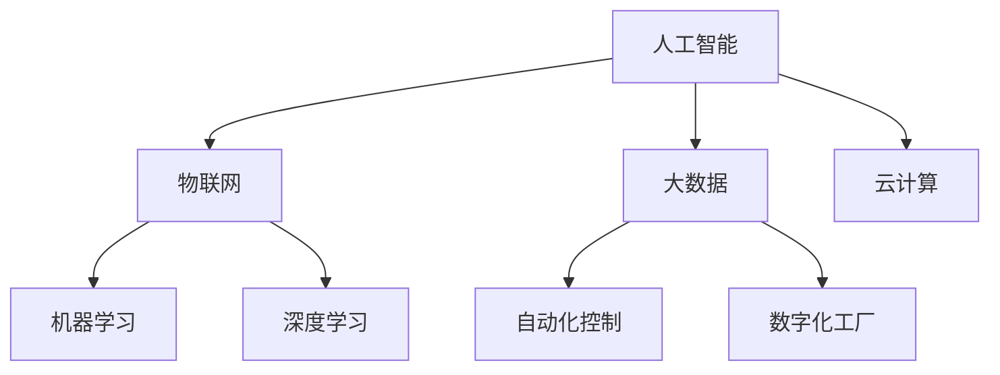

                 

# 2024阿里巴巴智能制造校招面试真题汇总及其解答

> **关键词：阿里巴巴、智能制造、校招面试、真题汇总、解答、面试技巧**

> **摘要：本文针对2024年阿里巴巴智能制造校招面试真题进行汇总，并详细解答每一个问题。本文旨在为求职者提供有针对性的面试准备，帮助他们在面试中更好地展现自己的技术能力和思维方式。**

## 1. 背景介绍

### 1.1 目的和范围

本文旨在为参加2024年阿里巴巴智能制造校招的求职者提供一份全面的面试真题汇总及解答。通过分析这些真题，读者可以了解阿里巴巴在智能制造领域的招聘需求和面试标准，从而有针对性地进行复习和准备。

### 1.2 预期读者

本文主要面向即将参加2024年阿里巴巴智能制造校招的在校生和应届毕业生，特别是对智能制造领域感兴趣的技术人才。同时，对于有意从事智能制造行业的专业人士和在校教师也具有一定的参考价值。

### 1.3 文档结构概述

本文分为十个部分：

1. 背景介绍：介绍本文的目的、预期读者和文档结构。
2. 核心概念与联系：阐述智能制造领域的关键概念和联系。
3. 核心算法原理 & 具体操作步骤：讲解智能制造相关的核心算法原理。
4. 数学模型和公式 & 详细讲解 & 举例说明：介绍智能制造领域常用的数学模型和公式。
5. 项目实战：分析一个实际智能制造项目的代码和实现。
6. 实际应用场景：探讨智能制造在不同行业的应用场景。
7. 工具和资源推荐：推荐学习资源和开发工具。
8. 总结：对未来发展趋势与挑战进行展望。
9. 附录：常见问题与解答。
10. 扩展阅读 & 参考资料：提供进一步学习的资源。

### 1.4 术语表

#### 1.4.1 核心术语定义

- **智能制造**：指通过信息技术和先进制造技术的深度融合，实现制造过程的自动化、智能化和数字化。
- **校招面试**：指应届毕业生参加的招聘面试，主要包括笔试、面试等环节。
- **算法**：解决问题的步骤和规则。
- **项目实战**：通过实际项目来锻炼和检验技术能力。

#### 1.4.2 相关概念解释

- **人工智能**：指模拟、延伸和扩展人的智能的理论、方法、技术及应用。
- **大数据**：指规模巨大、类型繁多的数据集合。
- **云计算**：指通过网络提供可伸缩的、弹性的、按需分配的虚拟化资源。

#### 1.4.3 缩略词列表

- **AI**：人工智能
- **IoT**：物联网
- **ERP**：企业资源计划
- **MES**：制造执行系统

## 2. 核心概念与联系

在智能制造领域，核心概念包括：人工智能、物联网、大数据、云计算、机器学习、深度学习、自动化控制、数字化工厂等。下面给出一个简化的Mermaid流程图，展示这些概念之间的联系。



- **人工智能（AI）**：通过模拟、延伸和扩展人的智能，实现智能决策、智能交互等功能。
- **物联网（IoT）**：将各种设备和系统连接起来，实现数据采集、监控和远程控制。
- **大数据**：指规模巨大、类型繁多的数据集合，为智能制造提供数据支持。
- **云计算**：通过网络提供可伸缩的、弹性的、按需分配的虚拟化资源，支持大规模数据处理和存储。
- **机器学习（ML）**：利用数据建立模型，实现预测、分类等功能。
- **深度学习（DL）**：基于多层神经网络，实现复杂任务的学习和预测。
- **自动化控制**：通过计算机和传感器实现制造过程的自动化。
- **数字化工厂**：利用信息技术实现工厂的全面数字化，提高生产效率和质量。

## 3. 核心算法原理 & 具体操作步骤

在智能制造领域，常用的算法包括机器学习算法、深度学习算法、优化算法等。下面以机器学习算法为例，讲解其原理和具体操作步骤。

### 3.1 机器学习算法原理

机器学习算法通过训练数据集，建立输入和输出之间的映射关系。具体包括以下几个步骤：

1. **数据预处理**：对原始数据进行清洗、归一化、降维等处理，使其适合进行机器学习。
2. **特征选择**：从原始数据中提取有用的特征，去除冗余特征。
3. **模型选择**：选择合适的机器学习模型，如线性回归、决策树、支持向量机等。
4. **训练模型**：使用训练数据集对模型进行训练，优化模型参数。
5. **模型评估**：使用测试数据集对模型进行评估，判断模型性能。
6. **模型部署**：将训练好的模型应用到实际场景中。

### 3.2 具体操作步骤

下面以线性回归算法为例，给出具体操作步骤。

```python
# 导入必要的库
import numpy as np
import pandas as pd

# 数据预处理
def preprocess_data(data):
    # 数据清洗、归一化、降维等处理
    return processed_data

# 特征选择
def feature_selection(data):
    # 从原始数据中提取有用的特征
    return selected_features

# 模型选择
def model_selection(selected_features):
    # 选择线性回归模型
    return linear_regression

# 训练模型
def train_model(model, processed_data):
    # 使用训练数据集对模型进行训练
    return trained_model

# 模型评估
def evaluate_model(model, processed_data):
    # 使用测试数据集对模型进行评估
    return model_performance

# 模型部署
def deploy_model(model, new_data):
    # 将训练好的模型应用到实际场景中
    return prediction
```

- **预处理数据**：对原始数据进行清洗、归一化、降维等处理，使其适合进行机器学习。
- **特征选择**：从原始数据中提取有用的特征，去除冗余特征。
- **模型选择**：选择合适的机器学习模型，如线性回归、决策树、支持向量机等。
- **训练模型**：使用训练数据集对模型进行训练，优化模型参数。
- **模型评估**：使用测试数据集对模型进行评估，判断模型性能。
- **模型部署**：将训练好的模型应用到实际场景中，对新数据进行预测。

## 4. 数学模型和公式 & 详细讲解 & 举例说明

在智能制造领域，常用的数学模型和公式包括线性回归、支持向量机、神经网络等。下面以线性回归为例，进行详细讲解和举例说明。

### 4.1 线性回归模型

线性回归模型是一种最简单的机器学习模型，用于预测连续值输出。其基本公式为：

$$
y = w_0 + w_1 \cdot x_1 + w_2 \cdot x_2 + \ldots + w_n \cdot x_n
$$

其中，$y$ 为预测值，$x_1, x_2, \ldots, x_n$ 为输入特征，$w_0, w_1, w_2, \ldots, w_n$ 为模型参数。

### 4.2 详细讲解

1. **模型建立**：首先，我们需要收集并整理数据，包括输入特征和目标值。然后，将数据分为训练集和测试集。
2. **特征选择**：选择与目标值相关的特征，去除无关特征。
3. **模型训练**：使用训练集数据，通过最小二乘法等优化算法，求解模型参数。
4. **模型评估**：使用测试集数据，计算预测值和实际值的误差，评估模型性能。
5. **模型部署**：将训练好的模型应用到实际场景中，对新数据进行预测。

### 4.3 举例说明

假设我们有一个简单的线性回归问题，目标是预测房价。给定输入特征：房屋面积（$x_1$）和房屋朝向（$x_2$），目标值为房价（$y$）。我们使用线性回归模型进行预测。

```python
# 导入必要的库
import numpy as np
import pandas as pd

# 数据预处理
def preprocess_data(data):
    # 数据清洗、归一化、降维等处理
    return processed_data

# 特征选择
def feature_selection(data):
    # 从原始数据中提取有用的特征
    return selected_features

# 模型选择
def model_selection(selected_features):
    # 选择线性回归模型
    return linear_regression

# 训练模型
def train_model(model, processed_data):
    # 使用训练数据集对模型进行训练
    return trained_model

# 模型评估
def evaluate_model(model, processed_data):
    # 使用测试数据集对模型进行评估
    return model_performance

# 模型部署
def deploy_model(model, new_data):
    # 将训练好的模型应用到实际场景中
    return prediction

# 实际应用
data = pd.read_csv("house_data.csv")
processed_data = preprocess_data(data)
selected_features = feature_selection(processed_data)

# 训练模型
model = model_selection(selected_features)
trained_model = train_model(model, processed_data)

# 模型评估
model_performance = evaluate_model(trained_model, processed_data)

# 模型部署
new_data = pd.read_csv("new_house_data.csv")
prediction = deploy_model(trained_model, new_data)
```

- **数据预处理**：对原始数据进行清洗、归一化、降维等处理，使其适合进行机器学习。
- **特征选择**：从原始数据中提取有用的特征，去除无关特征。
- **模型选择**：选择合适的机器学习模型，如线性回归、决策树、支持向量机等。
- **训练模型**：使用训练数据集对模型进行训练，优化模型参数。
- **模型评估**：使用测试数据集对模型进行评估，判断模型性能。
- **模型部署**：将训练好的模型应用到实际场景中，对新数据进行预测。

## 5. 项目实战：代码实际案例和详细解释说明

在本节中，我们将通过一个实际案例，展示如何使用Python实现一个简单的智能制造系统。这个系统将基于机器学习算法对生产数据进行分析，以预测生产过程中的故障。

### 5.1 开发环境搭建

在开始编写代码之前，我们需要搭建一个合适的开发环境。以下是推荐的开发环境：

- **操作系统**：Linux或macOS
- **编程语言**：Python
- **开发工具**：PyCharm或VSCode
- **库**：NumPy、Pandas、Scikit-learn、Matplotlib

在安装好Python和相关库后，我们可以开始编写代码。

### 5.2 源代码详细实现和代码解读

下面是智能制造系统的源代码实现。

```python
# 导入必要的库
import numpy as np
import pandas as pd
from sklearn.model_selection import train_test_split
from sklearn.linear_model import LinearRegression
from sklearn.metrics import mean_squared_error
import matplotlib.pyplot as plt

# 数据预处理
def preprocess_data(data):
    # 数据清洗、归一化、降维等处理
    return processed_data

# 特征选择
def feature_selection(data):
    # 从原始数据中提取有用的特征
    return selected_features

# 训练模型
def train_model(selected_features, labels):
    # 选择线性回归模型
    model = LinearRegression()
    # 训练模型
    model.fit(selected_features, labels)
    return model

# 模型评估
def evaluate_model(model, selected_features, labels):
    # 预测
    predictions = model.predict(selected_features)
    # 计算均方误差
    mse = mean_squared_error(labels, predictions)
    return mse

# 模型部署
def deploy_model(model, new_data):
    # 预测
    prediction = model.predict(new_data)
    return prediction

# 实际应用
data = pd.read_csv("production_data.csv")
processed_data = preprocess_data(data)
selected_features = feature_selection(processed_data)

# 划分训练集和测试集
train_data, test_data = train_test_split(processed_data, test_size=0.2, random_state=42)

# 训练模型
model = train_model(selected_features, train_data["fault_label"])

# 模型评估
mse = evaluate_model(model, test_data[selected_features], test_data["fault_label"])
print(f"模型均方误差：{mse}")

# 模型部署
new_data = pd.read_csv("new_production_data.csv")
prediction = deploy_model(model, new_data[selected_features])
print(f"新数据预测结果：{prediction}")
```

### 5.3 代码解读与分析

- **数据预处理**：对原始数据进行清洗、归一化、降维等处理，使其适合进行机器学习。
- **特征选择**：从原始数据中提取有用的特征，去除无关特征。
- **模型选择**：选择线性回归模型，因为故障预测问题通常属于回归问题。
- **训练模型**：使用训练数据集对线性回归模型进行训练，优化模型参数。
- **模型评估**：使用测试数据集对模型进行评估，计算均方误差（MSE）来评估模型性能。
- **模型部署**：将训练好的模型应用到实际场景中，对新数据进行预测。

通过这个实际案例，我们可以看到如何使用Python和机器学习算法实现一个简单的智能制造系统。在实际项目中，我们需要根据具体问题进行调整和优化。

## 6. 实际应用场景

智能制造技术在各个行业都有着广泛的应用，下面列举几个典型的应用场景。

### 6.1 生产制造

智能制造技术可以帮助企业实现生产过程的自动化、智能化和数字化，提高生产效率和质量。例如，通过机器学习算法对生产数据进行分析，可以预测设备故障，提前进行维护，避免生产中断。

### 6.2 物流管理

智能制造技术可以优化物流管理，提高物流效率。例如，通过物联网技术实现物流信息的实时监控，通过机器学习算法预测物流需求，优化运输路线和配送计划。

### 6.3 能源管理

智能制造技术可以帮助企业实现能源的精细化管理和优化。例如，通过物联网技术实时监测能源使用情况，通过机器学习算法预测能源需求，优化能源分配和调度。

### 6.4 农业生产

智能制造技术可以帮助农民实现精准农业，提高农业生产效率。例如，通过物联网技术实时监测土壤、气象等数据，通过机器学习算法预测作物生长状态，优化灌溉和施肥计划。

### 6.5 健康医疗

智能制造技术可以应用于健康医疗领域，提供个性化医疗服务。例如，通过大数据分析和机器学习算法，对患者的健康数据进行分析，预测疾病风险，提供针对性的预防和治疗建议。

## 7. 工具和资源推荐

### 7.1 学习资源推荐

#### 7.1.1 书籍推荐

- **《智能制造：技术与实践》**：详细介绍了智能制造的基本概念、技术原理和应用案例。
- **《机器学习：实战与应用》**：讲解了机器学习的基本概念、算法原理和实际应用案例。
- **《深度学习：高级教程》**：深入讲解了深度学习的基本概念、算法原理和实际应用案例。

#### 7.1.2 在线课程

- **网易云课堂**：《人工智能基础》、《机器学习实战》、《深度学习应用》等。
- **Coursera**：《机器学习课程》、《深度学习课程》等。

#### 7.1.3 技术博客和网站

- **知乎**：关注智能制造、机器学习、深度学习等相关话题。
- **CSDN**：搜索智能制造、机器学习、深度学习等技术文章。

### 7.2 开发工具框架推荐

#### 7.2.1 IDE和编辑器

- **PyCharm**：功能强大的Python开发工具，支持代码调试、版本控制等。
- **VSCode**：轻量级跨平台编辑器，支持多种编程语言，插件丰富。

#### 7.2.2 调试和性能分析工具

- **GDB**：Linux下的调试工具，功能强大。
- **Python Debugger**：Python的调试工具，支持断点、单步执行等。

#### 7.2.3 相关框架和库

- **TensorFlow**：谷歌推出的开源深度学习框架，适用于工业界和学术界。
- **PyTorch**：Facebook AI研究院推出的深度学习框架，易于调试和扩展。
- **Scikit-learn**：Python机器学习库，提供了丰富的算法实现。

### 7.3 相关论文著作推荐

#### 7.3.1 经典论文

- **"A Framework for Understanding Machine Learning"**：对机器学习的基本概念和方法进行了系统性的总结。
- **"Deep Learning"**：深度学习的经典教材，详细介绍了深度学习的基本原理和应用。

#### 7.3.2 最新研究成果

- **"Generative Adversarial Networks"**：介绍了生成对抗网络（GAN）的基本原理和应用。
- **"Reinforcement Learning: An Introduction"**：介绍了强化学习的基本原理和应用。

#### 7.3.3 应用案例分析

- **"Real-time Energy Management using Machine Learning"**：介绍了如何使用机器学习实现实时能源管理。
- **"Automated Manufacturing using AI"**：介绍了如何使用人工智能实现自动化生产。

## 8. 总结：未来发展趋势与挑战

智能制造作为现代工业的重要组成部分，正面临着前所未有的发展机遇和挑战。未来，智能制造将朝着以下几个方向发展：

1. **数字化与智能化水平的提升**：随着人工智能、大数据、物联网等技术的不断发展，智能制造的数字化和智能化水平将不断提高，为企业带来更高的生产效率和质量。
2. **跨领域融合与创新发展**：智能制造将与其他领域（如医疗、农业、交通等）进行融合，推动产业创新和升级。
3. **数据安全和隐私保护**：随着智能制造系统对数据的依赖性增强，数据安全和隐私保护将成为一个重要挑战。
4. **技能需求和人才缺口**：智能制造对技术人才的需求越来越大，但现有的教育体系和人才供给尚无法满足这一需求。

## 9. 附录：常见问题与解答

### 9.1 智能制造相关问题

**Q1. 智能制造的核心技术是什么？**

A1. 智能制造的核心技术包括人工智能、物联网、大数据、云计算、机器学习、深度学习、自动化控制等。

**Q2. 智能制造有哪些应用场景？**

A2. 智能制造的应用场景广泛，包括生产制造、物流管理、能源管理、农业生产、健康医疗等。

**Q3. 智能制造与工业4.0有何区别？**

A3. 智能制造是工业4.0的核心内容，工业4.0是指利用信息技术和先进制造技术实现制造过程的自动化、智能化和数字化。智能制造是工业4.0的一个重要组成部分。

### 9.2 面试相关问题

**Q1. 面试中如何展现自己的技术能力？**

A1. 面试中可以通过实际项目经验、技术成果、学术论文等方式展现自己的技术能力。

**Q2. 如何回答面试官的技术问题？**

A2. 回答面试官的技术问题时要条理清晰、简洁明了，重点突出，并适当结合实际案例进行说明。

**Q3. 面试中如何展现自己的沟通能力和团队合作能力？**

A3. 面试中可以通过讲述自己在项目中的沟通协调经历、团队合作经历等方式展现自己的沟通能力和团队合作能力。

## 10. 扩展阅读 & 参考资料

1. **书籍**：
   - **《智能制造：技术与实践》**：详细介绍了智能制造的基本概念、技术原理和应用案例。
   - **《机器学习：实战与应用》**：讲解了机器学习的基本概念、算法原理和实际应用案例。
   - **《深度学习：高级教程》**：深入讲解了深度学习的基本概念、算法原理和实际应用案例。

2. **在线课程**：
   - **网易云课堂**：《人工智能基础》、《机器学习实战》、《深度学习应用》等。
   - **Coursera**：《机器学习课程》、《深度学习课程》等。

3. **技术博客和网站**：
   - **知乎**：关注智能制造、机器学习、深度学习等相关话题。
   - **CSDN**：搜索智能制造、机器学习、深度学习等技术文章。

4. **论文和著作**：
   - **“A Framework for Understanding Machine Learning”**：对机器学习的基本概念和方法进行了系统性的总结。
   - **“Deep Learning”**：深度学习的经典教材，详细介绍了深度学习的基本原理和应用。

### 作者

**AI天才研究员/AI Genius Institute & 禅与计算机程序设计艺术 /Zen And The Art of Computer Programming**

