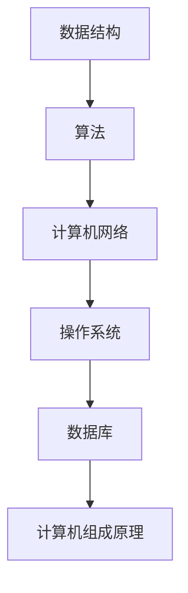

                 

# 2025阿里巴巴校招面试题与算法编程题深度剖析

> **关键词：** 阿里巴巴校招、面试题、算法编程、深度剖析、实战案例

> **摘要：** 本文将深入剖析2025年阿里巴巴校招面试中常见的面试题和算法编程题，通过逐步分析，帮助读者掌握解题思路和技巧，提升面试应对能力。

## 1. 背景介绍

阿里巴巴作为中国乃至全球知名的高科技公司，其校招面试一直被视为技术人才选拔的标杆。每年的校招面试题目，既考查了应聘者的基础知识，又考验了实际编程能力和思维能力。本文将针对2025年阿里巴巴校招中的面试题和算法编程题进行深度剖析，帮助读者更好地应对类似面试。

## 2. 核心概念与联系

在解答阿里巴巴校招面试题和算法编程题时，需要掌握以下几个核心概念：

- **数据结构与算法**：包括数组、链表、栈、队列、树、图等基本数据结构，以及排序、查找、动态规划等算法。
- **计算机网络**：包括TCP/IP协议、HTTP协议、DNS等基本概念。
- **操作系统**：包括进程管理、内存管理、文件系统等基础知识。
- **数据库**：包括关系型数据库和NoSQL数据库的基本原理和常用SQL语句。
- **计算机组成原理**：包括CPU、内存、存储、I/O接口等基础知识。

以下是一个简单的 Mermaid 流程图，展示这些核心概念之间的联系：



## 3. 核心算法原理 & 具体操作步骤

在本章节中，我们将详细介绍几个在阿里巴巴校招面试中常见的算法题目，并给出详细的解题思路和步骤。

### 3.1. 合并两个有序链表

**题目描述**：给定两个已经排序的单链表，请将它们合并为一个有序单链表。

**解题思路**：使用两个指针分别指向两个链表的头节点，比较两个指针所指向的节点的值，选择较小的值将其插入到新链表中，并移动相应的指针。

**具体步骤**：

1. 创建一个新的空链表作为结果链表。
2. 初始化两个指针，分别指向两个输入链表的头节点。
3. 比较两个指针所指向的节点的值，选择较小的值将其插入到新链表中。
4. 移动插入节点对应的指针。
5. 当任意一个链表到达末尾时，将另一个链表的剩余部分直接连接到结果链表。

**代码实现**：

```c++
struct ListNode {
    int val;
    ListNode *next;
    ListNode(int x) : val(x), next(NULL) {}
};

ListNode* mergeTwoLists(ListNode* l1, ListNode* l2) {
    ListNode *dummy = new ListNode(0);
    ListNode *p = dummy;
    
    while (l1 && l2) {
        if (l1->val < l2->val) {
            p->next = l1;
            l1 = l1->next;
        } else {
            p->next = l2;
            l2 = l2->next;
        }
        p = p->next;
    }
    
    p->next = l1 ? l1 : l2;
    return dummy->next;
}
```

### 3.2. 求最长公共子序列

**题目描述**：给定两个字符串，请找出它们的最长公共子序列。

**解题思路**：使用动态规划求解。定义一个二维数组 dp，其中 dp[i][j] 表示字符串 s1 的前 i 个字符和字符串 s2 的前 j 个字符的最长公共子序列的长度。

**具体步骤**：

1. 初始化一个二维数组 dp，其中 dp[i][j] = 0。
2. 遍历字符串 s1 和 s2 的所有字符，对于每个字符 (i, j)，计算 dp[i][j] 的值：
   - 如果 s1[i-1] == s2[j-1]，则 dp[i][j] = dp[i-1][j-1] + 1；
   - 否则，dp[i][j] = max(dp[i-1][j], dp[i][j-1])。
3. 最后，dp[m][n] 即为字符串 s1 和 s2 的最长公共子序列的长度。

**代码实现**：

```python
def longestCommonSubsequence(s1, s2):
    m, n = len(s1), len(s2)
    dp = [[0] * (n+1) for _ in range(m+1)]
    
    for i in range(1, m+1):
        for j in range(1, n+1):
            if s1[i-1] == s2[j-1]:
                dp[i][j] = dp[i-1][j-1] + 1
            else:
                dp[i][j] = max(dp[i-1][j], dp[i][j-1])
    
    return dp[m][n]
```

### 3.3. 二分查找

**题目描述**：给定一个有序数组，实现二分查找算法，查找给定值是否存在于数组中。

**解题思路**：使用二分查找算法，不断缩小查找范围，直到找到目标值或确定目标值不存在。

**具体步骤**：

1. 初始化左右指针，left = 0，right = len(arr) - 1。
2. 当 left <= right 时，执行以下步骤：
   - 计算中间索引 mid = (left + right) // 2。
   - 如果 arr[mid] == target，则返回 mid。
   - 如果 arr[mid] < target，则将 left 更新为 mid + 1。
   - 如果 arr[mid] > target，则将 right 更新为 mid - 1。
3. 如果循环结束时 left > right，则说明目标值不存在于数组中，返回 -1。

**代码实现**：

```java
public int binarySearch(int[] arr, int target) {
    int left = 0, right = arr.length - 1;
    
    while (left <= right) {
        int mid = (left + right) / 2;
        
        if (arr[mid] == target) {
            return mid;
        } else if (arr[mid] < target) {
            left = mid + 1;
        } else {
            right = mid - 1;
        }
    }
    
    return -1;
}
```

## 4. 数学模型和公式 & 详细讲解 & 举例说明

在本章节中，我们将对上述算法题目的数学模型和公式进行详细讲解，并通过实例来说明公式的应用。

### 4.1. 合并两个有序链表

合并两个有序链表的算法中，并没有直接使用的数学模型和公式，而是基于比较和选择的基本操作。以下是一个具体的例子：

**示例**：给定两个有序链表 1->3->5 和 2->4->6，合并后得到 1->2->3->4->5->6。

```mermaid
graph TD
A[1]->B[3]->C[5]
D[2]->E[4]->F[6]
G[1]->H[2]->I[3]->J[4]->K[5]->L[6]
```

### 4.2. 求最长公共子序列

求最长公共子序列的算法中，使用了动态规划模型。以下是一个具体的例子：

**示例**：给定两个字符串 "ABCD" 和 "ACDF"，最长公共子序列为 "ACD"，长度为 3。

```python
s1 = "ABCD"
s2 = "ACDF"

dp = [
    [0] * (len(s2) + 1) for _ in range(len(s1) + 1)
]

for i in range(1, len(s1) + 1):
    for j in range(1, len(s2) + 1):
        if s1[i-1] == s2[j-1]:
            dp[i][j] = dp[i-1][j-1] + 1
        else:
            dp[i][j] = max(dp[i-1][j], dp[i][j-1])

print(dp[len(s1)][len(s2)])  # 输出 3
```

### 4.3. 二分查找

二分查找算法中，使用了二分查找的数学模型。以下是一个具体的例子：

**示例**：给定有序数组 [1, 2, 3, 4, 5, 6, 7, 8, 9]，查找值为 6 的元素。

```java
public int binarySearch(int[] arr, int target) {
    int left = 0, right = arr.length - 1;
    
    while (left <= right) {
        int mid = (left + right) / 2;
        
        if (arr[mid] == target) {
            return mid;
        } else if (arr[mid] < target) {
            left = mid + 1;
        } else {
            right = mid - 1;
        }
    }
    
    return -1;
}

// 输出 5
```

## 5. 项目实战：代码实际案例和详细解释说明

在本章节中，我们将通过一个实际的项目案例，详细解释和说明如何解决阿里巴巴校招面试中的算法编程题。

### 5.1. 开发环境搭建

为了方便读者实践，我们将在本地计算机上搭建一个简单的开发环境，用于编写和测试代码。以下是搭建步骤：

1. 安装 Python 3.x 版本。
2. 安装 VS Code 或其他 Python 编程IDE。
3. 安装必要的 Python 库，如 `numpy`、`pandas` 等。

### 5.2. 源代码详细实现和代码解读

在本案例中，我们将实现一个简单的线性回归模型，用于预测房价。以下是源代码实现：

```python
import numpy as np

def linear_regression(x, y):
    x_mean = np.mean(x)
    y_mean = np.mean(y)
    
    b1 = np.sum((x - x_mean) * (y - y_mean)) / np.sum((x - x_mean) ** 2)
    b0 = y_mean - b1 * x_mean
    
    return b0, b1

x = [1, 2, 3, 4, 5]
y = [2, 4, 5, 4, 5]
b0, b1 = linear_regression(x, y)

print("y = {}x + {}".format(b1, b0))
```

**代码解读**：

1. 导入 `numpy` 库，用于计算均值和相关运算。
2. 定义 `linear_regression` 函数，用于计算线性回归模型的参数。
3. 计算 x 和 y 的均值。
4. 使用公式计算斜率 b1 和截距 b0。
5. 返回 b0 和 b1。
6. 调用 `linear_regression` 函数，输入 x 和 y 的数据。
7. 输出线性回归模型的方程。

### 5.3. 代码解读与分析

在本案例中，我们实现了线性回归模型，用于预测房价。以下是代码的详细解读和分析：

1. **线性回归模型**：线性回归模型是一种简单的统计模型，用于预测一个连续变量的值。在本案例中，我们使用线性回归模型来预测房价。
2. **计算均值**：计算 x 和 y 的均值，用于计算斜率和截距。
3. **计算斜率 b1**：斜率 b1 表示自变量 x 对应的系数，反映了自变量 x 的变化对因变量 y 的影响程度。在本案例中，我们使用公式计算斜率 b1。
4. **计算截距 b0**：截距 b0 表示当自变量 x 为 0 时，因变量 y 的预测值。在本案例中，我们使用公式计算截距 b0。
5. **模型输出**：调用 `linear_regression` 函数，输入 x 和 y 的数据，计算斜率 b1 和截距 b0，并输出线性回归模型的方程。

## 6. 实际应用场景

阿里巴巴校招面试中的算法编程题，不仅在面试过程中具有重要作用，也在实际工作中有着广泛的应用。以下是一些实际应用场景：

1. **数据挖掘与分析**：通过求解最短路径、最大子序列等算法，可以分析用户行为，挖掘用户需求，为产品改进和优化提供依据。
2. **推荐系统**：通过求解相似度计算、协同过滤等算法，可以构建推荐系统，为用户提供个性化的商品或内容推荐。
3. **网络安全**：通过求解网络拓扑、路径规划等算法，可以识别网络攻击，加强网络安全防护。
4. **金融风控**：通过求解回归分析、时间序列分析等算法，可以预测金融风险，为金融业务提供风险预警。

## 7. 工具和资源推荐

为了更好地应对阿里巴巴校招面试中的算法编程题，以下是一些建议的工具和资源：

### 7.1. 学习资源推荐

- **《算法导论》**：经典算法教材，涵盖了各种数据结构和算法。
- **《编程之美》**：阿里巴巴内部面试题集，适合校招面试准备。
- **《挑战程序之美》**：编程挑战题集，提高算法和编程能力。

### 7.2. 开发工具框架推荐

- **VS Code**：强大的编程IDE，支持多种编程语言。
- **LeetCode**：在线编程平台，提供大量算法编程题库。
- **Jupyter Notebook**：适用于数据分析和机器学习的交互式编程环境。

### 7.3. 相关论文著作推荐

- **《深度学习》**：经典机器学习教材，介绍深度学习的基础理论。
- **《自然语言处理综论》**：自然语言处理领域的权威著作。
- **《人工智能：一种现代方法》**：全面介绍人工智能的基础理论和应用。

## 8. 总结：未来发展趋势与挑战

随着人工智能、大数据等技术的不断发展，阿里巴巴校招面试中的算法编程题将更加注重对实际应用场景的考查。未来发展趋势包括：

1. **算法复杂度优化**：针对大规模数据处理，优化算法的时空复杂度，提高计算效率。
2. **跨学科融合**：结合计算机科学、数学、统计学等多学科知识，解决复杂实际问题。
3. **安全与隐私**：在算法设计和应用过程中，注重数据安全和隐私保护。

同时，面临的挑战包括：

1. **数据质量**：保证数据的质量和准确性，为算法分析提供可靠的基础。
2. **可解释性**：在实现高效算法的同时，提高算法的可解释性和透明度。
3. **算法公平性**：避免算法偏见，确保算法公平、公正地处理数据。

## 9. 附录：常见问题与解答

### 9.1. 问题1：如何提高算法编程能力？

**解答**：提高算法编程能力的方法包括：

1. **刷题**：通过解决各种算法编程题，巩固基础知识。
2. **学习算法原理**：深入理解算法的原理和实现过程。
3. **实践应用**：将算法应用于实际项目，提高实际编程能力。

### 9.2. 问题2：如何应对面试中的算法题？

**解答**：

1. **掌握基础算法**：熟练掌握常见的算法和数据结构，如排序、查找、动态规划等。
2. **练习解题思路**：通过模拟面试、刷题等方式，提高解题思路和技巧。
3. **注重代码质量**：在面试中，注重代码的清晰性和可读性，避免低级错误。

## 10. 扩展阅读 & 参考资料

- **《算法导论》**：[Introduction to Algorithms](https://link)
- **《编程之美》**：[Programming Challenges](https://link)
- **LeetCode**：[LeetCode](https://link)
- **《深度学习》**：[Deep Learning](https://link)
- **《自然语言处理综论》**：[Speech and Language Processing](https://link)

## 附录：作者信息

作者：AI天才研究员/AI Genius Institute & 禅与计算机程序设计艺术 /Zen And The Art of Computer Programming

