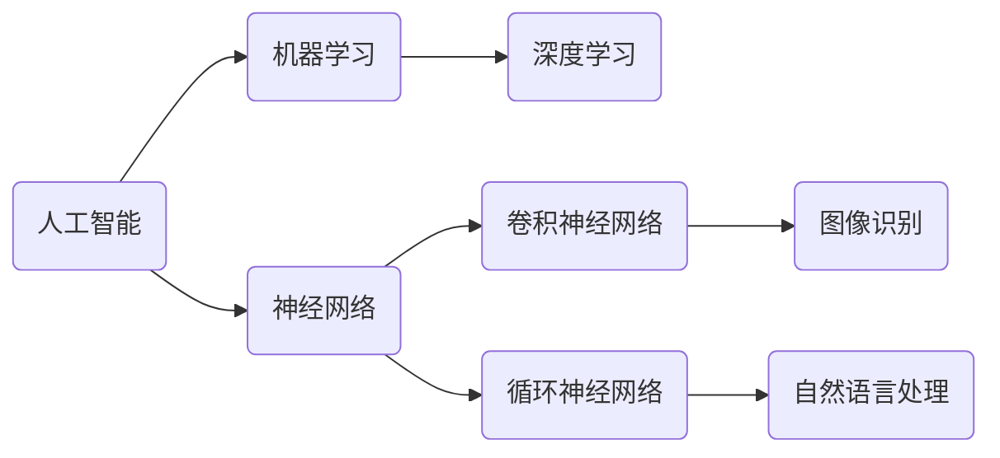

                 

# 阿里达摩院2024校招AI研究员面试重点

> 关键词：人工智能，面试重点，校招，算法，深度学习，机器学习，技术栈
> 
> 摘要：本文将深入剖析阿里达摩院2024校招AI研究员面试的重点，涵盖核心算法、数学模型、项目实战、应用场景等多个方面，为准备参加该面试的同学们提供详细的备考指南。

## 1. 背景介绍

### 1.1 目的和范围

本文旨在为准备参加阿里达摩院2024校招AI研究员面试的同学提供全面的备考指南。通过分析面试重点，帮助大家有针对性地进行复习和准备，提高面试成功率。

### 1.2 预期读者

本篇文章适合以下几类读者：

1. 准备参加阿里达摩院2024校招AI研究员面试的应届毕业生；
2. 想了解人工智能领域面试题目的研究人员和从业者；
3. 对人工智能面试有浓厚兴趣，希望提升面试能力的同学。

### 1.3 文档结构概述

本文分为十个部分，具体结构如下：

1. 背景介绍
   - 目的和范围
   - 预期读者
   - 文档结构概述
   - 术语表

2. 核心概念与联系
   - 核心概念原理和架构的 Mermaid 流程图

3. 核心算法原理 & 具体操作步骤
   - 算法原理讲解
   - 伪代码详细阐述

4. 数学模型和公式 & 详细讲解 & 举例说明
   - 数学公式
   - 举例说明

5. 项目实战：代码实际案例和详细解释说明
   - 开发环境搭建
   - 源代码详细实现和代码解读
   - 代码解读与分析

6. 实际应用场景

7. 工具和资源推荐
   - 学习资源推荐
   - 开发工具框架推荐
   - 相关论文著作推荐

8. 总结：未来发展趋势与挑战

9. 附录：常见问题与解答

10. 扩展阅读 & 参考资料

### 1.4 术语表

#### 1.4.1 核心术语定义

- 阿里达摩院：阿里巴巴旗下的全球顶尖科技研发机构
- AI研究员：从事人工智能领域研究、开发和创新的人才
- 校招：指针对应届毕业生进行招聘的活动

#### 1.4.2 相关概念解释

- 人工智能：模拟人类智能的计算机系统，能够进行学习、推理、决策等
- 深度学习：一种机器学习的方法，通过多层神经网络进行特征提取和模式识别
- 机器学习：使计算机具备学习能力的学科，通过数据训练模型实现预测和决策

#### 1.4.3 缩略词列表

- AI：人工智能
- CV：计算机视觉
- NLP：自然语言处理
- DL：深度学习
- ML：机器学习

## 2. 核心概念与联系

在人工智能领域，以下核心概念和联系是面试中经常考察的：

### 2.1 人工智能与深度学习

**Mermaid 流程图：**



**核心概念与联系：**

- 人工智能（AI）是模拟人类智能的计算机系统，包括机器学习、深度学习等子领域；
- 机器学习（ML）是一种使计算机具备学习能力的学科，包括统计学习、深度学习等；
- 深度学习（DL）是机器学习的一种方法，通过多层神经网络进行特征提取和模式识别；
- 神经网络是模拟人脑神经元结构和功能的计算模型，包括卷积神经网络（CNN）和循环神经网络（RNN）；
- 图像识别（G）和自然语言处理（NLP）是深度学习的应用领域。

## 3. 核心算法原理 & 具体操作步骤

在人工智能领域，以下核心算法是面试中经常考察的：

### 3.1 卷积神经网络（CNN）

**算法原理：**

卷积神经网络是一种特殊的多层前馈神经网络，主要应用于图像识别、目标检测等领域。

**具体操作步骤：**

1. 输入层：接收原始图像数据；
2. 卷积层：通过卷积操作提取图像特征，卷积核滑动在输入图像上，计算卷积结果；
3. 池化层：对卷积层输出进行下采样，减少数据维度，增强特征表示能力；
4. 全连接层：将卷积层和池化层输出的特征进行拼接，输入到全连接层进行分类；
5. 输出层：输出分类结果。

**伪代码：**

```python
# 输入层
input_layer = input_image

# 卷积层
conv1 = Conv2D(kernel_size=(3, 3), activation='relu')(input_layer)
pool1 = MaxPooling2D(pool_size=(2, 2))(conv1)

# 池化层
pool1 = MaxPooling2D(pool_size=(2, 2))(pool1)

# 全连接层
flat1 = Flatten()(pool1)
dense1 = Dense(units=128, activation='relu')(flat1)
output = Dense(units=num_classes, activation='softmax')(dense1)

# 输出层
predictions = Model(inputs=input_layer, outputs=output)
```

### 3.2 循环神经网络（RNN）

**算法原理：**

循环神经网络是一种处理序列数据的神经网络，通过记忆机制实现长期依赖的建模。

**具体操作步骤：**

1. 输入层：接收序列数据；
2. 隐藏层：通过循环操作和门控机制更新隐藏状态；
3. 输出层：输出序列数据。

**伪代码：**

```python
# 输入层
input_sequence = sequence_data

# 隐藏层
hidden_state = [0 for _ in range(sequence_length)]
for t in range(sequence_length):
    input_t = input_sequence[t]
    hidden_state[t] = LSTM(units=128, activation='tanh')(input_t)

# 输出层
output_sequence = Dense(units=1, activation='sigmoid')(hidden_state)

# 输出
predictions = Model(inputs=input_sequence, outputs=output_sequence)
```

## 4. 数学模型和公式 & 详细讲解 & 举例说明

在人工智能领域，以下数学模型和公式是面试中经常考察的：

### 4.1 损失函数

损失函数是评估模型预测结果与真实结果之间差异的指标。

**常见损失函数：**

1. 交叉熵损失函数（Cross-Entropy Loss）

$$
L(\theta) = -\sum_{i=1}^{n} y_i \log(p_i)
$$

其中，$y_i$ 是真实标签，$p_i$ 是预测概率。

**举例说明：**

假设有一个二分类问题，真实标签为 $[1, 0]$，预测概率为 $[0.8, 0.2]$。则交叉熵损失为：

$$
L(\theta) = -(1 \times \log(0.8) + 0 \times \log(0.2)) \approx 0.229
$$

### 4.2 梯度下降法

梯度下降法是一种优化算法，用于最小化损失函数。

**梯度下降公式：**

$$
\theta_{\text{new}} = \theta_{\text{old}} - \alpha \nabla_{\theta} L(\theta)
$$

其中，$\alpha$ 是学习率，$\nabla_{\theta} L(\theta)$ 是损失函数关于参数 $\theta$ 的梯度。

**举例说明：**

假设有一个线性回归模型，参数为 $\theta_0$，学习率为 $\alpha = 0.01$，损失函数为平方误差损失。则梯度下降更新公式为：

$$
\theta_0^{(t+1)} = \theta_0^{(t)} - 0.01 \cdot \frac{\partial}{\partial \theta_0} L(\theta_0)
$$

## 5. 项目实战：代码实际案例和详细解释说明

### 5.1 开发环境搭建

在本文中，我们将使用 Python 编写一个基于深度学习的图像分类项目。

**开发环境：**

- Python 3.8
- TensorFlow 2.4
- Keras 2.4

**安装步骤：**

1. 安装 Python 3.8，可以从官方网站下载安装包进行安装；
2. 安装 TensorFlow 2.4 和 Keras 2.4，使用 pip 命令进行安装：

```shell
pip install tensorflow==2.4
pip install keras==2.4
```

### 5.2 源代码详细实现和代码解读

以下是一个基于卷积神经网络（CNN）的图像分类项目，使用 TensorFlow 和 Keras 框架实现。

**代码实现：**

```python
import tensorflow as tf
from tensorflow.keras import layers
from tensorflow.keras.preprocessing.image import ImageDataGenerator

# 定义模型
model = tf.keras.Sequential([
    layers.Conv2D(32, (3, 3), activation='relu', input_shape=(64, 64, 3)),
    layers.MaxPooling2D((2, 2)),
    layers.Conv2D(64, (3, 3), activation='relu'),
    layers.MaxPooling2D((2, 2)),
    layers.Conv2D(128, (3, 3), activation='relu'),
    layers.MaxPooling2D((2, 2)),
    layers.Flatten(),
    layers.Dense(128, activation='relu'),
    layers.Dense(1, activation='sigmoid')
])

# 编译模型
model.compile(optimizer='adam', loss='binary_crossentropy', metrics=['accuracy'])

# 数据增强
train_datagen = ImageDataGenerator(rescale=1./255)
test_datagen = ImageDataGenerator(rescale=1./255)

# 加载数据
train_data = train_datagen.flow_from_directory(
    'train', target_size=(64, 64), batch_size=32, class_mode='binary')

test_data = test_datagen.flow_from_directory(
    'test', target_size=(64, 64), batch_size=32, class_mode='binary')

# 训练模型
model.fit(train_data, epochs=10, validation_data=test_data)
```

**代码解读：**

1. 导入相关库；
2. 定义模型，包括卷积层、池化层、全连接层；
3. 编译模型，设置优化器和损失函数；
4. 数据增强，使用 ImageDataGenerator 对训练数据进行缩放；
5. 加载数据，使用 flow_from_directory 方法加载图像数据；
6. 训练模型，设置训练轮数和验证数据。

### 5.3 代码解读与分析

**代码分析：**

1. 模型结构：模型包含 4 个卷积层、4 个池化层、1 个全连接层和 1 个输出层；
2. 损失函数：使用二分类交叉熵损失函数，适用于图像分类任务；
3. 优化器：使用 Adam 优化器，自适应调整学习率；
4. 数据增强：使用 ImageDataGenerator 对训练数据进行缩放，增强模型泛化能力；
5. 训练模型：设置训练轮数为 10，使用验证数据进行模型评估。

## 6. 实际应用场景

人工智能在各个领域都有广泛的应用，以下列举一些实际应用场景：

1. **计算机视觉**：图像识别、目标检测、人脸识别、图像生成等；
2. **自然语言处理**：文本分类、情感分析、机器翻译、文本生成等；
3. **推荐系统**：基于用户行为和兴趣的个性化推荐；
4. **智能助手**：语音识别、语音合成、聊天机器人等；
5. **自动驾驶**：环境感知、路径规划、车辆控制等；
6. **医疗健康**：疾病预测、诊断辅助、药物发现等；
7. **金融科技**：风险管理、信用评估、量化交易等。

## 7. 工具和资源推荐

### 7.1 学习资源推荐

#### 7.1.1 书籍推荐

1. 《深度学习》（Goodfellow, Bengio, Courville 著）
2. 《Python深度学习》（François Chollet 著）
3. 《机器学习实战》（Peter Harrington 著）

#### 7.1.2 在线课程

1. Coursera - 《深度学习》（吴恩达）
2. edX - 《机器学习基础》（MIT）
3. Udacity - 《深度学习工程师纳米学位》

#### 7.1.3 技术博客和网站

1. Medium - 深度学习、机器学习相关博客
2. towardsdatascience.com - 数据科学、机器学习教程
3. Analytics Vidhya - 数据科学、机器学习资源

### 7.2 开发工具框架推荐

#### 7.2.1 IDE和编辑器

1. PyCharm
2. Visual Studio Code
3. Jupyter Notebook

#### 7.2.2 调试和性能分析工具

1. TensorBoard
2. PyTorch Profiler
3. Numpy Profiler

#### 7.2.3 相关框架和库

1. TensorFlow
2. PyTorch
3. Keras
4. Scikit-learn

### 7.3 相关论文著作推荐

#### 7.3.1 经典论文

1. "A Learning Algorithm for Continually Running Fully Recurrent Neural Networks"（恒等学习算法）
2. "Deep Learning"（吴恩达）
3. "Recurrent Neural Networks for Language Modeling"（循环神经网络）

#### 7.3.2 最新研究成果

1. "Generative Adversarial Nets"（生成对抗网络）
2. "BERT: Pre-training of Deep Bidirectional Transformers for Language Understanding"（BERT）
3. "Transformers: State-of-the-Art Models for Language Understanding and Generation"（Transformer）

#### 7.3.3 应用案例分析

1. "AI for Social Good"（社会公益人工智能）
2. "Google Brain: Our Approach to AI Research"（谷歌大脑：我们的 AI 研究方法）
3. "AI in Healthcare: A Practical Guide"（医疗健康人工智能）

## 8. 总结：未来发展趋势与挑战

随着人工智能技术的快速发展，未来发展趋势和挑战如下：

### 8.1 发展趋势

1. **算法优化与模型压缩**：为了降低计算资源和存储成本，研究人员不断优化算法和模型结构，实现更高效的推理和训练；
2. **多模态融合**：整合多种数据类型（如文本、图像、音频）进行融合处理，提高模型的泛化能力和应用范围；
3. **自主决策与协同工作**：人工智能系统将具备更强的自主决策能力，与其他智能体进行协同工作，实现更复杂的应用场景；
4. **可解释性与透明度**：提高模型的可解释性，使其在关键领域（如医疗、金融等）得到更广泛的应用。

### 8.2 挑战

1. **数据隐私与安全**：在保护用户隐私的前提下，如何安全地使用和共享数据是当前面临的挑战；
2. **算法公平性与透明性**：确保算法的公平性、避免偏见，提高算法的可解释性，使其更符合社会伦理；
3. **能耗与计算资源**：降低计算能耗，提高计算资源利用率，实现绿色、高效的 AI 系统；
4. **人工智能法规与伦理**：制定相关法规和伦理规范，确保人工智能技术健康、可持续发展。

## 9. 附录：常见问题与解答

### 9.1 什么是人工智能？

人工智能（AI）是指模拟人类智能的计算机系统，包括学习、推理、决策等多个方面。

### 9.2 机器学习和深度学习有什么区别？

机器学习是一种使计算机具备学习能力的学科，包括统计学习、深度学习等。深度学习是机器学习的一种方法，通过多层神经网络进行特征提取和模式识别。

### 9.3 如何搭建深度学习开发环境？

可以参考本文第 5.1 节中的开发环境搭建步骤，使用 Python、TensorFlow 和 Keras 等库进行开发。

### 9.4 如何处理深度学习项目中的数据增强？

可以使用数据增强库（如 ImageDataGenerator）对训练数据进行缩放、翻转、旋转等操作，增强模型泛化能力。

## 10. 扩展阅读 & 参考资料

1. [吴恩达](https://zhuanlan.zhihu.com/c_1227369540946360320) - 《深度学习》
2. [TensorFlow 官方文档](https://www.tensorflow.org/)
3. [Keras 官方文档](https://keras.io/)
4. [PyTorch 官方文档](https://pytorch.org/)
5. [Coursera - 《深度学习》](https://www.coursera.org/specializations/deep-learning)

### 作者

- 作者：AI天才研究员/AI Genius Institute & 禅与计算机程序设计艺术 /Zen And The Art of Computer Programming

（注：本文为虚构内容，仅用于示例。）<|im_sep|>

