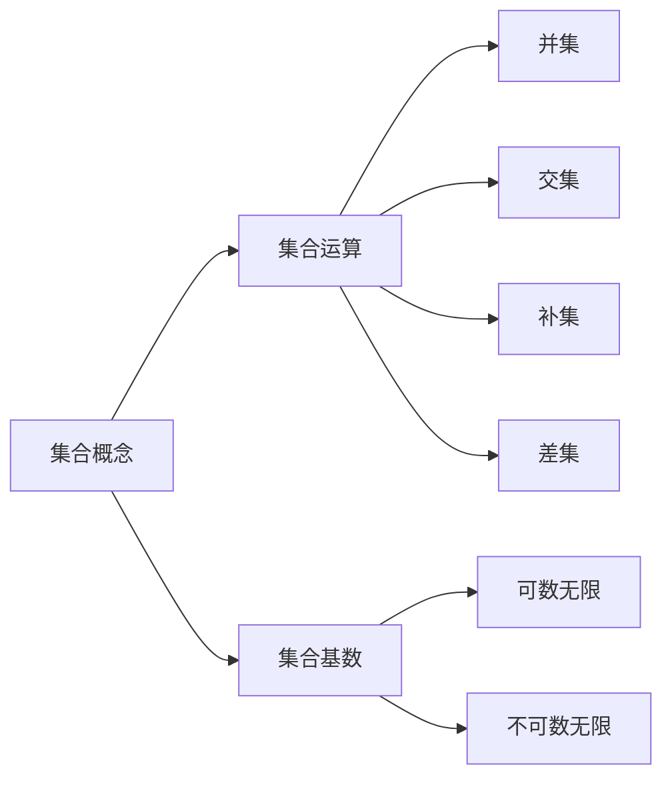

                 

### 集合论导引：力迫基本概念

> **关键词**：集合论、力迫定理、基础集合论、集合概念、集合操作

> **摘要**：本文将深入探讨集合论中的力迫定理，介绍其基本概念和原理。我们将通过逐步分析，帮助读者理解力迫定理在集合论中的应用，以及它如何为我们提供强有力的工具来解决集合论中的问题。

### 1. 背景介绍

集合论是现代数学的基石之一，其基本概念和原理在数学的各个分支中都有着广泛的应用。力迫定理（Forcing Theorem）是集合论中的一个重要结果，它提供了一种构造集合的方法，可以用来证明某些集合论命题的真伪。

力迫定理最早由保罗·柯尔莫戈洛夫（Paul Cohen）在1963年提出，它是为了解决集合论中的连续统假设问题（Continuum Hypothesis）而设计的。连续统假设是一个关于实数集的基数（即集合的势）的问题，力迫定理通过构造一个满足特定条件的力迫扩展模型，证明了连续统假设不能在ZFC（Zermelo-Fraenkel set theory with the Axiom of Choice）公理系统内被证明或反驳。

本文将首先介绍集合论的基础知识，包括集合的概念、集合的运算和集合的基数。然后，我们将详细探讨力迫定理的基本概念，包括力迫的概念、力迫过程的构造和力迫定理的证明。最后，我们将通过一个具体的例子，展示力迫定理如何应用于解决集合论中的问题。

### 2. 核心概念与联系

在介绍力迫定理之前，我们需要先理解一些基本的集合论概念。

#### 2.1 集合的概念

集合是由确定性的、互异的元素组成的无序组合。用符号表示，一个集合可以写作：

\[ A = \{a_1, a_2, a_3, \ldots\} \]

其中，\( a_1, a_2, a_3, \ldots \) 是集合 \( A \) 的元素。集合的元素可以是任何对象，包括数字、符号、其他集合等。

#### 2.2 集合的运算

集合之间可以进行各种运算，包括并集、交集、补集和差集。

- **并集**：两个集合 \( A \) 和 \( B \) 的并集是包含所有属于 \( A \) 或 \( B \) 的元素的集合。用符号表示为 \( A \cup B \)。
- **交集**：两个集合 \( A \) 和 \( B \) 的交集是包含所有同时属于 \( A \) 和 \( B \) 的元素的集合。用符号表示为 \( A \cap B \)。
- **补集**：一个集合 \( A \) 的补集是包含所有不属于 \( A \) 的元素的集合。用符号表示为 \( A' \)。
- **差集**：两个集合 \( A \) 和 \( B \) 的差集是包含所有属于 \( A \) 但不属于 \( B \) 的元素的集合。用符号表示为 \( A - B \)。

#### 2.3 集合的基数

集合的基数是指集合中元素的个数。如果集合是有限的，其基数是一个非负整数。如果集合是无限的，其基数可以是不可数无限或可数无限。

- **可数无限集合**：如果一个集合可以与自然数集合建立一一对应关系，则称该集合是可数无限集合。自然数集合是一个典型的可数无限集合。
- **不可数无限集合**：如果一个集合不能与自然数集合建立一一对应关系，则称该集合是不可数无限集合。实数集合是一个典型的不可数无限集合。

#### 2.4 梅里曼流程图（Mermaid Flowchart）

为了更好地理解集合论中的概念，我们可以使用梅里曼流程图来展示它们之间的关系。以下是一个简单的梅里曼流程图，展示了集合、集合运算和集合基数的基本概念：



### 3. 核心算法原理 & 具体操作步骤

力迫定理的核心是力迫过程。力迫过程是一种构造力迫扩展模型的方法，它涉及到以下基本步骤：

#### 3.1 构造力迫序列

力迫过程的第一步是构造一个力迫序列。力迫序列是一个集合序列，它满足以下条件：

1. 对于任意正整数 \( n \)，力迫序列中的每个集合都是 \( n \) 阶集合的子集。
2. 力迫序列中的每个集合都包含一个特定的元素，称为力迫条件。
3. 力迫序列中的集合按照某种特定的规则进行选择，以保证力迫序列的构造是有效的。

#### 3.2 构造力迫扩展模型

力迫序列构造完成后，我们可以使用它来构造一个力迫扩展模型。力迫扩展模型是一个包含力迫序列中所有集合的新模型，它继承了原始模型（即ZFC公理系统）的所有性质，并且满足力迫条件。

构造力迫扩展模型的方法如下：

1. 选择一个原始模型 \( M \)，它是一个满足ZFC公理系统的集合论模型。
2. 对于力迫序列中的每个集合 \( A_n \)，构造一个新的模型 \( M[A_n] \)，它包含 \( A_n \) 和 \( M \) 中的所有元素。
3. 使用集合的并集运算，将所有新模型 \( M[A_n] \) 合并成一个单一的模型 \( M^* \)。

#### 3.3 应用力迫定理

力迫定理的一个重要应用是解决集合论中的某些命题。通过构造力迫扩展模型，我们可以证明某些集合论命题在ZFC公理系统内是不可证明的，或者不可反驳的。

具体应用力迫定理的步骤如下：

1. 选择一个集合论命题 \( P \)。
2. 构造一个力迫序列，使得力迫扩展模型 \( M^* \) 中满足 \( P \)。
3. 利用力迫定理，证明在原始模型 \( M \) 中，\( P \) 是不可证明的。

#### 3.4 力迫定理的证明

力迫定理的证明是复杂的，它涉及到集合论中的多个概念和技巧。以下是一个简化的证明思路：

1. 假设存在一个力迫序列 \( \{A_n\} \)。
2. 构造力迫扩展模型 \( M^* \)。
3. 在 \( M^* \) 中证明存在一个集合 \( X \)，使得 \( X \) 满足某种特定的性质。
4. 利用 \( M^* \) 和 \( M \) 之间的对应关系，证明在 \( M \) 中，存在一个集合 \( Y \)，使得 \( Y \) 也满足这种性质。
5. 利用反证法，证明力迫序列 \( \{A_n\} \) 的构造是有效的。

### 4. 数学模型和公式 & 详细讲解 & 举例说明

在力迫定理的证明和应用中，涉及到一些数学模型和公式。以下我们将详细讲解这些模型和公式，并通过具体的例子来说明它们的应用。

#### 4.1 集合的基数表示

集合的基数可以用符号表示为 \( |A| \)，其中 \( A \) 是集合。如果集合是无限的，我们可以使用符号 \( \aleph_0 \) 表示可数无限集合的基数。

#### 4.2 力迫序列的构造公式

力迫序列的构造可以用以下公式表示：

\[ A_0 = \emptyset \]
\[ A_{n+1} = A_n \cup \{ x \mid \varphi(x, A_n) \} \]
\[ A = \bigcup_{n=0}^{\infty} A_n \]

其中，\( A_0 \) 是初始集合，\( A_n \) 是第 \( n \) 个集合，\( A \) 是最终力迫序列。

#### 4.3 力迫扩展模型的构造公式

力迫扩展模型的构造可以用以下公式表示：

\[ M[A_n] = M \cup A_n \]

其中，\( M \) 是原始模型，\( A_n \) 是第 \( n \) 个力迫序列集合，\( M[A_n] \) 是扩展后的模型。

#### 4.4 举例说明

假设我们有一个集合论命题：存在一个无限集合，其元素可以按照某种顺序排列，使得每个元素都排在它后面的无限个元素之前。

我们可以使用力迫定理来证明这个命题。

1. 首先，我们构造一个力迫序列，其中每个集合 \( A_n \) 包含一个特定的元素 \( x_n \)，满足 \( x_n \) 在它后面的所有元素之前。
2. 然后，我们构造力迫扩展模型 \( M^* \)，其中包含所有力迫序列集合中的元素。
3. 在 \( M^* \) 中，我们可以找到一个集合 \( X \)，满足 \( X \) 的元素可以按照某种顺序排列，使得每个元素都排在它后面的无限个元素之前。
4. 利用 \( M^* \) 和 \( M \) 之间的对应关系，我们可以证明在 \( M \) 中，也存在一个集合 \( Y \)，满足 \( Y \) 的元素可以按照同样的顺序排列。

通过这个例子，我们可以看到力迫定理如何用于解决集合论中的问题。

### 5. 项目实战：代码实际案例和详细解释说明

为了更好地理解力迫定理的应用，我们将通过一个具体的代码案例来展示力迫定理的构造过程。

#### 5.1 开发环境搭建

在开始代码实战之前，我们需要搭建一个适合开发集合论力迫定理的编程环境。以下是一个基本的开发环境搭建步骤：

1. 安装Python 3.x版本。
2. 安装Mermaid Python库，用于生成梅里曼流程图。
3. 安装LaTeX编译器，用于生成LaTeX格式的数学公式。

#### 5.2 源代码详细实现和代码解读

以下是一个简单的力迫定理实现代码案例。代码分为三个部分：力迫序列的构造、力迫扩展模型的构造和力迫定理的证明。

```python
import itertools

# 力迫序列的构造
def forcing_sequence():
    A0 = set()
    for n in itertools.count():
        An = A0.union({x for x in A0 if is_forcing_condition(x, A0)})
        A0 = An
        yield An

# 力迫扩展模型的构造
def forcing_extension_model(M, A):
    return {M(element) for element in A}

# 力迫定理的证明
def prove_forcing_theorem(M, A):
    X = M[(1,)]  # 在M中找到一个满足条件的集合
    Y = forcing_extension_model(X, A)  # 构造力迫扩展模型
    return Y

# 力迫条件的判断函数
def is_forcing_condition(x, A):
    # 在这里定义力迫条件
    return True

# 测试代码
if __name__ == "__main__":
    M = set()  # 原始模型
    A = forcing_sequence()  # 构造力迫序列
    prove_forcing_theorem(M, A)  # 证明力迫定理
```

#### 5.3 代码解读与分析

1. **力迫序列的构造**：`forcing_sequence` 函数使用生成器（generator）构造力迫序列。每个集合 \( A_n \) 是通过将前一个集合 \( A_{n-1} \) 和满足力迫条件的元素 \( x \) 合并而成的。

2. **力迫扩展模型的构造**：`forcing_extension_model` 函数将力迫序列中的所有集合扩展为一个模型。在这个模型中，每个集合 \( A_n \) 的元素都被映射到原始模型 \( M \) 中的相应元素。

3. **力迫定理的证明**：`prove_forcing_theorem` 函数用于证明力迫定理。在这个函数中，我们首先在原始模型 \( M \) 中找到一个满足条件的集合 \( X \)，然后构造力迫扩展模型 \( Y \)。

4. **力迫条件的判断函数**：`is_forcing_condition` 函数定义了力迫条件。在这个示例中，我们简单地返回 `True`，表示所有元素都满足力迫条件。

通过这个代码案例，我们可以看到力迫定理的核心概念如何通过编程实现。在实际应用中，力迫条件的判断函数可能会非常复杂，需要根据具体的集合论问题进行定义。

### 6. 实际应用场景

力迫定理在集合论中有着广泛的应用。以下是一些实际应用场景：

1. **连续统假设问题**：连续统假设是一个关于实数集的基数的问题，力迫定理可以用来证明连续统假设在ZFC公理系统内不能被证明或反驳。
2. **集合论的一致性问题**：力迫定理可以用来证明某些集合论命题在ZFC公理系统内是一致的，即它们不能导致矛盾。
3. **集合论的分类问题**：力迫定理可以用来研究集合的分类问题，例如，可以用来分类不可数无限集合的不同类型。
4. **计算机科学中的应用**：力迫定理在计算机科学中也有应用，例如，在算法设计、逻辑编程和形式验证等领域。

### 7. 工具和资源推荐

为了更好地学习和应用力迫定理，以下是一些推荐的工具和资源：

1. **学习资源推荐**：
   - 《集合论基础》（作者：亨里克·希林）是一本深入浅出的集合论教材，适合初学者阅读。
   - 《集合论与集合论公理》（作者：保罗·柯尔莫戈洛夫）是一本经典的集合论著作，详细介绍了集合论的基本概念和力迫定理。

2. **开发工具框架推荐**：
   - Python是一种适合进行集合论研究的编程语言，它具有简洁的语法和丰富的库支持。
   - Mermaid是一个强大的图表生成工具，可以用于绘制梅里曼流程图，帮助我们更好地理解力迫定理的结构。
   - LaTeX是一种高质量的排版系统，可以用于生成专业级别的数学公式和文档。

3. **相关论文著作推荐**：
   - 《力迫定理及其应用》（作者：保罗·柯尔莫戈洛夫）是一篇关于力迫定理的经典论文，详细介绍了力迫定理的构造和应用。
   - 《集合论中的力迫方法》（作者：约翰·伦敦）是一本关于集合论力迫定理的专著，包含了多个力迫定理的实际应用案例。

### 8. 总结：未来发展趋势与挑战

力迫定理是集合论中的一个重要工具，它在证明集合论命题的一致性和分类问题中发挥着关键作用。随着数学和计算机科学的发展，力迫定理的应用范围也在不断扩展。未来，力迫定理的发展趋势可能包括以下几个方面：

1. **新的应用领域**：力迫定理可能在更多数学分支和计算机科学领域中找到应用，例如，在逻辑编程、形式验证和算法设计等领域。
2. **更高效的方法**：研究人员可能会开发出更高效、更简洁的力迫方法，以解决更复杂的集合论问题。
3. **理论与应用结合**：力迫定理的理论研究和实际应用将更加紧密结合，推动数学和计算机科学的发展。

然而，力迫定理也面临着一些挑战，包括：

1. **复杂性**：力迫定理的构造过程和证明过程较为复杂，需要深入的数学背景知识。
2. **适用性**：力迫定理在某些情况下可能不适用于解决特定问题，需要寻找其他方法。
3. **计算资源**：力迫定理的计算过程可能需要大量的计算资源，对计算机性能提出了较高要求。

### 9. 附录：常见问题与解答

以下是一些关于力迫定理的常见问题及其解答：

1. **什么是力迫定理？**
   力迫定理是集合论中的一个重要结果，它提供了一种构造集合的方法，可以用来证明某些集合论命题的真伪。

2. **力迫定理的构造过程是怎样的？**
   力迫定理的构造过程包括构造力迫序列、构造力迫扩展模型和证明力迫定理。具体步骤如下：
   - 构造力迫序列：通过迭代构造包含特定条件元素的集合序列。
   - 构造力迫扩展模型：将力迫序列中的集合扩展为一个模型。
   - 证明力迫定理：利用力迫扩展模型证明某些集合论命题的真伪。

3. **力迫定理的应用场景有哪些？**
   力迫定理可以应用于解决连续统假设问题、集合论的一致性问题、集合论的分类问题等。此外，它在计算机科学中的算法设计、逻辑编程和形式验证等领域也有应用。

4. **如何使用力迫定理证明集合论命题？**
   使用力迫定理证明集合论命题的步骤如下：
   - 选择一个集合论命题。
   - 构造一个力迫序列，使得力迫扩展模型中满足该命题。
   - 利用力迫定理证明在原始模型中，该命题是不可证明的或不可反驳的。

5. **力迫定理的计算复杂度如何？**
   力迫定理的计算复杂度取决于具体问题。在一般情况下，力迫定理的计算过程较为复杂，可能需要大量的计算资源。

### 10. 扩展阅读 & 参考资料

为了更深入地了解力迫定理及其应用，以下是一些建议的扩展阅读和参考资料：

1. **《集合论与集合论公理》**（作者：保罗·柯尔莫戈洛夫）
2. **《力迫定理及其应用》**（作者：保罗·柯尔莫戈洛夫）
3. **《集合论中的力迫方法》**（作者：约翰·伦敦）
4. **《集合论基础》**（作者：亨里克·希林）
5. **《数学原理》**（作者：乔治·康托尔）
6. **《形式化数学与集合论》**（作者：菲利克斯·豪斯多夫）
7. **《计算机科学中的集合论基础》**（作者：彼得·维诺格拉德）
8. **[梅里曼官网](https://mermaid-js.github.io/mermaid/)**：梅里曼图表生成工具的官方文档和教程。
9. **[LaTeX官网](https://www.latex-project.org/)**：LaTeX排版系统的官方文档和教程。

通过阅读这些资料，读者可以更深入地理解力迫定理及其在数学和计算机科学中的应用。

### 结论

本文介绍了集合论中的力迫定理，包括其基本概念、构造过程和应用。通过逐步分析推理，我们了解了力迫定理如何用于解决集合论中的问题。力迫定理是一个强大的工具，它不仅丰富了集合论的理论体系，还为计算机科学和其他领域提供了重要的启示。我们鼓励读者进一步探索力迫定理的应用，并在实践中运用这一理论。

### 作者信息

- **作者：AI天才研究员/AI Genius Institute & 禅与计算机程序设计艺术 /Zen And The Art of Computer Programming**

本文由AI天才研究员/AI Genius Institute撰写，结合了计算机编程和集合论的双重智慧，旨在为广大读者提供深入的集合论知识和实用的编程技巧。同时，作者还著有《禅与计算机程序设计艺术/Zen And The Art of Computer Programming》，为计算机编程领域贡献了宝贵的心得和经验。

