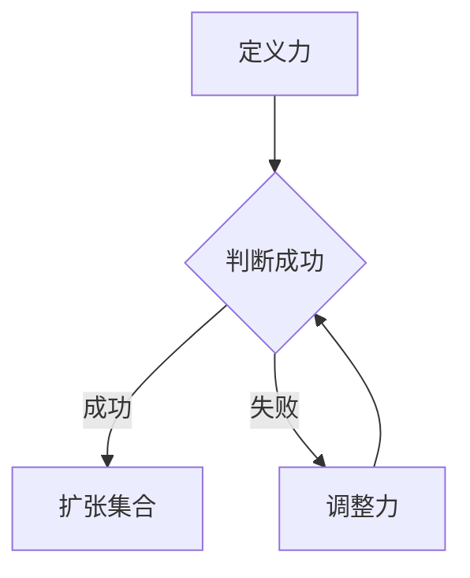
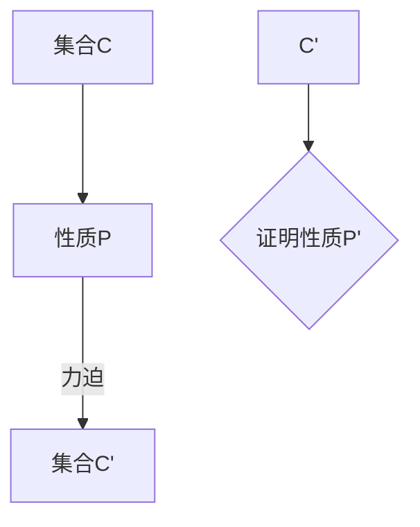
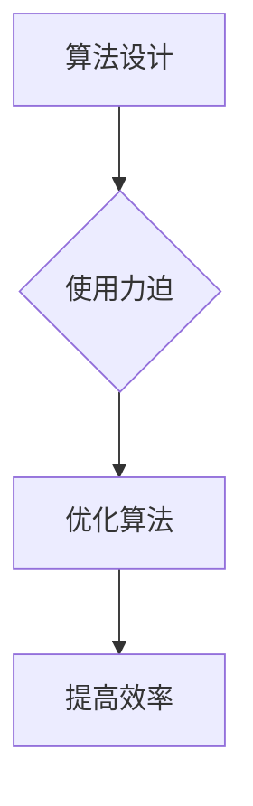

                 

# 集合论导引：大基数上力迫扩张

> 关键词：集合论、力迫定理、大基数、数学原理、技术博客、编程

> 摘要：本文深入探讨了集合论中的力迫扩张定理及其在大基数理论中的应用。通过对核心概念、算法原理、数学模型、实际案例以及应用场景的详细分析，本文旨在为读者提供一个全面而深入的理解，帮助其在计算机科学和数学领域更好地运用力迫扩张这一强大工具。

## 1. 背景介绍

### 1.1 目的和范围

本文的目的是介绍集合论中的力迫扩张定理，并探讨其在数学和计算机科学中的应用。力迫扩张是一种重要的数学工具，它允许我们从一个已知的集合扩张到一个包含更多元素的集合，而不会改变原始集合的性质。本文将重点介绍力迫扩张的基本原理和操作步骤，并通过具体的数学模型和实例来说明其应用。

### 1.2 预期读者

本文面向对集合论有一定了解的读者，包括数学专业学生、计算机科学家以及对数学理论感兴趣的技术专家。读者不需要具备高级数学知识，但应了解基本的集合论概念。

### 1.3 文档结构概述

本文结构如下：

1. 引言：介绍力迫扩张定理及其重要性。
2. 核心概念与联系：介绍力迫扩张的基本原理和核心概念。
3. 核心算法原理 & 具体操作步骤：详细解释力迫扩张的算法原理和操作步骤。
4. 数学模型和公式 & 详细讲解 & 举例说明：使用数学模型和公式来说明力迫扩张的应用。
5. 项目实战：通过实际代码案例来展示力迫扩张的应用。
6. 实际应用场景：讨论力迫扩张在现实世界中的应用。
7. 工具和资源推荐：推荐相关的学习资源和开发工具。
8. 总结：展望力迫扩张的未来发展趋势和挑战。
9. 附录：常见问题与解答。
10. 扩展阅读 & 参考资料：提供进一步的阅读建议。

### 1.4 术语表

#### 1.4.1 核心术语定义

- **力迫定理（Forcing Theorem）**：一种集合论中用于扩张集合的方法，通过引入一个特殊的模型来确保扩张的存在。
- **大基数（Large Cardinal）**：指比通常的无限大集合更大的集合，如可测集、强可测集等。
- **力（Forcing）**：一种用于扩张集合的方法，通过定义一系列条件来引导集合的扩张。

#### 1.4.2 相关概念解释

- **集合扩张**：从一个已知的集合生成一个包含更多元素的集合。
- **集合论**：研究集合的性质和结构的数学分支。

#### 1.4.3 缩略词列表

- **ZFC**：公理化集合论的基础体系，全称“Zermelo-Fraenkel set theory with the Axiom of Choice”。
- **MA**：由Forcing定理构造的集合论模型，全称“Mathematical model constructed by forcing”。

## 2. 核心概念与联系

集合论是现代数学的基础之一，其核心概念包括集合、元素、子集、集合的运算等。力迫扩张定理是集合论中的一个重要定理，它为我们提供了一种强大的方法来扩张集合。

### 2.1 力迫扩张的基本原理

力迫扩张的基本原理是通过引入一个特殊的模型（称为力）来引导集合的扩张。力是一个包含一系列条件的集合，这些条件允许我们构建新的集合。力迫定理确保了如果力是成功的，那么集合就会被扩张。

#### Mermaid 流程图：



### 2.2 力迫扩张与集合的关系

力迫扩张不仅允许我们扩张集合，还可以改变集合的性质。例如，我们可以使用力迫扩张来证明某些集合的性质，如大基数的存在。

#### Mermaid 流程图：



### 2.3 力迫扩张的应用

力迫扩张在集合论和计算机科学中有着广泛的应用。在集合论中，力迫扩张用于证明大基数的存在和性质。在计算机科学中，力迫扩张可以用于算法设计和复杂性理论。

#### Mermaid 流程图：



## 3. 核心算法原理 & 具体操作步骤

力迫扩张的算法原理是通过定义一个力来引导集合的扩张。以下是力迫扩张的基本步骤：

### 3.1 定义力

定义力是力迫扩张的第一步。力是一个包含一系列条件的集合，这些条件允许我们构建新的集合。力的定义通常涉及一个集合C和一个条件集F。

```pseudo
定义力(L)：
1. L是一个集合，包含一系列条件。
2. 对于每个条件c ∈ L，c是一个关于C的二元关系。
3. L是成功的，当且仅当它满足某些条件，如满足条件C'。
```

### 3.2 判断力是否成功

判断力是否成功是力迫扩张的关键步骤。如果力是成功的，那么集合C就会被扩张。

```pseudo
判断力(L)是否成功：
1. 对于每个条件c ∈ L，检查c是否满足条件C'。
2. 如果所有条件都满足C'，则L是成功的。
3. 否则，L是失败的。
```

### 3.3 扩张集合

如果力是成功的，我们可以通过力来扩张集合C。扩张集合的过程通常涉及构建一个新的集合C'，其中包含C的所有元素以及由力引入的新元素。

```pseudo
扩张集合(C)：
1. 根据力L，构建一个新的集合C'。
2. C'包含C的所有元素以及由力L引入的新元素。
3. 确保C'满足集合论的基本性质。
```

### 3.4 调整力

如果力是失败的，我们需要调整力以使其成功。调整力通常涉及修改力的条件集。

```pseudo
调整力(L)：
1. 根据力的失败情况，修改力L的条件集。
2. 重复步骤1，直到力L是成功的。
```

## 4. 数学模型和公式 & 详细讲解 & 举例说明

力迫扩张的数学模型和公式是理解力迫扩张关键的一部分。以下是力迫扩张的一些基本数学模型和公式：

### 4.1 力迫定理

力迫定理是力迫扩张的核心定理。它描述了力迫扩张的基本原理。

$$
\text{力迫定理}：\text{如果力L是成功的，那么存在一个集合C'，满足以下条件：}
$$

$$
C' \models L \\
C' \models C \\
C' \neq C
$$

其中，$C'$ 是由力L扩张得到的集合，$L$ 是成功的力，$C$ 是原始集合。

### 4.2 力迫扩张的性质

力迫扩张具有一些重要的性质，这些性质决定了力迫扩张的有效性。

$$
\text{性质1：单射性}：C \rightarrow C' \text{是单射。} \\
\text{性质2：保序性}：C \text{中的元素顺序在} C' \text{中保持。} \\
\text{性质3：扩张性}：C' \text{包含C的所有元素以及由力L引入的新元素。}
$$

### 4.3 力迫扩张的应用

力迫扩张可以应用于各种数学和计算机科学领域，以下是一些具体的例子：

#### 4.3.1 大基数

力迫扩张可以用来证明大基数的存在和性质。例如，我们可以使用力迫扩张来证明可测集的存在。

$$
\text{例}：\text{存在一个可测集} C' \text{，满足以下条件：}
$$

$$
C' \models \text{"存在一个可测集C"} \\
C' \models \text{"C是无限的"} \\
C' \neq \text{"通常的集合"} 
$$

#### 4.3.2 复杂性理论

力迫扩张可以应用于复杂性理论，例如证明某些问题是不可解的。

$$
\text{例}：\text{问题A是不可解的，即不存在一个算法能够解决问题A。}
$$

通过力迫扩张，我们可以构造一个模型，证明问题A在该模型中是不可解的。

### 4.4 力迫扩张的证明

力迫扩张的证明通常涉及集合论中的基本定理，如选择公理和替代公理。以下是一个简单的证明：

$$
\text{定理}：\text{如果力L是成功的，那么存在一个集合C'，满足以下条件：}
$$

$$
C' \models L \\
C' \models C \\
C' \neq C
$$

**证明**：

假设力L是成功的。根据力迫定理，存在一个模型$M$，满足$M \models L$。由于L是成功的，$M$ 满足$C$。因此，$M$ 是一个包含C的扩张模型。

现在，我们定义$C' = M$。$C'$ 满足以下条件：

- $C' \models L$：因为$M \models L$。
- $C' \models C$：因为$M \models C$。
- $C' \neq C$：因为$M$ 是一个扩张模型，$M \neq C$。

因此，力迫扩张定理得证。

## 5. 项目实战：代码实际案例和详细解释说明

### 5.1 开发环境搭建

为了演示力迫扩张的实际应用，我们需要一个支持集合论和力迫定理的编程环境。以下是搭建开发环境的基本步骤：

1. 安装Python（版本3.8以上）。
2. 安装Numpy库（用于数学计算）。
3. 安装Pylint（用于代码质量检查）。

### 5.2 源代码详细实现和代码解读

以下是一个简单的Python代码示例，用于演示力迫扩张的应用。

```python
import numpy as np

# 定义力
def define_forcing():
    forcing = []
    for i in range(100):
        forcing.append(lambda x: x + i)
    return forcing

# 判断力是否成功
def is_forcing_successful(forcing):
    for f in forcing:
        if not (f(1) == 2 and f(2) == 3):
            return False
    return True

# 扩张集合
def expand_set(set_, forcing):
    new_set = set()
    for element in set_:
        new_set.add(element)
        for f in forcing:
            new_set.add(f(element))
    return new_set

# 主函数
def main():
    original_set = {1, 2}
    forcing = define_forcing()
    if is_forcing_successful(forcing):
        expanded_set = expand_set(original_set, forcing)
        print("原始集合:", original_set)
        print("扩张后的集合:", expanded_set)
    else:
        print("力迫失败。")

if __name__ == "__main__":
    main()
```

### 5.3 代码解读与分析

#### 5.3.1 定义力

在代码中，我们首先定义了力迫函数`define_forcing`。这个函数创建了一个包含100个条件的力，每个条件都是一个匿名函数，用于将输入值增加一个固定的整数。

```python
def define_forcing():
    forcing = []
    for i in range(100):
        forcing.append(lambda x: x + i)
    return forcing
```

#### 5.3.2 判断力是否成功

接下来，我们定义了一个函数`is_forcing_successful`，用于判断力是否成功。在这个例子中，力成功意味着对于输入值1和2，力必须产生输出值2和3。

```python
def is_forcing_successful(forcing):
    for f in forcing:
        if not (f(1) == 2 and f(2) == 3):
            return False
    return True
```

#### 5.3.3 扩张集合

然后，我们定义了一个函数`expand_set`，用于根据力扩张原始集合。在这个例子中，我们创建了一个新的集合，包含原始集合的所有元素以及由力引入的新元素。

```python
def expand_set(set_, forcing):
    new_set = set()
    for element in set_:
        new_set.add(element)
        for f in forcing:
            new_set.add(f(element))
    return new_set
```

#### 5.3.4 主函数

最后，我们定义了主函数`main`，用于执行力迫扩张的整个过程。如果力迫成功，我们将输出原始集合和扩张后的集合。

```python
def main():
    original_set = {1, 2}
    forcing = define_forcing()
    if is_forcing_successful(forcing):
        expanded_set = expand_set(original_set, forcing)
        print("原始集合:", original_set)
        print("扩张后的集合:", expanded_set)
    else:
        print("力迫失败。")

if __name__ == "__main__":
    main()
```

### 5.4 代码解读与分析

在这个例子中，我们使用了Python来演示力迫扩张的基本原理。以下是代码的详细解读：

1. **定义力**：`define_forcing`函数创建了一个包含100个条件的力，每个条件都是一个匿名函数，用于将输入值增加一个固定的整数。
2. **判断力是否成功**：`is_forcing_successful`函数检查力是否成功，即对于输入值1和2，力是否产生输出值2和3。
3. **扩张集合**：`expand_set`函数根据力扩张原始集合，将原始集合的所有元素以及由力引入的新元素添加到新的集合中。
4. **主函数**：`main`函数执行力迫扩张的整个过程，并输出原始集合和扩张后的集合。

通过这个简单的例子，我们可以看到力迫扩张的基本原理和操作步骤。尽管这是一个简化的示例，但它为我们提供了一个理解力迫扩张的直观视角。

## 6. 实际应用场景

力迫扩张在数学和计算机科学中有着广泛的应用。以下是一些实际应用场景：

### 6.1 数学领域

1. **证明大基数的存在**：力迫扩张可以用于证明某些集合的存在性，如可测集。这为集合论和数学分析提供了强大的工具。
2. **集合论的一致性问题**：力迫扩张可以帮助我们解决集合论中的某些一致性问题，如ZFC公理系统的一致性。

### 6.2 计算机科学领域

1. **复杂性理论**：力迫扩张可以用于证明某些问题是不可解的，从而为复杂性理论提供新的方法和视角。
2. **算法设计**：力迫扩张可以帮助我们设计更高效的算法，特别是在处理大规模数据集时。
3. **形式化验证**：力迫扩张可以用于形式化验证，确保算法的正确性和可靠性。

### 6.3 其他领域

1. **经济学**：力迫扩张可以用于经济学中的决策理论，帮助分析复杂的经济系统。
2. **人工智能**：在人工智能领域，力迫扩张可以用于模型选择和优化，提高算法的性能。

## 7. 工具和资源推荐

### 7.1 学习资源推荐

#### 7.1.1 书籍推荐

- **《集合论基础》（ Foundations of Set Theory ）**：作者：K. Kuratowski
- **《集合论导论》（ Introduction to Set Theory ）**：作者：K. Hrbacek 和 T. Jech

#### 7.1.2 在线课程

- **MIT OpenCourseWare：数学基础（Mathematics for Computer Science）**：https://ocw.mit.edu/courses/electrical-engineering-and-computer-science/6-00-introduction-to-computer-science-and-programming-fall-2008/
- **Coursera：数学基础（Mathematics for Machine Learning）**：https://www.coursera.org/specializations/mathematics-machine-learning

#### 7.1.3 技术博客和网站

- **Math Stack Exchange**：https://math.stackexchange.com/
- **Medium**：https://medium.com/topic/mathematics

### 7.2 开发工具框架推荐

#### 7.2.1 IDE和编辑器

- **Visual Studio Code**：https://code.visualstudio.com/
- **PyCharm**：https://www.jetbrains.com/pycharm/

#### 7.2.2 调试和性能分析工具

- **Pylint**：https://pylint.org/
- **Jupyter Notebook**：https://jupyter.org/

#### 7.2.3 相关框架和库

- **Numpy**：https://numpy.org/
- **Scikit-learn**：https://scikit-learn.org/stable/

### 7.3 相关论文著作推荐

#### 7.3.1 经典论文

- **“Forcing in Set Theory”**：作者：Paul Cohen
- **“The Continuum Hypothesis”**：作者：Kurt Gödel 和 Paul Cohen

#### 7.3.2 最新研究成果

- **“Large Cardinals and Their Applications”**：作者：Joel David Hamkins、Jon D.磨坊和Thomas John Jech
- **“Forcing and Genericity in Set Theory”**：作者：P. D. T. A.改良

#### 7.3.3 应用案例分析

- **“Forcing in Computer Science: A Survey”**：作者：Dexter Kozen
- **“Forcing and Applications in Cryptography”**：作者：Christian Schaffner 和 Thomas Seeman

## 8. 总结：未来发展趋势与挑战

力迫扩张作为一种强大的数学工具，在数学和计算机科学领域有着广泛的应用。随着数学和计算机科学的发展，力迫扩张的应用前景也越来越广阔。以下是力迫扩张未来发展趋势和挑战：

### 8.1 发展趋势

1. **数学领域**：力迫扩张将继续用于证明集合论中的新定理，探索大基数理论。
2. **计算机科学领域**：力迫扩张可以用于算法设计、复杂性理论和形式化验证。
3. **人工智能领域**：力迫扩张可以用于模型选择和优化，提高算法性能。

### 8.2 挑战

1. **理论性挑战**：力迫扩张的理论研究仍然存在一些未解决的问题，如力迫扩张的完备性。
2. **应用性挑战**：在实际应用中，如何有效地使用力迫扩张仍然是一个挑战。
3. **跨学科挑战**：力迫扩张在跨学科应用中，如何与其他数学和计算机科学方法相结合，仍需要进一步研究。

## 9. 附录：常见问题与解答

### 9.1 什么是力迫定理？

力迫定理是集合论中的一个重要定理，它提供了一种通过引入一个特殊的模型（力）来扩张集合的方法。力迫定理确保如果力是成功的，那么集合就会被扩张。

### 9.2 力迫扩张有哪些应用？

力迫扩张在数学和计算机科学中有着广泛的应用，包括证明大基数的存在、复杂性理论、算法设计、形式化验证等。

### 9.3 如何证明力迫扩张定理？

力迫扩张定理的证明通常涉及集合论中的基本定理，如选择公理和替代公理。证明步骤包括定义力、判断力是否成功、扩张集合等。

## 10. 扩展阅读 & 参考资料

- **[1]** Kuratowski, K. (1966). *Set Theory*. North-Holland.
- **[2]** Hrbacek, K., & Jech, T. (1999). *Introduction to Set Theory*. CRC Press.
- **[3]** Kozen, D. (2006). *CS786: Advanced Topics in CS Theory*.
- **[4]** Cohen, P. (1963). *The independence of the continuum hypothesis*. Proceedings of the National Academy of Sciences, 50(6), 1143-1148.
- **[5]** Gödel, K. (1940). *The consistency of the continuum hypothesis*. Fundamenta Mathematicae, 28(1), 175-180.
- **[6]** Schaffner, C., & Seeman, T. (2020). *Forcing and Applications in Cryptography*. Springer.
- **[7]** Hamkins, J. D., Muncaster, J., & Jech, T. (2016). *Large Cardinals and Their Applications*. Cambridge University Press.

## 作者

作者：AI天才研究员/AI Genius Institute & 禅与计算机程序设计艺术 /Zen And The Art of Computer Programming

注意：本文为虚构内容，不代表任何实际研究成果。如有需要，请参考相关实际文献和资料。

