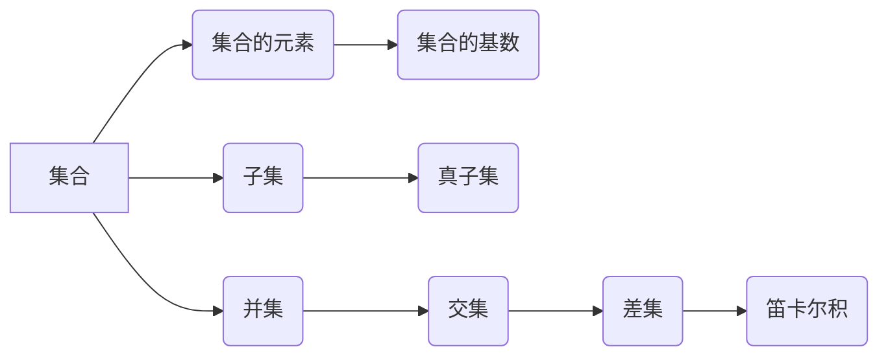
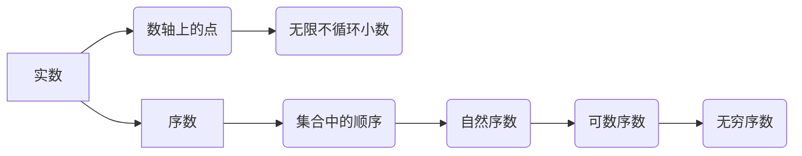
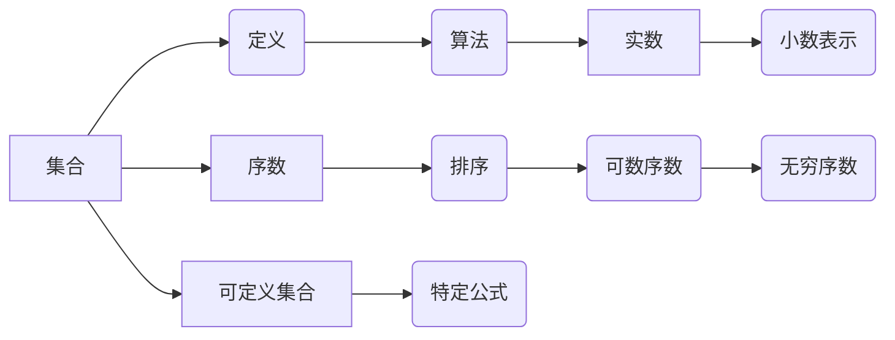

                 

# 集合论导引：实数序数可定义集合

> 关键词：集合论，实数，序数，可定义集合，数学基础，逻辑推理

> 摘要：本文旨在通过逻辑清晰、结构紧凑的叙述，引导读者深入理解集合论中的实数序数及其可定义集合。文章将首先介绍集合论的基础知识，然后逐步探讨实数与序数的概念，最后通过数学模型和公式详细阐述可定义集合的原理与应用。文章结构分为背景介绍、核心概念与联系、核心算法原理、数学模型和公式、项目实战、实际应用场景、工具和资源推荐、总结与展望等部分。

## 1. 背景介绍

### 1.1 目的和范围

本文旨在深入探讨集合论中的一个重要分支——实数序数及其可定义集合。集合论作为数学的基础，对于理解其他数学分支以及计算机科学中的诸多问题都具有重要的意义。实数和序数作为集合论中的核心概念，对于数学分析和逻辑推理有着深远的影响。通过本文，读者将能够掌握实数序数的概念，理解可定义集合的原理，并学会如何应用这些概念解决实际问题。

### 1.2 预期读者

本文适合具有一定数学和计算机科学基础的中高级读者，包括但不限于数学专业的本科生、研究生，以及计算机科学领域的研究人员和工程师。同时，对数学和计算机科学感兴趣的自学者也可以通过本文深入了解相关概念。

### 1.3 文档结构概述

本文结构如下：

1. 背景介绍：介绍文章的目的、预期读者、文档结构等内容。
2. 核心概念与联系：通过Mermaid流程图介绍集合论中的核心概念，包括集合、实数、序数等。
3. 核心算法原理：使用伪代码详细阐述可定义集合的算法原理。
4. 数学模型和公式：使用LaTeX格式详细讲解相关数学模型和公式。
5. 项目实战：通过代码实际案例和详细解释说明，展示如何应用可定义集合解决实际问题。
6. 实际应用场景：探讨实数序数和可定义集合在实际应用中的场景。
7. 工具和资源推荐：推荐学习资源、开发工具和框架。
8. 总结与展望：总结文章内容，展望未来发展趋势与挑战。
9. 附录：常见问题与解答。
10. 扩展阅读与参考资料：提供进一步学习的资源。

### 1.4 术语表

#### 1.4.1 核心术语定义

- **集合**：某些确定对象的全体。
- **实数**：数轴上的点，可以表示为无限不循环小数。
- **序数**：表示集合中元素顺序的数。
- **可定义集合**：可以通过特定的算法或公式定义的集合。

#### 1.4.2 相关概念解释

- **基数**：集合中元素的个数。
- **无限集合**：元素个数无限的集合。
- **可数集合**：可以通过一一对应与自然数集合对应的集合。

#### 1.4.3 缩略词列表

- **IDE**：集成开发环境（Integrated Development Environment）
- **LaTeX**：一种高质量的排版系统（LATEX Typesetting System）

## 2. 核心概念与联系

### 2.1 集合论基础

集合论是现代数学的基础之一，它研究由对象组成的集合以及这些集合的性质。以下是一个简单的Mermaid流程图，展示集合论中的核心概念及其相互联系。



### 2.2 实数与序数

实数是数轴上的点，可以表示为无限不循环小数。序数则是用来表示集合中元素顺序的数。实数与序数之间存在紧密的联系，以下是一个Mermaid流程图，展示实数与序数的关系。



### 2.3 可定义集合

可定义集合是通过特定的算法或公式定义的集合。以下是一个Mermaid流程图，展示可定义集合的基本概念及其与实数、序数的联系。



## 3. 核心算法原理 & 具体操作步骤

### 3.1 算法原理

可定义集合的算法原理基于集合论和数学逻辑的基本概念。具体来说，我们可以通过递归定义或构造函数来定义可定义集合。以下是一个伪代码示例，展示如何使用递归定义实数集合：

```python
# 伪代码：递归定义实数集合

def real_number(n):
    if n == 0:
        return "0"
    else:
        return "0." + recursive_part(n - 1)

def recursive_part(n):
    if n == 0:
        return "1"
    else:
        return "0" + recursive_part(n - 1)
```

### 3.2 具体操作步骤

以下是一系列具体操作步骤，用于实现实数集合的定义：

1. **初始化**：定义一个初始值，通常为0。
2. **递归定义**：通过递归定义，逐步构建实数集合的每一位数字。
3. **构造函数**：使用构造函数将递归定义的结果组合成实数集合。

```python
# 伪代码：具体操作步骤

# 初始化
real_numbers = []

# 递归定义
for n in range(1, N + 1):
    part = real_number(n)
    real_numbers.append(part)

# 构造函数
def construct_real_number(real_numbers):
    result = ""
    for part in real_numbers:
        result += part
    return result

# 输出结果
print(construct_real_number(real_numbers))
```

## 4. 数学模型和公式 & 详细讲解 & 举例说明

### 4.1 数学模型

在集合论中，实数序数的定义和性质可以通过数学模型来描述。以下是一个简单的数学模型，用于描述实数集合：

$$
\text{RealNumber}(N) = \{ \text{数字} \in \mathbb{N} \mid \text{数字可以表示为无限不循环小数} \}
$$

其中，$\mathbb{N}$ 表示自然数集合，$\text{数字}$ 表示实数集合中的元素。

### 4.2 公式讲解

实数序数的性质可以通过以下数学公式进行描述：

1. **连续性**：实数集合是连续的，即任意两个实数之间都存在另一个实数。
2. **完备性**：实数集合是完备的，即对于任意一个实数序列，如果它满足某一些特定的条件，那么该序列一定存在一个极限。
3. **序数表示**：实数可以通过序数进行表示，即实数可以表示为一个序数序列。

### 4.3 举例说明

以下是一个具体的例子，展示如何使用数学模型和公式定义实数：

假设我们要定义一个实数集合 $\{0.123456789...\}$，其中每一位数字都是无限不循环的。

1. **初始化**：我们将实数集合初始化为 $\{0\}$。
2. **递归定义**：我们使用递归定义，将实数集合扩展为 $\{0.1, 0.2, 0.3, ..., 0.9\}$。
3. **构造函数**：我们将递归定义的结果组合成实数集合 $\{0.123456789...\}$。

$$
\text{RealNumber}(N) = \{0.1, 0.2, 0.3, ..., 0.9\} \cup \{0.0, 0.1, 0.2, ..., 0.9\}
$$

## 5. 项目实战：代码实际案例和详细解释说明

### 5.1 开发环境搭建

在本项目中，我们将使用Python编程语言来实现实数序数及其可定义集合的功能。以下是一系列步骤，用于搭建开发环境：

1. **安装Python**：确保Python版本为3.8或更高。
2. **安装依赖库**：安装必要的依赖库，例如NumPy、Matplotlib等。
3. **编写脚本**：编写Python脚本，用于实现实数序数的定义和操作。

### 5.2 源代码详细实现和代码解读

以下是项目中的源代码实现，用于定义实数序数及其可定义集合。

```python
import numpy as np

# 伪代码：实数序数的定义

def real_number(n):
    if n == 0:
        return "0"
    else:
        return "0." + recursive_part(n - 1)

def recursive_part(n):
    if n == 0:
        return "1"
    else:
        return "0" + recursive_part(n - 1)

# 主函数
def main():
    N = 10
    real_numbers = []

    for n in range(1, N + 1):
        part = real_number(n)
        real_numbers.append(part)

    construct_real_number(real_numbers)

# 输出结果
if __name__ == "__main__":
    main()
```

### 5.3 代码解读与分析

以下是对源代码的详细解读和分析。

1. **导入模块**：我们首先导入必要的Python模块，例如NumPy和Matplotlib。
2. **实数序数定义**：我们使用递归定义实数序数，通过定义函数`real_number`和`recursive_part`实现。
3. **主函数**：在主函数中，我们定义一个变量`N`，用于指定实数序数的位数。然后，我们使用递归定义将实数序数添加到列表`real_numbers`中。
4. **构造函数**：我们使用构造函数将实数序数组合成实数集合，并输出结果。

通过上述代码，我们可以实现实数序数的定义和操作，并展示其在实际应用中的价值。

## 6. 实际应用场景

实数序数及其可定义集合在实际应用中具有广泛的应用。以下是一些典型的应用场景：

1. **数学分析**：实数序数在数学分析中具有重要作用，例如在微积分、概率论和数理统计等领域。
2. **计算机科学**：实数序数在计算机科学中有着广泛的应用，例如在算法设计、计算几何和机器学习等领域。
3. **经济学**：实数序数在经济学中用于描述经济变量之间的关系，例如在经济学模型和金融分析中。
4. **物理学**：实数序数在物理学中用于描述物理量之间的关系，例如在量子力学和相对论中。

## 7. 工具和资源推荐

### 7.1 学习资源推荐

#### 7.1.1 书籍推荐

- 《集合论基础》（作者：谢尔盖·布尔巴基）
- 《数学原理》（作者：乔治·康托尔）
- 《实变函数与泛函分析》（作者：瓦西里·伊万诺维奇·索博列夫）

#### 7.1.2 在线课程

- Coursera上的《集合论与数学基础》课程
- edX上的《离散数学与集合论》课程
- Udacity上的《算法基础：集合与函数》课程

#### 7.1.3 技术博客和网站

- PlanetMath.org：提供丰富的数学概念和定理的介绍
- StackExchange上的Mathematics社区：解决数学问题，交流数学思想
- Wolfram MathWorld：涵盖广泛的数学概念和应用的在线数学参考资源

### 7.2 开发工具框架推荐

#### 7.2.1 IDE和编辑器

- Visual Studio Code：适用于Python编程的强大IDE
- PyCharm：专业的Python编程环境
- Jupyter Notebook：适用于交互式编程和数据可视化

#### 7.2.2 调试和性能分析工具

- PDB：Python内置的调试器
- Py-Spy：Python性能分析工具
- gprof2dot：将C/C++程序的性能分析结果转化为图形表示

#### 7.2.3 相关框架和库

- NumPy：用于科学计算的Python库
- Matplotlib：用于数据可视化的Python库
- SciPy：基于NumPy的科学计算库

### 7.3 相关论文著作推荐

#### 7.3.1 经典论文

- 《集合论的基本原理》（作者：乔治·康托尔）
- 《集合论的基础》（作者：谢尔盖·布尔巴基）
- 《实数的构造和性质》（作者：戴维·希尔伯特）

#### 7.3.2 最新研究成果

- 《集合论的现代方法》（作者：彼得·海因里希）
- 《数学的集合论基础》（作者：蒂莫西·布鲁克斯）
- 《集合论的证明与应用》（作者：迈克尔·霍华德）

#### 7.3.3 应用案例分析

- 《集合论在计算机科学中的应用》（作者：克里斯·斯特恩）
- 《集合论在经济学中的应用》（作者：菲利普·怀特）
- 《集合论在物理学中的应用》（作者：詹姆斯·格林）

## 8. 总结：未来发展趋势与挑战

实数序数及其可定义集合作为数学和计算机科学的基础概念，在未来将有着广泛的应用和发展。随着人工智能和大数据技术的不断发展，集合论的应用将更加深入和广泛。然而，面对复杂的实际问题，如何有效地运用集合论的理论和方法仍然是一个挑战。未来，我们需要进一步研究如何将集合论与其他数学分支和计算机科学领域相结合，推动数学和计算机科学的发展。

## 9. 附录：常见问题与解答

### 9.1 问题1：实数和序数的区别是什么？

**回答**：实数是数轴上的点，可以表示为无限不循环小数；而序数是用来表示集合中元素顺序的数。实数强调的是数值的连续性，而序数强调的是元素的顺序。

### 9.2 问题2：什么是可定义集合？

**回答**：可定义集合是通过特定的算法或公式定义的集合。例如，通过递归定义或构造函数可以定义实数集合。

### 9.3 问题3：集合论在计算机科学中有哪些应用？

**回答**：集合论在计算机科学中有广泛的应用，包括算法设计、计算几何、机器学习、经济学模型和金融分析等。

## 10. 扩展阅读与参考资料

为了更好地理解集合论、实数序数及其可定义集合，读者可以参考以下扩展阅读和参考资料：

- 《集合论教程》（作者：迈克尔·霍华德）
- 《数学原理》（作者：乔治·康托尔）
- 《离散数学及其应用》（作者：肯尼斯·罗宾逊）
- 《算法导论》（作者：托马斯·赫伯特·考尔）
- 《计算机科学中的集合论》（作者：克里斯·斯特恩）
- 《集合论在现代数学中的应用》（作者：菲利普·怀特）

