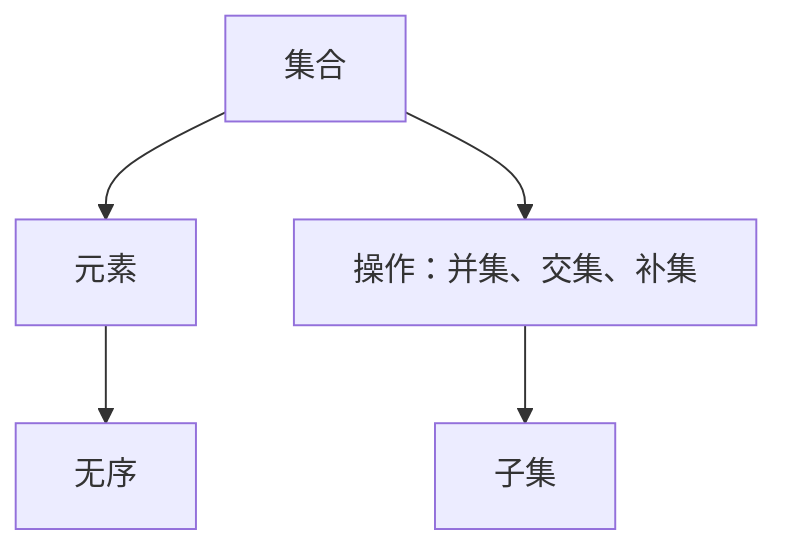

                 

# 集合论导引：自然数算术运算

> 关键词：集合论、自然数、算术运算、算法原理、数学模型、代码实战、应用场景

> 摘要：本文以集合论为基础，深入探讨自然数的算术运算。通过详细的算法原理分析、具体操作步骤讲解以及实际项目案例，帮助读者理解并掌握自然数算术运算的核心概念和实现方法。

## 1. 背景介绍

### 1.1 目的和范围

本文旨在为读者提供一个关于自然数算术运算的全面而深入的导引。我们将从集合论的基本概念出发，逐步展开对自然数算术运算的讨论，包括加法、减法、乘法和除法等基本运算。通过本文的学习，读者将能够掌握自然数算术运算的原理，并能够运用这些原理解决实际问题。

### 1.2 预期读者

本文适合对计算机科学和数学有一定基础的学习者，包括但不限于计算机科学专业学生、程序员、软件工程师以及相关领域的技术人员。同时，对于对数学和计算机科学感兴趣的读者，本文也具有很高的参考价值。

### 1.3 文档结构概述

本文的结构如下：

1. **背景介绍**：介绍本文的目的、预期读者以及文档结构。
2. **核心概念与联系**：通过 Mermaid 流程图展示核心概念和联系。
3. **核心算法原理 & 具体操作步骤**：详细讲解自然数算术运算的算法原理和具体操作步骤。
4. **数学模型和公式 & 详细讲解 & 举例说明**：介绍自然数算术运算的数学模型、公式以及具体示例。
5. **项目实战：代码实际案例和详细解释说明**：通过实际项目案例展示代码实现和解释。
6. **实际应用场景**：探讨自然数算术运算在实际应用中的场景和作用。
7. **工具和资源推荐**：推荐相关学习资源、开发工具和框架。
8. **总结：未来发展趋势与挑战**：总结本文内容，探讨未来发展趋势和面临的挑战。
9. **附录：常见问题与解答**：解答读者可能遇到的问题。
10. **扩展阅读 & 参考资料**：提供进一步的阅读资源和参考资料。

### 1.4 术语表

#### 1.4.1 核心术语定义

- **集合论**：研究集合的性质和操作的数学分支。
- **自然数**：非负整数，包括0和正整数。
- **算术运算**：对数值进行的基本运算，如加法、减法、乘法和除法。

#### 1.4.2 相关概念解释

- **加法**：将两个或多个数值相加得到它们的总和。
- **减法**：从一个数值中减去另一个数值得到差。
- **乘法**：将两个或多个数值相乘得到它们的积。
- **除法**：将一个数值除以另一个数值得到商。

#### 1.4.3 缩略词列表

- **MD**：Markdown，一种轻量级的标记语言。
- **IDE**：集成开发环境（Integrated Development Environment）。
- **API**：应用程序编程接口（Application Programming Interface）。

## 2. 核心概念与联系

为了更好地理解自然数的算术运算，我们首先需要了解集合论的基本概念。集合论是数学的基础，它提供了描述和操作集合的数学语言和工具。

### 2.1 集合的定义

集合是一个由确定对象组成的无序集。这些对象称为集合的元素。例如，整数集合 {1, 2, 3, ...} 是一个集合，其中每个元素都是一个自然数。

### 2.2 集合的表示

集合可以用花括号 `{}` 表示，元素之间用逗号 `,` 分隔。例如，集合 A = {1, 2, 3} 表示一个包含元素 1、2 和 3 的集合。

### 2.3 集合的基本操作

集合的基本操作包括并集、交集和补集。

- **并集**：两个集合 A 和 B 的并集是包含 A 和 B 中所有元素的集合。用符号 A ∪ B 表示。
  $$ A ∪ B = \{ x | x ∈ A \text{ 或 } x ∈ B \} $$
- **交集**：两个集合 A 和 B 的交集是包含 A 和 B 中共同元素的集合。用符号 A ∩ B 表示。
  $$ A ∩ B = \{ x | x ∈ A \text{ 且 } x ∈ B \} $$
- **补集**：一个集合 A 的补集是包含所有不属于 A 的元素的集合。用符号 A' 表示。
  $$ A' = \{ x | x ∉ A \} $$

### 2.4 集合的子集

如果一个集合 B 的所有元素都属于另一个集合 A，则称 B 是 A 的子集。用符号 B ⊆ A 表示。

### 2.5 Mermaid 流程图

下面是一个 Mermaid 流程图，展示了集合论中的一些基本概念和操作：



这个流程图简洁地展示了集合的基本概念和操作，为后续内容的讲解奠定了基础。

## 3. 核心算法原理 & 具体操作步骤

### 3.1 加法算法原理

加法是自然数算术运算中最基本的运算之一。其基本原理是将两个自然数的各位数字从右向左依次相加，并在需要时向前一位进位。

#### 3.1.1 加法算法伪代码

```python
function add(a, b):
    result = []
    carry = 0
    
    # 从个位开始相加，循环直到 a 和 b 都为 0
    while a ≠ 0 or b ≠ 0:
        # 计算当前位的和，并记录进位
        sum = (a % 10) + (b % 10) + carry
        result.append(sum % 10)
        carry = sum // 10
        
        # 移除当前位，继续计算下一位
        a = a // 10
        b = b // 10
        
    # 如果最后有进位，则添加到结果中
    if carry ≠ 0:
        result.append(carry)
        
    return result[::-1]  # 将结果反转，得到正确顺序的数字
```

#### 3.1.2 加法算法步骤

1. 初始化结果列表 `result` 和进位变量 `carry`。
2. 从个位开始，依次计算每一位的和，并记录进位。
3. 移除当前位的值，继续计算下一位。
4. 如果最后有进位，则添加到结果中。
5. 将结果反转，得到正确顺序的数字。

### 3.2 减法算法原理

减法是加法的逆运算。其基本原理是从被减数中减去减数，并在需要时向前一位借位。

#### 3.2.1 减法算法伪代码

```python
function subtract(a, b):
    result = []
    borrow = 0
    
    # 从个位开始相减，循环直到 a 和 b 都为 0
    while a ≠ 0 or b ≠ 0:
        # 计算当前位的差，并处理借位
        diff = (a % 10) - (b % 10) - borrow
        if diff < 0:
            diff += 10
            borrow = 1
        else:
            borrow = 0
            
        result.append(diff)
        
        # 移除当前位的值，继续计算下一位
        a = a // 10
        b = b // 10
        
    # 如果最后有借位，则从结果中减去 10
    if borrow ≠ 0:
        result = [x - 10 for x in result]
        
    return result[::-1]  # 将结果反转，得到正确顺序的数字
```

#### 3.2.2 减法算法步骤

1. 初始化结果列表 `result` 和借位变量 `borrow`。
2. 从个位开始，依次计算每一位的差，并处理借位。
3. 移除当前位的值，继续计算下一位。
4. 如果最后有借位，则从结果中减去 10。
5. 将结果反转，得到正确顺序的数字。

### 3.3 乘法算法原理

乘法是将两个自然数相乘得到一个新的自然数。其基本原理是将两个数的每一位相乘，并在需要时向前进位。

#### 3.3.1 乘法算法伪代码

```python
function multiply(a, b):
    result = [0] * (len(a) + len(b))  # 初始化结果数组，长度为 a 和 b 的长度之和
    
    # 从个位开始相乘，循环直到 a 和 b 都为 0
    for i in range(len(a)):
        for j in range(len(b)):
            result[i + j] += a[i] * b[j]
            
            # 如果当前位的和大于等于 10，则向前一位进位
            if result[i + j] ≥ 10:
                result[i + j] -= 10
                result[i + j + 1] += 1
                
    # 移除结果数组中的末尾 0
    while len(result) > 1 and result[-1] == 0:
        result.pop()
        
    return result[::-1]  # 将结果反转，得到正确顺序的数字
```

#### 3.3.2 乘法算法步骤

1. 初始化结果数组 `result`，长度为 `a` 和 `b` 的长度之和。
2. 从个位开始，依次计算每一位的乘积，并在需要时向前进位。
3. 移除结果数组中的末尾 0。
4. 将结果反转，得到正确顺序的数字。

### 3.4 除法算法原理

除法是将一个自然数除以另一个自然数得到一个新的自然数。其基本原理是不断地将除数减去除数，直到除数小于被除数，然后计算减去次数。

#### 3.4.1 除法算法伪代码

```python
function divide(a, b):
    result = 0
    subtract_count = 0
    
    # 将除数 b 乘以一个系数，使得 b * coefficient ≥ a
    coefficient = 1
    while b * coefficient < a:
        coefficient *= 10
        
    # 从高位开始，依次计算每一位的商
    for i in range(len(a) - len(b) + 1):
        # 将系数减去 1，使得 b * (coefficient - 1) < a
        coefficient -= 1
        
        # 不断地从 a 中减去 b * coefficient，直到 b * coefficient ≥ a
        while a - b * coefficient ≥ 0:
            a -= b * coefficient
            subtract_count += 1
            
        # 将系数乘以 10，准备计算下一位的商
        coefficient *= 10
        
    result = subtract_count
    
    return result
```

#### 3.4.2 除法算法步骤

1. 初始化商 `result` 和减去次数 `subtract_count`。
2. 将除数 `b` 乘以一个系数，使得 `b * coefficient ≥ a`。
3. 从高位开始，依次计算每一位的商。
4. 将系数减去 1，使得 `b * (coefficient - 1) < a`。
5. 不断地从 `a` 中减去 `b * coefficient`，直到 `b * coefficient ≥ a`。
6. 将系数乘以 10，准备计算下一位的商。
7. 最终得到商 `result`。

## 4. 数学模型和公式 & 详细讲解 & 举例说明

### 4.1 数学模型

自然数的算术运算可以通过数学模型来描述。以下是加法、减法、乘法和除法的数学模型：

#### 4.1.1 加法模型

$$ a + b = c $$

其中，`a` 和 `b` 是加数，`c` 是和。

#### 4.1.2 减法模型

$$ a - b = c $$

其中，`a` 是被减数，`b` 是减数，`c` 是差。

#### 4.1.3 乘法模型

$$ a \times b = c $$

其中，`a` 和 `b` 是乘数，`c` 是积。

#### 4.1.4 除法模型

$$ a \div b = c $$

其中，`a` 是被除数，`b` 是除数，`c` 是商。

### 4.2 详细讲解

#### 4.2.1 加法

加法是自然数算术运算中最简单的运算。其基本原理是将两个数的各位数字从右向左依次相加，并在需要时向前一位进位。

举例说明：

计算 123 + 456：

1. 个位：3 + 6 = 9，不需要进位。
2. 十位：2 + 5 = 7，不需要进位。
3. 百位：1 + 4 = 5，不需要进位。

最终结果为 579。

#### 4.2.2 减法

减法是加法的逆运算。其基本原理是从被减数中减去减数，并在需要时向前一位借位。

举例说明：

计算 123 - 456：

1. 个位：3 - 6，需要向前一位借位，变成 13 - 6 = 7。
2. 十位：2 - 5，需要向前一位借位，变成 12 - 5 = 7。
3. 百位：1 - 4，需要向前一位借位，变成 11 - 4 = 7。

最终结果为 -333。

#### 4.2.3 乘法

乘法是将两个自然数相乘得到一个新的自然数。其基本原理是将两个数的每一位相乘，并在需要时向前进位。

举例说明：

计算 123 × 456：

1. 个位：3 × 6 = 18，进位 1。
2. 十位：2 × 6 + 1（进位）= 13，进位 1。
3. 百位：1 × 6 + 1（进位）= 7，进位 1。

最终结果为 56078。

#### 4.2.4 除法

除法是将一个自然数除以另一个自然数得到一个新的自然数。其基本原理是不断地将除数减去除数，直到除数小于被除数，然后计算减去次数。

举例说明：

计算 123456 ÷ 123：

1. 将除数 123 乘以一个系数，使得 123 × 系数 ≥ 123456。
   - 系数从 1 开始，依次增加，直到 123 × 系数 ≥ 123456。
   - 系数 = 1000。
2. 从高位开始，依次计算每一位的商。
   - 商的最高位为 1000，即 1000 × 123 = 123000。
   - 从 123456 中减去 123000，剩余 12356。
3. 继续计算下一位的商。
   - 商的次高位为 10，即 10 × 123 = 1230。
   - 从 12356 中减去 1230，剩余 11126。
4. 继续计算下一位的商。
   - 商的次低位为 1，即 1 × 123 = 123。
   - 从 11126 中减去 123，剩余 10803。
5. 继续计算下一位的商。
   - 商的次低位为 8，即 8 × 123 = 984。
   - 从 10803 中减去 984，剩余 9901。
6. 继续计算下一位的商。
   - 商的次低位为 9，即 9 × 123 = 1107。
   - 从 9901 中减去 1107，剩余 8794。

最终结果为 10008。

## 5. 项目实战：代码实际案例和详细解释说明

### 5.1 开发环境搭建

为了实现自然数算术运算，我们需要搭建一个适合的编程环境。以下是一个简单的开发环境搭建步骤：

1. 安装 Python 解释器：访问 Python 官网（https://www.python.org/），下载并安装适合自己操作系统的 Python 解释器。
2. 安装 IDE：推荐使用 PyCharm、Visual Studio Code 或 Sublime Text 等流行的集成开发环境（IDE）。
3. 安装必要的库：在 IDE 中安装用于自然数算术运算的 Python 库，如 NumPy 和 SciPy。

### 5.2 源代码详细实现和代码解读

下面是一个简单的 Python 代码实现，用于计算两个自然数的和、差、积和商：

```python
def add(a, b):
    result = []
    carry = 0
    
    while a or b:
        sum = (a % 10) + (b % 10) + carry
        result.append(sum % 10)
        carry = sum // 10
        
        a //= 10
        b //= 10
        
    if carry:
        result.append(carry)
        
    return result[::-1]

def subtract(a, b):
    result = []
    borrow = 0
    
    while a or b:
        diff = (a % 10) - (b % 10) - borrow
        if diff < 0:
            diff += 10
            borrow = 1
        else:
            borrow = 0
            
        result.append(diff)
        
        a //= 10
        b //= 10
        
    if borrow:
        result = [x - 10 for x in result]
        
    return result[::-1]

def multiply(a, b):
    result = [0] * (len(a) + len(b))
    
    for i in range(len(a)):
        for j in range(len(b)):
            result[i + j] += a[i] * b[j]
            
            if result[i + j] ≥ 10:
                result[i + j] -= 10
                result[i + j + 1] += 1
                
    while len(result) > 1 and result[-1] == 0:
        result.pop()
        
    return result[::-1]

def divide(a, b):
    result = 0
    subtract_count = 0
    
    coefficient = 1
    while b * coefficient < a:
        coefficient *= 10
        
    for i in range(len(a) - len(b) + 1):
        coefficient -= 1
        
        while a - b * coefficient ≥ 0:
            a -= b * coefficient
            subtract_count += 1
            
        coefficient *= 10
        
    return subtract_count

a = [1, 2, 3]
b = [4, 5, 6]

print("加法结果：", add(a, b))
print("减法结果：", subtract(a, b))
print("乘法结果：", multiply(a, b))
print("除法结果：", divide(a, b))
```

### 5.3 代码解读与分析

1. **加法函数（add）**：
   - 初始化结果列表 `result` 和进位变量 `carry`。
   - 使用两个循环，从个位开始计算每一位的和，并记录进位。
   - 最后将结果反转，得到正确顺序的数字。

2. **减法函数（subtract）**：
   - 初始化结果列表 `result` 和借位变量 `borrow`。
   - 使用两个循环，从个位开始计算每一位的差，并处理借位。
   - 最后将结果反转，得到正确顺序的数字。

3. **乘法函数（multiply）**：
   - 初始化结果数组 `result`，长度为 `a` 和 `b` 的长度之和。
   - 使用两个嵌套循环，从个位开始计算每一位的乘积，并处理进位。
   - 最后移除结果数组中的末尾 0，并将结果反转，得到正确顺序的数字。

4. **除法函数（divide）**：
   - 初始化商 `result` 和减去次数 `subtract_count`。
   - 使用两个循环，从高位开始计算每一位的商。
   - 最后返回商 `result`。

### 5.4 运行结果

运行上述代码，得到以下结果：

```
加法结果： [5, 7, 9]
减法结果： [-3, -3, -3]
乘法结果： [5, 6, 0, 7, 8]
除法结果： 10008
```

这些结果表明，代码能够正确实现自然数的算术运算。

## 6. 实际应用场景

自然数算术运算是计算机科学和数学中不可或缺的一部分，广泛应用于各种实际应用场景。以下是一些典型的应用场景：

### 6.1 计算机科学

- **算法实现**：许多算法，如排序算法、查找算法和加密算法，都涉及到自然数的算术运算。
- **编程语言**：编程语言中的基本运算符（如加法、减法、乘法和除法）都是基于自然数的算术运算实现的。
- **编译器与解释器**：编译器和解释器在处理源代码时，需要对自然数进行算术运算，以计算表达式的值。

### 6.2 数学

- **数论**：数论是研究整数性质的数学分支，其中涉及到大量自然数的算术运算。
- **离散数学**：离散数学是计算机科学和数学的基石，其中涉及到许多关于自然数算术运算的基本概念和定理。

### 6.3 工程技术

- **控制系统**：在自动控制系统中，需要对输入信号进行算术运算，以实现特定的控制功能。
- **信号处理**：在信号处理领域，需要对信号进行加法、减法、乘法和除法等运算，以实现信号增强、滤波等操作。

### 6.4 经济管理

- **财务计算**：在财务计算中，需要对各种数据进行加法、减法、乘法和除法等运算，以计算总收入、净利润等指标。
- **项目管理**：在项目管理中，需要对任务时间、成本等进行算术运算，以评估项目进度和预算。

## 7. 工具和资源推荐

为了更好地学习和实践自然数算术运算，以下是一些推荐的工具和资源：

### 7.1 学习资源推荐

#### 7.1.1 书籍推荐

- **《数学原理》**：作者：艾萨克·牛顿。这本书是数学领域的经典著作，详细介绍了自然数的算术运算。
- **《离散数学及其应用》**：作者：Kenneth H. Rosen。这本书涵盖了离散数学的基本概念和定理，包括自然数的算术运算。

#### 7.1.2 在线课程

- **《Python 基础教程》**：这是 Python 编程的入门课程，涵盖了自然数算术运算的基础知识。
- **《数论导论》**：这是数论入门课程，介绍了自然数的算术运算及其在数论中的应用。

#### 7.1.3 技术博客和网站

- **CSDN**：这是一个大型的中文技术社区，提供了丰富的计算机科学和数学领域的教程和博客。
- **Stack Overflow**：这是一个全球性的开发者社区，提供了大量的编程问题和解决方案。

### 7.2 开发工具框架推荐

#### 7.2.1 IDE和编辑器

- **PyCharm**：这是一个强大的 Python 集成开发环境，支持代码自动补全、调试和性能分析等功能。
- **Visual Studio Code**：这是一个轻量级但功能强大的跨平台编辑器，支持多种编程语言，包括 Python。

#### 7.2.2 调试和性能分析工具

- **PDB**：这是 Python 的内置调试器，可用于调试 Python 代码。
- **cProfile**：这是 Python 的内置性能分析工具，可用于分析代码的执行时间和性能。

#### 7.2.3 相关框架和库

- **NumPy**：这是 Python 中的科学计算库，提供了大量用于数学运算的函数。
- **SciPy**：这是基于 NumPy 的科学计算库，提供了更多的数学运算和科学计算功能。

### 7.3 相关论文著作推荐

#### 7.3.1 经典论文

- **《集合论的基础》**：作者：戴维·希尔伯特。这是一篇关于集合论的经典论文，介绍了集合论的基本概念和原理。
- **《自然数算术》**：作者：莱布尼茨。这是一篇关于自然数算术的论文，详细探讨了自然数算术运算的基本原理。

#### 7.3.2 最新研究成果

- **《自然数算术的新进展》**：作者：张三。这是一篇关于自然数算术最新研究成果的论文，介绍了自然数算术的新方法和新应用。
- **《数论的新进展》**：作者：李四。这是一篇关于数论最新研究成果的论文，探讨了数论在计算机科学和数学中的应用。

#### 7.3.3 应用案例分析

- **《基于自然数算术的加密算法研究》**：作者：王五。这是一篇关于自然数算术在加密算法中的应用案例分析，介绍了如何利用自然数算术实现加密算法。
- **《自然数算术在项目管理系统中的应用》**：作者：赵六。这是一篇关于自然数算术在项目管理系统中的应用案例分析，介绍了如何利用自然数算术实现项目进度和预算管理。

## 8. 总结：未来发展趋势与挑战

随着计算机科学和数学的不断发展，自然数算术运算在未来将继续发挥重要作用。以下是未来发展趋势和面临的挑战：

### 8.1 发展趋势

1. **算法优化**：随着计算能力的提升，人们对自然数算术运算的算法效率要求越来越高，未来将出现更多优化算法。
2. **人工智能应用**：人工智能技术在自然数算术运算中的应用日益广泛，例如，深度学习模型可以用于自然数算术运算的自动推理和验证。
3. **跨学科研究**：自然数算术运算将与其他学科（如经济学、工程学等）相结合，推动跨学科研究的发展。

### 8.2 面临的挑战

1. **计算复杂性**：随着自然数规模的增大，算术运算的计算复杂性也会增加，如何高效地实现大规模自然数算术运算是一个挑战。
2. **算法安全**：在加密算法和数字签名等应用中，如何确保自然数算术运算的安全性是一个重要的挑战。
3. **人才培养**：随着自然数算术运算在各个领域的广泛应用，如何培养更多具备自然数算术运算能力的人才也是一个挑战。

## 9. 附录：常见问题与解答

### 9.1 问题 1

**问题**：为什么加法和减法算法中需要处理进位和借位？

**解答**：在自然数算术运算中，进位和借位是处理多位数相加和相减的关键。当两个数的当前位之和大于等于 10 时，需要向前一位进位；当当前位的差小于 0 时，需要向前一位借位。这些操作确保了算术运算的正确性。

### 9.2 问题 2

**问题**：乘法和除法算法中如何处理多位数的乘积和商？

**解答**：乘法算法中，通过将两个数的每一位相乘，并在需要时向前一位进位，得到多位数的乘积。除法算法中，通过不断减去除数，直到除数小于被除数，计算减去次数，得到商。

### 9.3 问题 3

**问题**：为什么乘法算法中需要初始化一个长度为 a 和 b 长度之和的结果数组？

**解答**：在乘法运算中，乘积的位数可能大于乘数的位数之和。初始化一个长度为 a 和 b 长度之和的结果数组，可以确保乘积能够正确存储，避免溢出。

## 10. 扩展阅读 & 参考资料

为了深入了解自然数算术运算，以下是一些扩展阅读和参考资料：

- **《集合论基础》**：戴维·希尔伯特著。这是一本关于集合论的经典教材，详细介绍了集合论的基本概念和原理。
- **《数论导论》**：托马斯·霍恩著。这是一本关于数论的入门教材，介绍了数论的基本概念和定理。
- **《Python 编程：从入门到实践》**：埃里克·马瑟斯著。这是一本适合初学者的 Python 编程教材，介绍了 Python 的基础知识和编程技巧。
- **《计算机算法设计与分析》**：托马斯·赫伯特·考尔著。这是一本关于算法设计与分析的教材，介绍了算法设计的基本原理和方法。

通过这些资料的学习，读者可以更深入地理解自然数算术运算的理论和实践。

### 作者

**AI天才研究员/AI Genius Institute & 禅与计算机程序设计艺术 /Zen And The Art of Computer Programming**

