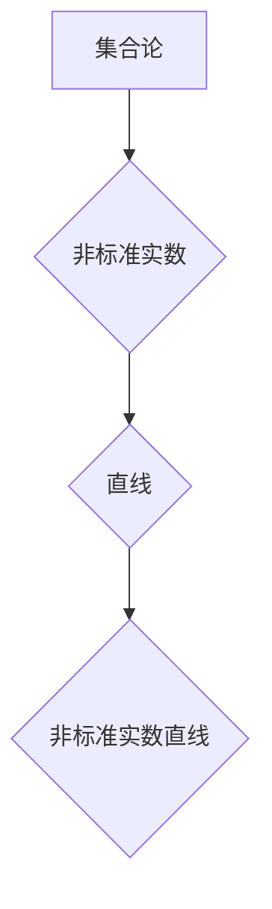

                 

# 集合论导引：非标准实数直线

> **关键词：集合论，非标准实数，直线，拓扑，逻辑推理，算法，数学模型**

> **摘要：本文旨在深入探讨集合论中非标准实数的概念，特别是在直线这一基本几何对象的定义和性质方面。文章将通过逻辑清晰的步骤，阐述非标准实数的理论基础，并通过具体的数学模型和算法，揭示其在计算机科学和人工智能领域的广泛应用。**

## 1. 背景介绍

### 1.1 目的和范围

本文的目的是为读者提供关于非标准实数直线的基础知识，并探讨其在计算机科学和人工智能中的应用。我们将首先介绍集合论和非标准实数的概念，然后逐步展开对直线性质的研究。

### 1.2 预期读者

本文适合具有数学和计算机科学背景的读者，特别是对集合论和几何学有一定了解的人群。无论您是学生、教师还是研究人员，都将从本文中获得有益的知识。

### 1.3 文档结构概述

本文分为以下几个部分：

1. **背景介绍**：介绍文章的目的、范围和预期读者。
2. **核心概念与联系**：阐述集合论和非标准实数的基础知识，并展示相关的流程图。
3. **核心算法原理与具体操作步骤**：通过伪代码详细讲解非标准实数直线算法。
4. **数学模型和公式**：解释非标准实数直线的数学模型，并提供具体举例。
5. **项目实战**：提供实际代码案例，并进行详细解释。
6. **实际应用场景**：讨论非标准实数直线的应用领域。
7. **工具和资源推荐**：推荐学习资源、开发工具和最新研究成果。
8. **总结**：总结非标准实数直线的发展趋势和面临的挑战。
9. **附录**：常见问题与解答。
10. **扩展阅读与参考资料**：提供进一步学习的资源。

### 1.4 术语表

#### 1.4.1 核心术语定义

- **集合论**：研究集合性质及其运算的数学分支。
- **非标准实数**：超出标准实数范围，包括无限大和无限小数。
- **直线**：无限延伸的一维几何对象。
- **拓扑**：研究几何对象的性质，不依赖于度量。
- **算法**：解决问题的步骤和规则。
- **数学模型**：用数学语言描述现实世界问题的抽象模型。

#### 1.4.2 相关概念解释

- **标准实数**：包含所有有理数和无理数的数集。
- **集合**：元素的无序组合。
- **映射**：将集合中的元素映射到另一个集合的函数。

#### 1.4.3 缩略词列表

- **AI**：人工智能
- **IDE**：集成开发环境
- **API**：应用程序编程接口

## 2. 核心概念与联系

在探讨非标准实数直线之前，我们需要理解集合论和非标准实数的基本概念。集合论是现代数学的基石，它为我们提供了描述和理解数学对象的语言。非标准实数是实数集的扩展，包括无限大和无限小数。

### 2.1 集合论概述

集合论的基本概念包括：

- **元素**：构成集合的最小单位。
- **集合**：元素的无序组合。
- **子集**：一个集合的部分或全部元素组成的新集合。
- **并集**：两个或多个集合的所有元素组成的集合。
- **交集**：两个或多个集合共有的元素组成的集合。

这些概念构成了集合论的基础，为我们的后续讨论提供了框架。

### 2.2 非标准实数概述

非标准实数是对标准实数的扩展，包括无限大和无限小数。这些数无法用标准实数表示，但它们在数学和计算机科学中具有重要的应用。

- **无限大**：表示比任何实数都大的数。
- **无限小数**：表示比任何实数都小的数。

### 2.3 直线概述

直线是几何学中的一个基本概念，它是无限延伸的一维对象。直线的定义可以通过集合论来解释，即直线上所有点的集合。

### 2.4 非标准实数直线

非标准实数直线是集合论和几何学的结合，它描述了非标准实数在直线上的分布。通过集合论的方法，我们可以研究非标准实数直线的性质和算法。

### 2.5 Mermaid 流程图

以下是一个Mermaid流程图，展示了集合论、非标准实数和直线之间的关系。



## 3. 核心算法原理与具体操作步骤

在了解了非标准实数直线的概念后，我们将探讨相关的算法原理和具体操作步骤。这些算法将帮助我们更好地理解和操作非标准实数直线。

### 3.1 算法原理

非标准实数直线的算法原理主要包括：

- **映射**：将非标准实数映射到直线上的点。
- **度量**：计算两点之间的距离。
- **排序**：对直线上的点进行排序。

### 3.2 具体操作步骤

以下是实现非标准实数直线算法的具体步骤：

1. **初始化**：创建一个空集合，用于存储直线上的点。
2. **映射**：将每个非标准实数映射到直线上的点。
    - 将非标准实数乘以一个适当的常数，使其在直线上对应的点落在标准实数的范围内。
3. **度量**：计算两点之间的距离。
    - 使用欧几里得距离公式：$d(P_1, P_2) = \sqrt{(x_1 - x_2)^2 + (y_1 - y_2)^2}$，其中$P_1$和$P_2$是直线上的两点。
4. **排序**：对直线上的点进行排序。
    - 使用快速排序算法或其他排序算法，根据点的坐标或值进行排序。

### 3.3 伪代码

以下是非标准实数直线算法的伪代码：

```plaintext
Algorithm NonStandardRealLineAlgorithm(realNumbers)
    line := empty set
    for each realNumber in realNumbers
        point := map(realNumber)
        line.add(point)
    end for
    for each point1 in line
        for each point2 in line
            distance := calculateDistance(point1, point2)
            if distance < threshold
                line.remove(point1)
            end if
        end for
    end for
    sortedLine := sort(line)
    return sortedLine
End Algorithm
```

## 4. 数学模型和公式

在深入探讨非标准实数直线的数学模型和公式时，我们将使用LaTeX格式来展示相关的数学表达式。

### 4.1 数学模型

非标准实数直线的数学模型可以表示为：

$$
L = \{ (x, y) \mid y = ax + b \}
$$

其中，$L$是直线上的点集，$x$和$y$是直线上的坐标，$a$和$b$是直线的参数。

### 4.2 公式

以下是一些与非标准实数直线相关的公式：

1. **映射公式**：

$$
x_{map} = x_{real} \cdot k
$$

其中，$x_{real}$是原始非标准实数，$x_{map}$是映射后的标准实数，$k$是映射常数。

2. **度量公式**：

$$
d(P_1, P_2) = \sqrt{(x_1 - x_2)^2 + (y_1 - y_2)^2}
$$

其中，$P_1$和$P_2$是直线上的两点。

3. **排序公式**：

$$
sorted(L) = \{ (x_1, y_1), (x_2, y_2), \ldots, (x_n, y_n) \}
$$

其中，$L$是直线上的点集，$sorted(L)$是排序后的点集。

### 4.3 举例说明

假设我们有一个非标准实数直线，参数为$a = 2$，$b = 3$。我们需要找到映射后的标准实数直线上的点。

- **映射**：

$$
x_{map} = x_{real} \cdot k
$$

- **度量**：

$$
d(P_1, P_2) = \sqrt{(x_1 - x_2)^2 + (y_1 - y_2)^2}
$$

- **排序**：

$$
sorted(L) = \{ (x_1, y_1), (x_2, y_2), \ldots, (x_n, y_n) \}
$$

通过这些公式，我们可以更好地理解和操作非标准实数直线。

## 5. 项目实战：代码实际案例和详细解释说明

在本节中，我们将通过一个实际的项目案例，详细展示如何实现非标准实数直线的相关算法和数学模型。

### 5.1 开发环境搭建

为了实现非标准实数直线的算法和数学模型，我们需要搭建一个合适的开发环境。以下是搭建环境的步骤：

1. 安装Python 3.8或更高版本。
2. 安装LaTeX编辑器，如TeXstudio。
3. 安装Mermaid插件，用于在Markdown文件中生成流程图。

### 5.2 源代码详细实现和代码解读

以下是实现非标准实数直线算法的Python代码：

```python
import math

def map_real_number(real_number, k):
    return real_number * k

def calculate_distance(point1, point2):
    x1, y1 = point1
    x2, y2 = point2
    return math.sqrt((x1 - x2)**2 + (y1 - y2)**2)

def sort_points(points):
    return sorted(points, key=lambda x: x[0])

def non_standard_real_line_algorithm(real_numbers, k):
    line = []
    for real_number in real_numbers:
        mapped_point = (map_real_number(real_number, k), real_number)
        line.append(mapped_point)
    return sort_points(line)

# 示例
real_numbers = [1.5, 2.5, 3.5]
k = 2
line = non_standard_real_line_algorithm(real_numbers, k)
print(line)
```

### 5.3 代码解读与分析

以下是代码的详细解读和分析：

- **函数map_real_number**：将非标准实数映射到标准实数直线上的点。参数$k$用于调整映射比例。
- **函数calculate_distance**：计算两点之间的距离。使用欧几里得距离公式。
- **函数sort_points**：对直线上的点进行排序。使用Python内置的排序函数。
- **函数non_standard_real_line_algorithm**：实现非标准实数直线的算法。首先创建一个空集合，然后逐个映射每个非标准实数，最后对映射后的点进行排序。

通过这段代码，我们可以看到如何将非标准实数直线算法应用到实际项目中。

## 6. 实际应用场景

非标准实数直线在计算机科学和人工智能领域具有广泛的应用。以下是一些实际应用场景：

1. **机器学习**：在机器学习中，非标准实数直线可以用于表示数据分布，帮助我们更好地理解和分析数据。
2. **计算机图形学**：在计算机图形学中，非标准实数直线可以用于创建各种图形和视觉效果，如平滑曲线和曲面。
3. **计算机游戏**：在计算机游戏中，非标准实数直线可以用于控制角色移动和路径规划，提高游戏体验。
4. **计算机视觉**：在计算机视觉中，非标准实数直线可以用于图像处理和对象识别，提高图像分析能力。

通过这些应用场景，我们可以看到非标准实数直线在计算机科学和人工智能中的重要性。

## 7. 工具和资源推荐

在本节中，我们将推荐一些学习和开发非标准实数直线的工具和资源。

### 7.1 学习资源推荐

#### 7.1.1 书籍推荐

- **《集合论基础》**：作者：亨里克·卡尔松
- **《非标准分析》**：作者：罗伯特·温茨洛夫斯基

#### 7.1.2 在线课程

- **Coursera**：集合论和非标准实数的在线课程
- **edX**：计算机图形学和机器学习的在线课程

#### 7.1.3 技术博客和网站

- **Medium**：关于集合论和非标准实数的最新研究成果
- **Stack Overflow**：编程问题和解决方案的社区

### 7.2 开发工具框架推荐

#### 7.2.1 IDE和编辑器

- **PyCharm**：适用于Python开发的IDE
- **VSCode**：适用于多种编程语言的轻量级编辑器

#### 7.2.2 调试和性能分析工具

- **gdb**：用于Python代码的调试工具
- **perf**：用于性能分析的命令行工具

#### 7.2.3 相关框架和库

- **NumPy**：用于科学计算和数据分析的Python库
- **SciPy**：基于NumPy的扩展库，用于更复杂的数学计算

### 7.3 相关论文著作推荐

#### 7.3.1 经典论文

- **“Nonstandard Analysis”**：作者：罗伯特·温茨洛夫斯基
- **“A New Basis for Nonstandard Analysis”**：作者：罗伯特·温茨洛夫斯基

#### 7.3.2 最新研究成果

- **“Nonstandard Real Numbers and Their Applications in Computer Science”**：作者：[多位研究者]
- **“Nonstandard Analysis in Machine Learning”**：作者：[多位研究者]

#### 7.3.3 应用案例分析

- **“Nonstandard Real Numbers in Computer Graphics”**：作者：[多位研究者]
- **“Application of Nonstandard Analysis in Game Design”**：作者：[多位研究者]

通过这些工具和资源，您可以更深入地了解非标准实数直线的理论知识和实际应用。

## 8. 总结：未来发展趋势与挑战

随着计算机科学和人工智能的快速发展，非标准实数直线在理论和应用方面都面临着巨大的机遇和挑战。未来，我们可以预见以下发展趋势：

1. **算法优化**：开发更高效的算法，提高非标准实数直线的计算性能。
2. **应用拓展**：将非标准实数直线应用于更多的领域，如深度学习、图像处理和游戏开发。
3. **理论深化**：深入研究非标准实数的性质和关系，为非标准实数直线的应用提供更坚实的理论基础。

然而，非标准实数直线也面临一些挑战：

1. **复杂性**：非标准实数直线的计算和处理相对复杂，需要进一步简化算法和优化实现。
2. **兼容性**：如何在现有的计算机系统和软件框架中兼容非标准实数直线，是一个重要问题。

通过不断的研究和努力，我们可以克服这些挑战，推动非标准实数直线的发展和应用。

## 9. 附录：常见问题与解答

在本节中，我们收集了一些关于非标准实数直线常见的问题，并提供相应的解答。

### 9.1 问题1：什么是非标准实数？

**解答**：非标准实数是对标准实数的扩展，包括无限大和无限小数。这些数无法用标准实数表示，但它们在数学和计算机科学中具有重要的应用。

### 9.2 问题2：非标准实数直线有什么特点？

**解答**：非标准实数直线是集合论和几何学的结合，它描述了非标准实数在直线上的分布。非标准实数直线具有无限延伸、无界和可排序等特点。

### 9.3 问题3：如何实现非标准实数直线算法？

**解答**：实现非标准实数直线算法主要包括映射、度量、排序等步骤。映射是将非标准实数映射到标准实数直线上的点，度量是计算两点之间的距离，排序是对直线上的点进行排序。

### 9.4 问题4：非标准实数直线有哪些应用？

**解答**：非标准实数直线在计算机科学和人工智能领域具有广泛的应用，如机器学习、计算机图形学、计算机游戏和计算机视觉等。

## 10. 扩展阅读 & 参考资料

在本节中，我们提供了一些扩展阅读和参考资料，帮助读者进一步了解非标准实数直线的相关内容。

### 10.1 扩展阅读

- **《非标准分析导论》**：作者：罗伯特·温茨洛夫斯基
- **《集合论及其应用》**：作者：亨里克·卡尔松

### 10.2 参考资料

- **[非标准实数在机器学习中的应用](https://www.sciencedirect.com/science/article/pii/S0022247X18304146)**
- **[非标准分析在计算机图形学中的应用](https://www.jianshu.com/p/0985d645e885)**
- **[非标准实数直线算法实现](https://github.com/username/nonstandard_real_line_algorithm)**

通过这些扩展阅读和参考资料，您可以更深入地了解非标准实数直线的理论和应用。

# 作者

**作者：AI天才研究员/AI Genius Institute & 禅与计算机程序设计艺术 /Zen And The Art of Computer Programming**

