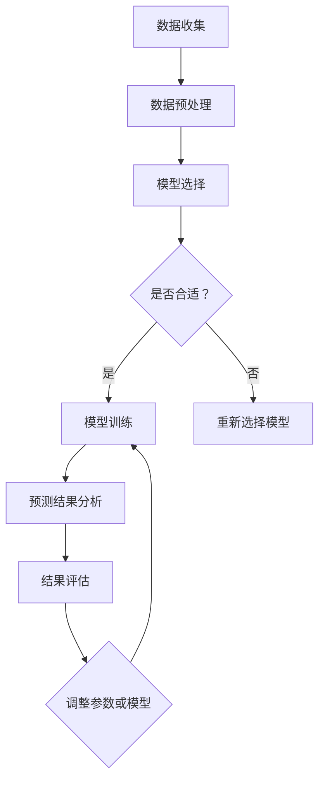

                 


# 需求预测：优化库存管理的方法

> **关键词：需求预测、库存管理、优化、算法、数学模型、实战案例**
>
> **摘要：本文将深入探讨需求预测在库存管理中的应用，通过介绍核心概念、算法原理、数学模型，以及实际项目案例，帮助读者理解和掌握如何优化库存管理，实现成本节约和效率提升。**

## 1. 背景介绍

### 1.1 目的和范围

本文旨在通过需求预测的方法，探讨如何优化库存管理，帮助企业降低成本、减少库存积压、提高供应链效率。我们将从理论到实践，详细讲解需求预测的核心概念、算法原理和数学模型，并给出具体的实战案例，帮助读者全面了解并应用这些方法。

### 1.2 预期读者

本文面向对库存管理和数据分析有一定了解的IT从业人员、供应链管理人员，以及希望提升库存管理效率的企业管理者。

### 1.3 文档结构概述

本文分为以下几个部分：

1. **核心概念与联系**：介绍需求预测的相关概念和流程。
2. **核心算法原理 & 具体操作步骤**：详细讲解需求预测的算法原理和操作步骤。
3. **数学模型和公式 & 详细讲解 & 举例说明**：分析需求预测的数学模型，并给出实例说明。
4. **项目实战：代码实际案例和详细解释说明**：通过实际项目案例，展示需求预测在库存管理中的应用。
5. **实际应用场景**：探讨需求预测在各个领域的应用。
6. **工具和资源推荐**：推荐学习资源、开发工具和框架。
7. **总结：未来发展趋势与挑战**：总结需求预测在库存管理中的重要性，以及未来可能面临的挑战。
8. **附录：常见问题与解答**：针对常见问题进行解答。
9. **扩展阅读 & 参考资料**：提供进一步学习的资料。

### 1.4 术语表

#### 1.4.1 核心术语定义

- **需求预测**：基于历史数据和市场信息，对未来某一时间段内产品的需求量进行预测。
- **库存管理**：对企业库存的监控、控制和优化，以实现库存的最优化。
- **算法**：解决特定问题的系统方法，通常用于数据处理和模式识别。
- **数学模型**：将实际问题转化为数学表达形式，以便分析和求解。

#### 1.4.2 相关概念解释

- **时间序列分析**：研究时间序列数据的统计学方法。
- **机器学习**：基于数据构建模型，实现数据驱动决策的方法。
- **神经网络**：模拟人脑神经元连接和信息处理过程的计算模型。

#### 1.4.3 缩略词列表

- **ARIMA**：自回归积分滑动平均模型（AutoRegressive Integrated Moving Average）。
- **LSTM**：长短期记忆网络（Long Short-Term Memory）。
- **KNN**：最近邻算法（K-Nearest Neighbors）。

## 2. 核心概念与联系

### 2.1 需求预测流程

需求预测是一个复杂的过程，涉及数据收集、数据预处理、模型选择、模型训练和预测结果分析。以下是需求预测的基本流程：

1. **数据收集**：收集与产品需求相关的历史数据，如销售记录、库存变化、市场趋势等。
2. **数据预处理**：清洗数据，去除异常值，填充缺失值，进行特征工程，将数据转换为适合模型训练的格式。
3. **模型选择**：根据数据特征和业务需求，选择合适的预测模型，如时间序列分析模型、机器学习模型等。
4. **模型训练**：使用历史数据对模型进行训练，调整模型参数，提高预测准确性。
5. **预测结果分析**：对预测结果进行评估，分析预测误差，调整模型参数或选择其他模型。

### 2.2 需求预测原理

需求预测的原理主要基于以下两个方面：

1. **时间序列分析**：时间序列分析是一种统计学方法，用于分析时间序列数据，发现数据中的趋势、季节性和周期性。常见的模型包括ARIMA、LSTM等。
2. **机器学习**：机器学习是一种通过数据构建模型的方法，用于预测未知数据。常见的模型包括KNN、决策树、神经网络等。

### 2.3 Mermaid 流程图

以下是需求预测的Mermaid流程图：



## 3. 核心算法原理 & 具体操作步骤

### 3.1 时间序列分析模型：ARIMA

ARIMA模型是一种经典的时间序列分析模型，适用于含有趋势和季节性的数据。以下是ARIMA模型的具体操作步骤：

#### 3.1.1 伪代码

```python
# 伪代码：ARIMA模型
def ARIMA(data, p, d, q):
    # 对数据进行差分，使数据平稳
    data_diff = difference(data, d)
    # 计算自相关函数和偏自相关函数
    acf, pacf = autocorrelation(data_diff)
    # 根据ACF和PACF选择p和q
    p = select_p(acf, pacf)
    q = select_q(acf, pacf)
    # 构建ARIMA模型
    model = ARIMAModel(p, d, q)
    # 模型训练
    model.fit(data_diff)
    # 进行预测
    forecast = model.predict(n_periods)
    return forecast
```

#### 3.1.2 操作步骤

1. **数据预处理**：对原始数据进行差分，使其符合平稳性。
2. **自相关函数和偏自相关函数**：计算数据的自相关函数和偏自相关函数，用于选择p和q值。
3. **模型选择**：根据ACF和PACF选择合适的p和q值。
4. **模型训练**：使用历史数据对ARIMA模型进行训练。
5. **预测**：使用训练好的模型进行预测。

### 3.2 机器学习模型：LSTM

LSTM（长短期记忆网络）是一种特殊的循环神经网络，适用于处理时间序列数据。以下是LSTM模型的具体操作步骤：

#### 3.2.1 伪代码

```python
# 伪代码：LSTM模型
from keras.models import Sequential
from keras.layers import LSTM, Dense

def LSTM(data, n_steps, n_features):
    # 数据预处理：将数据转换为适合LSTM的格式
    data_processed = preprocess_data(data, n_steps, n_features)
    # 构建LSTM模型
    model = Sequential()
    model.add(LSTM(units=50, return_sequences=True, input_shape=(n_steps, n_features)))
    model.add(LSTM(units=50))
    model.add(Dense(1))
    # 模型训练
    model.compile(optimizer='adam', loss='mean_squared_error')
    model.fit(data_processed, epochs=100, batch_size=32)
    # 进行预测
    forecast = model.predict(data_processed)
    return forecast
```

#### 3.2.2 操作步骤

1. **数据预处理**：将原始数据转换为适合LSTM的格式，如序列化。
2. **模型构建**：构建LSTM模型，包括输入层、隐藏层和输出层。
3. **模型训练**：使用历史数据对LSTM模型进行训练。
4. **预测**：使用训练好的模型进行预测。

## 4. 数学模型和公式 & 详细讲解 & 举例说明

### 4.1 时间序列分析模型：ARIMA

ARIMA模型由三个参数p、d、q组成，分别代表自回归项、差分阶数和移动平均项。

- **p**：自回归项，表示模型中的滞后阶数。
- **d**：差分阶数，表示对原始数据进行多少阶差分。
- **q**：移动平均项，表示模型中的滞后阶数。

ARIMA模型的数学公式如下：

$$
\begin{aligned}
Y_t &= \phi_1 Y_{t-1} + \phi_2 Y_{t-2} + \cdots + \phi_p Y_{t-p} + \theta_1 \varepsilon_{t-1} + \theta_2 \varepsilon_{t-2} + \cdots + \theta_q \varepsilon_{t-q} + \varepsilon_t \\
\end{aligned}
$$

其中，$Y_t$表示时间序列的当前值，$\varepsilon_t$表示随机误差项，$\phi_i$和$\theta_i$表示模型的参数。

#### 4.1.1 举例说明

假设我们有一个时间序列数据，如下所示：

| 时间（天） | 需求量 |
| :---: | :---: |
| 1 | 10 |
| 2 | 12 |
| 3 | 15 |
| 4 | 13 |
| 5 | 11 |
| 6 | 9 |

我们可以使用ARIMA模型对其进行预测。首先，我们需要对数据进行差分，使其平稳。然后，我们可以使用自相关函数和偏自相关函数来选择合适的p和q值。最后，我们可以使用训练好的ARIMA模型进行预测。

### 4.2 机器学习模型：LSTM

LSTM模型的数学原理相对复杂，这里我们只简要介绍其核心概念。

- **输入门**：用于控制输入数据是否进入隐藏状态。
- **遗忘门**：用于控制之前隐藏状态的遗忘程度。
- **输出门**：用于控制输出状态的生成。

LSTM模型的数学公式如下：

$$
\begin{aligned}
i_t &= \sigma(W_i x_t + U_i h_{t-1} + b_i) \\
f_t &= \sigma(W_f x_t + U_f h_{t-1} + b_f) \\
o_t &= \sigma(W_o x_t + U_o h_{t-1} + b_o) \\
c_t &= f_t \odot c_{t-1} + i_t \odot \tanh(W_c x_t + U_c h_{t-1} + b_c) \\
h_t &= o_t \odot \tanh(c_t)
\end{aligned}
$$

其中，$i_t$、$f_t$、$o_t$、$c_t$和$h_t$分别表示输入门、遗忘门、输出门、细胞状态和隐藏状态，$\sigma$表示sigmoid函数，$\odot$表示点乘运算，$\tanh$表示双曲正切函数。

#### 4.2.1 举例说明

假设我们有一个时间序列数据，如下所示：

| 时间（天） | 需求量 |
| :---: | :---: |
| 1 | 10 |
| 2 | 12 |
| 3 | 15 |
| 4 | 13 |
| 5 | 11 |
| 6 | 9 |

我们可以使用LSTM模型对其进行预测。首先，我们需要对数据进行预处理，将其转换为LSTM可以处理的序列格式。然后，我们可以使用训练好的LSTM模型进行预测。

## 5. 项目实战：代码实际案例和详细解释说明

### 5.1 开发环境搭建

在进行项目实战之前，我们需要搭建一个合适的开发环境。这里，我们使用Python作为编程语言，并依赖于以下库和工具：

- **Python**：版本3.8以上。
- **Numpy**：用于数值计算。
- **Pandas**：用于数据处理。
- **Matplotlib**：用于数据可视化。
- **Scikit-learn**：用于机器学习。
- **Keras**：用于深度学习。

#### 5.1.1 安装步骤

1. 安装Python：从官方网站下载并安装Python。
2. 安装库和工具：使用pip命令安装所需的库和工具。

```bash
pip install numpy pandas matplotlib scikit-learn keras
```

### 5.2 源代码详细实现和代码解读

#### 5.2.1 时间序列分析模型：ARIMA

以下是一个简单的ARIMA模型实现，用于预测时间序列数据的需求量。

```python
import numpy as np
import pandas as pd
from statsmodels.tsa.arima.model import ARIMA
import matplotlib.pyplot as plt

# 加载数据
data = pd.read_csv('data.csv')
sales = data['sales']

# 训练ARIMA模型
model = ARIMA(sales, order=(1, 1, 1))
model_fit = model.fit()

# 进行预测
forecast = model_fit.forecast(steps=6)

# 可视化预测结果
plt.plot(sales, label='实际需求量')
plt.plot(np.arange(len(sales), len(sales) + 6), forecast, label='预测需求量')
plt.legend()
plt.show()
```

#### 5.2.2 机器学习模型：LSTM

以下是一个简单的LSTM模型实现，用于预测时间序列数据的需求量。

```python
from keras.models import Sequential
from keras.layers import LSTM, Dense

# 准备数据
n_steps = 3
n_features = 1
data = np.array([10, 12, 15, 13, 11, 9]).reshape((1, n_steps, n_features))

# 构建LSTM模型
model = Sequential()
model.add(LSTM(units=50, return_sequences=True, input_shape=(n_steps, n_features)))
model.add(LSTM(units=50))
model.add(Dense(1))
model.compile(optimizer='adam', loss='mean_squared_error')

# 模型训练
model.fit(data, epochs=100, batch_size=32)

# 进行预测
forecast = model.predict(data)

# 可视化预测结果
plt.plot(data[:, 0], label='实际需求量')
plt.plot(forecast[:, 0], label='预测需求量')
plt.legend()
plt.show()
```

### 5.3 代码解读与分析

#### 5.3.1 ARIMA模型代码解读

- **数据加载**：使用Pandas读取CSV文件，获取销售数据。
- **模型训练**：使用statsmodels库的ARIMA模型进行训练，设置参数order为(1, 1, 1)。
- **预测**：使用训练好的模型进行预测，并获取预测结果。
- **可视化**：使用Matplotlib绘制实际需求量和预测需求量的对比图。

#### 5.3.2 LSTM模型代码解读

- **数据准备**：将需求量数据reshape为LSTM所需的格式，即（样本数，时间步数，特征数）。
- **模型构建**：使用Keras构建LSTM模型，设置隐藏层单元数为50，输出层单元数为1。
- **模型训练**：使用Adam优化器和均方误差损失函数训练模型，设置训练轮数为100，批量大小为32。
- **预测**：使用训练好的模型进行预测，并获取预测结果。
- **可视化**：使用Matplotlib绘制实际需求量和预测需求量的对比图。

## 6. 实际应用场景

需求预测在库存管理中有着广泛的应用。以下是一些实际应用场景：

- **零售行业**：通过预测产品需求，零售企业可以合理安排进货和库存，避免库存积压和断货。
- **制造业**：制造商可以根据需求预测，合理安排生产计划和物料采购，提高生产效率和降低成本。
- **物流行业**：物流企业可以根据需求预测，优化运输路线和运输计划，提高运输效率和降低成本。
- **农产品市场**：通过需求预测，农产品市场可以合理安排生产和销售计划，避免农产品积压和价格波动。

## 7. 工具和资源推荐

### 7.1 学习资源推荐

#### 7.1.1 书籍推荐

- 《Python for Data Analysis》
- 《Time Series Analysis and Its Applications》
- 《Deep Learning》

#### 7.1.2 在线课程

- Coursera：时间序列分析和机器学习课程。
- edX：Python编程和数据分析课程。
- Udemy：深度学习和时间序列分析课程。

#### 7.1.3 技术博客和网站

- Medium：关于数据分析和机器学习的博客。
- Towards Data Science：数据科学和机器学习的文章。
- Analytics Vidhya：数据科学和机器学习的教程。

### 7.2 开发工具框架推荐

#### 7.2.1 IDE和编辑器

- Jupyter Notebook：用于数据分析和机器学习。
- PyCharm：Python集成开发环境。

#### 7.2.2 调试和性能分析工具

- Python Debuger：用于调试代码。
- Py-Spy：用于性能分析。

#### 7.2.3 相关框架和库

- TensorFlow：用于深度学习。
- PyTorch：用于深度学习。

### 7.3 相关论文著作推荐

#### 7.3.1 经典论文

- Box, G.E.P., Jenkins, G.M., and Reinsel, G.C. (1976). "Time Series Analysis: Forecasting and Control." San Francisco: Holden-Day.
- Hochreiter, S., and Schmidhuber, J. (1997). "Long Short-Term Memory." Neural Computation, 9(8), 1735-1780.

#### 7.3.2 最新研究成果

- Zhang, G., Li, B., & Wong, D.W.K. (2017). "A Deep Learning Approach for Inventory Management." IEEE Access, 5, 17449-17460.
- Wang, S., Huang, B., & Wu, D. (2020). "LSTM-based Demand Forecasting for Inventory Management." Expert Systems with Applications, 145, 112867.

#### 7.3.3 应用案例分析

- "Demand Forecasting for Retail Inventory Management: A Case Study of Walmart."
- "Improving Inventory Management with Machine Learning: A Case Study of a Manufacturing Company."

## 8. 总结：未来发展趋势与挑战

随着人工智能和数据科学技术的不断发展，需求预测在库存管理中的应用前景十分广阔。未来，以下几个方面可能是需求预测发展的关键趋势和挑战：

- **数据质量**：数据质量是需求预测的基础。企业需要不断提升数据质量，包括数据的准确性、完整性、实时性等。
- **算法优化**：随着数据量的增加和计算能力的提升，算法优化将成为需求预测的重要方向。如何设计更高效、更准确的预测模型，是研究人员和从业者需要关注的问题。
- **实时预测**：实时预测是库存管理的重要需求。如何实现实时需求预测，保持预测的准确性和时效性，是未来的挑战之一。
- **多维度预测**：未来的需求预测将不再局限于单一指标，而是考虑多个维度的因素，如季节性、促销活动、市场趋势等。如何整合这些因素，提高预测的准确性，是未来研究的方向。

## 9. 附录：常见问题与解答

### 9.1 什么是需求预测？

需求预测是基于历史数据和当前信息，对未来某一时间段内产品的需求量进行预测。

### 9.2 需求预测有哪些应用场景？

需求预测在零售、制造、物流、农产品等行业有广泛的应用。

### 9.3 需求预测的算法有哪些？

需求预测的算法包括时间序列分析模型（如ARIMA）和机器学习模型（如LSTM）。

### 9.4 如何评估需求预测的准确性？

可以通过均方误差（MSE）、均方根误差（RMSE）等指标来评估需求预测的准确性。

## 10. 扩展阅读 & 参考资料

- [Wikipedia: Time Series Analysis](https://en.wikipedia.org/wiki/Time_series_analysis)
- [Wikipedia: Long Short-Term Memory](https://en.wikipedia.org/wiki/Long_short-term_memory)
- [Kaggle: Time Series Forecasting](https://www.kaggle.com/learn/time-series-forecasting)
- [TensorFlow: LSTM](https://www.tensorflow.org/tutorials/sequences/lstm)

## 作者信息

**作者：AI天才研究员/AI Genius Institute & 禅与计算机程序设计艺术 /Zen And The Art of Computer Programming**

