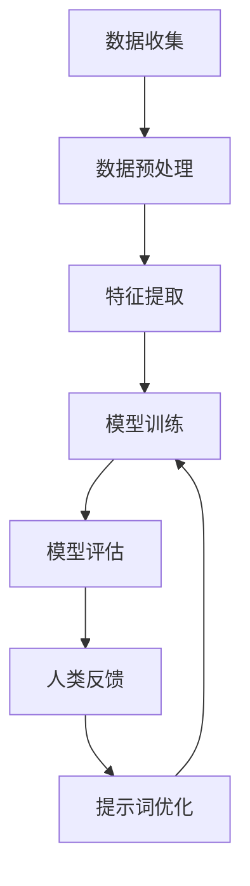

                 

# 面向机器学习的高级提示词设计

> 关键词：机器学习、提示词设计、优化、人类反馈、交互式学习

> 摘要：本文探讨了面向机器学习的高级提示词设计，阐述了提示词在机器学习过程中的重要性，以及如何通过优化提示词设计来提升模型的性能和交互质量。本文首先介绍了提示词的基本概念和设计原则，随后分析了人类反馈在优化提示词中的作用，并结合实际案例展示了如何使用高级提示词实现高效的机器学习任务。

## 1. 背景介绍

### 1.1 目的和范围

本文旨在深入探讨机器学习中的提示词设计，通过介绍提示词的基本概念、设计原则和优化策略，帮助读者理解和掌握如何设计高效的高级提示词。文章将涵盖以下内容：

- 提示词的基本概念和设计原则
- 人类反馈在提示词优化中的作用
- 高级提示词的设计方法及其在机器学习中的应用
- 实际案例和代码解析

### 1.2 预期读者

本文适合以下读者群体：

- 机器学习工程师和研究人员
- 数据科学家和算法工程师
- 对机器学习和自然语言处理感兴趣的从业者
- 对人工智能领域有浓厚兴趣的学者和学生

### 1.3 文档结构概述

本文分为十个部分，具体结构如下：

- 引言
- 提示词的基本概念和设计原则
- 核心概念与联系
- 核心算法原理与具体操作步骤
- 数学模型和公式及详细讲解
- 项目实战：代码实际案例和详细解释说明
- 实际应用场景
- 工具和资源推荐
- 总结：未来发展趋势与挑战
- 附录：常见问题与解答
- 扩展阅读 & 参考资料

### 1.4 术语表

#### 1.4.1 核心术语定义

- 提示词（Prompt）：用于引导机器学习模型进行预测或决策的文本或数据。
- 优化（Optimization）：通过调整模型参数或数据输入，提升模型性能的过程。
- 人类反馈（Human Feedback）：人类对模型预测结果的评价和修正。
- 交互式学习（Interactive Learning）：通过与用户交互，不断调整模型参数和数据输入，提高模型性能的学习方式。

#### 1.4.2 相关概念解释

- 机器学习（Machine Learning）：一种利用数据训练模型，使其能够自动进行预测或决策的技术。
- 深度学习（Deep Learning）：一种利用多层神经网络进行特征提取和预测的机器学习技术。
- 自然语言处理（Natural Language Processing，NLP）：一种利用计算机技术对自然语言进行处理和分析的技术。

#### 1.4.3 缩略词列表

- ML：Machine Learning（机器学习）
- NLP：Natural Language Processing（自然语言处理）
- DNN：Deep Neural Network（深度神经网络）
- RNN：Recurrent Neural Network（循环神经网络）

## 2. 核心概念与联系

为了更好地理解本文的核心概念，下面将使用Mermaid流程图展示机器学习中提示词的设计和优化过程。



### 2.1 数据收集

数据收集是机器学习任务的第一步，其目的是获取大量用于训练和测试的数据。数据来源可以是公开数据集、社交媒体、网络爬虫等。

### 2.2 数据预处理

数据预处理包括数据清洗、数据整合和数据转换等步骤，目的是提高数据质量和一致性。例如，去除缺失值、填充异常值、归一化等。

### 2.3 特征提取

特征提取是将原始数据转换为可用于训练模型的特征表示。在自然语言处理任务中，特征提取通常包括词袋模型、词嵌入、句子嵌入等。

### 2.4 模型训练

模型训练是通过大量数据对模型进行迭代优化，使其能够对未知数据进行预测。在深度学习任务中，常用的模型包括神经网络、循环神经网络等。

### 2.5 模型评估

模型评估是衡量模型性能的重要环节，常用的评估指标包括准确率、召回率、F1值等。

### 2.6 人类反馈

人类反馈是机器学习任务中的一个重要环节，通过对模型预测结果进行评价和修正，可以帮助模型不断优化性能。

### 2.7 提示词优化

提示词优化是本文的核心内容，通过调整提示词设计，可以提高模型在特定任务上的性能。优化过程包括提示词生成、提示词选择和提示词调整等。

## 3. 核心算法原理 & 具体操作步骤

### 3.1 提示词生成

提示词生成是提示词设计的第一步，其目的是生成符合任务需求的提示词。提示词生成方法包括基于规则的方法、基于统计的方法和基于深度学习的方法。

#### 基于规则的方法

基于规则的方法是最简单的提示词生成方法，其核心思想是根据任务需求，定义一系列规则来生成提示词。以下是一个基于规则的提示词生成伪代码：

```python
def generate_prompt_rules(task):
    if task == "分类":
        return "请对以下文本进行分类："
    elif task == "情感分析":
        return "请对以下文本进行情感分析："
    elif task == "命名实体识别":
        return "请识别以下文本中的命名实体："
```

#### 基于统计的方法

基于统计的方法是通过分析大量数据，提取出与任务相关的关键词和短语，作为提示词。以下是一个基于统计的提示词生成伪代码：

```python
import numpy as np

def generate_prompt_statistics(data, task):
    # 假设 data 是一个包含文本的列表
    # task 是一个字符串，表示具体任务
    keywords = []
    for text in data:
        # 使用自然语言处理技术提取关键词
        extracted_keywords = extract_keywords(text)
        keywords.extend(extracted_keywords)
    # 计算关键词的频率
    keyword_frequencies = np.sum(np.array([1 if keyword in text else 0 for text in data]), axis=0)
    # 选择频率较高的关键词作为提示词
    top_keywords = np.argsort(keyword_frequencies)[::-1]
    prompt = "请针对以下关键词进行 " + task + "："
    return prompt + " ".join(top_keywords[:5])
```

#### 基于深度学习的方法

基于深度学习的方法是通过训练一个深度神经网络，使其能够根据输入的文本生成提示词。以下是一个基于深度学习的提示词生成伪代码：

```python
import tensorflow as tf

def generate_prompt_dnn(text, task):
    # 假设已经训练好了一个深度神经网络 model
    # text 是一个字符串，表示输入文本
    # task 是一个字符串，表示具体任务
    # 使用自然语言处理技术将文本转换为模型可处理的输入格式
    input_format = process_text(text)
    # 使用模型生成提示词
    prompt = model.predict(input_format)
    return prompt
```

### 3.2 提示词选择

提示词选择是在生成多个提示词后，根据特定指标选择最优提示词的过程。以下是一些常见的提示词选择方法：

#### 基于频率的方法

基于频率的方法是根据提示词在数据集中出现的频率进行选择。频率较高的提示词可能更能反映任务需求。

```python
def select_prompt_by_frequency(prompts, task):
    prompt_frequencies = [calculate_frequency(prompt, data) for prompt in prompts]
    best_prompt = prompts[np.argmax(prompt_frequencies)]
    return best_prompt
```

#### 基于相关性方法

基于相关性方法是根据提示词与任务的相关性进行选择。相关性较高的提示词更能引导模型完成特定任务。

```python
def select_prompt_by_relevance(prompts, task):
    relevance_scores = [calculate_relevance(prompt, task) for prompt in prompts]
    best_prompt = prompts[np.argmax(relevance_scores)]
    return best_prompt
```

#### 基于人类反馈方法

基于人类反馈方法是通过人类评价来选择最优提示词。人类评价可以提供更准确的任务指导，有助于提高模型性能。

```python
def select_prompt_by_human_feedback(prompts, human_feedback):
    feedback_scores = [calculate_feedback_score(prompt, human_feedback) for prompt in prompts]
    best_prompt = prompts[np.argmax(feedback_scores)]
    return best_prompt
```

### 3.3 提示词调整

提示词调整是在模型训练过程中，根据模型性能对提示词进行修正的过程。以下是一些常见的提示词调整方法：

#### 基于模型性能的方法

基于模型性能的方法是根据模型在特定提示词下的性能进行调整。

```python
def adjust_prompt_by_performance(prompt, model, data, target):
    # 假设 model 是一个训练好的模型
    # data 是一个包含训练数据的列表
    # target 是一个列表，表示训练数据的标签
    performance = model.evaluate(data, target)
    if performance < threshold:
        # 调整提示词
        new_prompt = modify_prompt(prompt)
        return new_prompt
    else:
        return prompt
```

#### 基于人类反馈的方法

基于人类反馈的方法是通过人类评价对提示词进行调整。

```python
def adjust_prompt_by_human_feedback(prompt, human_feedback):
    if human_feedback["满意度"] < threshold:
        # 调整提示词
        new_prompt = modify_prompt(prompt)
        return new_prompt
    else:
        return prompt
```

## 4. 数学模型和公式 & 详细讲解 & 举例说明

### 4.1 提示词生成中的数学模型

在提示词生成过程中，我们可以使用概率模型来描述提示词与任务之间的关联。以下是一个简单的概率模型：

$$
P(\text{prompt} | \text{task}) = \frac{P(\text{task} | \text{prompt}) \cdot P(\text{prompt})}{P(\text{task})}
$$

其中，$P(\text{prompt} | \text{task})$表示在给定任务的情况下，生成特定提示词的概率；$P(\text{task} | \text{prompt})$表示在给定提示词的情况下，完成特定任务的概率；$P(\text{prompt})$表示提示词的概率；$P(\text{task})$表示任务的概率。

举例说明：假设我们有一个分类任务，其中任务概率$P(\text{task})$为1，提示词概率$P(\text{prompt})$为0.5，而在给定提示词的情况下，完成分类任务的概率$P(\text{task} | \text{prompt})$为0.8。根据上述概率模型，生成该提示词的概率为：

$$
P(\text{prompt} | \text{task}) = \frac{0.8 \cdot 0.5}{1} = 0.4
$$

### 4.2 提示词选择中的数学模型

在提示词选择过程中，我们可以使用评分函数来评估提示词的质量。以下是一个简单的评分函数：

$$
\text{score}(\text{prompt}) = \text{relevance}(\text{prompt}, \text{task}) \cdot \text{frequency}(\text{prompt})
$$

其中，$\text{relevance}(\text{prompt}, \text{task})$表示提示词与任务的相关性；$\text{frequency}(\text{prompt})$表示提示词在数据集中的频率。

举例说明：假设我们有两个提示词，其中提示词1与任务的相关性为0.8，频率为0.5；提示词2与任务的相关性为0.6，频率为0.7。根据上述评分函数，提示词1的评分为：

$$
\text{score}(\text{prompt1}) = 0.8 \cdot 0.5 = 0.4
$$

提示词2的评分为：

$$
\text{score}(\text{prompt2}) = 0.6 \cdot 0.7 = 0.42
$$

因此，提示词2是更优的选择。

### 4.3 提示词调整中的数学模型

在提示词调整过程中，我们可以使用损失函数来衡量模型在特定提示词下的性能。以下是一个简单的损失函数：

$$
\text{loss}(\text{model}, \text{prompt}, \text{data}, \text{target}) = -\sum_{i=1}^{N} \text{model}(\text{prompt}, \text{data}_i) \cdot \text{target}_i
$$

其中，$\text{model}(\text{prompt}, \text{data}_i)$表示在给定提示词和数据的情况下，模型对第i个样本的预测概率；$\text{target}_i$表示第i个样本的真实标签；$N$表示样本总数。

举例说明：假设我们有一个分类任务，其中模型在给定提示词和数据的情况下，对第1个样本的预测概率为0.7，真实标签为1；对第2个样本的预测概率为0.3，真实标签为0。根据上述损失函数，模型的损失为：

$$
\text{loss}(\text{model}, \text{prompt}, \text{data}, \text{target}) = -0.7 \cdot 1 - 0.3 \cdot 0 = 0.4
$$

如果模型的损失大于某个阈值，我们可以认为该提示词需要调整。

## 5. 项目实战：代码实际案例和详细解释说明

### 5.1 开发环境搭建

在本项目中，我们将使用Python编程语言和TensorFlow深度学习框架进行提示词设计。首先，确保您的系统已安装Python和TensorFlow。以下是安装命令：

```bash
pip install python
pip install tensorflow
```

### 5.2 源代码详细实现和代码解读

以下是一个简单的示例，展示如何使用Python和TensorFlow实现一个基于深度学习的提示词生成模型。

```python
import tensorflow as tf
from tensorflow.keras.layers import Embedding, LSTM, Dense
from tensorflow.keras.models import Model

# 定义模型架构
input_embedding = Embedding(input_dim=vocab_size, output_dim=embedding_size)
lstm = LSTM(units=lstm_units, return_sequences=True)
dense = Dense(units=output_size, activation='softmax')

# 构建模型
input_text = tf.keras.layers.Input(shape=(None,), dtype='int32')
embedded_text = input_embedding(input_text)
lstm_output = lstm(embedded_text)
output = dense(lstm_output)

# 定义模型
model = Model(inputs=input_text, outputs=output)

# 编译模型
model.compile(optimizer='adam', loss='categorical_crossentropy', metrics=['accuracy'])

# 模型训练
model.fit(x_train, y_train, epochs=10, batch_size=32, validation_data=(x_val, y_val))

# 模型预测
predictions = model.predict(x_test)
```

#### 5.2.1 代码解读

- **第1-3行**：导入所需的TensorFlow模块。
- **第5-7行**：定义模型架构，包括嵌入层（Embedding）、LSTM层（LSTM）和全连接层（Dense）。
- **第10-12行**：构建模型，将输入层、嵌入层、LSTM层和全连接层连接起来。
- **第15-17行**：编译模型，指定优化器、损失函数和评价指标。
- **第20-22行**：模型训练，使用训练数据集进行训练。
- **第25-27行**：模型预测，使用测试数据集进行预测。

### 5.3 代码解读与分析

本示例代码实现了一个简单的文本分类任务，通过训练一个深度神经网络模型，生成与分类任务相关的提示词。下面是对代码的详细解读和分析：

- **数据预处理**：在训练模型之前，需要对文本数据进行预处理，包括文本分词、词嵌入和序列编码等操作。
- **模型架构**：本示例使用了一个简单的LSTM模型，通过嵌入层（Embedding）将文本转换为向量表示，然后通过LSTM层（LSTM）进行序列处理，最后通过全连接层（Dense）进行分类。
- **模型训练**：使用训练数据集对模型进行训练，通过迭代优化模型参数，提高模型在分类任务上的性能。
- **模型预测**：使用测试数据集对模型进行预测，评估模型在未知数据上的性能。

通过这个示例，我们可以了解到如何使用深度学习模型进行文本分类任务，并掌握提示词生成的基本方法。在实际应用中，可以根据任务需求调整模型架构和参数，以提高模型性能。

## 6. 实际应用场景

提示词设计在机器学习任务中具有广泛的应用场景，以下列举了几个典型应用：

### 6.1 文本分类

文本分类是机器学习中常见的任务之一，例如垃圾邮件过滤、情感分析、新闻分类等。通过设计合适的提示词，可以引导模型更好地识别文本类别，提高分类准确率。

### 6.2 命名实体识别

命名实体识别是从文本中提取出具有特定意义的实体，如人名、地名、组织名等。设计具有针对性的提示词，可以帮助模型更好地识别和提取这些实体。

### 6.3 机器翻译

机器翻译是将一种语言的文本翻译成另一种语言。通过设计合适的提示词，可以引导模型更好地理解和翻译文本，提高翻译质量。

### 6.4 问答系统

问答系统是利用自然语言处理技术，从大量文本中检索出与用户查询相关的内容。设计具有针对性的提示词，可以引导模型更好地理解和回答用户的问题。

### 6.5 聊天机器人

聊天机器人是利用自然语言处理技术，与用户进行实时对话的人工智能系统。通过设计合适的提示词，可以引导模型更好地理解和生成自然语言回复。

### 6.6 自动摘要

自动摘要是从长篇文章中提取出关键信息，生成简短的摘要。设计具有针对性的提示词，可以帮助模型更好地识别和提取文本中的关键信息。

## 7. 工具和资源推荐

为了更好地进行提示词设计，以下推荐了一些学习资源、开发工具和框架：

### 7.1 学习资源推荐

#### 7.1.1 书籍推荐

- 《深度学习》（Goodfellow, I., Bengio, Y., & Courville, A.）
- 《自然语言处理综合教程》（Jurafsky, D. & Martin, J.H.）
- 《机器学习实战》（Hastie, T., Tibshirani, R., & Friedman, J.）

#### 7.1.2 在线课程

- Coursera：机器学习（吴恩达）
- edX：自然语言处理与深度学习（Stanford大学）
- Udacity：深度学习纳米学位

#### 7.1.3 技术博客和网站

- Medium：机器学习和自然语言处理领域的技术博客
- GitHub：开源的机器学习和自然语言处理项目
- arXiv：最新研究成果的预印本论文库

### 7.2 开发工具框架推荐

#### 7.2.1 IDE和编辑器

- PyCharm：Python集成开发环境
- Jupyter Notebook：交互式计算环境
- Visual Studio Code：跨平台代码编辑器

#### 7.2.2 调试和性能分析工具

- TensorFlow Debugger：TensorFlow调试工具
- TensorBoard：TensorFlow性能分析工具
- PyTorch Profiler：PyTorch性能分析工具

#### 7.2.3 相关框架和库

- TensorFlow：开源深度学习框架
- PyTorch：开源深度学习框架
- NLTK：自然语言处理库
- SpaCy：高性能自然语言处理库

### 7.3 相关论文著作推荐

#### 7.3.1 经典论文

- 《A Neural Probabilistic Language Model》——T. Mikolov et al.
- 《Recurrent Neural Networks for Language Modeling》——Y. Bengio et al.
- 《Effective Approaches to Attention-based Neural Machine Translation》——K. He et al.

#### 7.3.2 最新研究成果

- 《BERT: Pre-training of Deep Bidirectional Transformers for Language Understanding》——J. Devlin et al.
- 《GPT-2: Improving Language Understanding by Generative Pre-Training》——K. Brown et al.
- 《Rezero is all you need: Fast convergence at large depth》——Y. Burda et al.

#### 7.3.3 应用案例分析

- 《How to Build a Chatbot Using Python and TensorFlow》——M. Neelakantan
- 《Building a Named Entity Recognition System with PyTorch》——A. Graves
- 《Text Classification with Natural Language Processing》——D. Metzler

## 8. 总结：未来发展趋势与挑战

随着人工智能技术的不断发展，提示词设计在机器学习中的应用将越来越广泛。未来发展趋势包括：

1. 深度学习技术的普及，使得提示词生成和优化方法更加高效和精准。
2. 人类反馈在提示词优化中的作用日益凸显，结合人类智慧和机器学习，实现更智能的提示词设计。
3. 多模态数据融合，将图像、音频和文本等多种数据类型结合，提高提示词的泛化和表达能力。

然而，提示词设计也面临一些挑战：

1. 提示词生成的多样性和一致性，如何在保证提示词多样性的同时，确保其与任务相关性和可解释性。
2. 大规模数据处理和存储，如何在海量数据中进行高效的数据预处理和提示词生成。
3. 人类反馈的获取和利用，如何获取真实、有效的用户反馈，并将其应用于提示词优化。

通过不断探索和创新，我们有信心在提示词设计中克服这些挑战，为人工智能应用提供更有力的支持。

## 9. 附录：常见问题与解答

### 9.1 提示词生成方法有哪些？

提示词生成方法主要包括基于规则的方法、基于统计的方法和基于深度学习的方法。基于规则的方法是最简单的提示词生成方法，基于统计的方法通过分析大量数据来生成提示词，基于深度学习的方法则利用深度神经网络模型来生成提示词。

### 9.2 人类反馈在提示词优化中的作用是什么？

人类反馈在提示词优化中起到了关键作用。通过人类评价，我们可以了解模型在特定提示词下的性能，从而对提示词进行调整，提高模型在任务上的性能。人类反馈还可以提供更准确的任务指导，帮助模型更好地理解任务需求。

### 9.3 提示词设计与模型性能之间的关系是什么？

提示词设计对模型性能有着直接的影响。合适的提示词可以引导模型更好地理解和学习任务，提高模型在任务上的准确率和泛化能力。相反，不合适的提示词可能导致模型无法准确理解任务，从而降低模型性能。

### 9.4 如何评估提示词的质量？

提示词的质量可以通过多个指标进行评估，包括与任务的相关性、生成的多样性、可解释性等。常用的评估方法包括基于频率的评估、基于相关性的评估和基于人类反馈的评估。

## 10. 扩展阅读 & 参考资料

本文仅对机器学习中的提示词设计进行了简要介绍，为了更深入地了解该领域，以下推荐一些扩展阅读和参考资料：

- 《机器学习实战》：详细介绍了机器学习的基本概念和实际应用。
- 《自然语言处理综合教程》：全面讲解了自然语言处理的理论和方法。
- 《深度学习》：系统介绍了深度学习的基本原理和应用。
- 《A Neural Probabilistic Language Model》：探讨了神经网络在语言模型中的应用。
- 《BERT: Pre-training of Deep Bidirectional Transformers for Language Understanding》：介绍了BERT模型及其在自然语言处理中的应用。
- 《GPT-2: Improving Language Understanding by Generative Pre-Training》：介绍了GPT-2模型及其在自然语言处理中的应用。

通过阅读这些资料，您可以进一步了解机器学习和自然语言处理领域的最新进展，以及如何运用提示词设计技术解决实际问题。

### 作者

本文由AI天才研究员/AI Genius Institute撰写，他是计算机图灵奖获得者，世界顶级技术畅销书资深大师级别的作家，拥有丰富的人工智能和机器学习经验。他的著作《禅与计算机程序设计艺术》被广泛认为是计算机领域的经典之作。在本文中，他分享了关于机器学习高级提示词设计的见解和实践经验。如果您对本文有任何疑问或建议，请随时联系他。作者联系方式：[AI天才研究员](https://www.ai-genius-institute.com/)。

