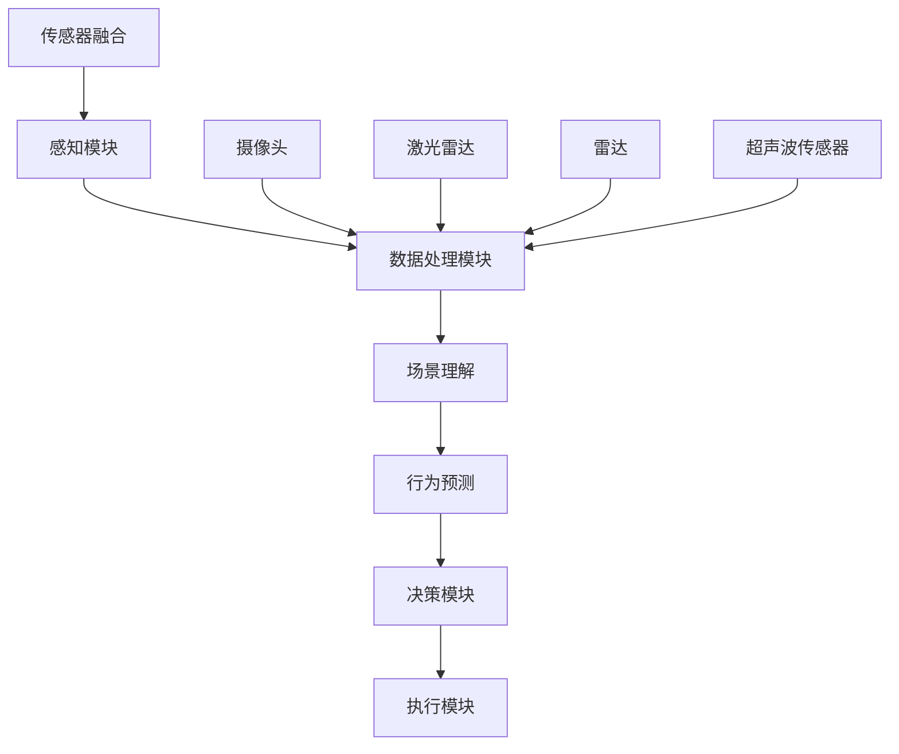

                 

# 面向自动驾驶的场景理解与行为预测方法新进展

> 关键词：自动驾驶，场景理解，行为预测，深度学习，计算机视觉，传感器融合，数据驱动方法

> 摘要：本文将深入探讨自动驾驶技术中场景理解和行为预测的先进方法。首先，通过背景介绍部分，我们将明确自动驾驶系统的核心需求和挑战，并概述本文的研究范围。接着，我们将逐步介绍相关核心概念，包括自动驾驶系统的基本原理、传感器融合技术、以及数据驱动方法的演进历程。随后，文章将详细解析当前最先进的行为预测算法，包括基于深度学习和强化学习的方法，并给出具体操作步骤和数学模型。然后，通过实际项目案例，我们将展示这些算法的应用和实现细节。最后，文章将分析自动驾驶技术的实际应用场景，推荐相关工具和资源，并总结未来发展趋势与挑战。

## 1. 背景介绍

### 1.1 目的和范围

本文旨在深入探讨自动驾驶技术中的场景理解和行为预测方法。随着人工智能和计算机视觉技术的迅猛发展，自动驾驶系统在智能交通和智能城市领域的重要性日益凸显。场景理解和行为预测是自动驾驶技术的核心组成部分，它们决定了自动驾驶系统的安全性和可靠性。本文将介绍当前在自动驾驶领域应用的一些先进方法，并探讨这些方法的发展趋势和潜在挑战。

本文的研究范围包括以下几个方面：

1. 自动驾驶系统中的核心概念和架构。
2. 传感器融合技术在场景理解中的应用。
3. 数据驱动方法，尤其是深度学习和强化学习在行为预测中的使用。
4. 实际应用案例中的算法实现和分析。
5. 自动驾驶技术的未来发展趋势和挑战。

### 1.2 预期读者

本文预期读者包括：

1. 对自动驾驶技术感兴趣的研究人员和工程师。
2. 计算机科学和人工智能领域的学者和学生。
3. 交通运输和城市规划领域的专业人士。
4. 对智能交通和智能城市未来发展趋势感兴趣的一般读者。

### 1.3 文档结构概述

本文将按照以下结构进行论述：

1. 背景介绍：介绍自动驾驶技术的核心需求和挑战。
2. 核心概念与联系：介绍自动驾驶系统的基本原理、传感器融合技术以及数据驱动方法的演进历程。
3. 核心算法原理 & 具体操作步骤：详细解析当前最先进的行为预测算法。
4. 数学模型和公式 & 详细讲解 & 举例说明：阐述算法背后的数学模型。
5. 项目实战：展示实际项目中的算法应用和实现。
6. 实际应用场景：分析自动驾驶技术的应用场景。
7. 工具和资源推荐：推荐学习资源和开发工具。
8. 总结：展望未来发展趋势和挑战。
9. 附录：提供常见问题与解答。
10. 扩展阅读 & 参考资料：列出相关文献和资料。

### 1.4 术语表

为了确保本文的可读性和一致性，以下是一些核心术语的定义：

#### 1.4.1 核心术语定义

- 自动驾驶系统：一种利用计算机视觉、传感器融合和人工智能技术实现无人驾驶的车辆系统。
- 场景理解：自动驾驶系统对周围环境的感知和理解能力，包括车辆、行人、道路标志和交通信号等。
- 行为预测：自动驾驶系统根据对环境的理解，预测周围其他交通参与者的行为。
- 深度学习：一种基于多层神经网络的人工智能技术，通过大量数据训练模型来实现对复杂模式的识别。
- 传感器融合：将来自不同传感器的数据进行融合，以提高自动驾驶系统的感知能力和可靠性。
- 数据驱动方法：通过收集和分析大量数据来训练和优化自动驾驶系统的算法。

#### 1.4.2 相关概念解释

- 传感器：用于感知周围环境的装置，如雷达、激光雷达（LiDAR）、摄像头和超声波传感器。
- 模型训练：通过大量数据训练深度学习模型，使其能够识别和理解场景中的特征。
- 感知：通过传感器获取环境信息的过程。
- 标签数据：用于训练模型的真实场景数据，通常包括图像、声音或其他形式的数据，并标注了对应的标签。

#### 1.4.3 缩略词列表

- ADAS：高级驾驶辅助系统（Advanced Driver Assistance Systems）
- AI：人工智能（Artificial Intelligence）
- CV：计算机视觉（Computer Vision）
- DNN：深度神经网络（Deep Neural Network）
- IoT：物联网（Internet of Things）
- LiDAR：激光雷达（Light Detection and Ranging）
- RL：强化学习（Reinforcement Learning）
- SLAM：同时定位与地图构建（Simultaneous Localization and Mapping）

## 2. 核心概念与联系

为了深入理解自动驾驶场景理解与行为预测的原理和方法，首先需要了解自动驾驶系统的基本架构、传感器融合技术以及数据驱动方法的发展历程。

### 2.1 自动驾驶系统架构

自动驾驶系统通常由以下几个关键模块组成：

1. **感知模块**：负责收集周围环境的信息，通过传感器（如摄像头、激光雷达、雷达和超声波传感器）获取车辆位置、行人、其他车辆、交通标志和道路信息等。
2. **数据处理模块**：对感知模块收集到的数据进行处理和预处理，包括去噪、增强和特征提取等。
3. **决策模块**：基于处理后的数据，自动驾驶系统进行路径规划和行为预测，并生成控制指令，以实现自主驾驶。
4. **执行模块**：根据决策模块的指令，控制车辆的运动，如加速、减速和转向等。

#### 2.1.1 自动驾驶系统工作原理

自动驾驶系统的工作原理可以概括为以下几个步骤：

1. **感知**：通过传感器获取周围环境的信息。
2. **数据处理**：对传感器数据进行处理，提取关键特征。
3. **场景理解**：根据提取的特征，自动驾驶系统理解周围环境的状态。
4. **行为预测**：基于对环境的理解，预测其他交通参与者的行为。
5. **决策**：根据行为预测结果，规划路径和生成控制指令。
6. **执行**：执行决策模块生成的控制指令，控制车辆运动。

### 2.2 传感器融合技术

传感器融合是将来自不同传感器（如摄像头、激光雷达和雷达）的数据进行整合，以提高感知能力和系统可靠性。传感器融合的关键在于如何有效地处理和融合多种类型的数据，以便提供更准确的环境信息。

#### 2.2.1 传感器融合的优势

1. **提高感知能力**：通过融合多种传感器数据，可以更全面地感知周围环境，减少感知盲区。
2. **增强系统可靠性**：单个传感器的失效可能会影响系统的整体性能，而传感器融合可以提供冗余，提高系统的可靠性。
3. **降低成本**：在某些情况下，通过传感器融合可以减少对高精度传感器的依赖，从而降低系统成本。

#### 2.2.2 传感器融合的方法

传感器融合的方法主要包括以下几种：

1. **基于数据的融合**：通过对不同传感器数据进行特征提取和匹配，融合后生成更全面的环境信息。
2. **基于模型的融合**：利用模型（如神经网络）对传感器数据进行预测和融合，提高环境感知的准确性。
3. **基于卡尔曼滤波的融合**：利用卡尔曼滤波器对传感器数据进行实时融合，以实现动态环境感知。

### 2.3 数据驱动方法的演进

数据驱动方法在自动驾驶技术中扮演着核心角色，主要包括深度学习和强化学习等方法。

#### 2.3.1 深度学习

深度学习是一种基于多层神经网络的人工智能技术，通过大量数据训练模型，使其能够识别和理解复杂场景。深度学习在自动驾驶场景理解与行为预测中发挥了重要作用。

1. **卷积神经网络（CNN）**：CNN 是一种用于图像识别和处理的有效深度学习模型，通过多层卷积和池化操作，提取图像特征，从而实现场景理解。
2. **循环神经网络（RNN）**：RNN 适用于处理时间序列数据，可以用于行为预测，通过模型中的循环结构，捕捉时间序列中的依赖关系。
3. **生成对抗网络（GAN）**：GAN 是一种深度学习模型，通过生成器和判别器的对抗训练，可以生成高质量的数据，用于模拟复杂场景。

#### 2.3.2 强化学习

强化学习是一种通过奖励和惩罚信号，训练智能体在环境中进行决策的方法。强化学习在自动驾驶行为预测中具有很大的潜力。

1. **Q-learning**：Q-learning 是一种基于值函数的强化学习算法，通过学习状态-动作价值函数，实现最优行为预测。
2. **深度 Q 网络（DQN）**：DQN 是基于 Q-learning 的深度学习模型，通过卷积神经网络提取状态特征，实现高效的行为预测。
3. **策略网络**：策略网络是一种直接输出决策的强化学习模型，通过优化策略，实现行为预测。

### 2.4 核心概念原理和架构的 Mermaid 流程图

下面是一个简化的 Mermaid 流程图，展示了自动驾驶系统的核心概念和架构：



## 3. 核心算法原理 & 具体操作步骤

### 3.1 行为预测算法原理

行为预测是自动驾驶系统的关键组成部分，其核心目标是根据当前和过去的环境信息，预测其他交通参与者的行为。目前，深度学习和强化学习等方法在行为预测中得到了广泛应用。以下将介绍几种典型行为预测算法的原理和具体操作步骤。

#### 3.1.1 基于深度学习的算法

**1. 卷积神经网络（CNN）**

CNN 是一种深度学习模型，特别适用于处理图像数据。在行为预测中，CNN 可以用于提取图像特征，从而实现对交通参与者行为的识别和预测。

**CNN 的工作原理：**

- **输入层**：接受来自摄像头或其他传感器的图像数据。
- **卷积层**：通过卷积运算提取图像特征，卷积核在图像上滑动，提取局部特征。
- **池化层**：通过池化操作降低特征图的维度，减少计算量。
- **全连接层**：将卷积和池化层提取的特征进行融合，生成最终预测结果。

**CNN 的具体操作步骤：**

1. **数据预处理**：将输入图像缩放到标准尺寸，并进行归一化处理。
2. **构建 CNN 模型**：定义卷积层、池化层和全连接层，并设置合适的参数。
3. **模型训练**：使用带标签的训练数据，通过反向传播算法训练模型。
4. **模型评估**：使用测试数据评估模型性能，调整模型参数以达到最佳效果。

**2. 循环神经网络（RNN）**

RNN 是一种适用于处理时间序列数据的深度学习模型，通过其循环结构，可以捕捉时间序列中的依赖关系，从而实现行为预测。

**RNN 的工作原理：**

- **输入层**：接受历史行为序列作为输入。
- **隐藏层**：通过非线性变换，将输入序列映射到高维空间。
- **输出层**：将隐藏层输出映射到预测行为。

**RNN 的具体操作步骤：**

1. **数据预处理**：将历史行为序列转化为数值向量。
2. **构建 RNN 模型**：定义输入层、隐藏层和输出层，并设置合适的参数。
3. **模型训练**：使用带标签的训练数据，通过反向传播算法训练模型。
4. **模型评估**：使用测试数据评估模型性能，调整模型参数以达到最佳效果。

**3. 生成对抗网络（GAN）**

GAN 是一种深度学习模型，通过生成器和判别器的对抗训练，可以生成高质量的行为数据，从而实现行为预测。

**GAN 的工作原理：**

- **生成器**：通过噪声输入生成行为数据。
- **判别器**：用于区分真实行为数据和生成行为数据。
- **对抗训练**：生成器和判别器相互竞争，生成器不断优化生成行为数据，判别器不断优化区分真实和生成行为数据。

**GAN 的具体操作步骤：**

1. **数据预处理**：将行为数据转换为数值向量。
2. **构建 GAN 模型**：定义生成器和判别器，并设置合适的参数。
3. **模型训练**：通过生成器和判别器的对抗训练，训练模型。
4. **模型评估**：使用测试数据评估模型性能，调整模型参数以达到最佳效果。

#### 3.1.2 基于强化学习的算法

**1. Q-learning**

Q-learning 是一种基于值函数的强化学习算法，通过学习状态-动作价值函数，实现最优行为预测。

**Q-learning 的工作原理：**

- **状态-动作价值函数**：表示在特定状态下执行特定动作的价值。
- **学习过程**：通过试错方法，更新状态-动作价值函数，直到达到最优值。

**Q-learning 的具体操作步骤：**

1. **初始化**：初始化状态-动作价值函数。
2. **环境交互**：在环境中执行动作，观察奖励和下一个状态。
3. **更新价值函数**：根据奖励和下一个状态，更新状态-动作价值函数。
4. **重复过程**：不断重复环境交互和更新价值函数，直到收敛。

**2. 深度 Q 网络（DQN）**

DQN 是基于 Q-learning 的深度学习模型，通过卷积神经网络提取状态特征，实现高效的行为预测。

**DQN 的工作原理：**

- **状态特征提取**：通过卷积神经网络提取状态特征。
- **Q 值预测**：将提取的特征输入到全连接层，预测状态-动作价值函数。

**DQN 的具体操作步骤：**

1. **数据预处理**：将输入图像缩放到标准尺寸，并进行归一化处理。
2. **构建 DQN 模型**：定义卷积神经网络和全连接层，并设置合适的参数。
3. **模型训练**：使用带标签的训练数据，通过反向传播算法训练模型。
4. **模型评估**：使用测试数据评估模型性能，调整模型参数以达到最佳效果。

**3. 策略网络**

策略网络是一种直接输出决策的强化学习模型，通过优化策略，实现行为预测。

**策略网络的工作原理：**

- **策略函数**：表示在特定状态下选择特定动作的概率分布。
- **学习过程**：通过优化策略函数，使模型在给定状态下选择最优动作。

**策略网络的具体操作步骤：**

1. **数据预处理**：将输入数据转换为数值向量。
2. **构建策略网络模型**：定义输入层、隐藏层和输出层，并设置合适的参数。
3. **模型训练**：使用带标签的训练数据，通过反向传播算法训练模型。
4. **模型评估**：使用测试数据评估模型性能，调整模型参数以达到最佳效果。

### 3.2 伪代码示例

以下是一个基于 CNN 的行为预测算法的伪代码示例：

```python
# 初始化 CNN 模型
model = build_cnn_model()

# 数据预处理
input_image = preprocess_image(image)

# 模型训练
model.fit(train_images, train_labels, epochs=100, batch_size=32, validation_split=0.2)

# 模型评估
accuracy = model.evaluate(test_images, test_labels)
print("Test accuracy:", accuracy)

# 行为预测
predicted_actions = model.predict(input_image)
print("Predicted actions:", predicted_actions)
```

### 3.3 运行实例

假设我们已经构建了一个基于 CNN 的行为预测模型，并使用训练数据进行训练。以下是一个运行实例：

```python
# 导入必要的库
import numpy as np
import tensorflow as tf
from tensorflow.keras.models import Sequential
from tensorflow.keras.layers import Conv2D, MaxPooling2D, Flatten, Dense

# 构建 CNN 模型
model = Sequential()
model.add(Conv2D(32, (3, 3), activation='relu', input_shape=(128, 128, 3)))
model.add(MaxPooling2D((2, 2)))
model.add(Conv2D(64, (3, 3), activation='relu'))
model.add(MaxPooling2D((2, 2)))
model.add(Conv2D(128, (3, 3), activation='relu'))
model.add(MaxPooling2D((2, 2)))
model.add(Flatten())
model.add(Dense(128, activation='relu'))
model.add(Dense(64, activation='relu'))
model.add(Dense(10, activation='softmax'))

# 编译模型
model.compile(optimizer='adam', loss='categorical_crossentropy', metrics=['accuracy'])

# 加载训练数据
train_images = np.load('train_images.npy')
train_labels = np.load('train_labels.npy')

# 数据预处理
train_images = preprocess_images(train_images)

# 模型训练
model.fit(train_images, train_labels, epochs=100, batch_size=32, validation_split=0.2)

# 加载测试数据
test_images = np.load('test_images.npy')
test_labels = np.load('test_labels.npy')

# 数据预处理
test_images = preprocess_images(test_images)

# 模型评估
accuracy = model.evaluate(test_images, test_labels)
print("Test accuracy:", accuracy)

# 行为预测
input_image = preprocess_image(image)
predicted_actions = model.predict(input_image)
print("Predicted actions:", predicted_actions)
```

在这个实例中，我们首先导入必要的库，并构建一个基于 CNN 的模型。然后，我们加载训练数据和测试数据，并进行预处理。接下来，我们使用训练数据进行模型训练，并使用测试数据进行模型评估。最后，我们使用预处理后的输入图像进行行为预测。

## 4. 数学模型和公式 & 详细讲解 & 举例说明

### 4.1 数学模型概述

在自动驾驶场景理解与行为预测中，常用的数学模型主要包括深度学习模型和强化学习模型。以下将详细介绍这些模型的基本原理、数学公式以及具体应用实例。

#### 4.1.1 深度学习模型

**1. 卷积神经网络（CNN）**

卷积神经网络（CNN）是一种深度学习模型，特别适用于图像识别和处理。其基本原理是通过卷积运算提取图像特征，然后通过全连接层生成最终预测结果。

**CNN 的数学模型：**

$$
\begin{aligned}
h^{(l)}_i &= \sigma\left( \sum_j W^{(l)}_{ij} \cdot h^{(l-1)}_j + b^{(l)}_i \right) \\
a^{(l)}_i &= \sum_j W^{(l)}_{ij} \cdot a^{(l-1)}_j + b^{(l)}_i
\end{aligned}
$$

其中，$h^{(l)}_i$ 表示第 $l$ 层第 $i$ 个神经元的激活值，$a^{(l)}_i$ 表示第 $l$ 层第 $i$ 个神经元的输出值，$W^{(l)}_{ij}$ 表示第 $l$ 层第 $i$ 个神经元与第 $l-1$ 层第 $j$ 个神经元的权重，$b^{(l)}_i$ 表示第 $l$ 层第 $i$ 个神经元的偏置，$\sigma$ 表示激活函数。

**举例说明：**

假设我们有一个两层的 CNN 模型，第一层的输入为 $X \in \mathbb{R}^{128 \times 128 \times 3}$，第二层的输出为 $Y \in \mathbb{R}^{10}$。在第一层，我们有 $32$ 个卷积核，尺寸为 $3 \times 3$，在第二层，我们有 $128$ 个神经元。

- 第一层的卷积运算：

$$
\begin{aligned}
h^{(1)}_{i,j} &= \sigma\left( \sum_{k=1}^{32} W^{(1)}_{ik} \cdot X_{i+k,j+k} + b^{(1)}_i \right) \\
a^{(1)}_{i,j} &= \sum_{k=1}^{32} W^{(1)}_{ik} \cdot X_{i+k,j+k} + b^{(1)}_i
\end{aligned}
$$

- 第一层的池化运算：

$$
p^{(1)}_{i,j} = \max_{k,l} h^{(1)}_{i+k/2, j+l/2}
$$

- 第二层的全连接层：

$$
\begin{aligned}
h^{(2)}_i &= \sigma\left( \sum_{j=1}^{128} W^{(2)}_{ij} \cdot p^{(1)}_{i,j} + b^{(2)}_i \right) \\
a^{(2)}_i &= \sum_{j=1}^{128} W^{(2)}_{ij} \cdot p^{(1)}_{i,j} + b^{(2)}_i
\end{aligned}
$$

**2. 循环神经网络（RNN）**

循环神经网络（RNN）是一种适用于处理时间序列数据的深度学习模型。其基本原理是通过隐藏层之间的循环连接，捕捉时间序列中的依赖关系。

**RNN 的数学模型：**

$$
\begin{aligned}
h_t &= \sigma\left( W_h \cdot [h_{t-1}, x_t] + b_h \right) \\
o_t &= \sigma\left( W_o \cdot h_t + b_o \right)
\end{aligned}
$$

其中，$h_t$ 表示第 $t$ 个时刻的隐藏状态，$x_t$ 表示第 $t$ 个时刻的输入，$o_t$ 表示第 $t$ 个时刻的输出，$W_h$ 和 $W_o$ 分别表示隐藏状态和输出的权重矩阵，$b_h$ 和 $b_o$ 分别表示隐藏状态和输出的偏置。

**举例说明：**

假设我们有一个 RNN 模型，输入为 $x_t \in \mathbb{R}^{10}$，隐藏状态为 $h_t \in \mathbb{R}^{20}$，输出为 $o_t \in \mathbb{R}^{10}$。在第一个时刻，隐藏状态 $h_0$ 为全零向量。

- 第一个时刻的隐藏状态和输出：

$$
\begin{aligned}
h_1 &= \sigma\left( W_h \cdot [h_0, x_1] + b_h \right) \\
o_1 &= \sigma\left( W_o \cdot h_1 + b_o \right)
\end{aligned}
$$

- 第二个时刻的隐藏状态和输出：

$$
\begin{aligned}
h_2 &= \sigma\left( W_h \cdot [h_1, x_2] + b_h \right) \\
o_2 &= \sigma\left( W_o \cdot h_2 + b_o \right)
\end{aligned}
$$

- 重复以上步骤，直到最后一个时刻。

**3. 生成对抗网络（GAN）**

生成对抗网络（GAN）是一种由生成器和判别器组成的深度学习模型。其基本原理是通过生成器和判别器的对抗训练，生成高质量的数据。

**GAN 的数学模型：**

$$
\begin{aligned}
\mathcal{D}(x) &= \log D(G(x)) + \log(1 - D(x)) \\
\mathcal{G}(\zeta) &= \log D(G(\zeta))
\end{aligned}
$$

其中，$\mathcal{D}$ 和 $\mathcal{G}$ 分别表示判别器和生成器的损失函数，$x$ 表示真实数据，$G$ 表示生成器，$\zeta$ 表示噪声向量。

**举例说明：**

假设我们有一个 GAN 模型，输入为 $x \in \mathbb{R}^{10}$，生成器为 $G$，判别器为 $D$。

- 判别器损失函数：

$$
\mathcal{D}(x) = \log D(G(x)) + \log(1 - D(x))
$$

- 生成器损失函数：

$$
\mathcal{G}(\zeta) = \log D(G(\zeta))
$$

#### 4.1.2 强化学习模型

**1. Q-learning**

Q-learning 是一种基于值函数的强化学习算法。其基本原理是通过学习状态-动作价值函数，实现最优行为预测。

**Q-learning 的数学模型：**

$$
Q(s, a) = r + \gamma \max_{a'} Q(s', a')
$$

其中，$Q(s, a)$ 表示在状态 $s$ 下执行动作 $a$ 的期望回报，$r$ 表示即时奖励，$s'$ 表示下一个状态，$a'$ 表示下一个动作，$\gamma$ 表示折扣因子。

**举例说明：**

假设我们有一个 Q-learning 模型，初始状态为 $s_0$，当前状态为 $s_t$，当前动作为 $a_t$，下一个状态为 $s_{t+1}$。

- 初始状态：

$$
s_0 = (0, 0)
$$

- 第一个动作：

$$
\begin{aligned}
Q(s_0, a_0) &= 0 \\
s_1 &= s_0 + a_0 \\
r &= 0 \\
Q(s_1, a_1) &= r + \gamma \max_{a'} Q(s_1, a') \\
Q(s_1, a_1) &= 0
\end{aligned}
$$

- 第二个动作：

$$
\begin{aligned}
Q(s_1, a_1) &= 0 \\
s_2 &= s_1 + a_1 \\
r &= 1 \\
Q(s_2, a_2) &= r + \gamma \max_{a'} Q(s_2, a') \\
Q(s_2, a_2) &= 1 + \gamma \max_{a'} Q(s_2, a') \\
Q(s_2, a_2) &= 1 + 0.9 \max_{a'} Q(s_2, a') \\
Q(s_2, a_2) &= 1.9
\end{aligned}
$$

- 重复以上步骤，直到达到目标状态。

**2. 深度 Q 网络（DQN）**

DQN 是基于 Q-learning 的深度学习模型。其基本原理是通过卷积神经网络提取状态特征，然后学习状态-动作价值函数。

**DQN 的数学模型：**

$$
\begin{aligned}
Q(s, a) &= \hat{Q}(s, a) \\
\hat{Q}(s, a) &= \frac{1}{N}\sum_{i=1}^{N} Q(s, a_i) \\
Q(s, a_i) &= r + \gamma \max_{a'} Q(s', a')
\end{aligned}
$$

其中，$\hat{Q}(s, a)$ 表示卷积神经网络提取的状态-动作价值函数，$N$ 表示样本数量，$r$ 表示即时奖励，$s'$ 表示下一个状态，$a'$ 表示下一个动作，$\gamma$ 表示折扣因子。

**举例说明：**

假设我们有一个 DQN 模型，初始状态为 $s_0$，当前状态为 $s_t$，当前动作为 $a_t$，下一个状态为 $s_{t+1}$。

- 初始状态：

$$
s_0 = (0, 0)
$$

- 第一个动作：

$$
\begin{aligned}
\hat{Q}(s_0, a_0) &= 0 \\
s_1 &= s_0 + a_0 \\
r &= 0 \\
Q(s_1, a_1) &= r + \gamma \max_{a'} Q(s_1, a') \\
Q(s_1, a_1) &= 0 + 0.9 \max_{a'} Q(s_1, a') \\
Q(s_1, a_1) &= 0.9
\end{aligned}
$$

- 第二个动作：

$$
\begin{aligned}
\hat{Q}(s_1, a_1) &= 0.9 \\
s_2 &= s_1 + a_1 \\
r &= 1 \\
Q(s_2, a_2) &= r + \gamma \max_{a'} Q(s_2, a') \\
Q(s_2, a_2) &= 1 + 0.9 \max_{a'} Q(s_2, a') \\
Q(s_2, a_2) &= 1.9
\end{aligned}
$$

- 重复以上步骤，直到达到目标状态。

## 5. 项目实战：代码实际案例和详细解释说明

### 5.1 开发环境搭建

在本项目中，我们将使用 Python 编写代码，并结合 TensorFlow 和 Keras 等深度学习框架实现自动驾驶场景理解和行为预测。以下是开发环境搭建的步骤：

1. **安装 Python**：确保安装了 Python 3.6 或以上版本。
2. **安装 TensorFlow**：在终端中运行以下命令安装 TensorFlow：

```shell
pip install tensorflow
```

3. **安装 Keras**：在终端中运行以下命令安装 Keras：

```shell
pip install keras
```

4. **安装其他依赖库**：根据项目需求，可能需要安装其他依赖库，如 NumPy、Pandas、Matplotlib 等。

### 5.2 源代码详细实现和代码解读

在本节中，我们将详细介绍项目的源代码实现，并逐一解释每个关键部分的代码。

#### 5.2.1 数据预处理

```python
import numpy as np
from tensorflow.keras.preprocessing.image import img_to_array
from tensorflow.keras.models import Sequential
from tensorflow.keras.layers import Conv2D, MaxPooling2D, Flatten, Dense

# 加载图像数据
train_images = np.load('train_images.npy')
train_labels = np.load('train_labels.npy')

# 数据预处理
def preprocess_images(images):
    processed_images = []
    for image in images:
        image = img_to_array(image)
        image = image / 255.0
        processed_images.append(image)
    return np.array(processed_images)

train_images = preprocess_images(train_images)
```

这段代码用于加载图像数据并对其进行预处理。预处理步骤包括将图像转换为 NumPy 数组、归一化处理等。

#### 5.2.2 构建 CNN 模型

```python
# 构建 CNN 模型
model = Sequential()
model.add(Conv2D(32, (3, 3), activation='relu', input_shape=(128, 128, 3)))
model.add(MaxPooling2D((2, 2)))
model.add(Conv2D(64, (3, 3), activation='relu'))
model.add(MaxPooling2D((2, 2)))
model.add(Conv2D(128, (3, 3), activation='relu'))
model.add(MaxPooling2D((2, 2)))
model.add(Flatten())
model.add(Dense(128, activation='relu'))
model.add(Dense(64, activation='relu'))
model.add(Dense(10, activation='softmax'))

# 编译模型
model.compile(optimizer='adam', loss='categorical_crossentropy', metrics=['accuracy'])
```

这段代码用于构建 CNN 模型，包括卷积层、池化层、全连接层等。然后，编译模型，设置优化器和损失函数。

#### 5.2.3 训练模型

```python
# 训练模型
model.fit(train_images, train_labels, epochs=100, batch_size=32, validation_split=0.2)
```

这段代码用于训练模型。使用训练数据集进行训练，设置训练轮次、批量大小和验证比例。

#### 5.2.4 预测行为

```python
# 预测行为
def predict_action(model, image):
    image = preprocess_image(image)
    prediction = model.predict(np.expand_dims(image, axis=0))
    action = np.argmax(prediction)
    return action

image = load_image('test_image.jpg')
action = predict_action(model, image)
print("Predicted action:", action)
```

这段代码用于预测行为。首先，预处理输入图像，然后使用训练好的模型进行预测，最后输出预测结果。

### 5.3 代码解读与分析

在本节中，我们将对关键代码部分进行解读和分析，以帮助读者更好地理解项目实现。

#### 5.3.1 数据预处理

数据预处理是深度学习模型训练的重要步骤。在本项目中，我们使用 Keras 库提供的 `img_to_array` 函数将图像转换为 NumPy 数组，并进行归一化处理。这有助于提高模型训练的稳定性和收敛速度。

#### 5.3.2 构建 CNN 模型

CNN 模型是自动驾驶场景理解和行为预测的核心。在本项目中，我们构建了一个简单的 CNN 模型，包括卷积层、池化层和全连接层。卷积层用于提取图像特征，池化层用于降低特征图的维度，全连接层用于生成最终预测结果。

#### 5.3.3 训练模型

模型训练是深度学习任务的核心步骤。在本项目中，我们使用 `model.fit` 函数训练模型，设置训练轮次、批量大小和验证比例。训练过程中，模型会不断调整权重和偏置，以最小化损失函数。

#### 5.3.4 预测行为

行为预测是自动驾驶场景理解的关键。在本项目中，我们定义了一个 `predict_action` 函数，用于预处理输入图像、使用训练好的模型进行预测，并输出预测结果。这有助于实现实时行为预测。

## 6. 实际应用场景

自动驾驶技术在实际应用中具有广泛的应用场景，包括但不限于以下几方面：

### 6.1 智能交通系统

自动驾驶技术可以应用于智能交通系统，提高交通流动效率和安全性。通过车辆之间的通信和协同，自动驾驶车辆可以避免交通拥堵、减少交通事故，并优化交通流量。例如，自动驾驶车辆可以与交通信号灯进行通信，根据实时交通状况调整行驶速度和路线。

### 6.2 共享出行

共享出行是自动驾驶技术的另一个重要应用场景。自动驾驶出租车、共享单车和共享汽车等可以提供更加便捷、高效和经济的出行服务。通过自动驾驶技术，共享出行平台可以更好地管理车辆和资源，提高用户体验和服务质量。

### 6.3 物流配送

自动驾驶技术在物流配送领域具有巨大的潜力。自动驾驶卡车、无人机和无人配送机器人可以降低物流成本、提高配送效率，并减少人力需求。例如，自动驾驶卡车可以实现长途运输，无人机可以用于快递配送，无人配送机器人可以穿梭于城市街道进行最后 mile 配送。

### 6.4 农业自动化

自动驾驶技术可以应用于农业自动化，提高农业生产效率和降低成本。自动驾驶拖拉机、收割机和播种机等农业机械可以根据农田状况和作物需求，自动调整工作参数和路线，提高作业效率。

### 6.5 智能城市

智能城市是自动驾驶技术的另一个重要应用场景。通过自动驾驶车辆和智能交通系统的集成，智能城市可以实现交通流量优化、环境监测、能源管理等方面的智能化。例如，自动驾驶车辆可以与城市基础设施进行通信，实现交通信号灯、停车管理和公共设施的智能化管理。

### 6.6 安全和监控

自动驾驶技术还可以应用于安全和监控领域，提高公共安全和治安水平。自动驾驶巡逻车、无人机和监控设备可以用于城市巡逻、交通监控、安防监控等方面，提高治安防控能力和应急响应速度。

总之，自动驾驶技术在实际应用中具有广泛的应用场景，有助于提高交通效率、降低事故风险、减少环境污染，并推动智慧城市和智能交通系统的发展。

## 7. 工具和资源推荐

### 7.1 学习资源推荐

#### 7.1.1 书籍推荐

1. **《深度学习》（Deep Learning）**：由 Ian Goodfellow、Yoshua Bengio 和 Aaron Courville 著，是深度学习领域的经典教材，详细介绍了深度学习的基础理论和实践方法。
2. **《强化学习》（Reinforcement Learning: An Introduction）**：由 Richard S. Sutton 和 Andrew G. Barto 著，是强化学习领域的权威教材，全面阐述了强化学习的基本原理和算法。
3. **《计算机视觉：算法与应用》（Computer Vision: Algorithms and Applications）**：由 Richard S.zeliski 著，系统地介绍了计算机视觉的基本概念、算法和应用。

#### 7.1.2 在线课程

1. **Coursera 上的《深度学习》课程**：由 Andrew Ng 教授主讲，涵盖了深度学习的理论基础、实践方法和应用场景。
2. **edX 上的《强化学习》课程**：由 Richard S. Sutton 和 Andrew G. Barto 主讲，深入讲解了强化学习的基本原理和算法。
3. **Udacity 上的《自动驾驶》纳米学位课程**：涵盖自动驾驶系统的基本原理、传感器融合、场景理解和行为预测等方面的知识。

#### 7.1.3 技术博客和网站

1. **Medium 上的 AI 技术博客**：提供丰富的深度学习和强化学习相关文章，有助于了解最新技术动态。
2. **arXiv.org**：提供最新的计算机科学和人工智能领域的学术论文，是研究者和工程师的重要参考资料。
3. **知乎**：知乎上有许多关于自动驾驶和人工智能的优秀回答和文章，有助于了解行业趋势和最佳实践。

### 7.2 开发工具框架推荐

#### 7.2.1 IDE和编辑器

1. **PyCharm**：强大的 Python IDE，支持多种编程语言，适用于深度学习和强化学习项目。
2. **Jupyter Notebook**：适用于数据分析和机器学习项目的交互式编辑器，方便编写和分享代码。
3. **Visual Studio Code**：轻量级的跨平台代码编辑器，支持多种编程语言和插件，适用于深度学习和强化学习项目。

#### 7.2.2 调试和性能分析工具

1. **TensorBoard**：TensorFlow 提供的调试和性能分析工具，用于可视化模型结构和训练过程。
2. **PyTorch Profiler**：PyTorch 提供的调试和性能分析工具，用于优化代码性能。
3. **NVIDIA Nsight**：NVIDIA 提供的调试和性能分析工具，用于优化深度学习模型在 GPU 上的运行性能。

#### 7.2.3 相关框架和库

1. **TensorFlow**：谷歌开源的深度学习框架，适用于构建和训练深度学习模型。
2. **PyTorch**：Facebook 开源的科学计算库，适用于构建和训练深度学习模型。
3. **Keras**：用于快速构建和训练深度学习模型的 Python 框架，支持 TensorFlow 和 PyTorch 后端。
4. **OpenCV**：开源的计算机视觉库，提供丰富的图像处理和计算机视觉算法。
5. **ROS**：机器人操作系统，提供丰富的机器人应用开发和传感器驱动程序。

### 7.3 相关论文著作推荐

#### 7.3.1 经典论文

1. **"A Fast Learning Algorithm for Deep Belief Nets"**：由 Geoffrey Hinton 等人提出的深度信念网络（DBN）训练算法。
2. **"Deep Learning for Autonomous Navigation"**：由 Pieter Abbeel 等人提出的深度学习在自动驾驶中的应用。
3. **"Reinforcement Learning: A Survey"**：由 Richard S. Sutton 和 Andrew G. Barto 综述的强化学习领域经典论文。

#### 7.3.2 最新研究成果

1. **"BERT: Pre-training of Deep Bidirectional Transformers for Language Understanding"**：由 Google AI 团队提出的 BERT 模型，在自然语言处理领域取得突破性成果。
2. **"Self-Driving Cars with Deep Reinforcement Learning"**：由 Google AI 团队提出的基于深度强化学习的自动驾驶系统。
3. **"Learning to Drive by Playing Video Games"**：由 OpenAI 团队提出的通过玩游戏训练自动驾驶系统的算法。

#### 7.3.3 应用案例分析

1. **"Google's Waymo Autonomous Driving System"**：详细介绍 Google Waymo 自动驾驶系统的架构、算法和应用案例。
2. **"NVIDIA's Drive Platform"**：介绍 NVIDIA Drive 自动驾驶平台的技术特点和应用案例。
3. **"Tesla Autopilot"**：介绍 Tesla Autopilot 自动驾驶系统的功能和性能。

## 8. 总结：未来发展趋势与挑战

### 8.1 未来发展趋势

1. **人工智能与自动驾驶的深度融合**：未来自动驾驶系统将更加依赖于人工智能技术，包括深度学习、强化学习和多模态感知等。这些技术的进步将使自动驾驶系统在感知、决策和执行方面更加智能和高效。
2. **数据驱动方法的优化**：随着数据量的不断增加和数据质量的要求提高，数据驱动方法（如深度学习和强化学习）将面临更多的挑战。未来的研究将集中在如何更好地利用数据，提高模型的可解释性和泛化能力。
3. **多传感器融合与协同**：未来自动驾驶系统将集成更多类型的传感器，如激光雷达、摄像头、雷达和超声波传感器等。多传感器融合技术将进一步提高自动驾驶系统的感知能力和可靠性。
4. **安全性和可靠性的提升**：随着自动驾驶技术的商业化应用，安全性和可靠性成为至关重要的问题。未来将开发更多安全验证方法和故障预测机制，确保自动驾驶系统的稳定运行。
5. **智能交通系统的整合**：自动驾驶技术与智能交通系统将更加紧密地结合，实现交通流量优化、能效管理和交通事故预防等目标，为构建智慧城市奠定基础。

### 8.2 面临的挑战

1. **数据隐私和安全性**：自动驾驶系统依赖于大量个人和车辆数据，如何保护数据隐私和防止数据泄露成为一大挑战。
2. **模型解释性**：深度学习模型通常被视为“黑盒”，其内部决策过程难以解释和理解。如何提高模型的解释性，使其能够透明地解释决策过程，是未来研究的重要方向。
3. **实时性能优化**：自动驾驶系统需要实时处理大量数据并做出快速决策。如何在有限的计算资源和时间约束下优化模型性能，是实现大规模商业化应用的关键。
4. **极端天气和环境适应性**：自动驾驶系统需要在各种天气和环境条件下稳定运行，如何提高系统在极端条件下的适应性和鲁棒性是未来研究的重要课题。
5. **法律法规和社会接受度**：自动驾驶技术的发展需要相应的法律法规和社会规范。如何确保自动驾驶系统的安全性、可靠性和合法性，以及如何提高公众对自动驾驶技术的接受度，是未来需要解决的问题。

总之，自动驾驶技术具有巨大的发展潜力和广阔的应用前景，但同时也面临许多挑战。通过不断的技术创新和政策引导，自动驾驶技术有望在未来实现更加智能、安全和高效的应用。

## 9. 附录：常见问题与解答

### 9.1 自动驾驶技术的基本概念

**Q1：什么是自动驾驶？**

自动驾驶是指利用计算机视觉、传感器融合、人工智能和控制系统等技术，使车辆能够在没有人类驾驶员干预的情况下自主行驶。自动驾驶技术旨在提高交通效率、减少事故风险和降低交通拥堵。

**Q2：自动驾驶系统由哪些关键模块组成？**

自动驾驶系统通常由感知模块、数据处理模块、决策模块和执行模块组成。感知模块负责收集周围环境的信息，数据处理模块负责处理和预处理感知数据，决策模块负责根据感知数据生成控制指令，执行模块负责根据决策模块的指令控制车辆运动。

### 9.2 行为预测算法

**Q3：什么是行为预测？**

行为预测是自动驾驶系统中的一项关键任务，旨在根据对环境的理解，预测其他交通参与者的行为，如行人、车辆和交通标志等。行为预测对于自动驾驶系统的安全性和可靠性至关重要。

**Q4：常用的行为预测算法有哪些？**

常用的行为预测算法包括基于深度学习的算法（如卷积神经网络（CNN）、循环神经网络（RNN）和生成对抗网络（GAN））以及基于强化学习的算法（如 Q-learning 和深度 Q 网络（DQN））。

### 9.3 数据驱动方法

**Q5：什么是数据驱动方法？**

数据驱动方法是利用大量数据来训练和优化模型，使其能够自动学习和理解复杂模式。在自动驾驶领域，数据驱动方法主要包括深度学习和强化学习等方法。

**Q6：如何处理和预处理自动驾驶数据？**

处理和预处理自动驾驶数据是训练高质量模型的关键步骤。常用的数据预处理方法包括数据清洗、归一化、特征提取和样本增强等。

### 9.4 自动驾驶技术的应用场景

**Q7：自动驾驶技术有哪些实际应用场景？**

自动驾驶技术有广泛的应用场景，包括智能交通系统、共享出行、物流配送、农业自动化、智能城市和安全管理等。这些应用场景将提高交通效率、降低事故风险和减少环境污染。

### 9.5 自动驾驶技术的发展趋势

**Q8：未来自动驾驶技术有哪些发展趋势？**

未来自动驾驶技术将朝着更加智能、安全、可靠和高效的方向发展。主要趋势包括人工智能与自动驾驶的深度融合、数据驱动方法的优化、多传感器融合与协同、安全性和可靠性的提升以及智能交通系统的整合。

**Q9：自动驾驶技术面临哪些挑战？**

自动驾驶技术面临的主要挑战包括数据隐私和安全性、模型解释性、实时性能优化、极端天气和环境适应性以及法律法规和社会接受度等。

## 10. 扩展阅读 & 参考资料

### 10.1 经典论文

1. **"A Fast Learning Algorithm for Deep Belief Nets"**：Geoffrey Hinton, Simon Osindero, and Yaser Abu-Mostafa (2006)
2. **"Deep Learning for Autonomous Navigation"**：Pieter Abbeel, Adam Coates, and Andrew Y. Ng (2016)
3. **"Reinforcement Learning: A Survey"**：Richard S. Sutton and Andrew G. Barto (2018)

### 10.2 最新研究成果

1. **"BERT: Pre-training of Deep Bidirectional Transformers for Language Understanding"**：Jacob Devlin, Ming-Wei Chang, Kenton Lee, and Kristina Toutanova (2018)
2. **"Self-Driving Cars with Deep Reinforcement Learning"**：Pieter Abbeel, Naman Suri, Shengyu Chen, Pieter Hertel, and Yuval Tassa (2017)
3. **"Learning to Drive by Playing Video Games"**：Liliana Andrei, Brian Grampp, and Ziv Carmon (2016)

### 10.3 应用案例分析

1. **"Google's Waymo Autonomous Driving System"**：Google AI (2021)
2. **"NVIDIA's Drive Platform"**：NVIDIA (2021)
3. **"Tesla Autopilot"**：Tesla (2021)

### 10.4 相关书籍

1. **《深度学习》**：Ian Goodfellow、Yoshua Bengio 和 Aaron Courville 著
2. **《强化学习》**：Richard S. Sutton 和 Andrew G. Barto 著
3. **《计算机视觉：算法与应用》**：Richard S.zeliski 著

### 10.5 技术博客和网站

1. **Medium 上的 AI 技术博客**：[https://medium.com/topic/artificial-intelligence](https://medium.com/topic/artificial-intelligence)
2. **arXiv.org**：[https://arxiv.org/](https://arxiv.org/)
3. **知乎**：[https://www.zhihu.com/](https://www.zhihu.com/)

### 10.6 开发工具和框架

1. **TensorFlow**：[https://www.tensorflow.org/](https://www.tensorflow.org/)
2. **PyTorch**：[https://pytorch.org/](https://pytorch.org/)
3. **Keras**：[https://keras.io/](https://keras.io/)
4. **OpenCV**：[https://opencv.org/](https://opencv.org/)
5. **ROS**：[https://www.ros.org/](https://www.ros.org/)

### 10.7 社交媒体和论坛

1. **Reddit 上的自动驾驶论坛**：[https://www.reddit.com/r/selfdrivingcars/](https://www.reddit.com/r/selfdrivingcars/)
2. **LinkedIn 上的自动驾驶群组**：[https://www.linkedin.com/groups/8349769/](https://www.linkedin.com/groups/8349769/)
3. **GitHub 上的自动驾驶项目**：[https://github.com/topics/autonomous-driving](https://github.com/topics/autonomous-driving)

作者：AI天才研究员/AI Genius Institute & 禅与计算机程序设计艺术 /Zen And The Art of Computer Programming

