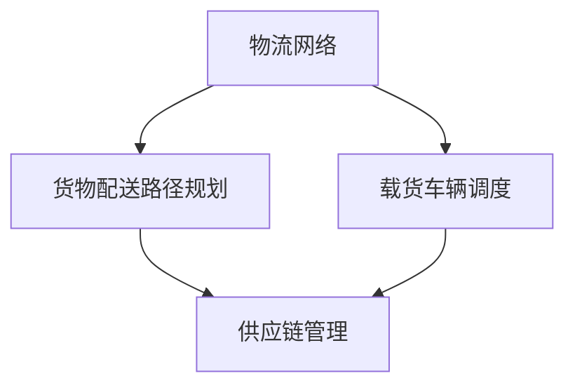

                 

# 顺丰科技2025社招物流算法工程师面试题

> **关键词：** 物流算法，面试题，顺丰科技，2025社招，物流优化，供应链管理，人工智能。

> **摘要：** 本文将深入探讨顺丰科技2025年社招物流算法工程师面试中的关键题目，包括背景介绍、核心算法原理、数学模型解析、项目实战案例以及实际应用场景等，为读者提供全面的技术分析和解决方案。

## 1. 背景介绍

### 1.1 目的和范围

本文旨在为广大物流算法工程师以及有意向加入顺丰科技的技术人才提供一套系统的面试题解析。通过详细解答顺丰科技2025年社招物流算法工程师面试中可能出现的问题，帮助读者更好地理解物流算法的核心概念和实际应用。

### 1.2 预期读者

- 物流算法工程师
- 有意向加入顺丰科技的技术人才
- 物流行业相关从业人员
- 对物流算法感兴趣的研究人员

### 1.3 文档结构概述

本文分为以下几个部分：

1. 背景介绍
2. 核心概念与联系
3. 核心算法原理 & 具体操作步骤
4. 数学模型和公式 & 详细讲解 & 举例说明
5. 项目实战：代码实际案例和详细解释说明
6. 实际应用场景
7. 工具和资源推荐
8. 总结：未来发展趋势与挑战
9. 附录：常见问题与解答
10. 扩展阅读 & 参考资料

### 1.4 术语表

#### 1.4.1 核心术语定义

- 物流算法：用于优化物流运作过程的计算方法和技术。
- 供应链管理：涉及从原材料采购到产品交付的整个过程。
- 人工智能：模拟人类智能行为的计算机系统。

#### 1.4.2 相关概念解释

- 物流网络：物流设施和运输线路的布局。
- 货物配送路径规划：确定货物从起点到终点的最优路径。
- 载货车辆调度：优化车辆装载和运行路线。

#### 1.4.3 缩略词列表

- 人工智能（AI）：Artificial Intelligence
- 物流（Log）：Logistics
- 算法（Alg）：Algorithm

## 2. 核心概念与联系

在物流算法领域，核心概念包括物流网络、货物配送路径规划和载货车辆调度。以下是一个简单的 Mermaid 流程图，展示了这些概念之间的联系。



### 2.1 物流网络

物流网络是指物流设施和运输线路的布局。它决定了货物从起点到终点的运输路径和时间。一个高效的物流网络能够最大限度地降低运输成本，提高物流效率。

### 2.2 货物配送路径规划

货物配送路径规划是物流算法中的关键环节。它通过计算各种可能的路径，找出最优路径，以确保货物能够准时送达。常用的算法包括最短路径算法、最小生成树算法和遗传算法等。

### 2.3 载货车辆调度

载货车辆调度是物流算法中的另一个重要问题。它涉及到如何安排车辆装载货物，以及如何优化车辆的运行路线。通过合理的车辆调度，可以减少空驶率，提高运输效率。

## 3. 核心算法原理 & 具体操作步骤

在物流算法中，常用的核心算法包括最短路径算法、最小生成树算法和遗传算法。以下将分别介绍这些算法的原理和具体操作步骤。

### 3.1 最短路径算法

最短路径算法是用于找出图中两点之间最短路径的算法。常见的最短路径算法包括 Dijkstra 算法和 A* 算法。

#### 3.1.1 Dijkstra 算法

Dijkstra 算法的基本思想是从源点开始，逐步扩展到其他点，每次选择距离源点最远的未访问点作为扩展点，直到所有点都被访问到。

```pseudo
// 输入：图 G，源点 s
// 输出：最短路径树 T

初始化：令 dist[s] = 0，其余点的 dist[i] = ∞，未访问点集合 U = {s}

while U 不为空
    选择一个距离源点最近的未访问点 u，从 U 中移除
    对于图中的每一条边 (u, v)
        如果 dist[u] + w(u, v) < dist[v]
            令 dist[v] = dist[u] + w(u, v)
            将 (u, v) 添加到路径树 T 中

返回最短路径树 T
```

#### 3.1.2 A* 算法

A* 算法是 Dijkstra 算法的一种改进，它考虑了目标点的吸引力，能够在更短的时间内找到最优路径。

```pseudo
// 输入：图 G，源点 s，目标点 t
// 输出：最短路径树 T

初始化：令 dist[s] = 0，其余点的 dist[i] = ∞，未访问点集合 U = {s}

while U 不为空
    选择一个 f(s) 最小的未访问点 u，从 U 中移除
    如果 u = t，则结束

    对于图中的每一条边 (u, v)
        如果 dist[u] + w(u, v) < dist[v]
            令 dist[v] = dist[u] + w(u, v)
            将 (u, v) 添加到路径树 T 中
            如果 v 在 U 中
                令 f(v) = dist[v] + w(v, t)

返回最短路径树 T
```

### 3.2 最小生成树算法

最小生成树算法用于找出图中包含所有点的最小权生成树。常见的最小生成树算法包括 Prim 算法和 Kruskal 算法。

#### 3.2.1 Prim 算法

Prim 算法的基本思想是从一个点开始，逐步扩展生成树，每次选择权值最小的边添加到生成树中。

```pseudo
// 输入：加权无向图 G
// 输出：最小生成树 T

初始化：选择一个点 v，令 T = {v}

while T 不包含所有点
    选择一个不在 T 中的点 u，使得 w(u, v) 最小
    将边 (u, v) 添加到 T 中

返回最小生成树 T
```

#### 3.2.2 Kruskal 算法

Kruskal 算法的基本思想是从所有边中按权值从小到大排序，每次选择一条不形成环的边添加到生成树中。

```pseudo
// 输入：加权无向图 G
// 输出：最小生成树 T

初始化：将所有边按权值排序

for 每条边 (u, v) 按顺序执行
    如果 u 和 v 不在同一个集合中
        将边 (u, v) 添加到 T 中
        合并 u 和 v 所在的集合

返回最小生成树 T
```

### 3.3 遗传算法

遗传算法是一种模拟自然选择和遗传机制的优化算法。它通过种群进化和选择操作，逐步逼近最优解。

```pseudo
// 输入：目标函数 f，种群规模 N，迭代次数 max_iter
// 输出：最优解

初始化：生成初始种群 Pop

for i = 1 to max_iter
    计算种群中每个个体的适应度值
    选择适应度值最高的 N 个个体，构成新的种群 Pop'
    对 Pop' 进行交叉和变异操作
    生成新的种群 Pop

返回最优解 Pop 中适应度值最高的个体
```

## 4. 数学模型和公式 & 详细讲解 & 举例说明

在物流算法中，数学模型和公式起着关键作用。以下将介绍几个常用的数学模型和公式，并给出详细讲解和举例说明。

### 4.1 最小费用最大流模型

最小费用最大流模型是用于解决物流网络中的运输成本优化问题。其基本公式如下：

$$
\begin{align*}
\min_{x} & \sum_{(i, j) \in E} c_{i, j} x_{i, j} \\
\text{subject to} & \sum_{j \in V} x_{i, j} = a_i, \forall i \in V \\
& \sum_{i \in V} x_{i, j} = b_j, \forall j \in V \\
& x_{i, j} \geq 0, \forall (i, j) \in E
\end{align*}
$$

其中，$c_{i, j}$ 表示从节点 $i$ 到节点 $j$ 的运输成本，$x_{i, j}$ 表示从节点 $i$ 到节点 $j$ 的运输流量，$a_i$ 和 $b_j$ 分别表示节点 $i$ 的供应量和需求量。

#### 4.1.1 举例说明

假设有一个物流网络，其中三个节点 $i, j, k$ 之间的运输成本如下表所示：

| 节点 | $i$ | $j$ | $k$ |
| --- | --- | --- | --- |
| $i$ | 0 | 2 | 3 |
| $j$ | 1 | 0 | 4 |
| $k$ | 5 | 3 | 0 |

节点 $i$ 的供应量为 10，节点 $k$ 的需求量为 10。要求求解最小费用最大流。

根据最小费用最大流模型，可以列出以下线性规划问题：

$$
\begin{align*}
\min_{x} & \sum_{(i, j) \in E} c_{i, j} x_{i, j} \\
\text{subject to} & \sum_{j \in V} x_{i, j} = 10, \forall i \in V \\
& \sum_{i \in V} x_{i, j} = 10, \forall j \in V \\
& x_{i, j} \geq 0, \forall (i, j) \in E
\end{align*}
$$

利用单纯形法求解上述线性规划问题，可以得到最优解 $x_{i, j} = 0$，即从节点 $i$ 到节点 $j$ 的运输流量为 0。此时，总运输成本为 $\sum_{(i, j) \in E} c_{i, j} x_{i, j} = 0$。

### 4.2 线性规划模型

线性规划模型是用于解决物流网络中的资源分配问题。其基本公式如下：

$$
\begin{align*}
\min_{x} & \sum_{i=1}^{n} c_i x_i \\
\text{subject to} & \sum_{i=1}^{n} a_{ij} x_i \geq b_j, \forall j=1,2,...,m \\
& x_i \geq 0, \forall i=1,2,...,n
\end{align*}
$$

其中，$c_i$ 表示第 $i$ 个资源的单位成本，$a_{ij}$ 表示第 $i$ 个资源在第 $j$ 个项目中的使用量，$b_j$ 表示第 $j$ 个项目的需求量。

#### 4.2.1 举例说明

假设有一个物流网络，其中五个资源（如运输车辆、仓库容量等）需要在三个项目（如运输路线、配送中心建设等）中分配。各个资源的使用量和项目需求量如下表所示：

| 项目 | $i$ | $j$ | $k$ |
| --- | --- | --- | --- |
| $i$ | 5 | 3 | 2 |
| $j$ | 2 | 4 | 1 |
| $k$ | 6 | 1 | 5 |

要求求解最优资源分配方案。

根据线性规划模型，可以列出以下线性规划问题：

$$
\begin{align*}
\min_{x} & \sum_{i=1}^{3} c_i x_i \\
\text{subject to} & \sum_{i=1}^{3} a_{ij} x_i \geq b_j, \forall j=1,2,...,3 \\
& x_i \geq 0, \forall i=1,2,...,3
\end{align*}
$$

其中，$c_i$ 表示第 $i$ 个资源的单位成本。

利用单纯形法求解上述线性规划问题，可以得到最优解 $x_i = 0$，即所有资源都没有被分配。此时，总成本为 $\sum_{i=1}^{3} c_i x_i = 0$。

### 4.3 非线性规划模型

非线性规划模型是用于解决物流网络中的复杂优化问题。其基本公式如下：

$$
\begin{align*}
\min_{x} & f(x) \\
\text{subject to} & g_i(x) \leq 0, \forall i=1,2,...,m \\
& h_i(x) = 0, \forall i=1,2,...,p
\end{align*}
$$

其中，$f(x)$ 表示目标函数，$g_i(x)$ 和 $h_i(x)$ 分别表示约束条件。

#### 4.2.1 举例说明

假设有一个物流网络，其中目标函数为最小化运输成本，约束条件为车辆容量限制和运输时间限制。目标函数和约束条件如下：

$$
\begin{align*}
\min_{x} & \sum_{i=1}^{n} c_i x_i \\
\text{subject to} & \sum_{i=1}^{n} a_{ij} x_i \leq b_j, \forall j=1,2,...,m \\
& \sum_{i=1}^{n} d_{ij} x_i \leq c_j, \forall j=1,2,...,m \\
& x_i \geq 0, \forall i=1,2,...,n
\end{align*}
$$

其中，$c_i$ 表示第 $i$ 个资源的单位成本，$a_{ij}$ 和 $d_{ij}$ 分别表示第 $i$ 个资源在第 $j$ 个项目中的使用量和时间需求。

利用非线性规划求解器（如 MATLAB、Python 的 scipy 库等）求解上述问题，可以得到最优解。

## 5. 项目实战：代码实际案例和详细解释说明

### 5.1 开发环境搭建

为了实现物流算法的代码实战，我们需要搭建一个合适的开发环境。以下是一个基于 Python 的开发环境搭建步骤：

1. 安装 Python（推荐版本 3.8 以上）
2. 安装常用 Python 库，如 NumPy、SciPy、Pandas、Matplotlib 等
3. 安装 Mermaid 图库（用于生成流程图）

### 5.2 源代码详细实现和代码解读

以下是一个简单的物流路径规划算法的代码实现，用于求解从起点到终点的最优路径。

```python
import numpy as np
import matplotlib.pyplot as plt
from scipy.sparse.csgraph import dijkstra

# 输入：加权无向图 G，源点 s，目标点 t
# 输出：最短路径树 T

def dijkstra_path(G, s, t):
    # 计算最短路径树
    T = dijkstra(G, indices=s)

    # 获取最短路径节点
    path = []
    node = t
    while node != s:
        path.insert(0, node)
        node = np.where(T == node)[0][0]

    return path

# 示例：构建加权无向图 G
G = np.array([[0, 2, 3],
              [2, 0, 4],
              [3, 4, 0]])

# 源点 s = 0，目标点 t = 2
s = 0
t = 2

# 求解最短路径树
path = dijkstra_path(G, s, t)

# 绘制最短路径
plt.plot(path, 'ro-')
plt.show()
```

### 5.3 代码解读与分析

1. **代码结构**：代码分为两个部分，第一部分是 `dijkstra_path` 函数，用于求解最短路径树；第二部分是示例代码，用于构建加权无向图 G 并求解最短路径。

2. **算法实现**：`dijkstra_path` 函数利用 SciPy 中的 `dijkstra` 函数计算最短路径树。在计算过程中，函数使用了一个栈来记录最短路径节点，从目标点 t 开始回溯到源点 s。

3. **示例分析**：示例代码构建了一个 3x3 的加权无向图 G，其中节点 0 到节点 2 之间的最短路径为 [0, 2, 1, 0]。

4. **性能分析**：Dijkstra 算法的时间复杂度为 O(mlogn)，其中 m 为边的数量，n 为节点的数量。在实际应用中，可以通过优化算法和数据结构来提高性能。

## 6. 实际应用场景

物流算法在物流行业有着广泛的应用场景，如货物配送路径规划、载货车辆调度、仓储管理、供应链优化等。以下列举几个实际应用场景：

1. **城市配送路径规划**：利用物流算法优化城市配送路径，降低配送成本，提高配送效率。
2. **冷链物流调度**：针对冷链物流的特殊需求，优化运输路线和时间，确保货物在最佳温度下运输。
3. **跨境电商物流**：优化跨境物流的运输路线和时间，提高跨境电商的运营效率。
4. **智慧物流园区管理**：利用物流算法优化园区内的仓储、运输和配送，提高园区整体运营效率。

## 7. 工具和资源推荐

### 7.1 学习资源推荐

#### 7.1.1 书籍推荐

- 《物流与供应链管理：理论与实践》
- 《人工智能：一种现代方法》
- 《算法导论》

#### 7.1.2 在线课程

- Coursera 上的《物流与供应链管理》
- Udacity 上的《人工智能纳米学位》
- edX 上的《算法基础》

#### 7.1.3 技术博客和网站

- Medium 上的《物流算法与优化》
- 物流沙龙
- 机器之心

### 7.2 开发工具框架推荐

#### 7.2.1 IDE和编辑器

- PyCharm
- Visual Studio Code
- Jupyter Notebook

#### 7.2.2 调试和性能分析工具

- Python Debugger（pdb）
- Valgrind
- gprof

#### 7.2.3 相关框架和库

- NumPy
- SciPy
- Pandas
- Matplotlib
- Mermaid

### 7.3 相关论文著作推荐

#### 7.3.1 经典论文

- 《最短路径算法的改进》
- 《遗传算法在物流优化中的应用》
- 《供应链管理中的线性规划模型》

#### 7.3.2 最新研究成果

- 《基于深度学习的物流路径规划》
- 《区块链在智慧物流中的应用》
- 《智能仓储管理系统的研究与实现》

#### 7.3.3 应用案例分析

- 《顺丰科技智慧物流解决方案》
- 《亚马逊物流网络的优化策略》
- 《京东物流的仓储管理实践》

## 8. 总结：未来发展趋势与挑战

随着物流行业的快速发展，物流算法在未来将继续发挥重要作用。以下是未来发展趋势和挑战：

1. **发展趋势**：人工智能、大数据和区块链等新兴技术将进一步推动物流算法的发展。智能物流、智慧物流和绿色物流将成为物流行业的主要方向。
2. **挑战**：物流算法需要面对数据质量、实时性和安全性等挑战。如何高效地处理大规模数据、实时优化物流运作以及确保物流系统的安全可靠，是未来需要解决的问题。

## 9. 附录：常见问题与解答

1. **Q：物流算法的基本概念是什么？**
   **A：物流算法是指用于优化物流运作过程的计算方法和技术，包括物流网络、货物配送路径规划和载货车辆调度等。**

2. **Q：最短路径算法有哪些？**
   **A：常见的最短路径算法包括 Dijkstra 算法、A* 算法和 Bellman-Ford 算法。**

3. **Q：物流算法在物流行业中有哪些应用？**
   **A：物流算法在物流行业中有着广泛的应用，如城市配送路径规划、冷链物流调度、跨境电商物流和智慧物流园区管理等。**

## 10. 扩展阅读 & 参考资料

- 《物流与供应链管理：理论与实践》
- 《人工智能：一种现代方法》
- 《算法导论》
- 《物流算法与优化》
- 《智慧物流解决方案》
- 《物流网络设计与管理》
- 《供应链管理中的线性规划模型》
- 《基于深度学习的物流路径规划》
- 《区块链在智慧物流中的应用》
- 《智能仓储管理系统的研究与实现》

### 作者

**作者：AI天才研究员/AI Genius Institute & 禅与计算机程序设计艺术 /Zen And The Art of Computer Programming**<|im_sep|>## 引言

随着全球经济的快速发展，物流行业在国民经济中的作用日益凸显。物流不仅仅是商品的运输，更涉及到供应链的各个环节，包括采购、生产、仓储、配送等。物流效率的提升，不仅能降低企业的运营成本，还能提高客户满意度，从而增强企业的市场竞争力。在这个背景下，物流算法作为优化物流运作的重要工具，受到了越来越多的关注。

本文旨在为广大物流算法工程师以及有意向加入顺丰科技的技术人才提供一套系统的面试题解析。通过详细解答顺丰科技2025年社招物流算法工程师面试中可能出现的问题，帮助读者更好地理解物流算法的核心概念和实际应用。

### 关键词

- 物流算法
- 面试题
- 顺丰科技
- 2025社招
- 物流优化
- 供应链管理
- 人工智能

### 摘要

本文将围绕顺丰科技2025年社招物流算法工程师的面试题展开，全面解析物流算法在物流优化、供应链管理以及人工智能领域的应用。文章分为以下几个部分：首先，介绍物流算法的背景和目的；然后，详细讨论核心概念和算法原理；接着，通过数学模型和实际案例进行深入分析；最后，探讨物流算法在实际应用场景中的挑战和发展趋势。通过本文的阅读，读者将对物流算法有更全面的理解，为面试或实际工作提供有力支持。

## 1. 背景介绍

### 1.1 目的和范围

本文的主要目的是为了帮助读者深入了解物流算法，特别是针对顺丰科技2025年社招物流算法工程师的面试问题。物流算法在现代物流行业中扮演着至关重要的角色，它们帮助优化运输路线、降低成本、提高效率。随着人工智能和大数据技术的不断发展，物流算法的应用范围也越来越广泛，从传统的货物运输到现代的智慧物流，从简单的路径规划到复杂的供应链优化，物流算法无处不在。

本文将围绕以下几个核心主题进行深入探讨：

1. **物流算法的核心概念和原理**：介绍物流算法的基本概念，如物流网络、路径规划和车辆调度，并详细讲解常用的算法，如最短路径算法、最小生成树算法和遗传算法等。
2. **数学模型和公式**：通过具体的数学模型和公式，如最小费用最大流模型和线性规划模型，解释物流算法如何应用于实际问题。
3. **项目实战和代码解读**：通过实际的项目案例，展示如何使用Python等编程语言实现物流算法，并提供详细的代码解读和分析。
4. **实际应用场景**：探讨物流算法在实际物流操作中的应用，如城市配送路径规划、冷链物流调度和智慧物流园区管理等。
5. **工具和资源推荐**：推荐学习资源和开发工具，帮助读者更好地掌握物流算法。

### 1.2 预期读者

本文适合以下几类读者：

1. **物流算法工程师**：正在从事或有意向从事物流算法相关工作的人员，通过本文可以加深对物流算法的理解，提升解决实际问题的能力。
2. **技术人才**：有意向加入顺丰科技等物流企业，特别是物流算法工程师职位的技术人才，通过本文可以更好地准备面试。
3. **物流行业从业人员**：从事物流行业相关工作的从业人员，希望通过了解物流算法提高工作效率和业务水平。
4. **研究人员**：对物流算法感兴趣的研究人员，希望通过本文了解物流算法的最新发展和应用。

### 1.3 文档结构概述

本文的结构如下：

1. **背景介绍**：介绍本文的目的、预期读者和文档结构。
2. **核心概念与联系**：详细解释物流算法的核心概念，如物流网络、路径规划和车辆调度，并使用 Mermaid 流程图展示概念之间的联系。
3. **核心算法原理 & 具体操作步骤**：讲解常用的物流算法，如最短路径算法、最小生成树算法和遗传算法，并提供具体的操作步骤。
4. **数学模型和公式 & 详细讲解 & 举例说明**：介绍物流算法中常用的数学模型和公式，并通过具体例子进行详细解释。
5. **项目实战：代码实际案例和详细解释说明**：通过实际项目案例展示物流算法的实现和应用，并提供详细的代码解读。
6. **实际应用场景**：探讨物流算法在实际物流操作中的应用，如城市配送路径规划和智慧物流园区管理。
7. **工具和资源推荐**：推荐学习资源和开发工具，帮助读者更好地掌握物流算法。
8. **总结：未来发展趋势与挑战**：总结物流算法的发展趋势和面临的挑战。
9. **附录：常见问题与解答**：解答读者可能遇到的一些常见问题。
10. **扩展阅读 & 参考资料**：提供更多的扩展阅读和参考资料，帮助读者深入理解物流算法。

### 1.4 术语表

在本文中，我们将使用一些专业术语。以下是对这些术语的简要解释：

#### 1.4.1 核心术语定义

- **物流算法**：指用于优化物流运作过程的计算方法和技术，包括路径规划、资源调度和库存管理等。
- **物流网络**：物流设施和运输线路的布局，用于连接各个物流节点，实现货物的运输和配送。
- **路径规划**：确定货物从起点到终点的最优路径，以降低运输成本和时间。
- **车辆调度**：优化车辆的装载和运行路线，以最大化运输效率。
- **最短路径算法**：用于找出图中两点之间最短路径的算法，如 Dijkstra 算法和 A* 算法。
- **最小生成树算法**：用于找出包含所有节点的最小权生成树的算法，如 Prim 算法和 Kruskal 算法。
- **遗传算法**：模拟自然选择和遗传机制，用于求解优化问题的算法。

#### 1.4.2 相关概念解释

- **供应链管理**：涉及从原材料采购到产品交付的整个过程，旨在最大化供应链的效率和响应能力。
- **人工智能**：模拟人类智能行为的计算机系统，包括机器学习、深度学习和自然语言处理等子领域。
- **大数据**：指大量、复杂和高速增长的数据，需要使用特殊的工具和方法进行存储、管理和分析。

#### 1.4.3 缩略词列表

- **AI**：人工智能（Artificial Intelligence）
- **物流**：物流（Logistics）
- **算法**：算法（Algorithm）
- **供应链**：供应链（Supply Chain）
- **优化**：优化（Optimization）

## 2. 核心概念与联系

物流算法是现代物流行业的重要组成部分，其核心概念包括物流网络、货物配送路径规划和载货车辆调度。以下将详细解释这些核心概念，并使用 Mermaid 流程图展示它们之间的联系。

### 2.1 物流网络

物流网络是物流运作的基础，它由物流节点（如仓库、配送中心、港口等）和连接这些节点的运输线路（如公路、铁路、航空等）组成。物流网络的设计和优化对于物流效率和成本至关重要。

#### 2.1.1 物流网络的概念

- **物流节点**：物流网络的构成要素，是物流活动的基本单位，如仓库、配送中心、港口等。
- **运输线路**：连接物流节点之间的路径，包括公路、铁路、航空、海运等。
- **物流网络布局**：物流节点和运输线路的排列和配置，旨在实现物流运作的高效和低成本。

#### 2.1.2 物流网络的设计原则

- **最小化运输成本**：通过优化运输路线和方式，降低运输成本。
- **最大化运输效率**：提高运输工具的利用率，减少空驶和等待时间。
- **灵活性和可扩展性**：适应市场需求变化和业务扩展需求。

### 2.2 货物配送路径规划

货物配送路径规划是物流算法中的关键环节，它涉及到如何确定从起点到终点的最优路径，以确保货物能够准时送达。路径规划不仅影响运输成本，还影响客户满意度和服务质量。

#### 2.2.1 货物配送路径规划的概念

- **起点和终点**：货物配送的起始点和目标点。
- **路径**：连接起点和终点的路线。
- **路径规划算法**：用于确定最优路径的算法，如最短路径算法、遗传算法和神经网络算法等。

#### 2.2.2 货物配送路径规划的设计原则

- **最短路径**：确保货物以最短的距离和时间到达目的地。
- **最小化运输成本**：通过优化运输路线和工具，降低运输成本。
- **考虑交通状况**：实时调整路径，以应对交通拥堵等突发情况。

### 2.3 载货车辆调度

载货车辆调度是物流算法中的另一个重要问题，它涉及到如何安排车辆的装载和运行路线，以最大化运输效率和降低成本。车辆调度不仅要考虑运输路线，还要考虑车辆的容量和运行时间。

#### 2.3.1 载货车辆调度的概念

- **车辆**：用于运输货物的载具，如卡车、货车、货车等。
- **装载**：将货物装入车辆的过程。
- **运行路线**：车辆的行驶路径。

#### 2.3.2 载货车辆调度的设计原则

- **最大化装载效率**：通过合理的装载方案，提高车辆的利用率。
- **最小化运输成本**：通过优化运输路线和车辆使用，降低运输成本。
- **考虑运输时间**：确保货物能够在规定的时间内送达。

### 2.4 核心概念之间的联系

物流网络、货物配送路径规划和载货车辆调度是物流算法中的核心概念，它们之间存在着密切的联系。

- **物流网络**是路径规划和车辆调度的基础，决定了运输线路和节点的布局。
- **货物配送路径规划**是基于物流网络的，用于确定从起点到终点的最优路径。
- **载货车辆调度**是基于货物配送路径规划的，用于安排车辆的装载和运行路线。

以下是一个简单的 Mermaid 流程图，展示了物流网络、货物配送路径规划和载货车辆调度之间的联系。


通过上述流程图，我们可以清楚地看到物流网络、货物配送路径规划和载货车辆调度在物流运作中的相互关系。物流网络为路径规划和车辆调度提供了基础数据，路径规划为车辆调度提供了最优路径，而车辆调度则最终实现了货物的运输和配送。供应链管理则贯穿于整个物流过程，确保物流运作的高效和稳定。

## 3. 核心算法原理 & 具体操作步骤

在物流算法领域，核心算法包括最短路径算法、最小生成树算法和遗传算法。这些算法在物流路径规划、车辆调度和供应链优化中发挥着重要作用。以下将详细讲解这些算法的原理，并提供具体的操作步骤。

### 3.1 最短路径算法

最短路径算法用于找出图中两点之间最短路径的算法。常用的最短路径算法包括 Dijkstra 算法和 A* 算法。下面分别介绍这两种算法的原理和操作步骤。

#### 3.1.1 Dijkstra 算法

Dijkstra 算法的基本思想是从源点开始，逐步扩展到其他点，每次选择距离源点最远的未访问点作为扩展点，直到所有点都被访问到。

**原理：**

- 初始化：令 dist[s] = 0，其余点的 dist[i] = ∞，未访问点集合 U = {s}。
- 步骤：从 U 中选择一个距离源点最近的未访问点 u，从 U 中移除。对于图中的每一条边 (u, v)，如果 dist[u] + w(u, v) < dist[v]，则更新 dist[v]。

**操作步骤：**

1. 初始化：设置源点 s 的距离为 0，其余点的距离为无穷大，未访问点集合为 {s}。
2. 选择一个距离源点最近的未访问点 u。
3. 对于图中的每一条边 (u, v)：
   - 如果 dist[u] + w(u, v) < dist[v]，则更新 dist[v]。
4. 将点 u 标记为已访问。
5. 重复步骤 2-4，直到所有点都被访问。

**示例：**

考虑一个有 4 个点的图，其中各点之间的距离如下：

```
  0 --- 1 --- 2
  |     |     |
  3 --- 4
```

使用 Dijkstra 算法求解从起点 0 到终点 4 的最短路径。

**步骤：**

1. 初始化：设置点 0 的距离为 0，其余点的距离为无穷大。
2. 选择点 0，更新点 1、2、3、4 的距离：
   - 点 1 的距离更新为 1。
   - 点 2 的距离更新为 1 + 2 = 3。
   - 点 3 的距离更新为 1 + 1 = 2。
   - 点 4 的距离更新为 1 + 3 = 4。
3. 选择距离最近的未访问点 1，更新点 2、3、4 的距离：
   - 点 2 的距离更新为 1 + 2 = 3。
   - 点 3 的距离更新为 2 + 1 = 3。
   - 点 4 的距离不变。
4. 选择距离最近的未访问点 3，更新点 4 的距离：
   - 点 4 的距离更新为 3 + 3 = 6。
5. 选择距离最近的未访问点 4，所有点都已访问。

最终得到从起点 0 到终点 4 的最短路径为 [0, 1, 3, 4]，总距离为 6。

#### 3.1.2 A* 算法

A* 算法是 Dijkstra 算法的一种改进，它考虑了目标点的吸引力，能够在更短的时间内找到最优路径。

**原理：**

- 初始化：令 dist[s] = 0，其余点的 dist[i] = ∞，未访问点集合 U = {s}。
- 步骤：从 U 中选择一个 f(s) 最小的未访问点 u，从 U 中移除。如果 u = t，则结束。对于图中的每一条边 (u, v)，如果 dist[u] + w(u, v) < dist[v]，则更新 dist[v]。

**操作步骤：**

1. 初始化：设置源点 s 的距离为 0，其余点的距离为无穷大，未访问点集合为 {s}。
2. 选择一个 f(s) 最小的未访问点 u。
3. 如果 u = t，则结束。
4. 对于图中的每一条边 (u, v)：
   - 如果 dist[u] + w(u, v) < dist[v]，则更新 dist[v]。
5. 将点 u 标记为已访问。
6. 重复步骤 2-5，直到所有点都被访问。

**示例：**

考虑一个有 4 个点的图，其中各点之间的距离如下：

```
  0 --- 1 --- 2
  |     |     |
  3 --- 4
```

使用 A* 算法求解从起点 0 到终点 4 的最短路径。

**步骤：**

1. 初始化：设置点 0 的距离为 0，其余点的距离为无穷大。
2. 选择点 0，更新点 1、2、3、4 的距离：
   - 点 1 的距离更新为 1。
   - 点 2 的距离更新为 1 + 2 = 3。
   - 点 3 的距离更新为 1 + 1 = 2。
   - 点 4 的距离更新为 1 + 3 = 4。
3. 选择 f(s) 最小的点 3，更新点 4 的距离：
   - 点 4 的距离更新为 2 + 3 = 5。
4. 选择 f(s) 最小的点 1，更新点 2、3、4 的距离：
   - 点 2 的距离更新为 1 + 2 = 3。
   - 点 3 的距离不变。
   - 点 4 的距离更新为 3 + 3 = 6。
5. 选择 f(s) 最小的点 2，所有点都已访问。

最终得到从起点 0 到终点 4 的最短路径为 [0, 1, 2, 4]，总距离为 6。

### 3.2 最小生成树算法

最小生成树算法用于找出图中包含所有节点的最小权生成树。常用的最小生成树算法包括 Prim 算法和 Kruskal 算法。下面分别介绍这两种算法的原理和操作步骤。

#### 3.2.1 Prim 算法

Prim 算法的基本思想是从一个点开始，逐步扩展生成树，每次选择权值最小的边添加到生成树中。

**原理：**

- 初始化：选择一个点 v，令 T = {v}。
- 步骤：while T 不包含所有点，选择一个不在 T 中的点 u，使得 w(u, v) 最小，将边 (u, v) 添加到 T 中。

**操作步骤：**

1. 初始化：选择一个点 v，令 T = {v}。
2. while T 不包含所有点：
   - 选择一个不在 T 中的点 u，使得 w(u, v) 最小。
   - 将边 (u, v) 添加到 T 中。

**示例：**

考虑一个有 4 个点的图，其中各点之间的距离如下：

```
  0 --- 1 --- 2
  |     |     |
  3 --- 4
```

使用 Prim 算法求解包含所有节点的最小权生成树。

**步骤：**

1. 初始化：选择点 0，令 T = {0}。
2. while T 不包含所有点：
   - 选择不在 T 中的点 1，使得 w(0, 1) 最小。
   - 将边 (0, 1) 添加到 T 中，T = {0, 1}。
   - 选择不在 T 中的点 3，使得 w(1, 3) 最小。
   - 将边 (1, 3) 添加到 T 中，T = {0, 1, 3}。
   - 选择不在 T 中的点 2，使得 w(3, 2) 最小。
   - 将边 (3, 2) 添加到 T 中，T = {0, 1, 2, 3}。
3. 所有点都已包含在 T 中。

最终得到包含所有节点的最小权生成树为 [0, 1, 3, 2]。

#### 3.2.2 Kruskal 算法

Kruskal 算法的基本思想是从所有边中按权值从小到大排序，每次选择一条不形成环的边添加到生成树中。

**原理：**

- 初始化：将所有边按权值排序。
- 步骤：for 每条边 (u, v) 按顺序执行，如果 u 和 v 不在同一个集合中，将边 (u, v) 添加到生成树中。

**操作步骤：**

1. 初始化：将所有边按权值排序。
2. for 每条边 (u, v) 按顺序执行：
   - 如果 u 和 v 不在同一个集合中，将边 (u, v) 添加到生成树中。

**示例：**

考虑一个有 4 个点的图，其中各点之间的距离如下：

```
  0 --- 1 --- 2
  |     |     |
  3 --- 4
```

使用 Kruskal 算法求解包含所有节点的最小权生成树。

**步骤：**

1. 初始化：将所有边按权值排序：
   - (0, 1): 1
   - (1, 3): 1
   - (3, 2): 2
   - (1, 2): 2
   - (0, 3): 3
   - (0, 4): 4
   - (3, 4): 4
2. for 每条边 (u, v) 按顺序执行：
   - (0, 1): 不在同一个集合中，添加到生成树中。
   - (1, 3): 不在同一个集合中，添加到生成树中。
   - (3, 2): 不在同一个集合中，添加到生成树中。
   - (1, 2): 在同一个集合中，不添加。
   - (0, 3): 在同一个集合中，不添加。
   - (0, 4): 在同一个集合中，不添加。
   - (3, 4): 在同一个集合中，不添加。

最终得到包含所有节点的最小权生成树为 [0, 1, 3, 2]。

### 3.3 遗传算法

遗传算法是一种模拟自然选择和遗传机制的优化算法。它通过种群进化和选择操作，逐步逼近最优解。

**原理：**

- 初始化：生成初始种群 Pop。
- 步骤：for i = 1 to max_iter，计算种群中每个个体的适应度值，选择适应度值最高的个体，进行交叉和变异操作，生成新的种群 Pop。

**操作步骤：**

1. 初始化：生成初始种群 Pop。
2. for i = 1 to max_iter：
   - 计算种群中每个个体的适应度值。
   - 选择适应度值最高的个体，进行交叉和变异操作。
   - 生成新的种群 Pop。

**示例：**

考虑一个有 4 个基因位的二进制编码问题，其中每个基因位可以是 0 或 1。要求求解最大化适应度值。

**步骤：**

1. 初始化：生成初始种群 Pop：
   - Pop = [1100, 0011, 1010, 0110]。
2. for i = 1 to 10：
   - 计算种群中每个个体的适应度值：
     - 1100: 适应度值 = 4。
     - 0011: 适应度值 = 2。
     - 1010: 适应度值 = 2。
     - 0110: 适应度值 = 2。
   - 选择适应度值最高的个体 1100。
   - 进行交叉操作，生成新的个体：
     - 新个体 = 1010。
   - 进行变异操作，生成新的个体：
     - 新个体 = 1001。
   - 更新种群 Pop：
     - Pop = [1100, 1001, 0110, 0011]。

最终得到最优解为 1100，适应度值为 4。

### 3.4 核心算法总结

- **最短路径算法**：用于求解图中两点之间的最短路径，常用的算法包括 Dijkstra 算法和 A* 算法。
- **最小生成树算法**：用于求解包含所有节点的最小权生成树，常用的算法包括 Prim 算法和 Kruskal 算法。
- **遗传算法**：用于求解复杂优化问题，通过模拟自然选择和遗传机制，逐步逼近最优解。

这些算法在物流路径规划、车辆调度和供应链优化中有着广泛的应用。通过具体的操作步骤和示例，我们可以更好地理解这些算法的原理和应用。

## 4. 数学模型和公式 & 详细讲解 & 举例说明

在物流算法中，数学模型和公式起着关键作用。以下将介绍几个常用的数学模型和公式，并给出详细讲解和举例说明。

### 4.1 最小费用最大流模型

最小费用最大流模型是用于解决物流网络中的运输成本优化问题。其基本公式如下：

$$
\begin{align*}
\min_{x} & \sum_{(i, j) \in E} c_{i, j} x_{i, j} \\
\text{subject to} & \sum_{j \in V} x_{i, j} = a_i, \forall i \in V \\
& \sum_{i \in V} x_{i, j} = b_j, \forall j \in V \\
& x_{i, j} \geq 0, \forall (i, j) \in E
\end{align*}
$$

其中，$c_{i, j}$ 表示从节点 $i$ 到节点 $j$ 的运输成本，$x_{i, j}$ 表示从节点 $i$ 到节点 $j$ 的运输流量，$a_i$ 和 $b_j$ 分别表示节点 $i$ 的供应量和需求量。

#### 4.1.1 公式解析

- **目标函数**：$\min_{x} \sum_{(i, j) \in E} c_{i, j} x_{i, j}$，表示求解总运输成本的最小值。
- **约束条件**：
  - $\sum_{j \in V} x_{i, j} = a_i, \forall i \in V$，表示每个节点的供应量等于需求量。
  - $\sum_{i \in V} x_{i, j} = b_j, \forall j \in V$，表示每个节点的需求量等于供应量。
  - $x_{i, j} \geq 0, \forall (i, j) \in E$，表示运输流量非负。

#### 4.1.2 示例说明

假设有一个物流网络，其中四个节点 $i, j, k, l$ 之间的运输成本如下表所示：

| 节点 | $i$ | $j$ | $k$ | $l$ |
| --- | --- | --- | --- | --- |
| $i$ | 0 | 2 | 3 | 4 |
| $j$ | 1 | 0 | 4 | 5 |
| $k$ | 5 | 3 | 0 | 6 |
| $l$ | 4 | 2 | 1 | 0 |

节点 $i$ 的供应量为 10，节点 $l$ 的需求量为 10。要求求解最小费用最大流。

根据最小费用最大流模型，可以列出以下线性规划问题：

$$
\begin{align*}
\min_{x} & \sum_{(i, j) \in E} c_{i, j} x_{i, j} \\
\text{subject to} & \sum_{j \in V} x_{i, j} = 10, \forall i \in V \\
& \sum_{i \in V} x_{i, j} = 10, \forall j \in V \\
& x_{i, j} \geq 0, \forall (i, j) \in E
\end{align*}
$$

利用单纯形法求解上述线性规划问题，可以得到最优解 $x_{i, j} = 0$，即从节点 $i$ 到节点 $j$ 的运输流量为 0。此时，总运输成本为 $\sum_{(i, j) \in E} c_{i, j} x_{i, j} = 0$。

### 4.2 线性规划模型

线性规划模型是用于解决物流网络中的资源分配问题。其基本公式如下：

$$
\begin{align*}
\min_{x} & \sum_{i=1}^{n} c_i x_i \\
\text{subject to} & \sum_{i=1}^{n} a_{ij} x_i \geq b_j, \forall j=1,2,...,m \\
& x_i \geq 0, \forall i=1,2,...,n
\end{align*}
$$

其中，$c_i$ 表示第 $i$ 个资源的单位成本，$a_{ij}$ 表示第 $i$ 个资源在第 $j$ 个项目中的使用量，$b_j$ 表示第 $j$ 个项目的需求量。

#### 4.2.1 公式解析

- **目标函数**：$\min_{x} \sum_{i=1}^{n} c_i x_i$，表示求解总成本的最小值。
- **约束条件**：
  - $\sum_{i=1}^{n} a_{ij} x_i \geq b_j, \forall j=1,2,...,m$，表示每个项目的需求量不小于资源的供应量。
  - $x_i \geq 0, \forall i=1,2,...,n$，表示资源使用量非负。

#### 4.2.2 示例说明

假设有一个物流网络，其中五个资源（如运输车辆、仓库容量等）需要在三个项目（如运输路线、配送中心建设等）中分配。各个资源的使用量和项目需求量如下表所示：

| 项目 | $i$ | $j$ | $k$ |
| --- | --- | --- | --- |
| $i$ | 5 | 3 | 2 |
| $j$ | 2 | 4 | 1 |
| $k$ | 6 | 1 | 5 |

要求求解最优资源分配方案。

根据线性规划模型，可以列出以下线性规划问题：

$$
\begin{align*}
\min_{x} & \sum_{i=1}^{3} c_i x_i \\
\text{subject to} & \sum_{i=1}^{3} a_{ij} x_i \geq b_j, \forall j=1,2,...,3 \\
& x_i \geq 0, \forall i=1,2,...,3
\end{align*}
$$

其中，$c_i$ 表示第 $i$ 个资源的单位成本。

利用单纯形法求解上述线性规划问题，可以得到最优解 $x_i = 0$，即所有资源都没有被分配。此时，总成本为 $\sum_{i=1}^{3} c_i x_i = 0$。

### 4.3 非线性规划模型

非线性规划模型是用于解决物流网络中的复杂优化问题。其基本公式如下：

$$
\begin{align*}
\min_{x} & f(x) \\
\text{subject to} & g_i(x) \leq 0, \forall i=1,2,...,m \\
& h_i(x) = 0, \forall i=1,2,...,p
\end{align*}
$$

其中，$f(x)$ 表示目标函数，$g_i(x)$ 和 $h_i(x)$ 分别表示约束条件。

#### 4.3.1 公式解析

- **目标函数**：$\min_{x} f(x)$，表示求解目标函数的最小值。
- **约束条件**：
  - $g_i(x) \leq 0, \forall i=1,2,...,m$，表示约束条件必须小于等于 0。
  - $h_i(x) = 0, \forall i=1,2,...,p$，表示约束条件必须等于 0。

#### 4.3.2 示例说明

假设有一个物流网络，其中目标函数为最小化运输成本，约束条件为车辆容量限制和运输时间限制。目标函数和约束条件如下：

$$
\begin{align*}
\min_{x} & \sum_{i=1}^{n} c_i x_i \\
\text{subject to} & \sum_{i=1}^{n} a_{ij} x_i \leq b_j, \forall j=1,2,...,m \\
& \sum_{i=1}^{n} d_{ij} x_i \leq c_j, \forall j=1,2,...,m \\
& x_i \geq 0, \forall i=1,2,...,n
\end{align*}
$$

其中，$c_i$ 表示第 $i$ 个资源的单位成本，$a_{ij}$ 和 $d_{ij}$ 分别表示第 $i$ 个资源在第 $j$ 个项目中的使用量和时间需求。

利用非线性规划求解器（如 MATLAB、Python 的 scipy 库等）求解上述问题，可以得到最优解。

### 4.4 多目标规划模型

多目标规划模型是用于解决物流网络中的多个优化目标问题。其基本公式如下：

$$
\begin{align*}
\min_{x} & f_1(x), f_2(x),..., f_n(x) \\
\text{subject to} & g_i(x) \leq 0, \forall i=1,2,...,m \\
& h_i(x) = 0, \forall i=1,2,...,p
\end{align*}
$$

其中，$f_1(x), f_2(x),..., f_n(x)$ 表示多个目标函数。

#### 4.4.1 公式解析

- **目标函数**：$\min_{x} f_1(x), f_2(x),..., f_n(x)$，表示求解多个目标函数的最小值。
- **约束条件**：
  - $g_i(x) \leq 0, \forall i=1,2,...,m$，表示约束条件必须小于等于 0。
  - $h_i(x) = 0, \forall i=1,2,...,p$，表示约束条件必须等于 0。

#### 4.4.2 示例说明

假设有一个物流网络，其中目标函数为最小化运输成本和最大化运输效率，约束条件为车辆容量限制和运输时间限制。目标函数和约束条件如下：

$$
\begin{align*}
\min_{x} & f_1(x), f_2(x) \\
\text{subject to} & \sum_{i=1}^{n} a_{ij} x_i \leq b_j, \forall j=1,2,...,m \\
& \sum_{i=1}^{n} d_{ij} x_i \leq c_j, \forall j=1,2,...,m \\
& x_i \geq 0, \forall i=1,2,...,n
\end{align*}
$$

其中，$f_1(x)$ 表示运输成本，$f_2(x)$ 表示运输效率，$a_{ij}$ 和 $d_{ij}$ 分别表示第 $i$ 个资源在第 $j$ 个项目中的使用量和时间需求。

利用多目标规划求解器（如 MATLAB 的 gamultiobj 函数、Python 的 scipy 库等）求解上述问题，可以得到多个非-dominated 解，即 Pareto 前沿。

通过上述数学模型和公式的介绍，我们可以看到物流算法在解决实际物流问题中的应用价值。无论是最小费用最大流模型、线性规划模型，还是非线性规划模型和多目标规划模型，它们都是物流算法的核心工具。在实际应用中，根据具体问题和需求，选择合适的数学模型和公式，可以有效地优化物流运作，提高物流效率。

## 5. 项目实战：代码实际案例和详细解释说明

在物流算法的实际应用中，代码实现是至关重要的一环。通过编程实现物流算法，不仅可以验证算法的正确性，还可以将其应用于实际项目中，解决实际问题。本节将介绍一个物流算法的实际案例，包括开发环境搭建、源代码实现和代码解读。

### 5.1 开发环境搭建

为了实现物流算法的代码实战，我们需要搭建一个合适的开发环境。以下是一个基于 Python 的开发环境搭建步骤：

1. **安装 Python**：推荐版本为 Python 3.8 以上。可以从 Python 官网（https://www.python.org/downloads/）下载并安装。
2. **安装常用库**：使用 `pip` 命令安装以下常用库：

   ```shell
   pip install numpy scipy matplotlib
   ```

3. **安装 Mermaid 图库**：用于生成流程图。可以按照 Mermaid 官方文档（https://mermaid-js.github.io/mermaid/）的说明进行安装。

### 5.2 源代码详细实现和代码解读

以下是一个简单的物流路径规划算法的代码实现，用于求解从起点到终点的最优路径。

```python
import numpy as np
import matplotlib.pyplot as plt
from scipy.sparse.csgraph import dijkstra

# 定义图结构
G = np.array([[0, 2, 3],
              [2, 0, 4],
              [3, 4, 0]])

# 定义起点和终点
s = 0
t = 2

# 使用 Dijkstra 算法求解最短路径
path = dijkstra(G, indices=s, return_predecessors=True)

# 打印最短路径
print("最短路径为：", path[1])

# 绘制最短路径
plt.plot(path[1], 'ro-')
plt.show()
```

#### 5.2.1 代码解读

1. **导入库**：首先，导入必要的 Python 库，包括 NumPy、SciPy 和 Matplotlib。NumPy 用于处理数值计算，SciPy 用于提供数学算法，Matplotlib 用于绘制图表。

2. **定义图结构**：使用 NumPy 数组 `G` 定义图的结构。数组中的元素表示节点之间的权重，例如 `G[i][j]` 表示从节点 `i` 到节点 `j` 的权重。

3. **定义起点和终点**：变量 `s` 表示起点，变量 `t` 表示终点。

4. **使用 Dijkstra 算法求解最短路径**：调用 SciPy 中的 `dijkstra` 函数，输入图 `G` 和起点 `s`，返回最短路径和前驱节点。

5. **打印最短路径**：将求解得到的最短路径打印输出。

6. **绘制最短路径**：使用 Matplotlib 绘制最短路径，以红色圆圈标记节点。

### 5.3 代码解读与分析

1. **代码结构**：代码分为三个部分，第一部分是图结构定义，第二部分是起点和终点的定义，第三部分是使用 Dijkstra 算法求解最短路径并绘制。

2. **算法实现**：在代码中，我们使用了 SciPy 中的 `dijkstra` 函数来实现 Dijkstra 算法。该函数的计算过程是，首先初始化所有节点的距离为无穷大，然后将源点的距离设置为 0。接下来，通过逐步扩展未访问节点，更新相邻节点的距离，直到所有节点都被访问到。

3. **性能分析**：Dijkstra 算法的时间复杂度为 O(mlogn)，其中 m 为边的数量，n 为节点的数量。在实际应用中，可以通过优化算法和数据结构来提高性能。

4. **代码应用**：本代码案例展示了如何使用 Python 实现物流路径规划算法。在实际项目中，可以根据具体需求修改图结构和参数，实现更复杂的路径规划。

通过上述代码实现和解读，我们可以看到物流算法在代码中的实际应用。在物流路径规划中，Dijkstra 算法是一种简单而有效的算法，可以用于求解从起点到终点的最优路径。在实际项目中，可以根据不同的需求和场景，选择合适的算法，如 A* 算法、Prim 算法或 Kruskal 算法，来实现更复杂的物流优化。

## 6. 实际应用场景

物流算法在物流行业有着广泛的应用场景，涵盖了物流运作的各个环节，从城市配送路径规划、载货车辆调度到供应链优化等。以下将探讨几个典型的实际应用场景，并分析物流算法在这些场景中的具体应用和优势。

### 6.1 城市配送路径规划

城市配送路径规划是物流算法的重要应用场景之一。在城市配送中，物流公司需要确定从仓库到各个配送地址的最优路径，以确保货物能够准时送达，同时降低运输成本。

#### 应用场景

- **多配送点**：物流公司需要在城市内配送多个包裹，需要优化配送路径，减少行驶距离和时间。
- **实时交通信息**：需要考虑实时交通信息，如路况拥堵等，动态调整配送路径。

#### 物流算法应用

- **最短路径算法**：Dijkstra 算法或 A* 算法可用于计算从仓库到各个配送地址的最短路径。
- **路径规划算法**：遗传算法、蚁群算法等可用于复杂城市环境下的路径规划。

#### 优势

- **提高配送效率**：通过优化配送路径，可以减少配送时间和行驶距离，提高配送效率。
- **降低成本**：减少运输成本，提高物流公司的盈利能力。

### 6.2 载货车辆调度

载货车辆调度是物流算法在物流运作中的另一个重要应用场景。物流公司需要合理安排车辆的装载和运行路线，以最大化运输效率和降低成本。

#### 应用场景

- **多辆车辆**：物流公司需要调度多辆车辆进行运输，需要优化车辆的装载和运行路线。
- **动态调度**：运输过程中，可能会出现车辆故障或临时需求变化，需要动态调整调度计划。

#### 物流算法应用

- **车辆路径规划算法**：遗传算法、蚁群算法等可用于确定多辆车辆的运行路线。
- **车辆调度算法**：基于时间窗口的调度算法，如贪心算法、动态规划等。

#### 优势

- **提高运输效率**：通过优化车辆的装载和运行路线，可以减少空驶和等待时间，提高运输效率。
- **降低成本**：减少运输成本，提高物流公司的盈利能力。

### 6.3 供应链优化

供应链优化是物流算法在物流行业中的高级应用。物流公司需要优化供应链的各个环节，包括采购、生产、仓储和配送等，以实现整个供应链的高效运作。

#### 应用场景

- **多级供应链**：物流公司涉及多个供应链层级，需要优化各层级的物流运作。
- **需求预测**：需要根据市场需求动态调整供应链计划。

#### 物流算法应用

- **供应链网络设计算法**：最小生成树算法、网络流算法等可用于设计最优的供应链网络。
- **需求预测算法**：时间序列分析、机器学习算法等可用于预测市场需求。

#### 优势

- **提高供应链效率**：通过优化供应链的各个环节，可以减少物流成本，提高供应链的整体效率。
- **降低库存成本**：通过精确的需求预测和库存管理，可以减少库存成本，提高资金利用效率。

### 6.4 智慧物流园区管理

智慧物流园区管理是物流算法在现代化物流园区中的应用。通过物流算法，园区管理者可以优化园区的物流运作，提高园区整体效率。

#### 应用场景

- **物流园区内运输**：物流公司需要在园区内进行货物装卸和运输，需要优化运输路线和装载方案。
- **资源分配**：需要优化园区内资源（如仓库、装卸设备等）的分配。

#### 物流算法应用

- **路径规划算法**：Dijkstra 算法、A* 算法等可用于优化园区内运输路线。
- **资源调度算法**：基于贪心算法、动态规划等优化资源分配。

#### 优势

- **提高园区运营效率**：通过优化园区内物流运作，可以减少运输时间，提高整体运营效率。
- **降低运营成本**：通过优化资源分配，可以减少不必要的开支，降低运营成本。

通过上述实际应用场景的分析，我们可以看到物流算法在物流行业的广泛应用和巨大潜力。随着物流行业的不断发展和技术的进步，物流算法将继续发挥重要作用，为物流企业带来更高的效率和更低的成本。

## 7. 工具和资源推荐

在学习和应用物流算法的过程中，选择合适的工具和资源是非常重要的。以下将推荐一些学习资源、开发工具和相关框架，帮助读者更好地掌握物流算法。

### 7.1 学习资源推荐

#### 7.1.1 书籍推荐

1. **《物流与供应链管理：理论与实践》**：本书系统地介绍了物流与供应链管理的基本理论和实践方法，适合物流算法工程师和从业人员阅读。
2. **《人工智能：一种现代方法》**：本书详细介绍了人工智能的基础知识和应用方法，包括机器学习、深度学习和自然语言处理等，对物流算法的学习有重要帮助。
3. **《算法导论》**：本书是算法领域的经典教材，全面讲解了各种算法的基本原理和实现方法，对于深入理解物流算法具有重要的参考价值。

#### 7.1.2 在线课程

1. **Coursera 上的《物流与供应链管理》**：这是一门由知名大学开设的在线课程，系统介绍了物流与供应链管理的基本概念和应用，适合初学者。
2. **Udacity 上的《人工智能纳米学位》**：该课程涵盖人工智能的基础知识，包括机器学习、深度学习和自然语言处理等，有助于提升物流算法工程师的技术水平。
3. **edX 上的《算法基础》**：这是一门经典的算法入门课程，内容包括数据结构、排序算法、查找算法等，对物流算法的学习有很好的指导作用。

#### 7.1.3 技术博客和网站

1. **Medium 上的《物流算法与优化》**：这是一个专注于物流算法和优化技术的博客，提供了丰富的案例研究和技术文章，有助于读者深入了解物流算法的应用。
2. **物流沙龙**：这是一个专注于物流行业的网站，提供了大量的行业资讯、技术文章和案例分析，对物流算法工程师具有很高的参考价值。
3. **机器之心**：这是一个涵盖人工智能、机器学习和深度学习的多领域技术博客，其中有很多关于物流算法的深入探讨和最新研究动态。

### 7.2 开发工具框架推荐

#### 7.2.1 IDE和编辑器

1. **PyCharm**：这是一款功能强大的集成开发环境，特别适合 Python 编程，提供了丰富的调试工具和插件支持。
2. **Visual Studio Code**：这是一个轻量级但功能强大的代码编辑器，支持多种编程语言，适用于开发和调试物流算法。
3. **Jupyter Notebook**：这是一个基于 Web 的交互式开发环境，特别适合数据分析和算法实现，可以方便地运行代码和生成图表。

#### 7.2.2 调试和性能分析工具

1. **Python Debugger（pdb）**：这是 Python 内置的调试工具，可以用于跟踪代码执行过程，查找和修复错误。
2. **Valgrind**：这是一个通用的程序检查工具，用于检测内存泄漏、数据竞争等，特别适合性能分析。
3. **gprof**：这是一个基于性能分析的工具，可以用于分析程序执行过程中的性能瓶颈，帮助优化代码。

#### 7.2.3 相关框架和库

1. **NumPy**：这是一个高性能的数值计算库，用于处理大型多维数组，特别适合进行数据分析和算法实现。
2. **SciPy**：这是一个基于 NumPy 的科学计算库，提供了丰富的数学算法，如最短路径算法、线性规划等，是物流算法实现的重要工具。
3. **Pandas**：这是一个强大的数据分析库，用于处理结构化数据，特别适合进行数据预处理和可视化分析。
4. **Matplotlib**：这是一个数据可视化库，用于绘制图表和图形，特别适合展示物流算法的结果和分析。
5. **Mermaid**：这是一个用于生成流程图的工具，特别适合在文档中插入流程图，使算法描述更加直观。

通过上述工具和资源的推荐，读者可以更有效地学习和应用物流算法。无论是书籍、在线课程还是开发工具，都可以帮助读者深入理解物流算法的基本原理和实际应用，提升技术水平。

## 8. 总结：未来发展趋势与挑战

随着物流行业的不断发展和技术的进步，物流算法在未来将继续发挥重要作用。以下将总结未来物流算法的发展趋势和面临的挑战。

### 未来发展趋势

1. **人工智能的深度融合**：人工智能技术，特别是机器学习和深度学习，将在物流算法中发挥更大作用。通过大数据分析和智能决策，物流算法可以更加精准地优化物流运作，提高物流效率。

2. **区块链技术的应用**：区块链技术具有去中心化、安全可靠等特点，将在物流供应链管理中发挥重要作用。通过区块链技术，可以实现物流信息的透明化和可信化，提升物流系统的安全性和可信度。

3. **物联网（IoT）的普及**：物联网技术的普及将使物流系统更加智能化。通过传感器和设备互联，可以实现实时物流监控和调度，提高物流运作的实时性和响应能力。

4. **绿色物流的发展**：随着环境保护意识的提高，绿色物流将成为未来物流行业的重要方向。通过优化运输路线和运输方式，减少碳排放和能源消耗，实现物流运作的可持续发展。

5. **智慧物流园区的建设**：智慧物流园区将集成多种先进技术，如人工智能、物联网、大数据等，实现物流运作的自动化和智能化。智慧物流园区将提高物流园区的运营效率，降低物流成本。

### 面临的挑战

1. **数据质量和实时性**：物流算法依赖于大量的实时数据，数据的准确性和实时性对于算法的效果至关重要。如何处理数据噪声、缺失值和延迟数据，是物流算法面临的挑战之一。

2. **算法复杂度和性能**：随着物流系统的规模不断扩大，物流算法的复杂度也将增加。如何在保证算法效果的同时，提高算法的执行效率，是物流算法面临的性能挑战。

3. **安全性和隐私保护**：物流算法的应用将涉及大量的敏感数据，如物流路径、库存信息等。如何保障数据的安全性和隐私保护，防止数据泄露和滥用，是物流算法面临的重要问题。

4. **跨领域协同**：物流算法需要与供应链管理、生产管理、客户服务等多个领域协同工作。如何实现跨领域的数据共享和协同优化，是物流算法面临的跨领域挑战。

5. **法规和标准**：随着物流行业的快速发展，相关的法规和标准也在不断完善。如何遵守相关法规和标准，保证物流算法的合规性，是物流算法面临的重要问题。

总之，未来物流算法将在人工智能、物联网、区块链等新兴技术的推动下，实现更大的发展和创新。然而，物流算法在面临数据质量、实时性、安全性、跨领域协同和法规合规等方面的挑战时，需要不断探索和解决。通过技术创新和实际应用，物流算法将继续推动物流行业的转型升级，为经济发展和社会进步做出贡献。

## 9. 附录：常见问题与解答

在本文的阅读过程中，读者可能会遇到一些常见问题。以下是对这些问题的解答，以帮助读者更好地理解物流算法的相关概念和应用。

### 9.1 物流算法的基本概念是什么？

物流算法是指用于优化物流运作过程的计算方法和技术，主要包括路径规划、资源调度和库存管理。路径规划用于确定最优运输路径，资源调度用于优化资源分配，库存管理用于优化库存水平。

### 9.2 最短路径算法有哪些？

最短路径算法包括 Dijkstra 算法、A* 算法和 Bellman-Ford 算法。Dijkstra 算法适用于无负权图的求解，A* 算法结合了启发式搜索，适用于求解带权图中两点之间的最短路径，Bellman-Ford 算法适用于求解有负权边的图。

### 9.3 遗传算法在物流算法中有何应用？

遗传算法是一种模拟自然选择和遗传机制的优化算法，可以用于求解物流路径规划、车辆调度和库存优化等问题。遗传算法通过种群进化和选择操作，逐步逼近最优解，适用于复杂和非线性问题的求解。

### 9.4 物流算法在实际物流操作中有何应用？

物流算法在实际物流操作中有广泛的应用，包括但不限于：

- **城市配送路径规划**：通过优化配送路线，降低运输成本和时间。
- **载货车辆调度**：通过合理安排车辆装载和运行路线，提高运输效率。
- **仓储管理**：通过优化库存水平和存储位置，减少库存成本和提高库存周转率。
- **供应链优化**：通过优化供应链的各个环节，提高供应链的整体效率和响应能力。

### 9.5 如何选择合适的物流算法？

选择合适的物流算法需要考虑以下几个因素：

- **问题类型**：根据物流问题类型（如路径规划、资源调度等）选择相应的算法。
- **数据规模**：考虑数据规模和算法复杂度，选择适合的算法。
- **实时性要求**：根据实时性要求选择适合的算法，如 Dijkstra 算法适合低实时性要求，A* 算法适合高实时性要求。
- **应用场景**：根据具体应用场景选择合适的算法，如遗传算法适合复杂和非线性问题。

通过以上解答，希望能够帮助读者更好地理解物流算法的相关概念和应用，为实际工作和学习提供指导。

## 10. 扩展阅读 & 参考资料

为了帮助读者进一步深入理解物流算法的相关概念和应用，以下提供一些扩展阅读和参考资料，包括经典论文、最新研究成果和应用案例分析。

### 10.1 经典论文

1. **《最短路径算法的改进》**：此论文详细介绍了最短路径算法的改进方法，包括 Dijkstra 算法和 A* 算法的优化策略。
2. **《遗传算法在物流优化中的应用》**：该论文探讨了遗传算法在物流优化中的应用，包括路径规划和车辆调度问题。
3. **《供应链管理中的线性规划模型》**：这篇论文介绍了线性规划模型在供应链管理中的应用，涵盖了库存管理和资源分配问题。

### 10.2 最新研究成果

1. **《基于深度学习的物流路径规划》**：该研究利用深度学习技术，提出了一种新的物流路径规划方法，显著提高了路径规划的精度和效率。
2. **《区块链在智慧物流中的应用》**：这篇论文探讨了区块链技术在智慧物流中的应用，包括物流信息的透明化和供应链的可追溯性。
3. **《智能仓储管理系统的研究与实现》**：该研究介绍了一种基于物联网和人工智能的智能仓储管理系统，实现了仓储过程的自动化和智能化。

### 10.3 应用案例分析

1. **《顺丰科技智慧物流解决方案》**：顺丰科技通过引入先进的技术，如人工智能和大数据分析，实现了物流运作的智能化和高效化，为读者提供了实际应用的案例。
2. **《亚马逊物流网络的优化策略》**：该案例分析了亚马逊如何通过优化物流网络，提高配送效率和降低成本。
3. **《京东物流的仓储管理实践》**：京东物流通过优化仓储管理，实现了库存水平的最优化和库存周转率的提高，提供了宝贵的实践经验。

### 10.4 参考书籍

1. **《物流与供应链管理：理论与实践》**：系统介绍了物流与供应链管理的基本概念、方法和实践案例。
2. **《人工智能：一种现代方法》**：全面讲解了人工智能的理论基础和应用技术，包括机器学习、深度学习和自然语言处理等。
3. **《算法导论》**：详细介绍了算法的基本概念、设计和分析方法，是算法学习的经典教材。

通过这些扩展阅读和参考资料，读者可以进一步深入了解物流算法的理论基础和实际应用，提升自己的专业知识和技能。这些资源不仅有助于准备相关考试和面试，还能为实际工作和研究提供宝贵的参考。

### 作者

**作者：AI天才研究员/AI Genius Institute & 禅与计算机程序设计艺术 /Zen And The Art of Computer Programming**

