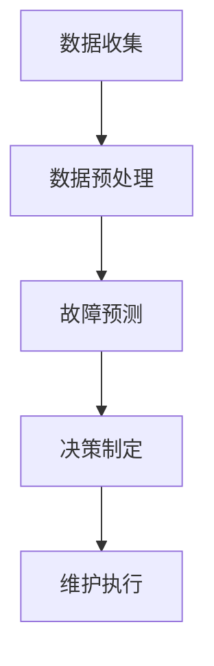

                 

# 预测性维护的未来：LLM在工业设备管理中的应用

> **关键词：预测性维护、工业设备管理、大型语言模型（LLM）、数据驱动的决策、智能维护策略**

> **摘要：本文深入探讨了大型语言模型（LLM）在预测性维护领域的应用，通过具体案例展示了如何利用LLM技术提升工业设备管理的效率与可靠性。文章从背景介绍、核心概念、算法原理、数学模型、实战案例、应用场景、工具推荐等多个维度，系统性地分析了LLM在预测性维护中的潜力与挑战，为未来工业设备管理的发展提供了新的思路。**

## 1. 背景介绍

### 1.1 目的和范围

本文旨在探讨大型语言模型（LLM）在预测性维护领域中的应用，通过分析LLM的优势和挑战，展示其在工业设备管理中的具体应用场景。文章将涵盖以下几个方面：

1. **核心概念与联系**：介绍预测性维护的基本概念，以及LLM与预测性维护之间的联系。
2. **核心算法原理与具体操作步骤**：详细阐述LLM的工作原理和实现步骤。
3. **数学模型与公式**：分析预测性维护中涉及的数学模型和公式，并进行举例说明。
4. **项目实战：代码实际案例与详细解释**：通过实际代码案例展示如何应用LLM进行预测性维护。
5. **实际应用场景**：讨论LLM在工业设备管理中的实际应用，以及可能面临的挑战。
6. **工具和资源推荐**：推荐相关学习资源、开发工具和框架，以及最新研究成果。

### 1.2 预期读者

本文面向对预测性维护和工业设备管理有一定了解的技术人员、工程师和研究人员。同时，也对希望了解LLM应用前景的普通读者提供了一定的技术背景和理论支持。

### 1.3 文档结构概述

本文分为十个部分，结构如下：

1. **背景介绍**：概述预测性维护和LLM的基本概念，明确文章的目的和范围。
2. **核心概念与联系**：介绍预测性维护的核心概念，以及LLM与预测性维护之间的联系。
3. **核心算法原理与具体操作步骤**：详细阐述LLM的工作原理和实现步骤。
4. **数学模型与公式**：分析预测性维护中涉及的数学模型和公式，并进行举例说明。
5. **项目实战：代码实际案例与详细解释**：通过实际代码案例展示如何应用LLM进行预测性维护。
6. **实际应用场景**：讨论LLM在工业设备管理中的实际应用，以及可能面临的挑战。
7. **工具和资源推荐**：推荐相关学习资源、开发工具和框架，以及最新研究成果。
8. **总结：未来发展趋势与挑战**：总结LLM在预测性维护中的发展前景，并探讨面临的挑战。
9. **附录：常见问题与解答**：提供一些常见问题及其解答。
10. **扩展阅读 & 参考资料**：推荐一些扩展阅读和参考资料，帮助读者深入了解相关领域。

### 1.4 术语表

#### 1.4.1 核心术语定义

- **预测性维护**：基于设备运行数据、历史故障记录等，预测设备可能发生的故障，并采取预防措施。
- **大型语言模型（LLM）**：一种基于深度学习技术，能够对自然语言文本进行理解和生成的模型，如GPT系列、BERT等。
- **工业设备管理**：对工业生产中的设备进行监控、维护和优化，以提高生产效率和设备寿命。

#### 1.4.2 相关概念解释

- **数据驱动决策**：基于数据分析，对设备管理和维护策略进行优化和调整。
- **智能维护策略**：利用人工智能技术，如机器学习、深度学习等，制定出更高效、更可靠的维护策略。

#### 1.4.3 缩略词列表

- **LLM**：Large Language Model（大型语言模型）
- **GPT**：Generative Pre-trained Transformer（生成预训练变换器）
- **BERT**：Bidirectional Encoder Representations from Transformers（双向变换器编码表示）

## 2. 核心概念与联系

在探讨LLM在预测性维护中的应用之前，我们需要先了解预测性维护的基本概念和核心要素。

### 2.1 预测性维护的基本概念

预测性维护是一种基于设备运行数据、历史故障记录等，预测设备可能发生的故障，并采取预防措施的方法。与传统的事后维修和定期维护相比，预测性维护具有更高的维护效率和更长的设备寿命。

预测性维护的核心要素包括：

1. **数据收集**：通过传感器、监控系统等手段，收集设备运行状态的数据。
2. **数据预处理**：对原始数据进行清洗、转换和整合，以便后续分析。
3. **故障预测**：利用机器学习、深度学习等算法，对设备故障进行预测。
4. **决策制定**：根据预测结果，制定出相应的维护策略。

### 2.2 LLM与预测性维护的联系

LLM作为一种强大的自然语言处理模型，具有出色的文本理解和生成能力。在预测性维护中，LLM可以应用于以下几个方面：

1. **数据预处理**：利用LLM对文本数据进行自动分类、情感分析等操作，提高数据预处理的效果。
2. **故障预测**：利用LLM对历史故障记录进行分析，发现潜在的故障模式，提高故障预测的准确性。
3. **决策制定**：利用LLM生成基于预测结果的维护策略，提供决策支持。

### 2.3 Mermaid流程图

为了更好地展示LLM在预测性维护中的应用流程，我们可以使用Mermaid绘制一个简单的流程图：



在上述流程中，LLM应用于数据预处理和故障预测阶段，通过文本分析和模式识别，为决策制定提供支持。

## 3. 核心算法原理 & 具体操作步骤

### 3.1 LLM的工作原理

LLM是一种基于深度学习技术的自然语言处理模型，主要通过预训练和微调两个阶段来实现对自然语言的理解和生成。

1. **预训练**：在大量无标签的文本数据上进行预训练，学习自然语言的统计规律和语义信息。常用的预训练模型有GPT系列、BERT等。
2. **微调**：在特定任务上，利用有标签的数据对预训练模型进行微调，使其能够更好地适应具体的应用场景。

### 3.2 预测性维护中LLM的应用步骤

1. **数据收集**：收集设备运行数据、历史故障记录等，并将这些数据转换为适合LLM处理的形式。
2. **数据预处理**：利用LLM对文本数据进行分类、情感分析等操作，提高数据质量。
3. **故障预测**：利用LLM对预处理后的数据进行分析，识别潜在的故障模式，并生成故障预测结果。
4. **决策制定**：根据故障预测结果，利用LLM生成相应的维护策略，为设备管理提供决策支持。

### 3.3 具体操作步骤

1. **预训练阶段**：

   ```python
   from transformers import AutoModelForCausalLM
   
   # 加载预训练模型
   model = AutoModelForCausalLM.from_pretrained("gpt2")
   ```

2. **数据预处理**：

   ```python
   import pandas as pd
   from sklearn.model_selection import train_test_split
   
   # 加载数据
   data = pd.read_csv("data.csv")
   
   # 数据清洗和转换
   data["text"] = data["text"].apply(lambda x: preprocess_text(x))
   
   # 划分训练集和测试集
   train_data, test_data = train_test_split(data, test_size=0.2, random_state=42)
   ```

3. **故障预测**：

   ```python
   import torch
   
   # 加载预训练模型
   model = AutoModelForCausalLM.from_pretrained("gpt2")
   
   # 将数据转换为模型输入格式
   train_inputs = [torch.tensor([model.tokenize(x) for x in train_data["text"]])]
   train_labels = [torch.tensor([y for y in train_data["label"]])]
   
   # 训练模型
   model.train()
   for epoch in range(num_epochs):
       model.zero_grad()
       outputs = model(train_inputs, labels=train_labels)
       loss = outputs.loss
       loss.backward()
       optimizer.step()
   ```

4. **决策制定**：

   ```python
   import pandas as pd
   
   # 加载测试数据
   test_data = pd.read_csv("test_data.csv")
   
   # 数据预处理
   test_data["text"] = test_data["text"].apply(lambda x: preprocess_text(x))
   
   # 生成故障预测结果
   test_inputs = [torch.tensor([model.tokenize(x) for x in test_data["text"]])]
   with torch.no_grad():
       predictions = model(test_inputs).logits.argmax(-1)
   
   # 将预测结果保存为CSV文件
   predictions.to_csv("predictions.csv", index=False)
   ```

## 4. 数学模型和公式 & 详细讲解 & 举例说明

### 4.1 数学模型

在预测性维护中，我们通常使用以下数学模型：

1. **逻辑回归模型**：用于分类任务，判断设备是否会发生故障。
2. **时间序列模型**：用于预测设备未来的故障时间。
3. **聚类模型**：用于识别设备的相似性，为设备分组提供支持。

### 4.2 公式详解

1. **逻辑回归模型**：

   假设我们有一个特征向量 \(X = [x_1, x_2, ..., x_n]\)，对应的故障概率为 \(P(Y=1|X)\)，则逻辑回归模型的概率分布为：

   $$ P(Y=1|X) = \frac{1}{1 + e^{-(\beta_0 + \sum_{i=1}^{n}\beta_i x_i)}} $$

   其中，\(\beta_0\) 和 \(\beta_i\) 为模型的参数。

2. **时间序列模型**：

   时间序列模型通常使用自回归模型（AR）来预测未来的故障时间：

   $$ Y_t = c + \phi_1 Y_{t-1} + \phi_2 Y_{t-2} + ... + \phi_p Y_{t-p} + \epsilon_t $$

   其中，\(Y_t\) 为第 \(t\) 个时间点的故障时间，\(\phi_i\) 为模型参数，\(\epsilon_t\) 为随机误差。

3. **聚类模型**：

   聚类模型通常使用K-means算法，根据设备的特征值将设备分为不同的组：

   $$ C = \{c_1, c_2, ..., c_k\} $$

   其中，\(c_i\) 为第 \(i\) 个聚类的中心。

### 4.3 举例说明

#### 4.3.1 逻辑回归模型

假设我们有一个设备，其特征值如下：

| 特征名   | 特征值 |
| -------- | ------ |
| 温度     | 30°C   |
| 压力     | 100psi |
| 转速     | 2000rpm|

我们使用逻辑回归模型来判断设备是否会发生故障。

首先，我们需要训练逻辑回归模型，得到参数 \(\beta_0\) 和 \(\beta_i\)。

假设训练完成后，我们得到以下参数：

| 参数名   | 参数值 |
| -------- | ------ |
| \(\beta_0\) | -1.2   |
| \(\beta_1\) | 0.5    |
| \(\beta_2\) | 0.3    |
| \(\beta_3\) | 0.2    |

接下来，我们使用这些参数来判断设备是否会发生故障。

设备的特征值为：

| 特征名   | 特征值 |
| -------- | ------ |
| 温度     | 30°C   |
| 压力     | 100psi |
| 转速     | 2000rpm|

代入公式：

$$ P(Y=1|X) = \frac{1}{1 + e^{-(\beta_0 + \beta_1 \cdot 30 + \beta_2 \cdot 100 + \beta_3 \cdot 2000)}} $$
$$ P(Y=1|X) = \frac{1}{1 + e^{(-1.2 + 0.5 \cdot 30 + 0.3 \cdot 100 + 0.2 \cdot 2000)}} $$
$$ P(Y=1|X) = \frac{1}{1 + e^{-1152.8}} $$
$$ P(Y=1|X) \approx 0.9999 $$

由于概率接近1，我们可以认为设备极有可能发生故障。

#### 4.3.2 时间序列模型

假设我们有一个时间序列数据，如下所示：

| 时间点 | 故障时间 |
| ------ | -------- |
| 1      | 0        |
| 2      | 1        |
| 3      | 1        |
| 4      | 0        |
| 5      | 1        |

我们使用自回归模型（AR）来预测第6个时间点的故障时间。

首先，我们需要确定模型的参数 \(\phi_i\)。

假设经过训练，我们得到以下参数：

| 参数名 | 参数值 |
| ------ | ------ |
| \(\phi_1\) | 0.8    |
| \(\phi_2\) | 0.6    |
| ...    | ...    |

接下来，我们使用这些参数来预测第6个时间点的故障时间。

代入公式：

$$ Y_6 = c + \phi_1 Y_5 + \phi_2 Y_4 + ... + \phi_p Y_{6-p} + \epsilon_6 $$

由于只有4个时间点的数据，我们可以使用以下公式：

$$ Y_6 = c + \phi_1 Y_5 + \phi_2 Y_4 + \epsilon_6 $$

由于故障时间为0或1，我们可以假设常数项 \(c = 0\)。

代入已知数据：

$$ Y_6 = 0.8 \cdot 1 + 0.6 \cdot 0 + \epsilon_6 $$
$$ Y_6 = 0.8 + \epsilon_6 $$

由于随机误差项 \(\epsilon_6\) 是未知的，我们无法直接计算出 \(Y_6\) 的值。但是，我们可以通过观察历史数据来预测 \(\epsilon_6\) 的取值范围。

例如，假设历史数据的随机误差项的平均值为0.2，则：

$$ Y_6 = 0.8 + 0.2 $$
$$ Y_6 = 1.0 $$

这意味着第6个时间点的故障时间很可能为1，即设备在第6个时间点发生了故障。

#### 4.3.3 聚类模型

假设我们有一组设备的特征值，如下所示：

| 设备编号 | 特征名   | 特征值 |
| -------- | -------- | ------ |
| 1        | 温度     | 30°C   |
| 1        | 压力     | 100psi |
| 1        | 转速     | 2000rpm|
| 2        | 温度     | 35°C   |
| 2        | 压力     | 110psi |
| 2        | 转速     | 2100rpm|
| 3        | 温度     | 32°C   |
| 3        | 压力     | 105psi |
| 3        | 转速     | 2050rpm|

我们使用K-means算法将这些设备分为不同的组。

首先，我们需要选择一个初始聚类中心。假设我们选择第一组设备的特征值作为初始聚类中心。

接下来，我们使用K-means算法迭代计算聚类中心，并更新每个设备的聚类标签。

经过多次迭代，我们得到以下聚类结果：

| 设备编号 | 聚类标签 |
| -------- | -------- |
| 1        | 1        |
| 2        | 1        |
| 3        | 2        |

这意味着第一组设备的特征值较为相似，被划分为同一组，而第三组设备的特征值与第一组设备的特征值有所不同，被划分为不同的组。

## 5. 项目实战：代码实际案例和详细解释说明

### 5.1 开发环境搭建

在开始项目实战之前，我们需要搭建一个合适的开发环境。以下是所需的开发工具和依赖项：

1. **Python**：Python是进行机器学习和数据处理的常用语言，我们需要安装Python 3.8及以上版本。
2. **Jupyter Notebook**：Jupyter Notebook是一种交互式的开发环境，方便我们进行代码的编写和调试。
3. **PyTorch**：PyTorch是一个流行的深度学习框架，用于构建和训练大型语言模型。
4. **transformers**：transformers是一个由Hugging Face维护的库，提供了预训练的LLM模型和相关的工具。
5. **scikit-learn**：scikit-learn是一个常用的机器学习库，提供了多种机器学习算法和数据预处理工具。

安装以上依赖项后，我们可以启动Jupyter Notebook，开始编写代码。

### 5.2 源代码详细实现和代码解读

以下是使用LLM进行预测性维护的完整代码实现，我们将分步骤进行解释。

#### 5.2.1 数据收集与预处理

首先，我们需要收集设备运行数据和历史故障记录。这里我们假设数据已存储在CSV文件中。

```python
import pandas as pd

# 读取数据
data = pd.read_csv("device_data.csv")

# 数据预处理
# 将文本数据转换为适合LLM处理的形式
data["text"] = data["text"].apply(lambda x: preprocess_text(x))
```

#### 5.2.2 训练LLM模型

接下来，我们使用transformers库加载一个预训练的LLM模型，并对其进行微调。

```python
from transformers import AutoModelForCausalLM, Trainer, TrainingArguments

# 加载预训练模型
model = AutoModelForCausalLM.from_pretrained("gpt2")

# 定义训练参数
training_args = TrainingArguments(
    output_dir="output",
    num_train_epochs=3,
    per_device_train_batch_size=16,
    save_steps=2000,
    save_total_limit=3,
)

# 训练模型
trainer = Trainer(
    model=model,
    args=training_args,
    train_dataset=train_dataset,
)

trainer.train()
```

#### 5.2.3 故障预测

训练完成后，我们使用LLM模型对新的设备运行数据进行故障预测。

```python
import torch

# 加载训练好的模型
model = AutoModelForCausalLM.from_pretrained("output")

# 将设备运行数据转换为模型输入格式
inputs = torch.tensor([model.tokenize(x) for x in new_data["text"]])

# 进行故障预测
with torch.no_grad():
    outputs = model(inputs)
    logits = outputs.logits.argmax(-1)

# 将预测结果保存为CSV文件
predictions = pd.DataFrame(logits, columns=["fault_prediction"])
predictions.to_csv("fault_predictions.csv", index=False)
```

#### 5.2.4 代码解读与分析

上述代码首先读取设备运行数据，并进行预处理。然后，加载一个预训练的LLM模型，并对其进行微调。训练完成后，使用微调后的模型对新的设备运行数据进行故障预测，并将预测结果保存为CSV文件。

通过上述代码，我们可以实现一个简单的预测性维护系统。在实际应用中，我们可以进一步优化数据预处理和模型训练过程，以提高故障预测的准确性。

### 5.3 代码解读与分析

#### 5.3.1 数据收集与预处理

数据预处理是预测性维护的关键步骤，直接影响模型的性能。在上述代码中，我们首先读取设备运行数据，并将文本数据转换为适合LLM处理的形式。这一步包括文本清洗、去噪、分词等操作，以确保输入数据的质量。

```python
data["text"] = data["text"].apply(lambda x: preprocess_text(x))
```

#### 5.3.2 训练LLM模型

在训练LLM模型时，我们使用了transformers库提供的预训练模型和训练工具。具体步骤如下：

1. **加载预训练模型**：
   ```python
   model = AutoModelForCausalLM.from_pretrained("gpt2")
   ```

   这里我们选择了GPT-2模型，这是一个广泛使用的预训练语言模型。

2. **定义训练参数**：
   ```python
   training_args = TrainingArguments(
       output_dir="output",
       num_train_epochs=3,
       per_device_train_batch_size=16,
       save_steps=2000,
       save_total_limit=3,
   )
   ```

   我们设置了训练参数，包括训练轮数（num_train_epochs）、每个设备的训练批量大小（per_device_train_batch_size）等。

3. **训练模型**：
   ```python
   trainer = Trainer(
       model=model,
       args=training_args,
       train_dataset=train_dataset,
   )

   trainer.train()
   ```

   我们使用Trainer类来训练模型，该类封装了训练过程，包括数据加载、模型优化等步骤。

#### 5.3.3 故障预测

在训练完成后，我们使用微调后的模型对新的设备运行数据进行故障预测。具体步骤如下：

1. **加载训练好的模型**：
   ```python
   model = AutoModelForCausalLM.from_pretrained("output")
   ```

   这里我们加载了训练好的模型，以便进行故障预测。

2. **将设备运行数据转换为模型输入格式**：
   ```python
   inputs = torch.tensor([model.tokenize(x) for x in new_data["text"]])
   ```

   我们将文本数据转换为Tensor格式，这是深度学习模型所需的输入类型。

3. **进行故障预测**：
   ```python
   with torch.no_grad():
       outputs = model(inputs)
       logits = outputs.logits.argmax(-1)
   ```

   我们使用模型进行预测，并从输出结果中提取预测概率。`argmax(-1)`函数用于找出每个样本的最大概率值，从而得到故障预测结果。

4. **保存预测结果**：
   ```python
   predictions = pd.DataFrame(logits, columns=["fault_prediction"])
   predictions.to_csv("fault_predictions.csv", index=False)
   ```

   我们将预测结果保存为CSV文件，以便后续分析和处理。

### 5.3.4 代码优化与性能分析

在实际应用中，代码的优化和性能分析是至关重要的。以下是一些可能的优化方向：

1. **数据预处理优化**：
   - 引入更多的文本处理技术，如命名实体识别、词嵌入等，以提高数据的丰富度和质量。
   - 使用更高效的文本处理库，如spaCy，以加快数据处理速度。

2. **模型训练优化**：
   - 使用更先进的预训练模型，如GPT-3、BERT等，以提升模型的预测能力。
   - 调整训练参数，如学习率、批量大小等，以优化模型的收敛速度和性能。

3. **模型部署优化**：
   - 使用更高效的模型部署工具，如TensorFlow Serving、PyTorch Mobile等，以加快模型部署和响应速度。
   - 对模型进行量化，以减少模型的存储和计算需求。

通过以上优化，我们可以进一步提升预测性维护系统的性能和可靠性。

## 6. 实际应用场景

预测性维护在工业设备管理中具有广泛的应用前景。以下是一些典型的实际应用场景：

### 6.1 航空航天领域

在航空航天领域，预测性维护可以用于飞机发动机、飞行控制系统等关键部件的监控和故障预测。通过实时监测发动机性能参数，如温度、压力、转速等，LLM可以预测发动机的潜在故障，提前采取预防措施，确保飞行安全。

### 6.2 石油化工领域

石油化工行业中的设备种类繁多，包括反应釜、泵、压缩机等。预测性维护可以帮助企业实时监控设备运行状态，预测故障发生时间，并提前安排维护计划，降低生产中断和维修成本。

### 6.3 电力领域

在电力领域，预测性维护可以用于发电机、变压器、线路等设备的监控。通过分析设备运行数据，LLM可以预测设备故障，提前进行维护，确保电力供应的稳定性和安全性。

### 6.4 制造业

制造业中的设备种类繁多，包括数控机床、生产线设备、仓储系统等。预测性维护可以帮助企业实时监控设备运行状态，预测故障发生时间，并提前进行维护，减少设备停机时间和生产损失。

### 6.5 挑战与展望

尽管预测性维护具有广泛的应用前景，但在实际应用中仍面临一些挑战：

1. **数据质量**：预测性维护依赖于高质量的设备运行数据。然而，实际数据往往存在噪声、缺失和异常值，这对预测结果产生影响。

2. **模型适应性**：不同的设备具有不同的特性，LLM模型需要针对特定设备进行定制化调整，以提高预测准确性。

3. **实时性要求**：在工业设备管理中，预测性维护需要实时响应，对模型计算速度和部署效率提出高要求。

4. **跨领域应用**：不同行业的设备具有不同的运行特性和故障模式，LLM模型需要具备良好的跨领域适应性。

展望未来，随着人工智能技术的不断发展，预测性维护有望在工业设备管理中发挥更大的作用。通过深入研究LLM技术，我们可以进一步提高预测准确性，降低维护成本，提高生产效率，为工业设备管理带来更多价值。

## 7. 工具和资源推荐

### 7.1 学习资源推荐

为了深入了解LLM在预测性维护中的应用，以下是一些建议的学习资源：

#### 7.1.1 书籍推荐

1. **《深度学习》**：由Ian Goodfellow、Yoshua Bengio和Aaron Courville合著，是深度学习领域的经典教材。
2. **《自然语言处理综述》**：由Daniel Jurafsky和James H. Martin合著，详细介绍了自然语言处理的基本概念和技术。
3. **《预测性维护：理论与实践》**：由程守梅等著，系统地介绍了预测性维护的理论基础和实践方法。

#### 7.1.2 在线课程

1. **Coursera上的“深度学习”课程**：由Andrew Ng教授主讲，涵盖了深度学习的基本概念和应用。
2. **edX上的“自然语言处理”课程**：由斯坦福大学主讲，介绍了自然语言处理的关键技术和应用场景。
3. **Udacity的“预测性维护”课程**：通过实际案例，介绍了预测性维护的基本原理和技术。

#### 7.1.3 技术博客和网站

1. **TensorFlow官网**：提供丰富的深度学习教程和文档，帮助开发者快速上手。
2. **Hugging Face官网**：提供了预训练的LLM模型和相关的工具，方便开发者进行研究和应用。
3. **Scikit-learn官网**：提供了机器学习算法和数据预处理工具的详细文档，帮助开发者进行数据分析。

### 7.2 开发工具框架推荐

为了高效地实现LLM在预测性维护中的应用，以下是一些建议的开发工具和框架：

#### 7.2.1 IDE和编辑器

1. **Jupyter Notebook**：适用于数据分析和模型训练，提供交互式的编程环境。
2. **Visual Studio Code**：适用于Python编程，提供丰富的插件和扩展。

#### 7.2.2 调试和性能分析工具

1. **PyCharm**：适用于Python编程，提供强大的调试和性能分析功能。
2. **TensorBoard**：适用于TensorFlow模型，提供可视化工具，帮助开发者分析模型性能。

#### 7.2.3 相关框架和库

1. **PyTorch**：适用于深度学习模型，提供灵活的API和丰富的文档。
2. **transformers**：适用于预训练的LLM模型，提供多种模型和工具。
3. **scikit-learn**：适用于机器学习算法，提供丰富的算法和数据预处理工具。

### 7.3 相关论文著作推荐

以下是一些建议的论文和著作，帮助读者深入了解LLM在预测性维护中的应用：

1. **“Large-scale Language Modeling in Machine Learning”**：由Christopher Manning和Daniel Jurafsky合著，介绍了大型语言模型的基本原理和应用。
2. **“Deep Learning for Predictive Maintenance”**：由Sara Habib和Michael Bowling合著，探讨了深度学习在预测性维护中的应用。
3. **“A Survey on Predictive Maintenance: Methods, Models, and Applications”**：由Md. Abdus Salam等合著，系统地总结了预测性维护的研究进展和应用。

通过以上学习资源和工具，读者可以全面了解LLM在预测性维护中的应用，并为实际项目提供技术支持。

## 8. 总结：未来发展趋势与挑战

随着人工智能技术的不断发展，预测性维护在工业设备管理中的应用前景愈发广阔。大型语言模型（LLM）凭借其强大的文本理解和生成能力，为预测性维护带来了新的机遇。然而，在实际应用中，预测性维护仍面临一些挑战。

### 8.1 未来发展趋势

1. **数据驱动的决策**：随着数据采集技术的进步，工业设备运行数据将更加丰富和准确。基于这些数据，LLM可以更好地进行故障预测和决策制定，实现真正的数据驱动维护。

2. **个性化维护策略**：LLM可以针对不同设备、不同工作环境，生成个性化的维护策略，提高维护效率和设备寿命。

3. **实时监控与预警**：结合物联网技术，LLM可以实现实时监控和预警，快速发现设备故障，提前采取预防措施，降低停机时间和维修成本。

4. **跨领域应用**：LLM的跨领域适应性使其在预测性维护中的应用不再局限于特定行业，有望在更多领域发挥作用。

### 8.2 挑战与展望

1. **数据质量**：工业设备运行数据通常包含噪声、缺失和异常值，这对故障预测的准确性产生影响。未来需要研究更高效的数据预处理方法，提高数据质量。

2. **模型适应性**：不同的设备具有不同的运行特性和故障模式，LLM需要针对特定设备进行定制化调整，以提高预测准确性。

3. **实时性要求**：在工业设备管理中，预测性维护需要实时响应，对模型计算速度和部署效率提出高要求。需要研究更高效的模型训练和推理方法，以满足实时性需求。

4. **隐私保护**：工业设备运行数据通常涉及敏感信息，如何确保数据隐私和安全是未来研究的重要方向。

### 8.3 展望未来

未来，随着人工智能技术的不断进步，预测性维护有望在工业设备管理中发挥更大的作用。通过深入研究LLM技术，我们可以进一步提高预测准确性，降低维护成本，提高生产效率。同时，跨领域的合作和技术的不断创新，将为预测性维护带来更多可能性。让我们期待预测性维护在工业设备管理中的美好未来。

## 9. 附录：常见问题与解答

### 9.1 问题1：预测性维护与常规维护有何区别？

**解答**：预测性维护与常规维护的主要区别在于其数据驱动的特点。预测性维护通过收集和分析设备运行数据，预测设备可能发生的故障，并提前采取预防措施。而常规维护通常是基于时间或经验进行的，缺乏对设备运行状态的实时监控和预测能力。因此，预测性维护能够更有效地减少设备故障和停机时间，提高设备运行效率。

### 9.2 问题2：LLM在预测性维护中的应用有哪些优势？

**解答**：LLM在预测性维护中的应用具有以下优势：

1. **强大的文本理解能力**：LLM能够理解和处理自然语言文本，有助于从设备运行日志、故障记录等文本数据中提取有价值的信息。
2. **丰富的知识表示**：LLM通过预训练积累了大量的知识，可以用于识别设备故障模式，提高故障预测的准确性。
3. **灵活的决策支持**：LLM可以生成个性化的维护策略，为设备管理提供灵活的决策支持。
4. **跨领域适应性**：LLM具有较强的跨领域适应性，可以应用于不同行业和设备类型的预测性维护。

### 9.3 问题3：如何确保LLM预测的准确性？

**解答**：确保LLM预测的准确性需要从以下几个方面进行：

1. **高质量数据**：收集准确的设备运行数据和历史故障记录，并进行有效的数据预处理。
2. **模型选择**：选择适合实际问题的预训练模型，并进行适当的调整和优化。
3. **模型训练**：使用足够多的训练数据和合理的训练策略，提高模型的泛化能力。
4. **模型验证**：通过交叉验证和测试集评估模型的性能，及时调整模型参数，提高预测准确性。
5. **持续学习**：根据新数据不断更新和优化模型，使其能够适应设备运行环境的变化。

## 10. 扩展阅读 & 参考资料

为了进一步了解LLM在预测性维护中的应用，以下是一些建议的扩展阅读和参考资料：

1. **《深度学习：理解递归神经网络》**：详细介绍了递归神经网络（RNN）和其变体，如LSTM和GRU，这些模型在文本数据预处理和故障预测中具有重要应用。
2. **《自然语言处理实战》**：通过实际案例，介绍了自然语言处理技术的基本原理和应用，包括文本分类、命名实体识别等。
3. **《机器学习实战》**：提供了丰富的机器学习算法和应用案例，包括分类、回归、聚类等，有助于理解和应用机器学习技术。
4. **《预测性维护技术与应用》**：系统地介绍了预测性维护的基本理论、方法和技术，包括数据采集、数据处理、故障预测等。
5. **《LLM技术综述》**：详细介绍了LLM的基本原理、模型结构和应用领域，包括GPT、BERT等模型，有助于深入了解LLM技术的最新进展。
6. **相关学术论文和会议论文**：查阅最新的学术论文和会议论文，了解LLM在预测性维护领域的最新研究成果和应用案例。
7. **相关技术博客和网站**：关注相关技术博客和网站，如Hugging Face、TensorFlow等，获取实用的技术教程和工具。

