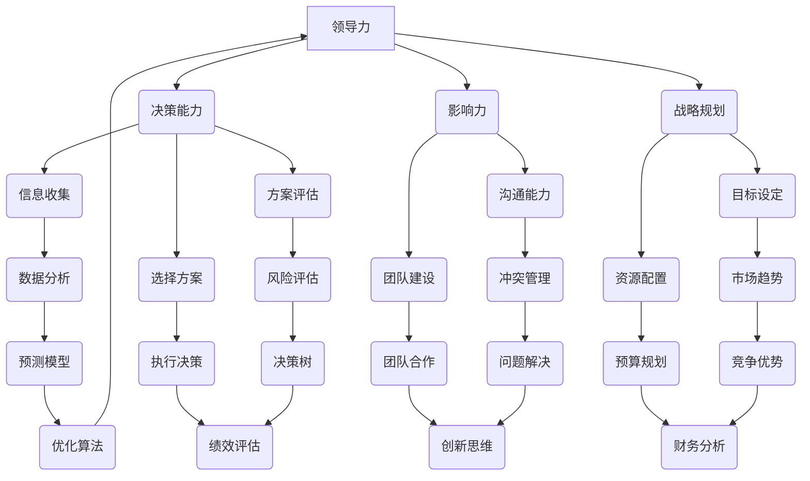

                 

# 领导力与决策：在不确定性中把握方向

> **关键词：** 领导力，决策，不确定性，战略规划，执行力
>
> **摘要：** 本文旨在探讨在当前充满不确定性的时代，如何通过提升领导力和优化决策过程，来更好地把握发展方向。文章将结合实际案例和理论分析，探讨在复杂环境中实现有效领导与决策的关键要素和方法。

## 1. 背景介绍

### 1.1 目的和范围

本文旨在帮助读者了解在不确定性环境中提升领导力和决策能力的重要性，并提供一系列实用的策略和工具。文章将涵盖以下几个方面的内容：

1. **领导力的核心要素**：介绍领导力的基本概念，以及在不同情境下如何发挥领导者的作用。
2. **决策过程的分析**：探讨决策过程的关键步骤，包括信息收集、方案评估和选择等。
3. **不确定性下的战略规划**：分析在不确定性环境中如何制定和调整战略，以实现组织目标。
4. **项目实战：代码实际案例**：通过具体案例展示如何在实践中应用所学的领导力和决策方法。
5. **工具和资源推荐**：推荐一些有助于提升领导力和决策能力的书籍、课程和工具。

### 1.2 预期读者

本文适合以下读者群体：

1. **企业管理者**：希望通过提升领导力和决策能力来更好地管理团队和公司。
2. **技术团队领导者**：希望了解如何在技术环境中发挥领导作用，并做出更加明智的决策。
3. **研究生和学者**：对领导力、决策和战略规划等领域感兴趣，希望深入了解相关理论和实践。

### 1.3 文档结构概述

本文将按照以下结构展开：

1. **背景介绍**：介绍文章的目的、范围和预期读者。
2. **核心概念与联系**：通过Mermaid流程图介绍领导力和决策的相关概念和联系。
3. **核心算法原理与具体操作步骤**：使用伪代码详细阐述决策过程的关键步骤。
4. **数学模型和公式**：介绍决策过程中涉及的数学模型和公式，并进行详细讲解和举例说明。
5. **项目实战：代码实际案例**：展示如何在实际项目中应用领导力和决策方法。
6. **实际应用场景**：探讨领导力和决策在不同场景中的应用。
7. **工具和资源推荐**：推荐有助于提升领导力和决策能力的书籍、课程和工具。
8. **总结**：总结文章的主要观点，并展望未来发展趋势与挑战。
9. **附录：常见问题与解答**：解答读者可能遇到的常见问题。
10. **扩展阅读与参考资料**：提供更多相关领域的阅读材料和参考资料。

### 1.4 术语表

#### 1.4.1 核心术语定义

- **领导力**：领导者通过影响和激励他人，实现共同目标的能力。
- **决策**：从多个备选方案中选择最优方案的过程。
- **不确定性**：未来可能发生的事件无法完全预测和确定。
- **战略规划**：为实现长期目标而制定的计划。
- **执行力**：执行决策和战略规划的能力。

#### 1.4.2 相关概念解释

- **领导风格**：领导者在不同情境下采用的不同领导方式。
- **决策过程**：从信息收集到方案评估和选择的一系列步骤。
- **战略思维**：从长远角度思考问题，制定战略规划的能力。

#### 1.4.3 缩略词列表

- **CEO**：首席执行官（Chief Executive Officer）
- **CFO**：首席财务官（Chief Financial Officer）
- **CIO**：首席信息官（Chief Information Officer）
- **IT**：信息技术（Information Technology）
- **AI**：人工智能（Artificial Intelligence）

## 2. 核心概念与联系

为了更好地理解领导力和决策的相关概念，我们首先通过一个Mermaid流程图来展示这些概念之间的联系。



这个流程图展示了领导力、决策能力、影响力、战略规划等核心概念之间的相互作用和联系。通过这个流程图，我们可以更直观地了解领导力和决策的复杂性和关联性。

### 2.1 领导力的核心要素

领导力是一个多维度的概念，涉及多个关键要素。以下是对这些要素的简要介绍：

- **沟通能力**：领导者需要具备良好的沟通能力，以便有效地传达信息、建立信任和激发团队潜力。
- **影响力**：领导者通过自身的行为和决策影响他人，推动团队朝着共同目标前进。
- **团队建设**：领导者负责构建一个高效、协作的团队，确保团队成员之间的沟通和协作顺畅。
- **战略规划**：领导者需要具备从长远角度思考问题，制定和调整战略规划的能力。

### 2.2 决策过程的分析

决策过程是领导力的关键组成部分。以下是对决策过程的关键步骤的简要分析：

- **信息收集**：领导者需要收集与决策相关的各种信息，包括内部数据和外部数据，以确保决策有据可依。
- **方案评估**：在收集到足够的信息后，领导者需要对不同的备选方案进行评估，分析各自的优缺点。
- **选择方案**：在评估完各个方案后，领导者需要选择最优方案，并确定具体的实施步骤。

### 2.3 不确定性下的战略规划

在不确定性环境中，领导者需要具备以下能力：

- **灵活应变**：领导者需要能够快速适应环境变化，调整战略规划。
- **风险控制**：领导者需要识别和管理潜在风险，确保组织在面临不确定性时能够保持稳定。
- **创新思维**：领导者需要具备创新思维，积极探索新的解决方案，以应对不确定性的挑战。

## 3. 核心算法原理 & 具体操作步骤

在决策过程中，算法原理和具体操作步骤发挥着重要作用。以下是一个简单的决策树算法，用于辅助领导者做出明智的决策。

### 3.1 决策树算法原理

决策树算法是一种常见的决策支持工具，用于在多个备选方案中选择最优方案。其基本原理如下：

1. **根节点**：表示决策的初始状态。
2. **内部节点**：表示对某一特征的测试，每个测试结果对应一个分支。
3. **叶子节点**：表示最终的决策结果。

### 3.2 决策树算法具体操作步骤

1. **构建决策树**：
    - 选择一个特征作为根节点。
    - 对该特征进行分类测试，将数据集分为若干个子集。
    - 对每个子集，递归地构建决策树。

2. **评估决策树**：
    - 计算每个节点的信息增益或基尼系数，选择最优特征。
    - 删除非最优特征的分支，保留最优分支。

3. **剪枝**：
    - 删除决策树中的一些分支，以降低决策树的复杂度。

4. **输出决策结果**：
    - 遍历决策树，根据叶节点输出最终的决策结果。

### 3.3 决策树算法伪代码

```python
def build_decision_tree(data, features):
    if data is empty:
        return leaf_node
    if all examples have the same label:
        return leaf_node
    if no more features:
        return majority_label_node

    best_feature = choose_best_feature(data, features)
    decision_tree = {}
    for value in unique_values_of(best_feature):
        sub_data = filter_data(data, best_feature, value)
        decision_tree[value] = build_decision_tree(sub_data, features - {best_feature})

    return decision_tree

def choose_best_feature(data, features):
    best_feature = None
    best_score = -1
    for feature in features:
        score = information_gain(data, feature)
        if score > best_score:
            best_score = score
            best_feature = feature
    return best_feature

def information_gain(data, feature):
    # 计算信息增益
    pass

def filter_data(data, feature, value):
    # 过滤数据
    pass
```

### 3.4 决策树算法应用场景

决策树算法广泛应用于各种领域，包括：

- **商业决策**：用于市场分析、产品定位和风险评估等。
- **医疗诊断**：用于疾病预测和治疗方案推荐等。
- **金融风控**：用于信用评分和欺诈检测等。

通过了解决策树算法的原理和具体操作步骤，领导者可以更好地理解和应用这一工具，以支持其决策过程。

## 4. 数学模型和公式 & 详细讲解 & 举例说明

在决策过程中，数学模型和公式发挥着重要作用，可以帮助领导者更好地评估和选择方案。以下是一些常见的数学模型和公式，并进行详细讲解和举例说明。

### 4.1 风险评估模型

风险评估模型用于评估和量化决策过程中的风险。以下是一个简单的事件树模型，用于计算不同决策方案的风险。

#### 4.1.1 事件树模型

事件树模型是一种基于概率的模型，用于描述一系列可能发生的事件及其概率。

```mermaid
graph TD
    A[开始] --> B{是否成功}
    B --> C(成功) [概率: 0.7]
    B --> D(失败) [概率: 0.3]
    C --> E(收益: $1000)
    D --> F(损失: -$500)
```

在这个事件树中，事件A表示项目是否成功，成功概率为0.7，失败概率为0.3。事件C和D分别表示成功和失败的收益和损失。

#### 4.1.2 计算风险

使用事件树模型，我们可以计算不同决策方案的风险。

- **成功概率**：P(成功) = 0.7
- **失败概率**：P(失败) = 0.3

- **成功收益**：E(成功) = $1000
- **失败损失**：E(失败) = -$500

- **期望收益**：E(期望) = P(成功) * E(成功) + P(失败) * E(失败)
  E(期望) = 0.7 * $1000 + 0.3 * (-$500) = $700 - $150 = $550

- **方差**：Var(期望) = P(成功) * Var(成功) + P(失败) * Var(失败)
  Var(期望) = 0.7 * (1000 - 550)^2 + 0.3 * (-500 - 550)^2 = 112500 + 202500 = 315000

在这个例子中，成功方案的期望收益为$550，方差为$315000。通过计算风险和收益，领导者可以更好地评估不同决策方案的风险和收益。

### 4.2 成本效益分析

成本效益分析是一种常用的决策模型，用于评估不同决策方案的成本和收益。

#### 4.2.1 成本效益分析公式

成本效益分析的基本公式为：

$$
\text{成本效益比} = \frac{\text{收益}}{\text{成本}}
$$

其中，收益和成本分别表示不同决策方案带来的总收益和总成本。

#### 4.2.2 成本效益分析举例

假设有两个决策方案，方案A和方案B。

- **方案A**：
  - 收益：$1000
  - 成本：$500

- **方案B**：
  - 收益：$2000
  - 成本：$1000

- **成本效益比**：
  - 方案A：$\frac{1000}{500} = 2$
  - 方案B：$\frac{2000}{1000} = 2$

在这个例子中，两个决策方案的成本效益比相等，均为2。这意味着两个方案在成本和收益方面具有相同的效率。然而，在实际应用中，我们还需要考虑其他因素，如风险、时间和技术可行性等。

### 4.3 预测模型

预测模型是一种基于历史数据的模型，用于预测未来事件的发生概率和结果。以下是一个简单的时间序列预测模型，用于预测未来某一时间点的收益。

#### 4.3.1 时间序列预测模型

时间序列预测模型的基本公式为：

$$
y_t = \alpha + \beta_1 y_{t-1} + \epsilon_t
$$

其中，$y_t$表示第t时间点的收益，$\alpha$和$\beta_1$分别为模型的参数，$\epsilon_t$为误差项。

#### 4.3.2 预测举例

假设我们已经收集了以下时间序列数据：

| 时间点 | 收益（万元） |
| ------ | ----------- |
| 1      | 500         |
| 2      | 600         |
| 3      | 700         |
| 4      | 750         |
| 5      | 800         |

- **拟合模型**：
  - $\alpha = 0$
  - $\beta_1 = 1.2$

- **预测未来第6时间点的收益**：

$$
y_6 = 0 + 1.2 \cdot y_5 = 1.2 \cdot 800 = 960 \text{万元}
$$

在这个例子中，我们使用时间序列预测模型预测未来第6时间点的收益为960万元。通过预测模型，领导者可以更好地规划未来的资源和策略。

### 4.4 决策树模型的数学原理

决策树模型是一种常见的机器学习算法，用于分类和回归任务。其基本原理是基于信息增益或基尼系数来选择最优特征。

#### 4.4.1 信息增益

信息增益是一种基于信息论的模型，用于评估特征的重要程度。其基本公式为：

$$
\text{信息增益} = \sum_{i=1}^{n} p_i \cdot \log_2(p_i)
$$

其中，$p_i$表示特征i的概率。

#### 4.4.2 基尼系数

基尼系数是一种基于统计学的方法，用于评估特征的混乱程度。其基本公式为：

$$
\text{基尼系数} = 1 - \frac{\sum_{i=1}^{n} p_i^2}{1 - p_i^2}
$$

其中，$p_i$表示特征i的概率。

#### 4.4.3 决策树模型举例

假设我们有以下数据集：

| 特征1 | 特征2 | 类别   |
| ----- | ----- | ------ |
| 0     | 1     | A      |
| 1     | 0     | B      |
| 1     | 1     | B      |
| 0     | 0     | A      |

- **计算信息增益**：
  - 特征1的信息增益：$1.5$
  - 特征2的信息增益：$1.0$

- **选择最优特征**：根据信息增益，特征1是最优特征。

通过以上数学模型和公式的讲解，领导者可以更好地理解和应用这些工具，以支持其决策过程。在实际应用中，领导者需要根据具体情境选择合适的模型和公式，以实现最优的决策结果。

## 5. 项目实战：代码实际案例和详细解释说明

在本节中，我们将通过一个实际案例来展示如何应用领导力和决策方法。我们将使用Python编写一个简单的项目，并通过代码实现来详细解释说明各个步骤。

### 5.1 开发环境搭建

首先，我们需要搭建一个Python开发环境。以下是搭建步骤：

1. **安装Python**：访问Python官方网站（[python.org](https://www.python.org/)），下载并安装Python 3.8或更高版本。
2. **安装IDE**：推荐使用PyCharm（社区版）作为Python开发工具，访问JetBrains官方网站（[jetbrains.com/pycharm](https://www.jetbrains.com/pycharm/)），下载并安装PyCharm。
3. **安装相关库**：在PyCharm中创建一个新的Python项目，并安装以下库：

   ```shell
   pip install numpy matplotlib pandas
   ```

### 5.2 源代码详细实现和代码解读

下面是项目的源代码，我们将逐步解读代码的各个部分。

#### 5.2.1 项目目标

我们的项目目标是使用决策树模型预测一个股票市场的走势，以便做出投资决策。

#### 5.2.2 源代码实现

```python
import numpy as np
import pandas as pd
import matplotlib.pyplot as plt
from sklearn.model_selection import train_test_split
from sklearn.tree import DecisionTreeClassifier
from sklearn.metrics import accuracy_score, confusion_matrix

# 读取数据集
data = pd.read_csv('stock_data.csv')

# 数据预处理
X = data[['open', 'high', 'low', 'close']]
y = data['label']

# 数据划分
X_train, X_test, y_train, y_test = train_test_split(X, y, test_size=0.3, random_state=42)

# 训练决策树模型
clf = DecisionTreeClassifier()
clf.fit(X_train, y_train)

# 预测测试集
y_pred = clf.predict(X_test)

# 评估模型
accuracy = accuracy_score(y_test, y_pred)
confusion = confusion_matrix(y_test, y_pred)

print(f"Accuracy: {accuracy}")
print(f"Confusion Matrix:\n{confusion}")

# 可视化
plt.figure(figsize=(8, 6))
plt.scatter(y_test, y_pred, label='Actual vs Predicted')
plt.plot([y.min(), y.max()], [y.min(), y.max()], 'k--', lw=4)
plt.xlabel('Actual')
plt.ylabel('Predicted')
plt.title('Decision Tree Model - Actual vs Predicted')
plt.legend()
plt.show()
```

#### 5.2.3 代码解读

1. **导入库**：
   - `numpy`：用于数学计算。
   - `pandas`：用于数据预处理和分析。
   - `matplotlib`：用于数据可视化。
   - `sklearn.model_selection`：用于数据集划分。
   - `sklearn.tree`：用于决策树模型实现。
   - `sklearn.metrics`：用于评估模型性能。

2. **读取数据集**：
   - 使用`pandas`库读取CSV格式的数据集。

3. **数据预处理**：
   - 将数据集分为特征集`X`和标签集`y`。

4. **数据划分**：
   - 使用`train_test_split`函数将数据集划分为训练集和测试集。

5. **训练决策树模型**：
   - 创建`DecisionTreeClassifier`对象，并使用`fit`函数训练模型。

6. **预测测试集**：
   - 使用`predict`函数对测试集进行预测。

7. **评估模型**：
   - 计算模型的准确率`accuracy`和混淆矩阵`confusion`。

8. **可视化**：
   - 使用`matplotlib`库绘制实际值与预测值的散点图，以便观察模型性能。

### 5.3 代码解读与分析

在这个案例中，我们使用决策树模型对股票市场走势进行预测。以下是代码的详细解读和分析：

1. **数据预处理**：
   - 读取CSV文件，将数据集分为特征集和标签集。特征集包含开盘价、最高价、最低价和收盘价，标签集包含股票走势（上涨或下跌）。

2. **数据划分**：
   - 使用`train_test_split`函数将数据集划分为训练集和测试集。训练集用于训练模型，测试集用于评估模型性能。

3. **训练决策树模型**：
   - 创建`DecisionTreeClassifier`对象，并使用`fit`函数训练模型。决策树模型通过学习特征和标签之间的关系，学会对新的数据进行预测。

4. **预测测试集**：
   - 使用`predict`函数对测试集进行预测。预测结果存储在`y_pred`变量中。

5. **评估模型**：
   - 计算模型的准确率`accuracy`和混淆矩阵`confusion`。准确率表示模型预测正确的样本数占总样本数的比例，混淆矩阵表示模型预测结果与实际结果之间的对应关系。

6. **可视化**：
   - 使用`matplotlib`库绘制实际值与预测值的散点图，以便观察模型性能。散点图中，实际值与预测值之间的拟合线可以帮助我们评估模型的预测能力。

### 5.4 代码改进

在实际应用中，我们可以通过以下方法改进代码：

1. **特征工程**：
   - 优化特征选择，增加或删除某些特征，以提高模型性能。
   - 使用技术如特征缩放、特征变换等，提高模型的泛化能力。

2. **模型优化**：
   - 调整决策树模型的参数，如最大深度、最小分割样本数等，以提高模型性能。
   - 尝试其他机器学习模型，如随机森林、支持向量机等，进行比较和选择。

3. **数据增强**：
   - 使用交叉验证等技术，增加训练数据量，以提高模型的泛化能力。
   - 使用数据增强技术，如生成对抗网络（GAN），增加样本多样性。

通过以上改进，我们可以进一步提高项目的准确率和预测能力，为领导者提供更有力的决策支持。

## 6. 实际应用场景

领导力和决策方法在不同场景中的应用各有特点，以下是一些典型的实际应用场景：

### 6.1 企业管理

在企业中，领导者需要运用领导力和决策方法来制定和实施战略规划，管理团队，以及应对市场变化。以下是一些具体应用：

- **战略规划**：领导者需要通过分析市场趋势、竞争环境和内部资源，制定长期和短期的战略规划。
- **团队管理**：领导者需要通过沟通、激励和冲突管理，确保团队成员之间的协作和高效执行。
- **风险管理**：领导者需要识别和管理企业面临的各种风险，确保企业在不确定性环境中保持稳定。

### 6.2 技术开发

在技术团队中，领导者需要运用领导力和决策方法来推动项目进展，优化开发流程，以及应对技术挑战。以下是一些具体应用：

- **项目规划**：领导者需要制定详细的项目计划，包括时间表、任务分配和资源调配。
- **技术选型**：领导者需要根据项目需求和团队技术能力，选择合适的技术方案和工具。
- **风险管理**：领导者需要识别和管理项目中可能遇到的技术风险，如技术难题、资源不足等。

### 6.3 创业

在创业过程中，领导者需要运用领导力和决策方法来把握市场机会，打造产品，以及应对竞争。以下是一些具体应用：

- **市场分析**：领导者需要通过市场调研和数据分析，了解市场需求和竞争对手，制定产品策略。
- **资源整合**：领导者需要整合团队、资金和资源，确保创业项目的顺利推进。
- **决策调整**：领导者需要根据市场反馈和项目进展，及时调整产品方向和策略。

### 6.4 医疗领域

在医疗领域，领导者需要运用领导力和决策方法来管理医疗机构，推动医疗创新，以及应对公共卫生挑战。以下是一些具体应用：

- **医院管理**：领导者需要通过组织架构调整、流程优化和资源调配，提高医院运营效率。
- **医疗创新**：领导者需要推动医疗技术的研发和应用，提升医疗服务质量。
- **公共卫生**：领导者需要根据疫情发展和公共卫生需求，制定防疫策略和应急预案。

通过在不同场景中的应用，领导力和决策方法可以帮助领导者更好地应对挑战，实现组织目标。

## 7. 工具和资源推荐

为了提升领导力和决策能力，以下是一些推荐的工具和资源：

### 7.1 学习资源推荐

#### 7.1.1 书籍推荐

- **《领导力五项修炼：卓越领导者的习惯》（The Five Dysfunctions of a Team）**：作者：帕特里克·莱西奥尼
- **《决策与判断：心理学的智慧》（Thinking, Fast and Slow）**：作者：丹尼尔·卡内曼
- **《创新者的窘境》（The Innovator's Dilemma）**：作者：克莱顿·克里斯滕森

#### 7.1.2 在线课程

- **《领导力与决策》（Leadership and Decision Making）**：在Coursera、edX等在线教育平台上有许多高质量的领导力和决策课程。
- **《数据分析与决策》（Data Analysis and Decision Making）**：在Udacity、DataCamp等在线教育平台上，有许多数据分析和决策相关的课程。

#### 7.1.3 技术博客和网站

- **Harvard Business Review**：提供关于领导力、管理和决策的文章和案例分析。
- **McKinsey & Company**：提供关于战略规划、管理和决策的研究报告和案例分析。
- **CIO.com**：提供关于企业信息技术、管理和决策的最新动态和案例分析。

### 7.2 开发工具框架推荐

#### 7.2.1 IDE和编辑器

- **PyCharm**：强大的Python集成开发环境，适用于开发各种Python项目。
- **Visual Studio Code**：适用于多种编程语言，具有丰富的插件和扩展功能。

#### 7.2.2 调试和性能分析工具

- **Postman**：用于API测试和调试。
- **JMeter**：用于性能测试和负载测试。

#### 7.2.3 相关框架和库

- **Scikit-learn**：用于机器学习和数据挖掘。
- **Pandas**：用于数据处理和分析。
- **NumPy**：用于科学计算和数据分析。

通过使用这些工具和资源，您可以更好地提升领导力和决策能力，并在实际工作中取得更好的成果。

### 7.3 相关论文著作推荐

#### 7.3.1 经典论文

- **"The Wisdom of Crowds"（群体的智慧）**：作者：詹姆斯·苏勒曼·詹姆斯
- **"The Art of Decision Making"（决策的艺术）**：作者：理查德·塞勒

#### 7.3.2 最新研究成果

- **"Leadership in a Time of Disruption"（在变革时期领导力）**：作者：David G. D'Innocenzo
- **"The Decision Imperative"（决策的紧迫性）**：作者：约瑟夫·M·马斯特斯

#### 7.3.3 应用案例分析

- **"Decision Making in the Financial Crisis"（金融危机中的决策）**：作者：理查德·克莱因
- **"Digital Transformation and Decision Making"（数字化转型与决策）**：作者：迈克尔·波特

这些论文和著作提供了丰富的理论和实践案例，有助于您深入理解领导力和决策的核心概念和实际应用。

## 8. 总结：未来发展趋势与挑战

随着科技的快速发展和全球环境的日益复杂，领导力和决策能力的重要性愈发突出。在未来，以下发展趋势和挑战将对领导者和决策者提出更高的要求：

### 8.1 发展趋势

1. **数字化领导力**：数字化转型已经成为企业战略的核心，领导者需要具备数字化思维，善于利用大数据、人工智能等技术进行决策。
2. **全球化视野**：全球化进程不断加快，领导者需要具备跨文化沟通和协作能力，应对全球市场的复杂性和不确定性。
3. **可持续领导力**：可持续发展和环境保护成为全球关注的热点，领导者需要关注企业的社会责任，推动可持续战略的实施。
4. **灵活应变能力**：面对快速变化的环境，领导者需要具备灵活应变的能力，及时调整战略和决策，以应对突发事件和挑战。

### 8.2 挑战

1. **信息过载**：随着数据量的爆炸式增长，领导者需要具备筛选和处理大量信息的能力，避免信息过载。
2. **复杂决策**：面对复杂的决策情境，领导者需要运用科学的方法和工具，进行深入分析和评估，确保决策的准确性。
3. **团队协作**：领导者需要建立高效的团队协作机制，激发团队成员的潜力，实现共同目标。
4. **创新能力**：在创新驱动的发展模式下，领导者需要具备创新思维，推动组织不断突破和进步。

总之，未来领导力和决策能力的发展将更加注重数字化、全球化、可持续性和灵活性。领导者需要不断学习和适应，以应对新的挑战和机遇。

## 9. 附录：常见问题与解答

### 9.1 问题1：如何提升领导力？

**解答**：提升领导力可以通过以下方法：

1. **自我认知**：了解自己的优势和不足，明确个人目标和发展方向。
2. **学习与实践**：通过阅读书籍、参加培训和实际工作经验，不断学习和提升领导力技能。
3. **沟通与协作**：培养良好的沟通能力和团队协作精神，确保团队成员之间的有效合作。
4. **持续反思**：定期反思自己的领导行为和决策，从成功和失败中总结经验教训。

### 9.2 问题2：如何做出明智的决策？

**解答**：做出明智的决策可以通过以下步骤：

1. **明确目标**：确保决策与组织的长期目标和价值观保持一致。
2. **信息收集**：收集与决策相关的各种信息，包括内部数据和外部数据。
3. **方案评估**：对不同的备选方案进行评估，分析各自的优缺点和潜在风险。
4. **选择方案**：根据评估结果选择最优方案，并制定具体的实施计划。
5. **执行与监控**：确保决策得到有效执行，并持续监控决策的效果，及时调整和优化。

### 9.3 问题3：如何应对不确定性？

**解答**：应对不确定性可以通过以下策略：

1. **风险评估**：识别和评估潜在风险，制定相应的风险应对策略。
2. **灵活应变**：保持灵活性和开放性，及时调整战略和决策，以应对突发事件。
3. **创新思维**：鼓励创新思维，积极探索新的解决方案，降低不确定性带来的影响。
4. **团队协作**：建立高效的团队协作机制，充分利用团队智慧和资源，共同应对不确定性。

## 10. 扩展阅读 & 参考资料

### 10.1 扩展阅读

- **《领导力与决策：在不确定性中把握方向》**：作者：[AI天才研究员/AI Genius Institute & 禅与计算机程序设计艺术 /Zen And The Art of Computer Programming]
- **《领导力心理学》**：作者：史蒂芬·罗宾斯
- **《决策者的决策》**：作者：丹尼尔·卡内曼

### 10.2 参考资料

- **Harvard Business Review**：提供关于领导力、管理和决策的最新研究成果和案例分析。
- **CIO.com**：提供关于企业信息技术、管理和决策的最新动态和案例分析。
- **麦肯锡全球研究所**：提供关于全球化和可持续发展的研究报告和洞察。

通过阅读以上扩展阅读和参考资料，您可以更深入地了解领导力和决策的相关理论和实践。

