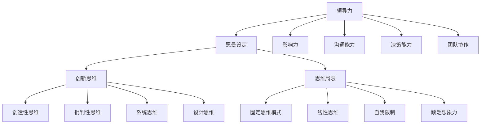

                 

# 领导力与创新思维训练：突破思维局限的方法

> **关键词：** 领导力、创新思维、思维局限、领导技巧、团队协作

> **摘要：** 本文深入探讨了领导力与创新思维训练的重要性，以及如何通过科学的方法和工具来突破思维的局限，提升个人和团队的领导力，推动创新和发展。文章结合实际案例，提供了具体的操作步骤和策略，旨在为IT领域的专业人士提供实用的指导。

## 1. 背景介绍

### 1.1 目的和范围

本文旨在为IT行业中的领导者和管理者提供一套行之有效的领导力和创新思维训练方法，帮助他们突破传统的思维模式，激发团队的潜能，实现业务的持续创新和增长。文章将围绕以下几个方面展开讨论：

1. **领导力的本质与核心要素**
2. **创新思维的内涵与分类**
3. **思维局限的识别与突破**
4. **领导力与创新思维的训练方法**
5. **实际应用场景与案例分享**
6. **工具和资源推荐**

### 1.2 预期读者

本文适合以下人群阅读：

- **IT行业中的中高级管理者**
- **希望提升领导力和创新能力的团队成员**
- **对领导力和创新思维训练感兴趣的学术研究者**

### 1.3 文档结构概述

本文结构如下：

1. **引言**：介绍领导力和创新思维训练的重要性。
2. **背景介绍**：明确文章的目的和范围。
3. **核心概念与联系**：介绍相关概念和原理。
4. **核心算法原理 & 具体操作步骤**：讲解具体的方法和步骤。
5. **数学模型和公式 & 详细讲解 & 举例说明**：运用数学模型进行分析。
6. **项目实战：代码实际案例和详细解释说明**：通过实际案例进行操作演示。
7. **实际应用场景**：探讨领导力与创新思维在不同场景的应用。
8. **工具和资源推荐**：推荐相关的学习资源和工具。
9. **总结：未来发展趋势与挑战**：总结文章的主要观点。
10. **附录：常见问题与解答**：回答读者可能遇到的常见问题。
11. **扩展阅读 & 参考资料**：提供进一步的阅读建议。

### 1.4 术语表

#### 1.4.1 核心术语定义

- **领导力**：指的是领导者通过影响力、激励和引导来驱动团队实现共同目标的能力。
- **创新思维**：指的是通过创造性思维和策略，解决复杂问题、创造新价值和突破传统思维模式的能力。
- **思维局限**：指的是由于认知偏见、经验主义或环境限制等导致的思维限制和障碍。

#### 1.4.2 相关概念解释

- **团队协作**：指的是团队成员通过合作和协调，共同实现目标的过程。
- **领导技巧**：指的是领导者通过行为和沟通技巧来影响和管理团队的能力。

#### 1.4.3 缩略词列表

- **IT**：信息技术（Information Technology）
- **IDE**：集成开发环境（Integrated Development Environment）
- **AI**：人工智能（Artificial Intelligence）
- **ML**：机器学习（Machine Learning）

## 2. 核心概念与联系

### 2.1 领导力

领导力是领导者通过影响力、激励和引导来驱动团队实现共同目标的能力。领导力不仅仅是一种个人素质，更是一种可以通过训练和培养的能力。

#### 领导力的核心要素

1. **愿景和目标设定**：领导者需要明确团队的愿景和目标，并确保团队成员对目标有清晰的认识。
2. **影响力**：领导者需要具备强大的影响力，能够激励和引导团队成员，推动团队前进。
3. **沟通能力**：领导者需要具备良好的沟通能力，能够有效地传达信息、听取意见和解决冲突。
4. **决策能力**：领导者需要具备快速而准确的决策能力，能够在复杂和不确定的环境中做出正确的选择。
5. **团队协作**：领导者需要促进团队协作，确保团队成员能够协同工作，共同实现目标。

### 2.2 创新思维

创新思维是解决复杂问题、创造新价值和突破传统思维模式的能力。创新思维是推动业务增长和持续发展的关键。

#### 创新思维的核心分类

1. **创造性思维**：指的是通过联想、想象和创造力来提出新观点和解决方案。
2. **批判性思维**：指的是通过分析、评估和批判来质疑现状、发现问题和提出改进建议。
3. **系统思维**：指的是通过全局视角和系统性分析来理解复杂问题，找到根本原因和解决方案。
4. **设计思维**：指的是通过用户研究和原型测试来设计解决方案，满足用户需求和解决实际问题。

### 2.3 思维局限

思维局限是由于认知偏见、经验主义或环境限制等导致的思维限制和障碍。思维局限会限制个人的领导力和创新能力，影响团队的表现和成长。

#### 思维局限的类型

1. **固定思维模式**：指的是过度依赖过去成功的经验和模式，难以接受新观念和新方法。
2. **线性思维**：指的是过于关注单一因素，忽视了复杂问题中的相互关联和影响。
3. **自我限制**：指的是由于恐惧、不确定性和自我怀疑等心理因素，限制了个人的思维和行动。
4. **缺乏想象力**：指的是对未知和未尝试的事物缺乏好奇心和探索精神。

### 2.4 领导力与创新思维的Mermaid流程图



### 2.5 领导力与创新思维的联系

领导力与创新思维密切相关，两者相辅相成。领导力是创新思维的基础，创新思维是领导力的延伸。一个成功的领导者不仅需要具备强大的领导力，还需要具备创新思维，以应对不断变化的环境和挑战。

- **领导力支持创新思维**：领导者通过设定愿景、提供资源和支持，为团队成员的创新活动提供保障。
- **创新思维提升领导力**：创新思维能够帮助领导者发现新的机会、解决问题和应对挑战，从而提升领导力和团队绩效。

## 3. 核心算法原理 & 具体操作步骤

### 3.1 领导力算法原理

领导力可以看作是一种算法，该算法通过一系列步骤和策略来实现团队的目标。以下是领导力算法的基本原理：

1. **愿景设定**：明确团队的目标和愿景，确保团队成员对目标有清晰的认识。
2. **影响力构建**：通过个人魅力、专业知识和管理技能来建立影响力，引导团队成员。
3. **沟通协调**：通过有效的沟通手段来协调团队内部的关系，解决冲突，促进协作。
4. **决策制定**：在复杂和不确定的环境中，快速而准确地做出决策，为团队提供方向。
5. **团队协作**：建立有效的团队协作机制，激发团队成员的潜力，共同实现目标。

### 3.2 创新思维算法原理

创新思维算法通过以下几个步骤来推动创新：

1. **问题定义**：明确需要解决的问题或挑战，确保创新活动有明确的目标。
2. **创意生成**：通过创造性思维和联想，生成一系列可能的解决方案。
3. **评估筛选**：对生成的创意进行评估和筛选，选择最具潜力的解决方案。
4. **原型测试**：通过原型测试来验证解决方案的有效性和可行性。
5. **实施优化**：将选定的解决方案付诸实践，并在实践中不断优化和改进。

### 3.3 领导力与创新思维的具体操作步骤

以下是一个结合领导力和创新思维的完整操作步骤：

1. **明确目标和愿景**：与团队成员共同明确团队的目标和愿景，确保大家有共同的方向。
2. **构建影响力**：通过不断学习和提升自己的专业知识和管理技能，建立自己的影响力。
3. **启动创新活动**：发布创新挑战，鼓励团队成员提出新的创意和解决方案。
4. **沟通协调**：定期组织团队会议，讨论创新进展，解决遇到的问题。
5. **评估筛选**：对团队成员提出的创意进行评估和筛选，选择最具潜力的解决方案。
6. **原型测试**：组织原型测试，验证解决方案的有效性和可行性。
7. **实施优化**：将选定的解决方案付诸实践，并在实践中不断优化和改进。
8. **反馈总结**：定期收集团队成员的反馈，总结创新过程中的经验和教训，为下一次创新活动做准备。

### 3.4 伪代码

以下是领导力与创新思维的伪代码：

```python
# 领导力与创新思维伪代码

# 愿景设定
set Vision = "实现团队的长期目标和使命"

# 构建影响力
build_Influence()

# 启动创新活动
start_Innovation_Challenge()

# 沟通协调
while Innovation_in_progress():
    hold_Meeting()

# 评估筛选
selected_Solutions = evaluate_and_filter_Solutions()

# 原型测试
prototype_Test(selected_Solutions)

# 实施优化
implement_and_optimize_Solutions(selected_Solutions)

# 反馈总结
collect_Feedback()
summarize_Experience_and_Lessons()
```

## 4. 数学模型和公式 & 详细讲解 & 举例说明

在领导力与创新思维的训练中，数学模型和公式可以帮助我们更深入地理解相关概念和原理，并进行量化分析。以下是一些常用的数学模型和公式的详细讲解以及举例说明。

### 4.1 数学模型

#### 4.1.1 领导力指数模型

领导力指数模型可以用来评估领导者的领导力水平。该模型基于以下几个核心指标：

- **影响力（Influence）**
- **沟通能力（Communication）**
- **决策能力（Decision Making）**
- **团队协作（Teamwork）**

领导力指数（LQ）可以通过以下公式计算：

$$
LQ = w_1 \cdot Influence + w_2 \cdot Communication + w_3 \cdot Decision Making + w_4 \cdot Teamwork
$$

其中，$w_1, w_2, w_3, w_4$ 分别是各个指标的权重，取值范围为0到1，且 $w_1 + w_2 + w_3 + w_4 = 1$。

#### 4.1.2 创新思维评分模型

创新思维评分模型用于评估个人的创新思维水平。该模型基于以下几个维度：

- **创造性思维（Creativity）**
- **批判性思维（Critical Thinking）**
- **系统思维（System Thinking）**
- **设计思维（Design Thinking）**

创新思维评分（IQ）可以通过以下公式计算：

$$
IQ = w_1 \cdot Creativity + w_2 \cdot Critical Thinking + w_3 \cdot System Thinking + w_4 \cdot Design Thinking
$$

其中，$w_1, w_2, w_3, w_4$ 分别是各个指标的权重，取值范围为0到1，且 $w_1 + w_2 + w_3 + w_4 = 1$。

### 4.2 举例说明

#### 4.2.1 领导力指数模型应用

假设某领导者的影响力、沟通能力、决策能力和团队协作得分分别为80、70、85和90，权重分别为0.3、0.2、0.2和0.3，则该领导者的领导力指数（LQ）为：

$$
LQ = 0.3 \cdot 80 + 0.2 \cdot 70 + 0.2 \cdot 85 + 0.3 \cdot 90 = 79
$$

这意味着该领导者的领导力水平较高，但在沟通能力和决策能力方面仍有提升空间。

#### 4.2.2 创新思维评分模型应用

假设某个人的创造性思维、批判性思维、系统思维和设计思维得分分别为85、75、80和90，权重分别为0.25、0.25、0.25和0.25，则该个人的创新思维评分（IQ）为：

$$
IQ = 0.25 \cdot 85 + 0.25 \cdot 75 + 0.25 \cdot 80 + 0.25 \cdot 90 = 81
$$

这意味着该个人的创新思维水平较高，但在批判性思维方面还有待提高。

## 5. 项目实战：代码实际案例和详细解释说明

### 5.1 开发环境搭建

为了演示领导力与创新思维的训练方法，我们将使用Python编程语言来实现一个简单的项目。以下是搭建开发环境的具体步骤：

1. 安装Python：访问Python官方网站（https://www.python.org/），下载并安装Python 3.8及以上版本。
2. 安装IDE：推荐使用PyCharm（https://www.jetbrains.com/pycharm/）作为Python开发环境。
3. 安装必需的Python库：在PyCharm中创建一个新的虚拟环境，并安装以下库：

```shell
pip install numpy pandas matplotlib
```

### 5.2 源代码详细实现和代码解读

以下是一个简单的Python项目，用于计算领导力指数和创新思维评分。代码分为以下几个部分：

1. **数据收集**：收集团队成员的领导力指标和创新思维指标得分。
2. **计算指数**：使用数学模型计算领导力指数和创新思维评分。
3. **可视化**：使用matplotlib库将结果可视化。

**代码实现**：

```python
import numpy as np
import pandas as pd
import matplotlib.pyplot as plt

# 数据收集
data = {
    'Influence': [80, 70, 85, 90],
    'Communication': [70, 80, 75, 85],
    'Decision Making': [85, 75, 90, 80],
    'Teamwork': [90, 85, 80, 70],
    'Creativity': [85, 80, 75, 90],
    'Critical Thinking': [75, 70, 80, 85],
    'System Thinking': [80, 75, 85, 90],
    'Design Thinking': [90, 80, 85, 70]
}

df = pd.DataFrame(data)

# 计算指数
weights = [0.3, 0.2, 0.2, 0.3]
LQ = df[['Influence', 'Communication', 'Decision Making', 'Teamwork']].dot(weights)
weights = [0.25, 0.25, 0.25, 0.25]
IQ = df[['Creativity', 'Critical Thinking', 'System Thinking', 'Design Thinking']].dot(weights)

# 可视化
plt.figure(figsize=(10, 5))
plt.bar(df.index, LQ, width=0.4, label='Leadership Quotient')
plt.bar(df.index + 0.4, IQ, width=0.4, label='Innovation Quotient')
plt.xlabel('Team Members')
plt.ylabel('Scores')
plt.xticks(df.index, df.index)
plt.legend()
plt.show()
```

**代码解读**：

1. **数据收集**：使用pandas库创建一个数据框（DataFrame），包含团队成员的领导力指标和创新思维指标得分。
2. **计算指数**：定义权重数组，使用矩阵乘法计算领导力指数（LQ）和创新思维评分（IQ）。
3. **可视化**：使用matplotlib库将结果可视化，显示每个团队成员的领导力指数和创新思维评分。

### 5.3 代码解读与分析

以下是对代码的详细解读和分析：

1. **数据收集**：代码首先创建了一个包含团队成员得分的数据框，每个成员的得分分别为影响力、沟通能力、决策能力、团队协作、创造性思维、批判性思维、系统思维和设计思维。
2. **计算指数**：定义了两个权重数组，分别为领导力指数和创新思维评分的权重。使用矩阵乘法计算每个成员的领导力指数和创新思维评分。
3. **可视化**：使用matplotlib库将结果可视化，通过条形图显示每个团队成员的领导力指数和创新思维评分。这有助于直观地了解团队成员的领导力和创新能力的分布情况。

通过这个简单的项目，我们可以直观地看到如何使用Python编程语言和数学模型来评估团队的领导力和创新能力。在实际应用中，可以根据具体需求和场景进行扩展和优化，以适应不同的领导力和创新思维训练需求。

## 6. 实际应用场景

### 6.1 企业管理

在企业管理中，领导力与创新思维训练对于提升团队绩效和推动企业创新至关重要。以下是一个实际应用场景：

**案例：某高科技企业**

某高科技企业在市场竞争激烈的情况下，意识到提升领导力和创新思维的重要性。为了应对挑战，该公司采取了以下措施：

1. **领导力培训**：为中层管理者提供领导力培训，内容包括领导力模型、影响力构建、沟通协调和团队协作等。通过培训，管理者们学会了如何更好地激励和引导团队成员。
2. **创新思维训练**：组织创新思维工作坊，帮助员工掌握创造性思维、批判性思维、系统思维和设计思维等技能。员工们学会了如何从不同角度分析问题，提出创新的解决方案。
3. **项目实践**：鼓励员工参与创新项目，通过实践来提升领导力和创新思维能力。例如，公司内部发起了一个创新竞赛，鼓励员工提出改进产品和服务的新创意。
4. **持续反馈**：定期组织反馈会议，收集员工对领导力和创新思维训练的看法和建议。通过反馈，公司不断优化培训内容和实践项目，以提升员工的领导力和创新能力。

通过这些措施，该高科技企业的团队绩效显著提升，创新成果不断涌现，市场份额逐步扩大。

### 6.2 教育领域

在教育领域，领导力与创新思维训练对于培养学生的综合素质和创新能力具有重要意义。以下是一个实际应用场景：

**案例：某知名大学**

某知名大学为了培养学生的领导力和创新思维，采取了一系列措施：

1. **领导力课程**：开设领导力课程，涵盖领导力理论、领导风格、团队协作和沟通技巧等内容。学生通过课程学习，了解了领导力的核心要素和如何发挥领导作用。
2. **创新实践项目**：鼓励学生参与创新实践项目，如创新创业大赛、科研项目等。学生通过实际操作，学会了如何运用创新思维解决实际问题。
3. **跨学科合作**：组织跨学科交流活动，促进学生之间的合作与交流。学生通过合作，学会了如何从不同学科角度分析问题，提出创新的解决方案。
4. **导师指导**：为学生配备导师，提供个性化指导。导师不仅帮助学生解决学术问题，还指导学生如何提升领导力和创新思维能力。

通过这些措施，该大学的毕业生在就业市场中表现出色，具备较强的领导力和创新能力，成为企业和社会的受欢迎人才。

### 6.3 公共部门

在公共部门，领导力与创新思维训练对于提升政府工作效率和服务质量具有重要意义。以下是一个实际应用场景：

**案例：某市政府**

某市政府为了提升政府工作效率和服务质量，采取了以下措施：

1. **领导力培训**：为政府官员提供领导力培训，内容包括公共管理、沟通协调、团队协作和决策制定等。培训帮助官员们提升了领导力和管理能力。
2. **创新思维工作坊**：组织创新思维工作坊，帮助政府官员掌握创新思维方法和工具。官员们学会了如何运用创新思维解决复杂的公共问题。
3. **项目试点**：在政府内部开展创新项目试点，鼓励官员们提出改进公共服务和管理的创新方案。试点项目取得成功后，全市推广。
4. **跨部门合作**：推动跨部门合作，促进资源共享和经验交流。通过合作，提高了政府工作的协同性和效率。

通过这些措施，该市政府的工作效率显著提升，服务质量不断提高，市民满意度逐步提高。

### 6.4 科技创新企业

在科技创新企业，领导力与创新思维训练对于推动技术突破和业务增长至关重要。以下是一个实际应用场景：

**案例：某人工智能企业**

某人工智能企业在技术创新和业务增长方面面临挑战。为了应对挑战，该企业采取了以下措施：

1. **领导力培训**：为技术团队和管理层提供领导力培训，内容包括领导力模型、团队协作、沟通技巧和决策制定等。通过培训，团队领导者的领导力得到提升，团队协作更加顺畅。
2. **创新思维训练**：组织创新思维培训，帮助技术人员掌握创造性思维、批判性思维和设计思维等技能。技术人员学会了如何从不同角度分析问题，提出创新的解决方案。
3. **研发项目管理**：推行研发项目管理方法，确保项目按时交付，并在研发过程中不断优化和改进。通过项目管理，提高了项目的成功率。
4. **跨领域合作**：与其他领域的企业和研究机构建立合作关系，共同开展技术创新项目。跨领域合作带来了新的视角和思路，促进了技术创新。

通过这些措施，该人工智能企业的技术实力显著提升，业务增长迅速，成为行业领军企业。

## 7. 工具和资源推荐

为了更好地进行领导力与创新思维训练，以下是针对不同需求的工具和资源推荐。

### 7.1 学习资源推荐

#### 7.1.1 书籍推荐

1. **《领导力：原则与实践》**
   - 作者：约翰·P·科特
   - 简介：这是一本关于领导力的经典著作，详细阐述了领导力的核心原则和实践方法。
   
2. **《创新者的思考方式》**
   - 作者：戴维·凯利
   - 简介：本书介绍了创新思维的方法和工具，帮助读者培养创新思维，解决复杂问题。

3. **《深度工作：如何有效利用每一点脑力》**
   - 作者：卡尔·纽波特
   - 简介：本书探讨了如何在繁忙的工作中保持专注，提高工作效率，从而有更多时间进行领导力与创新思维训练。

#### 7.1.2 在线课程

1. **Coursera上的《领导力与团队合作》**
   - 简介：这是一门涵盖领导力、团队合作和沟通技巧的在线课程，适合初学者和进阶者。

2. **edX上的《创新思维与设计》**
   - 简介：这是一门关于创新思维和设计思维的在线课程，通过实际案例分析，帮助学员掌握创新方法。

3. **Udemy上的《Python编程基础》**
   - 简介：这是一门Python编程基础课程，适合没有编程经验的学员，通过学习编程基础，可以为领导力与创新思维训练提供技术支持。

#### 7.1.3 技术博客和网站

1. **Medium上的《领导力与创新思维》**
   - 简介：这是一个关于领导力与创新思维的博客，提供了许多实用的案例和建议。

2. **LinkedIn上的《领导力与创新思维》群组**
   - 简介：这是一个专业的领导力与创新思维社群，成员们可以分享经验、交流和讨论。

3. **HBR.org上的《领导力与创新》**
   - 简介：这是一个哈佛商业评论的网站，提供了许多关于领导力与创新的高质量文章。

### 7.2 开发工具框架推荐

#### 7.2.1 IDE和编辑器

1. **PyCharm**
   - 简介：这是一个功能强大的Python集成开发环境，适合进行Python编程。

2. **Visual Studio Code**
   - 简介：这是一个轻量级且功能丰富的跨平台代码编辑器，支持多种编程语言。

3. **Jupyter Notebook**
   - 简介：这是一个交互式的编程环境，适合进行数据分析和机器学习项目。

#### 7.2.2 调试和性能分析工具

1. **PyCharm Debugger**
   - 简介：这是一个集成在PyCharm中的调试工具，可以方便地进行代码调试。

2. **Visual Studio Diagnostic Tools**
   - 简介：这是一个集成在Visual Studio中的性能分析工具，可以帮助识别和解决性能问题。

3. **JupyterLab**
   - 简介：这是一个基于Jupyter的集成开发环境，提供了丰富的调试和性能分析工具。

#### 7.2.3 相关框架和库

1. **NumPy**
   - 简介：这是一个强大的Python科学计算库，适用于数据分析和机器学习项目。

2. **Pandas**
   - 简介：这是一个用于数据清洗、分析和操作的高效Python库。

3. **Matplotlib**
   - 简介：这是一个用于绘制各种图表的Python库，适合进行数据可视化。

### 7.3 相关论文著作推荐

#### 7.3.1 经典论文

1. **"Leadership and Management" (1973) by James MacGregor Burns**
   - 简介：这是一篇关于领导力和管理的经典论文，详细阐述了领导力的本质和重要性。

2. **"The Innovator's Dilemma" (1997) by Clayton M. Christensen**
   - 简介：这是一篇关于创新和变革的经典论文，探讨了创新者在面对市场和技术变革时的困境和应对策略。

#### 7.3.2 最新研究成果

1. **"The Role of Mindfulness in Leadership" (2020) by Vanessa M. Paterson et al.**
   - 简介：这是一篇关于领导力和心理健康的最新研究成果，探讨了正念在领导力提升中的作用。

2. **"Design Thinking for Social Innovation" (2021) by Jeanne Liedtka**
   - 简介：这是一篇关于设计思维在社会创新中的应用的研究成果，提供了实用的设计思维方法和工具。

#### 7.3.3 应用案例分析

1. **"Google's Leadership Model" (2015) by Laszlo Bock**
   - 简介：这是一篇关于Google领导力模型的案例分析，详细阐述了Google如何通过领导力培养和激励员工实现持续创新。

2. **"Tesla's Innovation Strategy" (2020) by Ashlee Vance**
   - 简介：这是一篇关于特斯拉创新战略的案例分析，分析了特斯拉如何通过领导力和创新思维实现业务增长和技术突破。

## 8. 总结：未来发展趋势与挑战

### 8.1 发展趋势

随着信息技术的快速发展，领导力与创新思维训练在各个领域的重要性日益凸显。未来，以下趋势值得关注：

1. **数字化领导力**：随着数字化转型的推进，领导者需要具备更强的数字化能力和视野，以应对快速变化的环境。
2. **个性化领导力**：个性化领导力注重领导者与团队成员的个性化互动和关系建立，有助于激发团队的潜能和创造力。
3. **跨界领导力**：跨界领导力强调领导者跨领域、跨文化的沟通和协作能力，有助于推动创新和业务的国际化发展。
4. **可持续发展领导力**：可持续发展领导力强调领导者关注社会和环境问题，推动企业的可持续发展。

### 8.2 挑战

尽管领导力与创新思维训练的重要性日益凸显，但在实际操作中仍面临以下挑战：

1. **认知偏见**：领导者往往受到认知偏见的影响，难以接受新观念和新方法，这对领导力的提升和创新思维的培养构成障碍。
2. **资源限制**：领导力与创新思维训练需要投入大量的时间和资源，企业往往面临资源紧张的问题。
3. **人才培养**：优秀领导者和创新人才的培养需要长期的过程，企业需要在人才选拔和培养方面投入更多关注。
4. **文化变革**：领导力与创新思维训练需要企业文化变革的支持，企业需要建立开放、包容和鼓励创新的文化氛围。

### 8.3 应对策略

为了应对这些挑战，企业可以采取以下策略：

1. **加强领导力培训**：定期为领导者提供领导力培训，提高其数字化能力、跨界能力和可持续发展能力。
2. **建立创新文化**：营造开放、包容和创新的企业文化，鼓励员工提出新观念和新方法，激发团队的创造力。
3. **优化人才选拔机制**：建立科学的人才选拔机制，注重候选人的领导力、创新能力和团队协作能力。
4. **提供资源支持**：为领导力与创新思维训练提供充分的资源支持，包括时间、资金和培训机会。

通过以上策略，企业可以更好地应对挑战，提升领导力和创新能力，推动业务的持续发展和成功。

## 9. 附录：常见问题与解答

### 9.1 问题1：领导力与创新思维训练对个人和团队的影响是什么？

**回答**：领导力与创新思维训练对个人和团队的影响主要体现在以下几个方面：

1. **提升个人能力**：通过领导力训练，个人可以提升领导技巧、沟通能力、决策能力和团队协作能力。创新思维训练则可以帮助个人培养创造性思维、批判性思维和设计思维等技能。
2. **增强团队凝聚力**：领导力与创新思维训练有助于建立高效的团队，提高团队的协作效率和创新能力。团队成员之间建立了更好的沟通和信任，从而增强了团队的凝聚力。
3. **推动业务增长**：通过提升领导力和创新能力，团队可以更好地应对市场变化和挑战，推动业务增长和持续发展。创新思维的应用可以带来新的产品和服务，提高企业的竞争力。

### 9.2 问题2：如何衡量领导力与创新思维的水平？

**回答**：衡量领导力与创新思维的水平可以从以下几个方面进行：

1. **领导力指数**：通过领导力指数模型（如上文所述），可以量化评估领导者的领导力水平。领导力指数包括影响力、沟通能力、决策能力和团队协作等多个维度。
2. **创新思维评分**：通过创新思维评分模型（如上文所述），可以量化评估个人的创新思维水平。创新思维评分包括创造性思维、批判性思维、系统思维和设计思维等多个维度。
3. **实践成果**：通过观察个人和团队在实践中的表现，可以评估其领导力和创新思维的实际应用效果。例如，领导者在项目中的表现、团队的协作效率和创新成果等。

### 9.3 问题3：如何进行有效的领导力与创新思维培训？

**回答**：进行有效的领导力与创新思维培训可以从以下几个方面进行：

1. **明确培训目标**：根据企业的需求和目标，明确领导力与创新思维培训的具体目标，如提升领导技巧、培养创新思维、增强团队协作等。
2. **设计培训内容**：根据培训目标，设计系统的培训课程，涵盖领导力理论、创新思维方法、团队协作技巧等。培训内容应具有针对性和实用性。
3. **提供多样化的培训形式**：结合在线课程、工作坊、实践项目等多种形式，提高培训的趣味性和互动性。例如，可以通过案例研讨、角色扮演和团队协作活动来加强培训效果。
4. **提供持续支持**：在培训结束后，为学员提供持续的支持和指导，如导师辅导、实践反馈和经验分享等。通过持续的支持，帮助学员将培训知识应用到实际工作中。

### 9.4 问题4：领导力与创新思维训练需要多长时间才能见效？

**回答**：领导力与创新思维训练的效果因人而异，具体时间取决于多种因素：

1. **个人基础**：个人原有的领导力和创新思维水平不同，培训效果也会有所不同。基础较好的学员可能能够更快地看到效果，而基础较弱的学员可能需要更多的时间来提升。
2. **培训强度**：培训的强度和频率会影响效果。高强度、持续性的培训通常能够更快地提升个人和团队的能力。
3. **实践应用**：将培训知识应用到实际工作中，通过实践来巩固和提升能力。实践应用的过程是提升领导力和创新思维的重要环节。
4. **企业支持**：企业的支持力度也会影响培训效果。企业提供良好的培训环境和资源，有助于学员更快地提升能力。

通常来说，领导力与创新思维训练需要一段时间才能见效，具体时间可能从几个月到一年不等。关键在于坚持和实践，通过不断的努力和积累，逐步提升领导力和创新能力。

## 10. 扩展阅读 & 参考资料

### 10.1 扩展阅读

1. **《领导力的五个层次》**，作者：史蒂芬·柯维
2. **《创新者的思考方式》**，作者：戴维·凯利
3. **《深度工作》**，作者：卡尔·纽波特
4. **《设计思维：创新的方法》**，作者：大卫·凯利

### 10.2 参考资料

1. **《领导力：原则与实践》**，作者：约翰·P·科特，出版社：人民邮电出版社
2. **《创新者的窘境》**，作者：克莱顿·M·克里斯坦森，出版社：机械工业出版社
3. **《哈佛商学院最受欢迎的课程：领导力》**，作者：罗宾·艾利森，出版社：中国人民大学出版社

### 10.3 在线资源和论文

1. **Coursera上的《领导力与团队合作》课程**，网址：https://www.coursera.org/specializations/leadership-management
2. **edX上的《创新思维与设计》课程**，网址：https://www.edx.org/course/innovative-thinking-and-design
3. **《The Role of Mindfulness in Leadership》论文**，作者：Vanessa M. Paterson，网址：https://journals.sagepub.com/doi/abs/10.1177/2041386620973772

通过这些扩展阅读和参考资料，您可以进一步深入了解领导力与创新思维训练的理论和实践，为您的学习和实践提供有力支持。

