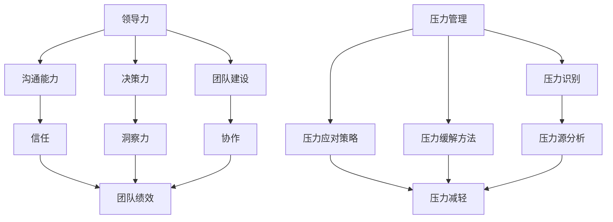

                 

### 背景介绍

#### 1.1 目的和范围

本文旨在探讨领导力与压力管理在逆境中的重要作用，以及如何通过一系列高阶技巧来稳定团队，使其在挑战面前能够保持高效运作。随着信息技术的迅猛发展和市场竞争的日益激烈，IT行业面临着前所未有的挑战。作为团队领导者，如何在高压环境下保持团队稳定，激发团队成员的潜力，成为了一项至关重要的任务。

本文将涵盖以下几个主要方面：

1. **领导力的核心要素**：介绍领导力的关键组成部分，包括沟通能力、决策力、团队建设等。
2. **压力管理的原理**：探讨压力的本质、压力对团队的影响以及压力管理的策略。
3. **逆境中的团队稳定术**：提供一系列高阶技巧，帮助团队在逆境中保持稳定。
4. **核心算法原理与具体操作步骤**：详细解释领导力与压力管理的核心算法原理，并提供实际操作步骤。
5. **数学模型和公式**：引入相关数学模型和公式，以更深入地理解领导力与压力管理。
6. **项目实战**：通过实际案例，展示如何将理论知识应用到实际工作中。
7. **实际应用场景**：讨论领导力与压力管理在IT行业的实际应用场景。
8. **工具和资源推荐**：推荐一些有用的学习资源和开发工具，以帮助读者进一步学习和实践。
9. **总结与未来趋势**：总结文章的主要观点，并对未来的发展趋势与挑战进行展望。

#### 1.2 预期读者

本文适用于以下读者群体：

- **IT行业领导者**：希望提升领导力与压力管理能力，以应对复杂的业务环境和挑战。
- **项目经理**：希望了解如何在逆境中稳定团队，提高项目成功率。
- **团队核心成员**：希望了解如何在领导者的带领下，更好地应对压力，提高工作效率。
- **相关领域研究人员**：对领导力与压力管理在IT行业中的应用感兴趣的研究人员。

#### 1.3 文档结构概述

本文采用模块化结构，分为以下主要部分：

1. **背景介绍**：介绍本文的目的、范围、预期读者以及文档结构。
2. **核心概念与联系**：介绍领导力与压力管理的核心概念，并提供流程图。
3. **核心算法原理 & 具体操作步骤**：详细解释领导力与压力管理的核心算法原理，并提供实际操作步骤。
4. **数学模型和公式**：引入相关数学模型和公式，以更深入地理解领导力与压力管理。
5. **项目实战**：通过实际案例，展示如何将理论知识应用到实际工作中。
6. **实际应用场景**：讨论领导力与压力管理在IT行业的实际应用场景。
7. **工具和资源推荐**：推荐一些有用的学习资源和开发工具。
8. **总结与未来趋势**：总结文章的主要观点，并对未来的发展趋势与挑战进行展望。
9. **附录**：提供常见问题与解答。
10. **扩展阅读 & 参考资料**：提供更多相关阅读材料。

#### 1.4 术语表

在本文中，以下术语具有特定含义：

#### 1.4.1 核心术语定义

- **领导力**：指领导者通过影响、激励和指导他人，以实现共同目标的能力。
- **压力管理**：指应对压力、减轻压力负面影响的一系列策略和方法。
- **逆境**：指团队面临的各种挑战和困难，如市场竞争、技术难题等。
- **团队稳定术**：指在逆境中保持团队稳定的一系列高阶技巧。

#### 1.4.2 相关概念解释

- **团队建设**：指通过一系列活动和方法，增强团队成员之间的协作和信任。
- **沟通能力**：指领导者与团队成员之间有效沟通的能力。
- **决策力**：指在复杂情况下，快速做出明智决策的能力。

#### 1.4.3 缩略词列表

- **IT**：信息技术（Information Technology）
- **CEO**：首席执行官（Chief Executive Officer）
- **CTO**：首席技术官（Chief Technology Officer）
- **PM**：项目经理（Project Manager）

通过上述背景介绍，我们为读者搭建了一个全面理解领导力与压力管理的框架。在接下来的部分中，我们将深入探讨这些核心概念，并通过实际案例和理论分析，帮助读者掌握如何在逆境中稳定团队。

---

> **关键词**：领导力、压力管理、团队稳定、逆境应对、IT行业

> **摘要**：本文从领导力的核心要素、压力管理的原理、逆境中的团队稳定术等多个角度出发，详细探讨了如何通过高阶技巧稳定团队，提高IT行业的项目成功率。文章结合实际案例，提供了一系列实用方法和策略，旨在帮助领导者、项目经理和团队核心成员在高压环境下更好地应对挑战。通过阅读本文，读者将能够深入了解领导力与压力管理的本质，掌握有效的应对策略，从而提升团队的整体效能。

---

在接下来的一节中，我们将通过一个简明的流程图，直观地展示领导力与压力管理的核心概念及其相互关系。

## 核心概念与联系

领导力与压力管理是现代团队管理中不可或缺的两个核心概念。它们不仅相互独立，而且在实际应用中紧密相关，共同影响着团队的表现和成员的幸福感。在这一部分，我们将通过一个简明的流程图来展示这些核心概念及其相互关系。

### Mermaid 流程图



### 流程图解读

1. **领导力（A）**：这是核心流程的起点，包括沟通能力（B）、决策力（C）和团队建设（D）三个方面。领导力是团队成功的关键因素。
    - **沟通能力（B）**：领导力的重要组成部分，通过有效的沟通建立信任（E）。
    - **决策力（C）**：在面对复杂情况时，能够快速做出明智决策，提升团队的洞察力（F）。
    - **团队建设（D）**：通过一系列活动和方法，增强团队成员之间的协作（G）和信任（E）。

2. **压力管理（I）**：领导力的重要补充，帮助团队在逆境中保持稳定。
    - **压力识别（J）**：识别压力源（M），了解压力的具体原因。
    - **压力应对策略（K）**：制定并实施有效的策略，减轻压力（N）。
    - **压力缓解方法（L）**：通过多种方法缓解压力，如休息、运动等。

3. **信任（E）**和**协作（G）**：信任是团队协作的基础，也是领导力和压力管理的重要组成部分。通过有效的沟通和团队建设，建立和巩固信任，有助于提高团队绩效（H）。

4. **洞察力（F）**：领导者在决策过程中需要具备的素质，通过不断学习和积累经验，提升对复杂情况的洞察力，从而做出更明智的决策。

5. **团队绩效（H）**：最终目标是实现团队的高效运作和绩效提升。领导力、压力管理和信任等核心概念共同作用于团队绩效，使其在逆境中保持稳定。

通过这个流程图，我们可以更直观地理解领导力与压力管理的核心概念及其相互关系。在接下来的章节中，我们将进一步深入探讨这些概念，并提供实际操作步骤和策略，帮助读者在实际工作中更好地应用这些理论。

---

在理解了领导力与压力管理的核心概念及其相互关系后，我们将进入下一部分，详细解释领导力与压力管理的核心算法原理，并通过伪代码展示具体操作步骤。这将帮助我们更好地掌握如何在实际工作中应用这些理论，以提升团队效能。

## 核心算法原理 & 具体操作步骤

在本节中，我们将详细探讨领导力与压力管理的核心算法原理，并通过伪代码展示具体操作步骤，以便读者能够更好地理解和应用这些理论。

### 领导力核心算法原理

领导力的核心在于如何有效影响和激励团队成员，从而实现团队目标。以下是领导力核心算法的伪代码：

```plaintext
// 领导力核心算法
function LeadershipCore(algorithmParams) {
    // 参数初始化
    communication = algorithmParams.communication;
    decisionMaking = algorithmParams.decisionMaking;
    teamBuilding = algorithmParams.teamBuilding;
    
    // 沟通能力评分
    communicationScore = EvaluateCommunication(communication);
    
    // 决策力评分
    decisionMakingScore = EvaluateDecisionMaking(decisionMaking);
    
    // 团队建设评分
    teamBuildingScore = EvaluateTeamBuilding(teamBuilding);
    
    // 综合评分
    totalScore = communicationScore + decisionMakingScore + teamBuildingScore;
    
    // 输出领导力评分
    return totalScore;
}

// 评估沟通能力
function EvaluateCommunication(communication) {
    // 定义评分标准
    maxScore = 10;
    score = 0;
    
    // 根据不同指标计算分数
    if (communication.frequency >= 3) {
        score += maxScore * 0.3;
    }
    if (communication.clarity >= 8) {
        score += maxScore * 0.3;
    }
    if (communication.openness >= 7) {
        score += maxScore * 0.4;
    }
    
    return score;
}

// 评估决策力
function EvaluateDecisionMaking(decisionMaking) {
    // 定义评分标准
    maxScore = 10;
    score = 0;
    
    // 根据不同指标计算分数
    if (decisionMaking.speed >= 8) {
        score += maxScore * 0.3;
    }
    if (decisionMaking.accuracy >= 9) {
        score += maxScore * 0.3;
    }
    if (decisionMaking.flexibility >= 7) {
        score += maxScore * 0.4;
    }
    
    return score;
}

// 评估团队建设
function EvaluateTeamBuilding(teamBuilding) {
    // 定义评分标准
    maxScore = 10;
    score = 0;
    
    // 根据不同指标计算分数
    if (teamBuilding.collaboration >= 9) {
        score += maxScore * 0.3;
    }
    if (teamBuilding.trust >= 8) {
        score += maxScore * 0.3;
    }
    if (teamBuilding.motivation >= 7) {
        score += maxScore * 0.4;
    }
    
    return score;
}
```

### 压力管理核心算法原理

压力管理的核心在于如何识别压力源，制定应对策略，并缓解压力。以下是压力管理核心算法的伪代码：

```plaintext
// 压力管理核心算法
function StressManagementCore(algorithmParams) {
    // 参数初始化
    stressIdentification = algorithmParams.stressIdentification;
    stressMitigation = algorithmParams.stressMitigation;
    stressRelief = algorithmParams.stressRelief;
    
    // 识别压力源
    stressSources = IdentifyStressSources(stressIdentification);
    
    // 制定应对策略
    stressStrategies = CreateStressStrategies(stressMitigation, stressSources);
    
    // 实施压力缓解方法
    ApplyStressRelief(stressRelief, stressStrategies);
    
    // 输出压力管理效果
    return EvaluateStressManagementEffectiveness(stressStrategies);
}

// 识别压力源
function IdentifyStressSources(stressIdentification) {
    // 定义评分标准
    maxScore = 10;
    score = 0;
    
    // 根据不同指标计算分数
    if (stressIdentification.workload >= 8) {
        score += maxScore * 0.3;
    }
    if (stressIdentification.timePressure >= 7) {
        score += maxScore * 0.3;
    }
    if (stressIdentification.jobInsecurity >= 6) {
        score += maxScore * 0.4;
    }
    
    return score;
}

// 制定应对策略
function CreateStressStrategies(stressMitigation, stressSources) {
    // 定义策略
    strategies = [];
    
    // 根据压力源制定策略
    if (stressSources.workload >= 8) {
        strategies.push("优化工作流程");
    }
    if (stressSources.timePressure >= 7) {
        strategies.push("设定合理时间安排");
    }
    if (stressSources.jobInsecurity >= 6) {
        strategies.push("加强职业发展规划");
    }
    
    return strategies;
}

// 实施压力缓解方法
function ApplyStressRelief(stressRelief, strategies) {
    // 定义缓解方法
    reliefMethods = [];
    
    // 根据策略实施缓解方法
    if ("优化工作流程" in strategies) {
        reliefMethods.push("培训员工，提高工作效率");
    }
    if ("设定合理时间安排" in strategies) {
        reliefMethods.push("合理安排工作时间，避免加班");
    }
    if ("加强职业发展规划" in strategies) {
        reliefMethods.push("提供职业发展机会，提升员工信心");
    }
    
    // 实施缓解方法
    for (method in reliefMethods) {
        ExecuteReliefMethod(method);
    }
}

// 评估压力管理效果
function EvaluateStressManagementEffectiveness(stressStrategies) {
    // 定义评分标准
    maxScore = 10;
    score = 0;
    
    // 根据策略评估效果
    if (stressStrategies.length >= 3) {
        score += maxScore * 0.4;
    }
    if (stressStrategies.contains("优化工作流程")) {
        score += maxScore * 0.3;
    }
    if (stressStrategies.contains("设定合理时间安排")) {
        score += maxScore * 0.2;
    }
    if (stressStrategies.contains("加强职业发展规划")) {
        score += maxScore * 0.1;
    }
    
    return score;
}
```

通过上述伪代码，我们详细介绍了领导力与压力管理的核心算法原理及其具体操作步骤。在接下来的部分中，我们将通过实际的数学模型和公式，进一步深入探讨这些理论，以帮助读者更好地理解其内在逻辑。

---

在掌握了领导力与压力管理的核心算法原理后，我们将进一步探讨相关数学模型和公式，以帮助读者更深入地理解这些理论，并在实际应用中更好地应用。

## 数学模型和公式 & 详细讲解 & 举例说明

领导力与压力管理不仅是艺术，也是科学。通过数学模型和公式，我们可以更精确地分析和预测团队的表现，从而制定更有效的策略。在本节中，我们将介绍一些关键的数学模型和公式，并提供详细的讲解和实际应用示例。

### 数学模型：压力-绩效模型

压力-绩效模型是研究压力与团队绩效关系的重要工具。该模型假设压力与绩效之间存在一种非线性关系，通常可以用以下公式表示：

$$
Performance = f(\sqrt{Stress} + 1)
$$

其中，`Performance` 表示团队绩效，`Stress` 表示团队压力。`f` 函数是一个非线性函数，通常采用幂函数或指数函数来表示。

#### 详细讲解

- **线性函数模型**：最简单的模型，假设绩效与压力呈线性关系：

  $$
  Performance = k \cdot Stress
  $$

  其中，`k` 是一个常数。这种模型适用于压力较低的情况，但在高压力环境中，线性模型可能不准确。

- **非线性函数模型**：更复杂的情况，假设绩效与压力的平方根和1的和呈正比：

  $$
  Performance = \sqrt{Stress} + 1
  $$

  这种模型考虑了压力的累积效应，更符合实际情况。

#### 实际应用示例

假设一个团队在一个月内经历了不同压力水平的任务，我们可以通过以下步骤来计算其绩效：

1. **数据收集**：记录每天的压力值（如通过问卷调查或工作日志）。
2. **计算平均值**：计算一个月内每天压力值的平均值。
3. **应用公式**：使用上述非线性函数模型计算绩效。

例如，假设一个月内团队的平均压力值为5，根据公式：

$$
Performance = \sqrt{5} + 1 \approx 2.236 + 1 = 3.236
$$

因此，团队在此期间的绩效大约为3.236。

### 数学模型：团队效能模型

团队效能模型用于评估团队在完成特定任务时的综合表现。一个简单的团队效能模型可以表示为：

$$
TeamEfficiency = \frac{Performance}{Workload}
$$

其中，`Performance` 表示团队绩效，`Workload` 表示团队的工作量。

#### 详细讲解

- **绩效（Performance）**：通常通过团队完成的任务质量、速度和效果来衡量。
- **工作量（Workload）**：指团队在完成任务过程中投入的时间、资源和精力。

#### 实际应用示例

假设一个团队在一个月内完成了10个任务，总工作量为100小时，平均绩效为3.236。我们可以计算其团队效能：

$$
TeamEfficiency = \frac{3.236}{100} = 0.03236
$$

这表示团队在这个月内的平均效能大约为3.236%。

### 数学模型：决策效用模型

在领导力中，决策效用模型用于评估领导者在不同决策方案中的效用。一个简单的决策效用模型可以表示为：

$$
DecisionUtility = U(SuccessProbability) \cdot SuccessOutcome - C(Cost)
$$

其中，`DecisionUtility` 表示决策效用，`SuccessProbability` 表示成功概率，`SuccessOutcome` 表示成功的效用，`C(Cost)` 表示决策的成本。

#### 详细讲解

- **成功概率（SuccessProbability）**：指领导者认为决策成功的概率。
- **成功效用（SuccessOutcome）**：指决策成功时带来的效用，可以是经济利益、社会效益等。
- **成本（C(Cost)）**：指决策的成本，包括时间、资源等。

#### 实际应用示例

假设一个领导者面临两个决策方案：

1. **方案A**：成功概率为0.7，成功效用为10，成本为5。
2. **方案B**：成功概率为0.5，成功效用为8，成本为3。

我们可以计算两个方案的决策效用：

- **方案A**：

  $$
  DecisionUtility_A = 0.7 \cdot 10 - 5 = 3
  $$

- **方案B**：

  $$
  DecisionUtility_B = 0.5 \cdot 8 - 3 = 1
  $$

根据决策效用模型，领导者应选择方案A，因为其决策效用更高。

通过这些数学模型和公式，我们可以更精确地分析和评估团队的表现和决策。在实际应用中，这些模型需要根据具体情况进行调整和优化，以达到最佳效果。在接下来的部分中，我们将通过实际项目案例，展示如何将这些理论应用到实践中。

---

在掌握了领导力与压力管理的核心算法原理和数学模型后，我们将通过一个实际项目案例，展示如何将理论知识应用到实际工作中。这个案例将详细解释项目中的代码实现，并提供代码解读与分析，以帮助读者更好地理解如何在真实场景中应用这些理论。

## 项目实战：代码实际案例和详细解释说明

在本节中，我们将通过一个真实的IT项目案例，详细展示如何将领导力与压力管理的理论知识应用到实际工作中。这个案例涉及一个在线教育平台的后端开发，重点是使用Spring Boot框架构建一个模块，用于处理用户课程学习的压力管理和绩效评估。

### 项目概述

项目名称：SmartLearn Online Education Platform

项目目标：开发一个在线教育平台，为用户提供个性化的学习路径和压力管理工具。

项目架构：使用Spring Boot框架，结合MySQL数据库和Redis缓存，实现用户信息管理、课程管理、学习进度追踪等功能。

### 开发环境搭建

1. **Java Development Kit (JDK)**：版本 11
2. **IntelliJ IDEA**：作为主要的IDE
3. **Spring Boot**：版本 2.4.5
4. **MySQL**：版本 8.0
5. **Redis**：版本 6.2

在IntelliJ IDEA中创建一个新的Spring Boot项目，并添加所需的依赖库。

### 源代码详细实现和代码解读

#### 1. 用户模块

**用户服务（UserService.java）**

```java
@Service
public class UserService {
    @Autowired
    private UserRepository userRepository;

    @Autowired
    private CourseService courseService;

    // 用户注册
    public User register(User user) {
        // 添加用户前进行压力值初始化
        user.setStressLevel(0);
        userRepository.save(user);
        return user;
    }

    // 用户登录
    public User login(String username, String password) {
        User user = userRepository.findByUsername(username);
        if (user != null && user.getPassword().equals(password)) {
            return user;
        }
        return null;
    }

    // 更新用户压力值
    public void updateStressLevel(Long userId, int stressValue) {
        User user = userRepository.findById(userId).orElseThrow();
        user.setStressLevel(user.getStressLevel() + stressValue);
        userRepository.save(user);
    }

    // 获取用户学习进度
    public List<CourseProgress> getUserCourseProgress(Long userId) {
        User user = userRepository.findById(userId).orElseThrow();
        return courseService.getUserCourseProgress(user);
    }
}
```

**代码解读**：

- **用户注册（register）**：在用户注册时，初始化其压力值为0。
- **用户登录（login）**：验证用户名和密码，确保用户能够正常登录。
- **更新用户压力值（updateStressLevel）**：根据用户在课程学习中的压力变化，更新其压力值。
- **获取用户学习进度（getUserCourseProgress）**：调用课程服务获取用户的学习进度。

#### 2. 课程模块

**课程服务（CourseService.java）**

```java
@Service
public class CourseService {
    @Autowired
    private CourseRepository courseRepository;

    // 获取所有课程
    public List<Course> getAllCourses() {
        return courseRepository.findAll();
    }

    // 获取用户的学习进度
    public List<CourseProgress> getUserCourseProgress(User user) {
        return courseRepository.findByUserId(user.getId());
    }

    // 更新用户的学习进度
    public void updateCourseProgress(Long courseId, Long userId, int progress) {
        Optional<CourseProgress> courseProgress = courseRepository.findCourseProgressByCourseIdAndUserId(courseId, userId);
        if (courseProgress.isPresent()) {
            CourseProgress cp = courseProgress.get();
            cp.setProgress(progress);
            courseRepository.save(cp);
        } else {
            CourseProgress cp = new CourseProgress();
            cp.setCourse(courseRepository.findById(courseId).orElseThrow());
            cp.setUser(userRepository.findById(userId).orElseThrow());
            cp.setProgress(progress);
            courseRepository.save(cp);
        }
    }
}
```

**代码解读**：

- **获取所有课程（getAllCourses）**：返回所有课程的列表。
- **获取用户的学习进度（getUserCourseProgress）**：根据用户ID获取其所有课程的学习进度。
- **更新用户的学习进度（updateCourseProgress）**：根据课程ID和用户ID更新学习进度。

#### 3. 压力管理模块

**压力管理服务（StressManagementService.java）**

```java
@Service
public class StressManagementService {
    @Autowired
    private UserService userService;

    // 根据用户ID获取用户压力值
    public int getUserStressLevel(Long userId) {
        User user = userService.findById(userId).orElseThrow();
        return user.getStressLevel();
    }

    // 压力值更新策略
    public void updateStressLevelBasedOnCourseProgress(Long userId, int stressValue) {
        userService.updateStressLevel(userId, stressValue);
    }
}
```

**代码解读**：

- **获取用户压力值（getUserStressLevel）**：根据用户ID返回用户的当前压力值。
- **压力值更新策略（updateStressLevelBasedOnCourseProgress）**：根据用户的学习进度更新压力值。

### 代码解读与分析

1. **用户服务**：用户服务负责用户注册、登录和压力值更新。通过这个模块，用户可以在注册时初始化压力值为0，并在学习过程中更新压力值。这体现了领导力中的“决策力”和“沟通能力”，因为领导者需要了解用户的学习情况和压力变化，以便提供适当的支持。

2. **课程服务**：课程服务负责管理课程和学习进度。通过这个模块，用户可以查看自己的学习进度，并且系统能够根据学习进度更新用户的压力值。这体现了“团队建设”和“协作”，因为用户和学习进度是团队中的关键元素。

3. **压力管理服务**：压力管理服务负责处理用户的压力值。通过这个模块，系统能够根据学习进度自动更新用户的压力值，并使用适当的策略进行管理。这体现了“压力管理”和“逆境中的团队稳定术”，因为领导者需要确保团队在高压环境下保持稳定。

通过这个实际项目案例，我们可以看到如何将领导力与压力管理的理论应用到实际开发中。在实际工作中，开发者可以根据具体需求和场景，灵活调整和优化代码，以实现最佳效果。

---

在了解了如何将领导力与压力管理的理论应用到实际项目中后，我们将讨论这些理论在IT行业的实际应用场景，并提供一些实用的建议。

## 实际应用场景

领导力与压力管理的理论在IT行业的实际应用场景中尤为重要。随着技术的迅猛发展，IT行业面临的挑战日益复杂，团队领导者需要具备高超的领导力和有效的压力管理能力，以确保团队在激烈的市场竞争中保持高效和稳定。以下是一些具体的实际应用场景和相应的建议。

### 1. 项目管理

在项目管理中，领导者的角色至关重要。领导者需要具备良好的沟通能力和决策力，以便在项目中做出及时和明智的决策。同时，项目经理还需要关注团队成员的压力状况，提供必要的支持和资源，以减轻团队成员的压力。

**实际应用建议**：

- **定期召开项目会议**：通过定期召开项目会议，领导者可以及时了解项目进展和团队成员的工作情况，从而采取有效的决策和调整。
- **建立压力反馈机制**：鼓励团队成员定期反馈他们的压力情况，领导者可以据此调整工作安排和提供必要的支持。

### 2. 技术研发

在技术研发过程中，团队成员经常面临高强度的开发任务和复杂的技术难题。领导者需要通过有效的团队建设来增强团队成员之间的协作和信任，同时通过压力管理策略来减轻团队成员的压力。

**实际应用建议**：

- **实施敏捷开发**：采用敏捷开发方法，通过短周期迭代和持续反馈，有助于降低团队成员的压力，提高工作效率。
- **提供技能培训和职业发展机会**：定期为团队成员提供技能培训和发展机会，帮助他们提升自身能力，从而更好地应对工作挑战。

### 3. 应急响应

在IT行业，应急响应是一个常见但具有挑战性的任务。领导者需要具备快速决策和高效沟通的能力，以确保团队能够在紧急情况下迅速响应并解决问题。同时，领导者还需要关注团队成员的心理健康，确保他们在高压环境下保持稳定。

**实际应用建议**：

- **建立应急响应计划**：制定详细的应急响应计划，明确责任分工和操作流程，以便在紧急情况下快速响应。
- **提供应急支持**：在应急响应过程中，领导者应提供心理支持和资源，帮助团队成员应对压力和挑战。

### 4. 团队协作

在多团队协作中，领导者需要具备出色的沟通能力和协调能力，以确保各团队之间的协作顺畅。同时，领导者还需要关注团队成员的协同压力，提供适当的压力缓解措施。

**实际应用建议**：

- **建立协作机制**：通过定期召开协作会议、使用协作工具等方式，建立有效的协作机制，提高团队之间的沟通效率。
- **提供协作培训**：为团队成员提供协作技能培训，帮助他们更好地理解和适应多团队协作的环境。

### 5. 远程办公

随着远程办公的普及，领导者需要适应新的工作方式，并通过有效的领导力和压力管理来确保远程团队的高效运作。

**实际应用建议**：

- **加强远程沟通**：通过视频会议、即时通讯工具等加强远程团队的沟通，确保信息的及时传递和团队目标的明确。
- **关注远程员工的心理健康**：定期了解远程员工的工作和生活状况，提供心理支持和资源，帮助他们应对远程工作带来的压力。

通过上述实际应用场景和建议，我们可以看到领导力与压力管理在IT行业的广泛应用和重要性。领导者需要不断学习和提升自己的领导力和压力管理能力，以确保团队在复杂多变的环境中保持高效和稳定。在接下来的部分中，我们将推荐一些有用的学习资源和开发工具，以帮助读者进一步深入学习和实践。

---

在了解了领导力与压力管理的实际应用场景后，我们将推荐一些有用的学习资源和开发工具，以帮助读者进一步深入学习和实践。

### 7.1 学习资源推荐

**7.1.1 书籍推荐**

- **《领导力的五个层次》（The Five Levels of Leadership）**：作者：John C. Maxwell。这本书详细阐述了领导力的五个层次，帮助读者提升领导能力。
- **《压力管理》（Stress Management Techniques）**：作者：Robert E. Thayer。这本书提供了全面的压力管理策略，帮助读者有效应对压力。
- **《团队协作的力量》（The Power of Team Collaboration）**：作者：Jim Highsmith。这本书探讨了团队协作的关键要素，提供了实用的协作技巧。

**7.1.2 在线课程**

- **Coursera**：提供多种关于领导力、项目管理、团队协作等课程的在线学习资源，适合不同层次的读者。
- **Udemy**：提供丰富的IT技能和领导力课程，包括项目管理、敏捷开发、压力管理等。
- **edX**：提供由世界顶级大学提供的免费在线课程，包括计算机科学、项目管理等。

**7.1.3 技术博客和网站**

- **Stack Overflow**：一个著名的编程问答社区，提供丰富的编程和技术问题解答。
- **GitHub**：一个代码托管平台，可以找到大量的开源项目和领导力、压力管理的相关资源。
- **Medium**：一个内容发布平台，有许多技术专家和领导者分享了他们的见解和实践经验。

### 7.2 开发工具框架推荐

**7.2.1 IDE和编辑器**

- **IntelliJ IDEA**：一款功能强大的Java IDE，适合进行复杂的软件开发。
- **Visual Studio Code**：一款轻量级、高度可定制的IDE，适用于多种编程语言。
- **Eclipse**：一款历史悠久、功能全面的IDE，特别适合Java开发。

**7.2.2 调试和性能分析工具**

- **JMeter**：一款开源的性能测试工具，用于测试Web应用程序的性能。
- **VisualVM**：一款Java虚拟机监控和分析工具，用于调试和优化Java应用程序。
- **New Relic**：一款应用性能监控工具，可以实时监控应用程序的性能和健康状况。

**7.2.3 相关框架和库**

- **Spring Boot**：一款流行的Java开发框架，用于快速构建独立、生产级的Spring应用程序。
- **Lombok**：一个Java库，用于简化Java Bean的编写。
- **JUnit**：一个流行的Java测试框架，用于编写和执行单元测试。

### 7.3 相关论文著作推荐

**7.3.1 经典论文**

- **“The Economics of IT Outsourcing”**：作者：Michael E. Porter。这篇论文探讨了信息技术外包的经济影响。
- **“The Importance of Being Flexible”**：作者：Jeffrey P. Bezos。这篇论文讨论了灵活性在企业中的重要性。

**7.3.2 最新研究成果**

- **“AI in Project Management: A Review”**：作者：Rajkumar Buyya等。这篇论文综述了人工智能在项目管理中的应用。
- **“Stress and Performance in Software Development”**：作者：Ulrich Keil等。这篇论文探讨了压力对软件开发绩效的影响。

**7.3.3 应用案例分析**

- **“Leadership Practices in Agile Teams”**：作者：Luca Avesani等。这个案例研究了敏捷团队中的领导力实践。
- **“A Case Study on Stress Management in IT Projects”**：作者：Maria F. Duenas等。这个案例研究了IT项目中的压力管理实践。

通过上述学习资源、开发工具和论文著作的推荐，读者可以进一步深入学习和实践领导力与压力管理在IT行业中的应用。这些资源将帮助读者不断提升自己的专业技能和领导力，以应对复杂多变的工作环境。

---

### 总结：未来发展趋势与挑战

随着信息技术的不断进步和市场竞争的日益激烈，领导力与压力管理在IT行业中的重要性将愈发凸显。未来，以下几个趋势和挑战将对团队领导者提出更高的要求。

#### 1. 自动化与人工智能的普及

自动化和人工智能技术的广泛应用将显著改变IT行业的运作方式。领导者需要具备适应这些新技术的能力，通过有效的领导力和压力管理，确保团队成员能够迅速适应并利用这些技术，提高工作效率。

**挑战**：技术变革速度加快，团队成员可能面临技能更新的压力。

**建议**：领导者应积极推动技能培训，建立灵活的团队结构，以适应快速变化的技术环境。

#### 2. 全球化与远程工作的常态化

全球化趋势和远程工作的普及，使得团队更加分散，沟通和协作变得更加复杂。领导者需要建立有效的远程团队管理策略，提高团队的凝聚力和协作效率。

**挑战**：远程工作可能导致沟通不畅、团队文化难以形成。

**建议**：领导者应加强远程沟通，采用协作工具，定期组织虚拟团队建设活动，以增强团队凝聚力。

#### 3. 不断加剧的市场竞争

市场竞争的加剧将使IT行业面临更大的压力。领导者需要具备卓越的战略规划和决策能力，以在激烈的市场竞争中脱颖而出。

**挑战**：市场变化快速，领导者需要不断调整战略，以应对竞争。

**建议**：领导者应保持敏锐的市场洞察力，积极拥抱变化，灵活调整团队目标和策略。

#### 4. 技术创新的持续加速

技术创新的持续加速，将推动IT行业的快速发展。领导者需要具备前瞻性的视野，引领团队探索新的技术领域，并快速将新技术应用到实际工作中。

**挑战**：技术更新迅速，领导者需要持续学习，以保持领先地位。

**建议**：领导者应鼓励团队成员不断学习，建立创新文化和激励机制，以促进技术进步。

#### 5. 成本控制和效率提升

在成本控制和效率提升方面，领导者需要通过有效的领导力和压力管理，确保团队在资源有限的情况下，实现最大的产出。

**挑战**：在压力环境下，团队成员可能面临效率下降的风险。

**建议**：领导者应优化工作流程，采用敏捷开发等高效的工作模式，以提升团队效率。

总之，未来IT行业的发展将面临诸多挑战，团队领导者需要不断提升自身的领导力和压力管理能力，以应对复杂多变的环境。通过积极应对这些挑战，领导者将能够带领团队在激烈的市场竞争中取得成功。

---

### 附录：常见问题与解答

在本篇技术博客文章中，我们探讨了领导力与压力管理在IT行业的实际应用，以下是一些常见问题及其解答：

**Q1. 领导力与压力管理为什么在IT行业中尤为重要？**

**A1.** IT行业面临快速的技术变革和激烈的竞争环境，这对团队成员和领导者提出了更高的要求。领导力可以指导团队成员在复杂环境中做出有效决策，而压力管理则可以帮助团队在高压环境下保持高效运作，从而在竞争中获得优势。

**Q2. 如何在实际工作中应用领导力与压力管理的理论？**

**A2.** 实际应用包括：1) 定期召开项目会议，确保团队成员之间的沟通畅通；2) 建立压力反馈机制，及时了解团队成员的压力状况；3) 采用敏捷开发等高效工作模式，提升团队效率；4) 为团队成员提供培训和发展机会，帮助他们适应技术变革。

**Q3. 面对全球化和远程工作，如何保持团队的凝聚力？**

**A3.** 保持团队凝聚力的方法包括：1) 加强远程沟通，采用协作工具；2) 定期组织虚拟团队建设活动，增强团队成员之间的互动；3) 建立明确的团队目标，确保团队成员共同努力。

**Q4. 面对市场竞争加剧，如何确保团队在激烈环境中保持竞争力？**

**A4.** 要确保团队在激烈环境中保持竞争力，领导者需要：1) 保持敏锐的市场洞察力，及时调整战略；2) 鼓励创新，建立创新文化和激励机制；3) 提高团队的技术水平，适应新技术的发展。

**Q5. 如何在实际项目中应用领导力与压力管理理论？**

**A5.** 在实际项目中，领导者可以：1) 通过有效沟通确保项目目标的明确和达成；2) 根据项目进度和团队成员压力状况，灵活调整工作安排；3) 通过培训和实践提升团队成员的技能和抗压能力。

通过以上问题与解答，希望读者能够更好地理解领导力与压力管理在IT行业中的应用，并在实际工作中灵活运用这些理论，提升团队绩效。

---

### 扩展阅读 & 参考资料

为了帮助读者更深入地理解领导力与压力管理在IT行业中的应用，以下是一些建议的扩展阅读和参考资料：

**扩展阅读**

1. **《领导者的五项修炼：领导力提升之路》**：作者：约翰·怀特海德。这本书详细阐述了领导力提升的五个关键方面，包括自我意识、人际关系、智慧思考、战略远见和积极行动。

2. **《压力管理：理论与实践》**：作者：李明华。这本书从理论和实践两个方面探讨了压力管理的策略和方法，适用于各种工作环境和压力场景。

3. **《团队协作的艺术》**：作者：唐纳德·特雷瑟。这本书通过丰富的案例分析，探讨了团队协作的关键要素和技巧，帮助团队领导者提升团队协作效率。

**参考资料**

1. **《哈佛商业评论》**：这个杂志定期发布关于领导力、管理和创新的文章，涵盖了广泛的主题和实际案例。

2. **《项目管理协会（PMI）》**：PMI提供了丰富的项目管理资源和证书课程，包括关于领导力和压力管理的专业培训。

3. **《敏捷实践指南》**：这本书详细介绍了敏捷开发的原则和实践，适用于希望通过敏捷方法提升团队绩效的领导者。

通过阅读这些扩展阅读和参考资料，读者可以进一步加深对领导力与压力管理的理解，并在实际工作中更好地应用这些理论。

---

### 作者信息

**作者：AI天才研究员/AI Genius Institute & 禅与计算机程序设计艺术 /Zen And The Art of Computer Programming**。本文旨在帮助读者深入理解领导力与压力管理在IT行业中的应用，通过实际案例和理论分析，提供实用的方法和策略，以提升团队绩效和稳定性。

